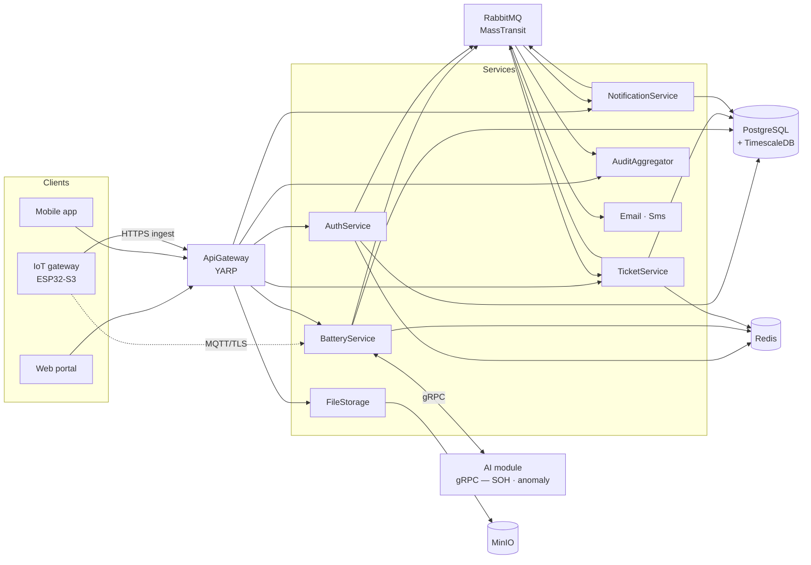
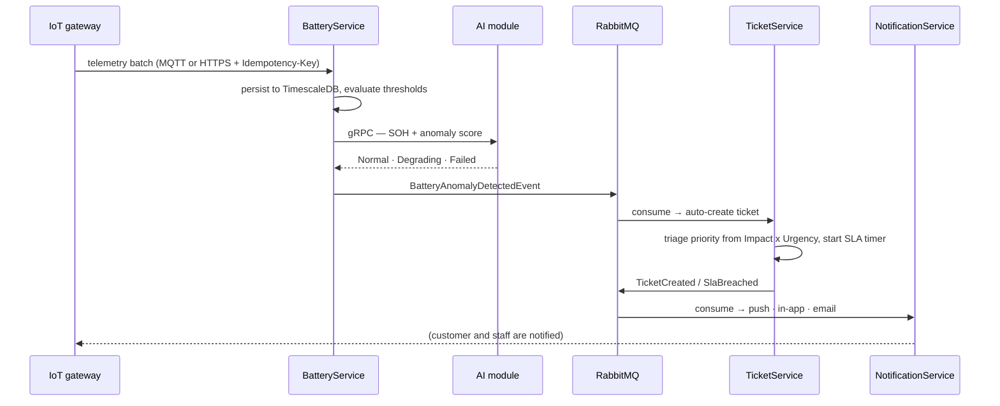

<div align="center">

# Solar Battery Maintenance — Backend

**.NET 9 microservices behind the solar battery monitoring platform: telemetry ingestion, anomaly → alert → ticket automation, SLA timers, and the notification pipeline.**

[](https://dotnet.microsoft.com)
[](https://www.timescale.com)
[](https://masstransit.io)
[](https://redis.io)
[](https://microsoft.github.io/reverse-proxy/)
[](https://opentelemetry.io)
[](deploy/helm)

</div>

---

The service layer of the **Solar Lithium-ion Battery Maintenance Management System** (capstone GSU26SE55). It ingests telemetry from ESP32 gateways over MQTT and HTTPS, scores it against thresholds and the AI module, and drives the whole incident lifecycle — anomaly → alert → ticket → SLA timer → notification — for the [web portal](../frontend), the [mobile app](../fork-mobile/mobile) and the [IoT firmware](../iot).

## Table of contents

- [Services](#services)
- [Architecture](#architecture)
- [The core flow](#the-core-flow)
- [Requirements](#requirements)
- [Getting started](#getting-started)
- [Everyday commands](#everyday-commands)
- [Solution layout](#solution-layout)
- [Engineering rules](#engineering-rules)
- [Testing & CI](#testing--ci)
- [Observability](#observability)
- [Deployment](#deployment)
- [Documentation map](#documentation-map)
- [Contributing workflow](#contributing-workflow)
- [Team](#team)

---

## Services

Nine ASP.NET Core services, each with its own database, behind one YARP gateway.

| Service | Local port | Responsibility |
| --- | :---: | --- |
| **ApiGateway** | `4001` | YARP reverse proxy — the single entry point for web, mobile and devices |
| **AuthService** | `4002` | Accounts, JWT + refresh, Google OAuth, 2FA, trusted devices, roles & permissions |
| **EmailService** | `4003` | Transactional email — invitations, OTP, password reset, alert digests |
| **SmsService** | `4004` | SMS gateway integration and delivery tracking |
| **FileStorageService** | `4005` | MinIO-backed uploads: attachments, avatars, maintenance evidence, firmware images |
| **BatteryService** | `4006` | Batteries, sites, sensor readings (TimescaleDB), thresholds, IoT devices, MQTT ingest, AI bridge |
| **TicketService** | `4007` | Ticket lifecycle, SLA timers and calendar, maintenance logs, comments, escalation, chat hub |
| **NotificationService** | `4008` | Push/in-app/email fan-out, groups, templates, quiet hours, delivery history |
| **AuditAggregatorService** | `4010` | Cross-service audit trail aggregation and querying |

Supporting containers in the dev stack: PostgreSQL + TimescaleDB (`5433`), Redis (`6380`), RabbitMQ (`5673`, UI `15673`), MinIO (`9090` / console `9091`), Mosquitto (MQTT profile), the AI module (gRPC + HTTP `4015`), and the observability stack.

---

## Architecture



Every service follows the same four-layer Clean Architecture split, with dependencies pointing inwards only:

```
ServiceName/
├── ServiceName.Api/             → controllers, Program.cs        (→ Application, Infrastructure)
├── ServiceName.Application/     → CQRS handlers, DTOs, validation (→ Domain only)
├── ServiceName.Domain/          → entities, enums                 (→ nothing)
└── ServiceName.Infrastructure/  → DbContext, repositories, consumers, DI, background jobs
```

Shared libraries live in [`shared/src`](shared/src): `SharedKernels` (base entities, `IGenericRepository`, `IUnitOfWork`), `SharedContracts` (DTOs, integration events) and `SharedInfrastructure` (middleware, MediatR behaviours, caching, message bus, OpenTelemetry).

---

## The core flow

What the whole system exists to do — a reading arrives, and a technician ends up on site before anything burns:



SLA follows ITIL priority bands — **P1 4h · P2 24h · P3 72h** — fixed for the life of a ticket. A breach escalates people and tier, it never extends the deadline. Non-working days come from the SLA calendar and are excluded when a deadline is computed.

---

## Requirements

- **.NET SDK 9.0.100+** (pinned in [`global.json`](global.json))
- **Docker + Docker Compose** — for the dependency stack and integration tests
- **GNU Make** — every routine command is a Make target
- Optional: `trivy` for the container/filesystem security stage

---

## Getting started

```bash
cp .env.Docker.example .env.Docker     # fill in secrets
make docker-up                         # whole stack: services + infra + observability
make docker-ps                         # check what is healthy
```

Gateway on <http://localhost:4001>, Grafana on <http://localhost:3001>, RabbitMQ UI on <http://localhost:15673>, MinIO console on <http://localhost:9091>.

Prefer to run the code on the host instead of in containers:

```bash
make restore build                     # whole solution
make run SVC=BatteryService            # one service
make watch SVC=TicketService           # hot reload
make run-all                           # every service + gateway in parallel (logs/run-all/*.log)
```

---

## Everyday commands

`make help` lists every target. The ones you will actually use:

| Command | What it does |
| --- | --- |
| `make build` · `make rebuild` | Build the solution (Debug) / clean + restore + build |
| `make format` | `dotnet format` across the solution |
| `make test` | All tests |
| `make test-svc SVC=BatteryService` | One service's tests |
| `make test-coverage` | Tests + XPlat code coverage |
| `make ci-fast` | preflight → build → unit tests → rule checks — the dev inner loop |
| `make ci` | Full local CI: format, build, tests, rules, NuGet audit, Trivy |
| `make ci-full` | `ci` plus integration tests (needs Docker) |
| `make migration-add SVC=… NAME=…` | Add an EF Core migration |
| `make migration-update SVC=…` | Apply migrations |
| `make migration-rollback-test SVC=… NAME=…` | Roll back to `NAME` and re-apply — required for schema changes |
| `make docker-up` · `docker-logs SVC=…` · `docker-down` | Dev stack lifecycle |
| `make zap-scan ZAP_SVC=authservice` | OWASP ZAP baseline scan |

---

## Solution layout

```
backend/
├── services/                    # 9 services, each Api · Application · Domain · Infrastructure + tests
│   ├── ApiGateway/              # YARP reverse proxy
│   ├── AuthService/  EmailService/  SmsService/  FileStorageService/
│   ├── BatteryService/  TicketService/  NotificationService/  AuditAggregatorService/
├── shared/src/                  # SharedKernels · SharedContracts · SharedInfrastructure
├── tests/                       # cross-service E2E (account projection)
├── docker/                      # per-service Dockerfiles + entrypoints
├── docker-compose*.yml          # dev stack · overrides · production
├── deploy/                      # helm/ · k8s/ · jenkins/ · systemd/ · production/ · contracts/
├── monitoring/                  # Prometheus rules, Grafana dashboards, Alertmanager, Loki, Tempo
├── eng/                         # build engineering — banned-API rules for the audit analyzer
├── ci/ · scripts/ · tools/      # CI helpers, operational scripts, dev tooling
├── docs/                        # architecture, ADRs, API and runbook documentation
└── Makefile · Directory.Build.props · global.json
```

---

## Engineering rules

These are enforced by review and, where possible, by the `make ci-rules` analyzers. Full text in `.claude/rules/tech/be.md`.

**Repository contract — the most common source of bugs:**

```csharp
// ✅ correct
var q = _unitOfWork.Batteries.GetAllAsync().Where(x => !x.IsDeleted); // SYNC, returns IQueryable
_unitOfWork.Batteries.UpdateAsync(entity);       // VOID — no await
_unitOfWork.Batteries.DeleteAsync(entity);       // VOID — no await
await _unitOfWork.Batteries.AddAsync(entity);    // async — await

// ❌ wrong
var q = await _unitOfWork.Batteries.GetAllAsync();
await _unitOfWork.Batteries.UpdateAsync(entity);
```

The `Async` suffix on `GetAllAsync` is legacy from `SharedKernels` and is **not** changing — read the signature, not the name.

- There is **no global query filter**: every query needs `.Where(x => !x.IsDeleted)` explicitly.
- Entities extend `AuditableEntity`; primary keys are `Guid`; enum values start at `1`, never `0`.
- Controllers only call `_mediator.Send()`. Handlers only inject `IUnitOfWork`, never `DbContext`.
- Validation runs in a MediatR pipeline behaviour via `IValidatable.ValidateAsync()` and collects **all** errors before returning.
- Responses are wrapped in `CommonResponse<T>`; field errors go in `ListErrors` as `{ Field, Detail }`.
- No AutoMapper — map inline in the handler. `Guid` → `string` in outward-facing DTOs.
- Integration events are `record` types; publish **after** `CommitTransactionAsync()` unless the service has an outbox.
- Audit correctness (analyzer-enforced under `-p:EnableAuditBannedApis=true`): `DateTime.UtcNow` not `DateTime.Now`, GUID v7 not `System.Random` for event ids, `ILogger` not `Console.WriteLine`.

---

## Testing & CI

```bash
make test                       # everything
make test-svc SVC=TicketService # one service
make test-coverage              # + coverage report
make ci-full                    # what CI runs, integration tests included
```

Every service ships unit tests (handlers with a mocked unit of work) and integration tests (real endpoints against Dockerised dependencies). Performance tests are tagged `Category=Performance` and excluded from the normal run — they need an idle machine to mean anything (`make test-perf`).

`make ci` runs the same stages as the pipeline, in order: preflight (tool versions) → format check → Release build → unit tests → project rule checks (diffed against `BASE_REF`) → NuGet vulnerability audit (fails on High/Critical) → Trivy filesystem scan. [`Jenkinsfile`](Jenkinsfile) drives it in CI.

Quality gate for a ticket: **≥ 80 % line coverage**, `dotnet format` clean, all rule checks green.

---

## Observability

The dev stack brings up the full pipeline, wired through OpenTelemetry in `SharedInfrastructure`:

| Tool | Local | Purpose |
| --- | --- | --- |
| Grafana | `:3001` | Dashboards — [`monitoring/`](monitoring) holds the provisioned definitions |
| Prometheus | `:9094` | Metrics via `prometheus-net`, plus node / cAdvisor / Postgres / Redis exporters |
| Tempo | `:3200` | Distributed traces (OTLP in on `4317`, internal only) |
| Loki + Promtail | `:3100` | Log aggregation |
| Alertmanager | `:9095` | Alert routing, including a Discord receiver |

Alert rules live in two places that must agree — `make sync-alert-rules` after editing, and `make check-alert-rules` verifies it (CI runs the same check).

---

## Deployment

Production runs on **K3s with Helm** ([`deploy/helm/solar-battery`](deploy/helm)). Public TLS comes from a cert-manager `ClusterIssuer` (`tlsIssuer` in values — staging defaults to `letsencrypt-staging` for the higher rate limit); ingress hostnames are set per environment in the values overlay. The `mqtt-public-tls` certificate the cluster issues is shared with the MQTT broker, which runs as a separate Docker workload beside the cluster on the IoT side.

> [!IMPORTANT]
> **[`PRODUCTION_DEPLOYMENT_BACKEND_IOT.md`](PRODUCTION_DEPLOYMENT_BACKEND_IOT.md) is the single production runbook** for backend K3s + IoT Docker + Jenkins. Everything under `deploy/` is a manifest, template or script that runbook uses. Older staging / Jenkins-in-K3s guides no longer apply to the current architecture.

---

## Documentation map

| File | What is in it |
| --- | --- |
| [`PROJECT_OVERVIEW.md`](PROJECT_OVERVIEW.md) | The project in plain language — the problem, the users, what the system does |
| [`overall.md`](overall.md) | Master roadmap: sprints, entities, business rules, priority matrix |
| [`PRODUCTION_DEPLOYMENT_BACKEND_IOT.md`](PRODUCTION_DEPLOYMENT_BACKEND_IOT.md) | Production runbook (backend + IoT + Jenkins) |
| [`DATA_IMPORT.md`](DATA_IMPORT.md) | Third-party data import format and procedure |
| [`battery-db-tables.md`](battery-db-tables.md) | BatteryService schema reference |
| [`iot.md`](iot.md), [`iot-co-che-hoat-dong.md`](iot-co-che-hoat-dong.md) | IoT contract and how the device pipeline works |
| [`ticket-chat-hub.md`](ticket-chat-hub.md) | SignalR ticket chat design |
| [`CHANGELOG.md`](CHANGELOG.md) | Release notes |
| [`docs/`](docs) | ADRs, API contracts, deeper design notes |

---

## Contributing workflow

One issue → one branch → one PR.

```bash
git switch -c feat/GH-123-short-slug
# implement, then:
make ci-fast
git commit -m "feat(#123): short description"
```

- Branches: `feat/GH-<n>-slug`, `fix/GH-<n>-slug`, `chore/…`, `docs/…`, `refactor/…`, `test/…`
- Commits: `type(#<issue>): description`
- PR body must contain `Closes #<issue>`
- Never push to `main` or `dev` directly; every PR needs ≥ 1 approving review and authors do not merge their own
- Migrations need a working `Down()`, a rollback test, and a default value or backfill for any new `NOT NULL` column
- Never commit `.env`, `.env.Docker` or `.claude/CLAUDE.local.md`

---

## Team

Capstone project **GSU26SE55** — supervisor: Trương Long. Backend maintainers:

| Name | Student ID | GitHub |
| --- | --- | --- |
| Bùi Phước Thắng | SE180445 | [@Alexdev257](https://github.com/Alexdev257) |
| Nguyễn Phúc Duy | SE184821 | [@DuyNguyen-3006](https://github.com/DuyNguyen-3006) |
| Mai Hồng Thái | SE183923 | [@relentless-spirit](https://github.com/relentless-spirit) |
