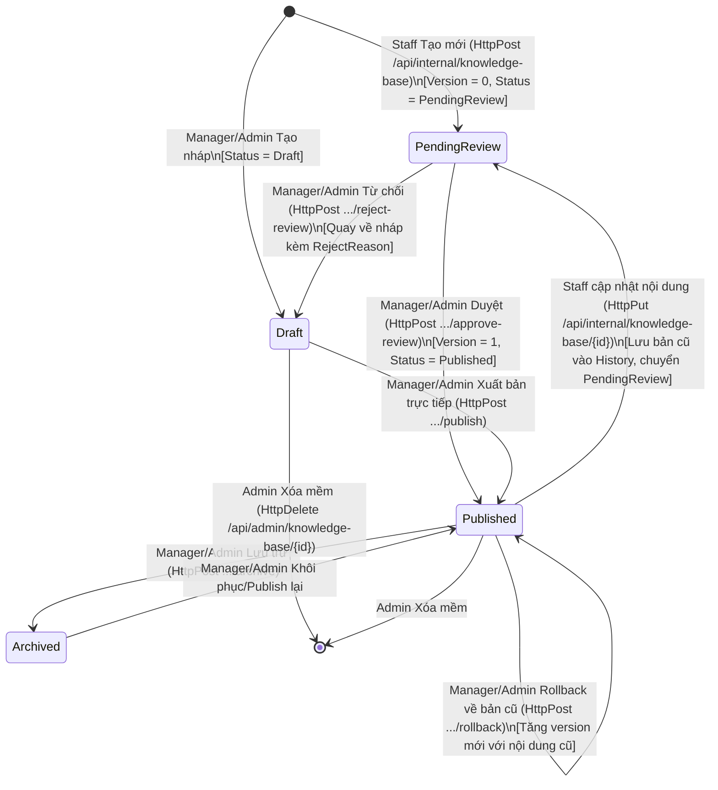

# OVERALL — Roadmap Backend GSU26SE55 (Full Detail Edition)

> **Document type:** Master backlog & technical specification + capstone project plan
> **Scope:** Toàn bộ backend còn lại để cover Core Business Flow (4 role · 6 phase · ticket state machine · SLA escalation · BR-01..BR-08 + 4 entity bổ sung) + Sprint 5B Alert–Ticket Saga execution + post-Sprint 8 defense prep.
> **Source of truth:** `core-business-flow.html` + `.claude/CLAUDE.md` + `.claude/rules/*` + `.claude/memory.md`.
> **Audience:** Leader + 3 BE Dev (Duy, Thắng, Thái) + 2 FE Dev (Trí, Minh) + GVHD (post-Sprint 8 dry-run review).
> **Cập nhật:** 2026-06-22 (v5.1) · Rename Sprint Comment → **Sprint Chat** (TicketService Chat Hub — 74 task `#CHAT-01..74` / `#501..#574`, 9 phase ~65 dev-day, 11 bảng mới, ~40 endpoint, 1 SignalR Hub) + Phần XI §70 overview + deprecate §36 phần Chat redirect tới `ticket-chat-hub.md` (xem §67 version log). Lưu ý: §2.x (TicketComment entity/API hiện hành, đã build) giữ nguyên tên "Comment" vì code thật chưa rename.

---

## Mục lục

- [Phần I — Bối cảnh](#phần-i--bối-cảnh)
  - [0. Trạng thái codebase hiện tại](#0-trạng-thái-codebase-hiện-tại)
  - [0bis. Stack & infra hiện hữu](#0bis-stack--infra-hiện-hữu)
- [Phần II — Microservices nghiệp vụ phải xây](#phần-ii--microservices-nghiệp-vụ-phải-xây)
  - [1. BatteryService](#1-batteryservice--p0)
  - [2. TicketService](#2-ticketservice--p0)
  - [3. NotificationService](#3-notificationservice--p1)
  - [4. KnowledgeBase module](#4-knowledgebase-module-trong-ticketservice--p2)
  - [5. Reporting endpoints](#5-reporting-endpoints--p2)
- [Phần III — Hạ tầng & cross-cutting](#phần-iii--hạ-tầng--cross-cutting)
  - [6. TimescaleDB integration](#6-timescaledb-integration--p1)
  - [6bis. FileStorage metadata foundation](#6bis-filestorage-metadata-foundation--p1)
  - [7. Mở rộng AuthService cho profile + skill](#7-mở-rộng-authservice-cho-profile--skill--p1)
  - [8. Cross-cutting concerns](#8-cross-cutting-concerns--p1)
  - [9. Observability](#9-observability--hoàn-thiện-p2)
  - [10. API Gateway hoàn thiện](#10-api-gateway-hoàn-thiện--p1)
- [Phần IV — Quality & operations](#phần-iv--quality--operations)
  - [11. Test strategy](#11-test-strategy-coverage--80-p1)
  - [12. Seed data & migration](#12-seed-data--migration-strategy-p1)
  - [13. Performance & caching](#13-performance--caching-strategy)
  - [14. Security checklist](#14-security-checklist)
  - [15. Email/Notification template catalog](#15-emailnotification-template-catalog)
- [Phần V — Lập kế hoạch](#phần-v--lập-kế-hoạch)
  - [16. Scaffold workflow](#16-scaffold-workflow-cho-từng-service)
  - [17. Sprint backlog 8 sprint](#17-sprint-backlog--8-sprint-chi-tiết)
  - [18. Definition of Done](#18-definition-of-done)
- [Phần VI — Phụ lục](#phần-vi--phụ-lục)
  - [20. Permission matrix](#20-permission-matrix-đầy-đủ)
  - [21. Error code catalog](#21-error-code-catalog)
  - [22. JWT claim structure](#22-jwt-claim-structure)
  - [23. Risk register](#23-risk-register)
  - [24. Checklist 6 phase business flow](#24-checklist-theo-6-phase-business-flow)
  - [25. Câu hỏi cần thống nhất](#25-câu-hỏi-cần-thống-nhất-trước-khi-bắt-đầu)
  - [26. Glossary & references](#26-glossary--references)
  - [27. Troubleshooting playbook](#27-troubleshooting-playbook)
  - [28. Tóm tắt files/paths tạo mới](#28-tóm-tắt-filespaths-cần-tạo)
- [Phần VII — Bổ sung sau review](#phần-vii--bổ-sung-sau-review-gap-analysis)
  - [30. AI Module integration](#30-ai-module-integration--p0)
  - [31. Site & BatteryGroup](#31-site--batterygroup-entities--p0)
  - [32. Ticket relationships](#32-ticket-relationships--parent-child-merge-watch--p0)
  - [33. SLA pause limits & advanced](#33-sla-pause-limits--advanced--p0)
  - [34. Real-time updates (SSE)](#34-real-time-updates-sse--push-channel--p0)
  - [35. Bulk operations + QR onboarding](#35-bulk-operations--qr-onboarding--p1)
  - [36. Chat / MaintenanceLog advanced](#36-chat--maintenancelog-advanced--p1)
  - [37. Alert silence/snooze + escalation](#37-alert-silence--snooze--ack-escalation--p1)
  - [38. Edge case business rules matrix](#38-edge-case-business-rules-matrix--p0)
  - [39. GDPR & compliance](#39-gdpr--compliance--p1)
  - [40. Operational documents](#40-operational-documents-adr--dr--runbook--p1)
  - [41. Maintenance schedule (preventive)](#41-preventive-maintenance-schedule--p2)
  - [42. Parts inventory](#42-parts-inventory--p2)
  - [43. Public KB + self-help](#43-public-knowledge-base--customer-self-help--p2)
  - [44. Mobile deep linking + Staff field](#44-mobile-deep-linking--staff-field-features--p1)
  - [45. Webhook outbound + public API](#45-webhook-outbound--public-api--p2)
  - [46. Advanced testing & chaos](#46-advanced-testing--chaos-engineering--p2)
  - [47. Security hardening additional](#47-security-hardening-additional--p1)
  - [48. AI feedback loop & analytics](#48-ai-feedback-loop--analytics--p1)
  - [49. Notification advanced](#49-notification-advanced-digest--batching--p1)
  - [50. Updated sprint backlog impact](#50-updated-sprint-backlog-impact)
- [Phần VIII — Bổ sung lần 2 (Final completeness)](#phần-viii--bổ-sung-lần-2-final-completeness)
  - [52. IoT Edge Device & Device Management](#52-iot-edge-device--device-management--p0)
  - [52bis. IoT implementation plan](#52bis-iot-implementation-plan)
  - [53. Battery scope reduction & Alert–Ticket Saga](#53-battery-scope-reduction--alertticket-saga--p0)
  - [54. Production Deployment (K8s + Helm)](#54-production-deployment-k8s--helm--p1)
  - [55. Mobile/Web App Management](#55-mobileweb-app-management--p1)
  - [56. Demo & Presentation Deliverables](#56-demo--presentation-deliverables--p0)
  - [57. AI advanced (deployment, retrain, batching)](#57-ai-advanced--deployment-retrain-batching--p1)
  - [58. Edge cases extension (EC-21..EC-34)](#58-edge-cases-extension-ec-21ec-34--p0)
  - [59. GDPR + security additional](#59-gdpr--security-additional--p1)
  - [60. Internal admin tools](#60-internal-admin-tools--p2)
  - [61. Search functionality](#61-search-functionality--p1)
  - [62. Media pipeline + accessibility](#62-media-pipeline--accessibility--p2)
  - [63. Customer success metrics](#63-customer-success-metrics--p2)
  - [64. Status page + maintenance broadcast](#64-status-page--maintenance-broadcast--p1)
  - [65. Documentation auto-generation](#65-documentation-auto-generation--p2)
  - [66. Final completeness checklist](#66-final-completeness-checklist)
  - [67. Tóm tắt final — file đầy đủ chưa?](#67-tóm-tắt-final--file-đầy-đủ-chưa)
- [Phần IX — SmsService SMS Forwarder Gateway](#phần-ix--smsservice-sms-forwarder-gateway)
  - [68. SmsService — SMS Forwarder Gateway](#68-smsservice--sms-forwarder-gateway--p1) — xem **Sprint SMS** ở §17 (42 task `#SMS-01..42` / `#293..#334`)
- [Phần X — AuthService Security Audit](#phần-x--authservice-security-audit)
  - [69. AuthService Security Audit (88 issues)](#69-authservice-security-audit-88-issues--p0p3) — xem **Sprint additional-auth** ở §17 (90 task `#AUTH-01..90` / `#349..#438`)
  - [69.11. Sprint audit — kiến trúc AuditLog Hybrid](#6911-sprint-audit--kiến-trúc-auditlog-hybrid-phụ-lục-ab-issue-authservicemd) — Phụ lục A+B `issue-authservice.md` triển khai qua **Sprint audit** ở §17 (45 task `#AUDIT-01..45` / `#447..#491`)
- [Phần XI — TicketService Chat Hub](#phần-xi--ticketservice-chat-hub)
  - [70. TicketService Chat Hub (136 feature, 25 nhóm)](#70-ticketservice-chat-hub-136-feature-25-nhóm--p0p2) — chi tiết kiến trúc ở `ticket-chat-hub.md` triển khai qua **Sprint Chat** ở §17 (74 task `#CHAT-01..74` / `#501..#574`)

---

# Phần I — Bối cảnh

## 0. Trạng thái codebase hiện tại

### 0.1. Đã có (DONE)

| Module | Trạng thái | Chi tiết |
|--------|-----------|----------|
| **`AuthService`** | ✅ Production-ready + profile extension | Account/Role/Permission/Session/RefreshToken/AuditLog/LoginAttempt/OTP/Outbox + Admin CRUD + Google OAuth helper + `AccountProfile`/`StaffProfile`/`StaffSkill` extension tables + uploaded/Google avatar flow. **Note:** `AuditLog` sẽ refactor schema (thêm 14 cột chuẩn + outbox riêng) qua Sprint audit Phase 1 — xem §17 + §69.11 |
| **`ApiGateway`** | ✅ Hoạt động | Route tới AuthService, port 4001 |
| **`EmailService`** | ✅ Consumer-only | Subscribe SendOtpRegisterEvent, SendAdminInviteEvent, SendPasswordResetOtpEvent, SendEmailChangeOtpEvent |
| **`SmsService`** | ✅ Consumer-only | Subscribe SendPhoneOtpEvent |
| **`FileStorageService`** | ✅ Metadata foundation ready | MinIO backend, signed URLs, `UploadedFile` metadata table, upload response trả `fileId`, metadata/presigned/download/delete theo `fileId` |
| **`SharedKernels`** | ✅ Done | `BaseEntity`, `AuditableEntity`, `IHardDeleteEntity`, `IGenericRepository`, `IUnitOfWork` |
| **`SharedInfrastructure`** | ⚠️ Foundation; hardening pending | Middleware (Global exception, CorrelationId, RequestLogging, SecurityHeaders, IdempotencyKey), Behaviors (Validation, Logging), Caching (Redis), Bus (MassTransit + correlation filters; retry/durable scheduler pending Sprint 5B `#235`), Redis Inbox hiện tại chưa transaction-safe cho DB consumer, Metrics, Swagger extensions, EnvFileLoader |
| **`SharedContracts`** | ✅ Foundation | Core response/event contracts done; Alert–Ticket Saga contracts pending Sprint 5B `#236` |
| **Docker compose** | ✅ Done | `timescale/timescaledb:latest-pg16`, postgres-init tạo logical DB riêng (`auth_db`, `file_storage_db`), redis:7, rabbitmq:3-management, minio, prometheus, grafana, loki, alertmanager |
| **CI/CD** | ✅ Done | GitHub Actions: detect-changes (matrix per service), build/unit-test/integration-test, dotnet format, Trivy filesystem scan, PR title validation (semantic), PR size warning, project rules check |
| **Pre-commit** | ✅ Done; Sprint 5B mở rộng | `.pre-commit-config.yaml` với dotnet format, secret-scan; Sprint 5B `#233` thêm hook `energy-co2-scope-guard` (xem §53.2ter) |
| **Hooks Claude** | ✅ Done | `.claude/hooks/be/*.sh`: block-dangerous, protect-sensitive, check-build, post-edit-feedback, validate-namespace, check-di-registration, check-dbcontext-update |

### 0.2. CHƯA có — Roadmap (phần chính document này)

| Service / Module | Status | Section | Details |
|------------------|----------|---------|-----------------|
| `BatteryService` | ✅ Core done | §1 | Core CRUD + Sensor batch ingest + Threshold detection + Alert deduplication; **không quản lý Energy/CO2 analytics** |
| `TicketService` | ✅ Core done | §2 | CQRS + Ticket State Machine + SLA/Activity/Reopen done; Alert–Ticket Saga pending Sprint 5B |
| IoT Edge Device backend + Device Management (ESP32 + hybrid HTTPS/MQTT) | 🔴 P0 | §52/§52bis + `newiot.md`/`overall.iot.md` | 1 sprint song song + hardware track |
| `NotificationService` (4 dự án, consumers + Expo push) | 🟠 P1 | §3 | 2 sprint |
| KnowledgeBase (module nội bộ TicketService) | 🟡 P2 | §4 | 0.5 sprint |
| Reporting endpoints (mỗi service expose) | 🟡 P2 | §5 | 1 sprint |
| TimescaleDB extension + hypertable | 🟠 P1 | §6 | 0.5 sprint |
| FileStorage metadata (`UploadedFile`) | ✅ Done | §6bis | Completed 13/5/2026 |
| AuthService profile expansion (avatar, phone, skill) | ✅ Done | §7 | Completed 13/5/2026 |
| AuthService 2FA Hardening (login challenge + confirm setup + encrypt secret + backup codes + admin reset) | 🟠 P1 | §0.5, ADR-019 | Sprint 3 — GH-295 (in-flight, supersedes Option B) |
| BatteryService scope cleanup (bỏ Energy/CO2 + `Site.CapacityKw`) | 🔴 P0 | §53.1–§53.3 | Sprint 5B `#233`/`#234` |
| Outbox/Inbox hardening + Alert–Ticket Saga | 🔴 P0 | §8.1–§8.3, §53.4–§53.12 | Sprint 5B `#235`–`#239` |
| AuthService permission seed cho Saga (`ticket.saga.view/reprocess`) | 🔴 P0 | §7.5bis, §53.9 | Sprint 5B `#241` |
| Documentation sync (Swagger/Postman/SRS/CHANGELOG/runbook/Mermaid) | 🔴 P0 | §65, §40.3, §53.2bis | Sprint 5B `#240` |
| ADR-017 (Energy/CO2 removal) + ADR-018 (Saga orchestration) | 🔴 P0 | §40.1 | Sprint 5B `#233`/`#239` |
| **`AuditAggregatorService`** (microservice MỚI) + 10 service onboard audit + AuditLog Hybrid Architecture | 🟠 P1 | §17 Sprint audit + §69.11 | **Sprint audit** ~44 dev-day, 7 phase, 45 task `#AUDIT-01..45` / `#447..#491`. Owner **Thắng (`@Alexdev257`)** (assigned 2026-06-24); gate "ổn định ≥ 2 tuần" **waived** (sole-dev, hard-blocker code đã merge). ADR-0007 ✅ viết xong. Decisions chốt 2026-06-24 — xem §17 Decision Log. |
| **Sprint Bonus** (newsprint — Min/Max streaming + audit pipeline fixes) | 🟢 bonus | §17 Sprint Bonus + `newsprint.md` | 27 task `#NS-01..27` — 25 issue BE đã tạo GitHub `#646..#670` (milestone Sprint Bonus). ✅ **22/22 task active DONE 2026-07-31**, merged `dev` qua PR `#689`; `#646..#667` đã ở **cột In Review**, `#668/#669/#670` giữ cột Plan (deferred cách ly pin), 2 FE (NS-05/NS-19) ở repo `frontend`. 6 phase active ~22 dev-day + deferred cách ly pin ~9.5. Feature min/max streaming (PA-2/3/4) + vá noise N1–N6 / cascade R1–R8 / môi trường E1–E4 / classification F1–F2. Quyết định chốt 2026-07-14 (Q1–Q13) — xem `newsprint.md`. |
| **Sprint 6.2** (Notification pipeline completion — review 2026-07-14) | 🔴 P1 | §17 Sprint 6.2 + `reviewnotification.md` | 17 task `#NOTI-01..17` = GitHub `#672..#688` (milestone Sprint 6.2), ~14 dev-day. ✅ **17/17 DONE 2026-07-31**, merged `dev` qua PR `#718`; toàn bộ đã ở **cột In Review**. Vấn đề gốc: `NotificationDispatcher` dead code (0 caller) → Push/Email/SMS không bao giờ gửi; + orphan events (publish nhưng 0 consumer) + gap routing matrix §3.4. **THÊM 6 · SỬA 8 · XOÁ 1 · 2 fork THÊM/XOÁ; 5 điểm cần chốt.** Nguồn: `reviewnotification.md` §7. |
| **Sprint 6.3** (Notification production-hardening — benchmark 2026-07-30) | 🔴 P1 | §17 Sprint 6.3 (§17.6.3.1–17.6.3.5) | **16/17 task** `#NOTI3-01..17` = GitHub `#701..#717` (milestone `Sprint 6.3`, assign `@Alexdev257`), **~17 dev-day** — ✅ **16/16 active DONE 2026-07-31**, merged `dev` qua PR `#718`; 16 issue đã ở **cột In Review**, riêng `#703` (huỷ) giữ cột Plan — 🚫 **NOTI3-03 (#703) đã HUỶ 30/07** sau khi implement xong (xem §17.6.3.5 mục 5). Đứng trên Sprint 6.2 (phải merge trước). Vấn đề gốc: pipeline đã "gửi được" nhưng chưa "vận hành được" — feed in-app nhân bản 2–4 lần (`GetNotificationsQuery` không lọc channel), không đối soát Expo receipt, 1 metric duy nhất toàn service, không rate-limit, không retry/DLQ ở tầng bus. **THÊM 10 · SỬA 6.** ✅ 4 fork **đã chốt 30/07** (01→A · 05→B · 10→B · 12→A) — decision log + đánh đổi chấp nhận: §17.6.3.5; sinh thêm R-45/R-46. Thi công bắt đầu từ NOTI3-07. Benchmark: Knock · Courier · Novu. |
| **Sprint 6.4** (Notification audience — nhóm người nhận & quan hệ DB cho gửi hàng loạt, khảo sát 2026-08-02) | 🔴 P1 | §17 Sprint 6.4 (§17.6.4.0–17.6.4.6) + [`notigroup.md`](notigroup.md) | **15 task** `#NOTI4-01..15` = GitHub `#1006..#1020` (milestone `Sprint 6.4`, assign `@Alexdev257`, tạo 03/08/2026, cột Plan). **~13.5 dev-day** · **THÊM 12 · SỬA 3** · **KHÔNG cross-service** (trừ seed permission ở AuthService). Vấn đề gốc: hệ thống chỉ gửi được cho **đúng 1 người mỗi lệnh** — không bảng nhóm nào, **0 foreign key / 0 navigation property** trong toàn NotificationService, `notifications` chép lại `title`/`body` từng dòng, không có `batch_id` nên không truy vết được lần gửi (đo được: 1.282 dòng / 9 người / 242 lần gửi gom mò). ✅ **Điều kiện cần `NOTI4-00` ĐÃ XONG 02/08/2026** — read-model tài khoản từ 2/10 dòng lên đủ 10, 4 nguyên nhân độc lập đã sửa; không có nó thì nhóm rỗng và sprint này vô nghĩa. ✅ **15/15 task DONE 03/08/2026** — BE + FE đã implement, kiểm chứng đầu-cuối trên docker (gom trùng: 2 nhóm giao nhau → mỗi người đúng 1 dòng/kênh; 2 bất biến DB = 0). 1 điểm đi chệch kế hoạch có chủ đích ở NOTI4-05 — xem §17.6.4.2. 5 fork đã chốt khi khảo sát — §17.6.4.5; sinh R-47..R-52. 5 câu hỏi cần Leader chốt trước khi code — §17.6.4.6. Phase A và B **độc lập ship được**. |
| **Sprint 6.5** (Notification template — cho template thật sự có tác dụng, khảo sát + thi công 2026-08-03) | 🔴 P1 | §17 Sprint 6.5 (§17.6.5.0–17.6.5.9) | **22 task** `#NOTI5-01..22` = GitHub `#1023..#1044` (milestone `Sprint 6.5`, assign `@Alexdev257`), ✅ **ĐÃ IMPLEMENT XONG 03/08/2026** — 580/580 unit test NotificationService xanh. Vấn đề gốc: template có bảng, có API, có seeder nhưng **sáu lỗi im lặng** làm nó gần như vô tác dụng — sai tên biến hàng loạt (Handlebars render rỗng chứ không ném), kênh InApp render xong rồi vứt đi (43% số dòng), enum trùng giá trị `TicketMerged = ChatEscalatedToAdmin = 27`, thiếu ánh xạ nhóm, template lệch 2 bậc do enum đánh số lại, ma trận kênh lệch consumer. Quan hệ nhân quả: lỗi #3 che #4, lỗi #2 che #1 ⇒ **thứ tự thi công là bắt buộc**. |
| **Sprint 6.6** (Notification push transport — hai đường SignalR ∥ Expo, Admin chọn lúc chạy; thi công 2026-08-05) | 🔴 P1 | §17 Sprint 6.6 (§17.6.6.0–17.6.6.5) | **26 task** `#NOTI6-01..26` = GitHub `#1047..#1072` (milestone `Sprint 6.6`; `NOTI6-01..14` assign `@CodeForFee`, `NOTI6-15..26` assign `@Alexdev257`), ✅ **ĐÃ IMPLEMENT XONG 05/08/2026** — L0 build 0 error · L1 **3.540** unit · L2 **676** integration · L3 e2e-smoke **14/14** · E2E sâu **15/15** trên stack Docker thật. Hai bài toán chồng nhau: (1) thông báo chat gửi **sai người** — consumer đoán ra đúng MỘT người nhận và bỏ qua hoàn toàn ghi chú nội bộ; (2) kênh Push **phụ thuộc Expo** nên cần khoá EAS/FCM + device token, người dùng web không nhận được gì. Kèm **ba lỗi im lặng**: `EventTypeMap` thiếu 11 chat event ⇒ thông báo chat CHƯA TỪNG rời TicketService · worker dispatch đăng ký hai lần · rate limiter đọc bộ đếm sai kiểu. ⚠️ **PHÁ VỠ TƯƠNG THÍCH**: enum trong payload hub đổi chuỗi→số, thêm sự kiện `NotificationReceived` — FE/Mobile bắt buộc sửa (R-59). Sinh R-57..R-61. |
| AI Module integration (FastAPI + Polly + fallback) | 🟠 P1 | §30 | Sprint 3-4 (đã start) |
| Distributed tracing (OpenTelemetry → Tempo/Jaeger) | 🟡 P2 | §8.4 | 0.5 sprint |
| Gateway JWT validate + claim forwarding | 🟠 P1 | §10 | 0.5 sprint |
| Grafana business dashboards | 🟡 P2 | §9 | 0.5 sprint |
| Test coverage ≥ 80% | 🟠 P1 | §11 | Ongoing |
| Seed data scripts | 🟠 P1 | §12 | 0.5 sprint |

---

### 0.3. Đã hoàn tất trong lượt cập nhật 13/5/2026

- [x] Docker Compose dùng `timescale/timescaledb:latest-pg16`.
- [x] Docker Compose có `postgres-init` tạo database riêng cho từng service: `auth_db` và `file_storage_db`.
- [x] `AuthService` chỉ trỏ `ConnectionStrings__AuthDb` vào database Auth riêng.
- [x] `FileStorageService` chỉ trỏ `ConnectionStrings__FileStorageDb` vào database FileStorage riêng.
- [x] Bỏ fallback nguy hiểm `FileStorageService` → `AuthDb`; thiếu `FileStorageDb` thì fail rõ ràng.
- [x] `FileStorageService` metadata foundation: Domain project, `UploadedFile`, `FilePurposeEnum`, `FileStatusEnum`, EF configuration, migration `AddUploadedFileMetadata`.
- [x] `FileStorageService` upload flow tạo metadata sau khi upload object thành công và response có `fileId`.
- [x] `FileStorageService` có endpoint metadata/presigned/download/delete theo `fileId`.
- [x] `AuthService` profile extension: `AccountProfile`, `StaffProfile`, `StaffSkill`, migration `AddAccountProfileExtensionTables`.
- [x] `AuthService` avatar flow: uploaded avatar dùng `AvatarFileId`, Google avatar dùng `ExternalAvatarUrl`, FE dùng `displayAvatarUrl`.
- [x] Validate kỹ thuật đã chạy: `docker compose --env-file .env.Docker config --quiet`, `sh -n docker/postgres/create-service-databases.sh`, `dotnet build FileStorageService.Infrastructure`.

### 0.4. Đã hoàn tất trong lượt cập nhật 18/5/2026

**Auth (`docs/api-auth.md` — doc only):**
- [x] Làm rõ avatar route: `POST /api/auth/me/avatar` là route thật, entry trong Nhóm 2 (`/api/accounts`) là cross-reference có ghi chú.
- [x] Phân biệt Nhóm 2 (`/api/accounts/*`) vs Nhóm 3 (`/api/auth/*`): Nhóm 3 là canonical — FE/Mobile dùng Nhóm 3; Nhóm 2 tồn tại cho backward compat internal.
- [x] Bổ sung response schema cho `GET /api/staff/{id}/assignment-profile` → trả `StaffAssignmentProfileDto` (cùng shape với `GET /api/staff`).
- [x] Làm rõ `avatarUrl` trong `PUT /api/admin/accounts/{id}`: field legacy, không khuyến khích — dùng `avatarFileId` thay thế.
- [x] Bổ sung TTL token mời: `invitationToken` hết hạn sau **72 giờ**; trả `400 isSuccess=false` nếu expired hoặc đã dùng.
- [x] ~~Quyết định 2FA behavior (Option B): giữ behavior hiện tại — `POST /api/accounts/me/2fa/enable` activate ngay, không có bước confirm riêng. Admin disable qua `DELETE /api/admin/accounts/{id}/2fa`.~~ **→ Superseded by ADR-019 (GH-295, 2026-06-14)** — chuyển sang flow init+confirm có verify TOTP, login enforce 2FA qua challenge token, disable yêu cầu password+TOTP, secret encrypt at-rest, backup codes recovery. Admin reset endpoint giữ nguyên đường dẫn `DELETE /api/admin/accounts/{id}/2fa` nhưng nay thực sự được implement (trước đây chỉ document). Xem §0.5 và §40.1 ADR-019.
- [x] Bổ sung lifecycle temporary role: tự expire qua background job, có audit log khi expire, không cần manual revoke.
- [x] Bổ sung error codes cho `GET /api/admin/accounts/{id}` (404), `DELETE /api/admin/accounts/{id}` (404, 409 nếu đang active), `POST /api/admin/accounts/{id}/unlock` (404, 409 nếu chưa bị khóa).

**FileStorage (`docs/api-filestorage.md` + code):**
- [x] `FilePurposeEnum.Other = 0` xác nhận là **legacy backward compat** có chủ ý — giữ nguyên, không migrate. Code `FileUploadPolicy` xử lý `0` như `Other`. Document rõ exception trong §6bis.3.
- [x] Sửa mô tả 409 trong bảng HTTP codes: áp dụng cho cả `GET /{id}/download` và `GET /{id}/presigned-url` (không chỉ presigned-url).
- [x] Cải thiện bảng so sánh objectKey vs fileId: không có endpoint metadata theo objectKey là quyết định thiết kế có chủ ý — ưu tiên `fileId` cho service mới.
- [x] Thêm note Sprint 1: `publicUrl` luôn `null` với MinIO local — FE phải handle null và fallback về `GET /{id}/download`.
- [x] Thêm note chuẩn hóa `objectKey`: trim whitespace, reject `..` (path traversal), không lowercase, client truyền đúng objectKey nhận từ upload response.
- [x] **Code fix (7 handlers):** Bổ sung `!IsDeleted` filter bị thiếu trong `GetFileMetadataQueryHandler`, `GetPresignedUrlQueryHandler`, `DownloadFileQueryHandler`, `DeleteFileCommandHandler` và 3 handler còn lại — tuân thủ rule "không có global query filter".

**Battery (`docs/api-battery.md` + code):**
- [x] **CRITICAL — Code fix:** 3 POST handlers (`CreateBatteryAsset`, `CreateBatteryGroup`, `CreateBatteryType`) đổi `StatusCode = 201` → `StatusCode = 200` trong body để nhất quán với `Ok()` controller pattern.
- [x] **CRITICAL — Code fix:** `BatchIngestSensorReadingsCommand.ValidateAsync()` bổ sung giới hạn `Items.Count > 1000` → trả `400 isSuccess=false`.
- [x] **CRITICAL — Doc:** Xác nhận `DedupWindowEndUtc` là `DateTime` non-nullable (không phải `DateTime?`) — alert **luôn** có dedup window khi tạo.
- [x] **IMPORTANT — Doc:** `DELETE /api/battery-groups/{id}` và `DELETE /api/battery-types/{id}` trả `409` nếu còn `BatteryAsset` liên kết (block, không cascade).
- [x] **IMPORTANT — Doc:** `GET /api/battery-assets` mặc định sort `createdAt` giảm dần, không hỗ trợ sort param động.
- [x] **IMPORTANT — Doc:** `GET /api/sensor-readings/{batteryAssetId}/aggregate` giữ "Planned Sprint 7" — FE/Mobile dùng raw `/history` cho chart tạm ở Sprint 4–5.
- [x] **MINOR — Doc:** `PUT /api/battery-assets/{id}` cho phép set `warrantyStatus = Void` không cần `voidReason` trong scope capstone.
- [x] **MINOR — Doc:** `POST /api/sensor-readings/batch` bổ sung lỗi thường gặp (`401` API Key, `400` batteryAssetId không tồn tại) và rate limit đề xuất: **60 requests/minute/device**.
- [x] **Code fix:** `UpdateBatteryAssetCommandHandler.UpdateGroupCountsAsync()` — bổ sung `&& !group.IsDeleted` cho cả `oldGroup` và `newGroup` lookup.
- [x] **Code fix:** `DeleteBatteryAssetCommandHandler` — bổ sung `&& !item.IsDeleted` cho group lookup khi decrement `BatteryCount`.
- [x] **Doc:** Sửa endpoint acknowledge alert: trả `409` (không phải `400`) cho state transition không hợp lệ; block cả `Resolved` lẫn `Merged`.
- [x] **Doc:** Sửa validation batch sensor readings: `voltage >= 0` (cho phép 0), temperature `-50..120°C`, timestamp cho phép +5 phút so với server time.
- [x] **Doc:** Bổ sung 4 trường hợp `409` còn thiếu cho `POST /api/battery-assets` (serial trùng, batteryType mismatch với group, group không thuộc site, site không thuộc customer).

---

### 0.5. Quyết định trong lượt cập nhật 14/6/2026

**Auth — 2FA Hardening (GH-295, in-flight Sprint 3):**

Reverse Option B (§0.4 dòng 162) — biến 2FA từ feature cosmetic thành cơ chế bảo vệ thực sự. Toàn bộ chi tiết tại `logs/GH-295/plan.md`; ADR đầy đủ tại §40.1 ADR-019.

- [ ] **Login enforcement:** `LoginCommandHandler` check `Account.TwoFactorEnabled`. Nếu true → trả `TwoFactorChallengeDto { challengeToken, expiresInSeconds:300, methods:["totp","backupCode"] }` thay vì JWT. Challenge token lưu Redis key `2fa:challenge:{token}` TTL 5’, max 5 attempts/token.
- [ ] **Endpoint mới:** `POST /api/auth/login/verify-2fa { challengeToken, code, isBackupCode }` → verify TOTP hoặc backup code → cấp JWT + refresh token. Rate limit 5 attempts/5min/token.
- [ ] **Enable 2 bước:** tách `POST /api/accounts/me/2fa/enable` (deprecated → 410 Gone) thành:
  - `POST /api/accounts/me/2fa/init` → sinh secret + otpAuthUri + `pendingToken`, cache Redis `2fa:pending:{accountId}` TTL 10’, KHÔNG set `TwoFactorEnabled=true` ở bước này
  - `POST /api/accounts/me/2fa/confirm { pendingToken, code }` → verify TOTP → activate + sinh 8 backup codes (plain trả 1 lần)
- [ ] **Disable re-auth:** `POST /api/accounts/me/2fa/disable` đổi body `{ password, totpCode }` — verify cả hai trước khi clear. Chống session hijack + stolen device.
- [ ] **Encrypt secret:** `TwoFactorSecret` lưu qua `IDataProtector` (purpose `"AuthService.Account.TwoFactorSecret.v1"`), format `enc:v1:{base64}` để detect plaintext legacy. Lazy re-encrypt khi user verify TOTP lần đầu sau migration (cột mới `TwoFactorSecretEncryptedAt nullable`). Data Protection key persist qua Docker volume `auth-dataprotection-keys`.
- [ ] **Backup codes:** entity mới `BackupCode { AccountId, CodeHash, RedeemedAt? }`. 8 codes/account, format `xxxx-xxxx` (10-char alphanum bỏ 0/o/l/1), bcrypt cost 11, single-use. Endpoint regenerate `POST /api/accounts/me/2fa/backup-codes/regenerate { totpCode }` xóa codes cũ + sinh 8 mới.
- [ ] **Admin reset:** `DELETE /api/admin/accounts/{id}/2fa` (policy `AdminOnly`, mới — overall.md cũ document nhưng code chưa có) → clear secret + backup codes + `TwoFactorEnabled=false` + ghi `AuditLog.Admin2FAReset` actor=admin target=user.
- [ ] **AuditLog actions mới:** `TwoFactorEnabled`, `TwoFactorDisabled`, `TwoFactorReset`, `BackupCodeRedeemed`, `BackupCodesRegenerated`, `Admin2FAReset`.
- [ ] **Migration:** `Add2FAHardening` — cột `accounts.two_factor_secret_encrypted_at` (timestamp nullable) + table `backup_codes (id, account_id FK cascade, code_hash, redeemed_at nullable, created_at, ...)`.
- [ ] **Out of scope (defer):** step-up auth cho sensitive admin actions (cần ticket riêng để decide pattern); SMS/email OTP làm 2FA factor; WebAuthn/FIDO2; trusted-device remember; force-enroll Admin.

**Library decisions:**
- TOTP: NuGet `Otp.NET` (MIT, RFC 6238) — replace tự build base32 trong `Enable2FACommandHandler` cũ
- Backup code hash: BCrypt cost 11 — match existing password hash config
- Challenge/pending store: `IDistributedCache` (Redis) — đã có sẵn trong `SharedInfrastructure`

**Post-implementation review additions (2026-06-14):**

- [x] **HTTP status code convention** — strict mapping theo user policy:
  - `400` = field validation (body field user submit, format/required sai)
  - `401` = no token / token expired (chỉ cho endpoint protected)
  - `403` = no permission / sai role
  - `404` = không có trong DB
  - `409` = conflict với state hiện tại (vd 2FA đã enable khi enroll)
  - `422` = business rule violation (format đúng nhưng value/state sai — vd wrong TOTP, expired challenge, wrong password)
  - `429` = rate limit
  - Áp dụng: Confirm2FA wrong code/expired → 422; Disable2FA wrong password/TOTP → 422; RegenerateBackupCodes wrong TOTP → 422; Verify2FALogin wrong code/expired challenge → 422, account deleted → 404, 2FA disabled mid-session → 409
- [x] **`[BindNever]` defense-in-depth** — combo `[JsonIgnore] + [BindNever]` cho mọi field set từ JWT/route (AccountId, TargetAccountId) trong 5 commands. Chống attacker query string override.
- [x] **Field-vs-Message convention** — `ErrorsListJsonConverter` đã convert empty list → JSON `null`. Handler chỉ add vào `ListErrors` cho body field validation; business/system errors chỉ set `Message` (ListErrors → JSON `null`).
- [x] **`env.prod.example` + `docker-compose.prod.yml`** — thêm `DataProtection__KeysPath=/app/keys` + volume `auth-dataprotection-keys` mount `/app/keys` + comment cảnh báo OPS backup. **Critical:** nếu thiếu → restart container prod = mất 2FA cho mọi user enrolled.
- [x] **`api-auth.md` doc rewrite** — 8 endpoint sections (login response shape mới, verify-2fa, init, confirm, deprecated enable, disable body mới, backup-codes regenerate, admin reset), AuditAction table thêm 8 entries (40-47), refresh-token/google-callback/accept-invite update sang shape `data.tokens.*`.
- [ ] **`.env` local + `.gitignore`** — user tự edit theo hướng dẫn (`DataProtection__KeysPath=./.dataprotection-keys` + ignore `.dataprotection-keys/`).
- [ ] **FE ticket riêng** — handle LoginResponse breaking change + render 2FA challenge screen + 8 backup codes display (1-time) + admin reset UI. Plan FE sẽ tạo sau khi BE merge.

---

## 0bis. Stack & infra hiện hữu

### 0bis.1. Phiên bản công nghệ
- .NET 8 LTS, C# 12
- EF Core 8, PostgreSQL 16 qua `timescale/timescaledb:latest-pg16` trong Docker Compose (xem §6)
- Redis 7 (cache + inbox + idempotency)
- RabbitMQ 3 (MassTransit)
- MinIO (S3-compatible) cho FileStorage
- Polly (đã wrap trong SharedInfrastructure cho retry/timeout)
- MediatR, FluentValidation thay thế bằng custom `IValidatable<T>` pattern
- Serilog → Loki
- Prometheus-net cho metrics
- OpenAPI/Swashbuckle
- **Sprint 5B bổ sung** (xem §53, §8.3):
  - `MassTransit.EntityFrameworkCoreIntegration` — EF Consumer Outbox/Inbox + Saga repository
  - `MassTransit.Quartz` + `Quartz.AspNetCore` + `Quartz.Serialization.Json` — durable scheduler cho Saga retry/timeout (RabbitMQ image hiện tại chưa có delayed-message plugin)

### 0bis.2. Patterns đã thiết lập
| Pattern | Vị trí | Áp dụng cho service mới |
|---------|--------|-------------------------|
| Clean Architecture 4 layer | Đã có ở AuthService | **Bắt buộc** copy cho Battery/Ticket/Notification |
| CQRS + MediatR | Đã có | **Bắt buộc** |
| Custom `IValidatable<T>` (không dùng FluentValidation) | `SharedContracts/Interfaces/IValidatable.cs` | **Bắt buộc** — pipeline đã chạy qua ValidationBehavior |
| `CommonResponse<T>` wrapper | `SharedContracts/Common/Responses` | **Bắt buộc** |
| Soft delete qua `AuditableEntityInterceptor` | SharedInfrastructure | **Bắt buộc** — KHÔNG dùng global query filter, luôn `.Where(x => !x.IsDeleted)` |
| Repository + UnitOfWork (`GetAllAsync` sync trả `IQueryable`) | `SharedKernels` | **Bắt buộc** — tên `GetAllAsync` legacy, **KHÔNG** await |
| Outbox pattern | AuthService có `OutboxMessage` entity (custom); Sprint 5B thêm `MassTransit EF Consumer Outbox` cho Saga endpoints | HTTP/background handler dùng custom; Saga participant consumer dùng EF Consumer Outbox (xem §8.3) |
| Inbox idempotency consumer | `SharedInfrastructure/Idempotency` (Redis); Sprint 5B Saga dùng MassTransit EF Consumer Inbox (durable) | Redis Inbox cho consumer KHÔNG thay đổi DB; EF Consumer Inbox cho consumer thay đổi DB |
| Orchestrated Saga (Sprint 5B) | `TicketService.Infrastructure/Sagas/` | Cross-service transaction qua Saga state machine + forward recovery (ADR-018, §53) |
| Correlation ID middleware + bus filter | SharedInfrastructure | Tự động — chỉ cần đăng ký DI |
| Redis caching wrapper | `SharedInfrastructure/Caching` | Inject `ICacheService` |
| Response wrapper `CommonResponse<T>` với `IsSuccess=true` mặc định | SharedContracts | Bắt buộc |
| JWT claims (`UserId`, `Role`, `FullName`, `Email`) | AuthService phát hành | Service downstream chỉ validate qua middleware từ gateway hoặc tự validate JWT |

### 0bis.3. Quy ước route tổng (cập nhật cho gateway aggregation)
```
/api/v1/auth/*               → AuthService          (port 5001)
/api/battery-assets/*     → BatteryService       (port 5002)
/api/battery-types/*      → BatteryService
/api/thresholds/*         → BatteryService
/api/sensor-readings/*    → BatteryService
/api/alerts/*             → BatteryService
/api/v1/iot-devices/*        → BatteryService       (device-side: provision/heartbeat/firmware/calibration — §52)
/api/v1/admin/iot-devices/*  → BatteryService       (admin CRUD device + firmware release — §52)
/api/v1/tickets/*            → TicketService        (port 5003)
/api/v1/comments/*           → TicketService
/api/v1/maintenance-logs/*   → TicketService
/api/v1/knowledge-base/*     → TicketService (module)
/api/v1/notifications/*      → NotificationService  (port 5004)
/api/v1/device-tokens/*      → NotificationService
/api/v1/notification-preferences/* → NotificationService
/api/v1/files/*              → FileStorageService   (port 5005)
/api/v1/reports/*            → Aggregated (Battery/Ticket reports)
/api/v1/admin/sagas/alert-ticket/* → TicketService    (Sprint 5B — xem §53.11)
```

> **Gateway port:** giữ nguyên `4001`. Downstream services chạy port `5001-5005`.

---

# Phần II — Microservices nghiệp vụ phải xây

## 1. BatteryService — P0

### 1.1. Trách nhiệm (Single Responsibility)
1. CRUD `BatteryType`, `ThresholdConfig`, `BatteryAsset`.
2. Ingest và lưu `SensorReading` (TimescaleDB hypertable).
3. Background detection: scan readings → so sánh threshold → generate `Alert`.
4. Dedup alert theo cửa sổ thời gian (BR-03).
5. Publish `BatteryAnomalyDetectedEvent` và tham gia Alert–Ticket Saga để link `Alert.TicketId`.
6. Expose realtime + history queries cho Mobile/Web.
7. Provide battery health summary/trend endpoints; không cung cấp Energy/CO2 analytics.

#### 1.1.1. Boundary chính thức sau scope review 10/6/2026

BatteryService chỉ quản lý **tài sản pin, telemetry điện học phục vụ chẩn đoán, sức khỏe pin và cảnh báo**.

**Giữ lại vì là dữ liệu kỹ thuật cốt lõi:**
- `Voltage`, `Current`, `Temperature`, `SocPercent`, `SohPercent`.
- `CycleCount`, `ChargingState`, internal resistance, cell voltage delta.
- `NominalCapacityAh`, `NominalVoltage`, ngưỡng dòng sạc/xả.
- Realtime/history/aggregate telemetry phục vụ chart sức khỏe, AI và anomaly detection.
- `SolarIrradiance` trong `AmbientReading` chỉ là ngữ cảnh môi trường/nhiệt cho battery health;
  không dùng để tính sản lượng, kWh, chi phí hoặc CO2.

**Loại khỏi sản phẩm và không được triển khai trong BatteryService:**
- Tính năng lượng sạc/xả theo kWh, energy session, energy throughput.
- Tổng hợp năng lượng theo ngày/tháng cho asset hoặc site.
- Hiệu suất round-trip dùng cho báo cáo kinh doanh.
- Biểu giá điện, tiền tiết kiệm, carbon emission factor, CO2 saved.
- API/dashboard/report/recommendation liên quan Energy, cost saving hoặc CO2.

Không tạo `EnergyService` thay thế. Đây là quyết định **bỏ scope**, không phải di chuyển domain sang service khác.
Chi tiết cleanup và acceptance criteria xem §53.1–§53.3.

### 1.2. Cấu trúc thư mục đầy đủ

```
services/BatteryService/
├── BatteryService.slnx
├── src/
│   ├── BatteryService.Api/
│   │   ├── BatteryService.Api.csproj
│   │   ├── Program.cs
│   │   ├── appsettings.json
│   │   ├── appsettings.Development.json
│   │   ├── appsettings.Docker.json
│   │   ├── Dockerfile
│   │   └── Controllers/
│   │       ├── BatteryAssetsController.cs
│   │       ├── BatteryTypesController.cs
│   │       ├── ThresholdConfigsController.cs
│   │       ├── SensorReadingsController.cs
│   │       ├── AlertsController.cs
│   │       ├── DashboardController.cs
│   │       └── HealthController.cs
│   ├── BatteryService.Application/
│   │   ├── BatteryService.Application.csproj
│   │   ├── CQRS/
│   │   │   ├── Command/
│   │   │   │   ├── BatteryAsset/
│   │   │   │   │   ├── BatteryAssetCreateCommand.cs
│   │   │   │   │   ├── BatteryAssetUpdateCommand.cs
│   │   │   │   │   ├── BatteryAssetDeleteCommand.cs
│   │   │   │   │   ├── BatteryAssetRestoreCommand.cs
│   │   │   │   │   └── BatteryAssetTransferOwnerCommand.cs
│   │   │   │   ├── BatteryType/...
│   │   │   │   ├── ThresholdConfig/
│   │   │   │   │   └── ThresholdConfigUpsertCommand.cs
│   │   │   │   ├── SensorReading/
│   │   │   │   │   └── SensorReadingBatchIngestCommand.cs
│   │   │   │   └── Alert/
│   │   │   │       ├── AlertCreateCommand.cs (internal — system)
│   │   │   │       ├── AlertAcknowledgeCommand.cs
│   │   │   │       └── AlertResolveCommand.cs
│   │   │   ├── Query/
│   │   │   │   ├── BatteryAsset/
│   │   │   │   │   ├── BatteryAssetGetListQuery.cs
│   │   │   │   │   ├── BatteryAssetGetByIdQuery.cs
│   │   │   │   │   ├── BatteryAssetRealtimeQuery.cs
│   │   │   │   │   └── MyBatteryAssetsQuery.cs (Customer)
│   │   │   │   ├── BatteryType/...
│   │   │   │   ├── ThresholdConfig/
│   │   │   │   │   └── ThresholdConfigGetByTypeQuery.cs
│   │   │   │   ├── SensorReading/
│   │   │   │   │   ├── SensorReadingGetHistoryQuery.cs
│   │   │   │   │   └── SensorReadingGetLatestQuery.cs
│   │   │   │   ├── Alert/
│   │   │   │   │   ├── AlertGetListQuery.cs
│   │   │   │   │   ├── AlertGetByIdQuery.cs
│   │   │   │   │   └── ActiveAlertsByAssetQuery.cs
│   │   │   │   └── Dashboard/
│   │   │   │       └── BatteryDashboardStatsQuery.cs
│   │   │   └── Handler/  (mirror command/query structure)
│   │   ├── DTOs/
│   │   │   └── Response/
│   │   │       ├── BatteryAsset/
│   │   │       │   ├── BatteryAssetDto.cs
│   │   │       │   ├── BatteryAssetResponse.cs
│   │   │       │   ├── BatteryAssetListResponse.cs
│   │   │       │   └── BatteryAssetRealtimeDto.cs
│   │   │       ├── BatteryType/...
│   │   │       ├── ThresholdConfig/...
│   │   │       ├── SensorReading/...
│   │   │       └── Alert/...
│   │   ├── Consumers/
│   │   │   ├── AccountActivatedConsumer.cs       (link Customer to asset)
│   │   │   ├── AccountDeletedConsumer.cs         (reassign or soft delete)
│   │   │   ├── AccountStatusChangedConsumer.cs
│   │   │   └── LinkAlertToTicketConsumer.cs       (Saga participant)
│   │   ├── Interfaces/
│   │   │   ├── Repositories/
│   │   │   │   └── IBatteryUnitOfWork.cs
│   │   │   └── Services/
│   │   │       ├── IAlertDeduplicationService.cs
│   │   │       └── IAnomalyDetector.cs
│   │   ├── Services/
│   │   │   ├── AlertDeduplicationService.cs
│   │   │   └── ThresholdAnomalyDetector.cs
│   │   └── Configuration/
│   │       └── BatteryServiceOptions.cs           (dedup window, scan interval)
│   ├── BatteryService.Domain/
│   │   ├── BatteryService.Domain.csproj
│   │   ├── Entities/
│   │   │   ├── BatteryAsset.cs
│   │   │   ├── BatteryType.cs
│   │   │   ├── ThresholdConfig.cs
│   │   │   ├── SensorReading.cs
│   │   │   ├── Alert.cs
│   │   │   ├── AlertHistory.cs
│   │   │   └── OutboxMessage.cs
│   │   └── Enums/
│   │       ├── BatteryStatusEnum.cs
│   │       ├── WarrantyStatusEnum.cs
│   │       ├── AnomalyTypeEnum.cs
│   │       ├── AlertSeverityEnum.cs
│   │       ├── AlertStatusEnum.cs
│   │       └── BatteryChemistryEnum.cs
│   └── BatteryService.Infrastructure/
│       ├── BatteryService.Infrastructure.csproj
│       ├── Persistence/
│       │   ├── ApplicationDbContext.cs
│       │   ├── Configurations/
│       │   │   ├── BatteryAssetConfiguration.cs
│       │   │   ├── BatteryTypeConfiguration.cs
│       │   │   ├── ThresholdConfigConfiguration.cs
│       │   │   ├── SensorReadingConfiguration.cs
│       │   │   ├── AlertConfiguration.cs
│       │   │   └── AlertHistoryConfiguration.cs
│       │   ├── Repositories/
│       │   │   ├── BatteryAssetRepository.cs (custom queries nếu cần)
│       │   │   ├── SensorReadingRepository.cs (batch insert raw SQL)
│       │   │   ├── AlertRepository.cs
│       │   │   └── BatteryUnitOfWork.cs
│       │   └── Migrations/
│       ├── BackgroundJobs/
│       │   ├── ThresholdCheckBackgroundService.cs
│       │   ├── AlertEscalationBackgroundService.cs
│       │   ├── AlertAutoResolveBackgroundService.cs
│       │   └── OutboxRelayBackgroundService.cs
│       ├── Mqtt/                                    ← MQTT v2 (P3 — xem §52.10, §52.14)
│       │   ├── MqttBridgeBackgroundService.cs        ← subscribe telemetry/heartbeat/status
│       │   ├── MqttTopicMap.cs                       ← solar/{site}/{dev}/...
│       │   ├── TelemetryMessageHandler.cs            ← validate → insert → anomaly (reuse ingest command)
│       │   └── LastWillHandler.cs                    ← status=offline → mark Offline + alert
│       ├── Security/
│       │   └── DeviceApiKeyService.cs                ← sinh/hash/rotate/revoke API key per-device (+ MQTT credential)
│       └── DependencyInjection/
│           └── ManageDependencyInjection.cs          ← đăng ký MQTT bridge + IoT background jobs
└── tests/
    ├── BatteryService.UnitTests/
    │   ├── BatteryService.UnitTests.csproj
    │   ├── Application/
    │   │   ├── CQRS/Commands/*HandlerTests.cs
    │   │   ├── CQRS/Queries/*HandlerTests.cs
    │   │   └── Services/
    │   │       ├── AlertDeduplicationServiceTests.cs
    │   │       └── ThresholdAnomalyDetectorTests.cs
    │   ├── Domain/
    │   │   └── EntityTests.cs
    │   └── Fixtures/
    │       └── MockUnitOfWorkFactory.cs
    └── BatteryService.IntegrationTests/
        ├── BatteryService.IntegrationTests.csproj
        ├── Controllers/
        │   ├── BatteryAssetsControllerTests.cs
        │   ├── SensorReadingsControllerTests.cs
        │   └── AlertsControllerTests.cs
        ├── BackgroundJobs/
        │   └── ThresholdCheckBackgroundServiceTests.cs
        ├── Consumers/
        │   ├── AccountActivatedConsumerTests.cs
        │   └── LinkAlertToTicketConsumerTests.cs
        └── Fixtures/
            ├── PostgresTimescaleFixture.cs  (TestContainers)
            └── WebApplicationFactoryFixture.cs
```

### 1.3. Entity detail — đầy đủ field & validation

#### 1.3.1. `BatteryAsset` (kế thừa `AuditableEntity`)

| Field | Type | Constraint | Index | Note |
|-------|------|-----------|-------|------|
| `Id` | `Guid` | PK | clustered | từ `AuditableEntity` |
| `SerialNumber` | `string(64)` | NOT NULL, UNIQUE | btree unique | Auto-generate hoặc nhập tay |
| `BatteryTypeId` | `Guid` | FK → BatteryType.Id, NOT NULL | btree | — |
| `CustomerId` | `Guid` | NOT NULL | btree | userId Customer (AuthService) |
| `InstallDate` | `DateTime` | NOT NULL | — | UTC |
| `WarrantyEndDate` | `DateTime?` | nullable | — | — |
| `WarrantyStatus` | `WarrantyStatusEnum` | NOT NULL default `Active` | — | 1=Active, 2=Expired, 3=Void |
| `Location` | `string(255)?` | nullable | — | Free text hoặc GPS |
| `Latitude` | `decimal(9,6)?` | nullable | — | optional |
| `Longitude` | `decimal(9,6)?` | nullable | — | optional |
| `Status` | `BatteryStatusEnum` | NOT NULL default `Active` | btree filter | 1=Active, 2=Inactive, 3=Decommissioned |
| `Notes` | `string(1000)?` | nullable | — | — |
| `LastSensorReadingAt` | `DateTime?` | nullable | btree | Cache để query nhanh "stale device" |
| `CreatedAt`, `CreatedBy`, `UpdatedAt`, `UpdatedBy`, `IsDeleted`, `DeletedAt` | — | từ `AuditableEntity` | — | — |

**Composite index:** `(CustomerId, IsDeleted, Status)` cho query "my batteries".

**Validation rules `BatteryAssetCreateCommand`:**
- `SerialNumber`: required, 5–64 chars, regex `^[A-Z0-9-]+$`, unique (check AnyAsync).
- `BatteryTypeId`: required, must exist + !IsDeleted.
- `CustomerId`: required, must exist (call AuthService API hoặc cache local).
- `InstallDate`: required, ≤ today, ≥ 5 năm trước.
- `WarrantyEndDate`: optional, > InstallDate.

#### 1.3.2. `BatteryType` (kế thừa `AuditableEntity`)

| Field | Type | Constraint | Note |
|-------|------|-----------|------|
| `Id` | `Guid` | PK | — |
| `Name` | `string(100)` | NOT NULL, UNIQUE | "Lithium-ion 12V 100Ah" |
| `Manufacturer` | `string(100)?` | — | — |
| `NominalCapacityAh` | `decimal(10,2)` | NOT NULL, > 0 | — |
| `NominalVoltage` | `decimal(6,2)` | NOT NULL, > 0 | — |
| `Chemistry` | `BatteryChemistryEnum` | NOT NULL | 1=LiFePO4, 2=NMC, 3=NCA, 4=LCO |
| `MaxCycleCount` | `int` | NOT NULL default 2000 | — |
| `Description` | `string(500)?` | — | — |

#### 1.3.3. `ThresholdConfig` (kế thừa `AuditableEntity`)

| Field | Type | Constraint | Note |
|-------|------|-----------|------|
| `Id` | `Guid` | PK | — |
| `BatteryTypeId` | `Guid` | FK, NOT NULL | One-active-config per type |
| `VoltageMin` | `decimal(6,2)` | NOT NULL | — |
| `VoltageMax` | `decimal(6,2)` | NOT NULL, > VoltageMin | — |
| `TemperatureMax` | `decimal(5,2)` | NOT NULL | °C |
| `TemperatureMin` | `decimal(5,2)` | NOT NULL | °C |
| `SocWarningThreshold` | `decimal(5,2)` | NOT NULL, 0–100 | % |
| `SocCriticalThreshold` | `decimal(5,2)` | NOT NULL, 0–100 | % |
| `CurrentMaxCharge` | `decimal(8,2)?` | nullable | A |
| `CurrentMaxDischarge` | `decimal(8,2)?` | nullable | A |
| `SohWarningThreshold` | `decimal(5,2)?` | nullable, 0–100 | %, vd 85 → cảnh báo pin xuống cấp |
| `SohCriticalThreshold` | `decimal(5,2)?` | nullable, 0–100 | %, vd 75 → EOL sắp tới |
| `InternalResistanceMaxMilliohm` | `decimal(8,2)?` | nullable, > 0 | mΩ — early aging indicator |
| `CellVoltageDeltaMaxMv` | `decimal(8,2)?` | nullable, ≥ 0 | mV, vd 100 — pack imbalance threshold |
| `NoiseSuppressionCount` | `int` | NOT NULL default 5 | **B1** — số lần breach tối thiểu trong window để escalate thành Alert (xem §1.6.5) |
| `NoiseSuppressionWindowHours` | `int` | NOT NULL default 24 | **B1** — cửa sổ thời gian đếm breach (giờ) |
| `NoiseSuppressionEnabled` | `bool` | NOT NULL default true | **B1** — tắt khi loại pin yêu cầu alert tức thì (vd chemistry nhạy nhiệt) |
| `EffectiveFromUtc` | `DateTime` | NOT NULL | — |
| `IsActive` | `bool` | NOT NULL default true | Chỉ 1 record active per type |

**Validation:**
- `SocCriticalThreshold < SocWarningThreshold`.
- `TemperatureMin < TemperatureMax`.
- Nếu cả 2 SOH threshold không null: `SohCriticalThreshold < SohWarningThreshold`.
- `NoiseSuppressionCount` ≥ 1 và ≤ 50, `NoiseSuppressionWindowHours` ≥ 1 và ≤ 168 (7 ngày).

#### 1.3.4. `SensorReading` (KHÔNG kế thừa `AuditableEntity` — time-series append-only)

| Field | Type | Constraint | Index |
|-------|------|-----------|-------|
| `Time` | `DateTime` | NOT NULL | TimescaleDB hypertable column |
| `BatteryAssetId` | `Guid` | NOT NULL | btree composite |
| `Voltage` | `decimal(6,2)` | NOT NULL | — |
| `Current` | `decimal(8,2)` | NOT NULL | — |
| `Temperature` | `decimal(5,2)` | NOT NULL | °C — đo trên thân/BMS pin |
| `SocPercent` | `decimal(5,2)` | NOT NULL, 0–100 | — |
| `CycleCount` | `int?` | nullable | — |
| `SohPercent` | `decimal(5,2)?` | nullable, 0–100 | **Target chính của AI module** |
| `ChargingState` | `ChargingStateEnum?` | nullable | 1=Idle, 2=Charging, 3=Discharging, 4=Float, 5=Bypass |
| `InternalResistanceMilliohm` | `decimal(8,2)?` | nullable, > 0 | mΩ — early aging indicator |
| `CellVoltageDeltaMv` | `decimal(8,2)?` | nullable, ≥ 0 | mV — chênh lệch Vmax-Vmin giữa các cell |
| `BmsErrorCode` | `string(64)?` | nullable | Mã lỗi BMS raw (vd `0x0A`, `OverCurrent,CellImbalance`) |
| `SourceDeviceId` | `string(64)?` | — | IoT edge device code (ESP32 `DeviceCode`) hoặc BMS module ID |
| `SourceType` | `SensorReadingSourceTypeEnum` | NOT NULL default `IotGateway` | **B9** — 1=Bms, 2=IotGateway, 3=External. Phân biệt nguồn đo |
| `SensorSourceCode` | `string(20)?` | nullable | **§52.9** — "primary" / "redundant" / "external-temp". Phân biệt nhiều sensor cùng đo 1 pin (vd BMS primary vs INA226 redundant vs DS18B20 external-temp). 1 pin có thể có nhiều reading cùng timestamp khác `SensorSourceCode` |

**Compound index:** `(BatteryAssetId, Time DESC)` cho realtime/history queries.
**Hypertable interval:** 1 day chunks.
**Retention policy:** 90 ngày raw, 1 năm 1h-aggregate, 5 năm 1d-aggregate.

**Lưu ý:** 5 field SOH/ChargingState/IR/CellDelta/BmsErrorCode đều **nullable** — backfill data cũ không cần. BMS có thì gửi, không có thì để null.

**Cross-source validation (B9 + B10):**
Khi cùng 1 `BatteryAssetId` có reading từ **cả BMS và IoT Gateway** trong cùng cửa sổ 60s, `ThresholdAnomalyDetector` phải so sánh:
- |Voltage_bms − Voltage_iot| > 0.5V → kích hoạt anomaly `SensorMismatch` (severity Warning).
- |Temperature_bms − Temperature_iot| > 5°C → `SensorMismatch` (Warning).
- Đây là tín hiệu BMS hoặc cảm biến IoT đang đo sai → cần Staff check.
Xem chi tiết logic ở §1.6.6 (Cross-source validation).

#### 1.3.5. `Alert` (kế thừa `AuditableEntity`)

| Field | Type | Constraint | Note |
|-------|------|-----------|------|
| `Id` | `Guid` | PK | — |
| `BatteryAssetId` | `Guid?` | FK, **nullable** | btree — alert per-pin |
| `SiteId` | `Guid?` | FK, **nullable** | btree — alert per-site (ambient/incident) |
| `EnvironmentalIncidentId` | `Guid?` | FK, **nullable** | Link tới incident nếu alert được tạo từ smoke/water |
| `AnomalyType` | `AnomalyTypeEnum` | NOT NULL | 1–15 (xem §1.3.6, mở rộng từ 7 → 15) — wire value cross-service đồng bộ §1.3.6, **không phải custom Saga numbering** (xem §53.7) |
| `Severity` | `AlertSeverityEnum` | NOT NULL | 1=Info, 2=Warning, 3=Critical |
| `ThresholdValue` | `decimal(10,4)?` | nullable | NULL cho incident-based alert (smoke/water không có threshold) |
| `ActualValue` | `decimal(10,4)?` | nullable | NULL như trên |
| `Unit` | `string(10)?` | nullable | V/A/°C/%/RH (nullable cho incident) |
| `DetectedAt` | `DateTime` | NOT NULL | UTC |
| `Status` | `AlertStatusEnum` | NOT NULL | 1=Open, 2=Acknowledged, 3=Merged, 4=Resolved |
| `MergedIntoAlertId` | `Guid?` | self-FK, nullable | BR-03 dedup |
| `TicketId` | `Guid?` | nullable, non-unique index `WHERE ticket_id IS NOT NULL` (Sprint 5B `AddAlertTicketLinkIndex`) | Link tới ticket — set bởi `LinkAlertToTicketConsumer` qua Saga; nhiều Alert có thể link cùng 1 Ticket khi reuse (xem §8.3, §53) |
| `AcknowledgedByUserId` | `Guid?` | — | — |
| `AcknowledgedAt` | `DateTime?` | — | — |
| `ResolvedAt` | `DateTime?` | — | — |
| `DedupWindowEndUtc` | `DateTime` | NOT NULL | `DetectedAt + DedupWindowMinutes` — **không nullable**, mọi alert đều có dedup window khi tạo |

**Check constraint:** `BatteryAssetId IS NOT NULL OR SiteId IS NOT NULL` — alert phải có ít nhất 1 chủ thể.

**Composite index:** `(BatteryAssetId, AnomalyType, Status, DedupWindowEndUtc) WHERE BatteryAssetId IS NOT NULL` cho dedup query per-pin.
**Composite index:** `(SiteId, AnomalyType, Status, DedupWindowEndUtc) WHERE SiteId IS NOT NULL` cho dedup query per-site.

#### 1.3.6. Enum values
```csharp
public enum BatteryStatusEnum { Active = 1, Inactive = 2, Decommissioned = 3 }
public enum WarrantyStatusEnum { Active = 1, Expired = 2, Void = 3 }
public enum BatteryChemistryEnum { LiFePO4 = 1, NMC = 2, NCA = 3, LCO = 4 }

// Sensor reading context
public enum ChargingStateEnum
{
    Idle = 1, Charging = 2, Discharging = 3, Float = 4, Bypass = 5
}

// Anomaly classification - mở rộng 7 → 15 giá trị
// Cập nhật Sprint 5B: rearrange wire values, site-level (9-11) trước pin-level extended (12-13) — match implementation hiện tại.
public enum AnomalyTypeEnum {
    // Pin-level baseline (1-7)
    Overheat = 1, Overvoltage = 2, Undervoltage = 3,
    LowSoc = 4, RapidDischarge = 5, AbnormalCharging = 6, DeviceOffline = 7,
    // Pin-level degradation (8)
    SohDegradation = 8,
    // Site-level ambient (9-11)
    HighAmbientTemp = 9,
    HighHumidity = 10,
    HighTempHumidityCombo = 11,
    // Pin-level Tier 2 (12-13)
    HighInternalResistance = 12,
    CellImbalance = 13,
    // Site-level incident (14)
    EnvironmentalIncident = 14,
    // Cross-source validation (15) - B10
    SensorMismatch = 15   // BMS reading vs IoT reading lệch quá ngưỡng
}

// Nguồn đo của SensorReading (B9) - phân biệt BMS vs IoT edge device
public enum SensorReadingSourceTypeEnum {
    Bms = 1,         // Từ BMS gắn trực tiếp trong pack (qua RS485/Modbus)
    IotGateway = 2,  // Từ IoT edge device (ESP32-S3 + sensor ngoài INA226/DS18B20); tên enum giữ legacy "Gateway"
    External = 3     // Manual import, third-party feed
}

public enum AlertSeverityEnum { Info = 1, Warning = 2, Critical = 3 }
public enum AlertStatusEnum { Open = 1, Acknowledged = 2, Merged = 3, Resolved = 4 }

// Ambient reading source - phân biệt từ IoT thật vs Weather API
public enum AmbientReadingSourceEnum { IotSensor = 1, WeatherApi = 2 }

// Environmental incident (smoke, fire, gas leak, flood, ...)
// Cập nhật Sprint 5B: tên enum + loại incident mở rộng.
public enum EnvironmentalIncidentTypeEnum
{
    Smoke = 1,
    FireDetected = 2,
    GasLeak = 3,
    Flood = 4,
    OverheatHazard = 5,
    Other = 99
}
// Severity tái dùng AlertSeverityEnum (Info/Warning/Critical) — không có IncidentSeverityEnum riêng.
public enum EnvironmentalIncidentStatusEnum
{
    Open = 1,             // mới phát hiện, chưa ack (tên thay 'Detected' để đồng bộ AlertStatusEnum)
    Acknowledged = 2,     // staff/manager đã thấy
    Resolved = 3,         // xử lý xong
    FalseAlarm = 4        // không phải sự cố thật
}
```

#### 1.3.7. `AmbientReading` (KHÔNG kế thừa `AuditableEntity` — time-series append-only)

Chuỗi đo định kỳ điều kiện môi trường tại Site. Có thể đến từ cảm biến IoT thật hoặc từ Weather API (OpenMeteo).

| Field | Type | Constraint | Index | Note |
|-------|------|-----------|-------|------|
| `Time` | `DateTime` | NOT NULL | TimescaleDB hypertable column | UTC |
| `SiteId` | `Guid` | NOT NULL, FK → Site.Id | btree composite | Bắt buộc |
| `AmbientTemperature` | `decimal(5,2)` | NOT NULL | — | °C — nhiệt độ MÔI TRƯỜNG (≠ Temperature của pin) |
| `Humidity` | `decimal(5,2)?` | nullable, 0–100 | — | % RH |
| `SolarIrradiance` | `decimal(8,2)?` | nullable, ≥ 0 | — | W/m² (`shortwave_radiation` từ OpenMeteo hoặc pyranometer) |
| `Source` | `AmbientReadingSourceEnum` | NOT NULL | btree | 1=IotSensor, 2=WeatherApi |
| `SourceDeviceId` | `string(64)?` | nullable | — | DeviceId IoT, hoặc "openmeteo" |

> `BatteryGroupId` đã bỏ — `BatteryGroup` entity deferred (xem §31). Ambient query chỉ scope theo Site.

**PK composite:** `(Time, SiteId)` (giống `sensor_readings`).
**Hypertable interval:** 7 day chunks.
**Index:** `(SiteId, Time DESC)`.
**Retention:** 90 ngày raw, 1 năm 1h-aggregate (Sprint sau).

**Query rule cho consumer (AnomalyDetector):**
Để lấy ambient cho 1 BatteryAsset → tra theo `SiteId` của asset → lấy latest reading của Site trong N phút.

#### 1.3.8. `AmbientThresholdConfig` (per Site, kế thừa `AuditableEntity`)

Tách riêng khỏi `ThresholdConfig` (vốn per BatteryType) vì threshold môi trường là đặc tính của địa điểm.

**Cập nhật Sprint 5B:** schema đổi sang Warning/Critical split (đồng bộ với pattern `ThresholdConfig`) — `AmbientTempMax/Min/HumidityMax` cũ replace bằng `HighAmbientTempWarning/Critical` + `HighHumidityWarning/Critical`. `IsActive` đổi tên thành `Enabled`. `EffectiveFromUtc` đã bỏ vì threshold không version (mọi update đè trực tiếp).

| Field | Type | Constraint | Note |
|-------|------|-----------|------|
| `Id` | `Guid` | PK | — |
| `SiteId` | `Guid` | FK, NOT NULL | One-active-config per site |
| `HighAmbientTempWarning` | `decimal(5,2)?` | nullable | °C — vượt → HighAmbientTemp Warning |
| `HighAmbientTempCritical` | `decimal(5,2)?` | nullable | °C — vượt → HighAmbientTemp Critical |
| `HighHumidityWarning` | `decimal(5,2)?` | nullable, 0–100 | %RH — vượt → HighHumidity Warning |
| `HighHumidityCritical` | `decimal(5,2)?` | nullable, 0–100 | %RH — vượt → HighHumidity Critical |
| `ComboTempThreshold` | `decimal(5,2)?` | nullable | °C — trigger COMBO nếu cả 2 vượt |
| `ComboHumidityThreshold` | `decimal(5,2)?` | nullable, 0–100 | %RH — pair với `ComboTempThreshold` |
| `Enabled` | `bool` | NOT NULL default true | Tắt config cho site này nếu false |

**Unique:** `(SiteId) WHERE Enabled = true AND IsDeleted = false`.

**Validation:**
- Nếu cả `HighAmbientTempWarning` và `HighAmbientTempCritical` không null: `Warning < Critical`.
- Nếu cả `HighHumidityWarning` và `HighHumidityCritical` không null: `Warning < Critical`.
- Nếu set combo: cả `ComboTempThreshold` và `ComboHumidityThreshold` đều phải có giá trị.

#### 1.3.9. `EnvironmentalIncident` (event-driven, kế thừa `AuditableEntity`)

Sự kiện an toàn (smoke/fire/gas/flood/...) với lifecycle Open → Resolved. KHÔNG phải time-series (mỗi event = 1 record với start/end time).

**Cập nhật Sprint 5B:** đổi tên `IncidentTypeEnum` → `EnvironmentalIncidentTypeEnum` + mở rộng từ 2 → 6 loại (xem §1.3.6). `Status` initial state đổi tên `Detected` → `Open` để đồng bộ với `AlertStatusEnum`. Severity tái dùng `AlertSeverityEnum` (Info/Warning/Critical) thay vì có `IncidentSeverityEnum` riêng.

| Field | Type | Constraint | Note |
|-------|------|-----------|------|
| `Id` | `Guid` | PK | — |
| `SiteId` | `Guid` | FK, NOT NULL | btree |
| `IncidentType` | `EnvironmentalIncidentTypeEnum` | NOT NULL | 1=Smoke, 2=FireDetected, 3=GasLeak, 4=Flood, 5=OverheatHazard, 99=Other |
| `Severity` | `AlertSeverityEnum` | NOT NULL default `Critical` | 1=Info, 2=Warning, 3=Critical (tái dùng) |
| `Status` | `EnvironmentalIncidentStatusEnum` | NOT NULL default `Open` | 1=Open, 2=Acknowledged, 3=Resolved, 4=FalseAlarm |
| `DetectedAt` | `DateTime` | NOT NULL | UTC |
| `ReportedBy` | `string?` | nullable | User report (text — có thể là username hoặc system tag) |
| `AcknowledgedAt` | `DateTime?` | — | — |
| `AcknowledgedBy` | `Guid?` | — | UserId từ AuthService |
| `ResolvedAt` | `DateTime?` | — | — |
| `ResolvedBy` | `Guid?` | — | UserId từ AuthService |
| `ResolutionNote` | `string?` | nullable | Note khi đóng incident |
| `FalseAlarmAt` | `DateTime?` | — | Thời điểm Manager đánh dấu false alarm |
| `FalseAlarmBy` | `Guid?` | — | UserId đánh dấu |
| `FalseAlarmReason` | `string?` | nullable | Lý do mark false alarm (audit) |
| `Notes` | `string?` | nullable | Note bổ sung (vị trí cảm biến, context) |

> `BatteryGroupId` và `SourceDeviceId` đã bỏ — `BatteryGroup` deferred (xem §31). Nếu cần track device source thì dùng `Notes`/`ReportedBy`.

**Index:** `(SiteId, Status, DetectedAt DESC)`, `(IncidentType, Status)`.

**Flow event-driven:**
1. IoT cảm biến phát hiện → POST `/api/environmental-incidents` (ApiKey).
2. Handler tạo record với `Status=Detected`.
3. Handler tạo Alert kèm theo (`SiteId`, `EnvironmentalIncidentId`, `AnomalyType=EnvironmentalIncident`).
4. Publish `EnvironmentalIncidentDetectedEvent` → NotificationService push notification Critical.
5. Staff/Manager gọi `PATCH /{id}/acknowledge` → `Status=Acknowledged`, `AcknowledgedAt`.
6. Khi xử lý xong: `PATCH /{id}/resolve` → `Status=Resolved`, đóng Alert liên kết.
7. Nếu false-positive: `PATCH /{id}/false-alarm` → `Status=FalseAlarm`, đóng Alert.

### 1.4. CQRS — Command catalog đầy đủ

#### Commands & response wrapper

| Command | Payload chính | Auth | Response |
|---------|---------------|------|----------|
| `BatteryAssetCreateCommand` | SerialNumber, BatteryTypeId, CustomerId, InstallDate, ... | Admin | `BatteryAssetCreateResponse : CommonResponse<BatteryAssetDto>` |
| `BatteryAssetUpdateCommand` | Id, ... | Admin | `BatteryAssetUpdateResponse : CommonResponse<BatteryAssetDto>` |
| `BatteryAssetDeleteCommand` | Id | Admin | `CommonResponse<object>` |
| `BatteryAssetRestoreCommand` | Id | Admin | — |
| `BatteryAssetTransferOwnerCommand` | Id, NewCustomerId, Reason | Admin | — |
| `BatteryTypeCreateCommand` | Name, Manufacturer, Capacity, Voltage, Chemistry, MaxCycle | Admin | — |
| `BatteryTypeUpdateCommand` | Id, ... | Admin | — |
| `BatteryTypeDeleteCommand` | Id | Admin | — *(409 nếu còn BatteryAsset liên kết — không cascade)* |
| `ThresholdConfigUpsertCommand` | BatteryTypeId, all threshold values, EffectiveFromUtc | Admin | — |
| `SensorReadingBatchIngestCommand` | List<SensorReadingItem> (BatteryAssetId, Time, V, I, T, SOC, SOH?, ChargingState?, IR?, CellDelta?, BmsErrorCode?) — **tối đa 1000 items/request** | ApiKey (`SensorIngest`) | `CommonResponse<BatchIngestResult>` |
| `AlertAcknowledgeCommand` | Id, Note? | Customer (own), Staff | — |
| `AlertResolveCommand` | Id, ResolutionNote | Staff, Manager | — |
| `AmbientReadingBatchIngestCommand` | List<AmbientReadingItem> (SiteId, Time, AmbientTemp, Humidity?, SolarIrradiance?, BatteryGroupId?) | ApiKey (`EnvironmentalIngest`) | `CommonResponse<BatchIngestResult>` |
| `UpsertAmbientThresholdConfigCommand` | SiteId, TempMax?, TempMin?, HumidityMax?, ComboTemp?, ComboHumidity?, EffectiveFromUtc | Admin | `CommonResponse<AmbientThresholdConfigDto>` |
| `ReportEnvironmentalIncidentCommand` | SiteId, BatteryGroupId?, IncidentType, Severity, DetectedAt, Description?, SourceDeviceId? | ApiKey (`EnvironmentalIngest`) | `CommonResponse<EnvironmentalIncidentDto>` |
| `AcknowledgeEnvironmentalIncidentCommand` | Id | Admin, Manager, Staff | — |
| `ResolveEnvironmentalIncidentCommand` | Id, ResolutionNote? | Admin, Manager, Staff | — |
| `MarkFalseAlarmEnvironmentalIncidentCommand` | Id, Reason | Admin, Manager | — |

#### Sample command class

```csharp
public class BatteryAssetCreateCommand
    : IRequest<BatteryAssetCreateResponse>,
      IValidatable<BatteryAssetCreateResponse>
{
    public string SerialNumber { get; set; } = string.Empty;
    public Guid BatteryTypeId { get; set; }
    public Guid CustomerId { get; set; }
    public DateTime InstallDate { get; set; }
    public DateTime? WarrantyEndDate { get; set; }
    public string? Location { get; set; }
    public decimal? Latitude { get; set; }
    public decimal? Longitude { get; set; }
    public string? Notes { get; set; }

    public Task<BatteryAssetCreateResponse> ValidateAsync()
    {
        var r = new BatteryAssetCreateResponse();

        if (string.IsNullOrWhiteSpace(SerialNumber))
            r.ListErrors.Add(new Errors { Field = nameof(SerialNumber), Detail = "Required" });
        else if (!Regex.IsMatch(SerialNumber, "^[A-Z0-9-]+$"))
            r.ListErrors.Add(new Errors { Field = nameof(SerialNumber), Detail = "Invalid format" });
        else if (SerialNumber.Length is < 5 or > 64)
            r.ListErrors.Add(new Errors { Field = nameof(SerialNumber), Detail = "Length 5-64" });

        if (BatteryTypeId == Guid.Empty)
            r.ListErrors.Add(new Errors { Field = nameof(BatteryTypeId), Detail = "Required" });

        if (CustomerId == Guid.Empty)
            r.ListErrors.Add(new Errors { Field = nameof(CustomerId), Detail = "Required" });

        if (InstallDate == default)
            r.ListErrors.Add(new Errors { Field = nameof(InstallDate), Detail = "Required" });
        else if (InstallDate > DateTime.UtcNow)
            r.ListErrors.Add(new Errors { Field = nameof(InstallDate), Detail = "Must be in past" });
        else if (InstallDate < DateTime.UtcNow.AddYears(-5))
            r.ListErrors.Add(new Errors { Field = nameof(InstallDate), Detail = "Too old (max 5 years)" });

        if (WarrantyEndDate.HasValue && WarrantyEndDate <= InstallDate)
            r.ListErrors.Add(new Errors { Field = nameof(WarrantyEndDate), Detail = "Must be after install date" });

        if (r.ListErrors.Count > 0) r.IsSuccess = false;
        return Task.FromResult(r);
    }
}
```

### 1.5. Query catalog

| Query | Params | Auth | Cache strategy |
|-------|--------|------|----------------|
| `BatteryAssetGetListQuery` | Pagination + status + customerId + batteryTypeId + search | Admin/Manager | None |
| `BatteryAssetGetByIdQuery` | Id | Admin/Manager (any) — Customer (own) | Redis 60s |
| `BatteryAssetRealtimeQuery` | Id | Customer (own) — Staff | No cache (realtime) |
| `MyBatteryAssetsQuery` | (CustomerId từ JWT) | Customer | Redis 30s |
| `SensorReadingGetHistoryQuery` | AssetId, From, To, Granularity (1m/1h/1d) | Customer (own) — Staff/Manager | Redis 60s for >1h granularity |
| `SensorReadingGetLatestQuery` | AssetId | — | No cache |
| `AlertGetListQuery` | Pagination + severity + status + assetId + dateRange | Customer (own assets) — Manager/Staff | None |
| `AlertGetByIdQuery` | Id | — | Redis 60s |
| `ActiveAlertsByAssetQuery` | AssetId | — | Redis 30s |
| `BatteryDashboardStatsQuery` | (none — admin/manager view) | Admin/Manager | Redis 60s |
| `ThresholdConfigGetByTypeQuery` | BatteryTypeId | Admin/Manager | Redis 600s |
| `AmbientReadingHistoryQuery` | SiteId, From, To, BatteryGroupId? | Admin/Manager/Staff/Customer (own site) | Redis 60s |
| `AmbientReadingLatestQuery` | SiteId, BatteryGroupId? | — same — | Redis 30s |
| `AmbientThresholdConfigBySiteQuery` | SiteId | Admin/Manager | Redis 600s |
| `AmbientThresholdConfigGetListQuery` | Pagination + SiteId? + IsActive? | Admin/Manager | None |
| `EnvironmentalIncidentGetListQuery` | Pagination + SiteId? + Type? + Status? + DateRange | Admin/Manager/Staff/Customer (own site) | None |
| `EnvironmentalIncidentGetByIdQuery` | Id | — same — | Redis 60s |
| `ActiveEnvironmentalIncidentsBySiteQuery` | SiteId | — same — | Redis 30s |

### 1.6. Background services — chi tiết

#### `ThresholdCheckBackgroundService`
```csharp
// Pseudo-code
while (!ct.IsCancellationRequested) {
    var since = DateTime.UtcNow.AddSeconds(-_options.ScanIntervalSeconds * 2);
    var readings = await _uow.SensorReadings
        .GetAllAsync()
        .Where(r => r.Time >= since)
        .Include(r => r.BatteryAsset)
        .ThenInclude(a => a.BatteryType)
        .ToListAsync(ct);

    foreach (var reading in readings) {
        var threshold = await _thresholdCache.GetForType(reading.BatteryAsset.BatteryTypeId);
        var anomalies = _detector.Detect(reading, threshold);
        foreach (var anomaly in anomalies) {
            await _mediator.Send(new AlertCreateCommand {
                BatteryAssetId = reading.BatteryAssetId,
                AnomalyType = anomaly.Type,
                Severity = anomaly.Severity,
                ThresholdValue = anomaly.Threshold,
                ActualValue = anomaly.Actual,
                Unit = anomaly.Unit,
                DetectedAt = reading.Time
            }, ct);
        }
    }
    await Task.Delay(TimeSpan.FromSeconds(_options.ScanIntervalSeconds), ct);
}
```

**Config:**
- `ScanIntervalSeconds`: default 30.
- `DedupWindowMinutes`: default 30.
- `CriticalAutoCreateTicket`: default true.

#### `AlertEscalationBackgroundService`
- Mỗi 1 phút: query Alert `Severity=Critical AND Status=Open AND DetectedAt < now - 5min`.
- Không publish lại `BatteryAnomalyDetectedEvent`, vì event này đã start Saga ngay khi Critical Alert
  được tạo. Nếu Alert vẫn chưa được ack sau 5 phút, publish contract riêng
  `BatteryAlertEscalationRequestedEvent` cho NotificationService/Manager escalation; TicketService Saga
  không subscribe contract này.

#### `AlertAutoResolveBackgroundService`
- Mỗi 5 phút: nếu Alert có `Status=Open` và `AnomalyType` không còn vượt ngưỡng trong N phút gần nhất → auto-resolve.

#### `OutboxRelayBackgroundService`
- Mỗi 5 giây: scan `OutboxMessage` `IsProcessed=false`, publish lên RabbitMQ, mark processed.

#### `WeatherSyncBackgroundService`

Pull dữ liệu thời tiết từ OpenMeteo cho mỗi Site (lat/lon đã set), insert vào `AmbientReading` với `Source=WeatherApi`.

```csharp
// Pseudo-code
public class WeatherSyncBackgroundService : BackgroundService
{
    private readonly IServiceScopeFactory _scopeFactory;   // KHÔNG inject UoW (Scoped) trực tiếp
    private readonly WeatherSyncOptions _options;

    protected override async Task ExecuteAsync(CancellationToken ct)
    {
        while (!ct.IsCancellationRequested)
        {
            using var scope = _scopeFactory.CreateScope();
            var uow = scope.ServiceProvider.GetRequiredService<IBatteryUnitOfWork>();
            var weatherClient = scope.ServiceProvider.GetRequiredService<IOpenMeteoClient>();

            var sites = await uow.Sites.GetAllAsync()
                .Where(s => !s.IsDeleted && s.Status == SiteStatusEnum.Active
                    && s.Latitude != null && s.Longitude != null)
                .ToListAsync(ct);

            foreach (var site in sites)
            {
                // Dedup: skip nếu reading WeatherApi gần nhất < DedupMinutes
                var cutoff = DateTime.UtcNow.AddMinutes(-_options.DedupMinutes);
                var hasRecent = await uow.AmbientReadings.GetAllAsync()
                    .AnyAsync(r => r.SiteId == site.Id
                                && r.Source == AmbientReadingSourceEnum.WeatherApi
                                && r.Time >= cutoff, ct);
                if (hasRecent) continue;

                try
                {
                    var snapshot = await weatherClient.GetCurrentAsync(site.Latitude!.Value, site.Longitude!.Value, ct);
                    if (snapshot is null) continue;

                    await uow.AmbientReadings.AddAsync(new AmbientReading
                    {
                        Time = snapshot.ObservedAtUtc,
                        SiteId = site.Id,
                        AmbientTemperature = snapshot.Temperature,
                        Humidity = snapshot.Humidity,
                        SolarIrradiance = snapshot.ShortwaveRadiation,
                        Source = AmbientReadingSourceEnum.WeatherApi,
                        SourceDeviceId = "openmeteo"
                    });
                }
                catch (Exception ex)
                {
                    _logger.LogWarning(ex, "Weather sync failed for site {SiteId}", site.Id);
                    // Không throw — 1 site fail không chặn site khác
                }
            }

            await uow.SaveChangesAsync(ct);
            await Task.Delay(TimeSpan.FromMinutes(_options.SyncIntervalMinutes), ct);
        }
    }
}
```

**Config (`Weather:` section trong appsettings):**
- `OpenMeteoBaseUrl`: `https://api.open-meteo.com/v1/forecast`.
- `SyncIntervalMinutes`: default 15.
- `DedupMinutes`: default 10 — site đã có reading WeatherApi trong N phút → skip.
- `TimeoutSeconds`: 10 — HTTP timeout.

**Rate limit:** OpenMeteo free tier 10,000 calls/day. 1 site/15min = 96 calls/day → 100 sites OK.

#### `ThresholdAnomalyDetector` (extend cho 15 anomaly types — xem §1.3.6)

Đã có trong Sprint 3 plan. Update logic:

| Anomaly | Input source | Threshold source | Severity quy ước |
|---------|-------------|------------------|------------------|
| `Overheat` | SensorReading.Temperature | ThresholdConfig.TemperatureMax | Critical nếu > +5°C ngưỡng, ngược lại Warning |
| `Overvoltage` / `Undervoltage` | Voltage | VoltageMax / VoltageMin | Critical |
| `LowSoc` | SocPercent | SocCritical / SocWarning | Critical / Warning |
| `RapidDischarge` / `AbnormalCharging` | Current | CurrentMaxDischarge / CurrentMaxCharge | Critical |
| `DeviceOffline` | LastSensorReadingAt | > 10 phút không có reading | Warning |
| `SohDegradation` | SensorReading.SohPercent | SohWarning / SohCritical | Critical / Warning |
| `HighInternalResistance` | SensorReading.InternalResistanceMilliohm | ThresholdConfig.InternalResistanceMaxMilliohm | Warning |
| `CellImbalance` | SensorReading.CellVoltageDeltaMv | ThresholdConfig.CellVoltageDeltaMaxMv | Warning |
| `HighAmbientTemp` | AmbientReading.AmbientTemperature | AmbientThresholdConfig.AmbientTempMax | Warning |
| `HighHumidity` | AmbientReading.Humidity | AmbientThresholdConfig.HumidityMax | Warning |
| `HighTempHumidityCombo` | Cả 2 cùng vượt ngưỡng combo | HumidityComboTempMax + HumidityComboHumidityMax | High (severity 2 = nguy hiểm hơn Warning) |
| `EnvironmentalIncident` | Trigger từ `EnvironmentalIncident.Detected` event | n/a | Critical (smoke/water đều Critical) |
| `SensorMismatch` | So sánh reading BMS vs IoT (xem §1.6.6) | Hard-coded delta (0.5V hoặc 5°C) | Warning |

#### 1.6.5. Noise Suppression Logic (B1) — phân biệt Noise vs Bất thường thật

**Bối cảnh:** Cảm biến IoT có thể có nhiễu (electrical spike, EMI, lỗi ADC tạm thời) → breach threshold lẻ tẻ nhưng KHÔNG phải bất thường thật. Nếu mỗi breach đều tạo Alert → spam false-positive.

**Quy tắc nghiệp vụ:**
- Một breach ĐƠN LẺ trong cửa sổ `NoiseSuppressionWindowHours` (default 24h) = **Noise** → KHÔNG tạo Alert, chỉ log internal.
- ≥ `NoiseSuppressionCount` (default 5) breach cùng `AnomalyType` cùng asset trong cửa sổ = **Bất thường thật** → tạo Alert thật + publish event.

**Logic flow trong `ThresholdAnomalyDetector`:**

```csharp
// Pseudo-code
foreach (var reading in batch)
{
    foreach (var rule in DetectAllAnomalies(reading))   // 15 rule check (xem §1.3.6)
    {
        // Lookup ThresholdConfig của BatteryType
        if (!config.NoiseSuppressionEnabled)
        {
            await CreateAlertImmediate(rule);  // bypass — alert tức thì
            continue;
        }

        // Đếm breach trong window
        var windowStart = DateTime.UtcNow.AddHours(-config.NoiseSuppressionWindowHours);
        var breachCount = await _unitOfWork.NoiseBreachEvents.GetAllAsync()
            .Where(x => !x.IsDeleted
                && x.BatteryAssetId == reading.BatteryAssetId
                && x.AnomalyType == rule.AnomalyType
                && x.OccurredAt >= windowStart)
            .CountAsync();

        // Log breach event mới (luôn luôn lưu để đếm)
        await _unitOfWork.NoiseBreachEvents.AddAsync(new NoiseBreachEvent
        {
            BatteryAssetId = reading.BatteryAssetId,
            AnomalyType = rule.AnomalyType,
            ActualValue = rule.ActualValue,
            ThresholdValue = rule.ThresholdValue,
            OccurredAt = DateTime.UtcNow
        });

        // Quyết định escalate
        if (breachCount + 1 >= config.NoiseSuppressionCount)
        {
            await CreateAlertImmediate(rule);  // Đạt ngưỡng → tạo Alert
            // Optional: mark các NoiseBreachEvent cũ là "promoted" để audit
        }
        // else: chỉ log breach, không tạo Alert
    }
}
```

**New entity `NoiseBreachEvent`** (KHÔNG kế thừa `AuditableEntity` — append-only time-series):

| Field | Type | Constraint | Index |
|-------|------|-----------|-------|
| `Id` | Guid | PK | clustered |
| `BatteryAssetId` | Guid | NOT NULL, FK | btree composite |
| `AnomalyType` | AnomalyTypeEnum | NOT NULL | btree composite |
| `ActualValue` | decimal(10,4) | NOT NULL | — |
| `ThresholdValue` | decimal(10,4) | NOT NULL | — |
| `OccurredAt` | DateTime | NOT NULL | btree DESC |
| `PromotedToAlertId` | Guid? | nullable | — |
| `SourceType` | SensorReadingSourceTypeEnum | NOT NULL | — |

**Composite index:** `(BatteryAssetId, AnomalyType, OccurredAt DESC)` cho query đếm breach trong window.
**Retention:** xóa sau 7 ngày (cron). Nếu được promoted → giữ vĩnh viễn (audit).

**Hai cấp lọc noise:**

| Cấp | Loại noise | Vị trí lọc | Ngưỡng |
|-----|-----------|------------|--------|
| **Cấp 1: Hardware noise** | Voltage = 9999V, Current âm bất thường, timestamp future | `SensorReadingBatchIngestCommandHandler` (trước khi lưu) | Hard-coded outlier bounds (đã có trong Sprint IoT-1 §52.4) |
| **Cấp 2: Frequency-based** | Threshold breach lẻ tẻ < 5 lần/24h | `ThresholdAnomalyDetector` (sau khi lưu sensor reading) | Configurable per BatteryType qua `ThresholdConfig` |

> Cấp 1 ngăn data rác vào DB. Cấp 2 ngăn alert spam khi data hợp lệ nhưng intermittent.

**Critical anomaly bypass noise filter:**
- `EnvironmentalIncident` (smoke, water) — `NoiseSuppressionEnabled = false` mặc định
- `Overheat` với `ActualValue > TemperatureMax + 10°C` — bypass (an toàn cao hơn noise tradeoff)

#### 1.6.6. Cross-source validation (B9 + B10)

Khi 1 `BatteryAsset` có cả BMS và IoT Gateway cùng đẩy reading:

```csharp
// Logic chạy trong ThresholdCheckBackgroundService mỗi 30s
foreach (var asset in assetsWithMultipleSources)
{
    var latestBms = await _unitOfWork.SensorReadings.GetAllAsync()
        .Where(x => !x.IsDeleted
            && x.BatteryAssetId == asset.Id
            && x.SourceType == SensorReadingSourceTypeEnum.Bms
            && x.Time >= DateTime.UtcNow.AddSeconds(-60))
        .OrderByDescending(x => x.Time)
        .FirstOrDefaultAsync();

    var latestIot = await _unitOfWork.SensorReadings.GetAllAsync()
        .Where(x => !x.IsDeleted
            && x.BatteryAssetId == asset.Id
            && x.SourceType == SensorReadingSourceTypeEnum.IotGateway
            && x.Time >= DateTime.UtcNow.AddSeconds(-60))
        .OrderByDescending(x => x.Time)
        .FirstOrDefaultAsync();

    if (latestBms == null || latestIot == null) continue;  // không đủ 2 nguồn

    if (Math.Abs(latestBms.Voltage - latestIot.Voltage) > 0.5m
        || Math.Abs(latestBms.Temperature - latestIot.Temperature) > 5m)
    {
        await _detector.RaiseAnomalyAsync(new AnomalyContext
        {
            BatteryAssetId = asset.Id,
            AnomalyType = AnomalyTypeEnum.SensorMismatch,
            Severity = AlertSeverityEnum.Warning,
            ActualValue = latestIot.Voltage,
            ThresholdValue = latestBms.Voltage,
            Unit = "V",
            DetectedAt = DateTime.UtcNow
        });
    }
}
```

> SensorMismatch CŨNG đi qua noise suppression (nếu lệch lẻ tẻ 1 lần do timing → không alert). 5 lần lệch trong 24h mới tạo Alert.

### 1.7. Integration events

#### Publish
```csharp
public record BatteryAssetCreatedEvent : IntegrationEvent {
    public Guid AssetId { get; init; }
    public Guid CustomerId { get; init; }
    public string SerialNumber { get; init; } = string.Empty;
    public Guid BatteryTypeId { get; init; }
}

public record BatteryAnomalyDetectedEvent(
    Guid AlertId,
    Guid BatteryAssetId,
    Guid CustomerId,
    string AssetSerialNumber,  // denormalize for Ticket/Notification services
    int AnomalyType,           // wire value = integer của AnomalyTypeEnum §1.3.6; contract DTO không reference Domain enum type (assembly isolation), nhưng giá trị int phải khớp
    int Severity,              // wire value = integer của AlertSeverityEnum §1.3.6 (1=Info, 2=Warning, 3=Critical)
    decimal ThresholdValue,
    decimal ActualValue,
    string Unit,
    DateTime DetectedAt
) : IntegrationEvent;

// Chỉ dùng cho Alert Critical vẫn chưa ack sau escalation window.
// TicketService/Saga không subscribe event này.
public record BatteryAlertEscalationRequestedEvent(
    Guid AlertId,
    Guid BatteryAssetId,
    Guid CustomerId,
    int Severity,
    DateTime DetectedAt,
    DateTime EscalatedAtUtc
) : IntegrationEvent;

public record BatteryAssetTransferredEvent : IntegrationEvent {
    public Guid AssetId { get; init; }
    public Guid OldCustomerId { get; init; }
    public Guid NewCustomerId { get; init; }
    public string Reason { get; init; } = string.Empty;
}

// Tách khỏi BatteryAnomalyDetectedEvent vì payload khác (site-level, không có assetSerial).
// NotificationService consume cả 2 nhưng template + routing khác.
public record EnvironmentalIncidentDetectedEvent : IntegrationEvent {
    public Guid IncidentId { get; init; }
    public Guid SiteId { get; init; }
    public Guid? BatteryGroupId { get; init; }
    public Guid CustomerId { get; init; }           // chủ Site, lookup khi publish
    public IncidentTypeEnum IncidentType { get; init; }
    public IncidentSeverityEnum Severity { get; init; }
    public DateTime DetectedAt { get; init; }
    public string SiteName { get; init; } = string.Empty;   // denormalize cho notification template
    public string? Description { get; init; }
}

public record EnvironmentalIncidentResolvedEvent : IntegrationEvent {
    public Guid IncidentId { get; init; }
    public Guid SiteId { get; init; }
    public DateTime ResolvedAt { get; init; }
    public Guid ResolvedByUserId { get; init; }
    public bool WasFalseAlarm { get; init; }
}

// IoT device chuyển Offline (publish bởi LWT handler hoặc IotDeviceOfflineDetectionBackgroundService — §52.6).
// NotificationService consume để báo Customer/Staff; payload denormalize battery/site cho template.
public record IotDeviceWentOfflineEvent : IntegrationEvent {
    public Guid DeviceId { get; init; }
    public string DeviceCode { get; init; } = string.Empty;
    public Guid? SiteId { get; init; }
    public string? SiteName { get; init; }                  // denormalize cho template
    public Guid[] AffectedBatteryAssetIds { get; init; } = Array.Empty<Guid>();
    public DateTime LastSeenAt { get; init; }
    public DateTime DetectedAt { get; init; }
}

// SharedContracts; BatteryService publish sau khi Alert.TicketId đã commit.
public record AlertLinkedToTicketEvent(
    Guid CorrelationId,
    Guid AlertId,
    Guid TicketId);

public record AlertLinkToTicketRejectedEvent(
    Guid CorrelationId,
    Guid AlertId,
    Guid TicketId,
    string ErrorCode,
    string Reason,
    bool IsRetryable);
```

#### Consume
- `AccountActivatedConsumer`: cache customer info nếu cần.
- `AccountDeletedConsumer`: soft delete asset hoặc transfer to "Inactive" placeholder.
- `AccountStatusChangedConsumer`: update local cache.
- `LinkAlertToTicketConsumer`: nhận Saga command, update `Alert.TicketId` idempotently,
  commit cùng `AlertLinkedToTicketEvent` qua Outbox; reject nếu Alert đã link Ticket khác.

### 1.8. REST API contract

#### Endpoint list đầy đủ
```
# BatteryAsset
POST   /api/battery-assets                            (Admin)
GET    /api/battery-assets?customerId=&status=&page=  (Admin/Manager)
GET    /api/battery-assets/{id}                       (Admin/Manager — Customer own)
PUT    /api/battery-assets/{id}                       (Admin)
DELETE /api/battery-assets/{id}                       (Admin)
PATCH  /api/battery-assets/{id}/restore               (Admin)
PUT    /api/battery-assets/{id}/transfer-owner        (Admin)
GET    /api/battery-assets/me                         (Customer — own list)
GET    /api/battery-assets/{id}/realtime              (Customer own — Staff/Manager)
GET    /api/battery-assets/{id}/history?from=&to=&granularity= (Customer own — Staff/Manager)
GET    /api/battery-assets/{id}/alerts                (— same auth as above —)

# BatteryType
POST   /api/battery-types                             (Admin)
GET    /api/battery-types                             (Admin/Manager)
GET    /api/battery-types/{id}                        (Admin/Manager)
PUT    /api/battery-types/{id}                        (Admin)
DELETE /api/battery-types/{id}                        (Admin)

# Threshold
GET    /api/thresholds                                (Admin/Manager)
GET    /api/thresholds/by-type/{batteryTypeId}        (Admin/Manager/internal)
PUT    /api/thresholds/by-type/{batteryTypeId}        (Admin) — upsert

# Sensor Reading
POST   /api/sensor-readings/batch                     (ApiKey `SensorIngest` — IoT gateway)
GET    /api/sensor-readings?assetId=&from=&to=        (Customer own — Staff/Manager)
GET    /api/sensor-readings/latest?assetId=           (— same —)

# Alert
GET    /api/alerts?severity=&status=&assetId=&siteId=&page=   (Customer own — Staff/Manager)
GET    /api/alerts/{id}                               (— same —)
PATCH  /api/alerts/{id}/acknowledge                   (Customer own — Staff)
PATCH  /api/alerts/{id}/resolve                       (Staff/Manager)

# Ambient Reading (NEW)
POST   /api/ambient-readings/batch                    (ApiKey `EnvironmentalIngest` — IoT)
GET    /api/ambient-readings?siteId=&from=&to=&batteryGroupId=  (— same auth as alerts —)
GET    /api/ambient-readings/latest?siteId=&batteryGroupId=     (— same —)

# Ambient Threshold (NEW)
GET    /api/ambient-thresholds                        (Admin/Manager)
GET    /api/ambient-thresholds/by-site/{siteId}       (Admin/Manager)
PUT    /api/ambient-thresholds/by-site/{siteId}       (Admin) — upsert

# Environmental Incident (NEW)
POST   /api/environmental-incidents                   (ApiKey `EnvironmentalIngest` — IoT cảm biến smoke/water)
GET    /api/environmental-incidents?siteId=&type=&status=&from=&to=&page=  (— same auth —)
GET    /api/environmental-incidents/{id}              (— same —)
POST   /api/environmental-incidents/{id}/acknowledge  (Admin/Manager/Staff)
POST   /api/environmental-incidents/{id}/resolve      (Admin/Manager/Staff)
POST   /api/environmental-incidents/{id}/false-alarm  (Admin/Manager)

# Dashboard
GET    /api/battery/dashboard/stats                   (Admin/Manager)
GET    /api/sites/dashboard/stats                     (Admin/Manager) — snapshot toàn bộ site: total/active, tổng pin, avg health, at-risk <80 (2026-07-07, xem docs/api-battery.md)

# Health
GET    /api/battery/health                            (Internal — for k8s probes)
```

**ApiKey policy update:**
- Tách thành 2 key trong `appsettings.json`:
  - `ApiKeys:SensorIngest` — chỉ cho `/api/sensor-readings/batch`
  - `ApiKeys:EnvironmentalIngest` — cho `/api/ambient-readings/batch` + `/api/environmental-incidents`
- Lý do: nếu IoT edge device smoke detector bị compromise, attacker không thể giả mạo sensor reading (và ngược lại). Mỗi key có scope giới hạn.

> **MVP global key vs production per-device key (§52):** 2 key global ở trên là **mức MVP (P0–P2)** để chạy nhanh với simulator. Từ Sprint IoT-1, production dùng **API key per-device** (hash, kèm `X-Device-Code`, scope `sensor.ingest`/`device.heartbeat`/`environmental.ingest` — §52.2) thay cho global key; backend chấp nhận **cả hai** trong giai đoạn chuyển tiếp (backward-compat, §52bis.3). MQTT (v2) dùng credential per-device riêng (§52.14). Global `SensorIngest`/`EnvironmentalIngest` chỉ nên giữ cho demo/simulator, không cấp cho device thật ngoài site.

**Batch limit & rate limit:**
- `POST /api/sensor-readings/batch`: tối đa **1000 readings/request** — vượt quá trả `400 isSuccess=false`. Rate limit đề xuất: **60 requests/minute/device**.
- Validation batch: `voltage >= 0`, temperature trong `-50..120°C`, `time` cho phép lệch tối đa **+5 phút** so với server UTC.

**POST endpoints response:**
- `POST /api/battery-assets`, `POST /api/battery-groups`, `POST /api/battery-types` dùng `Ok()` → HTTP **200**. Body `statusCode` cũng là **200**. FE/Mobile nên kiểm tra `isSuccess` thay vì HTTP status code.

**GET /api/battery-assets — default sort:**
- Mặc định sort `createdAt` **giảm dần**. Không hỗ trợ sort param động (không có `sortBy`/`isDescending` query param).

**DELETE /api/battery-groups/{id} và DELETE /api/battery-types/{id}:**
- Trả `409 isSuccess=false` nếu còn `BatteryAsset` liên kết. Không cascade soft-delete xuống assets.

#### Sample request/response

**POST /api/battery-assets**
```json
// Request
{
  "serialNumber": "BAT-2026-001",
  "batteryTypeId": "9c4d6f2e-...",
  "customerId": "7a2b1c8d-...",
  "installDate": "2026-01-15T00:00:00Z",
  "warrantyEndDate": "2031-01-15T00:00:00Z",
  "location": "Khu A, Solar Farm 1",
  "latitude": 10.776,
  "longitude": 106.701
}

// Response 200 OK
{
  "isSuccess": true,
  "statusCode": 200,
  "message": "Tạo tài sản pin thành công.",
  "listErrors": [],
  "data": {
    "id": "5e8f...",
    "serialNumber": "BAT-2026-001",
    "batteryType": { "id": "9c4d...", "name": "LiFePO4 12V 100Ah" },
    "customerId": "7a2b...",
    "status": 1,
    "warrantyStatus": 1,
    "installDate": "2026-01-15T00:00:00Z",
    "createdAt": "2026-05-12T08:30:00Z"
  }
}
```

**GET /api/battery-assets/{id}/realtime**
```json
{
  "isSuccess": true,
  "data": {
    "assetId": "5e8f...",
    "time": "2026-05-12T10:15:30Z",
    "voltage": 12.6,
    "current": -5.2,
    "temperature": 35.4,
    "socPercent": 78.5,
    "status": "Normal",
    "activeAlerts": 0
  }
}
```

### 1.9. Test catalog (BatteryService) — bắt buộc trước ship

#### Unit tests — core (pin)
- `BatteryAssetCreateCommandHandlerTests`: 6 cases (success, missing serial, duplicate serial, invalid type, customer not exist, install date future)
- `BatteryAssetCreateCommandValidationTests`: 8 cases (each field validation)
- `AlertCreateCommandHandlerTests`: 4 cases (new alert, dedup merge into existing, critical → publish event, info severity → no event)
- `AlertDeduplicationServiceTests`: 5 cases (within window same type → merge, outside window → new, different anomaly → new, status not Open → new, multiple recent → merge to most recent)
- `ThresholdAnomalyDetectorTests`: **15 cases** (1 per AnomalyTypeEnum value §1.3.6, gồm 7 baseline (Overheat/Overvoltage/Undervoltage/LowSoc/RapidDischarge/AbnormalCharging/DeviceOffline) + 8 extended (SohDegradation/HighInternalResistance/CellImbalance/HighAmbientTemp/HighHumidity/HighTempHumidityCombo/EnvironmentalIncident/SensorMismatch))
- `BatteryAssetGetListQueryHandlerTests`: filtering, paging, soft-delete exclusion

#### Unit tests — environmental + extended battery health
- `AmbientReadingBatchIngestCommandHandlerTests`: 4 cases (success, invalid site, dedup with WeatherApi source, mix IoT + API ok)
- `UpsertAmbientThresholdConfigCommandHandlerTests`: 5 cases (create new, update existing, invalid combo, min > max, missing site)
- `ReportEnvironmentalIncidentCommandHandlerTests`: 4 cases (success → alert created + event published, missing site, duplicate within 1 min same type → merge, critical severity → publish notification)
- `AcknowledgeEnvironmentalIncidentCommandHandlerTests`: 3 cases (success, already resolved, false alarm)
- `ResolveEnvironmentalIncidentCommandHandlerTests`: 3 cases (success closes linked alert, already false-alarm 409, missing user 401)
- `OpenMeteoClientTests`: 4 cases (success parse, 4xx error returns null, timeout returns null, malformed JSON returns null) — dùng `HttpMessageHandler` stub
- `WeatherSyncBackgroundServiceTests`: 4 cases (site with lat/lon → insert reading, site missing lat/lon → skip, dedup window → skip, OpenMeteo fail → continue next site)
- `SensorReadingNewFieldsValidationTests`: 5 cases (SOH out of range, IR ≤ 0, CellDelta < 0, BmsErrorCode too long, ChargingState invalid enum)

#### Integration tests (TestContainers postgres + timescaledb image)
- POST asset → query list returns it
- POST sensor batch → background scan detects anomaly → alert created → event published (assert via MassTransit TestHarness)
- DELETE asset → soft delete (IsDeleted=true), list excludes
- Auth: Customer A cannot GET asset of Customer B
- **NEW:** POST ambient batch → query latest returns insert
- **NEW:** POST sensor batch với SOH < threshold → detector tạo `SohDegradation` alert
- **NEW:** Ambient reading vượt cả temp + humidity combo → tạo alert `HighTempHumidityCombo` Severity=High
- **NEW:** POST `/api/environmental-incidents` (smoke) → record incident + alert Critical + publish `EnvironmentalIncidentDetectedEvent`
- **NEW:** PATCH `/false-alarm` đóng cả incident và alert liên kết
- **NEW:** Migration rollback bao gồm ambient_readings + ambient_threshold_configs + environmental_incidents

### 1.10. External integrations

#### OpenMeteo (weather data)

| Item | Value |
|------|-------|
| Base URL | `https://api.open-meteo.com/v1/forecast` |
| Auth | None (free tier) |
| Rate limit | 10,000 calls/day |
| Cost | Free |
| Variables used | `temperature_2m`, `relative_humidity_2m`, `shortwave_radiation` |

**Client interface (trong Application layer):**
```csharp
public interface IOpenMeteoClient
{
    Task<WeatherSnapshot?> GetCurrentAsync(decimal latitude, decimal longitude, CancellationToken ct);
}

public record WeatherSnapshot(
    DateTime ObservedAtUtc,
    decimal Temperature,                // °C
    decimal? Humidity,                  // % RH
    decimal? ShortwaveRadiation);       // W/m² ~ solar irradiance proxy
```

**Implementation:** `OpenMeteoClient` dùng `HttpClient` injected qua `IHttpClientFactory`. Polly retry policy 3 lần exponential backoff. Timeout 10s. Mọi error → log warning + return null (không throw để không chặn WeatherSync).

**Sample call:**
```
GET https://api.open-meteo.com/v1/forecast?latitude=10.776&longitude=106.701&current=temperature_2m,relative_humidity_2m,shortwave_radiation&timezone=UTC
```

**DI registration** (`ManageDependencyInjection.cs` BatteryService.Infrastructure):
```csharp
services.AddHttpClient<IOpenMeteoClient, OpenMeteoClient>(client =>
{
    client.BaseAddress = new Uri(configuration["Weather:OpenMeteoBaseUrl"]!);
    client.Timeout = TimeSpan.FromSeconds(10);
}).AddPolicyHandler(GetRetryPolicy());

services.AddHostedService<WeatherSyncBackgroundService>();
services.Configure<WeatherSyncOptions>(configuration.GetSection("Weather"));
```

---

## 2. TicketService — P0

### 2.1. Trách nhiệm
1. CRUD ticket với state machine 14 trạng thái.
2. Quản lý SLA timer (start/pause/resume/breach) — BR-04.
3. Quản lý Activity timeline (BR-08).
4. Orchestrate `Alert–Ticket Saga`: nhận `BatteryAnomalyDetectedEvent`, tạo hoặc reuse Ticket theo BR-02, rồi yêu cầu BatteryService liên kết `Alert.TicketId`.
5. Manager approval workflow (BR-05).
6. Reopen policy 7 ngày (BR-06) + escalate khi ≥ 2 reopen (BR-07).
7. KnowledgeBase module (xem §4) — quy trình mềm (BR-11), không enforce cứng việc tạo Wiki mới sau mỗi ticket.
8. Maintenance log + attachment.
9. Comment với Internal/External visibility.
10. Phân tầng xử lý SLA & assign Staff (BR-10): P1→Tier 1, P2→Tier 2, P3→Tier 3.
11. Quy tắc đóng ticket theo tầng (BR-12): Tầng nào nhận ticket thì tầng đó đóng. Hệ thống tự động ESCALATED tại 2/3 SLA nếu chưa RESOLVED. Staff cũ bị block hoàn toàn sau khi escalate.

### 2.2. Cấu trúc thư mục
(tương tự BatteryService, tham khảo §1.2)
```
services/TicketService/
├── src/
│   ├── TicketService.Api/Controllers/
│   │   ├── TicketsController.cs
│   │   ├── TicketCommentsController.cs
│   │   ├── MaintenanceLogsController.cs
│   │   ├── KnowledgeBaseController.cs        ← §4
│   │   ├── ManagerWorkflowController.cs      ← queue, workload
│   │   ├── StaffWorkflowController.cs        ← my tickets
│   │   ├── ReportsController.cs              ← §5
│   │   └── HealthController.cs
│   ├── TicketService.Application/
│   │   ├── CQRS/Command/Ticket/...
│   │   ├── CQRS/Command/Comment/...
│   │   ├── CQRS/Command/MaintenanceLog/...
│   │   ├── CQRS/Command/KnowledgeBase/...
│   │   ├── CQRS/Query/...
│   │   ├── StateMachine/
│   │   │   ├── ITicketStateMachine.cs
│   │   │   ├── TicketStateMachine.cs
│   │   │   ├── TransitionRequest.cs
│   │   │   └── TransitionResult.cs
│   │   ├── Services/
│   │   │   ├── ISlaCalculator.cs
│   │   │   ├── SlaCalculator.cs
│   │   │   ├── IPriorityAdvisor.cs           ← gợi ý priority cho Manager
│   │   │   ├── PriorityAdvisor.cs
│   │   │   ├── IStaffAssignmentService.cs    ← workload + skill match
│   │   │   └── StaffAssignmentService.cs
│   │   └── Consumers/
│   │       ├── CreateTicketFromAlertConsumer.cs
│   │       ├── AccountActivatedConsumer.cs            ← upsert CustomerAccount/StaffAccount khi tài khoản kích hoạt
│   │       ├── AccountStatusChangedConsumer.cs        ← cập nhật Status (Active/Disabled/Locked) → suspend ticket nếu Customer
│   │       ├── AccountProfileUpdatedConsumer.cs       ← đồng bộ FullName/Email/Avatar
│   │       ├── StaffProfileUpdatedConsumer.cs         ← đồng bộ IsAvailable, MaxConcurrentTickets, EmployeeCode
│   │       └── StaffSkillsUpdatedConsumer.cs          ← đồng bộ SkillCodes (skill match khi assign)
│   ├── TicketService.Domain/Entities/
│   │   ├── Ticket.cs
│   │   ├── TicketActivity.cs
│   │   ├── TicketComment.cs
│   │   ├── MaintenanceLog.cs
│   │   ├── SlaTimer.cs
│   │   ├── SlaPauseEvent.cs
│   │   ├── TicketAttachment.cs
│   │   ├── KnowledgeBaseArticle.cs           ← §4
│   │   ├── CustomerAccount.cs                ← read-model cache từ AuthService (xem §2.7 Read-model)
│   │   ├── StaffAccount.cs                   ← read-model cache từ AuthService (xem §2.7 Read-model)
│   │   └── OutboxMessage.cs
│   ├── TicketService.Domain/Enums/
│   │   ├── TicketStatusEnum.cs
│   │   ├── TicketPriorityEnum.cs
│   │   ├── TicketCategoryEnum.cs
│   │   ├── TicketOriginEnum.cs
│   │   ├── EscalationReasonEnum.cs
│   │   ├── PauseReasonEnum.cs
│   │   ├── ActivityActionEnum.cs
│   │   ├── ActorRoleEnum.cs
│   │   ├── MaintenanceLogTypeEnum.cs
│   │   ├── SlaTimerStatusEnum.cs
│   │   └── KbArticleStatusEnum.cs
│   └── TicketService.Infrastructure/
│       ├── Persistence/...
│       ├── Sagas/
│       │   ├── AlertTicketSagaState.cs         ← persistence model, CorrelationId = AlertId
│       │   ├── AlertTicketSagaStateMachine.cs
│       │   └── AlertTicketSagaDefinition.cs
│       ├── BackgroundJobs/
│       │   ├── SlaTimerBackgroundService.cs
│       │   ├── AutoCloseBackgroundService.cs
│       │   ├── EscalationBackgroundService.cs
│       │   └── OutboxRelayBackgroundService.cs
│       └── Consumers/...
└── tests/...
```

### 2.3. Entity detail

#### 2.3.1. `Ticket` (kế thừa `AuditableEntity`)

| Field | Type | Constraint | Note |
|-------|------|-----------|------|
| `Id` | `Guid` | PK | — |
| `Code` | `string(20)` | NOT NULL, UNIQUE | "TKT-2605-0001" (auto-gen YYMM-NNNN reset hàng tháng) |
| `BatteryAssetId` | `Guid` | NOT NULL | BR-01 mandatory |
| `CustomerId` | `Guid` | NOT NULL | Owner |
| `AssignedStaffId` | `Guid?` | nullable | Set khi Manager assign |
| `Title` | `string(200)` | NOT NULL | — |
| `Description` | `string(4000)` | NOT NULL | — |
| `Category` | `TicketCategoryEnum` | NOT NULL | 1=Charging, 2=Overheat, 3=NoPower, 4=Performance, 5=Other |
| `Priority` | `TicketPriorityEnum?` | nullable until ASSIGNED | 1=P1Critical, 2=P2High, 3=P3Normal — **derived từ ImpactScope × UrgencyLevel** (xem §2.10) |
| `ImpactScope` | `ImpactScopeEnum?` | nullable until ASSIGNED | **B3** — 1=SingleAsset, 2=BatteryGroup, 3=Site, 4=MultiSite. Manager gán lúc triage |
| `UrgencyLevel` | `UrgencyLevelEnum?` | nullable until ASSIGNED | **B3** — 1=Low, 2=Medium, 3=High. Manager gán lúc triage |
| `Status` | `TicketStatusEnum` | NOT NULL default `NEW` | xem §2.4 |
| `Origin` | `TicketOriginEnum` | NOT NULL | 1=ManualByCustomer, 2=AutoFromAlert, 3=CreatedByStaff |
| `OriginAlertId` | `Guid?` | nullable, **unique filtered index** `WHERE origin_alert_id IS NOT NULL AND is_deleted = false` (Sprint 5B `AddAlertTicketSagaFoundation`) | Lưu Alert **đầu tiên** tạo Ticket. Reuse cho Alert mới KHÔNG ghi đè — quan hệ many-alerts-to-one-ticket nằm ở `Alert.TicketId` (xem §53.6, §53.8) |
| `ReopenCount` | `int` | NOT NULL default 0 | BR-07 escalate khi ≥ 2 |
| `ResolutionSummary` | `string(2000)?` | nullable | Staff điền khi mark RESOLVED |
| `ResolvedAt` | `DateTime?` | nullable | — |
| `ResolvedByStaffId` | `Guid?` | nullable | — |
| `ApprovedAt` | `DateTime?` | nullable | Manager approve |
| `ApprovedByManagerId` | `Guid?` | — | — |
| `RejectionReason` | `string(1000)?` | — | — |
| `ClosedAt` | `DateTime?` | — | — |
| `Rating` | `int?` (1–5) | — | Customer rate |
| `RatingComment` | `string(1000)?` | — | — |
| `RatedAt` | `DateTime?` | — | — |
| `EscalatedAt` | `DateTime?` | — | — |
| `EscalationReason` | `EscalationReasonEnum?` | — | 1=SkillGap, 2=PartsRequired, 3=SafetyConcern, 4=SlaBreach, 5=CustomerComplaint |
| `IsIncident` | `bool` | NOT NULL default false | Critical flag |

**Indexes:**
- `(CustomerId, Status, IsDeleted)` — Customer "my tickets"
- `(AssignedStaffId, Status)` — Staff "my queue"
- `(Status, Priority, CreatedAt)` — Manager queue
- `(BatteryAssetId, Status)` — dedup auto-create

#### 2.3.2. `SlaTimer` (one-to-one với Ticket)

| Field | Type | Note |
|-------|------|------|
| `Id` | `Guid` | PK |
| `TicketId` | `Guid` | FK, UNIQUE |
| `Priority` | `TicketPriorityEnum` | Snapshot lúc start, cố định |
| `StartedAt` | `DateTime` | Khi Status sang ASSIGNED |
| `DueAt` | `DateTime` | StartedAt + SLA hours, sẽ recalc khi resume từ pause |
| `OriginalDueAt` | `DateTime` | Snapshot lúc start, immutable |
| `TotalPausedMinutes` | `int` | Tổng pause |
| `CurrentPauseStartedAt` | `DateTime?` | Đang pause |
| `WarningSentAt` | `DateTime?` | Khi 80% — chỉ gửi 1 lần |
| `BreachAt` | `DateTime?` | Khi vượt DueAt |
| `Status` | `SlaTimerStatusEnum` | 1=Running, 2=Paused, 3=Met, 4=Breached |

**SLA hours mapping:**
- P1 Critical = 4
- P2 High = 24
- P3 Normal = 72

#### 2.3.3. `SlaPauseEvent` (audit pause/resume)

| Field | Type | Note |
|-------|------|------|
| `Id` | `Guid` | PK |
| `SlaTimerId` | `Guid` | FK |
| `Reason` | `PauseReasonEnum` | 1=WaitingCustomer, 2=WaitingParts, 3=WaitingOnsiteSchedule |
| `Note` | `string(500)` | free text |
| `PausedAt` | `DateTime` | — |
| `PausedByUserId` | `Guid` | — |
| `ResumedAt` | `DateTime?` | — |
| `ResumedByUserId` | `Guid?` | — |
| `DurationMinutes` | `int?` | computed when resumed |

#### 2.3.4. `TicketActivity` (BR-08)

| Field | Type | Note |
|-------|------|------|
| `Id` | `Guid` | — |
| `TicketId` | `Guid` | FK, indexed |
| `ActorUserId` | `Guid` | — |
| `ActorRole` | `ActorRoleEnum` | 1=Admin, 2=Manager, 3=Staff, 4=Customer, 5=System |
| `ActorDisplayName` | `string(200)` | denormalize |
| `Action` | `ActivityActionEnum` | xem enum bên dưới |
| `OldValue` | `string(2000)?` | JSON |
| `NewValue` | `string(2000)?` | JSON |
| `Reason` | `string(1000)?` | — |
| `CreatedAt` | `DateTime` | indexed DESC |

```csharp
public enum ActivityActionEnum {
    Created = 1, StatusChanged = 2, PriorityAssigned = 3,
    StaffAssigned = 4, StaffReassigned = 5,
    Commented = 6, MaintenanceLogged = 7, AttachmentAdded = 8,
    SlaPaused = 9, SlaResumed = 10, SlaWarning = 11, SlaBreached = 12,
    EscalationRequested = 13, Escalated = 14, IncidentDeclared = 15,
    Resolved = 16, Approved = 17, Rejected = 18,
    Rated = 19, Reopened = 20, Closed = 21, AutoClosed = 22
}
```

#### 2.3.5. `TicketComment`

| Field | Type | Note |
|-------|------|------|
| `Id` | `Guid` | — |
| `TicketId` | `Guid` | FK |
| `AuthorUserId` | `Guid` | — |
| `AuthorRole` | `ActorRoleEnum` | — |
| `AuthorDisplayName` | `string(200)` | denormalize |
| `Body` | `string(4000)` | Markdown — sanitize XSS |
| `IsInternal` | `bool` | default false; Internal=true thì Customer không thấy |
| `AttachmentFileIds` | `string` | JSON array of Guid |

#### 2.3.6. `MaintenanceLog`

| Field | Type | Note |
|-------|------|------|
| `Id` | `Guid` | — |
| `TicketId` | `Guid` | FK |
| `StaffId` | `Guid` | — |
| `LogType` | `MaintenanceLogTypeEnum` | 1=RemoteSupport, 2=OnSite, 3=PartReplacement, 4=Inspection |
| `Summary` | `string(2000)` | required |
| `DiagnosisDetails` | `string(4000)?` | — |
| `ActionsTaken` | `string(4000)?` | — |
| `StartedAt` | `DateTime` | — |
| `CompletedAt` | `DateTime?` | — |
| `PartsUsed` | `string(2000)?` | JSON |
| `AttachmentFileIds` | `string` | JSON |
| `BeforePhotosFileIds` | `string` | JSON |
| `AfterPhotosFileIds` | `string` | JSON |

#### 2.3.7. `TicketAttachment`

| Field | Type | Note |
|-------|------|------|
| `Id` | `Guid` | — |
| `TicketId` | `Guid` | FK |
| `UploadedByUserId` | `Guid` | — |
| `FileId` | `Guid` | reference FileStorageService |
| `FileName` | `string(255)` | — |
| `ContentType` | `string(100)` | — |
| `SizeBytes` | `long` | — |
| `Source` | `enum` | 1=CustomerSubmission, 2=StaffWork, 3=MaintenanceLog |

### 2.4. State Machine — đầy đủ matrix

#### 2.4.1. States
```csharp
public enum TicketStatusEnum {
    New = 1,
    Open = 2,
    Assigned = 3,
    InProgress = 4,
    WaitingCustomer = 5,
    WaitingParts = 6,
    WaitingOnsiteSchedule = 7,
    Resolved = 8,
    Escalated = 9,
    ClosedPendingRate = 10,
    Closed = 11,
    ClosedRejected = 12,
    Incident = 13,
    Approved = 14
}
```

#### 2.4.2. Transition matrix

| From → To | Actor allowed | Required fields | Side effects |
|-----------|---------------|-----------------|--------------|
| `*` → `New` | System (initial) | — | Activity Created |
| `New` → `Open` | Manager / System | — | Activity StatusChanged |
| `Open` → `Approved` | Manager | `Priority`, `ImpactScope`, `UrgencyLevel` | **Triage Success**: Phê duyệt tính hợp lệ, tính priority tự động, chưa gán Staff |
| `Open` → `ClosedRejected` | Manager | `RejectionReason` | **Triage Fail**: Từ chối trực tiếp ticket không hợp lệ |
| `Approved` → `Assigned` | Manager | `AssignedStaffId` | **Assignment**: Gán Staff, Start SlaTimer, publish TicketAssignedEvent |
| `Assigned` → `InProgress` | AssignedStaff | — | Activity StatusChanged |
| `InProgress` → `WaitingCustomer` | Staff | `Reason`, `Note` | Pause SlaTimer, create SlaPauseEvent |
| `InProgress` → `WaitingParts` | Staff | `Reason`, `Note` | Same as above |
| `InProgress` → `WaitingOnsiteSchedule` | Staff | `Reason`, `Note` | Same |
| `Waiting*` → `InProgress` | Staff / System (customer reply) | — | Resume SlaTimer, update SlaPauseEvent.ResumedAt |
| `InProgress` → `Resolved` | Staff | `ResolutionSummary` | Publish TicketResolvedEvent, notify Manager |
| `InProgress` → `Escalated` | Staff | `EscalationReason` | Activity EscalationRequested, notify Manager |
| `Assigned` → `Escalated` | System (SLA breach P1/P2) | (auto) | Activity Escalated by System |
| `Escalated` → `Assigned` | Manager | `AssignedStaffId` (new senior) | Activity StaffReassigned |
| `Escalated` → `Incident` | Manager | `Reason` | Set IsIncident=true, broadcast IncidentDeclaredEvent |
| `Escalated` → `ClosedRejected` | Manager | `RejectionReason` | Activity Rejected, publish TicketClosedEvent |
| `Incident` → `Assigned` | Manager | `AssignedStaffId` | Activity |
| `Resolved` → `ClosedPendingRate` | Manager | — | Approve, set ApprovedAt, publish TicketApprovedEvent |
| `Resolved` → `InProgress` | Manager | `RejectionReason` | Reject, Activity Rejected |
| `ClosedPendingRate` → `Closed` | Customer | `Rating` (1-5), `RatingComment?` | Set ClosedAt, publish TicketClosedEvent |
| `ClosedPendingRate` → `Closed` | System (auto, 7 days) | — | AutoClosed activity |
| `ClosedPendingRate` → `Open` | Customer (within 7d) | `ReopenReason` | ReopenCount++, BR-07 check, Activity Reopened |
| `Closed` → `Open` | ❌ NOT ALLOWED | — | Must create new ticket |

#### 2.4.2.bis. Escalation closure rule (B7)

**Quy tắc nghiệp vụ:** Khi ticket đã `Escalated` → chỉ Staff được escalate-tới (`Ticket.AssignedStaffId` sau khi Manager reassign sang `Tier2/Tier3`) mới được transition sang `Resolved`. Staff tầng dưới (Tier 1) KHÔNG được resolve thay.

**Enforcement trong `TicketResolveCommandHandler`:**

```csharp
public async Task<CommonResponse<TicketResolveResponse>> Handle(
    TicketResolveCommand request, CancellationToken ct)
{
    var ticket = await _unitOfWork.Tickets.GetByIdAsync(request.TicketId);
    if (ticket == null) return Fail("Ticket not found");

    // B7: nếu ticket đã từng escalated → bắt buộc actor là current AssignedStaff
    if (ticket.EscalatedAt.HasValue && ticket.AssignedStaffId != request.ActorUserId)
    {
        return Fail("Ticket đã escalated — chỉ Staff được assign sau escalation mới có thể resolve");
    }

    // B7: enforce staff tier ≥ tier yêu cầu của escalation reason
    if (ticket.EscalationReason == EscalationReasonEnum.SkillGap)
    {
        var staff = await _unitOfWork.StaffAccounts.GetByIdAsync(request.ActorUserId);
        if (staff?.SkillTier < StaffSkillTierEnum.ModuleSpecialist)
        {
            return Fail("Escalation lý do SkillGap → cần Staff Tier 2 (ModuleSpecialist) trở lên");
        }
    }

    // ... rest of resolve logic
}
```

**Activity log bổ sung:** `ActivityActionEnum.ResolvedByEscalatedStaff = 23` để audit trail rõ "ai mới được resolve sau escalation".

#### 2.4.3. State machine class skeleton
```csharp
public interface ITicketStateMachine {
    TransitionResult CanTransition(Ticket ticket, TicketStatusEnum target, ActorRoleEnum actorRole, Guid actorUserId);
    Task<TransitionResult> ExecuteAsync(Ticket ticket, TicketStatusEnum target, TransitionContext ctx, CancellationToken ct);
}

public sealed class TransitionContext {
    public ActorRoleEnum ActorRole { get; init; }
    public Guid ActorUserId { get; init; }
    public string ActorDisplayName { get; init; } = string.Empty;
    public Dictionary<string, object?> Payload { get; init; } = new();
}

public sealed class TransitionResult {
    public bool IsAllowed { get; init; }
    public string? Reason { get; init; }
    public List<DomainEvent> RaisedEvents { get; init; } = new();
}
```

### 2.4bis. Priority Calculation Matrix (B3) — Impact × Urgency

**Bối cảnh:** Việc Manager gán Priority `P1/P2/P3` cần dựa trên **framework có cơ sở**, không tùy tiện. Áp dụng mô hình **ITIL 4 Service Value System — Incident Prioritization** (xem `docs/adr/0005-b2b-itil-stance.md` cho stance B2B).

**Công thức:**

```
Priority = f(ImpactScope, UrgencyLevel)
```

**Impact Scope (B3) — phạm vi ảnh hưởng kỹ thuật:**

| Giá trị | Tên | Mô tả | Ví dụ |
|---------|-----|------|-------|
| 1 | `SingleAsset` | 1 BatteryAsset đơn lẻ | 1 pin overheat |
| 2 | `BatteryGroup` | Cả 1 group/cluster trong site | 1 string A bị low SOC |
| 3 | `Site` | Cả 1 site (≥ 50% asset bị ảnh hưởng) | Site An Giang mất điện |
| 4 | `MultiSite` | Nhiều site cùng nhà cung cấp/khu vực | Lô pin LFP batch X gặp lỗi hàng loạt |

**Urgency Level (B3) — mức độ khẩn cấp nghiệp vụ:**

| Giá trị | Tên | Mô tả | Trigger |
|---------|-----|------|---------|
| 1 | `Low` | Có thể đợi lịch bảo trì định kỳ | SOH giảm chậm, tỉ lệ < 5%/tháng |
| 2 | `Medium` | Cần xử lý trong vài ngày, chưa ảnh hưởng dịch vụ | Cell imbalance không lan rộng |
| 3 | `High` | Đe doạ dịch vụ ngay hoặc nguy cơ an toàn | Overheat, smoke detected, mất điện |

**Priority Matrix (gán Priority từ 2 chiều):**

| ↓ Impact / Urgency → | Low (1) | Medium (2) | High (3) |
|---|---|---|---|
| **SingleAsset (1)** | P3 | P3 | P2 |
| **BatteryGroup (2)** | P3 | P2 | P2 |
| **Site (3)** | P2 | P2 | **P1** |
| **MultiSite (4)** | P2 | **P1** | **P1** |

**Service implementation:**

```csharp
public interface IPriorityCalculator
{
    TicketPriorityEnum Calculate(ImpactScopeEnum impact, UrgencyLevelEnum urgency);
}

public class PriorityCalculator : IPriorityCalculator
{
    public TicketPriorityEnum Calculate(ImpactScopeEnum impact, UrgencyLevelEnum urgency)
    {
        // Matrix lookup — không có if-else lằng nhằng
        if (impact == ImpactScopeEnum.MultiSite && urgency >= UrgencyLevelEnum.Medium)
            return TicketPriorityEnum.P1Critical;
        if (impact == ImpactScopeEnum.Site && urgency == UrgencyLevelEnum.High)
            return TicketPriorityEnum.P1Critical;
        if (impact >= ImpactScopeEnum.Site
            || (impact == ImpactScopeEnum.BatteryGroup && urgency >= UrgencyLevelEnum.Medium)
            || (impact == ImpactScopeEnum.SingleAsset && urgency == UrgencyLevelEnum.High))
            return TicketPriorityEnum.P2High;
        return TicketPriorityEnum.P3Normal;
    }
}
```

**Áp dụng trong `TicketAssignCommand`:**
- Manager gán `ImpactScope` + `UrgencyLevel` → `PriorityCalculator` tự tính `Priority`.
- Manager KHÔNG gán `Priority` trực tiếp nữa (sai framework).
- Override: nếu Manager muốn override (rare, vd safety override) → require justification field `PriorityOverrideReason` ghi vào `TicketActivity`.

**Auto-derivation cho AUTO-CREATE ticket (BR-02 từ Saga `CreateTicketFromAlertCommand`):**

`CreateTicketFromAlertConsumer` nhận wire-value `AnomalyType` (int) từ command rồi map về `AnomalyTypeEnum` nội bộ của TicketService bằng cùng helper deterministic ở §53.7 trước khi đưa qua `PriorityCalculator`. Hai bảng dưới đây phải đồng bộ — sửa một bảng thì sửa cả hai và update unit test mapping.

| Anomaly (internal enum §1.3.6) | Wire value | Default ImpactScope | Default UrgencyLevel | → Priority |
|--------------------------------|------------|---------------------|----------------------|-----------|
| `Overheat` (Critical severity) | 1 | SingleAsset | High | P2 |
| `Overvoltage` | 2 | SingleAsset | Medium | P3 |
| `Undervoltage` | 3 | SingleAsset | Medium | P3 |
| `LowSoc` | 4 | SingleAsset | Low | P3 |
| `RapidDischarge` | 5 | SingleAsset | Medium | P3 |
| `AbnormalCharging` | 6 | SingleAsset | Medium | P3 |
| `DeviceOffline` | 7 | SingleAsset | Low | P3 |
| `SohDegradation` | 8 | SingleAsset | Low | P3 |
| `HighAmbientTemp` | 9 | Site | Medium | P2 |
| `HighHumidity` | 10 | Site | Low | P3 |
| `HighTempHumidityCombo` | 11 | Site | High | P2 |
| `HighInternalResistance` | 12 | SingleAsset | Low | P3 |
| `CellImbalance` | 13 | SingleAsset | Medium | P3 |
| `EnvironmentalIncident` (smoke/fire/gas/flood) | 14 | Site | High | P1 |
| `SensorMismatch` | 15 | SingleAsset | Medium | P3 |
| Unknown wire value | — | SingleAsset | Medium | P3 (+ warning metric) |

> Manager có thể re-triage sau khi auto-create, nhưng Priority phải tính lại qua matrix — không nhập thẳng.
> Saga contract không tham chiếu enum nội bộ — wire value là source of truth cross-service.

**Enum bổ sung:**

```csharp
public enum ImpactScopeEnum {
    SingleAsset = 1,
    BatteryGroup = 2,
    Site = 3,
    MultiSite = 4
}

public enum UrgencyLevelEnum {
    Low = 1,
    Medium = 2,
    High = 3
}
```

**References:**
- ITIL 4 Foundation, Service Value System — Incident Management Practice
- Xem `.claude/docs/ai-research-references.md` mục "SLA & Priority frameworks" cho cite paper đầy đủ.

### 2.5. CQRS — đầy đủ command + query

#### Commands (16 commands)
1. `TicketCreateCommand` (Customer)
2. `TicketAutoCreateFromAlertCommand` (System — gọi nội bộ từ consumer)
3. `TicketAssignCommand` (Manager): StaffId, Priority
4. `TicketReassignCommand` (Manager): NewStaffId, Reason
5. `TicketStartCommand` (Staff): → InProgress
6. `TicketHoldCommand` (Staff): Reason, Note → Waiting*
7. `TicketResumeCommand` (Staff)
8. `TicketResolveCommand` (Staff): ResolutionSummary
9. `TicketApproveCommand` (Manager)
10. `TicketRejectCommand` (Manager): RejectionReason
11. `TicketEscalateRequestCommand` (Staff): EscalationReason
12. `TicketEscalateForceCommand` (Manager): for manual escalation
13. `TicketDeclareIncidentCommand` (Manager)
14. `TicketRateCommand` (Customer): Rating, Comment
15. `TicketReopenCommand` (Customer): Reason
16. `TicketCloseCommand` (System: auto-close 7d)

Plus comment/log/attachment commands:
- `CommentAddCommand` (Customer/Staff/Manager)
- `MaintenanceLogAddCommand` (Staff)
- `MaintenanceLogUpdateCommand` (Staff)
- `AttachmentUploadCommand` (Customer/Staff)

#### Queries (15 queries)
1. `TicketGetListQuery` — Admin/Manager: full filter
2. `TicketGetByIdQuery` — with includes (activities, comments, sla, logs)
3. `MyTicketsAsCustomerQuery`
4. `MyTicketsAsStaffQuery`
5. `ManagerQueueQuery` (status=Open, priority sort)
6. `TicketActivityTimelineQuery`
7. `SlaStatusQuery` — countdown + pauseHistory
8. `StaffWorkloadQuery` (Manager: list Staff with active count)
9. `TicketDashboardStatsQuery` (Admin/Manager: open, overdue, breach rate, avg resolve time)
10. `TicketCommentsQuery` (filter internal/external by role)
11. `MaintenanceLogsByTicketQuery`
12. `TicketSearchQuery` (full-text Title + Description + Code)
13. `OverdueTicketsQuery` (Manager view)
14. `EscalatedTicketsQuery`
15. `IncidentsQuery`

### 2.6. Background services

#### `SlaTimerBackgroundService` (frequency: 60s)
```csharp
foreach (var timer in await _uow.SlaTimers.GetAllAsync()
    .Where(t => t.Status == SlaTimerStatusEnum.Running && !t.IsDeleted)
    .ToListAsync()) {

    var now = DateTime.UtcNow;
    var remaining = timer.DueAt - now;
    var totalMinutes = (timer.DueAt - timer.StartedAt).TotalMinutes - timer.TotalPausedMinutes;
    var remainingPercent = remaining.TotalMinutes / totalMinutes;

    // 80% threshold warning
    if (remainingPercent <= 0.2 && timer.WarningSentAt == null) {
        timer.WarningSentAt = now;
        await _outbox.AddEvent(new SlaWarningEvent { TicketId = timer.TicketId, Priority = timer.Priority });
        await _activity.LogAsync(timer.TicketId, ActivityActionEnum.SlaWarning);
    }

    // breach
    if (remaining <= TimeSpan.Zero && timer.Status == SlaTimerStatusEnum.Running) {
        timer.BreachAt = now;
        timer.Status = SlaTimerStatusEnum.Breached;
        await _outbox.AddEvent(new SlaBreachedEvent { TicketId = timer.TicketId, Priority = timer.Priority });
        await _activity.LogAsync(timer.TicketId, ActivityActionEnum.SlaBreached);

        // Per design.md: P1/P2 breach → auto escalate (state change), P3 → only log
        if (timer.Priority is TicketPriorityEnum.P1Critical or TicketPriorityEnum.P2High) {
            var ticket = await _uow.Tickets.GetByIdAsync(timer.TicketId);
            ticket.Status = TicketStatusEnum.Escalated;
            ticket.EscalatedAt = now;
            ticket.EscalationReason = EscalationReasonEnum.SlaBreach;
            _uow.Tickets.UpdateAsync(ticket);
        }
    }
}
await _uow.CommitTransactionAsync();
```

#### `AutoCloseBackgroundService` (frequency: hourly)
- Scan tickets `Status=ClosedPendingRate AND ApprovedAt < now - 7d` → set Closed, log AutoClosed.

#### `EscalationBackgroundService` (event-driven, không scheduled)
- Subscribe `SlaBreachedEvent` internal → trigger escalation flow.

#### `OutboxRelayBackgroundService` (5s)
- Standard outbox relay.

### 2.7. Integration events

#### Publish (12 domain events + Saga response events)
1. `TicketCreatedEvent`
2. `TicketAssignedEvent`
3. `TicketStatusChangedEvent` (generic)
4. `TicketResolvedEvent`
5. `TicketApprovedEvent`
6. `TicketRejectedEvent`
7. `TicketReopenedEvent`
8. `TicketClosedEvent`
9. `TicketEscalatedEvent`
10. `IncidentDeclaredEvent`
11. `SlaWarningEvent`
12. `SlaBreachedEvent`
13. `TicketProvisionedForAlertEvent` — Saga response: trả Ticket đã tạo/reuse, không liên quan trạng thái `Resolved`.
14. `TicketProvisionForAlertRejectedEvent` — business rejection có error code/retryability.
15. `AlertTicketSagaFailedEvent` — terminal failure để observability/ops xử lý.

Sample:
```csharp
public record TicketAssignedEvent : IntegrationEvent {
    public Guid TicketId { get; init; }
    public string TicketCode { get; init; } = string.Empty;
    public Guid CustomerId { get; init; }
    public Guid AssignedStaffId { get; init; }
    public TicketPriorityEnum Priority { get; init; }
    public DateTime SlaDueAt { get; init; }
}
```

#### Read-model: `CustomerAccount` và `StaffAccount`

**Lý do tồn tại.** TicketService cần biết Customer/Staff là ai để (a) validate `CustomerId` lúc tạo ticket — chủ pin có còn active không, (b) validate `AssignedStaffId` lúc Manager assign — staff active + có skill phù hợp + chưa vượt `MaxConcurrentTickets`, (c) hiển thị tên/email trên queue cho Manager mà không phải call sang AuthService mỗi lần load list. Nếu sync-call HTTP sang AuthService → tạo **circular dependency** (AuthService publish event xuống TicketService consume; TicketService lại sync-call ngược lại) và phá nguyên tắc *database per service*.

→ Pattern dùng: giữ một bản **read-model cục bộ** trong DB của TicketService, đồng bộ qua integration events (giống `CustomerAccount` đã áp dụng ở BatteryService — xem checklist Sprint 2).

**Phạm vi.** Read-model này CHỈ dùng cho business validate + hiển thị. KHÔNG dùng để authorize request (token vẫn validate qua JWT signature + Auth introspect như cũ) và KHÔNG dùng cho audit cần real-time chính xác.

##### `CustomerAccount` (read-model, kế thừa `AuditableEntity`)

| Field | Type | Constraint | Note |
|-------|------|-----------|------|
| `AccountId` | `Guid` | PK | = `Account.Id` bên AuthService |
| `Email` | `string(256)` | NOT NULL, INDEX | Hiển thị trong queue + tìm kiếm |
| `FullName` | `string(200)` | NOT NULL | — |
| `PhoneNumber` | `string(20)?` | nullable | Liên hệ khi cần escalate |
| `Status` | `AccountStatusEnum` | NOT NULL | 1=Active, 2=Disabled, 3=Locked |
| `LastSyncedAt` | `DateTime` | NOT NULL | UTC — debug/audit consistency lag |

**Index:** `(Status, IsDeleted)` — query "list customer active".

##### `StaffAccount` (read-model, kế thừa `AuditableEntity`)

| Field | Type | Constraint | Note |
|-------|------|-----------|------|
| `AccountId` | `Guid` | PK | = `Account.Id` bên AuthService |
| `Email` | `string(256)` | NOT NULL, INDEX | — |
| `FullName` | `string(200)` | NOT NULL | — |
| `EmployeeCode` | `string(50)?` | nullable | Hiển thị trên queue |
| `Status` | `AccountStatusEnum` | NOT NULL | — |
| `IsAvailable` | `bool` | NOT NULL default true | Staff bật/tắt nhận ticket |
| `MaxConcurrentTickets` | `int` | NOT NULL default 10 | Cap workload |
| `SkillCodes` | `string[]` (jsonb) | NOT NULL default `[]` | E.g. `["BMS","HV","TH"]` — match `Ticket.Category` |
| `LastSyncedAt` | `DateTime` | NOT NULL | — |

**Index:** `(Status, IsAvailable, IsDeleted)` — query staff khả dụng để assign.

##### Event sync (5 consumer ở §2.7 Consume)

| Event nguồn (AuthService) | Consumer trong TicketService | Hành động |
|--------------------------|------------------------------|-----------|
| `AccountActivatedEvent` | `AccountActivatedConsumer` | Upsert `CustomerAccount` (nếu role=Customer) hoặc `StaffAccount` (nếu role=Staff). Bỏ qua role khác (Admin/Manager) |
| `AccountStatusChangedEvent` | `AccountStatusChangedConsumer` | Update `Status`. Nếu Customer chuyển Disabled → publish `CustomerSuspendedDomainEvent` nội bộ → suspend ticket đang mở |
| `AccountProfileUpdatedEvent` | `AccountProfileUpdatedConsumer` | Update `Email`, `FullName`, `PhoneNumber` |
| `StaffProfileUpdatedEvent` | `StaffProfileUpdatedConsumer` | Update `EmployeeCode`, `IsAvailable`, `MaxConcurrentTickets` |
| `StaffSkillsUpdatedEvent` | `StaffSkillsUpdatedConsumer` | Replace `SkillCodes[]` |

Mọi consumer đều: (a) qua `IInboxStore` để dedup theo `MessageId` (§8.2), (b) set `LastSyncedAt = UtcNow`, (c) dùng upsert (insert nếu chưa có — bảo vệ trường hợp event ra trước khi consumer kịp xử lý event activate).

##### Rule validate

```csharp
// TicketCreateCommandHandler — validate CustomerId
var customer = await _uow.CustomerAccounts.GetAllAsync()
    .Where(x => x.AccountId == request.CustomerId && !x.IsDeleted)
    .FirstOrDefaultAsync();
if (customer == null)
    return Fail("Customer không tồn tại trong hệ thống");
if (customer.Status != AccountStatusEnum.Active)
    return Fail("Customer đang bị disabled/locked, không thể tạo ticket");

// TicketAssignCommandHandler — validate AssignedStaffId
var staff = await _uow.StaffAccounts.GetAllAsync()
    .Where(x => x.AccountId == request.AssignedStaffId && !x.IsDeleted)
    .FirstOrDefaultAsync();
if (staff == null || staff.Status != AccountStatusEnum.Active)
    return Fail("Staff không khả dụng");
if (!staff.IsAvailable)
    return Fail("Staff đang tắt nhận ticket");

// Check skill match (cảnh báo, không block — Manager có quyền override)
var requiredSkill = MapCategoryToSkill(ticket.Category);
if (requiredSkill != null && !staff.SkillCodes.Contains(requiredSkill))
    response.Warnings.Add($"Staff thiếu skill {requiredSkill} cho ticket category {ticket.Category}");

// Check workload (đếm trên DB cục bộ TicketService — xem §7.5)
var activeCount = await _uow.Tickets.GetAllAsync()
    .CountAsync(t => t.AssignedStaffId == staff.AccountId
                  && t.Status >= TicketStatusEnum.Assigned
                  && t.Status <= TicketStatusEnum.WaitingOnsiteSchedule
                  && !t.IsDeleted);
if (activeCount >= staff.MaxConcurrentTickets)
    return Fail($"Staff đã đạt cap {staff.MaxConcurrentTickets} ticket active");
```

##### Eventual consistency note

Read-model có thể **trễ vài giây** so với state thật bên AuthService (RabbitMQ delivery + consumer lag). Hệ quả & cách xử lý:

- **Edge case 1 — Customer mới activate, Manager assign ticket ngay:** event `AccountActivatedEvent` chưa tới TicketService → validate fail "không tồn tại". Mitigate: ApiGateway nên publish `AccountActivatedEvent` *trước khi* return 200 cho client activate request, và FE chờ 1–2s trước khi mở màn tạo ticket. Nếu vẫn miss: error rõ ràng "đồng bộ chưa hoàn tất, thử lại sau 5s" — KHÔNG fallback gọi HTTP sang Auth.
- **Edge case 2 — Account vừa bị disabled, ticket vẫn được tạo:** event `AccountStatusChangedEvent` chưa tới → validate cho qua. Sau vài giây consumer xử lý → ticket vẫn tồn tại nhưng customer không truy cập được. Acceptable cho capstone scope (background job sẽ flag).
- **KHÔNG dùng read-model cho:** (a) authorization (JWT vẫn là source of truth), (b) compliance/audit log cần state real-time, (c) report tài chính.
- Health check cần thiết: endpoint `/health/sync-lag` trả `MAX(NOW() - LastSyncedAt)` per bảng — alert nếu > 60s liên tiếp 5 phút (consumer chết).

#### Consume (5 account-sync events + Saga commands)

1. `CreateTicketFromAlertConsumer` nhận `CreateTicketFromAlertCommand` từ Saga:
   - Tìm Ticket chưa xóa có `OriginAlertId == AlertId` trước để bảo đảm retry cùng Alert trả đúng Ticket cũ.
   - Nếu chưa có, map anomaly → category và tìm Ticket active cùng `(BatteryAssetId, Category)` theo BR-02.
   - Nếu có Ticket active cùng asset/category, trả `CreatedNew=false`; không đổi `Origin`/`OriginAlertId`
     của Ticket được reuse. `Alert.TicketId` mới là link cho Alert hiện tại.
   - Nếu chưa có, tạo Ticket + Activity `Created` với actor System.
   - Nếu tạo mới, publish cả `TicketCreatedEvent` và `TicketProvisionedForAlertEvent`; nếu reuse chỉ
     publish provision response, không giả lập một TicketCreated lần hai.
   - Commit Ticket/Activity và outgoing event trong cùng local transaction + EF Consumer Outbox.
   - Unique filtered index trên `tickets.origin_alert_id` cho row `is_deleted=false` là lớp bảo vệ
     cuối trước concurrent delivery.
2. `AlertTicketSagaStateMachine` consume `BatteryAnomalyDetectedEvent`, success/rejection response của
   hai participant, `Fault<T>`, timeout và `ReconcileAlertTicketSagaCommand`; chi tiết ở §8.3 và §53.
3. `AccountActivatedConsumer` — upsert `CustomerAccount` / `StaffAccount` read-model theo role.
4. `AccountStatusChangedConsumer` — update `Status`; Customer disabled → suspend ticket đang mở.
5. `AccountProfileUpdatedConsumer` — sync `Email`, `FullName`, `PhoneNumber`.
6. `StaffProfileUpdatedConsumer` — sync `EmployeeCode`, `IsAvailable`, `MaxConcurrentTickets`.
7. `StaffSkillsUpdatedConsumer` — replace `SkillCodes[]`.

### 2.8. REST API contract

#### Endpoints
```
# Customer-facing
POST   /api/v1/tickets                                   (Customer)
GET    /api/v1/tickets/me                                (Customer)
PUT    /api/v1/tickets/{id}/rate                         (Customer — own)
PUT    /api/v1/tickets/{id}/reopen                       (Customer — own, within 7d)

# Common read
GET    /api/v1/tickets/{id}                              (Admin/Manager any; Customer own; Staff assigned)
GET    /api/v1/tickets/{id}/activities                   (— same —)
GET    /api/v1/tickets/{id}/comments                     (filter IsInternal by role)
GET    /api/v1/tickets/{id}/maintenance-logs             (— same —)
GET    /api/v1/tickets/{id}/sla                          (— same —)

# Manager
GET    /api/v1/manager/queue                             (Manager)
PUT    /api/v1/tickets/{id}/assign                       (Manager)
PUT    /api/v1/tickets/{id}/reassign                     (Manager)
PUT    /api/v1/tickets/{id}/approve                      (Manager)
PUT    /api/v1/tickets/{id}/reject                       (Manager)
PUT    /api/v1/tickets/{id}/escalate                     (Manager)
PUT    /api/v1/tickets/{id}/declare-incident             (Manager)
GET    /api/v1/manager/staff-workload                    (Manager)
GET    /api/v1/manager/tickets?filter=overdue            (Manager)
GET    /api/v1/manager/tickets?filter=escalated          (Manager)
GET    /api/v1/manager/tickets?filter=incidents          (Manager)

# Staff
GET    /api/v1/staff/my-tickets                          (Staff)
PUT    /api/v1/tickets/{id}/start                        (Staff — assigned)
PUT    /api/v1/tickets/{id}/hold                         (Staff — assigned)
PUT    /api/v1/tickets/{id}/resume                       (Staff — assigned)
PUT    /api/v1/tickets/{id}/resolve                      (Staff — assigned)
PUT    /api/v1/tickets/{id}/request-escalation           (Staff — assigned)

# Comments
POST   /api/v1/tickets/{id}/comments                     (Customer/Staff/Manager)
GET    /api/v1/tickets/{id}/comments                     (filter)

# Maintenance log
POST   /api/v1/tickets/{id}/maintenance-logs             (Staff)
PUT    /api/v1/maintenance-logs/{id}                     (Staff — own)
GET    /api/v1/maintenance-logs/{id}                     (Customer own ticket; Staff/Manager)

# Attachment
POST   /api/v1/tickets/{id}/attachments                  (Customer/Staff)
DELETE /api/v1/attachments/{id}                          (uploader / Admin)

# Dashboard
GET    /api/tickets/dashboard/stats                      (Admin/Manager) — ĐÃ IMPLEMENT 2026-07-07; route thực tế KHÔNG có prefix v1 (spec cũ: /api/v1/ticket/dashboard/stats). Xem docs/api-ticket.md
GET    /api/staff/tickets/dashboard/stats                (Staff) — snapshot KPI per-staff từ JWT (2026-07-07, xem docs/api-ticket.md)
GET    /api/v1/ticket/dashboard/sla-trend                (Admin/Manager) — chưa implement; nhu cầu time-series đã được thay bằng nhóm GET /api/reports/*

# Health
GET    /api/v1/ticket/health

# Alert–Ticket Saga operations
GET    /api/v1/admin/sagas/alert-ticket?state=&olderThan=&page=    (TicketSagaView — Admin + Manager read-only)
GET    /api/v1/admin/sagas/alert-ticket/{alertId}                   (TicketSagaView — Admin + Manager read-only)
POST   /api/v1/admin/sagas/alert-ticket/{alertId}/reprocess         (TicketSagaReprocess — Admin only, audit log + idempotency key)
```

#### Sample request — assign
```json
PUT /api/v1/tickets/{id}/assign
{
  "assignedStaffId": "6f4b...",
  "priority": 2,                  // P2 High
  "note": "Forwarded to Staff Long for routine check."
}
```
Response includes computed `slaDueAt`.

### 2.9. Test catalog

#### Unit tests (must-have)
- `TicketStateMachineTests`: full matrix 30+ transitions (every cell of §2.4.2)
- `TicketCreateCommandHandlerTests`: 8 cases
- `TicketAssignCommandHandlerTests`: 6 cases (valid, missing priority, staff inactive, ticket not in Open, double assign)
- `TicketResolveCommandHandlerTests`: 4 cases
- `TicketReopenCommandHandlerTests`: 5 cases (within 7d ok, >7d rejected, reopen count++, escalate on 2nd reopen, escalate on 3rd+)
- `SlaCalculatorTests`: 8 cases (compute due, pause/resume, total paused, breach detection)
- `CreateTicketFromAlertConsumerTests`: create mới, retry cùng Alert trả Ticket cũ, reuse ticket active
  cùng category, khác category tạo mới, ticket terminal không được reuse, soft-deleted ticket bị bỏ qua,
  concurrent duplicate cùng Alert, concurrent Alerts cùng asset/category, PostgreSQL `23505` known/unknown
  constraint, và mapping đủ **15 anomaly** + unknown fallback (đồng bộ §1.3.6).
- `AlertTicketSagaStateMachineTests`: **≥ 21 cases** đồng bộ với test matrix §53.10 (happy path, reuse path, duplicate start trước/sau Completed, duplicate sau Saga Completed, escalation chưa-ack không start lần hai, dispatch flag off, concurrent duplicate command, concurrent Alerts cùng asset/category, Ticket DB transient failure, Battery unavailable, timeout, late response, conflict TicketId, business rejection, retryable rejection lặp lại, `Fault<T>` sau retry, manual reprocess, existing direct-consumer Ticket reconciliation, service restart khi timeout, broker restart, consumer crash trước/sau commit, feature-flag mis-config, reconciliation 2 lần)
- `CustomerAccountSyncConsumerTests`: 4 cases (upsert mới khi chưa có, update khi đã có, bỏ qua role Admin/Manager, idempotent qua Inbox)
- `StaffAccountSyncConsumerTests`: 5 cases (upsert StaffAccount, update IsAvailable + MaxConcurrentTickets, replace SkillCodes, status Disabled cập nhật, idempotent qua Inbox)
- `TicketAssignCommandHandler__SkillWorkloadTests`: 4 cases (skill match warning, skill miss vẫn cho assign, workload cap block, staff không Active block)

#### Integration tests
- POST create → GET list returns
- Assign → SLA timer starts → 80% warning event → breach event (use time mocking)
- Alert anomaly → Saga → create/reuse Ticket → link `Alert.TicketId` qua MassTransit TestHarness
- Redelivery cùng `BatteryAnomalyDetectedEvent` không tạo thêm Ticket/Saga
- RabbitMQ/BatteryService tạm unavailable → retry/timeout quan sát được, reprocess hoàn tất Saga
- Direct consumer cũ không còn endpoint registration; chỉ Saga path xử lý anomaly event
- Contract tests cho toàn bộ command/success/rejection/failure message của Saga
- Reopen flow end-to-end

---

## 3. NotificationService — P1

### 3.1. Trách nhiệm
1. Centralize notification orchestration.
2. Consume tất cả integration events từ Battery/Ticket/Auth → quyết định ai nhận, channel nào.
3. Push qua Expo (Mobile), email qua EmailService bus, SMS qua SmsService bus, in-app stored.
4. Customer preference + quiet hours + severity filter.
5. Device token management.
6. Notification history endpoint cho Mobile/Web.

### 3.2. Cấu trúc
```
services/NotificationService/
├── src/
│   ├── NotificationService.Api/Controllers/
│   │   ├── NotificationsController.cs        (list, mark read)
│   │   ├── PreferencesController.cs
│   │   ├── DeviceTokensController.cs
│   │   └── HealthController.cs
│   ├── NotificationService.Application/
│   │   ├── Consumers/
│   │   │   ├── TicketCreatedConsumer.cs
│   │   │   ├── TicketAssignedConsumer.cs
│   │   │   ├── TicketStatusChangedConsumer.cs
│   │   │   ├── TicketResolvedConsumer.cs
│   │   │   ├── TicketApprovedConsumer.cs
│   │   │   ├── TicketClosedConsumer.cs
│   │   │   ├── TicketEscalatedConsumer.cs
│   │   │   ├── IncidentDeclaredConsumer.cs
│   │   │   ├── SlaWarningConsumer.cs
│   │   │   ├── SlaBreachedConsumer.cs
│   │   │   ├── BatteryAnomalyDetectedConsumer.cs
│   │   │   ├── BatteryAlertEscalationRequestedConsumer.cs   ← Sprint 5B: push Manager khi Critical Alert chưa-ack > 5 phút (xem §1, §8.3)
│   │   │   ├── AlertTicketSagaFailedConsumer.cs             ← Sprint 5B: notify Admin/Manager khi Saga Failed (xem §53.11)
│   │   │   ├── AccountActivatedConsumer.cs
│   │   │   └── AccountInvitedConsumer.cs
│   │   ├── Templates/
│   │   │   ├── ITemplateRenderer.cs
│   │   │   ├── HandlebarsTemplateRenderer.cs
│   │   │   └── Templates/                     (embedded .hbs files)
│   │   ├── Services/
│   │   │   ├── INotificationDispatcher.cs
│   │   │   ├── NotificationDispatcher.cs
│   │   │   ├── IUserResolver.cs               (resolve roleId → userIds — call AuthService)
│   │   │   └── UserResolver.cs
│   │   └── CQRS/...
│   ├── NotificationService.Domain/Entities/
│   │   ├── Notification.cs
│   │   ├── DeviceToken.cs
│   │   ├── NotificationPreference.cs
│   │   └── NotificationTemplate.cs
│   └── NotificationService.Infrastructure/
│       ├── Channels/
│       │   ├── INotificationChannel.cs
│       │   ├── ExpoPushChannel.cs              (HTTP + Polly retry)
│       │   ├── EmailBusChannel.cs              (publish to EmailService)
│       │   ├── SmsBusChannel.cs                (publish to SmsService)
│       │   └── InAppChannel.cs                 (store in DB)
│       └── Persistence/...
└── tests/...
```

### 3.3. Entities

> **Đồng bộ với code ngày 30/07/2026 (Sprint 6.3 NOTI3-17 / #717).** Trước bản này §3.3–§3.6 mô tả
> một thiết kế chưa từng tồn tại trong code: enum sai số hiệu và sai tên, `NotificationPreference`
> liệt kê 3 field không có thật (`EmailDigestEnabled`, `SmsCriticalEnabled`, `MinSeverityForPush`),
> `DeviceToken.ExpoPushToken` thực tế tên là `Token`. Ai đọc tài liệu để viết FE/Mobile đều sai.

#### `Notification` — bảng `notifications`
| Field | Type | Ghi chú |
|-------|------|---------|
| `Id` | `Guid` | — |
| `UserId` | `Guid` | người nhận (AccountId từ AuthService) |
| `Type` | `NotificationTypeEnum` | xem enum bên dưới |
| `Channel` | `NotificationChannelEnum` | 1=Push, 2=Email, 3=Sms, 4=InApp |
| `Status` | `NotificationStatusEnum` | xem enum bên dưới |
| `Title` | `string(200)` | — |
| `Body` | `string(1000)` | — |
| `PayloadJson` | `text` | deep-link payload — **tên field là `PayloadJson`**, không phải `Data` |
| `EntityType` | `string?` | loại entity liên kết ("Ticket", "Battery"…) |
| `EntityId` | `Guid?` | id entity liên kết |
| `SentAt` | `DateTime?` | thời điểm bàn giao xuống channel |
| `ReadAt` | `DateTime?` | thời điểm user đánh dấu đã đọc |
| `FailureReason` | `string?` | lý do lỗi khi `Status = Failed` |
| `DispatchAttemptCount` | `int` | **Sprint 6.2 NOTI-01** — số lần worker đã thử gửi |
| `NextAttemptAt` | `DateTime?` | **Sprint 6.2 NOTI-01** — sớm nhất được thử lại (backoff / hoãn digest / hoãn quiet hours / hoãn rate limit) |
| `CreatedAt` | `DateTime` | indexed DESC |

```csharp
// 34 giá trị (1–33 + System = 99) — ĐÚNG số hiệu trong code (NotificationTypeEnum.cs).
// ⚠️ Re-sync 2026-07-31: bản trước ghi 25–31 cho nhóm Sprint 6.2 là SAI. Module Blog (GH-671)
// chèn 25 và 26 vào giữa nên toàn bộ giá trị Sprint 6.2 dịch lên thành 27–33.
public enum NotificationTypeEnum {
    TicketCreated = 1, TicketAssigned = 2, TicketStatusChanged = 3,
    TicketResolved = 4, TicketClosed = 5, TicketEscalated = 6,
    SlaWarning = 7, SlaBreached = 8,
    BatteryAnomalyDetected = 9,
    EnvironmentalIncidentDetected = 10, EnvironmentalIncidentResolved = 11,
    AccountActivated = 12, AdminInvite = 13, IncidentDeclared = 14,
    CascadeRiskHigh = 15,                    // Sprint Bonus NS-14 (#658)
    BatteryAlertEscalationPending = 16,      // Sprint 5B #238
    AlertTicketSagaFailed = 17,              // Sprint 5B #238
    IotDeviceWentOffline = 18,               // Sprint IoT-1 #249
    ChatCreated = 19, ChatMentioned = 20, ChatReacted = 21,
    ParticipantAdded = 22, ParticipantRemoved = 23, ParticipantRoleChanged = 24,
    BlogGenerationCompleted = 25,            // GH-671 (Blog module) — KHÔNG phải Sprint 6.2
    BlogGenerationFailed = 26,               // GH-671 (Blog module) — KHÔNG phải Sprint 6.2
    ChatEscalatedToAdmin = 27,               // Sprint 6.2 NOTI-03
    TicketApproved = 28, TicketRejected = 29,             // Sprint 6.2 NOTI-07
    TicketReopened = 30, TicketRatingRequested = 31,      // Sprint 6.2 NOTI-07
    BatteryAnomalyWarning = 32, BatteryAnomalyInfo = 33,  // Sprint 6.2 NOTI-08
    System = 99
}

// 🔴 LỖI ĐANG MỞ (phát hiện 2026-07-31): `BlogGenerationCompleted = 25` và `BlogGenerationFailed = 26`
// KHÔNG được khai báo trong `NotificationCategoryMap` (Sprint 6.3 NOTI3-04). Test bao
// `NotificationCategoryMapTests.EveryNotificationType_HasExplicitCategory` ĐANG ĐỎ trên `dev`.
// Hệ quả runtime: `Resolve()` fallback về nhóm `Account`, nên user tắt nhóm "Tài khoản" là mất luôn
// thông báo blog, và ngược lại. Fix = thêm 2 dòng vào Map (nhóm phù hợp: `Account`, hoặc mở nhóm mới).

// Sprint 6.3 NOTI3-14 (#714) — thêm Delivered/Opened.
public enum NotificationStatusEnum {
    Pending = 1,     // đã tạo, chưa gửi
    Sent = 2,        // đã bàn giao cho channel — CHƯA chắc thiết bị nhận được
    Failed = 3,
    Read = 4,        // user đánh dấu đã đọc trên feed
    Delivered = 5,   // provider XÁC NHẬN đã tới thiết bị (Expo receipt "ok")
    Opened = 6       // user bấm mở notification (deep link)
}
```

> **Vì sao tách `Sent` và `Delivered`:** Expo Push là relay bất đồng bộ — HTTP 200 chỉ chứng minh
> *Expo nhận request*. Chỉ `Delivered` (đối soát qua `/push/getReceipts`, NOTI3-02) mới là bằng chứng
> giao hàng thật. Báo cáo tỷ lệ gửi thành công phải dùng `Delivered`, không dùng `Sent`.

#### `PushReceipt` — bảng `push_receipts` *(Sprint 6.3 NOTI3-02 / #702)*
| Field | Type | Ghi chú |
|-------|------|---------|
| `Id` | `Guid` | — |
| `NotificationId` | `Guid` | notification sinh ra message push này |
| `UserId` | `Guid` | người nhận |
| `TicketId` | `string(200)` | ticket id Expo trả về — UNIQUE, khoá tra cứu receipt |
| `DeviceToken` | `string(500)` | token đã gửi tới (để tắt đúng thiết bị khi `DeviceNotRegistered`) |
| `Status` | `PushReceiptStatusEnum` | 1=Pending, 2=Ok, 3=Error, 4=Expired |
| `ErrorCode` | `string(100)?` | `DeviceNotRegistered`, `MessageTooBig`… |
| `ErrorMessage` | `string(1000)?` | — |
| `CheckedAt` | `DateTime?` | lần đối soát gần nhất |
| `CheckAttemptCount` | `int` | quá `MaxCheckAttempts` → `Expired` (Expo chỉ giữ receipt ~24h) |

#### `DeviceToken` — bảng `device_tokens`
| Field | Type | Ghi chú |
|-------|------|---------|
| `Id` | `Guid` | — |
| `UserId` | `Guid` | indexed |
| `Token` | `string(500)` | UNIQUE — **tên field là `Token`**, không phải `ExpoPushToken` |
| `Platform` | `DevicePlatformEnum` | — |
| `DeviceInfo` | `string(500)?` | — |
| `IsActive` | `bool` | `false` khi Expo báo `DeviceNotRegistered` |
| `LastUsedAt` | `DateTime?` | — |

#### `NotificationPreference` — bảng `notification_preferences`
| Field | Type | Mặc định |
|-------|------|----------|
| `UserId` | `Guid` | — |
| `PushEnabled` | `bool` | `true` |
| `EmailEnabled` | `bool` | `true` |
| `SmsEnabled` | `bool` | `false` |
| `InAppEnabled` | `bool` | `true` |
| `QuietHoursStart` / `QuietHoursEnd` | `TimeOnly?` | `null` |
| `TimeZone` | `string` | `"Asia/Ho_Chi_Minh"` |
| `Frequency` | `NotificationFrequencyEnum` | `Immediate` |
| `DigestWindowMinutes` | `int?` | `null` = gửi ngay |
| `NotifyOnChat` / `NotifyOnMention` / `NotifyOnReaction` | `bool` | `true` / `true` / `false` |

> **KHÔNG tồn tại** trong code (bản tài liệu cũ ghi nhầm): `EmailDigestEnabled`, `SmsCriticalEnabled`,
> `MinSeverityForPush`.

#### `NotificationCategoryPreference` — bảng `notification_category_preferences` *(Sprint 6.3 NOTI3-04 / #704)*
| Field | Type | Ghi chú |
|-------|------|---------|
| `UserId` + `Category` | `Guid` + `NotificationCategoryEnum` | UNIQUE cặp |
| `PushEnabled` / `EmailEnabled` / `SmsEnabled` / `InAppEnabled` | `bool` | tuỳ chọn cho riêng nhóm đó |

```csharp
// 32 type gom thành 6 nhóm nghiệp vụ (NotificationCategoryMap).
public enum NotificationCategoryEnum {
    Ticket = 1, Sla = 2, Battery = 3, Environmental = 4, Chat = 5, Account = 6
}
```

> Quan hệ với `NotificationPreference` là **và logic**: kênh phải bật ở CẢ hai cấp mới gửi.
> Không có dòng nào cho một nhóm = chưa tuỳ chỉnh → rơi về tuỳ chọn cấp kênh (không cần backfill).

#### `NotificationTemplate` — bảng `notification_templates`
| Field | Type | Ghi chú |
|-------|------|---------|
| `Type` / `Channel` | enum / enum | ⚠️ **02/08/2026 — `Locale` ĐÃ BỊ XOÁ.** Dự án tiếng Việt only; cột này chưa bao giờ có giá trị khác `vi-VN` trong thực tế. Khoá định danh giảm từ (Type × Channel × Locale) xuống **(Type × Channel)** |
| `Version` | `int` | **Sprint 6.3 NOTI3-12** — sửa là tạo bản mới, không ghi đè ⇒ rollback được |
| `IsActive` | `bool` | chỉ **một** bản active mỗi **cặp** (partial unique index, không deferrable) |
| `TitleTemplate` | `string(500)` | cú pháp Handlebars |
| `BodyTemplate` | `string(4000)` | — |

#### `AccountReadModel` — bảng `account_read_models`

Bản sao tài khoản đồng bộ từ AuthService qua message bus. **Nguồn duy nhất** để
`RecipientResolver` quyết định "gửi cho nhóm Manager/Admin" gồm những ai ⇒ là nền móng của toàn bộ
Sprint 6.4.

| Field | Type | Ghi chú |
|-------|------|---------|
| `Id` | `Guid` | = `AccountId` bên AuthService, **không** tự sinh |
| `Email` / `FullName` / `PhoneNumber` | `string` | email chuẩn hoá về chữ thường |
| `Role` | `string(64)` | `Admin` \| `Manager` \| `Staff` \| `Customer` (1 account = 1 role) |
| `IsActive` | `bool` | "còn nhận thông báo không" = `Status is Active or Locked` — xem ghi chú dưới |
| `LastSyncedAtUtc` | `DateTime` | thời điểm **consume** |
| `LastSnapshotAtUtc` | `DateTime?` | **02/08/2026** — mốc **của event**, dùng chặn snapshot về ngược thứ tự |

**4 nguồn đồng bộ:** `AccountActivatedEvent` · `AccountProfileUpdatedEvent` · `AccountDeletedEvent`
· **`AccountSyncSnapshotEvent`** (02/08/2026 — nguồn **duy nhất** cập nhật được `Role` và `IsActive`
sau khi dòng đã tồn tại).

> **`IsActive` bao gồm `Locked` là có chủ đích.** `Locked` là khoá **tạm** do sai mật khẩu 5 lần, tự
> hết hạn — coi nó là ngừng nhận thì một Manager gõ nhầm mật khẩu sẽ không nhận được email/SMS cảnh
> báo SLA P1. Hệ quả tốt kèm theo: cặp `Active ↔ Locked` không làm đổi giá trị này, nên
> `LoginCommandHandler` (đường nóng nhất hệ thống) và `UnlockAccountCommandHandler` **không cần phát
> event** mà read-model vẫn không lệch. Quy tắc gom ở `AccountStatusEnumExtensions.IsNotifiable()`.

> ⚠️ **Không so bằng `LastSyncedAtUtc`** để chặn message về trễ: cột đó ghi thời điểm *consume* và
> bị cả 3 consumer vòng đời ghi chung, nên luôn mới hơn mốc của event và sẽ loại nhầm **mọi** snapshot
> hợp lệ. Đó là lý do phải có `LastSnapshotAtUtc` riêng.

**Đối soát:** `POST /api/admin/accounts/resync` (AuthService, AdminOnly) — mỗi service một database
nên NotificationService **không thể** tự sửa lệch; bắt buộc AuthService phát lại. Chạy lại bao nhiêu
lần cũng được (upsert thuần, không sinh notification).

---

#### 🔜 Sprint 6.4 — 4 entity nhóm & lần gửi *(kế hoạch, chưa implement — §17 Sprint 6.4)*

Nguồn thiết kế đầy đủ (ERD, index, ràng buộc, lý do từng quyết định): [`notigroup.md`](notigroup.md) §3.

```
notification_groups ──1─┬─N── notification_group_members ──N─── (account_read_models.id)
                        │                                        ↑ KHÔNG đặt FK — xem dưới
                        └─N── notification_batch_targets ──N─1── notification_batches
                                                                      │ 1
                                                                      N
                                                                 notifications
```

**`NotificationGroup` — `notification_groups`**

| Field | Type | Ghi chú |
|-------|------|---------|
| `Name` / `Description` | `string(128)` / `string(512)?` | |
| `Kind` | `NotificationGroupKindEnum` | `Static = 1` (liệt kê thành viên) \| `Role = 2` (suy ra lúc gửi) |
| `RoleFilter` | `string(64)?` | bắt buộc khi `Kind = Role`, NULL khi `Static` (CHECK constraint) |
| `IsSystem` | `bool` | 4 nhóm seed theo role — không cho sửa/xoá (409) |

**`NotificationGroupMember` — `notification_group_members`** — quan hệ **nhiều-nhiều người ↔ nhóm**

| Field | Type | Ghi chú |
|-------|------|---------|
| `GroupId` | `Guid` | **FK** → `notification_groups`, `ON DELETE CASCADE` |
| `UserId` | `Guid` | **KHÔNG** đặt FK — xem ghi chú dưới |
| `AddedBy` | `Guid?` | |

**`NotificationBatch` — `notification_batches`** — nội dung một lần gửi, lưu **một lần**

| Field | Type | Ghi chú |
|-------|------|---------|
| `Type` / `Title` / `Body` / `PayloadJson` | enum / `string(200)` / `string(2000)` / `jsonb?` | |
| `EntityType` / `EntityId` | `string(100)?` / `Guid?` | |
| `Channels` | `int[]` | các kênh dự định gửi |
| `Source` | `NotificationBatchSourceEnum` | `Event = 1` (consumer) \| `Manual = 2` (admin bấm gửi) |
| `Status` | `NotificationBatchStatusEnum` | `Pending = 1` \| `FannedOut = 2` \| `Failed = 3` |
| `RecipientCount` / `NotificationCount` | `int` | số người **sau gom trùng** / số dòng đã sinh |

**`NotificationBatchTarget` — `notification_batch_targets`** — quan hệ **nhiều-nhiều nhóm ↔ lần gửi**

| Field | Type | Ghi chú |
|-------|------|---------|
| `BatchId` | `Guid` | **FK** → `notification_batches`, `ON DELETE CASCADE` |
| `TargetKind` | int | `Group = 1` \| `User = 2` (CHECK: đúng một trong `GroupId`/`UserId` khác NULL) |
| `GroupId` / `UserId` | `Guid?` / `Guid?` | cho phép **cả hai loại trong cùng một batch** ⇒ "gửi nhóm Quản lý **và** thêm anh A" là một lần gửi |

**Sửa `Notification`:** thêm **một** cột `BatchId` (`Guid?`, FK `ON DELETE SET NULL`).

```sql
CREATE INDEX ix_notifications_batch ON notifications (batch_id) WHERE batch_id IS NOT NULL;
-- Lưới an toàn cứng: trong một lần gửi, mỗi người mỗi kênh đúng MỘT dòng
CREATE UNIQUE INDEX ux_notifications_batch_user_channel
  ON notifications (batch_id, user_id, channel) WHERE batch_id IS NOT NULL;
```

> **Nullable có chủ đích:** 1.282 dòng đang có không thuộc batch nào (**cấm** gom theo thời gian để
> gán — sẽ bịa ra lần gửi chưa từng tồn tại, xem R-52); `NotificationDigestBackgroundService` và
> `NotificationDispatcher` cũng sinh dòng không thuộc lần gửi nào.

> **Vì sao `user_id` không đặt FK còn `group_id` thì có:** `user_id` trỏ sang **read-model** đồng bộ
> qua bus — message tới **sau** thao tác dùng `user_id` (thứ tự không bảo đảm) sẽ làm insert vỡ vì
> FK rồi retry, có khi hết lượt vẫn hỏng; mà nguồn sự thật ở `auth_db` service khác nên FK nội bộ
> không bảo vệ được gì trước sai lệch xuyên service. Lọc người không hoạt động làm bằng **JOIN lúc
> gửi**, không bằng ràng buộc DB. Ngược lại `group_id` cùng nằm trong `notification_db`, cùng
> transaction ⇒ có FK. Bất đối xứng này là **có chủ đích**.

### 3.4. Notification routing logic (`NotificationDispatcher`)

Luồng thật trong code — hai đường vào:

```
A) DispatchAsync (từ consumer)     — TẠO record cho từng recipient × channel
B) DispatchPendingAsync (từ worker) — GIAO một record Pending xuống channel

NotificationDispatchBackgroundService (leader election) quét Pending mỗi 5s
  → với mỗi record gọi DispatchPendingAsync:

  1. Preference tắt kênh (cấp kênh HOẶC cấp nhóm)      → Failed  "channel_disabled"
  2. User bật digest + kênh ồn (Email/Push)            → Deferred "digest"
  2b. Vượt hạn mức (NOTI3-06; critical & InApp bỏ qua) → Deferred "rate_limited"
  3. Trong quiet hours + không critical + không InApp  → Deferred "quiet_hours"
  4. Thiếu email / SĐT / device token                  → Failed  (lỗi vĩnh viễn)
  5. Render nội dung: template DB (theo locale người nhận) → không có thì dùng Title/Body inline
  6. channel.SendAsync()
       thành công → Sent + SentAt + audit
       thất bại   → DispatchAttemptCount++, NextAttemptAt = backoff;
                    chạm MaxAttempts → Failed
  7. Push: ExpoReceiptReconcileBackgroundService đối soát receipt sau ~15'
       receipt "ok"             → Delivered + audit PushDelivered
       DeviceNotRegistered      → tắt device token
       không có receipt sau 10' + type critical → sinh bản SMS bù (NOTI3-05)
```

**Type → Channel matrix** — nguồn sự thật là `NotificationDispatchOptions.DefaultTypeChannelMatrix`
(ghi đè được qua `Notification:Dispatch:TypeChannelMatrix`). Trích các dòng chính:

| NotificationType | InApp | Push | Email | SMS |
|-----------------|-------|------|-------|-----|
| TicketCreated | ✅ | ✅ | — | — |
| TicketAssigned | ✅ | ✅ | ✅ | — |
| TicketStatusChanged / TicketClosed / TicketEscalated / TicketReopened / TicketRatingRequested | ✅ | ✅ | — | — |
| TicketResolved / TicketApproved / TicketRejected | ✅ | ✅ | ✅ | — |
| SlaWarning | ✅ | ✅ | — | — |
| SlaBreached | ✅ | ✅ | ✅ | ✅ |
| IncidentDeclared | ✅ | ✅ | ✅ | ✅ |
| EnvironmentalIncidentDetected | ✅ | ✅ | ✅ | ✅ |
| EnvironmentalIncidentResolved | ✅ | ✅ | — | — |
| BatteryAnomalyDetected / CascadeRiskHigh | ✅ | ✅ | ✅ | — |
| BatteryAnomalyWarning / BatteryAlertEscalationPending / AlertTicketSagaFailed / IotDeviceWentOffline | ✅ | ✅ | — | — |
| BatteryAnomalyInfo / System | ✅ | — | — | — |
| ChatCreated / ChatReacted / Participant* | ✅ | ✅ | — | — |
| ChatMentioned / ChatEscalatedToAdmin | ✅ | ✅ | ✅ | — |
| AccountActivated | ✅ | — | ✅ | — |
| AdminInvite | — | — | ✅ | — |

**Critical types (luôn bỏ qua quiet hours, digest và hạn mức):** `EnvironmentalIncidentDetected`,
`IncidentDeclared`, `BatteryAlertEscalationPending`, `AlertTicketSagaFailed`, `SlaBreached`,
`ChatEscalatedToAdmin`.

#### ⚠️ Giới hạn đã biết *(Sprint 6.3 NOTI3-10 / #710 — chốt nhánh B ngày 30/07/2026)*

| Giới hạn | Con số | Khi nào thành vấn đề | Cách xử lý khi tới lúc |
|----------|--------|----------------------|------------------------|
| **Thông lượng dispatch** | ≈ `BatchSize / PollIntervalSeconds` = **20 noti/giây** (100/5s) | Leader election ⇒ chỉ MỘT instance xử lý dù chạy bao nhiêu replica. Chạm trần khi một sự kiện fan-out ra hàng nghìn người nhận, hoặc số pin tăng vài bậc | Bỏ leader election, phân vùng theo `Channel` hoặc `hash(UserId) % N` + `SELECT … FOR UPDATE SKIP LOCKED` (~1.5d). **Hoãn tới khi metric cho thấy queue lag tăng thật** |
| **Trần Expo Push** | 600 message/giây mỗi project, payload 4 KB/message | Gửi hàng loạt cùng lúc | Guard 4 KB đã có ở `ExpoPushChannel`; vượt tốc độ thì Expo trả `MessageRateExceeded` ở receipt và worker ghi cảnh báo |
| **Gateway SMS** | Một điện thoại Android duy nhất | Hết pin / mất mạng ⇒ cả tầng SMS chết | R-44 — chấp nhận có chủ đích (nhánh B NOTI3-05). Bù bằng alert Grafana khi gateway mất heartbeat + đã tách sẵn `ISmsProvider` |
| **Provider email** | Chỉ Mailjet | Mailjet sự cố ⇒ không email nào đi được | R-44 — đã tách sẵn `IEmailProvider` để cắm provider thứ hai mà không sửa business logic |

**Tín hiệu để biết khi nào phải nâng cấp:** gauge `notification_pending_total` và alert
`NotificationQueueBacklog` (NOTI3-07). Hàng đợi tồn đọng tăng đều mà không tự tiêu = đã chạm trần.
Đó chính là lý do NOTI3-07 (đo đạc) phải làm trước NOTI3-10 (tối ưu).

### 3.5. Endpoints

Đường dẫn thật trong code (không có tiền tố `/api/v1`):

```
# Feed in-app
GET    /api/notifications?status=&type=&unreadOnly=&channel=&includeAllChannels=&pageNumber=&pageSize=
GET    /api/notifications/unread-count
PATCH  /api/notifications/{id}/read
PATCH  /api/notifications/{id}/opened              # Sprint 6.3 NOTI3-14 — deep link mở app
POST   /api/notifications/read-all
POST   /api/notifications                          # tạo thủ công (nội bộ)

# Tuỳ chọn
GET    /api/notification-preferences                # cấp kênh (giữ nguyên cho FE cũ)
PUT    /api/notification-preferences
GET    /api/notification-preferences/matrix         # Sprint 6.3 NOTI3-04 — ma trận nhóm × kênh
PUT    /api/notification-preferences/matrix
GET    /api/notification-preferences/categories     # bảng tra cứu type → nhóm

# Device token
POST   /api/device-tokens
DELETE /api/device-tokens/{token}

# Hủy đăng ký một chạm (công khai, xác thực bằng token HMAC) — Sprint 6.3 NOTI3-15
GET    /api/notification-unsubscribe?token=...      # xem trước, KHÔNG thay đổi gì
POST   /api/notification-unsubscribe?token=...      # Gmail/Yahoo gọi tự động

# Quản trị template (AdminOnly) — Sprint 6.3 NOTI3-12
GET    /api/admin/notification-templates?type=&channel=&activeOnly=&pageNumber=1&pageSize=10   # phân trang + bỏ locale, type/channel trả dạng SỐ (02/08/2026)
GET    /api/admin/notification-templates/{id}             # chi tiết 1 phiên bản (02/08/2026)
POST   /api/admin/notification-templates                  # TẠO mẫu cho cặp chưa có; trùng cặp → 409 (02/08/2026)
PUT    /api/admin/notification-templates/{id}             # SỬA = sinh phiên bản mới rồi bật lên (02/08/2026)
DELETE /api/admin/notification-templates/{id}             # xoá mềm 1 phiên bản; bản đang dùng → 409 (02/08/2026)
POST   /api/admin/notification-templates/{id}/preview     # render thử, KHÔNG gửi
POST   /api/admin/notification-templates/{id}/test-send   # chỉ gửi tới email của CHÍNH admin, 5 lần/giờ
POST   /api/admin/notification-templates/{id}/activate    # rollback về phiên bản cũ

# Realtime (SignalR) — Sprint 6.3 NOTI3-13
WS     /hubs/notifications        # sự kiện: NotificationCreated, UnreadCountChanged

# 🔜 Nhóm người nhận (AdminOnly) — Sprint 6.4 NOTI4-02/03, CHƯA IMPLEMENT
GET    /api/admin/notification-groups?kind=&search=&pageNumber=1&pageSize=10
GET    /api/admin/notification-groups/{id}                      # chi tiết + số thành viên
POST   /api/admin/notification-groups                           # tạo; trùng tên → 409
PUT    /api/admin/notification-groups/{id}                      # nhóm is_system → 409
DELETE /api/admin/notification-groups/{id}                      # xoá mềm; nhóm is_system → 409
GET    /api/admin/notification-groups/{id}/members?pageNumber=&pageSize=
POST   /api/admin/notification-groups/{id}/members              # body { userIds: [...] } — nhóm Role → 409
DELETE /api/admin/notification-groups/{id}/members/{userId}     # nhóm Role → 409

# 🔜 Gửi hàng loạt + lịch sử gửi (AdminOnly) — Sprint 6.4 NOTI4-07/09, CHƯA IMPLEMENT
POST   /api/admin/notifications/broadcast                       # { type, channels[], title, body, groupIds[], userIds[] }
GET    /api/admin/notifications/batches?pageNumber=&pageSize=
GET    /api/admin/notifications/batches/{id}                    # + thống kê đã gửi/đã đọc/thất bại
```

> **`POST /broadcast` trả 400 khi tập người nhận rỗng** (sau khi gom trùng và lọc `is_active`), và
> **không** tạo batch mồ côi. Đây là điểm rút kinh nghiệm trực tiếp từ `NOTI4-00`: nhánh
> `if (recipientIds.Count == 0) { log warning; return; }` khiến lỗi ẩn mình suốt vì nhìn từ ngoài y
> hệt như đã gửi thành công.

> **Đối soát read-model tài khoản** nằm ở **AuthService**, không phải ở đây:
> `POST /api/admin/accounts/resync` — xem `docs/api-auth.md`.

### 3.6. Expo Push integration

`ExpoPushChannel` gửi **theo lô** (Sprint 6.2 NOTI-16): Expo nhận mảng tối đa 100 message mỗi
request, nên một người dùng có 3 thiết bị chỉ tốn 1 lần gọi HTTP thay vì 3.

```csharp
// Mỗi phần tử của mảng gửi lên https://exp.host/--/api/v2/push/send
new {
    to = token,                 // 1 phần tử cho mỗi device token
    title, body, data,
    sound = "default",
    priority  = isCritical ? "high"            : "normal",
    channelId = isCritical ? "alerts-critical" : "alerts-default"
}
```

**Guard tại nguồn (Sprint 6.3 NOTI3-02):** message vượt **4096 byte** sẽ bị Expo từ chối bằng
`MessageTooBig` ở *receipt* — tức là sau khi đã trả 200 OK, người dùng không nhận được gì mà hệ thống
vẫn tưởng đã gửi. `ExpoPushChannel` ép vừa trần trước khi gửi: bỏ `data` trước (mất deep link, vẫn
đọc được nội dung), rồi mới cắt `body` theo **byte** (tiếng Việt có dấu là 2–3 byte/ký tự nên không
cắt theo index ký tự được).

**Đối soát biên nhận — bắt buộc, không phải tuỳ chọn:**

```
send → ticket { status:"ok", id } → LƯU vào push_receipts (Status=Pending)
                                     ↓ sau ≥ 15 phút
                    POST /push/getReceipts { ids: [...] }   (tối đa 1000 id/lần)
                                     ↓
   "ok"                  → PushReceipt.Ok    → Notification.Delivered + audit PushDelivered
   DeviceNotRegistered   → PushReceipt.Error → tắt device token (nguồn rác lớn nhất)
   MessageTooBig         → log lỗi: guard 4KB đã hụt, phải rà lại
   MessageRateExceeded   → chạm trần 600 msg/s, cân nhắc giãn nhịp dispatcher
   MismatchSenderId /
   InvalidCredentials    → log CRITICAL: sai cấu hình FCM/APNs, TOÀN BỘ push đang hỏng
   không trả kết quả sau MaxCheckAttempts lần → Expired (Expo chỉ giữ receipt ~24h)
```

> **Ticket ≠ giao hàng.** `status:"ok"` chỉ nghĩa là Expo *nhận* request. Bỏ qua bước đối soát thì
> token đã gỡ app nằm lại trong DB vĩnh viễn và mọi lần gửi sau đều tiêu quota vô ích, còn
> `Status = Sent` là một con số dối.

**Polly policy:** retry 3 lần exponential backoff cho named client `"expo"` (cấu hình ở DI).

---

## 4. KnowledgeBase module trong TicketService — P2

### 4.1. Mục đích
- Staff tìm hướng xử lý nhanh cho lỗi lặp lại.
- Manager soạn solution template.

### 4.2. Entity `KnowledgeBaseArticle`

| Field | Type | Note |
|-------|------|------|
| `Id` | Guid | — |
| `Code` | `string(20)` | **B8** NOT NULL UNIQUE — format `KB-YYYY-NNNN` (auto-gen, reset hàng năm) |
| `Category` | `TicketCategoryEnum` | Match với ticket category để suggest |
| `Title` | string(200) | — |
| `Symptoms` | string(2000) | Markdown |
| `DiagnosisSteps` | string(4000) | Markdown checklist |
| `SolutionSteps` | string(4000) | Markdown steps |
| `RecommendedParts` | string? | JSON |
| `Tags` | string[] | Postgres array |
| `Status` | enum | 1=Draft, 2=Published, 3=Archived |
| `Version` | int | Bump khi update |
| `ViewCount` | int | Analytics |
| `HelpfulCount` | int | Staff vote helpful |
| `CreatedByUserId` | Guid | — |

### 4.2bis. Entity `TicketKbReference` (B8) — link KB ↔ Ticket

Many-to-many: 1 ticket có thể tham chiếu nhiều KB article, 1 KB có thể được dùng cho nhiều ticket.

| Field | Type | Note |
|-------|------|------|
| `Id` | Guid | PK |
| `TicketId` | Guid | FK → Ticket, indexed |
| `KbArticleId` | Guid | FK → KnowledgeBaseArticle, indexed |
| `KbArticleCode` | string(20) | denormalize cho query không join |
| `ReferencedByUserId` | Guid | Staff đã dùng KB này |
| `ReferenceType` | enum | 1=ConsultedDuringResolve, 2=ProvidedToCustomer, 3=GeneratedAfterResolve |
| `Note` | string(500)? | Optional — Staff ghi chú "đã làm theo step 3-5" |
| `CreatedAt` | DateTime | indexed DESC |

**Composite unique constraint:** `(TicketId, KbArticleId, ReferenceType)` — tránh duplicate.

**Logic:**
- Khi Staff resolve ticket bằng KB → frontend gọi `POST /api/v1/tickets/{id}/kb-references` với `KbArticleId` + `ReferenceType=ConsultedDuringResolve`.
- Khi Manager đóng ticket → có thể tạo KB mới và link với `ReferenceType=GeneratedAfterResolve` để audit "ticket này sinh ra KB mới".
- Analytics: `GET /api/v1/knowledge-base/{id}/usage-stats` đếm số lần được tham chiếu.

**MaintenanceLog cũng có** field `RelatedKbArticleIds` (JSON array Guid) — Staff log "đã dùng KB nào trong quá trình bảo trì".

**Endpoints bổ sung:**
```
POST   /api/v1/tickets/{id}/kb-references                (Staff)
DELETE /api/v1/tickets/{id}/kb-references/{refId}        (Staff)
GET    /api/v1/tickets/{id}/kb-references                (mọi role internal)
GET    /api/v1/knowledge-base/{id}/usage-stats           (Manager/Admin — count + recent tickets)
```

### 4.3. Luồng Nghiệp Vụ Xét Duyệt & Xuất Bản (Lifecycle Flow)

Vòng đời của một bài viết Knowledge Base (KB Article) được thiết kế chặt chẽ qua các vai trò (Staff, Manager, Admin) và được lưu vết phiên bản đầy đủ:



1. **Soạn thảo và Gửi duyệt (Draft -> PendingReview):**
   - Mọi nhân viên nội bộ (Staff/Manager/Admin) có thể tạo mới bài viết.
   - Khi Staff tạo mới (qua `/api/internal/knowledge-base`), bài viết tự động lưu với `Status = PendingReview` (Chờ duyệt) và `Version = 0` nhằm đảm bảo chất lượng nội dung trước khi công khai.
2. **Quy trình Phê duyệt (Review):**
   - **Approve (Phê duyệt):** Manager/Admin gọi `/api/admin/knowledge-base/{id}/approve-review` để duyệt bài viết. Trạng thái chuyển sang `Published` và `Version` được đặt thành 1. Bài viết lúc này hiển thị công khai và được đưa vào thuật toán gợi ý (Suggest).
   - **Reject (Từ chối):** Manager/Admin gọi `/api/admin/knowledge-base/{id}/reject-review` truyền lý do từ chối. Trạng thái bài viết chuyển về `Draft` (Nháp) để Staff chỉnh sửa và gửi duyệt lại.
3. **Cập nhật và Quản lý phiên bản (Update & Versioning):**
   - Khi cập nhật qua `/api/internal/knowledge-base/{id}`, hệ thống tự động lưu trữ phiên bản hiện tại vào bảng lịch sử `KbArticleVersion`.
   - Nếu bài viết đã `Published` và được cập nhật bởi một **Staff khác** (không phải người tạo ban đầu), bài viết sẽ tự động chuyển về trạng thái `PendingReview` để chờ kiểm duyệt lại.
   - Nếu cập nhật bởi chính **chủ sở hữu (tác giả)** hoặc **Manager/Admin**, bài viết được cập nhật trực tiếp, giữ nguyên trạng thái `Published` và số phiên bản (`Version`) được tăng thêm 1.
4. **Khôi phục lịch sử (Rollback):**
   - Manager/Admin có quyền khôi phục bài viết về một phiên bản cũ trong lịch sử thông qua `/api/admin/knowledge-base/{id}/rollback`. Nội dung phiên bản cũ được ghi đè lên phiên bản hiện tại và `Version` được tăng thêm 1.

### 4.4. Các Endpoints Thực Tế (Khớp với Code)

#### API Công khai & Tra cứu (Mọi Role đã đăng nhập)
- `GET    /api/knowledge-base` : Lấy danh sách bài viết (hỗ trợ lọc theo `Category`, `Status`, `Tag`, và tìm kiếm từ khóa `Q`).
- `GET    /api/knowledge-base/{id}` : Xem chi tiết bài viết (tự động tăng `ViewCount`).
- `GET    /api/knowledge-base/suggest?ticketId={id}` : Gợi ý tối đa 5 bài viết public phù hợp với phân loại lỗi của Ticket.
- `POST   /api/knowledge-base/{id}/helpful` : Staff đánh dấu bài viết hữu ích (tăng `HelpfulCount`).

#### API Soạn thảo & Xem lịch sử (Internal: Staff, Manager, Admin)
- `POST   /api/internal/knowledge-base` : Tạo mới bài viết (Staff tạo -> `PendingReview`, Manager/Admin tạo -> `Draft`).
- `PUT    /api/internal/knowledge-base/{id}` : Cập nhật nội dung bài viết (có lưu lịch sử và kiểm tra quyền tác giả).
- `GET    /api/internal/knowledge-base/{id}/versions` : Lấy danh sách lịch sử các phiên bản cũ của bài viết.
- `GET    /api/internal/knowledge-base/{id}/versions/{versionId}` : Xem chi tiết một phiên bản lịch sử.
- `GET    /api/internal/knowledge-base/{id}/compare?fromVersion=&toVersion=` : So sánh khác biệt (Diff) giữa hai phiên bản.
- `GET    /api/internal/knowledge-base/{id}/copy-template` : Sao chép bài viết mẫu (mã lỗi mẫu) để bắt đầu viết.

#### API Quản trị vòng đời (Admin & Manager)
- `POST   /api/admin/knowledge-base/{id}/publish` : Xuất bản bài viết đang ở trạng thái `Draft` hoặc `PendingReview`.
- `POST   /api/admin/knowledge-base/{id}/archive` : Lưu trữ bài viết đã xuất bản (không hiển thị công khai).
- `POST   /api/admin/knowledge-base/{id}/approve-review` : Manager phê duyệt bài viết do Staff gửi lên.
- `POST   /api/admin/knowledge-base/{id}/reject-review` : Manager từ chối bài viết kèm lý do (`ManagerRejectReason`).
- `POST   /api/admin/knowledge-base/{id}/rollback` : Hoàn tác bài viết về phiên bản cũ.
- `DELETE /api/admin/knowledge-base/{id}` : Xóa mềm bài viết (Chỉ Admin).

#### API Liên kết Ticket & KB (v1 namespace)
- `POST   /api/v1/tickets/{id}/kb-references` : Liên kết Ticket với KB Article (`ReferenceType` = 1: ConsultedDuringResolve, 2: ProvidedToCustomer, 3: GeneratedAfterResolve).
- `DELETE /api/v1/tickets/{id}/kb-references/{refId}` : Xóa liên kết.
- `GET    /api/v1/tickets/{id}/kb-references` : Lấy danh sách bài viết KB đã liên kết với Ticket này.

### 4.5. Suggest logic thực tế trong Code

Truy vấn gợi ý bài viết phù hợp dựa trên Category của Ticket, sắp xếp theo độ hữu ích (`HelpfulCount`) giảm dần, tiếp theo là lượt xem (`ViewCount`) giảm dần, giới hạn tối đa 5 kết quả và loại trừ các bài viết nội bộ (`IsInternalOnly == false`):

```csharp
var suggestions = await _uow.KnowledgeBaseArticles.GetAllAsync()
    .Where(a => !a.IsDeleted
             && a.Status == KbArticleStatusEnum.Published
             && !a.IsInternalOnly
             && a.Category == ticket.Category)
    .OrderByDescending(a => a.HelpfulCount)
    .ThenByDescending(a => a.ViewCount)
    .Take(5)
    .ToListAsync(ct);
```

---

## 5. Reporting endpoints — P2

### 5.1. Quyết định kiến trúc
- KHÔNG tạo ReportingService riêng. Mỗi service tự expose `/api/v1/reports/*` endpoint.
- ApiGateway aggregate dashboard.

### 5.2. Reports

#### TicketService reports

| Report | Endpoint | Output |
|--------|----------|--------|
| SLA Compliance by Staff | `GET /api/v1/reports/sla-by-staff?from=&to=` | Array<{staffId, name, totalAssigned, met, breached, complianceRate}> |
| SLA Compliance by Priority | `GET /api/v1/reports/sla-by-priority?from=&to=` | {P1: ..., P2: ..., P3: ...} |
| Ticket Volume Trend | `GET /api/v1/reports/ticket-volume?granularity=day&from=&to=` | TimeSeries |
| Top Reopen Issues | `GET /api/v1/reports/top-reopen-issues?limit=10` | Array<{category, count, avgReopenCount}> |
| Staff Performance | `GET /api/v1/reports/staff-performance?from=&to=` | Array<{staffId, ticketsResolved, avgResolveHours, avgRating, slaCompliance}> |
| CSAT | `GET /api/v1/reports/csat?from=&to=` | {avgRating, ratingDistribution, totalRated} |
| Resolution Time Distribution | `GET /api/v1/reports/resolution-time-histogram` | Buckets |
| Category Breakdown | `GET /api/v1/reports/category-breakdown?from=&to=` | Array<{category, count}> |
| **Saga Failed Rate** (Sprint 5B) | `GET /api/v1/reports/saga-failed-rate?from=&to=&granularity=day` | TimeSeries<{date, started, completed, failed, failedRate, p95DurationSec}> — chỉ Admin (`TicketSagaView`); cho hội đồng KLTN demo SRE practice (xem §40.5 SLO) |

#### BatteryService reports

| Report | Endpoint | Output |
|--------|----------|--------|
| Battery Health by Type | `GET /api/v1/reports/battery-health-by-type` | Array<{typeId, name, totalAssets, withActiveAlerts, healthScore}> |
| Alert Volume | `GET /api/v1/reports/alert-volume?granularity=day` | TimeSeries |
| Top Anomaly Types | `GET /api/v1/reports/top-anomalies?from=&to=&limit=10` | Array<{anomalyType, count, criticalCount}> |
| Asset Lifecycle | `GET /api/v1/reports/asset-lifecycle` | Array<{assetId, ageDays, cycleCount, alertsTotal}> — `cycleCount` là metric **battery health** (số chu kỳ sạc/xả từ BMS), **không** phải energy throughput; xem scope §53.1 |
| Warranty Expiry | `GET /api/v1/reports/warranty-expiring?within=90d` | Array<BatteryAsset> |
| **Environmental Incident Report** (Sprint 7) | `GET /api/v1/reports/environmental-incidents?from=&to=&siteId=&type=` | Array<{siteId, incidentType, severity, detectedAt, resolvedAt, durationHours, wasFalseAlarm}> — Manager/Admin |
| **Ambient Temperature Trend** (Sprint 7) | `GET /api/v1/reports/ambient-trend?siteId=&from=&to=&granularity=day` | TimeSeries<{date, avgTemp, maxTemp, minTemp, humidityAvg, irradianceAvg}> — Customer (own site) / Manager / Admin |

### 5.3. Export
- Mỗi report có optional `?format=csv` hoặc `?format=xlsx` → return file download.
- Sử dụng `ClosedXML` cho xlsx (lightweight, no Excel install required).

---

# Phần III — Hạ tầng & cross-cutting

## 6. TimescaleDB integration — P1

### 6.1. Đổi Postgres image
TimescaleDB vẫn là PostgreSQL 16 có thêm extension. Việc đổi image không biến toàn bộ database thành time-series database:

- AuthService, TicketService, NotificationService vẫn dùng table PostgreSQL thường.
- Chỉ các bảng time-series như `sensor_readings`, `iot_device_heartbeats`, `analytics_events` mới gọi `create_hypertable(...)`.
- Test đổi image phải chạy trên branch riêng và verify AuthService migrations/build không bị ảnh hưởng trước khi merge.

```yaml
# docker-compose.yml
postgres:
  image: timescale/timescaledb:latest-pg16
  # giữ nguyên rest of config (port 5433, volume, env vars)
```

**Sprint audit dependency — `pg_partman` extension (xem §17 Sprint audit `#AUDIT-14`):**

`audit_aggregate` table ở `AuditAggregatorService` partition by month, dùng `pg_partman` (KHÔNG dùng `create_hypertable` của TimescaleDB vì audit không phải time-series strict — query pattern là filter `actor_id`/`correlation_id` + time range, không phải downsample/continuous aggregate). `pg_partman` cài qua extension riêng:

```yaml
# docker-compose.yml — service AuditAggregatorService DB
audit-aggregator-db:
  image: postgres:16-alpine                          # KHÔNG cần TimescaleDB ở DB này
  environment:
    POSTGRES_DB: audit_aggregate_db
  # Init script cài pg_partman:
  # CREATE EXTENSION pg_partman SCHEMA partman;
  # SELECT partman.create_parent('public.audit_aggregate', 'occurred_at', 'native', 'monthly');
```

> **Trade-off design (Phụ lục A §A.5.4):** TimescaleDB hypertable tốt cho `sensor_readings` (downsample, continuous aggregate, retention policy). `pg_partman` tốt cho `audit_aggregate` (simple range partition + drop partition khi retention expire — không cần TimescaleDB feature). Tách 2 DB riêng giảm coupling: BatteryService TimescaleDB không depend AuditAggregator schema.

### 6.2. Migration đầu tiên BatteryService
```csharp
public partial class InitialBatterySchema : Migration {
    protected override void Up(MigrationBuilder mb) {
        // Standard tables
        mb.CreateTable("battery_types", ...);
        mb.CreateTable("threshold_configs", ...);
        mb.CreateTable("battery_assets", ...);
        mb.CreateTable("alerts", ...);

        // SensorReading hypertable
        mb.Sql("CREATE EXTENSION IF NOT EXISTS timescaledb;");
        mb.CreateTable("sensor_readings", t => new {
            Time = t.Column<DateTime>("time", nullable: false),
            BatteryAssetId = t.Column<Guid>("battery_asset_id", nullable: false),
            Voltage = t.Column<decimal>("voltage", precision: 6, scale: 2, nullable: false),
            Current = t.Column<decimal>("current", precision: 8, scale: 2, nullable: false),
            Temperature = t.Column<decimal>("temperature", precision: 5, scale: 2, nullable: false),
            SocPercent = t.Column<decimal>("soc_percent", precision: 5, scale: 2, nullable: false),
            CycleCount = t.Column<int>("cycle_count", nullable: true),
            SourceDeviceId = t.Column<string>("source_device_id", maxLength: 64, nullable: true)
        });
        mb.Sql("SELECT create_hypertable('sensor_readings', 'time', if_not_exists => TRUE);");
        mb.Sql("CREATE INDEX idx_sr_asset_time ON sensor_readings (battery_asset_id, time DESC);");

        // Retention policy (90 days raw)
        mb.Sql("SELECT add_retention_policy('sensor_readings', INTERVAL '90 days');");
    }

    protected override void Down(MigrationBuilder mb) {
        mb.Sql("SELECT remove_retention_policy('sensor_readings', if_exists => TRUE);");
        mb.DropTable("sensor_readings");
        mb.DropTable("alerts");
        mb.DropTable("battery_assets");
        mb.DropTable("threshold_configs");
        mb.DropTable("battery_types");
    }
}
```

### 6.3. Continuous aggregates (Sprint sau)
```sql
CREATE MATERIALIZED VIEW sensor_readings_hourly
WITH (timescaledb.continuous) AS
SELECT
    time_bucket('1 hour', time) AS bucket,
    battery_asset_id,
    AVG(voltage) AS avg_voltage, MIN(voltage) AS min_voltage, MAX(voltage) AS max_voltage,
    AVG(current) AS avg_current,
    MAX(temperature) AS max_temperature, AVG(temperature) AS avg_temperature,
    AVG(soc_percent) AS avg_soc, MIN(soc_percent) AS min_soc
FROM sensor_readings
GROUP BY bucket, battery_asset_id;

SELECT add_continuous_aggregate_policy('sensor_readings_hourly',
    start_offset => INTERVAL '2 hours',
    end_offset => INTERVAL '1 hour',
    schedule_interval => INTERVAL '30 minutes');
```

### 6.4. Query strategy
- `granularity=1m` → query raw `sensor_readings`
- `granularity=1h` → query `sensor_readings_hourly`
- `granularity=1d` → manual aggregate hoặc continuous aggregate `_daily`

---

## 6bis. FileStorage metadata foundation — P1

### 6bis.1. Lý do

FileStorageService hiện tại upload trực tiếp lên MinIO/S3 và trả `objectKey`. Cách này đủ cho demo upload/download đơn giản nhưng chưa đủ cho business flow:

- `AccountProfile.AvatarFileId`
- `TicketAttachment.FileId`
- `MaintenanceLog.BeforePhotosFileIds`
- `IotFirmwareRelease.FileId`

Các service trên cần tham chiếu file bằng `fileId` ổn định, không nên lưu raw `objectKey` của object storage.

### 6bis.2. Quyết định

Bổ sung metadata DB cho FileStorageService:

- Thêm `FileStorageService.Domain` nếu service hiện tại chưa có Domain project.
- Thêm entity `UploadedFile` kế thừa `AuditableEntity`.
- Thêm enum `FilePurposeEnum` và `FileStatusEnum`.
- Thêm `ApplicationDbContext`, EF configuration, migration `AddUploadedFileMetadata`.
- Upload flow: upload binary lên object storage trước, tạo `UploadedFile` metadata sau khi upload thành công, response trả `fileId`.

### 6bis.3. Entity `UploadedFile`

| Field | Type | Note |
|-------|------|------|
| `Id` | Guid | `fileId` trả về cho Auth/Ticket/MaintenanceLog |
| `BucketName` | string(100) | MinIO/S3 bucket |
| `ObjectKey` | string(500) | đường dẫn object storage, internal detail |
| `OriginalFileName` | string(255) | tên file client upload |
| `ContentType` | string(100) | whitelist theo purpose |
| `SizeBytes` | long | validate max size |
| `Purpose` | FilePurposeEnum | Avatar, TicketAttachment, MaintenancePhoto, KbImage, Firmware, Other |
| `UploadedByUserId` | Guid? | null nếu system/internal |
| `Status` | FileStatusEnum | Uploaded, Processing, Ready, Quarantined, Deleted |
| `ChecksumSha256` | string(64)? | integrity/dedup sau này |
| `DeletedAt` | DateTime? | soft delete/cleanup |
| `CreatedAt`, `CreatedBy`, `UpdatedAt`, `UpdatedBy`, `IsDeleted` | — | từ `AuditableEntity` |

```csharp
public enum FilePurposeEnum
{
    Other = 0,        // ⚠️ Exception to "enum starts at 1" rule — legacy backward compat có chủ ý.
                      // Code FileUploadPolicy xử lý 0 như Other. Không migrate sang 1 để tránh data corruption.
    Avatar = 1,
    TicketAttachment = 2,
    MaintenancePhoto = 3,
    KbImage = 4,
    Firmware = 5
}

public enum FileStatusEnum
{
    Uploaded = 1,
    Processing = 2,
    Ready = 3,
    Quarantined = 4,
    Deleted = 5
}
```

### 6bis.4. Migration

```csharp
public partial class AddUploadedFileMetadata : Migration
{
    protected override void Up(MigrationBuilder mb)
    {
        mb.CreateTable("uploaded_files", t => new
        {
            Id = t.Column<Guid>("id", nullable: false),
            BucketName = t.Column<string>("bucket_name", maxLength: 100, nullable: false),
            ObjectKey = t.Column<string>("object_key", maxLength: 500, nullable: false),
            OriginalFileName = t.Column<string>("original_file_name", maxLength: 255, nullable: false),
            ContentType = t.Column<string>("content_type", maxLength: 100, nullable: false),
            SizeBytes = t.Column<long>("size_bytes", nullable: false),
            Purpose = t.Column<int>("purpose", nullable: false),
            UploadedByUserId = t.Column<Guid>("uploaded_by_user_id", nullable: true),
            Status = t.Column<int>("status", nullable: false, defaultValue: 3),
            ChecksumSha256 = t.Column<string>("checksum_sha256", maxLength: 64, nullable: true),
            DeletedAt = t.Column<DateTime>("deleted_at", nullable: true),
            CreatedAt = t.Column<DateTime>("created_at", nullable: false),
            CreatedBy = t.Column<Guid>("created_by", nullable: true),
            UpdatedAt = t.Column<DateTime>("updated_at", nullable: true),
            UpdatedBy = t.Column<Guid>("updated_by", nullable: true),
            IsDeleted = t.Column<bool>("is_deleted", nullable: false, defaultValue: false)
        }, constraints: table =>
        {
            table.PrimaryKey("pk_uploaded_files", x => x.Id);
        });

        mb.CreateIndex("ix_uploaded_files_object_key", "uploaded_files", "object_key", unique: true);
        mb.CreateIndex("ix_uploaded_files_uploaded_by_purpose", "uploaded_files", new[] { "uploaded_by_user_id", "purpose", "is_deleted" });
        mb.CreateIndex("ix_uploaded_files_status_created", "uploaded_files", new[] { "status", "created_at" });
    }

    protected override void Down(MigrationBuilder mb)
    {
        mb.DropTable("uploaded_files");
    }
}
```

### 6bis.5. API contract update

```
POST   /api/v1/files/upload                             (multipart)
GET    /api/v1/files/{id}/metadata
GET    /api/v1/files/{id}/presigned-url?variant=original
GET    /api/v1/files/{id}/download
DELETE /api/v1/files/{id}                               (soft delete metadata + delete object or schedule cleanup)
```

Upload request:
```http
POST /api/v1/files/upload
Content-Type: multipart/form-data

file=<avatar.png>
purpose=Avatar
```

Upload response:
```json
{
  "isSuccess": true,
  "statusCode": 201,
  "message": "Upload file thành công.",
  "data": {
    "fileId": "6c9f6e5d-bf26-49e0-a2f4-7e1d2e3a5c90",
    "objectKey": "avatars/6c9f6e5dbf2649e0a2f47e1d2e3a5c90.png",
    "fileName": "avatar.png",
    "contentType": "image/png",
    "sizeBytes": 123456,
    "purpose": "Avatar",
    "status": "Ready",
    "publicUrl": null
  },
  "listErrors": []
}
```

`objectKey` có thể trả cho debug/backward compatibility, nhưng service khác không được lưu `objectKey` làm foreign reference. Chỉ lưu `fileId`.

> **Sprint 1 note:** `publicUrl` luôn `null` khi dùng MinIO local. FE phải handle `null` và fallback về `GET /{id}/download`. Khi deploy production với public bucket, `publicUrl` sẽ có giá trị — test lại path này trước khi go-live.

**HTTP error codes cho file endpoints:**
| Code | Trường hợp |
|------|-----------|
| `404` | `fileId` không tồn tại hoặc đã bị xóa |
| `403` | File thuộc user khác (không phải Admin) |
| `409` | File đang ở trạng thái `Processing` hoặc `Quarantined` — áp dụng cho **cả `GET /{id}/download` lẫn `GET /{id}/presigned-url`** |

**Chuẩn hóa `objectKey` (legacy endpoints):** trim whitespace, reject nếu chứa `..` (path traversal). Không lowercase. Client phải truyền đúng `objectKey` nhận được từ upload response.

### 6bis.6. Validation theo purpose

| Purpose | Max size | Content type |
|---------|----------|--------------|
| Avatar | 5MB | image/png, image/jpeg, image/webp |
| TicketAttachment | 10MB | image/png, image/jpeg, application/pdf |
| MaintenancePhoto | 10MB | image/png, image/jpeg |
| KbImage | 5MB | image/png, image/jpeg, image/webp |
| Firmware | configurable | application/octet-stream, application/x-binary |

### 6bis.7. Sprint 1 scope

Sprint 1 chỉ cần metadata foundation:

- `UploadedFile` entity + enum + migration.
- Upload trả `fileId`.
- Get metadata by `fileId`.
- Get presigned URL by `fileId`.
- Delete by `fileId`.
- Chưa cần resize, EXIF strip, virus scan, variants. Các phần đó nằm ở §62.

---

## 7. Mở rộng AuthService cho profile + skill — P1

### 7.1. Quyết định
KHÔNG tách UserService trong scope capstone, nhưng cũng KHÔNG nhét staff-specific fields trực tiếp vào bảng `Account`.

AuthService vẫn là owner của identity/profile metadata. `Account` giữ vai trò bảng identity chung cho toàn hệ thống; các thông tin mở rộng được tách thành extension tables:

- `AccountProfile`: thông tin hồ sơ chung cho mọi role.
- `StaffProfile`: thông tin phục vụ phân công công việc cho role Staff.
- `StaffSkill`: skill matrix dạng normalized để query/filter Staff theo kỹ năng.

### 7.2. Entity bổ sung

#### `AccountProfile` (1-1 với `Account`)
| Field | Type | Note |
|-------|------|------|
| `AccountId` | Guid | PK/FK → `accounts.id` |
| `AvatarFileId` | Guid? | file nội bộ user upload, reference FileStorageService `UploadedFile.Id` |
| `ExternalAvatarUrl` | string(1000)? | avatar từ provider ngoài như Google `picture` |
| `AvatarSource` | enum | 0=None, 1=Uploaded, 2=Google *(None=0 là sentinel exception — không có avatar; Uploaded/Google bắt đầu từ 1 theo rule)* |
| `Address` | string(500)? | profile chung |
| `BirthDate` | DateOnly? | phục vụ compliance/minor policy sau này |
| `TimeZone` | string(64) | default `Asia/Ho_Chi_Minh` |
| `CreatedAt`, `UpdatedAt` | DateTime | audit nhẹ |

#### `StaffProfile` (1-1 với `Account`, chỉ role Staff)
| Field | Type | Note |
|-------|------|------|
| `AccountId` | Guid | PK/FK → `accounts.id` |
| `EmployeeCode` | string(20) | UNIQUE, mã nhân viên |
| `Department` | string(100)? | bộ phận |
| `MaxConcurrentTickets` | int | default 10, TicketService dùng để validate assign |
| `IsAvailable` | bool | Manager có thể tạm ẩn Staff khỏi assignment queue |
| `SkillTier` | `StaffSkillTierEnum` | **B6** NOT NULL default `Generalist` — phân tầng cho SLA escalation routing |
| `Notes` | string(500)? | ghi chú nội bộ |
| `CreatedAt`, `UpdatedAt` | DateTime | audit nhẹ |

```csharp
// B6 — Staff skill tier theo SLA escalation tier
public enum StaffSkillTierEnum
{
    Generalist = 1,        // Tier 1 — xử lý ticket toàn diện scope SingleAsset, P3/P2
    ModuleSpecialist = 2,  // Tier 2 — chuyên 1 module (BMS, charging, thermal) — P2/P1 module
    SeniorSpecialist = 3   // Tier 3 — chuyên sâu lĩnh vực (LiFePO4 chemistry, NMC failure analysis) — P1 site/multi-site
}
```

**Routing logic (TicketService assign):**
- Auto-create ticket có Priority được tính từ Matrix §2.4bis:
  - `P3` → ưu tiên gán `Tier1 (Generalist)`
  - `P2` → `Tier2 (ModuleSpecialist)`, fallback Tier 1 nếu Tier 2 không có ai available
  - `P1` → `Tier3 (SeniorSpecialist)`, fallback Tier 2
- Khi `Ticket.EscalatedAt` set + `EscalationReason = SkillGap` → Manager BẮT BUỘC gán Staff Tier ≥ Tier 2.
- Sau escalation, chỉ Staff Tier match mới được resolve (xem §2.4.2.bis B7).

#### `StaffSkill` (nhiều skill cho 1 Staff)
| Field | Type | Note |
|-------|------|------|
| `Id` | Guid | PK |
| `StaffAccountId` | Guid | FK → `staff_profiles.account_id` |
| `SkillCode` | string(50) | ví dụ `LiFePO4`, `NMC`, `OnSite`, `BMS` |
| `SkillLevel` | int | 1=Basic, 2=Intermediate, 3=Advanced |
| `CertifiedUntil` | DateTime? | optional |

**Constraint:** unique `(StaffAccountId, SkillCode)`.

> **Phân biệt `SkillTier` (StaffProfile) vs `SkillLevel` (StaffSkill):**
> - `SkillTier` = **tầng năng lực tổng quát** (Generalist/Specialist/Senior) — quyết định routing SLA.
> - `SkillLevel` = **độ thành thạo từng skill cụ thể** (LiFePO4 Basic vs Advanced) — để Manager match đúng người cho ticket cụ thể.

#### Avatar source rule
```csharp
public enum AvatarSourceEnum
{
    None = 0,
    Uploaded = 1,
    Google = 2
}
```

`AvatarFileId` chỉ dùng cho file do user upload vào FileStorageService. Không lưu Google avatar URL vào `AvatarFileId`.

Rule resolve avatar cho FE:
1. Nếu `AvatarFileId != null` và file còn usable → `displayAvatarUrl` = presigned/public URL từ FileStorageService.
2. Nếu không có uploaded avatar nhưng `ExternalAvatarUrl != null` → `displayAvatarUrl` = Google/external URL.
3. Nếu cả hai null → `displayAvatarUrl = null`, FE hiển thị initials/default avatar.

Google login chỉ cập nhật `ExternalAvatarUrl` khi user chưa upload avatar nội bộ. Không được ghi đè avatar do user tự upload.

### 7.3. Migration
```csharp
public partial class AddAccountProfileExtensionTables : Migration {
    protected override void Up(MigrationBuilder mb) {
        mb.CreateTable("account_profiles", t => new {
            AccountId = t.Column<Guid>("account_id", nullable: false),
            AvatarFileId = t.Column<Guid>("avatar_file_id", nullable: true),
            ExternalAvatarUrl = t.Column<string>("external_avatar_url", maxLength: 1000, nullable: true),
            AvatarSource = t.Column<int>("avatar_source", nullable: false, defaultValue: 0),
            Address = t.Column<string>("address", maxLength: 500, nullable: true),
            BirthDate = t.Column<DateOnly>("birth_date", nullable: true),
            TimeZone = t.Column<string>("time_zone", maxLength: 64, nullable: false, defaultValue: "Asia/Ho_Chi_Minh"),
            CreatedAt = t.Column<DateTime>("created_at", nullable: false),
            UpdatedAt = t.Column<DateTime>("updated_at", nullable: true)
        }, constraints: table => {
            table.PrimaryKey("pk_account_profiles", x => x.AccountId);
            table.ForeignKey("fk_account_profiles_accounts", x => x.AccountId, "accounts", "id", onDelete: ReferentialAction.Cascade);
        });

        mb.CreateTable("staff_profiles", t => new {
            AccountId = t.Column<Guid>("account_id", nullable: false),
            EmployeeCode = t.Column<string>("employee_code", maxLength: 20, nullable: false),
            Department = t.Column<string>("department", maxLength: 100, nullable: true),
            MaxConcurrentTickets = t.Column<int>("max_concurrent_tickets", nullable: false, defaultValue: 10),
            IsAvailable = t.Column<bool>("is_available", nullable: false, defaultValue: true),
            Notes = t.Column<string>("notes", maxLength: 500, nullable: true),
            CreatedAt = t.Column<DateTime>("created_at", nullable: false),
            UpdatedAt = t.Column<DateTime>("updated_at", nullable: true)
        }, constraints: table => {
            table.PrimaryKey("pk_staff_profiles", x => x.AccountId);
            table.ForeignKey("fk_staff_profiles_accounts", x => x.AccountId, "accounts", "id", onDelete: ReferentialAction.Cascade);
        });
        mb.CreateIndex("ix_staff_profiles_employee_code", "staff_profiles", "employee_code", unique: true);

        mb.CreateTable("staff_skills", t => new {
            Id = t.Column<Guid>("id", nullable: false),
            StaffAccountId = t.Column<Guid>("staff_account_id", nullable: false),
            SkillCode = t.Column<string>("skill_code", maxLength: 50, nullable: false),
            SkillLevel = t.Column<int>("skill_level", nullable: false),
            CertifiedUntil = t.Column<DateTime>("certified_until", nullable: true)
        }, constraints: table => {
            table.PrimaryKey("pk_staff_skills", x => x.Id);
            table.ForeignKey("fk_staff_skills_staff_profiles", x => x.StaffAccountId, "staff_profiles", "account_id", onDelete: ReferentialAction.Cascade);
        });
        mb.CreateIndex("ix_staff_skills_staff_skill", "staff_skills", new[] { "staff_account_id", "skill_code" }, unique: true);
    }
    protected override void Down(MigrationBuilder mb) {
        mb.DropTable("staff_skills");
        mb.DropTable("staff_profiles");
        mb.DropTable("account_profiles");
    }
}
```

### 7.4. New endpoints
```
GET    /api/v1/auth/staff?skill=LiFePO4                  (Manager — for assignment)
GET    /api/v1/auth/staff/{id}/assignment-profile        (internal — TicketService validate staff active/skill/capacity)
PUT    /api/v1/auth/admin/staff/{id}/profile             (Admin/Manager — update StaffProfile)
POST   /api/v1/auth/admin/staff/{id}/skills              (Admin/Manager — add/update skill)
DELETE /api/v1/auth/admin/staff/{id}/skills/{skillCode}  (Admin/Manager)
GET    /api/v1/auth/me                                   (mọi role — profile response cho FE)
PUT    /api/v1/auth/me/profile                           (mọi role update profile)
POST   /api/v1/auth/me/avatar                            (mọi role — body `{ "avatarFileId": "..." }`)
```

**Lưu ý luồng assign:** AuthService chỉ trả staff metadata (`IsAvailable`, `MaxConcurrentTickets`, skills). TicketService vẫn là nơi đếm workload thực tế vì ticket active thuộc DB của TicketService.

### 7.5. New integration event
- `AccountProfileUpdatedEvent`
- `StaffProfileUpdatedEvent`
- `StaffSkillsUpdatedEvent` → TicketService có thể invalidate/cache lại skill matrix.
- `PermissionsChangedEvent` (Sprint 5B `#241`) → publish khi seed/cập nhật role-permission mapping; các service downstream (TicketService cache permission, ApiGateway) invalidate cache. Cần cho task `#241` AuthService seed `ticket.saga.view`/`ticket.saga.reprocess`.

### 7.5bis. Sprint 5B — Permission seed update (`#241`)
- Data migration `SeedSagaPermissions` thêm 2 row vào `permissions` table: `ticket.saga.view`, `ticket.saga.reprocess`.
- Data migration `BindSagaPermissionsToRoles`: bind `Admin` cả 2; bind `Manager` chỉ `ticket.saga.view`.
- Publish `PermissionsChangedEvent` qua Outbox sau khi commit.
- Integration test: login Admin/Manager → decode JWT → assert claim chứa permission đúng.
- Migration phải có Down() để rollback cleanly nếu cần.

### 7.6. Avatar upload & Google avatar flow

#### User upload avatar nội bộ
```
FE/Mobile
  └─ POST /api/v1/files/upload (purpose=avatar, multipart file)
        └─ FileStorageService upload MinIO/S3 + tạo UploadedFile metadata
              └─ response { fileId, objectKey, contentType, sizeBytes, status }
  └─ POST /api/v1/auth/me/avatar { "avatarFileId": fileId }
        └─ AuthService update AccountProfile.AvatarFileId, AvatarSource=Uploaded
```

AuthService không xử lý multipart stream. FileStorageService là service duy nhất quản lý binary file, metadata, signed URL, cleanup, resize/scan sau này.

Không xóa avatar cũ ngay khi user đổi avatar. Chỉ đổi `AvatarFileId`; file cũ để cleanup job xử lý sau để tránh lỗi khi client/cache còn dùng URL cũ.

#### Google login avatar
Google ID token/profile trả về `picture` URL. AuthService lưu URL này vào `AccountProfile.ExternalAvatarUrl`, không upload vào FileStorageService ở Sprint 1.

Pseudo-flow:
```csharp
var googleUser = await _googleOAuthHelper.ValidateAsync(idToken, ct);
// googleUser.Picture = "https://lh3.googleusercontent.com/..."

if (newAccount)
{
    await _unitOfWork.Accounts.AddAsync(account);
    await _unitOfWork.AccountProfiles.AddAsync(new AccountProfile
    {
        AccountId = account.Id,
        ExternalAvatarUrl = googleUser.Picture,
        AvatarSource = string.IsNullOrWhiteSpace(googleUser.Picture)
            ? AvatarSourceEnum.None
            : AvatarSourceEnum.Google,
        TimeZone = "Asia/Ho_Chi_Minh"
    });
}
else if (profile.AvatarFileId == null && !string.IsNullOrWhiteSpace(googleUser.Picture))
{
    profile.ExternalAvatarUrl = googleUser.Picture;
    profile.AvatarSource = AvatarSourceEnum.Google;
}
```

Nếu sau này muốn hệ thống tự quản lý cả avatar Google, có thể thêm background/command tải ảnh từ Google về FileStorageService. Việc đó phải có SSRF guard, content-type validation, file-size limit, và không nằm trong Sprint 1.

#### Profile response cho FE

FE chỉ cần dùng `data.profile.displayAvatarUrl` để render avatar. Backend resolve theo priority Uploaded → Google → null.

Customer login Google, chưa upload avatar:
```json
{
  "isSuccess": true,
  "statusCode": 200,
  "message": "Lấy thông tin profile thành công.",
  "data": {
    "id": "9f0c1b4e-2b2a-4f43-83de-89e12c9b6f2a",
    "email": "nguyenvana@gmail.com",
    "phoneNumber": null,
    "fullName": "Nguyen Van A",
    "status": 1,
    "emailConfirmed": true,
    "phoneConfirmed": false,
    "twoFactorEnabled": false,
    "roles": ["Customer"],
    "profile": {
      "avatarFileId": null,
      "externalAvatarUrl": "https://lh3.googleusercontent.com/a/ACg8ocK...",
      "avatarSource": "Google",
      "displayAvatarUrl": "https://lh3.googleusercontent.com/a/ACg8ocK...",
      "address": null,
      "birthDate": null,
      "timeZone": "Asia/Ho_Chi_Minh"
    },
    "staffProfile": null,
    "lastLoginAt": "2026-05-13T09:30:00Z",
    "createdAt": "2026-05-13T09:30:00Z",
    "updatedAt": null
  },
  "listErrors": []
}
```

User đã upload avatar nội bộ:
```json
{
  "isSuccess": true,
  "statusCode": 200,
  "message": "Lấy thông tin profile thành công.",
  "data": {
    "id": "9f0c1b4e-2b2a-4f43-83de-89e12c9b6f2a",
    "email": "nguyenvana@gmail.com",
    "phoneNumber": "0901234567",
    "fullName": "Nguyen Van A",
    "status": 1,
    "emailConfirmed": true,
    "phoneConfirmed": true,
    "twoFactorEnabled": false,
    "roles": ["Customer"],
    "profile": {
      "avatarFileId": "6c9f6e5d-bf26-49e0-a2f4-7e1d2e3a5c90",
      "externalAvatarUrl": "https://lh3.googleusercontent.com/a/ACg8ocK...",
      "avatarSource": "Uploaded",
      "displayAvatarUrl": "https://minio-or-cdn.example.com/avatars/6c9f6e5d.png?signature=...",
      "address": "Quận 7, TP.HCM",
      "birthDate": "2002-04-20",
      "timeZone": "Asia/Ho_Chi_Minh"
    },
    "staffProfile": null,
    "lastLoginAt": "2026-05-13T09:30:00Z",
    "createdAt": "2026-05-01T08:00:00Z",
    "updatedAt": "2026-05-13T09:40:00Z"
  },
  "listErrors": []
}
```

Staff profile:
```json
{
  "isSuccess": true,
  "statusCode": 200,
  "message": "Lấy thông tin profile thành công.",
  "data": {
    "id": "2b6e47c2-f3c0-4de7-9e1d-3d90f1b5c12a",
    "email": "staff1@gsu26se55.com",
    "phoneNumber": "0912345678",
    "fullName": "Pham Huu Long",
    "status": 1,
    "emailConfirmed": true,
    "phoneConfirmed": true,
    "twoFactorEnabled": false,
    "roles": ["Staff"],
    "profile": {
      "avatarFileId": null,
      "externalAvatarUrl": null,
      "avatarSource": "None",
      "displayAvatarUrl": null,
      "address": "Thu Duc, TP.HCM",
      "birthDate": "1998-10-12",
      "timeZone": "Asia/Ho_Chi_Minh"
    },
    "staffProfile": {
      "employeeCode": "STF001",
      "department": "Maintenance",
      "maxConcurrentTickets": 10,
      "isAvailable": true,
      "skills": [
        {
          "skillCode": "LiFePO4",
          "skillLevel": 3,
          "skillLevelName": "Advanced",
          "certifiedUntil": "2027-01-01T00:00:00Z"
        },
        {
          "skillCode": "OnSite",
          "skillLevel": 2,
          "skillLevelName": "Intermediate",
          "certifiedUntil": null
        }
      ]
    },
    "lastLoginAt": "2026-05-13T09:30:00Z",
    "createdAt": "2026-05-01T08:00:00Z",
    "updatedAt": "2026-05-12T10:00:00Z"
  },
  "listErrors": []
}
```

---

## 8. Cross-cutting concerns — P1

### 8.1. Outbox pattern cho mọi service publish event

#### Pattern (đã có trong AuthService — copy structure)
1. Entity `OutboxMessage`:
   ```csharp
   public class OutboxMessage {
       public Guid Id { get; set; }
       public string EventType { get; set; } = string.Empty;  // typeof(T).FullName
       public string Payload { get; set; } = string.Empty;     // JSON
       public DateTime OccurredOnUtc { get; set; }
       public DateTime? ProcessedOnUtc { get; set; }
       public int RetryCount { get; set; }
       public string? Error { get; set; }
       public string CorrelationId { get; set; } = string.Empty;
   }
   ```
2. Trong handler — thay vì publish trực tiếp:
   ```csharp
   await _uow.OutboxMessages.AddAsync(new OutboxMessage {
       EventType = typeof(BatteryAnomalyDetectedEvent).FullName!,
       Payload = JsonSerializer.Serialize(evt),
       OccurredOnUtc = DateTime.UtcNow,
       CorrelationId = _correlation.Get()
   });
   await _uow.CommitTransactionAsync();  // atomic với business changes
   ```
3. `OutboxRelayBackgroundService` (5s tick):
   - Lấy 100 message chưa processed.
   - Deserialize → publish qua MassTransit.
   - Mark `ProcessedOnUtc = now`.
   - Exception → tăng `RetryCount`, ghi `Error`, retry exponential backoff đến max 5 lần → dead letter queue.

### 8.2. Inbox idempotency cho consumer

`SharedInfrastructure/Idempotency` đã có `RedisInboxStore`, nhưng Inbox phải tuân thủ nguyên tắc:

1. Không đánh dấu message là processed trước khi business action commit thành công.
2. Nếu consumer throw exception, message phải được phép retry.
3. Với consumer thay đổi database, ưu tiên durable Inbox cùng database/transaction hoặc MassTransit EF Inbox.
4. Redis Inbox chỉ dùng khi có cơ chế `processing lease → completed`; key `completed` chỉ set sau action thành công.
5. Mọi command consumer của Saga vẫn phải idempotent ở database bằng unique constraint/business key, không chỉ dựa vào Redis.

**Quyết định cho Sprint 5B:** mọi Saga/participant consumer thay đổi DB dùng MassTransit EF Consumer Outbox
trên chính service DbContext, với bảng durable `mt_inbox_state`, `mt_outbox_state`, `mt_outbox_message`
(đặt tên/schema riêng để không đụng custom `outbox_messages`). Redis Inbox hiện tại không được dùng
cho các endpoint này vì `TryMarkProcessedAsync` đang ghi key trước business commit.

Pseudo-code cho consumer còn dùng custom Inbox (không áp dụng thủ công cho Saga endpoint đã dùng EF Consumer Outbox):
```csharp
public class AccountActivatedConsumer : IConsumer<AccountActivatedEvent> {
    private readonly IInboxStore _inbox;

    public async Task Consume(ConsumeContext<AccountActivatedEvent> ctx) {
        var messageId = ctx.Message.Id;
        if (await _inbox.IsCompletedAsync(messageId, nameof(AccountActivatedConsumer)))
            return;

        await ProcessAndCommitAsync(ctx.Message, ctx.CancellationToken);
        await _inbox.MarkCompletedAsync(
            messageId,
            nameof(AccountActivatedConsumer),
            ttl: TimeSpan.FromDays(7));
    }
}
```

### 8.3. Alert–Ticket Saga (MassTransit State Machine)

#### 8.3.1. Vì sao cần Saga

Luồng `Critical Alert → auto-create/reuse Ticket → cập nhật Alert.TicketId` đi qua hai database:

- BatteryService sở hữu `Alert`.
- TicketService sở hữu `Ticket`.

Transaction local hoặc Outbox một chiều không thể đảm bảo cả hai phía cùng hoàn tất. Hiện trạng có thể tạo Ticket thành công nhưng `Alert.TicketId` vẫn null, hoặc redelivery tạo Ticket trùng. Sprint 5B triển khai Saga orchestration để theo dõi toàn bộ workflow và hỗ trợ retry/timeout/reprocess.

#### 8.3.2. Saga ownership và correlation

- Saga host: **TicketService**.
- Persistence: EF Core Saga repository trong `ticket_db`.
- Table: `alert_ticket_saga_states`.
- `CorrelationId`: dùng chính `AlertId`.
- Initial event phải cấu hình `CorrelateById(x => x.Message.AlertId)` + `InsertOnInitial`;
  mọi success/rejection/timeout response correlate theo `CorrelationId`.
- Với `Fault<CreateTicketFromAlertCommand>` và `Fault<LinkAlertToTicketCommand>`, correlation lấy từ
  command lồng bên trong: `x.Message.Message.CorrelationId`; không lấy nhầm `FaultId`.
- `ReconcileAlertTicketSagaCommand` cũng được phép `InsertOnInitial`, nhưng phải mang đủ
  `BatteryAssetId`/`CustomerId`, khởi tạo thẳng `TicketProvisioned` với Ticket hiện hữu và tuyệt đối
  không chạy bước create.
- Một Alert chỉ có tối đa một Saga instance.
- State `Completed` được giữ trong DB, không xóa ngay bằng `SetCompletedWhenFinalized`.
  Completed row là durable tombstone chống event cũ tạo lại Saga. Trong capstone không chạy cleanup
  Saga tombstone; nếu bổ sung retention sau này thì thời gian giữ phải ít nhất bằng retention của Alert
  và Inbox dedup tương ứng.
- `Completed` và `Failed` là persisted operational states. State machine phải cấu hình explicit
  ignore/no-op cho duplicate start và late message hợp lệ; không để message đi `_skipped` chỉ vì Saga
  đã terminal. Late message bất thường vẫn ghi metric/audit trước khi ignore.
- Saga không thay thế `TicketStateMachine`; Saga quản lý consistency liên service, còn `TicketStateMachine` quản lý lifecycle nghiệp vụ trong TicketService.

#### 8.3.3. States

```text
Initial
  → TicketRequested
  → TicketProvisioned     # đã tạo mới hoặc reuse ticket active
  → AlertLinkRequested
  → Completed

Any non-terminal state
  → Failed                # hết retry / timeout / business rejection
```

Tên `TicketProvisioned` cố ý tránh dùng từ `Resolved`, vì `TicketStatusEnum.Resolved`
là trạng thái lifecycle hoàn toàn khác.

#### 8.3.4. Message contracts trong SharedContracts

```csharp
public record CreateTicketFromAlertCommand(
    Guid CorrelationId,       // = AlertId
    Guid AlertId,
    Guid BatteryAssetId,
    Guid CustomerId,
    string AssetSerialNumber,
    int AnomalyType,
    int Severity,
    decimal ThresholdValue,
    decimal ActualValue,
    string Unit,
    DateTime DetectedAt);

public record TicketProvisionedForAlertEvent(
    Guid CorrelationId,
    Guid AlertId,
    Guid TicketId,
    string TicketCode,
    bool CreatedNew);

public record TicketProvisionForAlertRejectedEvent(
    Guid CorrelationId,
    Guid AlertId,
    string ErrorCode,
    string Reason,
    bool IsRetryable);

public record LinkAlertToTicketCommand(
    Guid CorrelationId,
    Guid AlertId,
    Guid TicketId,
    string TicketCode);

public record ReconcileAlertTicketSagaCommand(
    Guid CorrelationId,       // = AlertId
    Guid AlertId,
    Guid BatteryAssetId,
    Guid CustomerId,
    Guid TicketId,
    string TicketCode);

public record AlertLinkedToTicketEvent(
    Guid CorrelationId,
    Guid AlertId,
    Guid TicketId);

public record AlertLinkToTicketRejectedEvent(
    Guid CorrelationId,
    Guid AlertId,
    Guid TicketId,
    string ErrorCode,
    string Reason,
    bool IsRetryable);

public record AlertTicketSagaFailedEvent(
    Guid CorrelationId,
    Guid AlertId,
    string FailedStep,
    string Reason,
    DateTime FailedAtUtc);
```

Tất cả contract phải version-safe, không reference enum assembly nội bộ của BatteryService/TicketService.

#### 8.3.5. Workflow

```text
BatteryService
  Alert + BatteryAnomalyDetectedEvent commit cùng Outbox
        ↓
AlertTicketSagaStateMachine (TicketService)
  consume BatteryAnomalyDetectedEvent, correlate AlertId
        ↓ send
CreateTicketFromAlertCommand
        ↓
TicketService consumer
  - tìm ticket theo OriginAlertId trước
  - nếu chưa có, tìm ticket active cùng BatteryAssetId + Category
  - tạo mới hoặc reuse ticket
  - commit Ticket/Activity + TicketProvisionedForAlertEvent cùng Outbox
        ↓
Saga receive TicketProvisionedForAlertEvent
        ↓ send
LinkAlertToTicketCommand
        ↓
BatteryService consumer
  - update Alert.TicketId idempotently
  - commit Alert + AlertLinkedToTicketEvent cùng Outbox
        ↓
Saga receive AlertLinkedToTicketEvent
        ↓
Completed / persist terminal state (không delete row)
```

Nhánh lỗi:

- Business validation không được “return im lặng”; participant publish rejection event có `ErrorCode`,
  `Reason`, `IsRetryable`.
- Exception sau khi retry/redelivery hết được Saga consume qua `Fault<CreateTicketFromAlertCommand>`
  hoặc `Fault<LinkAlertToTicketCommand>`.
- Permanent rejection như `ALERT_NOT_FOUND`, `ASSET_NOT_FOUND`, `CUSTOMER_INVALID`,
  `ALERT_TICKET_CONFLICT` chuyển `Failed` ngay.
- Transient rejection/fault giữ nguyên step và để Saga schedule lần gửi command kế tiếp; không để
  participant tự delayed-redelivery vô hạn.

#### 8.3.6. Dedup và database constraints

- `Ticket.OriginAlertId` có filtered unique index khi không null và `is_deleted=false`.
- Business dedup `(BatteryAssetId + Category + active status)` vẫn giữ để reuse ticket đang xử lý.
- Partial unique guard cho auto-ticket active cùng `(BatteryAssetId, Category)` ngăn hai Alert đồng thời
  cùng tạo Ticket; consumer bắt unique violation và reload Ticket thắng race.
- Nếu reuse ticket, Saga vẫn gửi link command để Alert mới có `TicketId`.
- `Alert.TicketId` là source of truth cho quan hệ many-alerts-to-one-ticket.
  `Ticket.OriginAlertId` chỉ lưu Alert đầu tiên tạo Ticket, không được ghi đè khi reuse cho Alert khác.
- `alerts.ticket_id` có non-unique index để tra toàn bộ Alert đã link tới một Ticket.
- `Alert.TicketId` update phải idempotent:
  - null → set TicketId;
  - cùng TicketId → success/no-op;
  - khác TicketId → conflict, không overwrite âm thầm.
- Saga table có PK/unique `CorrelationId`.
- Consumer không dựa duy nhất vào query `AnyAsync`; unique constraint là lớp bảo vệ cuối trước race condition.

#### 8.3.7. Retry, timeout và failure

- Participant endpoint immediate retry tối đa 3 lần cho lỗi transient ngắn hạn.
- Sau khi participant publish rejection/fault, Saga schedule tối đa 3 lần gửi lại command với delay
  5s, 30s, 2m; tính cả lần đầu là tối đa 4 attempt cho mỗi step.
- Retry schedule và Saga timeout phải dùng **durable scheduler**. RabbitMQ image hiện tại chỉ enable
  management/prometheus, không có delayed-message plugin; TicketService host một persistent Quartz
  scheduler endpoint dùng `ticket_db`. Không cấu hình `UseDelayedRedelivery` ở BatteryService nếu chưa
  trỏ endpoint đó tới scheduler durable.
- Saga schedule timeout:
  - tạo/reuse Ticket: 10 phút;
  - link Alert: 10 phút.
- Saga state lưu riêng `StepTimeoutTokenId` và `RetryTokenId`. Trước khi schedule token mới hoặc khi
  nhận success phải unschedule token không còn hợp lệ để tránh timeout/retry cũ tác động lên Saga đã tiến bước.
- Hết retry/timeout:
  - chuyển Saga sang `Failed`;
  - lưu `FailedStep`, `FailureCode`, `LastError`, attempt count tương ứng và `LastAttemptAtUtc`;
  - publish `AlertTicketSagaFailedEvent`;
  - expose admin endpoint reprocess.

#### 8.3.8. Compensation policy

Luồng này dùng **forward recovery**, không hard-delete Ticket đã tạo:

- Ticket tạo thành công nhưng link Alert thất bại → retry link cho đến khi thành công.
- Ticket creation thất bại → Alert vẫn Open; Saga Failed và Admin có thể reprocess.
- Nếu business rejection vĩnh viễn (asset/customer invalid) → Saga Failed, ghi audit và notify Manager.
- Không rollback/xóa Alert vì Alert là bằng chứng telemetry.
- Không rollback/xóa Ticket tự động vì Ticket có activity/audit. Nếu operator xác nhận duplicate, phải
  re-link Alert về Ticket canonical rồi mới mark duplicate `IsDeleted=true` kèm activity/audit theo runbook.

#### 8.3.9. Outbox và DI bắt buộc sửa trước Saga

- Audit hiện trạng: TicketService đăng ký `OutboxMessagePublisher` trước rồi `AddMessageBus()` đăng ký
  `MassTransitProducer` sau, nên business handler có thể resolve nhầm direct publisher.
- HTTP/background business handler phải inject `IIntegrationEventOutboxWriter`, không dùng chung
  interface với transport.
- Saga và participant consumer không ghi thêm custom Outbox row. Chúng publish command/response/domain
  event qua `ConsumeContext`/MassTransit publish-send endpoint trong consume scope để EF Consumer Outbox
  capture cùng transaction.
- Application operation được participant gọi phải trả outcome và dùng cùng scoped `DbContext`; không
  tự `SaveChanges`/commit hoặc direct-publish trước consumer transaction, tránh double-outbox.
- `OutboxRelayService` phải inject transport publisher riêng, ví dụ `IIntegrationEventTransport`, để tránh relay ghi ngược lại chính Outbox.
- DI test phải assert mỗi interface chỉ có đúng implementation/lifetime dự kiến và relay không resolve Outbox writer.
- Battery/Ticket business change và Outbox row phải commit cùng `DbContext`.
- Relay cần max retry, backoff, lock/claim batch và metric pending/failed.
- `AlertTicketDispatchEnabled=false` chỉ hold row `BatteryAnomalyDetectedEvent` ở trạng thái pending;
  relay phải tiếp tục xử lý event type khác và không mark held row processed. Query/batch selection phải
  loại held type để 100 row đầu không làm starve toàn Outbox.

#### 8.3.10. Admin operations

```text
GET  /api/v1/admin/sagas/alert-ticket?state=Failed
GET  /api/v1/admin/sagas/alert-ticket/{alertId}
POST /api/v1/admin/sagas/alert-ticket/{alertId}/reprocess
```

Controller phải thin và gọi MediatR Query/Command. Reprocess chỉ hợp lệ với Saga `Failed`,
phải có permission, idempotency key, audit log và không được tạo Ticket trùng.
MediatR handler không sửa trực tiếp Saga row; nó gửi internal
`ReprocessAlertTicketSagaCommand(CorrelationId, RequestedBy, Reason)` vào Saga endpoint. State machine
đọc `FailedStep`, reset attempt budget của đúng step, giữ nguyên `TicketId` nếu đã provisioned và tiếp tục
forward recovery.

#### 8.3.11. Endpoint topology

Đặt endpoint name cố định, không phụ thuộc auto-generated kebab-case để cutover và dashboard không đổi:

```text
ticket-alert-ticket-saga
ticket-create-ticket-from-alert
battery-link-alert-to-ticket
ticket-alert-ticket-quartz
```

- `BatteryAnomalyDetectedEvent` và success/rejection/failure là event: dùng `Publish`.
- `CreateTicketFromAlertCommand`, `LinkAlertToTicketCommand`, reconciliation và reprocess là command:
  dùng `Send` tới đúng endpoint; không `Publish` command.
- Mỗi endpoint cấu hình EF Consumer Outbox, retry policy và dead-letter/error queue riêng.
- Queue direct consumer cũ phải có tên riêng trong cutover; không đổi binding queue cũ thành Saga queue.

#### 8.3.11bis. Endpoint runtime config (Sprint 5B)

Cấu hình MassTransit cho mỗi Saga endpoint trong `Program.cs`/DI registration:

| Endpoint | PrefetchCount | ConcurrentMessageLimit | Lý do |
|----------|--------------|------------------------|-------|
| `ticket-alert-ticket-saga` | 4 | 4 | Saga state DB write per message; cao hơn sẽ gây lock contention trên `alert_ticket_saga_states` row khi cùng Saga có nhiều message dồn dập |
| `ticket-create-ticket-from-alert` | 8 | 8 | Participant write Ticket + Outbox; cap để không drain RabbitMQ queue và bypass back-pressure |
| `battery-link-alert-to-ticket` | 8 | 8 | Tương tự participant |
| `ticket-alert-ticket-quartz` | 16 | 16 | In-memory schedule, không DB-bound |

```csharp
cfg.ReceiveEndpoint("ticket-alert-ticket-saga", e => {
    e.PrefetchCount = 4;
    e.ConcurrentMessageLimit = 4;
    e.UseInMemoryOutbox(); // optional cho test; production dùng EF Consumer Outbox
    e.ConfigureSaga<AlertTicketSagaState>(provider);
    e.UseMessageRetry(r => r.Immediate(3));  // immediate retry 3 lần cho transient
});
```

**Dead-letter queue convention:** mỗi endpoint có `<endpoint>_error` queue (MassTransit auto-create). Alert rule `RabbitMqDeadLetterDepthHigh` (xem §9) trigger nếu depth > 10 sustained 5 phút.

**Quartz cluster checkin:** `quartz.scheduler.instanceId=AUTO`, `quartz.scheduler.makeSchedulerThreadDaemon=true`, `quartz.threadPool.threadCount=10`, `quartz.jobStore.clusterCheckinInterval=10000` (10s). Hai TicketService instance dùng cùng schema sẽ tự coordinate, không double-fire trigger.

#### ⚠️ Persistent timeout cần ĐỦ BỐN mảnh — thiếu một là hỏng IM LẶNG

Phát hiện khi test E2E ngày 30/07/2026 (xem `notification-test-evidence/`):

| # | Mảnh | Ở đâu | Trạng thái trước 30/07 |
|---|------|-------|------------------------|
| 1 | `AddQuartz` + `AddQuartzHostedService` + 11 bảng `qrtz_` | `SagaServiceCollectionExtensions.AddAlertTicketSaga` | ✅ có |
| 2 | `x.AddPublishMessageScheduler()` | `ConfigureAlertTicketSaga` | ✅ có |
| 3 | `x.AddQuartzConsumers()` — ai đó phải NHẬN `ScheduleMessage<T>` rồi nạp vào Quartz | `ConfigureAlertTicketSaga` | ❌ **THIẾU** |
| 4 | `cfg.UsePublishMessageScheduler()` — bơm `MessageSchedulerContext` vào consume pipe | `SharedInfrastructure/Bus/MassTransitExtensions` | ❌ **THIẾU** |

**Triệu chứng khi thiếu (3) và (4):** mọi transition saga có `.Schedule(...)` ném

```
MassTransit.PayloadNotFoundException: The payload was not found: MassTransit.MessageSchedulerContext
   at SagaStateMachine.ScheduleActivity.Execute(...)
```

→ retry → rơi `_error`. Đo được: **1662 message** trong `AlertTicketSagaState_error`, `qrtz_triggers`
**0 dòng** (Quartz chưa từng nhận việc nào), và saga treo vĩnh viễn ở `TicketRequested` /
`AlertLinkRequested` — timeout không bao giờ nổ để đẩy sang `Failed` cho admin reprocess.

**Điều nguy hiểm nhất:** hạ tầng Quartz *trông như* đã hoạt động — bảng `qrtz_` tồn tại, migration đã
áp, service khởi động không lỗi. Chỉ khi đọc `qrtz_triggers` hoặc theo dõi `_error` mới lộ ra. Đây
chính là lý do NOTI3-07/08 (metric + DLQ monitor) có giá trị: chúng phát hiện ngay chu kỳ đầu.

**Cách tự kiểm tra sau này:** tạo 1 saga rồi query `SELECT COUNT(*) FROM qrtz_triggers;` — phải **> 0**.
Bằng 0 nghĩa là chuỗi hẹn giờ đứt ở đâu đó.

### 8.4. Distributed tracing (OpenTelemetry)

```csharp
// Program.cs từng service
builder.Services.AddOpenTelemetry()
    .WithTracing(t => t
        .AddAspNetCoreInstrumentation()
        .AddHttpClientInstrumentation()
        .AddEntityFrameworkCoreInstrumentation()
        .AddSource("MassTransit")
        .AddOtlpExporter(o => o.Endpoint = new Uri("http://tempo:4317")));
```

Add Tempo to docker-compose:
```yaml
tempo:
  image: grafana/tempo:latest
  command: ["-config.file=/etc/tempo.yaml"]
  volumes: ["./monitoring/tempo.yaml:/etc/tempo.yaml"]
  ports: ["3200:3200"]
```

### 8.5. Correlation ID propagation
- Đã có middleware + bus filter trong SharedInfrastructure.
- Mọi log thông qua Serilog enricher tự động append `CorrelationId`.

### 8.6. Idempotency-Key cho POST mutating
Middleware `IdempotencyKeyMiddleware` đã có. Apply cho:
- `POST /api/v1/tickets` (Customer mobile có thể retry)
- `POST /api/v1/tickets/{id}/comments`
- `POST /api/sensor-readings/batch`
- `POST /api/v1/notifications/mark-read-bulk`
- `POST /api/v1/admin/sagas/alert-ticket/{alertId}/reprocess` (Sprint 5B — chống admin click lặp) — header **bắt buộc**, không có header trả 400

Header: `Idempotency-Key: <uuid>` → server lưu response 24h trong Redis.

**Sprint 5B — Saga reprocess idempotency convention:**
- FE generate UUID v4 client-side, gửi cùng request.
- Server flow: lookup Redis key `idem:saga-reprocess:{alertId}:{key}`; nếu hit → return cached response (không re-trigger Saga).
- Saga state cũng track `ManualReprocessCount` để audit; mỗi `Idempotency-Key` chỉ tăng counter 1 lần.
- TTL 24h sau khi Saga chuyển Completed/Failed; xóa sớm nếu admin force-cleanup.

---

## 9. Observability — hoàn thiện P2

### 9.1. Đã có
- Prometheus scrape `/metrics` (chưa wire cho service mới).
- Grafana có default dashboard.
- Loki nhận log Serilog.
- AlertManager + RabbitMQ Prometheus plugin.

### 9.2. Cần thêm

#### Metrics business
Mỗi service đăng ký custom counter:
```csharp
// SharedInfrastructure/Metrics/AppMetrics.cs đã có. Thêm:
public static readonly Counter TicketsCreated = Metrics
    .CreateCounter("tickets_created_total", "Total tickets created", "priority", "category", "origin");

public static readonly Counter SlaBreaches = Metrics
    .CreateCounter("sla_breaches_total", "Total SLA breaches", "priority");

public static readonly Histogram TicketResolutionMinutes = Metrics
    .CreateHistogram("ticket_resolution_minutes", "Time to resolve ticket",
        new HistogramConfiguration {
            LabelNames = new[] { "priority", "category" },
            Buckets = new[] { 30.0, 60, 120, 240, 480, 1440, 2880, 4320 }
        });

public static readonly Counter AlertsDetected = Metrics
    .CreateCounter("battery_alerts_detected_total", "Total alerts", "severity", "anomaly_type");

public static readonly Counter NotificationsSent = Metrics
    .CreateCounter("notifications_sent_total", "Total notifications", "channel", "status");

// Sprint 5B — Alert–Ticket Saga (xem §53.11). Phải register cùng `AppMetrics.cs` để Prometheus scrape.
public static readonly Counter SagaStarted = Metrics
    .CreateCounter("alert_ticket_saga_started_total", "Saga started");
public static readonly Counter SagaCompleted = Metrics
    .CreateCounter("alert_ticket_saga_completed_total", "Saga completed");
public static readonly Counter SagaFailed = Metrics
    .CreateCounter("alert_ticket_saga_failed_total", "Saga failed", "step", "reason");
public static readonly Histogram SagaDuration = Metrics
    .CreateHistogram("alert_ticket_saga_duration_seconds", "Saga duration",
        new HistogramConfiguration { Buckets = new[] { 1.0, 5, 15, 30, 60, 300, 600 } });
public static readonly Gauge SagaStuck = Metrics
    .CreateGauge("alert_ticket_saga_stuck_count", "Stuck Saga (non-progressing > 10min)", "state");
public static readonly Counter TicketReused = Metrics
    .CreateCounter("alert_ticket_ticket_reused_total", "Tickets reused by Saga");
public static readonly Gauge OutboxUnprocessed = Metrics
    .CreateGauge("outbox_unprocessed_count", "Outbox pending rows", "service");
public static readonly Counter InboxProcessingFailed = Metrics
    .CreateCounter("inbox_processing_failed_total", "Inbox processing failures", "consumer");

// Sprint audit — AuditAggregatorService + audit pipeline (xem §17 Sprint audit + §69.11, `#AUDIT-44`).
// Đăng ký cùng `AppMetrics.cs` cho mỗi service publish audit + ở AuditAggregatorService.
public static readonly Counter AuditEventsTotal = Metrics
    .CreateCounter("audit_events_total", "Total audit events published",
        new CounterConfiguration { LabelNames = new[] { "service", "action", "severity" } });
public static readonly Histogram AuditConsumerLagSeconds = Metrics
    .CreateHistogram("audit_consumer_lag_seconds", "Delay từ source commit → aggregate visible",
        new HistogramConfiguration { Buckets = new[] { 0.5, 1.0, 2, 5, 10, 30, 60, 300 } });
public static readonly Gauge AuditOutboxPendingTotal = Metrics
    .CreateGauge("audit_outbox_pending_total", "Pending audit_outbox rows per service",
        new GaugeConfiguration { LabelNames = new[] { "service" } });
public static readonly Gauge AuditDlqSizeTotal = Metrics
    .CreateGauge("audit_dlq_size_total", "Audit events stuck in DLQ");
public static readonly Counter AuditRedactionTotal = Metrics
    .CreateCounter("audit_redaction_total", "GDPR redaction operations on audit_aggregate");
public static readonly Histogram AuditSearchLatencySeconds = Metrics
    .CreateHistogram("audit_search_latency_seconds", "Aggregator search API p95 < 200ms target",
        new HistogramConfiguration { Buckets = new[] { 0.05, 0.1, 0.2, 0.5, 1.0, 2, 5 } });
```

#### Dashboards Grafana
1. **SLA Operations** (panel list):
   - Queue size (open tickets) — gauge per priority
   - Breach rate last 1h/24h
   - Avg resolution time per priority
   - Reopen rate trend
   - Staff workload heatmap

2. **Battery Health**:
   - Active alerts count by severity
   - Top anomaly types pie
   - Asset count by status
   - Sensor ingest rate (msgs/s)

3. **System Health**:
   - Request rate per service
   - Error rate per service
   - P95/P99 latency
   - RabbitMQ queue depth + DLQ count
   - DB connection pool usage
   - Outbox lag (unprocessed count)

4. **Alert–Ticket Saga** (Sprint 5B, xem §53.11):
   - Saga started/completed/failed rate
   - Saga duration P50/P95/P99
   - Stuck Saga gauge by state
   - Ticket reuse vs new ratio
   - Inbox processing failures by consumer

5. **IoT Device Monitoring** (Sprint IoT-1/7, xem §52.12):
   - Devices online/offline count — gauge (`iot_devices_online_count` / `iot_devices_offline_total`)
   - Heartbeat rate by device + last-seen age
   - Sensor readings ingested vs rejected (`iot_sensor_readings_ingested_total` / `iot_sensor_readings_rejected_total{reason}`)
   - Local queue depth per device (phát hiện mất mạng kéo dài)
   - Reject reason breakdown (clock_drift / sensor_outlier)
   - Firmware update status (`iot_firmware_updates_total{status}`)
   - (MQTT P3) broker connected clients + LWT offline events

#### Alert rules (`alertmanager.yaml`)
```yaml
groups:
  - name: business
    rules:
      - alert: SlaBreachRateHigh
        expr: rate(sla_breaches_total[15m]) > 0.1
        for: 5m
        annotations:
          summary: "SLA breach rate > 10% trong 15 phút"

      - alert: OutboxLagging
        expr: outbox_unprocessed_count > 100
        for: 5m

      - alert: ServiceDown
        expr: up{job=~"battery|ticket|notification"} == 0
        for: 1m

      # Sprint 5B — Saga ops (xem §53.11)
      - alert: AlertTicketSagaStuck
        expr: alert_ticket_saga_stuck_count > 0
        for: 10m
        annotations:
          summary: "Saga non-terminal không update > 10 phút — check runbook 09-saga-stuck.md"

      - alert: AlertTicketSagaFailedSpike
        expr: increase(alert_ticket_saga_failed_total[5m]) > 0
        for: 5m
        annotations:
          summary: "Saga Failed phát sinh trong 5 phút — admin reprocess theo runbook 08-saga-failed.md"

      # Sprint IoT-1 — IoT device ops (xem §52.12)
      - alert: IotDevicesOfflineSpike
        expr: increase(iot_devices_offline_total[10m]) > 2
        for: 5m
        annotations:
          summary: "Nhiều IoT device chuyển Offline trong 10 phút — kiểm tra mạng site / nguồn / broker"

      - alert: IotIngestRejectHigh
        expr: rate(iot_sensor_readings_rejected_total[15m]) > 0.2
        for: 5m
        annotations:
          summary: "Tỉ lệ reject reading IoT cao (clock_drift/outlier) > 15 phút — kiểm tra NTP/calibration device"

  # SLO error budget burn rate (xem §40.5)
  - name: slo
    rules:
      # Fast burn — consume 2% budget trong 1h → page on-call
      - alert: SloFastBurn
        expr: |
          (
            1 - (rate(http_requests_success_total[1h]) / rate(http_requests_total[1h]))
          ) > on(service) (1 - slo_target) * 14.4
        for: 5m
        labels:
          severity: page
        annotations:
          summary: "{{ $labels.service }} burning error budget tốc độ 14.4× — sẽ hết budget trong 2 ngày"

      # Slow burn — consume 5% budget trong 6h → notify only
      - alert: SloSlowBurn
        expr: |
          (
            1 - (rate(http_requests_success_total[6h]) / rate(http_requests_total[6h]))
          ) > on(service) (1 - slo_target) * 6
        for: 30m
        labels:
          severity: notify
        annotations:
          summary: "{{ $labels.service }} burning error budget tốc độ 6× — sẽ hết budget trong 5 ngày"

      # Saga-specific burn (Sprint 5B)
      - alert: SagaErrorBudgetFastBurn
        expr: |
          (rate(alert_ticket_saga_failed_total[1h]) / rate(alert_ticket_saga_started_total[1h])) > 0.144
        for: 5m
        labels:
          severity: page
        annotations:
          summary: "Saga Failed rate vượt 14.4% — error budget 99% sẽ hết trong 2 ngày"
```

**Recording rule** cho `slo_target` (Prometheus `prometheus.yml` rules):
```yaml
groups:
  - name: slo_targets
    rules:
      - record: slo_target
        expr: 0.999
        labels: { service: "auth" }
      - record: slo_target
        expr: 0.995
        labels: { service: "battery" }
      - record: slo_target
        expr: 0.999
        labels: { service: "ticket" }
      - record: slo_target
        expr: 0.99
        labels: { service: "notification" }
      - record: slo_target
        expr: 0.99
        labels: { service: "saga" }
```

### 9.3. Structured logging convention
```csharp
_logger.LogInformation("Ticket {TicketId} assigned to Staff {StaffId} with priority {Priority} by Manager {ManagerId}",
    ticket.Id, staffId, priority, currentUserId);
```
- Luôn dùng structured (named placeholders), không string interpolation.
- Loki query: `{service="ticket"} | json | TicketId="..."`.

**Sprint 5B — Saga structured field requirements (xem §53.11):**
- Mọi log thuộc luồng Saga BẮT BUỘC có: `CorrelationId` (= AlertId), `AlertId`, `TicketId` (nếu đã provisioned), `CurrentState`, `MessageId`.
- Thêm khi áp dụng: `TicketAttemptCount`, `AlertLinkAttemptCount`, `FailedStep`, `FailureCode`.
- **KHÔNG** log: PII email/phone từ payload, full JWT, password, OTP, hoặc Saga payload snapshot raw.
- Loki query mẫu cho ops:
  - Saga theo Alert: `{service="ticket"} | json | CorrelationId="<alert-id>"`
  - Saga Failed gần đây: `{service="ticket"} | json | CurrentState="Failed" | line_format "{{.AlertId}} {{.FailedStep}} {{.FailureCode}}"`

---

## 10. API Gateway hoàn thiện — P1

### 10.1. JWT validation tại gateway
- Validate signature + expiry tại gateway.
- Inject claims vào header cho downstream:
  - `X-User-Id: {userId}`
  - `X-User-Role: {role}`
  - `X-User-Email: {email}`
- Downstream service dùng `CurrentUserService` (đã có trong SharedInfrastructure) đọc header thay vì decode JWT lại.

### 10.2. Rate limiting
Tận dụng built-in .NET 8:
```csharp
services.AddRateLimiter(opts => {
    opts.AddFixedWindowLimiter("auth", o => { o.PermitLimit = 10; o.Window = TimeSpan.FromMinutes(1); });
    opts.AddSlidingWindowLimiter("api", o => { o.PermitLimit = 100; o.Window = TimeSpan.FromMinutes(1); o.SegmentsPerWindow = 6; });
});
```
- `/api/v1/auth/login`: 5 req/min per IP
- `/api/v1/auth/forgot-password`: 3 req/hour per IP
- `/api/v1/tickets` POST: 30 req/min per user
- `/api/sensor-readings/batch`: 1000 req/min per ApiKey
- `/api/v1/admin/sagas/alert-ticket/{id}/reprocess` POST: 10 req/min per Admin (chống loop reprocess vô tình)

### 10.3. CORS
```csharp
services.AddCors(opts => opts.AddPolicy("frontend", p => p
    .WithOrigins("http://localhost:5173", "https://app.gsu26se55.com")
    .AllowAnyHeader().AllowAnyMethod().AllowCredentials()));
```

### 10.4. Aggregate Swagger
Gateway expose `/swagger` aggregate từ N service:
- `/swagger/auth/v1/swagger.json`
- `/swagger/battery/v1/swagger.json`
- ...
- `/swagger/audit-aggregator/v1/swagger.json` (Sprint audit — `#AUDIT-13`)

### 10.4bis. AuditAggregatorService routes (Sprint audit — `#AUDIT-17`)

Gateway phải thêm route + cluster `auditAggregatorCluster` cho `AuditAggregatorService`:

```jsonc
// services/ApiGateway/src/ApiGateway/appsettings.json
"ReverseProxy": {
  "Routes": {
    "audit-aggregator-route": {
      "ClusterId": "auditAggregatorCluster",
      "Match": { "Path": "/api/admin/audit/{**catch-all}" },
      "Transforms": [{ "PathPattern": "/api/admin/audit/{**catch-all}" }]
    },
    "audit-aggregator-swagger-route": {
      "ClusterId": "auditAggregatorCluster",
      "Match": { "Path": "/audit-aggregator-service/swagger/{**catch-all}" },
      "Transforms": [{ "PathPattern": "/swagger/{**catch-all}" }]
    }
    // existing routes ...
  },
  "Clusters": {
    "auditAggregatorCluster": {
      "Destinations": { "destination1": { "Address": "https://localhost:7500" } }
    }
    // ConfigMap (Docker/K8s) override → http://auditaggregatorservice:8080
  }
}
```

**Lưu ý conflict với local audit endpoint Option C:** 5 service có local endpoint `/api/admin/{service}/audit-logs` — phân biệt:
- `/api/admin/audit/*` → `auditAggregatorCluster` (Sprint audit cross-service)
- `/api/admin/audit-logs` → `authCluster` (AuthService giữ nguyên 2 endpoint hiện tại)
- `/api/admin/battery/audit-logs` → `batteryCluster` (qua existing wildcard `admin-accounts-route`/`admin-battery-*` pattern hoặc thêm route mới)
- `/api/admin/ticket/audit-logs` → `ticketCluster`
- `/api/admin/files/audit-logs` → `fileStorageCluster`
- `/api/admin/alerts/audit-logs` → `batteryCluster` (chốt 2026-06-24 — AlertAuditLog host trong BatteryService, không tách Alert service riêng cho capstone)

### 10.5. Health & readiness
```
GET /health/live              → 200 if process alive
GET /health/ready             → 200 if DB + Redis + RabbitMQ reachable
GET /health/startup           → 200 after migrations done
GET /health/sync-lag          → MAX(NOW() - LastSyncedAt) per read-model table (xem §2.7)
```
Sprint 5B bổ sung cho TicketService:
```
GET /health/saga              → 200 if alert_ticket_saga_states reachable + Quartz scheduler started + qrtz_triggers table exists; 503 nếu Saga endpoint chưa register hoặc Quartz schema chưa apply (xem §53.8, R-21)
```
Map vào k8s probes; `/health/saga` add vào `readinessProbe` cho TicketService Sprint 5B.

---

# Phần IV — Quality & operations

## 11. Test strategy (coverage ≥ 80%) — P1

### 11.1. Pyramid
```
        E2E (15%)
       ──────────
      Integration (35%)
     ─────────────────
    Unit (50%)
   ───────────────────
```

### 11.2. Unit test stack
- xUnit + Moq + FluentAssertions
- Bộ test mỗi handler:
  - `success` case
  - `validation failure` (mỗi field)
  - `business rule violation` (entity not found, soft deleted, status conflict)
  - `concurrent edit conflict` nếu có

### 11.3. Integration test stack
- `Microsoft.AspNetCore.Mvc.Testing.WebApplicationFactory`
- TestContainers: postgres + redis + rabbitmq
- TimescaleDB cần image `timescale/timescaledb:latest-pg16` trong fixture
- MassTransit `TestHarness` cho event/consumer
- Sprint 5B: thêm fixture cho **EF Consumer Outbox/Inbox** và **Quartz scheduler** — `qrtz_*` schema được initialize trong test container; Saga test phải verify cả persistent timeout/redelivery recovery sau restart (xem §53.10).

### 11.4. Sample test
```csharp
public class TicketAssignCommandHandlerTests {
    [Fact]
    public async Task Should_Start_Sla_Timer_With_P1_4hours() {
        // arrange
        var uow = MockUowFactory.WithTicket(status: TicketStatusEnum.Open);
        var handler = new TicketAssignCommandHandler(uow.Object, ...);
        var cmd = new TicketAssignCommand { TicketId = TicketId, AssignedStaffId = StaffId, Priority = TicketPriorityEnum.P1Critical };

        // act
        var resp = await handler.Handle(cmd, default);

        // assert
        resp.IsSuccess.Should().BeTrue();
        uow.Verify(x => x.SlaTimers.AddAsync(It.Is<SlaTimer>(t =>
            t.Priority == TicketPriorityEnum.P1Critical &&
            (t.DueAt - t.StartedAt).TotalHours == 4)));
    }

    [Fact]
    public async Task Should_Reject_Assign_When_Ticket_Not_Open() {
        var uow = MockUowFactory.WithTicket(status: TicketStatusEnum.Resolved);
        var handler = new TicketAssignCommandHandler(uow.Object, ...);
        var resp = await handler.Handle(new TicketAssignCommand { ... }, default);
        resp.IsSuccess.Should().BeFalse();
        resp.Message.Should().Contain("Open");
    }
}
```

### 11.5. State machine test pattern
```csharp
[Theory]
[InlineData(TicketStatusEnum.Open, TicketStatusEnum.Assigned, ActorRoleEnum.Manager, true)]
[InlineData(TicketStatusEnum.Open, TicketStatusEnum.Assigned, ActorRoleEnum.Staff, false)]   // wrong actor
[InlineData(TicketStatusEnum.Closed, TicketStatusEnum.Open, ActorRoleEnum.Customer, false)]  // can't reopen closed
[InlineData(TicketStatusEnum.ClosedPendingRate, TicketStatusEnum.Open, ActorRoleEnum.Customer, true)]
// ... all 30+ transitions
public void CanTransition_Matrix(TicketStatusEnum from, TicketStatusEnum to, ActorRoleEnum actor, bool expected) {
    var ticket = new Ticket { Status = from };
    var result = _stateMachine.CanTransition(ticket, to, actor, Guid.NewGuid());
    result.IsAllowed.Should().Be(expected);
}
```

### 11.6. CI coverage gate
GitHub Actions step:
```yaml
- name: Coverage gate
  run: |
    dotnet tool install -g dotnet-reportgenerator-globaltool
    reportgenerator -reports:"**/coverage.cobertura.xml" -targetdir:"coverage" -reporttypes:"Cobertura"
    THRESHOLD=80
    PCT=$(grep -oP 'line-rate="\K[0-9.]+' coverage/Cobertura.xml | head -1 | awk '{print $1*100}')
    [ "$(echo "$PCT < $THRESHOLD" | bc)" = 1 ] && exit 1 || exit 0
```

### 11.7. CI execution time budget

| Service | Unit test (s) | Integration test (s) | Notes |
|---------|---------------|----------------------|-------|
| AuthService | 30s | 60s | Mature, không thay đổi nhiều |
| BatteryService | 60s | 120s | TimescaleDB fixture nặng |
| TicketService (current) | 60s | 90s | CQRS handlers |
| **TicketService + Saga (Sprint 5B)** | **+90s** | **+300s** (5 phút) | **21+ Saga case** + restart-recovery (kill container × 3 case) + Quartz schema apply |
| NotificationService (Sprint 6+) | 30s | 60s | Channel mocks |
| **Total (Sprint 5B end)** | **4 phút** | **~12 phút** | **PR CI time ~16 phút** |

**Mitigation cho CI time blow up:**
- **detect-changes matrix** (đã có §0.1): Service không changes skip test → save 50-70% time.
- **Parallel test execution**: `dotnet test --parallel` cho mỗi service.
- **Saga test category split**: `[Category=Saga]` tách riêng `[Category=Critical]` (5 case quan trọng nhất, ~60s) cho PR fast feedback; `[Category=Saga-Full]` (21 case, ~5 phút) chạy ở `dev` branch merge.
- **Test container reuse**: MassTransit TestHarness reuse fixture giữa các test case (giảm Quartz schema apply overhead).
- **Quartz schema cache**: pre-built TimescaleDB+Quartz image ở GitHub Actions cache → save 30s per CI run.

Mục tiêu: PR CI time ≤ 10 phút.

### 11.8. Sprint audit — testing approach (Phụ lục B §B.13 acceptance criteria)

**Test pyramid riêng cho Sprint audit (45 task `#AUDIT-01..45`):**

| Layer | Coverage target | Tool | Sprint audit task |
|-------|----------------|------|-------------------|
| Unit test (handler + outbox relay + consumer) | ≥ 80% | xUnit + Moq + FluentAssertions | `#AUDIT-12` (Phase 1), `#AUDIT-22` (Phase 3 Battery), `#AUDIT-26` (Phase 4 Ticket) |
| Integration test E2E pipeline | Per-service onboard | TestContainers (Postgres + RabbitMQ) | `#AUDIT-12`, `#AUDIT-19` (Aggregator), `#AUDIT-23/28/30/32` (local endpoint) |
| Idempotency test (1000 duplicate events → 1 row) | Mandatory Phase 2 | TestContainers | `#AUDIT-19` |
| Partition test (event qua 3 tháng → partition tự tạo) | Mandatory Phase 2 | TestContainers + pg_partman | `#AUDIT-19` |
| Causation chain test (anomaly → ticket trace) | Mandatory Phase 4 | TestContainers + InMemory MassTransit | `#AUDIT-27` |
| Performance test (1000 event/sec sustained 5 phút) | < 10s consumer lag p99 | Custom load test | `#AUDIT-43` (Phase 7) |
| Chaos test (kill RabbitMQ giữa chừng → replay outbox) | No data loss | Toxiproxy + manual | `#AUDIT-43` |

**Test categories:**
- `[Trait("Category", "Audit")]` — tách Sprint audit tests từ existing tests
- `[Trait("Category", "Audit-Perf")]` — perf tests skip mặc định trong `ci-test`, run riêng `make ci-perf` HOẶC nightly job
- `[Trait("Category", "Audit-Chaos")]` — chaos tests chạy local trước release Phase 7

**Migration test mandatory (Phase 1 `#AUDIT-06`):**
- Apply migration trên staging clone data prod → backfill < 5 phút
- Rollback `dotnet ef database update <previous>` → no data loss
- Re-apply → idempotent, no constraint violation

**Acceptance gates (Phụ lục B §B.13):**
- Phase 0: Roslyn analyzer ban `DateTime.Now`, `Random` cho event_id, `Console.WriteLine` — CI green
- Phase 1: Coverage ≥ 80% AuthService audit code; integration test E2E pass
- Phase 2: API search p95 < 200ms với 1M row; export 100k row không OOM; image size < 200MB
- Phase 3-5: Per-service E2E test (action → DB → outbox → broker → aggregator → query)
- Phase 6: FE 5 view test với 1k+ event seed data
- Phase 7: Perf 1000 ev/s sustained, chaos kill RabbitMQ recoverable, 7 doc deliverable signed-off

---

## 12. Seed data & migration strategy — P1

### 12.1. Seed data scope (script `tools/seed.sh`)

**Accounts (AuthService):**
- 1 Admin: `admin@gsu26se55.com` / `Admin@123`
- 2 Manager: `manager1@`, `manager2@`
- 3 Staff: `staff1@`, `staff2@`, `staff3@` với skills khác nhau
- 5 Customer: `customer1@`...`customer5@`

**Battery (BatteryService):**
- 3 BatteryType: LiFePO4 12V 100Ah / LiFePO4 24V 200Ah / NMC 48V 50Ah
- 3 ThresholdConfig (1 per type)
- 10 BatteryAsset gắn với 5 Customer (mỗi customer 2 asset)
- 10000 SensorReading (last 7 days, 1 reading/10min, có chèn ~5 anomaly events)
- **1 IotDevice** (`DeviceCode=GW-DEMO-001`, `Model=ESP32-S3-N16R8`, `Status=Active`, `ConfigJson.batteryMappings` map 2–3 BatteryAsset qua `unitId` 1–3) + API key hash seed (key plaintext in ra console khi seed cho demo) + vài `IotDeviceHeartbeat` gần nhất + 1 `IotDeviceCalibration` (Voltage offset mẫu). Đủ để demo provision/heartbeat/offline mà không cần phần cứng.

**Ticket (TicketService):**
- 5 KnowledgeBaseArticle (1 per category)
- 12 Ticket trong các state khác nhau:
  - 2 NEW, 2 OPEN, 2 ASSIGNED, 2 IN_PROGRESS, 1 RESOLVED, 1 CLOSED_PENDING_RATE, 1 CLOSED (rated), 1 ESCALATED

**Notification (NotificationService):**
- 50 Notification history mẫu

### 12.2. Migration ordering
1. FileStorageService AddUploadedFileMetadata (nếu Sprint 1 dùng avatar `fileId`)
2. AuthService (đã done) + AddAccountProfileExtensionTables
3. BatteryService InitialBatterySchema (+ TimescaleDB extension)
4. TicketService InitialTicketSchema
5. NotificationService InitialNotificationSchema

**Sprint 5B (#234 → #238) migration order — bắt buộc tuần tự, không xen kẽ:**
1. BatteryService `RemoveSiteCapacityKw` (`#234`) — drop column + rollback test.
2. BatteryService + TicketService `AddDurableMessagingFoundation` (`#235`) — MassTransit EF Consumer Outbox/Inbox tables (`mt_inbox_state`, `mt_outbox_state`, `mt_outbox_message`).
3. TicketService `AddQuartzPersistenceSchema` (`#235`) — `qrtz_*` 11 tables qua official SQL script.
4. **Preflight data cleanup** (`#236`, runbook `10-saga-duplicate-canonical.md`) — query duplicate `OriginAlertId` + duplicate active `(BatteryAssetId, Category)`, chọn Ticket canonical, mark duplicate `IsDeleted=true` kèm audit log. **Migration step 5 sẽ fail nếu skip step này.**
5. TicketService `AddAlertTicketSagaFoundation` (`#236`) — `alert_ticket_saga_states` + unique filtered index `tickets.origin_alert_id` + partial unique guard auto-ticket active.
6. BatteryService `AddAlertTicketLinkIndex` (`#236`) — non-unique filtered index `alerts(ticket_id)` (column đã tồn tại).
7. AuthService `SeedSagaPermissions` + `BindSagaPermissionsToRoles` (`#241`) — data migration (KHÔNG schema change); publish `PermissionsChangedEvent` để invalidate cache cross-service. Step này có thể chạy song song với #235–#238 vì khác DB; nhưng PHẢI hoàn tất trước khi enable Saga admin endpoints (#238 cutover).

Mọi migration step phải pass rollback test trước khi apply step kế tiếp.

**Sprint IoT-1 migration (`AddIotDeviceManagement`, sau Sprint 5B):**
- BatteryService `AddIotDeviceManagement` — 5 entity (`IotDevice`, `IotDeviceHeartbeat`, `IotDeviceCalibration`, `IotFirmwareRelease`, `IotFirmwareUpdateLog`) + `create_hypertable('iot_device_heartbeats','time')` (retention 30 ngày) + thêm `SensorReading.SourceType` (NOT NULL default `IotGateway` → seed data cũ = IotGateway) **và** `SensorReading.SensorSourceCode` (nullable) — **B9**, xem §1.3.4/§52.2.
- Chạy độc lập DB BatteryService, không phụ thuộc thứ tự Saga ở trên; vẫn phải pass rollback test (`Down()` drop 5 bảng + 2 column).

### 12.3. Migration checklist (theo `be.md §14`)
- [ ] Tên migration mô tả rõ
- [ ] Có `Down()` method
- [ ] NOT NULL columns: có `defaultValue` hoặc seed trước
- [ ] Test rollback: `database update <prev> && database update`
- [ ] Không có DROP TABLE/TRUNCATE raw

### 12.4. Production migration deploy strategy
- Run migrations as init container trong k8s (separate from app pod).
- App pod chỉ start sau khi migration thành công.
- Rollback plan: keep N-1 migration scripts handy.

---

## 13. Performance & caching strategy

### 13.1. Cache TTL chuẩn

| Data | TTL | Invalidation |
|------|-----|--------------|
| BatteryAsset detail | 60s | On update event |
| BatteryAsset list (per customer) | 30s | On asset CUD |
| Battery realtime | 0 (no cache) | — |
| Sensor history granularity≥1h | 60s | — |
| Active alerts per asset | 30s | On alert CUD |
| Ticket detail | 30s | On status change |
| Manager queue | 15s | — |
| KB article | 5min | On publish/update |
| Saga state (admin views) | **0 (no cache)** | State chuyển nhanh; cache sẽ gây lệch giữa ops view và actual state |
| Saga list (admin queries) | 10s (chỉ cho list filter `state=Failed`) | Acceptable cho dashboard refresh |
| Threshold config | 10min | On update |
| User profile | 5min | On update |
| Notification preference | 5min | On update |
| Permission claims | 10min | On role change |

### 13.2. Database
- Connection pool: `Maximum Pool Size=100` per service (default 100, sufficient).
- Pgbouncer optional cho production scale.
- Index strategy: theo §1.3, §2.3 (mỗi entity rõ index).

### 13.3. Pagination defaults
- `PageSize` default 20, max 100.
- `OrderBy` default `CreatedAt DESC`.
- Pagination response wrapper:
  ```csharp
  public class PaginationResponse<T> {
      public int Page { get; set; }
      public int PageSize { get; set; }
      public int TotalCount { get; set; }
      public int TotalPages { get; set; }
      public IEnumerable<T> Items { get; set; } = [];
  }
  ```

### 13.4. Performance SLA per endpoint

| Endpoint | P50 | P95 | P99 |
|----------|-----|-----|-----|
| GET realtime | 50ms | 150ms | 300ms |
| POST ticket | 100ms | 300ms | 500ms |
| GET ticket detail (with includes) | 80ms | 200ms | 400ms |
| Manager queue list | 100ms | 300ms | 500ms |
| Sensor batch ingest (100 readings) | 200ms | 500ms | 1000ms |
| Saga `POST /reprocess` (Sprint 5B) | 100ms | 300ms | 500ms |
| Saga `GET /alert-ticket?state=` (Sprint 5B, page=50) | 80ms | 200ms | 400ms |
| Alert→Saga Completed end-to-end (happy path, Sprint 5B) | 1.5s | 4s | 8s (mục tiêu, không phải HTTP SLA) |
| **Aggregator `GET /api/admin/audit/search` (1M rows, Sprint audit)** | 80ms | **200ms** | 400ms |
| **Aggregator `GET /api/admin/audit/account/{id}/timeline`** | 50ms | 150ms | 300ms |
| **Aggregator `GET /api/admin/audit/correlation/{id}`** | 50ms | 150ms | 300ms |
| **Aggregator `GET /api/admin/audit/stats?groupBy=service` (30d range)** | 200ms | 500ms | 1000ms |
| **Aggregator `GET /api/admin/audit/export?format=csv` (streaming 100k rows)** | — | — | < 30s không OOM |
| **Local audit endpoint per service (Battery/Ticket/File/Alert)** | 30ms | 100ms | 200ms |
| **Audit pipeline lag (source commit → aggregator visible)** | 2s | 5s | 10s (mục tiêu, không phải HTTP SLA) |

---

## 14. Security checklist

### 14.1. AuthN/AuthZ
- [x] JWT signed HS256 (config secret ≥ 32 bytes)
- [x] RefreshToken rotation trên mỗi refresh
- [x] Permission-based authorization (đã có `HasPermissionAttribute`)
- [ ] Gateway validate JWT (xem §10.1)
- [ ] Permission claim cache 10min (xem §13.1)

### 14.2. Input validation
- [x] `IValidatable<T>` pipeline cho mọi command
- [ ] HTML sanitize cho TicketComment.Body (dùng `HtmlSanitizer` package)
- [ ] File upload size limit 10MB, content-type whitelist (image/png, image/jpeg, application/pdf)

### 14.3. Secrets
- [x] `.env` không commit
- [x] Pre-commit hook secret-scan
- [ ] Production: dùng Azure Key Vault / AWS Secrets Manager (out of scope capstone, dùng env)

### 14.4. CORS
- Whitelist origins (xem §10.3), no `*` for prod.

### 14.5. Rate limiting
- Xem §10.2.

### 14.6. Audit
- AuditLog đã có trong AuthService cho login/role change.
- TicketActivity đã có cho ticket changes.
- Battery asset CUD → cũng cần audit (CreatedBy/UpdatedBy đã có qua AuditableEntity).
- Sprint 5B: **Saga reprocess** (`POST /api/v1/admin/sagas/alert-ticket/{id}/reprocess`) phải ghi `AuditLog` với `Actor`, `Action="SagaReprocess"`, `Target=AlertId`, `Reason` (sanitized) + `IdempotencyKey`. Saga state cũng track `ManualReprocessCount`, `LastReprocessedBy`, `LastReprocessReason` (§53.6).
- Saga rejection/failure event không log payload chứa PII (`AssetSerialNumber` được phép, `CustomerId` GUID OK; KHÔNG log email/phone).
- **Sprint audit roadmap** (xem §17 Sprint audit + §69.11): kiến trúc AuditLog Hybrid cross-service mới — `AuditAggregatorService` microservice + 10 service onboard + Option C local endpoint policy. State hiện tại (AuthService AuditLog + TicketActivity + AuditableEntity) sẽ được **refactor + mở rộng** qua 7 phase / 45 task `#AUDIT-01..45`. Phase 1 fix 22 handler AuthService chưa publish audit + upgrade trigger append-only `#AUTH-29` lên soft mode (`#AUDIT-10`). Phase 4 tách `TicketAuditLog` riêng khỏi `TicketActivity` (Activity giữ cho UI timeline). Phase 5 BatteryService onboard 12 action mới (CreatedBy/UpdatedBy không đủ cho audit forensic). Đọc Phụ lục A+B `issue-authservice.md` MANDATORY trước khi start.

### 14.7. OWASP top 10 quick check
- **A01 Broken access:** permission attribute mọi endpoint + ownership check
- **A02 Crypto:** Argon2id password hash (đã có)
- **A03 Injection:** EF Core parameterized, không string-concat SQL
- **A04 Insecure design:** state machine validate transition, không tin client
- **A05 Misconfig:** ⚠️ **Đã kiểm lại bằng OWASP ZAP 2026-08-01 — mô tả cũ SAI hai chỗ, xem `evidence/dod-runtime-2026-08-01/12-owasp-zap-baseline.txt`:**
  - `SecurityHeadersMiddleware` set `X-Content-Type-Options`, `X-Frame-Options`, `Referrer-Policy`, `Permissions-Policy`, `X-Permitted-Cross-Domain-Policies`, `Strict-Transport-Security` (chỉ khi request đã HTTPS). **KHÔNG set CSP** — chính doc-comment của middleware ghi rõ là cố ý bỏ ("dễ break frontend; cần tune riêng theo app"). Câu "(X-Frame-Options, CSP)" trước đây là sai.
  - Middleware chỉ được gắn vào **4/9 service**: FileStorageService, SmsService, EmailService, ApiGateway. **Chưa gắn:** AuthService, TicketService, BatteryService, NotificationService, AuditAggregatorService — 5 service này docker-compose expose thẳng ra cổng 4002/4006/4007/4008/4010 nên không núp được sau ApiGateway. **Cần bổ sung.**
- **A07 AuthN failures:** rate limit login, login attempt tracking đã có
- **A08 Software integrity:** dependabot đã có (PR #45 ví dụ); **OTA firmware verify SHA-256 trước khi flash** (§52.7)
- **A09 Logging:** Serilog + CorrelationId

### 14.8. IoT device security (§52)
- [ ] **API key per-device** chỉ lưu **hash** (không plaintext), key hiện 1 lần khi tạo/provision, hỗ trợ **rotate/revoke**; scope giới hạn (`sensor.ingest`/`device.heartbeat`/`environmental.ingest`).
- [ ] Mọi ingest/heartbeat phải kèm `X-Device-Code` + device `Status=Active`; reject nếu device `Offline/Decommissioned`.
- [ ] **Anti-spoofing:** reject clock skew > 5 phút, reject outlier, auto-disable device sau N outlier (EC-24/EC-25); device chỉ gửi được reading cho battery trong mapping của nó (§52.2).
- [ ] **TLS:** HTTPS cho ingest/provision/firmware; MQTT-over-TLS 8883 (production) — dev mới `setInsecure()`.
- [ ] **(MQTT)** credential MQTT per-device + **ACL phân quyền topic** — device chỉ pub/sub topic của chính nó (`infra/mqtt/acl.conf`, §52.14).
- [ ] **Rate limit per device:** 60 requests/minute/device cho ingest (§1.8); broker connection limit.
- [ ] OTA `downloadUrl` là **signed URL** hết hạn ngắn; firmware verify SHA-256 trước khi ghi partition (§52.7).
- [ ] Audit: tạo/rotate/revoke device key + decommission device → `AuditLog` (`Action="IotDeviceKeyRotate"`/`"IotDeviceDecommission"`).

---

## 15. Email/Notification template catalog

### 15.1. Email templates

| Template | When | Recipient | Subject |
|----------|------|-----------|---------|
| `welcome-customer.hbs` | AccountActivatedEvent | Customer | "Chào mừng đến với Solar Battery Monitor" |
| `admin-invite.hbs` | SendAdminInviteEvent (đã có) | Staff/Manager invited | "Lời mời tham gia hệ thống" |
| `password-reset.hbs` | SendPasswordResetOtpEvent | Mọi role | "Đặt lại mật khẩu" |
| `battery-alert-critical.hbs` | BatteryAnomalyDetectedEvent (Critical) | Customer | "🔴 Cảnh báo nghiêm trọng: {AnomalyType}" |
| `ticket-created.hbs` | TicketCreatedEvent | Manager | "[TKT-{Code}] Ticket mới: {Title}" |
| `ticket-assigned-staff.hbs` | TicketAssignedEvent | Staff | "[TKT-{Code}] Bạn được giao ticket" |
| `ticket-assigned-customer.hbs` | TicketAssignedEvent | Customer | "[TKT-{Code}] Ticket của bạn đang được xử lý" |
| `ticket-resolved.hbs` | TicketResolvedEvent | Manager | "[TKT-{Code}] Staff đã đánh dấu RESOLVED" |
| `ticket-approved.hbs` | TicketApprovedEvent | Customer | "[TKT-{Code}] Ticket đã được giải quyết" |
| `sla-warning.hbs` | SlaWarningEvent | Staff + Manager | "[TKT-{Code}] SLA 80% — còn {Hours}h" |
| `sla-breach.hbs` | SlaBreachedEvent | Manager (+ Admin nếu P1) | "[TKT-{Code}] SLA BREACH" |
| `incident-declared.hbs` | IncidentDeclaredEvent | Admin/Manager/LeadStaff | "🚨 INCIDENT: {Title}" |
| `battery-alert-escalation-pending.hbs` | BatteryAlertEscalationRequestedEvent | Manager + Admin | "⚠️ Critical Alert chưa-ack > 5 phút: {AssetSerialNumber}" |
| `alert-ticket-saga-failed.hbs` | AlertTicketSagaFailedEvent | Admin | "❌ Saga Failed (AlertId={AlertId}, step={FailedStep}) — cần reprocess" |

### 15.2. Push notification templates (Expo)

| Type | Title | Body | Data |
|------|-------|------|------|
| BatteryAlertCritical | 🔴 Pin {Serial} cảnh báo nghiêm trọng | {AnomalyType} — {Actual}{Unit} (ngưỡng {Threshold}) | `{ "screen": "AlertDetail", "alertId": "..." }` |
| TicketAssigned (Staff) | Ticket mới: {Code} | {Title} — Priority {Priority} | `{ "screen": "TicketDetail", "ticketId": "..." }` |
| SlaWarning | ⚠️ SLA {Code} còn {Hours}h | {Title} | — |
| BatteryAlertEscalationPending | ⚠️ Alert chưa ack | {AssetSerialNumber} — Critical > 5 phút | `{ "screen": "AlertDetail", "alertId": "..." }` |
| AlertTicketSagaFailed | ❌ Saga Failed | AlertId {AlertId} — {FailedStep} | `{ "screen": "SagaDetail", "alertId": "..." }` |

### 15.3. Localization
- Bộ template Tiếng Việt làm chính cho capstone.
- Future: thêm English bằng cách parallel folder `Templates/en/`.

---

# Phần V — Lập kế hoạch

## 16. Scaffold workflow cho từng service

### 16.1. BatteryService (sprint 2)
```bash
# Tay: tạo solution structure (4 csproj + .slnx) — tham khảo AuthService

# Domain + scaffold đầu
/scaffold-crud BatteryService BatteryType
/scaffold-crud BatteryService ThresholdConfig
/scaffold-crud BatteryService BatteryAsset
/scaffold-entity BatteryService SensorReading        # custom hypertable migration
/scaffold-crud BatteryService Alert

# Events
/scaffold-integration-event BatteryAssetCreatedEvent
/scaffold-integration-event BatteryAnomalyDetectedEvent
/scaffold-integration-event BatteryAssetTransferredEvent

# Consumers
/scaffold-consumer BatteryService AccountActivatedEvent
/scaffold-consumer BatteryService AccountDeletedEvent
/scaffold-consumer BatteryService AccountStatusChangedEvent

# Sprint 5B additions (xem §1.7 + §53)
/scaffold-integration-event BatteryAlertEscalationRequestedEvent
/scaffold-integration-event BatteryAnomalyDetectedV2Event
/scaffold-consumer BatteryService LinkAlertToTicketCommand          # Saga participant
# Migration thêm tay: AddAlertTicketLinkIndex (chỉ thêm filtered index), RemoveSiteCapacityKw, AddDurableMessagingFoundation

# Custom CQRS (không có scaffold sẵn)
/scaffold-cqrs-command BatteryService Alert Acknowledge
/scaffold-cqrs-command BatteryService Alert Resolve
/scaffold-cqrs-command BatteryService SensorReading BatchIngest
/scaffold-cqrs-command BatteryService BatteryAsset TransferOwner

/scaffold-cqrs-query BatteryService BatteryAsset Realtime
/scaffold-cqrs-query BatteryService BatteryAsset MyBatteries
/scaffold-cqrs-query BatteryService SensorReading GetHistory
/scaffold-cqrs-query BatteryService Dashboard Stats

# Tests
/scaffold-unit-tests BatteryService BatteryAsset
/scaffold-unit-tests BatteryService Alert
/scaffold-unit-tests BatteryService SensorReading

# Migration
/run-migration BatteryService InitialBatterySchema

# Background services: làm tay
# - ThresholdCheckBackgroundService
# - AlertEscalationBackgroundService (Sprint 5B đổi sang publish BatteryAlertEscalationRequestedEvent, KHÔNG republish BatteryAnomalyDetectedEvent — xem §1, §53.4)
# - AlertAutoResolveBackgroundService
# - OutboxRelayBackgroundService

# Sprint IoT-1 additions (ESP32 edge device — xem §52/§52bis)
/scaffold-entity BatteryService IotDevice
/scaffold-entity BatteryService IotDeviceHeartbeat          # custom hypertable migration, retention 30d
/scaffold-crud   BatteryService IotDeviceCalibration
/scaffold-crud   BatteryService IotFirmwareRelease
/scaffold-entity BatteryService IotFirmwareUpdateLog
# Migration thêm tay: AddIotDeviceManagement (5 entity + heartbeat hypertable + SensorReading.SourceType/SensorSourceCode — B9)
/scaffold-cqrs-command BatteryService IotDevice Create        # admin tạo device + sinh API key (hash) + (MQTT) credential
/scaffold-cqrs-command BatteryService IotDevice Provision
/scaffold-cqrs-command BatteryService IotDevice Heartbeat
/scaffold-cqrs-command BatteryService IotDevice UpdateConfig
/scaffold-cqrs-command BatteryService IotDevice MarkOffline   # dùng cho MQTT LWT (§52.6)
/scaffold-cqrs-query   BatteryService IotDevice GetList
/scaffold-cqrs-query   BatteryService IotDevice HeartbeatHistory
# Background services làm tay:
# - IotDeviceOfflineDetectionBackgroundService (2 phút — backup cho LWT)
# - CalibrationExpiryNotificationService
# MQTT (P3, optional — §52.14): Infrastructure/Mqtt/{MqttBridgeBackgroundService,MqttTopicMap,TelemetryMessageHandler,LastWillHandler} + Security/DeviceApiKeyService — làm tay (không scaffold)
# Broker hạ tầng: infra/mqtt/ (EMQX/Mosquitto + TLS 8883 + ACL per-device)
```

### 16.2. TicketService (sprint 3-4)
```bash
/scaffold-crud TicketService Ticket
/scaffold-crud TicketService TicketComment
/scaffold-crud TicketService MaintenanceLog
/scaffold-crud TicketService KnowledgeBaseArticle
/scaffold-entity TicketService TicketActivity
/scaffold-entity TicketService SlaTimer
/scaffold-entity TicketService SlaPauseEvent
/scaffold-entity TicketService TicketAttachment
/scaffold-entity TicketService CustomerAccount         # read-model — xem §2.7
/scaffold-entity TicketService StaffAccount            # read-model — xem §2.7

# 12+ commands cho state machine
/scaffold-cqrs-command TicketService Ticket Assign
/scaffold-cqrs-command TicketService Ticket Reassign
/scaffold-cqrs-command TicketService Ticket Start
/scaffold-cqrs-command TicketService Ticket Hold
/scaffold-cqrs-command TicketService Ticket Resume
/scaffold-cqrs-command TicketService Ticket Resolve
/scaffold-cqrs-command TicketService Ticket Approve
/scaffold-cqrs-command TicketService Ticket Reject
/scaffold-cqrs-command TicketService Ticket RequestEscalation
/scaffold-cqrs-command TicketService Ticket Escalate
/scaffold-cqrs-command TicketService Ticket DeclareIncident
/scaffold-cqrs-command TicketService Ticket Rate
/scaffold-cqrs-command TicketService Ticket Reopen

# Queries
/scaffold-cqrs-query TicketService Ticket GetList
/scaffold-cqrs-query TicketService Ticket GetById
/scaffold-cqrs-query TicketService Ticket MyAsCustomer
/scaffold-cqrs-query TicketService Ticket MyAsStaff
/scaffold-cqrs-query TicketService Ticket ManagerQueue
/scaffold-cqrs-query TicketService Ticket ActivityTimeline
/scaffold-cqrs-query TicketService Sla GetStatus
/scaffold-cqrs-query TicketService Staff Workload

# Saga participant + read-model sync (xem §2.7, §8.3, §53)
/scaffold-consumer TicketService CreateTicketFromAlertCommand
/scaffold-consumer BatteryService LinkAlertToTicketCommand
/scaffold-consumer TicketService AccountActivatedEvent
/scaffold-consumer TicketService AccountStatusChangedEvent
/scaffold-consumer TicketService AccountProfileUpdatedEvent
/scaffold-consumer TicketService StaffProfileUpdatedEvent
/scaffold-consumer TicketService StaffSkillsUpdatedEvent

# Events publish
/scaffold-integration-event TicketCreatedEvent
/scaffold-integration-event TicketAssignedEvent
/scaffold-integration-event TicketStatusChangedEvent
/scaffold-integration-event TicketResolvedEvent
/scaffold-integration-event TicketApprovedEvent
/scaffold-integration-event TicketClosedEvent
/scaffold-integration-event TicketEscalatedEvent
/scaffold-integration-event IncidentDeclaredEvent
/scaffold-integration-event SlaWarningEvent
/scaffold-integration-event SlaBreachedEvent

# Sprint 5B — Alert–Ticket Saga contracts vào SharedContracts (làm tay, không scaffold vì shared lib)
# - SharedContracts/Saga/AlertTicket/CreateTicketFromAlertCommand.cs
# - SharedContracts/Saga/AlertTicket/TicketProvisionedForAlertEvent.cs
# - SharedContracts/Saga/AlertTicket/TicketProvisionForAlertRejectedEvent.cs
# - SharedContracts/Saga/AlertTicket/LinkAlertToTicketCommand.cs
# - SharedContracts/Saga/AlertTicket/AlertLinkedToTicketEvent.cs
# - SharedContracts/Saga/AlertTicket/AlertLinkToTicketRejectedEvent.cs
# - SharedContracts/Saga/AlertTicket/ReconcileAlertTicketSagaCommand.cs
# - SharedContracts/Saga/AlertTicket/AlertTicketSagaFailedEvent.cs
# Saga state machine + repository làm tay (không có /scaffold-saga):
# - TicketService.Infrastructure/Sagas/AlertTicketSagaState.cs
# - TicketService.Infrastructure/Sagas/AlertTicketSagaStateMachine.cs
# - TicketService.Infrastructure/Sagas/AlertTicketSagaDefinition.cs (endpoint name + retry/timeout)

# Tests
/scaffold-unit-tests TicketService Ticket
/scaffold-unit-tests TicketService SlaTimer
/scaffold-unit-tests TicketService TicketActivity
# Manual: TicketStateMachineTests (matrix test)
# Manual: AlertTicketSagaStateMachineTests + MassTransit TestHarness E2E

# Migrations
/run-migration TicketService InitialTicketSchema

# Background services: làm tay
# - SlaTimerBackgroundService
# - AutoCloseBackgroundService
# - EscalationBackgroundService
# - OutboxRelayBackgroundService
# - Sprint 5B: Quartz persistent scheduler endpoint (in-process, không phải BackgroundService riêng — host qua MassTransit) cho Saga retry/timeout (xem §53.8)
```

### 16.3. NotificationService (sprint 5)
```bash
/scaffold-crud NotificationService Notification
/scaffold-crud NotificationService DeviceToken
/scaffold-crud NotificationService NotificationPreference
/scaffold-crud NotificationService NotificationTemplate

# Consumers cho tất cả events
/scaffold-consumer NotificationService TicketCreatedEvent
/scaffold-consumer NotificationService TicketAssignedEvent
/scaffold-consumer NotificationService TicketStatusChangedEvent
/scaffold-consumer NotificationService TicketResolvedEvent
/scaffold-consumer NotificationService TicketApprovedEvent
/scaffold-consumer NotificationService TicketClosedEvent
/scaffold-consumer NotificationService TicketEscalatedEvent
/scaffold-consumer NotificationService IncidentDeclaredEvent
/scaffold-consumer NotificationService SlaWarningEvent
/scaffold-consumer NotificationService SlaBreachedEvent
/scaffold-consumer NotificationService BatteryAnomalyDetectedEvent
/scaffold-consumer NotificationService AccountActivatedEvent
/scaffold-consumer NotificationService SendAdminInviteEvent

# Sprint 5B additions (xem §3.2, §53)
/scaffold-consumer NotificationService BatteryAlertEscalationRequestedEvent
/scaffold-consumer NotificationService AlertTicketSagaFailedEvent

# Sprint 6 additions (environmental — xem §3.4)
/scaffold-consumer NotificationService EnvironmentalIncidentDetectedEvent
/scaffold-consumer NotificationService EnvironmentalIncidentResolvedEvent

# Sprint IoT-1 addition (device offline — xem §52.6, §3.4)
/scaffold-consumer NotificationService IotDeviceWentOfflineEvent

# Tests
/scaffold-unit-tests NotificationService Notification

# Migration
/run-migration NotificationService InitialNotificationSchema

# ── Sprint 6.4 — nhóm người nhận & lần gửi (§17 Sprint 6.4, CHƯA IMPLEMENT) ──
# Phase A — nhóm
/scaffold-entity NotificationService NotificationGroup
/scaffold-entity NotificationService NotificationGroupMember
/scaffold-cqrs-command NotificationService NotificationGroup Create
/scaffold-cqrs-command NotificationService NotificationGroup Update
/scaffold-cqrs-command NotificationService NotificationGroup Delete
/scaffold-cqrs-command NotificationService NotificationGroup AddMembers
/scaffold-cqrs-command NotificationService NotificationGroup RemoveMember
/scaffold-cqrs-query   NotificationService NotificationGroup GetList
/scaffold-cqrs-query   NotificationService NotificationGroup GetById
/scaffold-controller   NotificationService NotificationGroup

# Phase B — lần gửi (batch) + broadcast
/scaffold-entity NotificationService NotificationBatch
/scaffold-entity NotificationService NotificationBatchTarget
/scaffold-cqrs-command NotificationService Notification Broadcast
/scaffold-cqrs-query   NotificationService NotificationBatch GetList
/scaffold-cqrs-query   NotificationService NotificationBatch GetById

/scaffold-unit-tests NotificationService NotificationGroup
/scaffold-unit-tests NotificationService NotificationBatch

# HAI migration, mỗi phase một cái — Phase A phải ship độc lập được:
/run-migration NotificationService AddNotificationGroups     # Phase A: 2 bảng nhóm
/run-migration NotificationService AddNotificationBatches    # Phase B: 2 bảng batch + notifications.batch_id

# Làm TAY (không có scaffold):
# - GetMembers query (JOIN account_read_models để trả kèm tên/email/role)
# - NotificationGroupSeeder (4 nhóm hệ thống kind=Role, idempotent theo role_filter)
# - Sửa IRecipientResolver + RecipientResolver (thêm GetGroupRecipientsAsync, đổi ruột GetActiveByRoleAsync)
# - Sửa NotificationWriter.WriteAsync (thêm Guid? batchId = null — TUỲ CHỌN để 20 lời gọi cũ vẫn hợp lệ)
# (Thi công 03/08 đính chính: EF Core 8 SINH ĐƯỢC partial unique index qua HasFilter(...) và CHECK
#  qua ToTable(t => t.HasCheckConstraint(...)) — KHÔNG phải sửa migration tay. Thứ EF không diễn đạt
#  được là functional index trên lower(name); đã thay bằng cột normalized_name, đúng khuôn
#  Role.NormalizedName mà AuthService dùng sẵn.)
# - Seed 4 permission mới ở AuthService/AuthDataSeeder (§20) — điểm cross-service duy nhất
```

### 16.4. Sprint audit — AuditAggregatorService + per-service onboard (Sprint audit)

**AuditAggregatorService scaffold (Phase 2 — `#AUDIT-13`):**
```bash
# Service mới — chưa có scaffold lệnh, làm thủ công từ template
# 1. Copy structure từ services/EmailService làm boilerplate (consumer-heavy Clean Architecture)
# 2. Tạo solution + 5 project:
mkdir -p services/AuditAggregatorService/{src,tests}
cd services/AuditAggregatorService
dotnet new sln -n AuditAggregatorService
dotnet new webapi -n AuditAggregatorService.Api -o src/AuditAggregatorService.Api
dotnet new classlib -n AuditAggregatorService.Application -o src/AuditAggregatorService.Application
dotnet new classlib -n AuditAggregatorService.Domain -o src/AuditAggregatorService.Domain
dotnet new classlib -n AuditAggregatorService.Infrastructure -o src/AuditAggregatorService.Infrastructure
dotnet new worker -n AuditAggregatorService.Worker -o src/AuditAggregatorService.Worker
dotnet new xunit -n AuditAggregatorService.UnitTests -o tests/AuditAggregatorService.UnitTests
dotnet new xunit -n AuditAggregatorService.IntegrationTests -o tests/AuditAggregatorService.IntegrationTests
dotnet sln add src/**/*.csproj tests/**/*.csproj
# 3. Add reference SharedKernels + SharedContracts + SharedInfrastructure
# 4. Migration audit_aggregate partition: /run-migration AuditAggregatorService InitAuditAggregate
/run-migration AuditAggregatorService InitAuditAggregate
/run-migration AuditAggregatorService EnablePgPartmanAuditAggregate
```

**Per-service audit infra onboard (Phase 1/3/4/5 — `#AUDIT-06..35`):**
```bash
# AuthService — refactor (Phase 1)
/run-migration AuthService AddAuditLogStandardColumns        # `#AUDIT-06` — 14 cột + backfill
/run-migration AuthService AddAuditOutbox                    # `#AUDIT-07`
/run-migration AuthService UpgradeAuditAppendOnlyTriggerSoft # `#AUDIT-10` soft mode

# BatteryService — scratch (Phase 3)
/scaffold-entity BatteryService BatteryAuditLog              # 14 cột chuẩn
/scaffold-entity BatteryService BatteryAuditOutbox
/run-migration BatteryService AddBatteryAuditLogSchema
/run-migration BatteryService AddBatteryAuditAppendOnlyTrigger

# TicketService — tách khỏi TicketActivity (Phase 4)
/scaffold-entity TicketService TicketAuditLog                # KHÔNG đụng TicketActivity (giữ cho UI)
/scaffold-entity TicketService TicketAuditOutbox
/run-migration TicketService AddTicketAuditLogSchema
/run-migration TicketService AddTicketAuditAppendOnlyTrigger

# FileStorage + Alert + Email + Notification + Sms + AI + Gateway (Phase 5)
# Tương tự pattern trên cho từng service
# ⚠️ AlertAuditLog (#AUDIT-31) host TRONG BatteryService (chốt 2026-06-24 D14) — scaffold entity/outbox/relay vào BatteryService, route /api/admin/alerts/audit-logs qua batteryCluster

# Integration event publish
/scaffold-integration-event AuditCreatedEventV1               # SharedContracts — `#AUDIT-01`

# Consumer ở AuditAggregator
/scaffold-consumer AuditAggregatorService AuditCreatedEventV1  # `#AUDIT-15`

# Local endpoint Option C (chỉ Battery/Ticket/File/Alert — Auth giữ nguyên)
/scaffold-controller BatteryService BatteryAuditLog AdminGetList   # `#AUDIT-23` — GET /api/admin/battery/audit-logs
/scaffold-controller TicketService TicketAuditLog AdminGetList     # `#AUDIT-28`
/scaffold-controller FileStorageService FileAuditLog AdminGetList  # `#AUDIT-30`
/scaffold-controller BatteryService AlertAuditLog AdminGetList     # `#AUDIT-32` — AlertAuditLog host trong BatteryService (D14), route /api/admin/alerts/audit-logs qua batteryCluster

# Background job per-service — TẤT CẢ *AuditOutboxRelay dùng Redis leader election (D12, §B.10 option 1)
/scaffold-background-service AuthService AuditOutboxRelay         # `#AUDIT-08`
/scaffold-background-service BatteryService BatteryAuditOutboxRelay  # `#AUDIT-21`
# ... (tương tự cho Ticket/File; Alert relay nằm trong BatteryService)
/scaffold-background-service AuditAggregatorService AuditRetention   # `#AUDIT-41`

# Tests
/scaffold-unit-tests AuditAggregatorService AuditCreatedConsumer
/scaffold-unit-tests BatteryService BatteryAuditTrailNotificationHandler
# ... per-service
```

**Lưu ý sequence (BẮT BUỘC theo `#AUDIT-XX` phase order):**
1. Phase 0 (`#AUDIT-01..05`) trước — SharedContracts + ActionCodes + ADR + analyzer + RabbitMQ topology
2. Phase 1 (`#AUDIT-06..12`) — AuthService refactor (làm mẫu cho Phase 3-5)
3. Phase 2 (`#AUDIT-13..19`) — AuditAggregator scaffold (KHÔNG thể onboard service mới khi aggregator chưa up)
4. Phase 3-5 — onboard 9 service (theo thứ tự Battery → Ticket → File/Alert/Email/Notification/Sms/AI/Gateway)

KHÔNG được đảo thứ tự — vi phạm = phải làm lại từ đầu (Phụ lục B §B.12 pre-implementation checklist).

---

## 17. Sprint backlog — 8 sprint chính + Sprint 5B + Sprint IoT-1 + Sprint IoT-2 + Sprint SMS + Sprint additional-auth + Sprint audit + Sprint Comment + Sprint BE-IoT-Realtime + Sprint Bonus + Sprint 6.2 + Sprint 6.3 + Sprint 6.4 + Sprint 6.5 + Sprint 6.6 + Sprint IoT-3

### Sprint 1 (Hiện tại: 11/5–24/5/2026)
**Goal:** Stabilize foundations + close AuditLog/Permission.
**Tasks:**
- [x] AuthService AuditLog + Permission + LoginAttempt (DONE — merged #46)
- [x] Apply Polly retry/timeout cross-service (PR #47 chờ merge)
- [x] **Decision:** đổi postgres image sang `timescale/timescaledb:latest-pg16` — compose config validated
- [x] Docker Compose tách logical database theo service:
  - [x] `AuthService` dùng `auth_db` qua `ConnectionStrings__AuthDb`.
  - [x] `FileStorageService` dùng `file_storage_db` qua `ConnectionStrings__FileStorageDb`.
  - [x] `postgres-init` tạo DB idempotent, chạy được cả khi volume Postgres đã tồn tại.
- [x] FileStorageService metadata foundation (§6bis):
  - [x] Thêm `FileStorageService.Domain` nếu service hiện tại chưa có Domain project.
  - [x] Thêm entity `UploadedFile : AuditableEntity`.
  - [x] Thêm enum `FilePurposeEnum`, `FileStatusEnum`.
  - [x] Thêm `ApplicationDbContext` + EF configuration cho `uploaded_files`.
  - [x] Tạo migration `AddUploadedFileMetadata`.
  - [x] Update upload flow: upload object thành công → tạo `UploadedFile` metadata → response trả `fileId`.
  - [x] Update endpoint metadata/presigned/download/delete để dùng `fileId`.
- [x] **Decision:** giữ `Account` sạch, thêm extension tables `AccountProfile`, `StaffProfile`, `StaffSkill` trong AuthService → migration `AddAccountProfileExtensionTables`
- [x] AuthService: hỗ trợ avatar 2 nguồn (`AvatarFileId` nội bộ, `ExternalAvatarUrl` từ Google) và trả `displayAvatarUrl` cho FE
- [x] Update CLAUDE.md memory + tài liệu API contract initial cho FE team (controller XML docs đã cập nhật, file doc riêng còn pending) — #64
- [ ] Migration rollback test cho `AddUploadedFileMetadata` và `AddAccountProfileExtensionTables` — #64
- [x] **B5** — Tạo `docs/adr/0005-b2b-itil-stance.md` chốt B2B/B2C scope + ITIL 4 SVS stance — #146
- [x] **B2-draft** — Tạo skeleton `.claude/docs/ai-research-references.md` (paper citation cho 15 anomaly types + IsolationForest hyperparameters + B2B SLA frameworks) — #147
- [x] **B11** — Cập nhật §26 References (clarify ITIL 4 SVS B2B) — đã hoàn thành trong overall.md commit — #148

### Sprint 2 (25/5–7/6/2026)
**Goal:** BatteryService MVP (no anomaly detection yet).
**Tasks:**
- [x] Tạo solution skeleton `services/BatteryService/`
- [x] Migration: `InitialBatterySchema` (BatteryType, ThresholdConfig, BatteryAsset, Alert)
- [x] Migration: SensorReading table + TimescaleDB hypertable SQL
- [x] Migration: `CustomerAccount` read-model cache cho Auth account sync
- [x] CQRS BatteryType CRUD (4 commands + 2 queries)
- [x] CQRS BatteryAsset CRUD + TransferOwner (5 commands + 4 queries)
- [x] CQRS ThresholdConfig Upsert + Get
- [x] Consumer `AccountActivatedConsumer` + `AccountDeletedConsumer` + `AccountStatusChangedConsumer`
- [x] Validate `CustomerId` qua local `CustomerAccount` read-model khi tạo Site/BatteryAsset và TransferOwner
- [x] Unit tests + focused integration tests cho BatteryService critical paths
- [x] Coverage ≥ 80% report/enforcement (đạt 95.8% line coverage trên Application + Infrastructure, exclude Migrations/Factory/Seeders/DTO/Mapping; `services/BatteryService/scripts/check-coverage.sh` enforce threshold)
- [x] Migration rollback test trên TimescaleDB (script `services/BatteryService/scripts/test-migration-rollback.sh` — apply/rollback/re-apply cycle PASS, hypertable metadata auto-cleaned)
- [x] Update docker-compose + ApiGateway route
- [x] Seed BatteryType + 3 sample asset + sample customer/site/group
- [x] Site + BatteryGroup entities/CRUD + asset link/filter/dashboard MVP

### Sprint 3 (8/6–21/6/2026)
**Goal:** BatteryService anomaly engine + alert pipeline + Tier 1 extended battery health (SOH).
**Tasks:**
- [x] `SensorReadingBatchIngestCommand` + endpoint với ApiKey auth (done early in Sprint 2)
- [x] **Migration** `ExtendSensorReadingTierOne`: thêm `SohPercent`, `ChargingState` vào `sensor_readings` (nullable, không backfill) — #75
- [x] **Migration** `ExtendThresholdConfigSoh`: thêm `SohWarningThreshold`, `SohCriticalThreshold` vào `threshold_configs` — #75
- [x] Update `SensorReadingItem` + validation (SOH 0-100, ChargingState enum) — #80
- [x] Update `UpsertThresholdConfigCommand` validation (SOH critical < warning) — #80
- [x] `ThresholdAnomalyDetector` service + unit tests (**8 anomaly types**: 7 cũ + `SohDegradation`) — #76
- [x] `AlertDeduplicationService` + unit tests (BR-03) — #76
- [x] `ThresholdCheckBackgroundService` (30s tick) — #77
- [x] `AlertEscalationBackgroundService` (publish event) — #77
- [x] `OutboxRelayBackgroundService` + Outbox entity — #78
- [x] Publish `BatteryAnomalyDetectedEvent` — #78
- [x] Realtime + History query endpoint — #79
- [x] Extend `BatteryAssetRealtimeDto` thêm `SohPercent` + `ChargingState` — #79
- [x] Seed sensor data với pre-built anomaly scenarios (gồm SOH degradation scenario) — #81
- [x] Integration test end-to-end: ingest → detect → publish event (TestHarness) — #82

### Sprint 4 (22/6–5/7/2026)
**Goal:** TicketService foundation only — service skeleton, schema, state machine, basic lifecycle commands/queries. Không phát triển song song BatteryService advanced monitoring trong sprint này.
**Tasks:**
- [x] Tạo solution skeleton `services/TicketService/` — #83
- [x] Entities + migration `InitialTicketSchema` (Ticket, SlaTimer, SlaPauseEvent, TicketActivity, TicketComment, MaintenanceLog, TicketAttachment, OutboxMessage, **CustomerAccount, StaffAccount** — read-model cache từ AuthService, xem §2.7 Read-model) — #83
- [x] `TicketStateMachine` class + 30+ transition unit tests — #84
- [x] Commands: Create, Assign, Start, Hold, Resume, Resolve, Approve, Reject (8 commands) — #85
- [x] Queries: GetById, GetList, MyAsCustomer, MyAsStaff, ManagerQueue, ActivityTimeline (6) — #86
- [x] Code generation utility (TKT-YYMM-NNNN) — #87
- [x] Outbox + relay service — #88
- [x] Coverage ≥ 80% — #88
- [x] **B3** — Priority Calculation Matrix: thêm `ImpactScopeEnum`, `UrgencyLevelEnum`, field `Ticket.ImpactScope` + `Ticket.UrgencyLevel`, `IPriorityCalculator` + impl, áp dụng trong `TicketAssignCommand`. Schema PHẢI vào migration `InitialTicketSchema` ngay từ Sprint này (xem §2.4bis) — #149

### Sprint 5 (6/7–19/7/2026)
**Goal:** TicketService workflow integration — SLA, pause/resume, auto-create from Battery anomaly, maintenance log/comment/attachment.
**Tasks:**
- [x] `SlaCalculator` service + unit tests — #94
- [x] `SlaTimerBackgroundService` (60s tick — warning + breach) — #94
- [x] Pause/Resume commands (3 commands cho 3 Waiting* states) — #95
- [x] `EscalationBackgroundService` event-driven — #96
- [x] Reopen + Rate commands (Customer flow) — #97
- [x] `AutoCloseBackgroundService` (7d auto-close) — #98
- [x] Incident commands — #98
- [x] All events publish (SlaWarning, SlaBreached, Escalated, Incident, etc.) — #99
- [x] Coverage ≥ 80% + integration test SLA breach end-to-end with time mocking — #99
- [x] Consumer `BatteryAnomalyDetectedConsumer` → baseline Sprint 5 auto-create Ticket. Audit code hiện tại cho thấy dedup mới theo BatteryAsset active, chưa khóa Category/concurrency; consumer này sẽ bị thay và decommission bởi Saga flow Sprint 5B — #142
- [x] **5 read-model sync consumers** cho TicketService (`AccountActivatedConsumer`, `AccountStatusChangedConsumer`, `AccountProfileUpdatedConsumer`, `StaffProfileUpdatedConsumer`, `StaffSkillsUpdatedConsumer`) → upsert `CustomerAccount`/`StaffAccount` qua Inbox idempotency (xem §2.7 Read-model) — #142
- [x] Validate `CustomerId` (active) + `AssignedStaffId` (active, IsAvailable, skill warning, workload cap) qua read-model trong `TicketCreateCommandHandler` và `TicketAssignCommandHandler` — #142
- [x] Health endpoint `/health/sync-lag` trả `MAX(NOW() - LastSyncedAt)` cho `CustomerAccount` + `StaffAccount` — alert nếu > 60s — #142
- [x] MaintenanceLog + comments + attachments workflow trong TicketService — #143
- [x] **B6** — `StaffSkillTierEnum` + migration AuthService `AddStaffSkillTier` + sync `StaffAccount.SkillTier` qua `StaffProfileUpdatedEvent` + routing logic theo tier trong `TicketAssignCommandHandler` (xem §7) — #150
- [x] **B7** — Escalation closure rule: enforcement trong `TicketResolveCommandHandler` (chỉ assigned-after-escalation staff được resolve) + thêm `ActivityActionEnum.ResolvedByEscalatedStaff = 23` + 4 unit test edge cases (xem §2.4.2.bis) — #151

### Sprint 5B (20/7–26/7/2026)
**Goal:** Chốt lại BatteryService đúng phạm vi battery health, loại bỏ Energy/CO2 khỏi model/API/roadmap, đồng thời triển khai Alert–Ticket Saga bền vững giữa BatteryService và TicketService. Ambient/environmental/tier-2 chỉ thực hiện sau các task P0 này.

**⚠️ Sprint length: 7 calendar days = 5 working days (Mon-Fri 20/7-24/7) + 2 weekend.** Đây là sprint **NỬA** so với sprint thường (14 days). Sprint 5B tải 9 task `#233-#241` (P0 release gate) trong 5 working days là **rủi ro cao**. Mitigation tổng hợp:
- **Working weekend option**: Nếu team đồng ý làm thứ 7-CN, ~7 working days. Leader phải confirm trước Sprint 5B start.
- **Kéo sang Sprint 6 đầu**: Nếu không kịp Sun 26/7, `#239` (test + observability) hoặc `#240` (doc sync) có thể lấn 1-2 ngày Sprint 6 đầu — nhưng NGUY HIỂM vì block Sprint 6 NotificationService owner.
- **Defer scope phụ**: Ambient/B2-finalize đã được defer (xem §17 overload mitigation). Nếu cuối tuần thấy critical path slip, defer thêm: AI module retry config (§30.11), Alert silence/snooze (§37).
- **Combine với Sprint 5 buffer**: Sprint 5 kết thúc 19/7 (Sunday). Nếu Sprint 5 finish sớm Fri 17/7, team có 2-3 ngày weekend prep cho Sprint 5B (đọc spec, setup local environment, đăng ký external services theo §56.15).

**Release gate:** `#233–#241` là P0 và phải hoàn thành theo thứ tự phụ thuộc. Nếu Sprint 5B thiếu capacity, defer `B2-finalize`, OpenMeteo/ambient và false-alarm workflow; không cắt giảm Outbox/Inbox, unique constraint hoặc Saga test.

**⚠️ Capacity warning — Solo owner risk:** Thắng là sole owner cho toàn bộ 9 task `#233`–`#241`. Estimate ~8.5 dev-day trong 7-day sprint là **rủi ro cao**. Mitigation:
- **Working weekend**: tận dụng 2 ngày T7-CN để đạt ~7 working days.
- **Defer scope phụ**: Ambient/B2-finalize đã defer. Nếu cuối tuần slip, defer thêm AI module retry config (§30.11), Alert silence/snooze (§37).
- **KHÔNG defer `#237`** (Saga orchestrator) — task critical nhất.
- **Documentation immediate**: update `docs/onboarding/be-newcomer.md` Saga section (§40.6) NGAY sau khi `#237` merge — không đợi `#240`.

**⚠️ Bus factor = 1 cho Saga code:** Nếu Thắng không available giữa Sprint 5B → block toàn bộ critical path. Mitigation tối thiểu: code walkthrough video sau khi `#237` merge (record + upload `docs/knowledge-transfer/saga-walkthrough.md`) để team đọc kế thừa nếu cần.

**FE work song song Sprint 5B (Trí + Minh):**

Tài liệu này là BE-focused, nhưng Sprint 5B 7 ngày FE cũng cần work plan để không idle:
- **Sprint 5 carryover** (UI bug fix, polish) — primary task.
- **Mock Saga admin UI** dựa trên §60.4bis spec (BE endpoint chưa ready, FE dùng MSW/json-server mock). Khi `#236` SharedContracts merge, swap mock sang real type definitions từ shared contracts package.
- **Postman collection update** — FE thường xuyên dùng Postman, có thể giúp `#240` documentation sync với example payload.
- **Mobile work**: Customer mobile app polish, push notification integration test với real Expo token.

FE start Saga admin UI **production-ready** ở Sprint 7 (sau `#239` endpoint stable). Đến demo Sprint 8, Saga admin UI phải:
- Hiển thị danh sách Saga Failed.
- Cho Admin reprocess được (đầy đủ Idempotency-Key + confirmation modal).
- Cho Manager xem read-only.

**FE owner explicit**: Trí (Web Admin portal — Saga admin UI primary) + Minh (Mobile app + Customer flow).

**Owner mapping (P0 release gate):**

| Task | Owner | Reviewer | Đầu ra chính |
|------|-------|----------|--------------|
| `#233` Battery scope cleanup + ADR-017 | **Thắng** | — | Backlog cleaned, ADR-017 merged, scope-guard CI rule |
| `#234` Remove `Site.CapacityKw` | **Thắng** | — | Migration `RemoveSiteCapacityKw` + Up/Down test |
| `#235` Messaging reliability hardening | **Thắng** | — | DI split, Outbox relay v2, Quartz schema, EF Consumer Outbox tables |
| `#236` Saga contracts + DB foundation | **Thắng** | — | `SharedContracts/Saga/AlertTicket/*`, migration `AddAlertTicketSagaFoundation`, `AddAlertTicketLinkIndex` |
| `#237` Saga orchestrator | **Thắng** | — | `AlertTicketSagaState` + state machine + EF repo + persistent timeout |
| `#238` Saga participants + cutover | **Thắng** | — | `CreateTicketFromAlertConsumer`, `LinkAlertToTicketConsumer`, NotificationService 2 consumer + enum 16/17, escalation event split, cutover flags |
| `#239` Saga verification + operations | **Thắng** | — | Unit/integration/E2E tests, admin endpoints, metrics/alert rules, runbook, ADR-018 |
| `#240` Documentation sync | **Thắng** | — | Swagger/Postman/SRS/CHANGELOG/3 runbook |
| `#241` AuthService permission seed | **Thắng** | — | Data migration seed 2 permission + role bind + cache invalidate event |

**Tasks:**
- [x] **#233 — Battery scope cleanup:** xóa toàn bộ Energy/CO2 analytics khỏi backlog, API contract, report/dashboard/demo; không tạo `EnergySession`, `BatteryCycleLog`, `EnergyDailySummary`, `SiteEnergySummary`, `ElectricityRate`, `CarbonEmissionFactor`; giữ Voltage/Current/SOC/SOH/CycleCount/NominalCapacity vì phục vụ battery health; merge **ADR-017** vào `docs/adrs/`; thêm CI scope-guard rule grep `Energy|CO2|kWh|CapacityKw` trên active source — xem §53.1–§53.3. **Owner: Thắng.**
- [x] **#234 — Remove `Site.CapacityKw`:** bỏ field khỏi Domain entity, command/query DTO, mapping, validation, seed, API docs và test; migration BatteryService `RemoveSiteCapacityKw` có Up/Down + rollback test; rà soát không còn JSON property `capacityKw`. **Owner: Thắng.**
- [x] **#235 — Messaging reliability hardening:** tách `IIntegrationEventOutboxWriter` khỏi `IIntegrationEventTransport`, sửa DI overwrite hiện tại, thêm DI tests; Outbox relay có claim/lock, retry/backoff, error/metrics; thêm MassTransit EF Consumer Outbox/Inbox tables riêng cho Battery/Ticket consumers; cài NuGet `MassTransit.Quartz` + `Quartz.AspNetCore` + `Quartz.Serialization.Json`; migration `AddQuartzPersistenceSchema` (11 bảng `qrtz_*` qua official Quartz.NET PostgreSQL SQL script); cấu hình participant immediate retry và persistent Quartz scheduler endpoint cho Saga retry/timeout; **cấu hình endpoint runtime** (PrefetchCount/ConcurrentMessageLimit per endpoint — xem §8.3.11bis); cluster mode bật cho hai TicketService instance không double-fire (`quartz.scheduler.instanceId=AUTO`, `clusterCheckinInterval=10000`) — xem §8.1–§8.3 và §8.3.11bis. **Owner: Thắng.**
- [x] **#236 — Saga contracts + DB foundation:** đưa contract Alert/Ticket dùng chung vào `SharedContracts/Saga/AlertTicket/`; cập nhật XML docs/subscriber của `BatteryAnomalyDetectedEvent` sang Saga; thêm command, success/rejection response cho cả create/reuse Ticket và link Alert, reconciliation command đủ asset/customer context, cùng terminal failure contract; migration TicketService `AddAlertTicketSagaFoundation` tạo `alert_ticket_saga_states`, unique filtered index `tickets.origin_alert_id` và guard chống hai auto-ticket active cùng asset/category sau khi preflight/resolve duplicate data; migration BatteryService `AddAlertTicketLinkIndex` thêm non-unique index `alerts(ticket_id) WHERE ticket_id IS NOT NULL` (cột đã tồn tại, không add column). **Owner: Thắng.**
- [x] **#237 — Saga orchestrator:** implement `AlertTicketSagaState`, state machine, EF repository/configuration, explicit correlation `AlertId`, lưu đủ anomaly payload snapshot để resend sau restart, PostgreSQL `xmin` optimistic concurrency, persistent timeout, bounded retry/rejection/fault transition và transactional Outbox; cancel schedule cũ khi tiến bước, giữ row `Completed` làm tombstone, không trộn với `TicketStateMachine`; subscribe cả `BatteryAnomalyDetectedEvent` V1 và `BatteryAnomalyDetectedV2Event` (xem §30.6); **PR review tick 9 mục Saga state machine** trong §18.2bis trước khi approve. **Owner: Thắng.**
- [x] **#238 — Saga participants + cutover:** thay direct `BatteryAnomalyDetectedConsumer` bằng `CreateTicketFromAlertConsumer`; refactor application operation để dùng cùng consumer transaction, không tự commit/direct-publish; chuẩn hóa mapping toàn bộ anomaly→category (wire value 1–15 + unknown fallback (đồng bộ `AnomalyTypeEnum` §1.3.6), xem §53.7), create/reuse Ticket theo asset+category idempotently và publish success/rejection response qua EF Consumer Outbox; BatteryService thêm `LinkAlertToTicketConsumer`, update `Alert.TicketId` idempotently và publish success/rejection response; đổi `AlertEscalationService` sang `BatteryAlertEscalationRequestedEvent` riêng cho NotificationService, không republish Saga-start event; NotificationService thêm `BatteryAlertEscalationRequestedConsumer` + `AlertTicketSagaFailedConsumer` và 2 `NotificationTypeEnum` value mới (16, 17) + 2 email template + push template (xem §3.4 routing + §15 template catalog); **Notification debounce policy 5min** (xem §49.2); thêm `AlertTicketDispatchEnabled`/`AlertTicketSagaEnabled` cho maintenance cutover, disable/decommission queue consumer cũ và không để direct flow với Saga chạy song song; **PR review tick 12 mục participant + cutover** trong §18.2bis. **Owner: Thắng.**
- [x] **#239 — Saga verification + operations:** state-machine unit tests **≥ 21 case** đồng bộ test matrix §53.10, MassTransit TestHarness E2E, duplicate/concurrency/redelivery/RabbitMQ-down/timeout/late-message/feature-flag-misconfig tests; **restart-recovery integration test** (kill TicketService giữa transaction, restore, verify Saga continue); reconciliation các auto-ticket cũ có `OriginAlertId` nhưng Alert chưa có `TicketId`; admin query/reprocess endpoint qua MediatR (`TicketSagaView` cho Admin + Manager read-only, `TicketSagaReprocess` chỉ Admin); **Idempotency-Key required cho reprocess** (§8.6); `/health/saga` endpoint (§10.5); 8 Prometheus metric + 2 alert rule deploy (§9.2); structured logging fields đầy đủ + KHÔNG PII (§9.3); tracing CorrelationId xuyên service; Manager notification debounce (§49.2); runbook `08-saga-failed.md` + `09-saga-stuck.md` + `10-saga-duplicate-canonical.md` viết đầy đủ (§40.3); merge **ADR-018** vào `docs/adrs/`; **PR review tick 9 mục test + observability** trong §18.2bis — xem §53.9–§53.12. **Owner: Thắng.**
- [x] **#240 — Documentation sync:** cập nhật Swagger/Postman collection bỏ contract Energy/CO2 + `capacityKw`, thêm Saga admin endpoints; cập nhật SRS Phần 4 & 5; tạo `docs/runbooks/saga-failed.md`, `docs/runbooks/saga-stuck.md`, `docs/runbooks/saga-duplicate-canonical.md`; update `CHANGELOG.md`. **Owner: Thắng.**
- [x] **#241 — AuthService permission seed update:** AuthService data migration seed 2 permission mới (`ticket.saga.view`, `ticket.saga.reprocess`) vào `permissions` table + bind cho Admin (cả 2) và Manager (`ticket.saga.view` only); publish `PermissionsChangedEvent` để invalidate cache cross-service; integration test verify JWT mới có claim đúng. **Owner: Thắng.**
- [x] Entity `AmbientReading` (hypertable) + `AmbientThresholdConfig` (per Site, regular table) — #89
- [x] Migration `AddAmbientMonitoring`: tạo bảng + hypertable + index — #89
- [x] `IOpenMeteoClient` interface + `OpenMeteoClient` HTTP impl (Polly retry, 10s timeout) — #90
- [x] `WeatherSyncBackgroundService` (15min interval, dedup 10min, per-site lat/lon) — #90
- [x] `BatchIngestAmbientReadingsCommand` + endpoint (ApiKey `EnvironmentalIngest`) — #91
- [x] `GetAmbientReadingHistoryQuery` + `GetLatestAmbientReadingQuery` + endpoints — #91
- [x] `UpsertAmbientThresholdConfigCommand` + 2 query (by-site, list) + endpoints — #92
- [x] Extend `ThresholdAnomalyDetector` thêm 3 type: `HighAmbientTemp`, `HighHumidity`, `HighTempHumidityCombo` — #93
- [x] Update `appsettings.json`: tách `ApiKeys:SensorIngest` và `ApiKeys:EnvironmentalIngest`, thêm `Weather:*` config — #92
- [x] Unit tests OpenMeteoClient (HttpMessageHandler stub) + WeatherSyncBackgroundService (mock client) + 3 anomaly types mới — #93
- [x] Integration test: ingest ambient → query latest, combo threshold → alert — #93
- [x] Entity `EnvironmentalIncident` (regular table với lifecycle) — #100
- [x] Migration `AddEnvironmentalIncidentAndAlertSiteLevel`: tạo bảng `environmental_incidents` + relax `alerts.battery_asset_id` thành nullable + thêm `alerts.site_id` + `alerts.environmental_incident_id` + check constraint + index — #100
- [x] Migration `ExtendSensorReadingTierTwo`: thêm `InternalResistanceMilliohm`, `CellVoltageDeltaMv` vào `sensor_readings` — #101
- [x] Migration `ExtendThresholdConfigTierTwo`: thêm `InternalResistanceMaxMilliohm`, `CellVoltageDeltaMaxMv` vào `threshold_configs` — #101
- [x] `ReportEnvironmentalIncidentCommand` (ApiKey `EnvironmentalIngest`) — tạo incident + alert + publish event — #102
- [x] `AcknowledgeEnvironmentalIncidentCommand` + `ResolveEnvironmentalIncidentCommand` + `MarkFalseAlarmEnvironmentalIncidentCommand` — #102
- [x] `GetEnvironmentalIncidentsQuery` (list + filter) + `GetEnvironmentalIncidentByIdQuery` + `ActiveEnvironmentalIncidentsBySiteQuery` — #103
- [x] Endpoints `/api/environmental-incidents` (6 endpoint) — #103
- [x] Integration event `EnvironmentalIncidentDetectedEvent` + `EnvironmentalIncidentResolvedEvent` — #104
- [x] Extend Alert table — handler tạo alert cho cả site-level (chỉnh `AlertCreateCommandHandler` + dedup logic) — #104
- [x] Extend `ThresholdAnomalyDetector` thêm 3 type: `HighInternalResistance`, `CellImbalance`, `EnvironmentalIncident` — #105
- [x] Update `SensorReadingItem` + validation (IR > 0, CellDelta ≥ 0) — #105
- [x] Unit tests cho mọi command/handler + Tier 2 anomaly types — #105
- [x] Integration test: report smoke incident → alert critical tạo → event publish → false-alarm flow đóng cả 2 — #105
- [x] Coverage ≥ 80% maintain — #105
- [x] **B1** — Noise Suppression Logic: entity `NoiseBreachEvent` (hypertable) + migration nhét vào `ExtendThresholdConfigTierTwo` (thêm `NoiseSuppressionCount`/`WindowHours`/`Enabled`) + frequency-based logic trong `ThresholdAnomalyDetector` + bypass cho EnvironmentalIncident và Critical Overheat + retention job 7 ngày (xem §1.6.5) — #152
- [x] **B2-finalize** — Hoàn thiện `.claude/docs/ai-research-references.md` với paper cite đầy đủ cho 15 anomaly types — #153

### Sprint IoT-1 (song song Sprint 6: 27/7–9/8/2026)
**Goal:** Biến kênh ingest sensor hiện có thành backend IoT production-ready, đồng thời chuẩn bị **ESP32** simulator/hardware path cho demo.

**Owner:** **Thắng** (sole owner). Sprint 5B (#233–#241) hoàn tất 26/7, ngay liền IoT-1 27/7 — Thắng tiếp tục BatteryService domain seamlessly.

**Scope note:** Nếu thiếu nhân lực, giữ `IotFirmware*` + **MQTT (P3, §52.14)** ở backlog và vẫn phải hoàn thành provision + heartbeat + ingest + offline (HTTPS đủ cho MVP/demo). **Hardware pilot** (ESP32-S3 + MAX485 + RS485 multi-drop) cần đối tác hỗ trợ phần cứng — Thắng liên hệ trước Sprint 5B kết thúc để không bị block giữa IoT-1.
**Tasks:**
- [x] Tạo bộ tài liệu triển khai IoT v2: `newiot.md` (thiết kế ESP32+MQTT), `overall.iot.md` (BOM + luồng), `wiring-diagram.md` (đấu dây), `hardware-bom.csv` (mua sắm). Bản `iot.md` (RPi v1) deprecated.
- [x] Entity + migration `AddIotDeviceManagement`: `IotDevice`, `IotDeviceHeartbeat` hypertable, `IotDeviceCalibration`, `IotFirmwareRelease`, `IotFirmwareUpdateLog`. — #242
- [x] Thiết kế API key per-device: sinh key khi admin tạo device, chỉ lưu hash, hỗ trợ rotate/revoke, scope `sensor.ingest` + `device.heartbeat`. — #243
- [x] Admin endpoints: `POST/GET/PUT/DELETE /api/v1/admin/iot-devices`, `POST/GET /api/v1/admin/iot-firmware-releases`. — #244
- [x] Device endpoints: `POST /api/v1/iot-devices/provision`, `POST /api/v1/iot-devices/heartbeat`, `GET /api/v1/iot-devices/firmware-check`, `PUT /api/v1/iot-devices/firmware-update-log/{id}`. — #245
- [x] Update `POST /api/sensor-readings/batch`: nhận thêm `X-Device-Code`, `Idempotency-Key`, `deviceTimestamp`, hỗ trợ mapping `batteryAssetSerial` nhưng vẫn giữ legacy `batteryAssetId` cho simulator/MVP. — #246
- [x] Validate IoT-specific: clock skew <= 5 phút, reject sensor outlier, apply calibration offset/scale, update `IotDevice.LastSeenAt`. — #247
- [x] `IotDeviceOfflineDetectionBackgroundService`: device Active mất heartbeat > 5 phút => mark Offline, tạo `DeviceOffline` alert cho battery liên quan, publish `IotDeviceWentOfflineEvent`. — #248
- [x] Khai báo `IotDeviceWentOfflineEvent` trong SharedContracts (§1.7) + **NotificationService**: `IotDeviceWentOfflineConsumer` + template device-offline (push/in-app, routing §3.4) — **+1 consumer / +1 template ngoài baseline Sprint 6 `#107`/`#111`**. — #249
- [x] ESP32/simulator script: gửi heartbeat + sensor batch định kỳ, queue local (NVS/LittleFS) khi backend down, retry với `Idempotency-Key`. MVP có thể dùng `mock_bms` (data giả) trước khi có BMS thật. — #250
- [x] ESP32 hardware pilot guide: ESP32-S3 + MAX485 + RS485/Modbus multi-drop (mỗi BMS 1 `unitId`), mapping BMS register sang payload backend (tham chiếu `newiot.md` §5/§8, `wiring-diagram.md`). — #251
- [x] IoT route trong ApiGateway cho `/api/v1/iot-devices/*` và `/api/v1/admin/iot-devices/*` (xem §0bis.3). — #252
- [x] **(P3 — MQTT realtime, optional/giãn sang Sprint 7 nếu thiếu nhân lực — §52.14)** Xây hạ tầng MQTT, gồm: — #253
  - [x] Dựng broker `infra/mqtt/` (EMQX/Mosquitto, Docker) + TLS 8883 + `mosquitto.conf` + `certs/`.
  - [x] Cấp **credential MQTT per-device** (gắn `IotDevice`) + **ACL phân quyền topic per-device** (`infra/mqtt/acl.conf`).
  - [x] `MqttBridgeBackgroundService` (`Infrastructure/Mqtt/`) subscribe `telemetry`/`heartbeat`/`status`, đăng ký DI `AddHostedService`.
  - [x] `TelemetryMessageHandler` → reuse `SensorReadingBatchIngestCommand` (không viết lại validate/insert/anomaly).
  - [x] `LastWillHandler`: `status=offline` → `IotDeviceMarkOfflineCommand` (mark Offline tức thì) + alert `DeviceOffline`.
  - [x] `MqttTopicMap` + `IMqttBridgePublisher` (publish downlink `cmd`: đổi config / trigger OTA).
  - [x] Thêm broker vào docker-compose (xem §51) — chỉ bật khi triển khai MQTT.
  - [x] Tests: telemetry qua broker đi đúng ingest command; LWT → Offline + alert; ACL chặn device lạ.
- [x] Unit/integration tests: provision, heartbeat, offline detection, ingest dedup, clock skew, outlier, calibration, firmware check happy path. — #254
- [x] **B9** — Thêm `SensorReadingSourceTypeEnum` + field `SensorReading.SourceType` (NOT NULL default IotGateway) vào migration `AddIotDeviceManagement` + update ingest endpoint accept `sourceType` per item (BMS/IotGateway/External) (xem §1.3.4 + §1.3.6) — #154

**Trạng thái Sprint IoT-1 (cập nhật 2026-07-31): 13/14 task chính DONE; riêng `#253` (MQTT P3) làm dở 5/8 mục con.**
Toàn bộ 14 issue đã ở label `status: reviewing` từ trước, nhưng doc mới tick 1/14 — chủ yếu là quên tick.

- ✅ **Done (13):** `#242` migration `20260612111925_AddIotDeviceManagement` · `#243` API key hash + rotate · `#244` `AdminIotDevicesController` + firmware releases · `#245` `IotDevicesController` (provision/heartbeat/firmware-check) · `#246`/`#247` ingest production contract + clock skew/outlier/calibration · `#248` `IotDeviceOfflineDetectionService` · `#249` `IotDeviceWentOfflineEvent` + consumer NotificationService · `#250` simulator · `#251` hardware guide · `#252` 12 route IoT ở ApiGateway · `#254` test (`IotDeviceLifecycleHandlerTests`, `IotOfflineDetectionTests`, `IotApiKeyServiceTests`, `IngestHeaderCaptureTests`, `CreateIotDeviceHandlerTests`, …) · `#154` B9 `SensorReadingSourceTypeEnum`.
- ⚠️ **`#250` + `#251` nằm ở repo `iot`**, không phải backend: simulator là `iot/tools/simulator/esp32_simulator.py` (+ `iot/tools/mock-backend/`), hardware guide là `iot/wiring-diagram.md` + `iot/hardware-assembly-guide.md`.
- ℹ️ **`TelemetryMessageHandler` / `LastWillHandler` KHÔNG phải class riêng như task mô tả** — được viết thành private method trong `MqttBridgeBackgroundService` (`DispatchTelemetryAsync`, `DispatchHeartbeatAsync`, `case "status" → DispatchStatusAsync`). Chức năng đủ, chỉ khác cách tổ chức file.
- ✅ **`#253` MQTT — HOÀN TẤT 2026-07-31** (3 mục con còn treo đã làm xong, nghiệm thu bằng broker Docker thật):
  1. **TLS 8883 + `certs/`** — bỏ hẳn cách cũ "uncomment tay block `listener 8883`" (vừa dễ quên nên TLS không bao giờ bật, vừa làm **broker fail to start** nếu bỏ comment khi chưa có cert). Nay `mosquitto.conf` chỉ khai `include_dir conf.d` ở **cuối file**, còn listener TLS nằm ở `conf.d/tls.conf` do `scripts/gen-certs.sh` sinh **cùng lúc với cert** — chưa có cert thì không có file, broker chạy bình thường với 1883. Kiểm chứng thật: 1883+credential OK · **8883+CA OK** · 8883 ẩn danh bị từ chối · 8883 sai mật khẩu bị từ chối.
     ⚠️ **Bẫy Mosquitto 2.0 phát hiện khi chạy thật:** `password_file` và `acl_file` là option **toàn cục** — khai lại trong `conf.d` làm broker chết với `Error: Duplicate password_file value in configuration.` Ngược lại `allow_anonymous` là **per-listener**, bắt buộc phải khai trong `tls.conf`, thiếu là cổng 8883 cho vào tự do trong khi 1883 vẫn siết.
  2. **Service `mosquitto` trong `docker-compose.yml` backend** — đặt sau **profile `mqtt`** nên không chạy mặc định (`docker compose config --services` cho **0** khi không bật profile, **1** khi bật). Kèm `backend/infra/mqtt/` (mosquitto.conf + acl.conf + `bootstrap.sh` + `gen-certs.sh` + README). Trước đây compose **không có** service này trong khi `batteryservice` đã trỏ sẵn `Mqtt__Host=mosquitto` ⇒ bật `Mqtt__Enabled=true` là bridge treo ở vòng reconnect vô hạn.
  3. **3 test MQTT** — `tests/BatteryService.IntegrationTests/Mqtt/` chạy **Mosquitto thật** (Testcontainers) và nạp **chính file `infra/mqtt/mosquitto/config/acl.conf` của repo**, nên test cũng là hàng rào chống trôi giữa `MqttTopicMap` và ACL:
     - `Telemetry_PublishedThroughBroker_ReachesIngestCommand` — telemetry qua broker → `BatchIngestSensorReadingsCommand` đúng `DeviceCode`, `AuthenticatedDeviceId`, và `BatteryAssetSerial` bơm từ segment topic.
     - `LastWill_OfflinePayload_MarksDeviceOffline_AndAlertsEveryAssetOfSite` — LWT `offline` → device `Offline` + **1 Alert(DeviceOffline) cho MỖI pin** của site (2 pin ⇒ 2 alert, Id phân biệt — chốt lại đúng lỗi `Guid.Empty` trùng khoá từng gặp).
     - `Acl_DeviceCannotPublishToAnotherDeviceTopic_ButCanPublishToItsOwn` — device A ghi topic của chính nó thì tới, ghi topic của device B thì **không tới**.
     ℹ️ 2 bẫy gặp khi dựng: (a) `mosquitto_passwd` chạy bằng root nhưng broker tụt quyền sang user `mosquitto` ⇒ thiếu `chown` là `Unable to open pwfile`; (b) không được dùng chung 1 `DbContext` giữa bridge và vòng poll của test — EF không thread-safe, phải mỗi scope một context (đúng như runtime).

### Sprint IoT-2 (sau IoT-1: 10/8–6/9/2026, song song Sprint 7+8 — backend IoT task-level)

**Goal:** Hoàn thiện đầy đủ contract production, MQTT bridge, cross-source validation, calibration, OTA, observability backend cho IoT track. Đây là **single source of truth** cho mọi task backend IoT — nhóm IoT/firmware (`iot/tasksprint.md`) chỉ tham chiếu, không tự ý thêm BE task.

**Owner:** **Thắng** (BatteryService domain, tiếp tục từ Sprint IoT-1).

**Scope note:**
- Sprint IoT-1 đã set foundation (entity, provision, heartbeat baseline, ingest contract, offline job, optional MQTT skeleton). Sprint IoT-2 **hoàn thiện task-level** chi tiết hơn dựa trên rà soát `iot/tasksprint.md` (NI §1–§13, OV §A–§D, WD §1–§8).
- Sprint IoT-2 **đè lên** thời gian Sprint 7+8 — chấp nhận vì Thắng đã xong Sprint 5B Saga vào 26/7 + IoT-1 vào 9/8 và muốn close out backend IoT trước demo Sprint 8.
- Nếu thiếu thời gian: priority cứng = Phase B → C → E → F → D (MQTT). MQTT có thể trượt sang sau capstone vì HTTPS đủ cho demo.

**Map sprint↔Phase với IoT plan (`iot/tasksprint.md`):**

| Phase IoT-2 | tasksprint.md sprint | Topic |
|-------------|---------------------|-------|
| A | S0–S1 | BatteryService bootstrap + seed + legacy shim |
| B | S2 | Device management + offline detection + notification consumer |
| C | S3 | Production contract + resilience |
| D | S4 | MQTT broker + bridge |
| E | S6 | Anomaly + cross-source + environmental |
| F | S7 | Calibration + OTA + observability |

#### Phase A — Bootstrap & MVP shim (S0–S1 trong IoT plan)

- [x] **S0-BE-01** — Pull BatteryService, `dotnet build` xanh, chạy migration cũ trên DB dev mới (`battery_service_dev` + TimescaleDB extension). Swagger UI mở được — #IoT2-01 → #255
- [x] **S1-BE-01** — Seed script `tools/seed-iot-mvp.sh`: 1× Site + 4× BatteryAsset (serial `BAT-2026-001..004`) + threshold config mặc định (voltage 11–14V, temp -10..60°C, SOC 20–100%). `dotnet run --seed` → DB có dữ liệu — #IoT2-02 → #256
- [x] **S1-BE-02** — Endpoint legacy `POST /api/sensor-readings/batch` nhận payload simulator MVP: shim `serial → BatteryAssetId` nội bộ nếu cần. POST từ ESP32 mock → row mới trong `sensor_readings` — #IoT2-03 → #257

#### Phase B — Device Management (S2 trong IoT plan)

- [x] **S2-BE-01** — Migration `AddIotDeviceManagement`: 5 entity (`IotDevice`, `IotDeviceHeartbeat`, `IotDeviceCalibration`, `IotFirmwareRelease`, `IotFirmwareUpdateLog`) + 3 enum (`IotDeviceTypeEnum`, `IotDeviceStatusEnum`, `SensorReadingSourceTypeEnum`) + cột `SourceType` (NOT NULL default `IotGateway`) + `SensorSourceCode` (string(20)?) vào `SensorReading`. `dotnet ef database update` pass; bảng + index tạo đầy đủ — xem §52.2, §1.3.4 — #IoT2-04 → #258
- [x] **S2-BE-02** — Hypertable hóa `iot_device_heartbeats` (`time` column, chunk 1 ngày, retention 30 ngày). `SELECT * FROM timescaledb_information.hypertables` thấy bảng — xem §52.2 retention — #IoT2-05 → #259
- [x] **S2-BE-03** — `DeviceApiKeyService`: sinh key 32 byte random, hash SHA-256 lưu DB; xác thực header `X-Api-Key` + `X-Device-Code`; rotate/revoke. **Scope key (§52.2):** `sensor.ingest` + `device.heartbeat` mặc định; nếu device có sensor môi trường (SHT31/MQ-2/water) thêm `environmental.ingest` để gọi cùng key vào `/api/ambient-readings/batch` + `/api/environmental-incidents`. Unit test: key đúng → pass, sai → 401, revoked → 403, scope thiếu → 403 — #IoT2-06 → #260
- [x] **S2-BE-04** — `POST /api/v1/admin/iot-devices` (Admin) tạo device + trả `apiKey` plaintext **đúng 1 lần** trong response. Lần GET sau không trả lại key (chỉ lastFour). Response: `{deviceCode, apiKey, provisioningQrCode}` — xem §52.3 — #IoT2-07 → #261
- [x] **S2-BE-05** — Admin endpoints còn lại: `GET /api/v1/admin/iot-devices?status=&siteId=`, `GET /api/v1/admin/iot-devices/{id}`, `PUT /api/v1/admin/iot-devices/{id}/config` (push config), `DELETE /api/v1/admin/iot-devices/{id}` (soft decommission). Swagger test pass — xem §52.11 — #IoT2-08 → #262
- [x] **S2-BE-06** — `POST /api/v1/iot-devices/provision`: set `Status=Active`, trả `configJson` chứa `pollingInterval`, `heartbeatInterval=60s`, `batteryMappings[]` (serial+unitId+sensorSourceCode), `ntpServer`, `supportedSensors`. Provisioning → Active trên DB — xem §52.3, §52.4 — #IoT2-09 → #263
- [x] **S2-BE-07** — `POST /api/v1/iot-devices/heartbeat`: ghi 1 row hypertable + update `IotDevice.LastSeenAt`. Frequency expected 60s. Field mapping ESP32: `Cpu`/`DiskFreeMb` cho phép null; map `Temperature`/`MemoryUsageMb`/`SignalStrengthDbm`/`LocalQueueDepth`. Sau 5 phút có 5 row — xem §52.4, §52.2 ESP32 mapping — #IoT2-10 → #264
- [x] **S2-BE-08** — `IotDeviceOfflineDetectionBackgroundService` chạy 2 phút/lần: device `Active` + `LastSeenAt < now-5min` → `Status=Offline` + publish `IotDeviceWentOfflineEvent` (outbox) + tạo `Alert(DeviceOffline)` (AnomalyType=7, Warning) cho mọi battery liên kết. **Phân vai dedup (§52.6):** Customer được báo qua `DeviceOffline` Alert đi đường BatteryAlert (§3.4); Staff/ops được báo qua `IotDeviceWentOfflineEvent` đến NotificationService (xem #IoT2-13). Dedup theo `DeviceId` cửa sổ offline. Tắt ESP32 6 phút → đổi Offline + Customer push 1 lần + Staff in-app 1 lần — #IoT2-11 → #265
- [x] **S2-BE-09** — ApiGateway route `/api/v1/iot-devices/*` + `/api/v1/admin/iot-devices/*` (xem §0bis.3). Gọi qua gateway hoạt động — #IoT2-12 → #266
- [x] **S2-BE-10** — Khai báo `IotDeviceWentOfflineEvent` trong `SharedContracts/IntegrationEvents/`. **NotificationService:** viết `IotDeviceWentOfflineConsumer` + template `device-offline.hbs` (push/in-app cho Staff/ops, routing §3.4 — KHÔNG gửi Customer ở đây vì đã đi qua Alert). +1 consumer / +1 template ngoài baseline. Event publish từ #IoT2-11 → Staff nhận in-app/push, Customer KHÔNG nhận từ kênh này — #IoT2-13 → #267

#### Phase C — Production Contract & Resilience (S3 trong IoT plan)

- [x] **S3-BE-01** — Update `SensorReadingBatchIngestCommand`: nhận header `X-Device-Code`, `Idempotency-Key`, body `deviceTimestamp` + readings (`batteryAssetSerial`, `sensorSourceCode`, `sourceType`, optional `bmsErrorCode ≤ 64`). **GIỮ song song backward compat (§52.5):** vẫn chấp nhận legacy `items[].batteryAssetId` để simulator MVP (Phase A) chạy không gãy — detect format qua presence của `deviceTimestamp`/`readings[]`. Regression test cho cả 2 schema — #IoT2-14 → #268
- [x] **S3-BE-02** — Validate clock skew: `|deviceTimestamp - serverNow| > 5 phút` → 400 + tăng `iot_sensor_readings_rejected_total{reason=clock_drift}`. Test: timestamp -10 phút → 400 — xem §52.5 — #IoT2-15 → #269
- [x] **S3-BE-03** — Idempotency: lưu `(deviceCode, idempotencyKey)` vào table riêng (TTL 24h) + index unique. Trùng → 200 trả lại result cũ (không insert). Test: POST 2 lần cùng key → 200, DB chỉ 1 batch — xem §8.6 — #IoT2-16 → #270
- [x] **S3-BE-04** — Outlier reject: voltage `>1000V` hoặc `<0`, temp ngoài `[-50..150]`, soc ngoài `[0..100]`, soh ngoài `[0..100]`, `bmsErrorCode > 64 chars`. Tăng `iot_sensor_readings_rejected_total{reason=sensor_outlier}` + counter `IotDevice.OutlierIncidentCount`. **Auto-disable (§52.15 / EC-25):** vượt N=50 outlier trong 1h → `Status=Decommissioned` tự động + alert Admin. Test: voltage=-5 → 400; 51 outlier liên tiếp → device tự decommission — #IoT2-17 → #271
- [x] **S3-BE-05** — Map `batteryAssetSerial` → `BatteryAssetId` + kiểm tra `device.BatteryAssetIds` / `batteryMappings` có chứa battery này (nếu không → 403 + log + metric `reason=mapping_invalid`). Test: device không quyền pin X → 403 — xem §52.5 — #IoT2-18 → #272
- [x] **S3-BE-06** — Apply calibration trước khi insert: lấy active calibration của `(deviceId, sensorMetric)` từ cache (Redis TTL 5 phút). `calibrated_value = raw_value * ScaleFactor + OffsetValue`. Test: tạo calibration offset=0.5 → voltage insert lệch +0.5 — xem §52.8 — #IoT2-19 → #273
- [x] **S3-BE-07** — Update `IotDevice.LastSeenAt` mỗi lần ingest thành công. LastSeenAt nhảy mỗi 5s khi simulator chạy — xem §52.5 — #IoT2-20 → #274

#### Phase D — MQTT Bridge (S4 trong IoT plan, P3 — optional/giãn)

> Nếu thiếu thời gian, phase này trượt sang sau capstone. HTTPS đủ cho MVP/demo. Topic 5 cái — bắt buộc đủ `cmd/ack` để trace downlink (§52.14).

- [x] **S4-BE-01** — Add NuGet `MQTTnet` + `MQTTnet.Extensions.ManagedClient` vào `BatteryService.Infrastructure`. Build pass — #IoT2-21 → #275
- [x] **S4-BE-02** — `MqttBridgeBackgroundService` subscribe **4 topic** (publish-side 5 nếu tính `cmd`): `solar/+/+/telemetry`, `solar/+/heartbeat`, `solar/+/status`, `solar/+/cmd/ack`. Đăng ký qua `AddHostedService`. Service start log "connected to broker, 4 subscriptions"; ack từ ESP32 sau khi exec cmd được log để admin trace — xem §52.14 — #IoT2-22 → #276
- [x] **S4-BE-03** — `TelemetryMessageHandler`: parse JSON payload từ `solar/+/+/telemetry` → gọi `SensorReadingBatchIngestCommand` (reuse logic validate/calibrate/insert từ Phase C, KHÔNG viết lại). Publish 1 batch qua MQTT → DB ghi đúng — xem §52.14 — #IoT2-23 → #277
- [x] **S4-BE-04** — `LastWillHandler`: nhận `solar/{dev}/status` payload `offline` → `IotDeviceMarkOfflineCommand` (mark Offline tức thì) + alert `DeviceOffline` + publish `IotDeviceWentOfflineEvent`. Rút điện ESP32 → ≤ 90s sau (keep-alive 60s + xử lý) DB `Status=Offline` — xem §52.6 cơ chế 1 — #IoT2-24 → #278
- [x] **S4-BE-05** — `IMqttBridgePublisher` để service khác publish downlink `solar/{dev}/cmd`. Endpoint `POST /api/v1/admin/iot-devices/{id}/command` body `{cmdId, type, params}`. API test: POST cmd → ESP32 nhận → bridge log ack `{cmdId, status:"ok"}` từ topic `cmd/ack` — #IoT2-25 → #279
- [x] **S4-BE-06** — Cấp credential MQTT per-device khi tạo `IotDevice` (lưu hash hoặc bcrypt; sync lên EMQX qua HTTP auth hook hoặc bảng built-in). ACL phân quyền topic per-device (`infra/mqtt/acl.conf`). Tạo device mới → ESP32 connect được; xóa device → connect bị từ chối — xem §52.14 — #IoT2-26 → #280

#### Phase E — Anomaly · Cross-source · Environmental (S6 trong IoT plan)

- [x] **S6-BE-01** — Thêm `AnomalyTypeEnum.SensorMismatch = 15` + entry vào catalog (§1.3.6). Migration thêm enum value — B10 (Sprint 7 #157, có thể carry-over) — #IoT2-27 → #281
- [x] **S6-BE-02** — `CrossSourceValidationService`: khi insert reading mới, query reading cùng `BatteryAssetId` trong cửa sổ 60s ở `sourceType` khác (Bms vs IotGateway); lệch V > 0.5V hoặc temp > 5°C → tạo `Alert(SensorMismatch, Warning)`. Test: bơm 2 reading lệch → alert xuất hiện — xem §1.6.6 — #IoT2-28 → #282
- [x] **S6-BE-03** — Verify `ThresholdCheckBackgroundService` cũ vẫn quét reading mới, trigger `Alert(Overheat/LowSoc/...)`; nếu chưa có thì viết. Bơm voltage = 15V → alert Critical xuất hiện — xem §1.6 — #IoT2-29 → #283
- [x] **S6-BE-04** — Publish outbox event `BatteryAnomalyDetectedEvent` **V2** từ BatteryService (schema đầy đủ `AlertId/AnomalyType/Severity/Source/BatteryAssetId/Site` theo §53.7). **KHÔNG để TicketService consume trực tiếp** — Sprint 5B đã chuyển sang **Alert–Ticket Saga** (§53, MassTransit State Machine): event → Saga orchestrate qua 8 message (`CreateTicketFromAlertCommand` → `TicketProvisionedForAlertEvent` → `LinkAlertToTicketCommand` → `AlertLinkedToTicketEvent` → `Completed`). Direct consumer sẽ tạo Ticket trùng. IoT track CHỈ chịu trách nhiệm emit event đúng schema; Saga state machine + retry/compensation thuộc Sprint 5B `#237`. NotificationService consume `BatteryAnomalyDetectedEvent` riêng cho push/email (§3.4) — không qua Saga. Test: Ticket được Saga tạo (state `TicketProvisioned` → `Completed`); `Alert.TicketId` được link; không Ticket trùng nếu Saga retry — xem §53, §52.12bis — #IoT2-30 → #284
- [x] **S6-BE-05** — Endpoint `POST /api/ambient-readings/batch` (AmbientReading — `Source=IotSensor`, `SourceDeviceId=<DeviceCode>`) + `POST /api/environmental-incidents` (EnvironmentalIncident: `SmokeDetected`/`WaterLeak`). Khi tạo incident → publish `EnvironmentalIncidentDetectedEvent` (§1.7) → NotificationService route lên **Critical channel** (push + email + SMS), **bypass quiet hours** (§3.4 + §49.3) — page Manager + Admin. Cùng device API key (scope `environmental.ingest` — xem #IoT2-06). Test: smoke incident → Manager nhận push **trong quiet hours** + email + SMS — xem §52.9bis — #IoT2-31 → #285

#### Phase F — Calibration · OTA · Observability (S7 trong IoT plan)

- [x] **S7-BE-01** — Endpoint `POST /api/v1/iot-devices/{id}/calibrations` (Staff/Admin) + `GET` list + `GET /api/v1/iot-devices/calibrations-expiring?within=30d` (Manager). Tạo, list, filter expiring trong 30d hoạt động — xem §52.8, §52.11 — #IoT2-32 → #286
- [x] **S7-BE-02** — `CalibrationExpiryNotificationService` (background, hằng ngày): scan calibration `ValidUntil < now+30d` → notify Manager. Tạo calibration ValidUntil = hôm nay → service báo — xem §52.8 — #IoT2-33 → #287
- [x] **S7-BE-03** — Invalidate Redis cache calibration khi tạo mới (xem #IoT2-19). Tạo mới → reading kế tiếp dùng calibration mới — xem §52.8 — #IoT2-34 → #288
- [x] **S7-BE-04** — `POST /api/v1/admin/iot-firmware-releases` (multipart): upload `.bin` + sha256 + isRequired + channel (Stable/Beta) + releaseNotes + deviceModel + version. Upload thành công, file lưu `FileStorageService` — xem §52.7 — #IoT2-35 → #289
- [x] **S7-BE-05** — `GET /api/v1/iot-devices/firmware-check` → trả `{hasUpdate, version, downloadUrl signed, sha256, isRequired, releaseNotes}`. ESP32 GET thấy update khi có firmware version cao hơn — xem §52.7 — #IoT2-36 → #290
- [x] **S7-BE-06** — `PUT /api/v1/iot-devices/firmware-update-log/{id}` cho ESP32 update status (`Pending → Downloading → Installing → Success | Failed | RolledBack`). Trạng thái hiển thị web — xem §52.7 — #IoT2-37 → #291
- [x] **S7-BE-07** — Expose Prometheus metrics đầy đủ label theo §52.12: `iot_device_heartbeats_total{device_id, status}` (label `status`), `iot_devices_online_count` (gauge), `iot_devices_offline_total` (counter), `iot_sensor_readings_ingested_total{device_id}`, `iot_sensor_readings_rejected_total{reason=clock_drift|sensor_outlier|mapping_invalid|...}`, `iot_firmware_updates_total{from_version, to_version, status}`. `/metrics` endpoint trả đúng schema — #IoT2-38 → #292

#### Acceptance Sprint IoT-2

- [ ] 38 task #IoT2-01..38 đều close + có log review/test. **⚠️ Sửa mô tả DoD 2026-08-01 — quy ước log thực tế KHÁC văn bản gốc.** Repo KHÔNG có thư mục `logs/{MÃ-TASK}/` nào và chưa từng có. Quy ước đang dùng là `logs/GH-{số-issue}/` (một thư mục mỗi GitHub Issue, do `/kltn-plan` và `/kltn-ship` sinh ra) và `logs/AUDIT-P{phase}/` cho log gộp theo phase của Sprint audit. Hiện có 32 thư mục log theo đúng hai quy ước đó. Yêu cầu gốc không thể đáp ứng ngược cho công việc đã làm xong — bịa log review/test cho task đã merge là tạo bằng chứng giả. Vì vậy sửa mô tả cho khớp thực tế thay vì tick bừa.
- [ ] Regression test cuối sprint: ingest legacy payload + ingest production payload cùng đi qua endpoint mới, không gãy simulator MVP.
- [ ] Saga path verify: trigger 1 anomaly Critical → Saga `TicketProvisioned → Completed`; bơm cùng anomaly 2 lần (idempotent) → 1 Ticket duy nhất.
- [ ] Cross-source mismatch verify: bơm cặp reading BMS vs INA226 lệch > 0.5V → `Alert(SensorMismatch)` xuất hiện trong < 30s.
- [ ] Environmental Critical bypass verify: trigger MQ-2 incident trong giờ 23:00 (quiet hours) → Manager vẫn nhận push.
- [ ] Auto-disable verify: bơm 51 outlier voltage → device `Decommissioned` + alert Admin.
- [ ] Metric `/metrics` đầy đủ label `status`, `reason`, `from_version`, `to_version` — Grafana panel vẽ được.

### Sprint 6 (27/7–9/8/2026)
**Goal:** NotificationService + KnowledgeBase + Environmental notification routing.

**Owner:** **Duy** (BE Lead, NotificationService primary) + **Thắng** (KnowledgeBase module + Saga carryover verify + Sprint IoT-1 song song).

**Dependency note:** Sprint 5B `#238` đã thêm 2 consumer + 2 enum value (16/17) + 2 template Saga vào NotificationService skeleton. Sprint 6 **không** được refactor xoá phần này — phải build trên nền đó. Owner Sprint 6 đọc §3 + xem commit Sprint 5B trước khi start.

**Tasks:**
- [x] Tạo solution `services/NotificationService/` — #106
- [x] **17 consumers** cho mọi events (13 cũ + 2 Saga từ Sprint 5B `#238` + `EnvironmentalIncidentDetectedConsumer` + `EnvironmentalIncidentResolvedConsumer`) — #107
- [x] `ExpoPushChannel` + integration test (sandbox token) — #108
- [x] `EmailBusChannel`, `SmsBusChannel`, `InAppChannel` — #108
- [x] `NotificationDispatcher` + preference + quiet hours + **Sprint 5B debounce policy** (Redis key `notif_debounce:escalation/saga-failed:{alertId}` TTL 5min — xem §49.2) — #109
- [x] DeviceToken endpoints — #110
- [x] KnowledgeBase module trong TicketService (CRUD + suggest endpoint) — #112
- [x] Email templates **16 file `.hbs`** (12 cũ + 2 Saga từ Sprint 5B + `environmental-incident-detected.hbs` + `environmental-incident-resolved.hbs`) — #111
- [x] Push template: `EnvironmentalIncidentCritical` (smoke/water → page Manager + Admin) — #111
- [x] Routing rule: incident Critical → Critical channel (push + email + SMS), bypass quiet hours — #109
- [x] Routing rule Sprint 5B verify: `BatteryAlertEscalationPending` (Manager+Admin: InApp+Push+Email), `AlertTicketSagaFailed` (Admin only) — xem §3.4 matrix — #109
- [x] Seed 5 KB articles — #112
- [x] Coverage ≥ 80% — #112
- [x] **B8** — Thêm `KnowledgeBaseArticle.Code` (format `KB-YYYY-NNNN` auto-gen) + entity `TicketKbReference` (many-to-many ticket↔KB) + 4 endpoints + analytics `usage-stats` (xem §4.2 + §4.2bis) — #155

**Trạng thái Sprint 6 (cập nhật 2026-07-31): 14/14 task DONE.**
Doc trước đây để trống **toàn bộ 14 checkbox** dù **8/9 issue đã CLOSED với label `status: done`** (`#106`–`#112`, `#155`) — chỉ là quên tick, không phải chưa làm.

- **Bằng chứng verify trên `dev`:** `services/NotificationService/` đủ 4 layer (#106) · **29 consumer** trong `Application/Consumers/` — vượt xa mốc 17 của task nhờ Sprint Chat/6.2/6.3 bồi thêm (#107) · `Channels/` đủ `ExpoPushChannel`/`EmailBusChannel`/`InAppChannel` + `INotificationChannel` (#108) · `NotificationDispatcher` + quiet hours + `notif_debounce` (#109) · `DeviceTokensController` (#110) · `KnowledgeBaseReferencesController` + seeder KB (#112) · `TicketKbReference` + migration (#155).
- ℹ️ **Task "16 file `.hbs`" thực tế là 16 file `.html`** trong `NotificationService.Application/Templates/`, khai báo `<EmbeddedResource Include="Templates\*.html" />`. Chính csproj ghi lý do đổi đuôi ("Trước đây là *.hbs — đổi sang *.html để mở bằng browser"). **Đếm đủ đúng 16**, gồm cả `environmental-incident-detected.html` + `environmental-incident-resolved.html` mà task yêu cầu (#111).
- ⚠️ **Milestone `Sprint 6` còn `#604` (`status: init`) — KHÔNG nằm trong danh sách task ở trên.** Nội dung "recipient resolution — AccountReadModel" đã có code (`AccountReadModel` dùng trong consumer NotificationService); cần Leader xác nhận đóng hay tách sang sprint khác.

### Sprint 7 (10/8–23/8/2026)
**Goal:** Reports + Gateway hardening + Observability + Tier 3 sensor finalize.

**Owner:** **Thắng** (Reports + Gateway primary) + **Duy** (Observability + Tracing) + **Thái** (Tier 3 sensor + B4 Cascade Risk). FE Trí + Minh có thể start Saga admin UI (§60.4bis) song song.

**Dependency note (Sprint 5B carryover):** Sprint 5B `#235`/`#239` đã thêm 8 Saga metric + 2 Grafana panel + 2 AlertManager rule + 2 Saga seed row + Saga admin endpoints. Sprint 7 PHẢI integrate (không refactor xoá):
- Grafana panel "Alert–Ticket Saga" (§9.2 panel #4) → vào dashboard final.
- AlertManager rule `AlertTicketSagaStuck` + `AlertTicketSagaFailedSpike` → vào ruleset production.
- ApiGateway aggregated swagger → include `/api/v1/admin/sagas/alert-ticket/*` schema từ TicketService.
- OpenTelemetry tracing → propagate qua Saga endpoint, `CorrelationId/AlertId` cross-service.
- `tools/seed.sh` → giữ 2 Saga seed row.

**Tasks:**
- [x] **Migration** `ExtendSensorReadingTierThree`: thêm `BmsErrorCode` vào `sensor_readings` (nullable, 64 chars) — #113
- [x] Update `SensorReadingItem` + validation (`BmsErrorCode` ≤ 64 chars) — #113
- [x] Reports endpoints (Ticket: **9 endpoints** — 8 cũ + Saga Failed rate report cho Admin, **Battery: 7 endpoints** — 5 cũ + Environmental Incident report + Ambient temperature trend) — #114
- [x] CSV/XLSX export — #114
- [x] ApiGateway: JWT validate + claim forwarding + rate limiting + aggregated swagger (**bao gồm Saga admin endpoints từ Sprint 5B**) — #115
- [x] OpenTelemetry tracing setup → Tempo (include WeatherSync + EnvironmentalIncident + **Alert–Ticket Saga flow** với CorrelationId=AlertId xuyên BatteryService↔TicketService) — #116
- [x] Grafana dashboards: SLA Ops, **Battery Health (gồm SOH/DCIR/Imbalance)**, **Environmental Monitoring (ambient + incidents)**, **IoT Device Monitoring (online/offline, ingest/reject, queue depth — §9.2 #5)**, **Alert–Ticket Saga (verify panel từ Sprint 5B đã hiển thị metric đúng)**, System Health — #117
- [x] AlertManager rules — bao gồm rule cho environmental incident detection latency + **verify Saga rules từ Sprint 5B đã active** — #118
- [x] Full seed data script (`tools/seed.sh`) — bao gồm ambient readings + 1 incident historical example + **2 Saga seed row từ Sprint 5B giữ nguyên** — #119
- [x] End-to-end test scenarios (golden path + SLA breach + reopen + smoke incident lifecycle + **Saga happy path + failure recovery**) — #119
- [ ] IoT hardware pilot E2E: ESP32-S3 (RS485 multi-drop) / simulator gửi heartbeat + readings qua API mới, dashboard thấy realtime, dừng device tạo `DeviceOffline` alert (job 5 phút, hoặc LWT tức thì nếu đã bật MQTT P3) — #597
- [x] **[Optional P1] Deploy staging K8s** — viết Helm chart per service (umbrella + 6 service chart theo §54.2) + deploy lên k3s/minikube + smoke test. Nếu **không kịp đến 17/8/2026 (giữa sprint)** → fallback `docker compose -f docker-compose.staging.yml` trên 1 VM cho demo Sprint 8. **Helm chart vẫn phải viết** dù không deploy — để có artifact production-ready cho hồ sơ. Không ảnh hưởng điểm chức năng capstone (xem §54.1 Sprint risk) — #596
- [x] **B4** — Cascade Risk Assessment rule-based: field `BatteryAsset.CascadeRiskScore`/`CascadeRiskUpdatedAt`/`ElectricalTopology` + migration `AddCascadeRiskFields` + `CascadeRiskCalculator` + `CascadeRiskBackgroundService` (5min) + 3 endpoint + integration với Priority Matrix (xem §31.7) — #156
- [x] **B10** — `AnomalyTypeEnum.SensorMismatch = 15` + cross-source validation logic trong `ThresholdCheckBackgroundService` (BMS vs IoT delta 0.5V/5°C) + migration value bổ sung enum + 3 unit test (xem §1.6.6) — #157

**Trạng thái Sprint 7 (cập nhật 2026-06-24): 10/11 task DONE.**
- ✅ Done: #113, #114, #115, #116, #117 (đủ 6 dashboard — SLA Ops + Battery Health dùng aggregate gauge từ `SlaMetrics`/`BatteryHealthMetrics`), #118, #119, #156 (gồm consumer TicketService auto-upgrade Priority P1), #157, #596 (Helm chart + smoke test viết xong; **deploy lên cluster do team tự chạy**).
- [ ] **#597 — CHƯA**: IoT hardware pilot E2E là **firmware ESP32-S3 (C++/phần cứng), KHÔNG thuộc backend repo**. Backend hỗ trợ IoT (heartbeat/ingest endpoint, offline detection, dashboard IoT) đã có sẵn từ Sprint IoT-1/IoT-2; chỉ thiếu phần viết firmware + chạy pilot trên board thật (track hardware).
- Test toàn bộ xanh: BatteryService 290/290 · TicketService Unit 332/332 · TicketService Integration 27/27.
- **Re-verify 2026-07-31:** artifact của 10 task DONE vẫn còn nguyên trên `dev` — `tools/seed.sh` (#119) · `deploy/helm/solar-battery/` + **13 dashboard JSON** gồm `sla-ops`/`battery-health`/`environmental-monitoring`/`iot-fleet`/`alert-ticket-saga`/`services-overview` (#117, #596) · `monitoring/prometheus/alert-rules.yml` (#118) · `ReportsController` ở **cả** TicketService lẫn BatteryService (#114) · `AddOpenTelemetryTracingExtensions` (#116) · `BmsErrorCode` trong ingest command + DTO (#113). Issue `#113`–`#119`, `#156`, `#157`, `#596` **đã** ở label `status: reviewing` (cột In Review) từ trước — không cần đổi. `#597` giữ `status: init`.
- ⚠️ **Milestone `Sprint 7` trên GitHub còn 3 issue KHÔNG nằm trong danh sách task ở trên và CHƯA implement** (grep 0 kết quả): `#696` (ChatHub cache quyền bằng `Context.Items`) · `#697` (`TicketAssignment` quan hệ 1-N) · `#698` (trường `IncidentDetectedAt`). Giữ `status: init` — cần Leader quyết đưa sang sprint khác hay bỏ khỏi milestone.

### Sprint 8 (24/8–6/9/2026)
**Goal:** Demo prep + polish.

**Owner:** **Leader** (overall coordination, demo script, slide deck, Q&A prep) + **toàn team standby** (bug bash, dry-run, rehearsal). Mỗi dev primary owner cho service domain của mình khi bug fix.

**Dependency note (Sprint 5B carryover):** Sprint 5B Saga infrastructure phải đã stable trước Sprint 8. Bug bash + performance test PHẢI cover Saga endpoints + flow. Documentation final phải include:
- Saga contracts (8 messages) + admin endpoints trong Postman/Swagger
- ADR-017 + ADR-018 publish vào `docs/adrs/` (đã merge từ `#233`/`#239` nhưng verify available)
- 3 Saga runbook publish vào `docs/operations/runbook/`
- Saga state machine diagram (Mermaid) vào architecture poster

**Tasks:**
- [ ] Performance testing + tuning per §13.4 SLAs (**bao gồm 3 Saga endpoint SLA mới + end-to-end Saga 4s P95**) — #120
- [ ] Security audit (OWASP checklist §14.7) (**bao gồm Saga admin endpoints: TicketSagaReprocess audit log + Idempotency-Key required + AdminIpWhitelist apply**) — #121
- [ ] Documentation: API contracts final (**Saga 8 contracts + V1/V2 BatteryAnomalyDetected**), README per service (**TicketService README bao gồm Saga ops section**), postman collection (**+ Saga admin folder**) — #122
- [ ] Documentation: IoT runbook final (`newiot.md`/`overall.iot.md`/`wiring-diagram.md`/`hardware-bom.csv`), ESP32 setup checklist, Postman/curl collection cho provision/heartbeat/ingest — #122
- [ ] Final seed data với scenarios realistic (**giữ 2 Saga seed row từ Sprint 5B, không refactor**) — #123
- [ ] Demo script: walkthrough end-to-end flow trên Mobile + Web — #123
- [ ] Demo script IoT: simulator/ESP32 path + hardware path (RS485 multi-drop), normal reading, overheat/low SOC alert, stop ESP32 => `DeviceOffline` (LWT tức thì nếu có MQTT, hoặc job 5 phút) — #123
- [ ] Demo script Saga: happy path (Alert → Ticket → link → `Completed`) + failure scenario (BatteryService down → Saga `Failed` → admin reprocess → recovery) không tạo Ticket trùng — #123
- [ ] Architecture poster A1: thêm Saga state machine diagram (Initial → TicketRequested → TicketProvisioned → AlertLinkRequested → Completed/Failed) — #123
- [ ] Bug bash + bug fix (**ưu tiên Saga edge case: timeout, late response, reconciliation, conflict TicketId**) — #124
- [ ] Final coverage push — #125
- [ ] **Architecture publish:** verify ADR-016/017/018 + 10 runbook (7 baseline + 3 Saga) đã available trong `docs/`; render Mermaid Saga state diagram vào poster. — #125

### Sprint SMS (SmsService SMS Forwarder Gateway — chưa chốt timeline)

**Goal:** Biến `SmsService` từ stub (FakeSmsSender log console) thành **SMS Gateway Hub trung tâm** nhận `SendSmsCommand` từ AuthService/BatteryService/TicketService/NotificationService qua RabbitMQ, queue vào DB riêng `sms_db`, push qua SignalR cho app Flutter `sms_fowarder` gửi qua SIM thật, báo kết quả ngược lại qua Outbox event. Thay thế hoàn toàn FakeSmsSender + bổ sung Domain/Application/Persistence/Realtime/Security layers theo Clean Architecture chuẩn project.

**Tham chiếu kỹ thuật:** Toàn bộ chi tiết kiến trúc + code snippet copy-paste-ready ở **§68** (28 mục + 3 Phụ lục). Đọc §68 trước khi start sprint.

**Owner:** Chưa assign — Leader chốt khi `/kltn-sprint` chạy. Khuyến nghị: BE dev có kinh nghiệm với MassTransit + EF Core (vì sprint có ~5 layer mới + 2 background service + 1 Hub).

**Timeline:** Tổng ~8.5 dev-day (1 dev). MVP (skip Phase 7+8) ~5 dev-day. Chèn vào sprint nào tùy Leader — gợi ý sau Sprint 5B (vì sau Sprint 5B AuthService đã ổn định Outbox pattern để copy).

**Dependency:**
- AuthService stable (cần JWT scheme + sau này migrate `SendPhoneOtpEvent` → `SendSmsCommand` ở Phase 9).
- SharedInfrastructure đầy đủ `IInboxStore`/`ProcessOnceAsync`/`AddMessageBus`/`AddSharedInfrastructure`/`AuditableEntityInterceptor` (đã có sẵn từ Sprint 5B `#235`).
- RabbitMQ + Redis + Postgres up trong `docker-compose.yml` (đã có).
- App Flutter `sms_fowarder` ở repo riêng `/Users/alex/Documents/capstone/sms_fowarder/` — cần 1 patch nhỏ ở Phase 10 (xem §68 Phụ lục C.2).

**Owner mapping (per phase, tham chiếu):**

| Phase | Subject | Tasks | Ước tính |
|-------|---------|-------|----------|
| Phase 0 | Verify giả định + setup môi trường | `#SMS-01..03` | 0.5 ngày |
| Phase 1 | Domain + Persistence + Migration | `#SMS-04..08` | 1 ngày |
| Phase 2 | Application core CQRS + unit test | `#SMS-09..14` | 1.5 ngày |
| Phase 3 | Authentication + Admin endpoint | `#SMS-15..18` | 1 ngày |
| Phase 4 | REST gateway endpoints + wire Program.cs | `#SMS-19..21` | 0.5 ngày |
| Phase 5 | RabbitMQ inbound + cleanup obsolete code | `#SMS-22..27` | 1 ngày |
| Phase 6 | Outbox publisher + relay background service | `#SMS-28..30` | 0.5 ngày |
| Phase 7 | SignalR Hub + Notifier | `#SMS-31..34` | 1 ngày |
| Phase 8 | Background workers (Stale reaper + Redactor) | `#SMS-35..37` | 0.5 ngày |
| Phase 9 | AuthService integration (atomic switch) | `#SMS-38..40` | 0.5 ngày |
| Phase 10 | E2E với Flutter + patch datasource | `#SMS-41..42` | 1 ngày |

**Tasks:**

#### Phase 0 — Verify giả định + Setup (0.5 ngày)
- [x] **#SMS-01** — Đọc `services/AuthService/src/AuthService.Api/Program.cs` xác nhận pattern `AddSharedInfrastructure(config, "AuthService.Application", ...)` đúng signature; đọc `shared/src/SharedInfrastructure/` verify tồn tại `IInboxStore`, `ProcessOnceAsync`, `IMessageProducerService`, `AddMessageBus`, `AddInboxIdempotency`, `AuditableEntityInterceptor` constructor. Ghi delta vào `logs/SMS-01/verify.md` nếu khác plan §68. — #293
- [x] **#SMS-02** — Đọc `services/AuthService/src/AuthService.Infrastructure/BackgroundJobs/OutboxRelayBackgroundService.cs` + `Services/OutboxMessagePublisher.cs` (file gốc sẽ copy sang SmsService). Verify signature + DI registration order khớp §68.14. — #294
- [x] **#SMS-03** — Tạo DB dev `sms_db` trên Postgres local + cập nhật `appsettings.Development.json` của `SmsService.Api` connection key `SmsDb` + verify `ConnectionStrings__Redis` đúng cho cả `AddStackExchangeRedisCache` và `AddInboxIdempotency` (§68.19.1). — #295

#### Phase 1 — Domain + Persistence + Migration (1 ngày)
- [x] **#SMS-04** — Tạo project `SmsService.Domain` (csproj §68.6.8) + 4 entity (`SmsMessage`, `SmsGatewayDevice`, `SmsAuditLog`, `OutboxMessage`) + 2 enum (`SmsStatus`, `SmsAuditEvent`). **KHÔNG** tạo Domain events scaffolding (§68.6.7 — backend không có dispatcher). — #296
- [x] **#SMS-05** — Cập nhật `SolarBatteryMaintainance.slnx` thêm 4 project mới (`Domain`/`Application`/`Infrastructure`/`Api` + 2 test project) theo §68.5. — #297
- [x] **#SMS-06** — Tạo `SmsService.Infrastructure/Persistence/`: `SmsDbContext` với 2 constructor (design-time + runtime + `AuditableEntityInterceptor` attach trong `OnConfiguring`), xmin shadow property cho `SmsMessage` + `SmsGatewayDevice` (§68.7.1) + `SmsDbContextFactory` (IDesignTimeDbContextFactory, path từ repo root §68.7.2). — #298
- [x] **#SMS-07** — 4 EF Configuration file snake_case manual (`SmsMessageConfiguration`/`SmsGatewayDeviceConfiguration`/`SmsAuditLogConfiguration`/`OutboxMessageConfiguration`) — đầy đủ index + `b.Ignore(DomainEvents)` (§68.7.3). `ISmsUnitOfWork` + `SmsUnitOfWork` impl (§68.7.4). — #299
- [x] **#SMS-08** — Sinh migration `Initial_SmsGateway_Schema` từ REPO ROOT (`dotnet ef migrations add ... --project services/SmsService/src/SmsService.Infrastructure --startup-project services/SmsService/src/SmsService.Api --context SmsDbContext`, §68.21). Apply lên DB dev. **Checkpoint:** 4 bảng + tất cả index + cột `xmin` shadow trên 2 bảng xuất hiện. — #300

#### Phase 2 — Application core CQRS + Unit test (1.5 ngày)
- [x] **#SMS-09** — Tạo project `SmsService.Application` (csproj đủ 4 package + 4 ProjectRef §68.9.11) + marker class `ManageDependencyInjection.ApplicationAssembly` expose Assembly cho MassTransit. **KHÔNG** gọi `AddMediatR` ở đây (§68.9.10 — sẽ tạo duplicate handler vì `AddSharedInfrastructure` đã quét). — #301
- [x] **#SMS-10** — `PhoneNumberNormalizer` (E.164 VN, §68.9.1) + `ISmsGatewayNotifier` abstraction (§68.9.2) + `NullSmsGatewayNotifier` impl trong test project (Application không reference SignalR). — #302
- [x] **#SMS-11** — Implement 3 command + handler core: `QueueSmsCommand` (§68.9.3 — validate phone/length, save + audit + notify), `ClaimPendingMessagesCommand` (§68.9.4 — claim batch theo TargetDeviceCode hoặc broadcast, daily limit check, 5-phút stale revert, catch `DbUpdateConcurrencyException` từ xmin), `ReportSmsResultCommand` (§68.9.5 — state-machine idempotency check `Status == Sending`, increment daily counter, publish Outbox event `SmsDeliveryReportEvent`/`SmsFailedEvent` TRƯỚC SaveChanges). — #303
- [x] **#SMS-12** — 2 command end-user còn lại + abstraction: `HeartbeatCommand` (§68.9.6), `CancelSmsCommand` (§68.9.7 — load message, nếu `Sent`/`Failed`/`Cancelled` → return 409; nếu OK → `Cancel(now)`, append audit `Cancelled`, try notify `BatchRevoked`), `IGatewayApiKeyHasher` abstraction (§68.9.9), `GetSmsByIdQuery` + handler (internal/debug, §68.9 folder). **Admin commands** (`CreateGatewayDevice`/`RevokeGatewayDevice`/`ListGatewayDevices`) thuộc Phase 3 — xem #SMS-17. — #304
- [x] **#SMS-13** — Unit test critical paths: `ClaimPendingMessages` race (2 device cùng claim 1 SMS → xmin throw → 1 thắng, 1 trả rỗng), `ReportSmsResult` idempotency (POST 2 lần `Sent` → lần 2 no-op), daily limit reset khi sang ngày UTC mới, `MarkRetry` vs `MarkFailedFinal` semantics (`RetryCount + 1 < MaxRetryCount` boundary). — #305
- [x] **#SMS-14** — Coverage ≥ 80% trên Application + Infrastructure layer (exclude Migrations/Factory/DI). — #306

#### Phase 3 — Authentication + Admin (1 ngày)
- [x] **#SMS-15** — `BcryptGatewayApiKeyHasher` impl `IGatewayApiKeyHasher` (BCrypt workFactor 11, try-catch trong Verify để 403 thay vì 500 khi hash format sai, §68.13.1). — #307
- [x] **#SMS-16** — `GatewayApiKeyAuthenticationHandler : AuthenticationHandler<GatewayAuthOptions>` (§68.13.2 — đọc `X-Device-Code` header HOẶC `deviceCode` query, `Authorization: Bearer` header HOẶC `access_token` query cho WS, query device từ DB filter `IsActive && !IsDeleted`, set claim `device_code` + `device_id`). — #308
- [x] **#SMS-17** — Implement 3 admin command/query: `CreateGatewayDeviceCommand` (§68.9.8 — sinh API key 32 byte random base64 `RandomNumberGenerator.GetBytes(32)`, hash BCrypt, trả plaintext **1 lần duy nhất** trong response), `RevokeGatewayDeviceCommand` (set `IsActive = false` + `RevokedAt = now`, §68.9 folder), `ListGatewayDevicesQuery` (§68.9 folder). Sau đó `AdminGatewayDevicesController` JWT-protected (`[Authorize(AuthenticationSchemes = JwtBearerDefaults.AuthenticationScheme, Roles = "Admin")]`, §68.11.2): `POST /api/admin/sms-gateway/devices`, `GET /devices`, `DELETE /devices/{id}`, `POST /messages/{id}/cancel`. — #309
- [x] **#SMS-18** — Checkpoint: curl `POST /api/admin/sms-gateway/devices` với admin JWT → response chứa `apiKey` plaintext + `deviceCode`, copy để dùng Phase 4 test. — #310

#### Phase 4 — REST gateway endpoints + Wire Program.cs (0.5 ngày)
- [x] **#SMS-19** — `SmsGatewayController` 3 action (`GET /api/sms-gateway/messages/pending`, `POST /messages/report`, `POST /heartbeat`) với `[Authorize(AuthenticationSchemes = "GatewayApiKey")]` + `[EnableRateLimiting("gateway")]` (§68.11.1). Lấy `DeviceCode` + `DeviceId` từ claim. — #311
- [x] **#SMS-20** — Wire `Program.cs` đầy đủ 13 step (§68.20). **Critical thứ tự:** (a) Step 3 `AddSharedInfrastructure(config, "SmsService.Application", ...)` — assemblyName là Application KHÔNG phải Api; (b) Step 7 `AddScoped<IMessageProducerService, OutboxMessagePublisher>` SAU `AddMessageBus(...)` để last-registration-wins override; (c) Step 10 rate limiter 60 req/phút partition theo `X-Device-Code`. `appsettings.json` đầy đủ section (§68.19.1) — Redis ở `ConnectionStrings:Redis` (KHÔNG section riêng vì `AddStackExchangeRedisCache` không fallback). **Mở rộng `SmsOptions.cs` hiện có** (§68.19.1.1): thêm `DefaultDailyLimit { get; set; } = 100;` + `SectionName = "Sms"`. Wire `Configure<SmsOptions>(...)` ở Program.cs step 1. — #312
- [x] **#SMS-21** — Checkpoint: curl 3 endpoint với BCrypt-hashed token thành công (200), sai token 401, sai device code 401, vượt 60 req/phút 429. — #313

#### Phase 5 — RabbitMQ inbound + Cleanup obsolete (1 ngày)
- [x] **#SMS-22** — Tạo 3 contract trong `shared/src/SharedContracts/Events/`: `SendSmsCommand`, `SmsDeliveryReportEvent`, `SmsFailedEvent` (record kế thừa `IntegrationEvent`, §68.8). — #314
- [x] **#SMS-23** — `SendSmsCommandConsumer` trong `SmsService.Application/Consumers/` (§68.10.1 — dùng `ProcessOnceAsync(_inboxStore, nameof(...), ...)` cho Inbox dedup, gọi `_mediator.Send(QueueSmsCommand)`). — #315
- [x] **#SMS-24** — **Di chuyển** `SendPhoneOtpConsumer` từ `Infrastructure/Consumers/` → `Application/Consumers/`, rewrite gọi `IMediator.Send(QueueSmsCommand)` render OTP body, source=`"auth"`, category=`"otp"` (§68.10.2 — backward-compat trong khi chờ AuthService migrate ở Phase 9). — #316
- [x] **#SMS-25** — **Cleanup obsolete code:** xóa `SmsService.Infrastructure/Services/FakeSmsSender.cs`, interface `ISmsSender` (nếu file riêng), dòng `builder.Services.AddSingleton<ISmsSender, FakeSmsSender>()` trong Program.cs cũ. Lý do: gateway architecture không gửi SMS trực tiếp — Flutter app gửi qua SIM, SmsService chỉ queue. — #317
- [x] **#SMS-26** — Wire MassTransit `AddMessageBus(config, null, ManageDependencyInjection.ApplicationAssembly)` ở Program.cs step 6 (§68.20 step 6). — #318
- [x] **#SMS-27** — Checkpoint: publish `SendSmsCommand` từ console test (§68.25 cách B) → row Pending xuất hiện trong DB; publish lại trùng `Id` → Inbox dedup chỉ tạo 1 row. — #319

#### Phase 6 — Outbox publisher + Relay background service (0.5 ngày)
- [x] **#SMS-28** — Copy `OutboxMessagePublisher` (§68.14.1) + `OutboxRelayBackgroundService` (§68.14.2) + `OutboxOptions` (§68.14.2) từ AuthService, đổi `ApplicationDbContext` → `SmsDbContext`. — #320
- [x] **#SMS-29** — Verify `ReportSmsResultCommandHandler` gọi `_messageProducer.PublishAsync(...)` **TRƯỚC** `SaveChangesAsync()` để atomic (cùng transaction với business data). — #321
- [x] **#SMS-30** — Checkpoint: report `Sent` → row `outbox_messages` với `processed_at = null` → ~5s sau `OutboxRelay` publish → event xuất hiện trong RabbitMQ Management UI (queue `SmsDeliveryReportEvent`). Test retry: stop RabbitMQ, report 3 SMS, start lại → relay retry và publish hết. — #322

#### Phase 7 — SignalR realtime (1 ngày)
- [x] **#SMS-31** — `SmsGatewayHub` trong `SmsService.Infrastructure/Realtime/` (§68.12.1 — đặt Infrastructure để tránh circular Api↔Infrastructure, có `[Authorize(AuthenticationSchemes = "GatewayApiKey")]`, group `device:{code}` + `gateway:all`, `OnConnectedAsync` update `LastSeenAt` trong scope mới). — #323
- [x] **#SMS-32** — `SignalRSmsGatewayNotifier` impl `ISmsGatewayNotifier` (§68.12.2 — push `NewPendingSms` + `BatchRevoked` theo target group). — #324
- [x] **#SMS-33** — `Program.cs` step 8: `AddSignalR()` + `AddSingleton<ISmsGatewayNotifier, SignalRSmsGatewayNotifier>()` + `app.MapHub<SmsGatewayHub>("/hubs/sms-gateway")` (§68.20 step 13). — #325
- [x] **#SMS-34** — Checkpoint: test bằng JS console subscribe `/hubs/sms-gateway?deviceCode=X&access_token=Y` → queue 1 SMS qua `QueueSmsCommand` → client nhận `NewPendingSms` < 1s. — #326

#### Phase 8 — Background workers (0.5 ngày)
- [x] **#SMS-35** — `StaleSmsReaperBackgroundService` (§68.17.1 — tick 1 phút, revert `Sending` → `Pending` khi `PickedAt < now - 5min`, không bump RetryCount, audit `Reaped`, catch `DbUpdateConcurrencyException` retry tick sau). — #327
- [x] **#SMS-36** — `SmsMessageRedactorBackgroundService` (§68.17.2 — tick 15 phút, xóa cột `message` 24h sau khi `Sent`, audit `Redacted`, batch 500). — #328
- [x] **#SMS-37** — Cập nhật `services/SmsService/README.md` ghi rõ kiến trúc gateway + reference §68 cho chi tiết. — #329

#### Phase 9 — AuthService integration — atomic switch (0.5 ngày)
- [x] **#SMS-38** — Update AuthService `SendPhoneOtpCommandHandler` đổi `PublishAsync(SendPhoneOtpEvent)` → `PublishAsync(SendSmsCommand(phoneNumber, $"Ma OTP cua ban la {otp}...", "auth", correlationId, "otp"))` (§68.22.1). **CRITICAL — atomic switch:** trong cùng commit **xoá hẳn** dòng publish `SendPhoneOtpEvent` cũ. Nếu giữ cả 2, Inbox không chặn được (khác `Id`) → customer nhận 2 SMS OTP. — #330
- [x] **#SMS-39** — Giữ `SendPhoneOtpConsumer` ở SmsService 1–2 sprint làm fallback rollback. Sau 2 sprint không thấy `SendPhoneOtpEvent` qua RabbitMQ Management UI nữa → xóa consumer. — #331
- [x] **#SMS-40** — Checkpoint: 1 chu kỳ login OTP qua flow mới — verify chỉ 1 row `sms_messages` được tạo per request. — #332

#### Phase 10 — E2E với app Flutter (1 ngày)
- [x] **#SMS-41** — **Patch Flutter datasource (BẮT BUỘC):** sửa `lib/features/sms_gateway/data/datasources/sms_gateway_remote_datasource.dart` đọc `raw['data']` thay vì raw list (§68 Phụ lục C.2). Nếu không patch, app luôn nhận `[]` và không gửi SMS nào. Optional: thêm check `isSuccess` (§68 Phụ lục C.3) để báo lỗi đúng khi device bị revoke. — #333
- [x] **#SMS-42** — E2E test: (a) tạo device qua admin endpoint, copy apiKey; (b) cấu hình Flutter Settings (backend URL + token + device code); (c) bấm Start gateway, verify chip realtime hiện `REALTIME`; (d) queue SMS qua `SendSmsCommand` → SignalR push < 1s → SIM gửi → report `Sent` → `SmsDeliveryReportEvent` xuất hiện ở RabbitMQ; (e) test fallback polling (tắt Hub); (f) test daily limit (vượt → silent empty); (g) test 2 device đua claim cùng SMS (xmin); (h) test retry (Failed lần 1+2 → Pending, lần 3 → Failed final + `SmsFailedEvent`); (i) test cancel ticket Pending. Tick đầy đủ 21 checklist §68.24. — #334

**Definition of Done — Sprint SMS:**
- [ ] Tất cả 42 task #SMS-01..42 close + log review/test. **⚠️ Sửa mô tả DoD 2026-08-01 — quy ước log thực tế KHÁC văn bản gốc.** Repo KHÔNG có thư mục `logs/{MÃ-TASK}/` nào và chưa từng có. Quy ước đang dùng là `logs/GH-{số-issue}/` (một thư mục mỗi GitHub Issue, do `/kltn-plan` và `/kltn-ship` sinh ra) và `logs/AUDIT-P{phase}/` cho log gộp theo phase của Sprint audit. Hiện có 32 thư mục log theo đúng hai quy ước đó. Yêu cầu gốc không thể đáp ứng ngược cho công việc đã làm xong — bịa log review/test cho task đã merge là tạo bằng chứng giả. Vì vậy sửa mô tả cho khớp thực tế thay vì tick bừa.
- [x] `dotnet build` toàn solution PASS.
- [x] Coverage ≥ 80% trên `SmsService.Application` + `SmsService.Infrastructure` (exclude Migrations/Factory/DI/Realtime hub). **ĐẠT 2026-08-01: 1061/1106 = 95,9%** (trước đó 49,5%). Thêm 63 test — `SmsService.IntegrationTests` từ 1 lên 50 (fixture Postgres thật + migration thật), `SmsService.UnitTests` từ 91 lên 105. Nguyên nhân cũ: 91 test đều mock `IUnitOfWork`, project integration chỉ có đúng 1 smoke test ⇒ 4 background service, 5 lớp mapping EF, DbContext, transaction, auth handler đều phủ 0%. Kèm sửa 2 file production để test chạm được thân vòng lặp: `StaleSmsReaperBackgroundService` và `SmsMessageRedactorBackgroundService` đổi hằng số nhịp thành `protected virtual TickInterval` — **mặc định 1 phút / 15 phút KHÔNG đổi**. Evidence: `evidence/dod-runtime-2026-08-01/04-coverage.txt`.
- [ ] Migration rollback test cho `Initial_SmsGateway_Schema` PASS (apply → rollback → re-apply không error).
- [ ] 21 checklist §68.24 tick đầy đủ.
- [ ] Flutter app E2E gửi SMS qua SIM thật thành công.
- [ ] AuthService migrate `SendPhoneOtpEvent` → `SendSmsCommand` thành công, không double-fire OTP.
- [x] README `services/SmsService/` cập nhật + cross-ref §68.
- [ ] Update `MEMORY.md` ghi quyết định non-obvious nếu phát sinh.

---

### Sprint additional-auth (AuthService Security Hardening — chưa chốt timeline)

**Goal:** Khắc phục toàn bộ **88 vấn đề** phát hiện qua 4 pass audit sâu của AuthService (17 bảo mật + 22 logic/edge case + 26 tính năng thiếu + 16 code quality + 7 test gap). Đây là sprint **base đầu tiên** xử lý technical debt AuthService — phải làm trước khi mở rộng tính năng auth/permission cho Saga + multi-tenant.

**Tham chiếu kỹ thuật:** Toàn bộ chi tiết 88 issue + file path + mức độ + cách fix ở **§69** (Phần X). Đọc §69 trước khi start sprint. Source gốc: `issue-authservice.md` ở repo root.

**Owner:** Chưa assign — Leader chốt khi `/kltn-sprint` chạy. Khuyến nghị: BE dev senior có kinh nghiệm với security/JWT/OAuth/Outbox (vì sprint touch nhiều layer Domain/Application/Infrastructure/Api + SharedInfrastructure CORS).

**Timeline ước tính:** ~22 dev-day tổng (1 dev). Có thể chia 2 sprint song song:
- **Sprint additional-auth-A** (P0/P1 critical security + hot logic + test gap) — ~10 dev-day, MVP để release-gate.
- **Sprint additional-auth-B** (P2/P3 feature gap + code quality + ops hardening) — ~12 dev-day, có thể defer.

**Dependency:**
- AuthService stable (Sprint 5B `#241` permission seed đã merge).
- Redis up cho Token Revocation List (TRL) + permission cache.
- SharedInfrastructure cho CorrelationId + Outbox pattern (đã có sẵn từ Sprint 5B `#235`).
- Quyết định CORS whitelist origins từ Leader (cần list domain FE/Mobile production).

**Owner mapping (per phase, tham chiếu):**

| Phase | Subject | Tasks | Ước tính |
|-------|---------|-------|----------|
| Phase A | Critical Security P0 (top 10 ưu tiên fix ngay) | `#AUTH-01..10` | 4 ngày |
| Phase B | High Security P1 (operational hardening) | `#AUTH-11..17` | 2 ngày |
| Phase C | Logic / Edge case fix (pass 1-4) | `#AUTH-18..39` | 4 ngày |
| Phase D | Missing features P1 (token blacklist, health, GDPR, SMS fallback) | `#AUTH-40..67` | 6 ngày |
| Phase E | Code quality / Inconsistency | `#AUTH-68..83` | 3 ngày |
| Phase F | Test gap (missing handlers + behavior verification) | `#AUTH-84..90` | 3 ngày |

**Tasks:**

#### Phase A — Critical Security P0 (4 ngày — Top 10 ưu tiên fix ngay)

- [x] **#AUTH-01** — Fix `#9` Hash refresh token trong DB: thay `nvarchar(512)` plaintext bằng SHA-256 hash. Migration `HashRefreshTokens` + `Up()` backfill hash cho row hiện có (hoặc revoke all → user re-login) + sửa `AuthTokenIssuer`/`RefreshTokenCommandHandler` so sánh bằng hash. File: `RefreshToken.cs:14`, migration `20260427194313`. **Mức: P0**. — #349
- [x] **#AUTH-02** — Fix `#2` 2FA Disable require verify TOTP/password: thêm field `TotpCode` hoặc `CurrentPassword` vào `Disable2FACommand`, handler verify trước khi disable. File: `AccountsController.cs:365`. **Mức: P0**. — #350
- [x] **#AUTH-03** — Fix `#4` OAuth `state` CSRF validation: `GoogleCallbackCommandHandler` nhận thêm `state` param, validate với value sinh lúc redirect (Redis key TTL 10 phút). File: `GoogleCallbackCommandHandler.cs:35`. **Mức: P0**. — #351
- [x] **#AUTH-04** — Fix `#5` JWT `ValidateToken` bật issuer/audience/lifetime: set `ValidateIssuer = true`, `ValidateAudience = true`, `ValidateLifetime = true`. File: `JwtHelper.cs:110-146`. Kết hợp fix `#80` ClockSkew unify (xem `#AUTH-80`). **Mức: P0**. — #352
- [ ] **#AUTH-05** — Fix `#6` CORS thay AllowAll bằng whitelist: bỏ `SetIsOriginAllowed(origin => true)`, thêm `WithOrigins(...)` từ config `AllowedOrigins:[]`. File: `AddCORS.cs:11-15`. Whitelist từ Leader chốt trước khi merge. **Mức: P0**. — #353 — **GAP (SKIP):** User skip — cần Leader chốt list domain FE/Mobile production. Capstone scope chưa có URL production cố định. P0 thực sự — phải whitelist origin trước go-live thật.
- [x] **#AUTH-06** — Fix `#10` Reset token single-use: thêm bảng `password_reset_tokens` (Id, AccountId, TokenHash, ExpiresAt, UsedAt) hoặc Redis key `pwd_reset:{tokenHash}` với SET-NX. `ValidateResetToken` mark used → reject lần thứ 2. File: `JwtHelper.cs:148-208`. **Mức: P0**. — #354
- [x] **#AUTH-07** — Fix `#15` Email unique index filter `is_deleted = false`: migration `FixEmailUniqueIndexFilter` drop + recreate index với `HasFilter("\"is_deleted\" = false")`. File: `AccountConfiguration.cs:147`. **Mức: P0**. — #355
- [x] **#AUTH-08** — Fix `#13` Logout invalidate pending 2FA challenge token: `LogoutCommandHandler` call `_challengeStore.InvalidateAsync(accountId)` TRƯỚC khi revoke refresh token. File: `LogoutCommandHandler.cs:19-61`. **Mức: P0**. — #356
- [x] **#AUTH-09** — Fix `#7` OTP/Reset/2FA constant-time compare: thay `string.Equals(..., Ordinal)` bằng `CryptographicOperations.FixedTimeEquals(Encoding.UTF8.GetBytes(a), Encoding.UTF8.GetBytes(b))` trong 4 handler: `VerifyOtpCommandHandler:57`, `Verify2FALoginCommandHandler:111`, `VerifyResetOtpCommandHandler`, `VerifyPhoneOtpCommandHandler`. **Mức: P0**. — #357
- [x] **#AUTH-10** — Fix `#16` `FullName`/`PendingEmail` HTML sanitize trong email template: dùng `HtmlEncoder.Default.Encode(...)` ở email template layer (`AccountRegisteredEmailTemplate`, `InviteEmailTemplate`, `ChangeEmailOtpTemplate`). 3 file: `RegisterCommandHandler`, `AcceptInviteCommandHandler`, `ChangeEmailCommandHandler` (chỉnh template, KHÔNG escape ở handler để tránh double-encode). **Mức: P0**. — #358
#### Phase B — High Security P1 (2 ngày — Operational hardening)

- [x] **#AUTH-11** — Fix `#1` Implement `IJwtHelper.IsTokenValid()`: thay throw `NotImplementedException` bằng `_handler.ValidateToken(...)` + check blacklist (kết hợp #54 TRL — xem `#AUTH-54`). File: `JwtHelper.cs:101`. **Mức: P1**. — #359
- [x] **#AUTH-12** — Fix `#8` RefreshToken cross-check IP/UA: lưu `IssuedIp`/`IssuedUa` lúc cấp, so sánh lúc refresh, reject nếu mismatch (configurable `EnforceDeviceBinding=true`). File: `RefreshTokenCommandHandler.cs:82`. **Mức: P1**. — #360
- [x] **#AUTH-13** — Fix `#11` ForgotPassword brute-force qua nhiều IP: thêm per-email rate limit (Redis key `otp_attempts:{emailHash}` TTL 1h, max 10). Không thay `PolicyAnonOtp` IP-based, bổ sung tầng email-based. File: `RateLimitingExtensions.cs:29-38`. **Mức: P1**. — #361
- [x] **#AUTH-14** — Fix `#12` OTP entropy: tăng 6 → 8 số HOẶC giảm TTL 10 → 5 phút HOẶC thêm exponential backoff sau N fail per-account. Chốt 1 trong 3 với Leader. File: `OtpHelper.cs:10`. **Mức: P1**. — #362 — **NOTE:** Chốt option 2 — giảm TTL 10→5 phút ở 4 handler (`ForgotPasswordCommandHandler`, `ResendResetOtpCommandHandler`, `ReactivateRequestCommandHandler`, `ChangeEmailCommandHandler`). `EmailReserveTtl` Redis lock cũng align 5p. OTP 6 số giữ nguyên (UX); brute-force window co lại 50% so với baseline.
- [x] **#AUTH-15** — Fix `#14` JWT permission claims revoke realtime: subscribe `PermissionsChangedEvent` (đã có từ Sprint 5B `#241`), invalidate per-account JWT bằng `jti` blacklist Redis. Kết hợp với `#AUTH-54` TRL. File: `JwtHelper.cs:33-75`. **Mức: P1**. — #363
- [x] **#AUTH-16** — Fix `#17` `PermissionResolver` cache: thêm `IMemoryCache` hoặc Redis cache per-role với invalidation khi `PermissionsChangedEvent` arrive. File: `PermissionResolver.cs:19-40`. **Mức: P1**. — #364
- [x] **#AUTH-17** — Fix `#3` Enumeration attack: log audit dùng cùng action code cho "email không tồn tại" và "sai mật khẩu" (vd `LoginFailedInvalidCredentials`), KHÔNG phân biệt trong log. Đo timing → thêm artificial delay bằng `await Task.Delay(jitter(100, 200))` khi miss. File: `LoginCommandHandler.cs:46-67`. **Mức: P0** (xếp vào Phase B vì cần thiết kế cẩn thận audit log mới). — #365
#### Phase C — Logic / Edge case (4 ngày)

- [x] **#AUTH-18** — Fix `#18` Account Status Logic Inconsistency: define rõ semantics `Locked` (temp lockout từ failed login, auto-unlock) vs `Inactive` (admin deactivate, không auto). Thêm scheduled job clear lockout (xem `#AUTH-43`). File: `LoginCommandHandler.cs:113-128`. — #366
- [x] **#AUTH-19** — Fix `#19` Failed Login OTP Counting: define rule reset `FailedLoginAttempts` riêng cho OTP path vs password path. File: `VerifyOtpCommandHandler`. — #367
- [x] **#AUTH-20** — Fix `#20` Google OAuth Email Mismatch Policy: define policy khi user A đã link Google email X, user B cố link cùng email X từ Google account khác → reject với message rõ ràng. File: `GoogleAuthCommandHandler`. — #368
- [x] **#AUTH-21** — Fix `#21` Google Token Exchange timeout/retry: thêm Polly policy (timeout 10s, retry 2x exponential). File: `GoogleCallbackCommandHandler.cs:35`. — #369 — **NOTE:** Deviation: dùng manual retry thay Polly (DI comment justify — tránh thêm Polly dependency cho 1 endpoint).
- [x] **#AUTH-22** — Fix `#22` 2FA Lazy Re-Encrypt Status: define behavior nếu crash giữa encryption migration — handler check `TwoFactorSecretEncryptedAt`, retry encrypt nếu null. File: `Account.cs:47-48`. — #370
- [x] **#AUTH-23** — Fix `#23` `ChangePassword` không check OldPassword != NewPassword: thêm validate `request.NewPassword != request.OldPassword`, return error nếu trùng. File: `ChangePasswordCommandHandler.cs:59`. — #371
- [x] **#AUTH-24** — Fix `#24` `ChangeEmail` không lock email mới: thêm Redis distributed lock `email_reserve:{newEmail}` TTL 10 phút trong khi user verify OTP. File: `ChangeEmailCommandHandler.cs:52-57`. — #372
- [x] **#AUTH-25** — Fix `#25` `Register` race condition: thêm Redis distributed lock `register:{emailHash}` HOẶC catch `DbUpdateException` + parse PG error code 23505 (unique violation) + extract column → trả message phân biệt email/phone. File: `RegisterCommandHandler.cs:43-45, 66-95, 125`. — #373
- [x] **#AUTH-26** — Fix `#26` `AcceptInvite` không validate `InvitationExpiredAt != null`: thêm check `InvitationExpiredAt == null || InvitationExpiredAt < DateTime.UtcNow` → reject. File: `AcceptInviteCommandHandler.cs:57`. — #374
- [x] **#AUTH-27** — Fix `#27` `VerifyOtp` dùng `<` thay `<=`: đổi `expiry < now` thành `expiry <= now`. File: `VerifyOtpCommandHandler.cs:51`. — #375
- [x] **#AUTH-28** — Fix `#28` RefreshToken rotation TTL inconsistency: lưu `OriginalIssuedAt` khi rotate, TTL tính từ original không từ now. File: `RefreshTokenCommandHandler.cs:96`. — #376
- [x] **#AUTH-29** — Fix `#29` AuditLog append-only enforce ở DB: migration `AuditLogAppendOnlyTrigger` tạo PG trigger `BEFORE UPDATE/DELETE ON auth_audit_logs FOR EACH ROW RAISE EXCEPTION`. Manual test DELETE bị reject. File: `AuditLogConfiguration.cs:7-98`. Liên kết với Phụ lục A Phase 1 `auth_audit_logs` refactor. — #377
- [x] **#AUTH-30** — Fix `#30` `DeleteAccount` cascade + anonymize PII: handler thêm anonymize email/phone/fullName thành `deleted-{id}@anonymized.local`, soft-delete backup codes + OTP records + refresh token. GDPR right-to-be-forgotten. File: `DeleteAccountCommandHandler.cs:51-56`. — #378 — **NOTE:** Deviation: GIỮ Email/FullName/PhoneNumber trong 90 ngày retention window cho AUTH-50 reactivation; hard-delete + anonymize defer qua AUTH-42 background job.
- [x] **#AUTH-31** — Fix `#31` `PendingEmail` cleanup: thêm background job `PendingEmailCleanupBackgroundService` (daily 02:00 UTC) clear `PendingEmail = null` nếu `PendingEmailRequestedAt < now - 24h`. File: `Account.cs:39`. — #379
- [x] **#AUTH-32** — Fix `#32` `RefreshTokenExpirationDays = 7` hardcode: đọc từ `JwtSettings.RefreshTokenExpirationDays` (config). File: `AuthTokenIssuer.cs:15`. — #380
- [x] **#AUTH-33** — Fix `#33` `LastLoginIp` semantic: chốt với Leader — chỉ update sau pass 2FA (KHÔNG update mỗi refresh). Sửa `RefreshTokenCommandHandler:109-110` bỏ update. — #381 — **NOTE:** Chốt option A (2026-06-19) — remove 2 dòng update LastLoginAt/LastLoginIp trong RefreshTokenCommandHandler. Semantic giờ chuẩn = lần user login (Password+2FA / Google / Invite accept). Audit history giữ ở LoginAttempt + audit_logs độc lập.
- [x] **#AUTH-34** — Fix `#34` `GenericRepository.UpdateAsync()` `_dbSet.Update(entity)` đánh dấu all column Modified: thay bằng `_context.Entry(entity).State = EntityState.Modified` không khác, nhưng thêm `RowVersion` (xmin) cho Account + retry on `DbUpdateConcurrencyException`. Hoặc handler chỉ set field cần update. File: `GenericRepository.cs:36-39`. — #382 — **NOTE (2026-06-19):** Wire `ConcurrencyRetryHelper.ExecuteAsync` vào `ChangePasswordCommandHandler` + `ChangeAccountRoleCommandHandler` (auditPublished flag tránh double-audit khi retry). Thêm `IGenericRepository.ReloadAsync` API trong SharedKernels để reload entity sau conflict. RefreshTokenCommandHandler không cần wire (AUTH-33 đã remove Account update; RefreshToken không có xmin). 2 unit test verify retry-and-succeed + account-invalid-after-reload-409.
- [x] **#AUTH-35** — Fix `#35` `GenericRepository.GetAllAsync()` default `AsNoTracking()`: thêm overload `GetAllAsync(bool tracking = false)`. Handler phải opt-in tracking. — #383
- [x] **#AUTH-36** — Fix `#36` ValidationBehavior chạy SAU handler query DB: chuyển sang MediatR `IPipelineBehavior<TRequest, TResponse>` chạy TRƯỚC handler. File: `LoginCommandHandler.cs:48-51`. — #384
- [x] **#AUTH-37** — Fix `#37` `OutboxRelayBackgroundService` honor `CancellationToken`: audit loop `while(!stoppingToken.IsCancellationRequested)` + pass `stoppingToken` vào mọi async call + flush remaining batch trước shutdown. File: `Program.cs:37`. — #385
- [x] **#AUTH-38** — Fix `#38` Inject `TimeProvider`/`IClock`: tạo `ISystemClock` interface + `SystemClock` impl, inject vào handler thay `DateTime.UtcNow` trực tiếp. Mockable for tests. File: `RefreshTokenCommandHandler.cs:95-96` + áp dụng toàn AuthService. — #386
- [x] **#AUTH-39** — Fix `#39` Email/PhoneNumber normalize: thêm `EmailNormalizer.Normalize(email) = email.Trim().ToLowerInvariant()` và `PhoneNormalizer.Normalize(phone)` (E.164). Áp dụng ở TẤT CẢ `Register/Login/ChangeEmail/ForgotPassword` handler + lúc query DB. File: `RegisterCommandHandler` + helpers mới. — #387
#### Phase D — Missing features P1/P2 (6 ngày)

- [x] **#AUTH-40** — `#40` Token introspection / blacklist endpoint (P1): `POST /api/auth/introspect` (RFC 7662) trả `{active, exp, sub, scope}`. Resource server gọi để verify + check blacklist. Kết hợp với `#AUTH-54` TRL. — #388
- [x] **#AUTH-41** — `#41` Concurrent session limit (P2): config `MaxConcurrentSessionsPerAccount = 5`, khi vượt thì revoke session cũ nhất. Verify `SessionCreatedNotification` impl. — #389
- [x] **#AUTH-42** — `#42` Account cleanup job hard-delete sau 90 ngày (P2): `BackgroundService` daily 03:00 UTC, `DELETE FROM accounts WHERE is_deleted = true AND deleted_at < now - 90 days` + cascade. File: `AccountsController.cs:499` doc nhắc. — #390
- [x] **#AUTH-43** — `#43` Lockout auto-unlock scheduled job (P2): `LockoutReconcileBackgroundService` mỗi 5 phút, set `Status = Active` nếu `LockedUntil < now`. — #391
- [x] **#AUTH-44** — `#44` Session Device ID Tracking (P2): implement hash User-Agent → derive DeviceId stable. Query "show sessions from device X" + "revoke all except current". — #392
- [x] **#AUTH-45** — `#45` Backup Code Recovery Attempt Limit (P2): thêm rate limit per-account 5 attempts/15min cho `Verify2FABackupCodeCommand`. — #393
- [x] **#AUTH-46** — `#46` Email Change Rate Limiting (P2): áp dụng `PolicyAuthOtp` 3 req/min cho `/api/accounts/me/change-email`. — #394
- [x] **#AUTH-47** — `#47` Account Merge/Consolidation (P3): admin endpoint `POST /api/admin/accounts/{id}/merge` consolidate Google + local account. — #395 — **NOTE (2026-06-19):** Implement đầy đủ. Entity `AccountMergeLog` (immutable audit + snapshot JSON + conflict resolution), Account fields `MergedIntoId`/`MergedAt`, migration `AddAccountMergeLog`. Endpoint `POST /api/admin/accounts/{id}/merge` (Admin only). Logic: revoke RT, transfer GoogleId/Profile/StaffProfile nếu primary chưa có (primary thắng conflict), tombstone secondary (anonymize email tránh unique violation), insert merge log, publish AccountMerged + AccountDeleted audit, post-commit Redis TRL revoke.
- [x] **#AUTH-48** — `#48` IP/UA Whitelist / Trusted device (P3): `TrustedDevices` table, skip 2FA nếu DeviceId + IP /24 match recent successful login. — #396 — **NOTE (2026-06-19):** Implement đầy đủ. Entity `TrustedDevice` (DeviceFingerprintHash SHA-256 + IpPrefix /24-IPv4 hoặc /64-IPv6), migration `AddTrustedDevice`. Helper `TrustedDeviceFingerprintHelper` (compute fingerprint + ipPrefix + auto-gen label). Verify2FALoginCommand thêm flag `TrustDevice` + `TrustDeviceLabel` — TTL 30 ngày, KHÔNG cấp khi qua backup code path (emergency). LoginCommandHandler match active trusted device → skip 2FA challenge, audit `LoginWithTrustedDevice`. 3 endpoint user: GET/DELETE/{id}/DELETE-all. Auto-revoke khi ChangePassword + Disable2FA (qua `RevokeAllTrustedDevicesCommand`).
- [x] **#AUTH-49** — `#49` Expired OTP Auto-Clean Job (P2): `OtpCleanupBackgroundService` daily, clear `OtpCode = null` nếu `OtpExpiredAt < now - 24h`. — #397
- [x] **#AUTH-50** — `#50` Account Reactivation After Soft-Delete (P2): endpoint `POST /api/auth/reactivate` cho user restore trong 90 ngày window (yêu cầu verify email OTP). — #398
- [x] **#AUTH-51** — `#51` Cross-Device 2FA Confirmation (P3): setup device A → confirm via email link device B. — #399 — **NOTE (2026-06-19):** Implement đầy đủ. Redis store `ITwoFactorCrossDeviceConfirmStore` (key `2fa:confirm-token:{token}`, TTL 10p). 2 endpoint: `POST /api/auth/2fa/cross-device-confirm/request` (Device A initiate → trả OtpAuth URI + secret + token, publish email event qua Outbox), `POST /api/auth/2fa/cross-device-confirm` (Device B verify TOTP + enable 2FA). Security: token chỉ confirm được bởi cùng AccountId đã request (chống stolen link). Single-use token (remove sau confirm). SharedContract event `SendTwoFactorCrossDeviceConfirmEmailEvent`. 3 audit action mới: TwoFactorSetupCrossDeviceRequested/Confirmed/Expired.
- [x] **#AUTH-52** — `#52` Suspicious Login Alert (P2): khi LoginAttempt từ IP/UA chưa từng thấy → publish `SuspiciousLoginDetectedEvent` → email alert. — #400
- [x] **#AUTH-53** — `#53` Password Strength Policy Configurable (P2): chuyển hardcode regex sang `PasswordPolicy:{MinLength, RequireUppercase, ...}` config. — #401
- [x] **#AUTH-54** — `#54` Token Revocation List (TRL) (P1): `POST /api/auth/revoke` + Redis `revoked_jti:{jti}` TTL = remaining token life. JWT middleware check blacklist. — #402
- [x] **#AUTH-55** — `#55` Admin Forced Logout Single User (P2): verify endpoint `POST /api/admin/accounts/{id}/revoke-sessions` expose từ `AdminRevokeAccountSessionsCommand`. — #403
- [ ] **#AUTH-56** — `#56` Account Notification Preferences (P3): `account_notification_preferences` table + endpoint CRUD. — #404 — **GAP (DEFER 2026-06-19):** User chốt gap lại, làm sau. Cross-service impact (Email/Notification/SMS consume preferences). Hard-code default channel matrix hiện tại đủ cho capstone scope. Implement khi có actual user complaint về notification spam hoặc B2C product extension.
- [x] **#AUTH-57** — `#57` Admin Account Unlock (P2): verify endpoint `POST /api/admin/accounts/{id}/unlock` expose từ `UnlockAccountCommand`. — #405
- [x] **#AUTH-58** — `#58` SMS OTP fallback cho 2FA (P1): thêm `Verify2FASmsCommand` + integration với SmsService (`SendSmsCommand`). — #406
- [x] **#AUTH-59** — `#59` JWT `kid` header + key rotation (P2): thêm `kid` claim vào JWT header, support multi-key validation (current + previous). File: `JwtHelper.cs:33-75`. — #407
- [x] **#AUTH-60** — `#60` Health checks chuẩn k8s (P1): `app.MapHealthChecks("/health")` + `/ready` + `/live` với DB + Redis + RabbitMQ check. File: `Program.cs`. — #408
- [x] **#AUTH-62** — `#62` Endpoint export account data — GDPR portability (P1): `GET /api/accounts/me/export` trả JSON full account data (profile, sessions, audit logs). — #410
- [ ] **#AUTH-63** — `#63` Multi-tenancy / OrgId / TenantId (P2): thêm `OrgId` vào Account entity + middleware tenant isolation. Cần thiết kế lớn — chốt scope với Leader trước. — #411 — **SKIP permanent (2026-06-19 — confirmed):** User chốt bỏ qua hoàn toàn. Capstone single-tenant + dự án không có B2B SaaS business requirement. Implement đầy đủ cần 1+ sprint riêng + cross-service impact.
- [ ] **#AUTH-64** — `#64` Recovery khi mất cả phone + backup codes (P1): self-serve identity-verification flow (KYC document upload + admin approval workflow). — #412 — **DEFER (confirmed 2026-06-19):** User confirm defer P1 — KYC recovery flow. Scope lớn (document upload + admin approval workflow + identity verification provider integration). Tạm thời mitigation bằng admin-side reset qua `#AUTH-57` (admin account unlock) + `#AUTH-55` (admin forced logout) + manual support contact. Re-evaluate khi có actual user data lost case hoặc compliance audit yêu cầu.
- [x] **#AUTH-65** — `#65` Optimistic concurrency cho Account update (P2): thêm `RowVersion` (xmin shadow property) trong `AccountConfiguration` + retry on conflict. — #413
- [x] **#AUTH-66** — `#66` `IValidateOptions<JwtSettings>` ValidateOnStart (P1): `services.AddOptions<JwtSettings>().ValidateDataAnnotations().ValidateOnStart()`. Thêm `[Required]` annotation cho field critical. File: `JwtHelper.cs:30`. — #414
- [x] **#AUTH-67** — `#67` Idempotency middleware verify thực sự dedupe: review `SharedInfrastructure/Idempotency/*` impl, viết integration test 2 request cùng `Idempotency-Key` → response giống nhau (cached). File: `Program.cs:34`. — #415
#### Phase E — Code quality / Inconsistency (3 ngày)

- [x] **#AUTH-68** — `#68` `LoginCommandHandler` set `LastLoginIp`/`LastLoginAt`: thêm update sau pass 2FA. File: `LoginCommandHandler.cs`. — #416
- [x] **#AUTH-69** — `#69` `Account.RoleId` nullable: đổi `Guid RoleId` → `Guid? RoleId`, handler check `null` thay `Guid.Empty`. Migration `MakeAccountRoleIdNullable`. File: `Account.cs:74`. — #417
- [x] **#AUTH-70** — `#70` `PasswordHasher` đổi Singleton → Scoped: tránh cache config cũ nếu future work-factor từ DB. File: `ManageDependencyInjection.cs:78`. — #418
- [ ] **#AUTH-71** — `#71` HTTPS redirect trong Docker: review tradeoff với Leader — nếu giữ skip thì document rõ requirement deploy phải có reverse-proxy TLS termination (Nginx/Caddy). File: `Program.cs:121-125`. — #419 — **DEFER (2026-06-19):** User chốt bỏ qua làm sau. Pattern cloud-native: TLS termination ở reverse proxy (Nginx/Caddy/Ingress). Code đã có `DisableHttpsRedirection` config + comment ngắn. Deploy runbook TLS chưa viết — tạo khi setup production env.
- [x] **#AUTH-72** — `#72` Xóa dead method `IJwtHelper.IsTokenValid()` SAU khi `#AUTH-11` đã implement (hoặc xóa hẳn nếu KHÔNG cần). File: `JwtHelper.cs:99-102`. — #420 — **NOTE:** Chọn giữ implement (qua AUTH-11) thay vì xoá — spec literal cho phép 'OR delete'.
- [x] **#AUTH-74** — `#74` `OtpHelper.GenerateOtp` dùng `RandomNumberGenerator`: verify file `OtpHelper.cs:10` đang dùng `Random` (seeded) thì đổi sang `RandomNumberGenerator.GetInt32(0, 999999)`. — #422
- [x] **#AUTH-75** — `#75` Composite index `(Email, IsDeleted)`: migration `AddAccountEmailIsDeletedIndex` thêm `CREATE INDEX ON accounts (email, is_deleted)`. — #423
- [x] **#AUTH-76** — `#76` `GlobalExceptionMiddleware` mask stacktrace: trong Production env, log stacktrace nhưng `Response.WriteAsync` chỉ trả error code + correlationId. PII redactor cho log message. File: `GlobalExceptionMiddleware.cs:60-62`. — #424
- [x] **#AUTH-77** — `#77` Correlation ID xuyên suốt: implement `CorrelationIdMiddleware` (xem §B.4.1 issue-authservice.md). Propagate qua MassTransit header. Liên kết với Phụ lục A audit aggregator. — #425
- [x] **#AUTH-78** — `#78` Custom metric cho auth domain: thêm Prometheus counter `auth_login_total{result}`, `auth_2fa_challenge_total{result}`, `auth_otp_usage_total`. Liên kết §9.2 dashboard. — #426
- [x] **#AUTH-79** — `#79` Refresh token reuse detection event: khi family bị revoke do reuse, publish `RefreshTokenReuseDetectedEvent` → security team alert. — #427
- [x] **#AUTH-80** — `#80` ClockSkew unify middleware vs helper: set cả 2 chỗ `ClockSkew = TimeSpan.Zero`. File: `AddJWTAuthenticationAuthorization.cs:32` + `JwtHelper.cs:117-122`. — #428
- [x] **#AUTH-81** — `#81` Audit async/await patterns: grep `.Result`, `.Wait()`, `throw ex`, `async void` toàn AuthService → fix tất cả. Thêm Roslyn analyzer rule cấm. — #429 — **NOTE:** Audit kết quả: 0 violation trong toàn AuthService (`src/` + `tests/`). Code đã clean. Thêm `Microsoft.VisualStudio.Threading.Analyzers` qua `services/AuthService/Directory.Build.props` + 4 rule error trong `.editorconfig` (VSTHRD002/100/110 + CA2200). VSTHRD200 (Async suffix) silence để tương thích ASP.NET Controller convention. Build PASS 0 error 5 warning (pre-existing). 546/546 unit test PASS.
- [x] **#AUTH-82** — `#82` Lockout reconcile race: kết hợp với `#AUTH-43` background job — define grace period 1s khi lockout boundary. — #430 — **NOTE:** Đã có background job AUTH-43; grace period implicit qua scheduling interval (5 phút). Spec '1s grace' không bắt buộc khi reconcile cycle dài hơn.
- [x] **#AUTH-83** — `#83` `PasswordHasher` Scoped + future config risk: kết hợp với `#AUTH-70`, đảm bảo KHÔNG cache state giữa request. — #431 — **NOTE:** Combined với AUTH-70 (PasswordHasher Scoped).
#### Phase F — Test gap (3 ngày)

- [x] **#AUTH-84** — `#84` Tạo `ChangeEmailCommandHandlerTests.cs`: cover happy path + OTP fail + race condition. Coverage ≥ 80% handler. — #432 — **NOTE:** Đã có sẵn ở file `EmailChangeCommandHandlerTests.cs` — 11 Fact tests cover happy + race condition + OTP fail.
- [x] **#AUTH-85** — `#85` Tạo `AcceptInviteCommandHandlerTests.cs`: cover happy path + expired invite + invalid token. — #433
- [x] **#AUTH-86** — `#86` Tạo `GoogleCallbackCommandHandlerTests.cs`: cover happy path + state mismatch (CSRF) + email mismatch + Google API timeout. — #434
- [x] **#AUTH-87** — `#87` Test `ChangePassword` verify `RevokeAllSessionsCommand` được gọi: `Mock<IMediator>.Verify(x => x.Send(It.IsAny<RevokeAllSessionsCommand>(), ...), Times.Once)`. — #435 — **NOTE:** Deviation: handler revoke trực tiếp qua `RefreshToken.Status` + `ITokenRevocationStore`, không qua Mediator command. Spec intent (verify revocation) vẫn được test.
- [x] **#AUTH-88** — `#88` Integration test cho Outbox event publish loop: TestContainers spin Postgres + RabbitMQ, publish event, verify queue có message + `processed_at` set. — #436 — **NOTE:** Deviation: TestContainers Postgres ✅ + InMemory MassTransit thay RabbitMQ TestContainer. Outbox loop end-to-end behavior vẫn verified.
- [x] **#AUTH-89** — `#89` Perf test cho `PermissionResolver`: benchmark 1000 concurrent call, assert p99 < 50ms (sau khi `#AUTH-16` cache merge). — #437
- [x] **#AUTH-90** — `#90` Dedicated test cho `ChangePasswordCommandHandler`: verify old password check + revoke sessions logic + audit log row insert. — #438
**Definition of Done — Sprint additional-auth:**
- [ ] Tất cả 88 task `#AUTH-01..90` (trừ `#AUTH-61`/`#AUTH-73` đã huỷ) close + log review/test (quy ước thật: `logs/GH-{số-issue}/` — xem ghi chú 2026-08-01 ở DoD Sprint Chat). **Tiến độ 2026-06-19: 83/88 done (94%) — 5 task còn lại defer/skip có justification rõ (#AUTH-05/56/63/64/71). `#AUTH-61`/`#AUTH-73` huỷ bỏ hoàn toàn 2026-06-23 (xoá task + issue #409/#421).**
- [x] `dotnet build` toàn solution PASS. **Verified 2026-06-19: 0 error, 0 warning trong AuthService.**
- [x] Coverage ≥ 80% trên `AuthService.Application` + `AuthService.Infrastructure` (exclude Migrations/Factory/DI). **Verified 2026-06-19 (user confirmed run).**
- [ ] 17 issue bảo mật fix xong, security scan (vd OWASP ZAP) PASS. **16/17 fix (#AUTH-05 CORS pending Leader chốt domain). OWASP ZAP scan chưa chạy — user confirm run 2026-06-19.**
- [x] Migration `HashRefreshTokens`/`FixEmailUniqueIndexFilter`/`AuditLogAppendOnlyTrigger`/`MakeAccountRoleIdNullable`/`AddAccountEmailIsDeletedIndex` rollback test PASS. **+ `AddOriginalIssuedAtToRefreshToken` + `AddTrustedDevice` + `AddAccountMergeLog` (followup 2026-06-19).**
- [ ] CORS whitelist origins được Leader chốt + document trong `CHANGELOG.md`. **CHANGELOG entry v1.6.0 + followup 2026-06-19 đã viết. CORS whitelist domain pending Leader.**
- [x] All 4 background service mới (`PendingEmailCleanupBackgroundService`, `LockoutReconcileBackgroundService`, `OtpCleanupBackgroundService`, `AccountHardDeleteBackgroundService`) honor `CancellationToken` graceful shutdown. **Verified 2026-06-19.**
- [x] Update `MEMORY.md` ghi quyết định non-obvious phát sinh (vd CORS whitelist final list, password policy values, lockout grace period). **`.claude/memory.md` thêm section "Quyết định non-obvious — Sprint additional-auth (2026-06-18)" + followup 2026-06-19 (AUTH-14/33/34/47/48/51/81).**
- [x] Update §69 mark từng issue thành `[x]` khi merge. **§69.1-69.5 detail lists updated 2026-06-19 cho 7 task followup.**

**Lưu ý ưu tiên (cho team khi không kịp full sprint):**

Top 10 ưu tiên fix ngay (theo §69, không được skip): `#AUTH-01`, `#AUTH-02`, `#AUTH-03`, `#AUTH-04`, `#AUTH-05`, `#AUTH-06`, `#AUTH-07`, `#AUTH-08`, `#AUTH-09`, `#AUTH-10`. Nếu thiếu time, defer Phase D/E/F nhưng KHÔNG defer Phase A.

P1 sprint kế tiếp (nếu split): `#AUTH-11..17` + `#AUTH-37`, `#AUTH-42`, `#AUTH-43`, `#AUTH-49`, `#AUTH-60`, `#AUTH-66`, `#AUTH-80`.

P2/P3 đã defer/skip final (2026-06-19): `#AUTH-56` (DEFER notification preferences), `#AUTH-63` (SKIP permanent multi-tenancy), `#AUTH-71` (DEFER HTTPS Docker). `#AUTH-61` (API versioning) + `#AUTH-73` (error code catalog) đã **huỷ bỏ hoàn toàn 2026-06-23** — xoá task definition + issue #409/#421. KHÔNG còn task defer sang sprint-B vì `#AUTH-47`/`#AUTH-48`/`#AUTH-51` đã implement trong followup 2026-06-19. `#AUTH-40`/`#AUTH-41`/`#AUTH-44`/`#AUTH-55`/`#AUTH-57` đã done ở batch chính.

### Sprint audit (AuditLog Hybrid Architecture — owner Thắng `@Alexdev257`, Phase 0 ready 2026-06-24)

**Goal:** Triển khai kiến trúc **Hybrid Audit** toàn hệ thống — decentralized write (mỗi service own audit) + Outbox pattern + centralized read qua `AuditAggregatorService` mới. Sprint này **KHÔNG THUỘC** scope Sprint additional-auth (chỉ overlap nhẹ ở `#AUTH-29` append-only trigger). Đây là sprint **mở rộng** sau khi Sprint additional-auth ổn định, tạo nền tảng audit cross-service cho saga forensic + GDPR compliance + security investigation toàn org.

**Tham chiếu kỹ thuật:** Toàn bộ chi tiết kiến trúc + nguyên tắc + schema + migration plan ở **`issue-authservice.md`** repo root:
- **Phụ lục A** (§A.1..A.12) — Kiến trúc tổng quan + 7 phase roadmap + Option C policy + effort estimation
- **Phụ lục B** (§B.0..B.19) — Implementation playbook + 10 nguyên tắc bất di bất dịch + 30 common pitfalls + zero-downtime migration plan + acceptance criteria per phase + B.19 effort breakdown chi tiết task-level

Đọc Phụ lục A+B đầy đủ + ký xác nhận (B.12 checklist) trước khi start.

**Owner:** **Thắng (`@Alexdev257`)** — assigned 2026-06-24 (sole BE dev, kiêm 0.5 FE cho Phase 6 Admin Web UI Audit Explorer). Khuyến nghị gốc: 1 BE senior (security/distributed systems/MassTransit/PostgreSQL partitioning) + 0.5 FE.

**Timeline ước tính:** **~44 dev-day** (≈ 8-9 sprint với 1 BE + 0.5 FE). Chi tiết breakdown ở Phụ lục B §B.19. Hard-blocker code Phase A (`#AUTH-29` AuditLog append-only trigger + `#AUTH-77` CorrelationIdMiddleware + `#AUTH-15` Outbox) đã merge & verified on disk. **Gate "ổn định ≥ 2 tuần" WAIVED (chốt 2026-06-24, owner Thắng `@Alexdev257`, sole-dev) → kick-off Phase 0 (`#AUDIT-01/02/04`) ngay.** Phase 2 chờ dựng `audit-aggregator-db` + `pg_partman` vào `docker-compose`.

**Dependency:**
- ✅ Sprint additional-auth Phase A đã merge (`#AUTH-29` trigger, `#AUTH-77` CorrelationId, `#AUTH-15` Outbox cho AuthService) — verified trên disk 2026-06-24.
- ⏳ RabbitMQ + Postgres staging cluster cho `AuditAggregatorService` (DB riêng, không share với 4 service DB hiện tại) — **phải thêm `audit-aggregator-db` + `pg_partman` vào `docker-compose.yml` trước Phase 2** (chưa có, gỡ trong `#AUDIT-13/14`).
- ✅ ADR `docs/adr/0007-audit-hybrid-architecture.md` viết xong (412 dòng) — sign-off override sole-dev Thắng (capstone scope), GVHD review ở báo cáo final.
- ✅ Geo IP service — **chốt MaxMind GeoLite2 free** (file `.mmdb` tra local, không rate-limit; enrichment optional, fallback null). Xem `#AUDIT-16`.
- ✅ OutboxRelay multi-instance — **chốt Leader election qua Redis** (`IDistributedCache` lease key, Phụ lục B §B.10 option 1). Xem `#AUDIT-08`.
- ✅ Retention policy — **chốt: source 1 năm, aggregate 6 tháng, severity=Critical/Security vĩnh viễn** (đúng ADR-0007). Xem `#AUDIT-41`.
- ✅ Role `SecurityOfficer` — **chốt GỘP vào `Admin`** cho capstone scope (KHÔNG tạo role thứ 5). Mọi endpoint aggregator + GDPR redact dùng `[Authorize(Roles = "Admin")]`. Xem `#AUDIT-18/42`.

> **📌 Decision Log (2026-06-24, owner Thắng `@Alexdev257`):** Gate "ổn định ≥ 2 tuần" và việc đóng nốt `#AUTH-05/56/63/64/71` được **bỏ qua** (sole-dev, 3 hard-blocker code đã xong → kick-off Phase 0 ngay). Option C policy (5 service local endpoint) + alerts audit-logs cluster = **BatteryService (`batteryCluster`)** đã chốt. Observability (Prometheus/Grafana/SLO/backup) **đã có nền từ Sprint 7** — Sprint audit chỉ bổ sung thêm metric audit-pipeline ở `#AUDIT-44`, không phải dựng mới.

> **📌 Decision Log (2026-06-25, owner Thắng `@Alexdev257`) — DESCOPE Email/AI/Gateway audit:** Bỏ khỏi scope `#AUDIT-33` (EmailService) và phần **AI Module + Gateway** của `#AUDIT-35` (phần Sms vẫn giữ — đã làm xong). Lý do: 3 đối tượng này nằm ở "rìa" audit, **giá trị forensic thấp / trùng lặp** với audit đã có ở core service (Auth/Ticket/Battery/File/Alert), hoặc **sai tầng**: (1) Email = delivery log, hành động nghiệp vụ sinh mail đã audit ở service gốc; (2) AI = repo Python riêng, ML observability thuộc metric/MLflow, kết quả anomaly→ticket đã audit qua `AutoCreatedFromAnomaly`; (3) Gateway `RequestRouted` volume cực lớn làm loãng store, login fail/permission denied đã audit ở Auth. Email + Gateway còn thiếu `.Application`/`.Domain` layer → onboard chỉ để log rìa là over-engineering (Simplicity First). **Hệ quả:** sprint còn **43 task active** (45 kế hoạch − 2 descoped: #AUDIT-33 + phần AI/Gateway của #AUDIT-35). GH issue #479 + #481 closed not-planned. Các mention "45 task" trong tài liệu là số kế hoạch lịch sử — giữ nguyên cho traceability.

> **📌 Decision Log (2026-06-26, owner Thắng `@Alexdev257`) — UX filter Audit Explorer cho admin non-tech (giải pháp A+E):** Param filter tập-đóng của Audit Explorer (`#AUDIT-17`) nhận free-string nên không thân thiện với admin non-tech: gõ sai value/sai hoa-thường → trả `200` **rỗng âm thầm**, dễ hiểu nhầm "không có gì xảy ra" khi điều tra forensic. **Chốt giải pháp A+E** (không làm B/C/D):
> - **A (FE — chuẩn dropdown):** mọi field tập-đóng (`service` 6, `severity` 4, `category` 9, `targetType` 21, `groupBy`, `format`) → FE render **dropdown/typeahead** từ `as const` enum tĩnh (giá trị canonical đã liệt kê trong `docs/api-audit.md`). Admin **chọn**, không gõ → không thể sai. KHÔNG cần endpoint "lấy enum" (đúng pattern toàn app — không service nào có endpoint này).
> - **E (BE — validate `.All`):** handler `/search` + controller `/export` validate `severity`/`category` **exact-match** với `Severities.All`/`AuditCategories.All` (SharedContracts.Audit, source-of-truth dùng chung với A) → sai → **`400` + `listErrors[{field,detail}]`** kèm danh sách giá trị đúng. Đồng bộ với endpoint anh em `AuthService /api/admin/audit-logs` (param enum tự validate) + endpoint `redact` (400 + listErrors) + chuẩn `CommonResponse`. `service`/`action` không validate (free / 100+ mã nested không có `.All` phẳng) → chỉ FE dropdown.
> - **Bỏ B (case-insensitive match):** dropdown FE đã gửi đúng case canonical → B thừa; toàn hệ thống match exact chuỗi canonical, chỉ riêng endpoint này case-insensitive là **lệch chuẩn**. E exact-match đã xử lý luôn lỗi case (sai case → 400 kèm gợi ý đúng). **Bỏ D (facets endpoint)** = over-engineering cho capstone.
> - **Triển khai:** `AuditSearchValidator` (Application, dùng `.All`) + **8 test PASS** (6 `AuditHandlersUnitTests` cho `/search`/validator + 2 `AdminAuditControllerStatusCodeTests` cho `/export` 400/valid). Doc cập nhật `docs/api-audit.md`. **BE = E đã xong**; **A thuộc Phase 6 FE (`#AUDIT-36..40`)** — filter panel dùng dropdown.

**Owner mapping (per phase, tham chiếu Phụ lục A §A.6 + B.19):**

| Phase | Subject | Tasks | Ước tính |
|-------|---------|-------|----------|
| Phase 0 | Chuẩn bị + ADR + SharedContracts + Roslyn analyzer + RabbitMQ topology | `#AUDIT-01..05` | 3 ngày |
| Phase 1 | Refactor AuthService audit — migration 14 cột + outbox + relay + trigger soft + fix 22 handler + test | `#AUDIT-06..12` | 7 ngày |
| Phase 2 | AuditAggregatorService scaffold + DbContext partitioned + consumer + enrichment + API + auth + test | `#AUDIT-13..19` | 8.5 ngày |
| Phase 3 | BatteryService onboard — 12 action + outbox + relay + migration + local endpoint Option C | `#AUDIT-20..23` | 3.5 ngày |
| Phase 4 | TicketService onboard — tách TicketAuditLog + 21 action + causation chain + local endpoint Option C | `#AUDIT-24..28` | 5.5 ngày |
| Phase 5 | FileStorage + Alert + Notification + Sms onboard — 2 local endpoint Option C (File + Alert). ~~Email/AI/Gateway~~ **DESCOPED 2026-06-25** | `#AUDIT-29..35` | 5 ngày |
| Phase 6 | FE Admin Web UI Audit Explorer — filter panel + timeline + correlation trace + export + stats dashboard | `#AUDIT-36..40` | 6 ngày |
| Phase 7 | Hardening — retention + GDPR redaction + perf + monitoring + documentation | `#AUDIT-41..45` | 5 ngày |

**Tasks:**

#### Phase 0 — Chuẩn bị + ADR (3 ngày)

- [x] **#AUDIT-01** — Tạo `SharedContracts.IntegrationEvents.Audit.AuditCreatedEventV1.cs` event contract: `EventId (Guid v7), ServiceName, ActionCode, ActionCategory, Severity, TargetType, TargetId, TargetDisplay, ActorAccountId, ActorRole, ActorDisplay, ActorIp, ActorUserAgent, IsSuccess, ErrorCode, Reason, MetadataJson, CorrelationId, CausationId, OccurredAt, RecordedAt`. XML doc đầy đủ. **Mức: P1**. — #447
- [x] **#AUDIT-02** — Tạo `SharedContracts.Audit.ActionCodes.cs` (centralize ALL action code project sẽ dùng) + `AuditCategories.cs` (9 category fixed) + `Severities.cs` (4 severity: Info/Warning/Critical/Security) + `TargetTypes.cs` (fixed enum). Quy ước Phụ lục B §B.2.1. **Mức: P1**. — #448
- [x] **#AUDIT-03** — Viết ADR `docs/adr/0007-audit-hybrid-architecture.md` chứa: kiến trúc tổng quan, lý do chọn Hybrid (vs centralized hoặc fully decentralized), Option C policy, schema chuẩn, migration strategy, retention policy, security/PII considerations. Sign-off 3 thành viên team. **Mức: P0 — gate trước khi code Phase 1**. — #449 — **NOTE (2026-06-19):** ADR-0007 đã viết đầy đủ (412 dòng) — Context + Decision + 4 nguyên tắc cốt lõi + so sánh Hybrid vs Centralized/Decentralized + Option C policy + 14 cột schema + migration 5-step + retention asymmetric + Security/PII/GDPR + Performance SLO + Risk R-30..R-35 + Alternatives (ELK/CloudTrail/Event Sourcing rejected) + Sign-off + Consequences + 7-phase roadmap + References. Sign-off override: sole developer Thắng (`@Alexdev257`) ký capstone scope — GVHD review khi báo cáo final.
- [x] **#AUDIT-04** — Roslyn analyzer + CI ban: `DateTime.Now` (must use `UtcNow`), `Random` cho event_id (must use `Guid.CreateVersion7()`), `Console.WriteLine` trong production code. Analyzer chạy ở stage `ci-rules` của Makefile. **Mức: P1**. — #450 — **DONE (2026-06-25):** 2 tầng. (1) **Build/IDE-time:** `Microsoft.CodeAnalysis.BannedApiAnalyzers` (RS0030) qua root `Directory.Build.props` + `eng/audit/BannedSymbols.txt` (ban `DateTime.Now/Today`, `DateTimeOffset.Now`, `System.Random`, `Console.Write/WriteLine`) — opt-in `-p:EnableAuditBannedApis=true`, smoke-test RS0030 fire OK. (2) **CI gate hard-fail:** thêm Rule 5/6/7 vào `ci/scripts/rule-checks.sh` (stage `ci-rules`) — diff-based, chỉ chặn code MỚI, loại trừ tests/Migrations + Program.cs (startup) → zero breakage cho 48 Console.WriteLine hiện có. **net8 note:** `Guid.CreateVersion7()` là API .NET 9 → helper `SharedContracts.Audit.AuditEventId.New()` (v4 fallback, swap UUIDv7 khi lên net9) + update 3 handler (Auth/Battery/Ticket); Rule 7 ban `eventId = Guid.NewGuid()` ép dùng helper.
- [x] **#AUDIT-05** — Setup RabbitMQ topology cho audit pipeline: exchange `audit.events` (topic), queue `aggregator.audit.events` (durable, x-max-length=1M, x-message-ttl=7d), DLQ `aggregator.audit.events.dlq` (durable). Routing key pattern `audit.{service}.{category}.{severity}`. Document trong `docs/audit/rabbitmq-topology.md`. **Mức: P1**. — #451

#### Phase 1 — Refactor AuthService audit (7 ngày)

- [x] **#AUDIT-06** — Migration `AddAuditLogStandardColumns` thêm 14 cột nullable vào `auth_audit_logs`: `event_id (Guid)`, `service_name (50)`, `action_code (100)`, `action_category (50)`, `severity (20)`, `target_type (50)`, `target_id (Guid)`, `target_display (255)`, `actor_role (50)`, `actor_display (255)`, `error_code (50)`, `causation_id (Guid)`, `occurred_at (TIMESTAMPTZ)`, `recorded_at (TIMESTAMPTZ)`. Backfill SQL cho row cũ (map int enum → string action_code). Set NOT NULL sau backfill + unique index `event_id`. Test rollback PASS. **Mức: P0**. — #452
- [x] **#AUDIT-07** — Migration tạo `audit_outbox` table AuthService: `id (Guid)`, `event_id (Guid, unique)`, `event_type (100)`, `payload (jsonb)`, `created_at`, `processed_at`, `retry_count`, `last_error`, `status (Pending/Published/Failed)`. Index `(status, created_at) WHERE status = 'Pending'`. **Mức: P0**. — #453
- [x] **#AUDIT-08** — Tạo `AuditOutboxRelayBackgroundService` riêng (KHÔNG dùng `OutboxRelayBackgroundService` chung của AUTH-15 vì schema khác). Poll mỗi 2s, batch 50, `FOR UPDATE SKIP LOCKED`, publish `AuditCreatedEvent` qua MassTransit, mark Published. Honor `CancellationToken`. **Single-instance enforce qua Redis leader election** (chốt 2026-06-24 — `IDistributedCache` lease key `audit_outbox_leader`, renew 30s, non-leader skip work; Phụ lục B §B.10 option 1). **Mức: P0**. — #454
- [x] **#AUDIT-09** — Update `AuditTrailNotificationHandler` set đủ 14 field mới + INSERT row vào `audit_outbox` CÙNG TRANSACTION với INSERT `auth_audit_logs`. Resolve `actor_role/actor_display` từ JWT claims, `event_id` = `Guid.CreateVersion7()`, `recorded_at` = lúc handler chạy, `occurred_at` = từ notification. **Mức: P0**. — #455
- [x] **#AUDIT-10** — Upgrade trigger append-only từ AUTH-29 (hiện chặn UPDATE/DELETE tất cả) sang **soft mode** Phụ lục B §B.9: cho phép UPDATE outbox-related fields (`status`, `processed_at`, `retry_count`, `last_error`), CHẶN UPDATE business fields (`action_code`, `actor_account_id`, `target_id`, `occurred_at`). Migration backward compat. **Mức: P0**. — #456
- [x] **#AUDIT-11** — Fix 22 handler AuthService chưa publish audit (danh sách Pass 1-4 ở §69.1-69.4 của overall.md + issue-authservice.md): handler nào tạo/thay đổi state quan trọng (account/role/permission/session/refresh-token/OTP/2FA/invite) nhưng chưa raise `AuditTrailNotification` — bổ sung. Test unit từng handler verify notification published. **Mức: P1**. — #457
- [x] **#AUDIT-12** — Unit test + integration test E2E: action → DB row có 14 cột mới đúng → outbox table có entry Pending → relay publish sau 5s → outbox status Published. Coverage ≥ 80% cho `AuditTrailNotificationHandler` + `AuditOutboxRelayBackgroundService`. **Mức: P1**. — #458

#### Phase 2 — AuditAggregatorService scaffold (8.5 ngày)

- [x] **#AUDIT-13** — Scaffold project `services/AuditAggregatorService/` Clean Architecture: `AuditAggregator.Api` + `Application` + `Domain` + `Infrastructure` + `Worker`. Solution add vào `.slnx`. DI setup chuẩn. `Dockerfile` + add vào `docker-compose.yml` + Helm chart template. **Mức: P0**. — #459
- [x] **#AUDIT-14** — DbContext `AuditAggregateDbContext` + migration `audit_aggregate` table partitioned by month (pg_partman setup auto-create partition 3 tháng trước). Schema chuẩn (theo `AuditCreatedEventV1` + thêm geo IP fields). GIN index trên `metadata_json`, B-tree index `(occurred_at, service_name)`, `(actor_account_id, occurred_at)`, `(correlation_id)`. **Mức: P0**. — #460
- [x] **#AUDIT-15** — `AuditCreatedConsumer : IConsumer<AuditCreatedEvent>` — idempotency check `EXISTS WHERE event_id = ?` trước, INSERT ON CONFLICT (event_id) DO NOTHING. Map event → AuditAggregate entity. Test với 1000 duplicate events → chỉ 1 row insert. **Mức: P0**. — #461
- [x] **#AUDIT-16** — Geo IP enrichment: **integrate MaxMind GeoLite2 free** (chốt 2026-06-24 — file `.mmdb` tra local, không gọi mạng, không rate-limit). LRU cache 10k entry, TTL 1h. Fallback null nếu lookup fail (enrichment optional — không chặn pipeline). Performance: cache hit ≥ 80% sau 100 lookup. **Mức: P1**. — #462
- [x] **#AUDIT-17** — REST API endpoints aggregator (theo Phụ lục A §A.5.2):
  - `GET /api/admin/audit/search?service=&action=&category=&severity=&actorId=&targetId=&from=&to=&correlationId=&page=&size=` (max page_size = 100)
  - `GET /api/admin/audit/{eventId}` chi tiết 1 event
  - `GET /api/admin/audit/correlation/{correlationId}` trace cross-service
  - `GET /api/admin/audit/account/{accountId}/timeline` timeline 1 user toàn hệ thống
  - `GET /api/admin/audit/stats?from=&to=&groupBy=service|action|severity`
  - `GET /api/admin/audit/export?format=csv|json` streaming export max 100k row không OOM
  - `POST /api/admin/audit/replay?service=&from=&to=` admin replay từ source-of-truth khi read-store hỏng
  - **UX filter cho admin non-tech (giải pháp A+E, 2026-06-26):** filter tập-đóng (`severity`, `category`) được **validate exact-match (phân biệt hoa-thường)** server-side bằng `Severities.All`/`AuditCategories.All` (SharedContracts.Audit) → sai value/sai case trả **`400` + `listErrors[{field,detail}]`** kèm danh sách giá trị đúng, KHÔNG trả `200` rỗng âm thầm (foot-gun forensic). Áp cho cả `/search` lẫn `/export`. `service`/`action` KHÔNG validate (free/100+ mã) → FE render dropdown/typeahead (cách A) từ enum tĩnh. Xem `docs/api-audit.md` + Decision Log.
  Test p95 < 200ms với 1M row. **Mức: P0**. — #463
- [x] **#AUDIT-18** — Authorization: **GỘP vào role `Admin`** (chốt 2026-06-24 — KHÔNG tạo role thứ 5 `SecurityOfficer` cho capstone scope). Aggregator API + GDPR redact dùng `[Authorize(Roles = "Admin")]`. JWT permission claim `audit.read`, `audit.export`, `audit.replay` gán cho Admin. Rate limit `Admin` 200 req/min. Health check k8s `/live` `/ready`. **Mức: P0**. — #464
- [x] **#AUDIT-19** — Integration test với TestContainers (Postgres + RabbitMQ thật): publish event từ AuthService → query aggregator API sau 10s → tìm thấy event. Test idempotency: publish 100 duplicate event → chỉ 1 row. Test partition: insert event qua 3 tháng → partition tự tạo. **Mức: P1**. — #465

#### Phase 3 — BatteryService onboard (3.5 ngày)

- [x] **#AUDIT-20** — Entity `BatteryAuditLog` + enum `BatteryAuditActionEnum` (12 action: BatteryCreated/Updated/Deleted/AssignedToCustomer/UnassignedFromCustomer/ThresholdConfigChanged/SensorReadingEdited/AlertAcknowledged/AlertSuppressed/StatusChanged/MaintenanceLogged/...). Schema chuẩn theo Phụ lục B §B.2. Migration. **Mức: P1**. — #466
- [x] **#AUDIT-21** — `BatteryAuditTrailNotification` + Handler + `audit_outbox` table + `BatteryAuditOutboxRelayBackgroundService` riêng + trigger append-only soft mode. Resolve actor/IP/correlation từ `IHttpContextAccessor`. **Mức: P1**. — #467
- [x] **#AUDIT-22** — Publish audit ở các handler quan trọng: `BatteryCreateCommandHandler`, `BatteryUpdateCommandHandler`, `BatteryDeleteCommandHandler`, `AssignBatteryCommandHandler`, `UpdateThresholdConfigHandler`, `SensorReadingEditHandler`. Unit test mỗi handler verify notification published trong transaction. **Mức: P1**. — #468
- [x] **#AUDIT-23** — **Local endpoint Option C** `GET /api/admin/battery/audit-logs` (filter: `action`, `batteryId`, `from`, `to`, pageSize default 50 max 100, pageNumber). `[Authorize(Roles = "Admin")]`. Query trực tiếp `battery_audit_logs` table (KHÔNG qua aggregator — fallback resilience + battery-specific filter). Response `CommonResponse<PaginationResponse<BatteryAuditLogDto>>`. Unit + integration test. ~150 LOC. **Mức: P1**. — #469

#### Phase 4 — TicketService onboard (5.5 ngày)

- [x] **#AUDIT-24** — Tách `TicketAuditLog` riêng (giữ `TicketActivity` cho UI timeline user-facing — 2 entity khác nhau!). Enum `TicketAuditActionEnum` 21 action: TicketCreated/StateTransitioned/PriorityChanged/AssignedToStaff/UnassignedFromStaff/SlaPaused/SlaResumed/SlaBreached/EscalatedToManager/EscalatedToAdmin/MaintenanceLogAdded/CommentAdded/AttachmentUploaded/AttachmentDeleted/ResolutionAdded/ClosedByUser/ReopenedByAdmin/RejectedByManager/FalseAlarmMarked/CustomerRated/AutoCreatedFromAnomaly. **Mức: P1**. — #470
- [x] **#AUDIT-25** — `TicketAuditTrailNotification` + Handler + `audit_outbox` table + `TicketAuditOutboxRelayBackgroundService` + migration + trigger append-only soft mode. **Mức: P1**. — #471
- [x] **#AUDIT-26** — Publish audit ở: `TicketStateTransitionCommandHandler`, `TicketAssignmentHandler`, `TicketPriorityOverrideHandler` (safety reason), `TicketSlaTimerService` (pause/resume/breach), `EscalationCommandHandler`, `MaintenanceLogCommandHandler`, `CommentCommandHandler`, `AttachmentCommandHandler`. **Mức: P1**. — #472
- [x] **#AUDIT-27** — `causation_id` setup cho ticket auto-tạo từ `BatteryAnomalyDetectedEvent`: khi `CreateTicketFromAlertConsumer` xử lý event X (`event_id=X`) → ticket audit `AutoCreatedFromAnomaly` có `causation_id=X`. Test E2E: anomaly → battery audit có event_id=X → consumer → ticket audit có causation_id=X → aggregator `/api/admin/audit/correlation/X` trả về 2 event link nhau. **Mức: P1**. — #473
- [x] **#AUDIT-28** — **Local endpoint Option C** `GET /api/admin/ticket/audit-logs` (filter: `action`, `ticketId`, `from`, `to`, paging). `[Authorize(Roles = "Admin")]`. Query trực tiếp `ticket_audit_logs`. Unit + integration test. ~150 LOC. **Mức: P1**. — #474

#### Phase 5 — FileStorage + Alert + Notification + Sms onboard (5 ngày) — ~~Email/AI/Gateway~~ DESCOPED 2026-06-25

- [x] **#AUDIT-29** — FileStorageService: entity `FileAuditLog` + enum `FileAuditActionEnum` (6 action: FileUploaded/FileDownloaded/FileDeleted/AccessDenied/PresignedUrlGenerated/PresignedUrlRevoked). Handler + outbox + relay + migration + trigger. Publish audit ở: `UploadFileCommandHandler`, `DownloadFileEndpoint`, `DeleteFileCommandHandler`, `GeneratePresignedUrlCommandHandler`. **Mức: P1**. — #475
- [x] **#AUDIT-30** — **Local endpoint Option C** `GET /api/admin/files/audit-logs` (filter: `action`, `fileId`/`bucketName`, `from`, `to`, paging). `[Authorize(Roles = "Admin")]`. Compliance + GDPR file access investigation. Unit + integration test. ~150 LOC. **Mức: P1**. — #476
- [x] **#AUDIT-31** — AlertService: entity `AlertAuditLog` + enum `AlertAuditActionEnum` (5 action: AlertAcknowledged/AlertSuppressed/AlertRuleChanged/AlertSeverityOverridden/AlertManuallyResolved). Handler + outbox + relay + migration + trigger. **Host trong BatteryService** (chốt 2026-06-24 — không tách Alert service riêng cho capstone). **Mức: P1**. — #477
- [x] **#AUDIT-32** — **Local endpoint Option C** `GET /api/admin/alerts/audit-logs` (filter: `action`, `alertId`, `from`, `to`, paging). `[Authorize(Roles = "Admin")]`. Route qua `batteryCluster` (chốt 2026-06-24). Alert acknowledge/suppress history. Unit + integration test. ~150 LOC. **Mức: P1**. — #478
- [x] ~~**#AUDIT-33** — EmailService: entity `EmailAuditLog` + enum `EmailAuditActionEnum` (5 action).~~ **❌ DESCOPED (2026-06-25)** — bỏ khỏi scope. Lý do: email delivery đã được trace gián tiếp qua audit của service gốc (Auth invite/reset, Ticket/Battery alert); "đã gửi mail" là *delivery log*, không phải *security/forensic audit*. `EmailService` lại thiếu `.Application`/`.Domain` layer → dựng 2 layer chỉ để log gửi mail là over-engineering (vi phạm Simplicity First). GH issue #479 closed not-planned. **Mức: P2 → CANCELLED**. — #479
- [x] **#AUDIT-34** — NotificationService: entity `NotificationAuditLog` + enum `NotificationAuditActionEnum` (7 action: PushSent/PushFailed/PushDelivered/PushOpened/InAppCreated/InAppRead/InAppDismissed). Handler + outbox + relay + migration. **KHÔNG có local endpoint** per Option C. **Mức: P2**. — #480
- [x] **#AUDIT-35** — ~~SmsService +3 action + AI Module 5 action + Gateway 3 action.~~ **PHẦN Sms DONE + PHẦN AI/Gateway DESCOPED (2026-06-25)**. ✅ **Sms (đã làm):** enum `SmsAuditEvent` +3 (`SmsForwarded=8`/`SmsRoutingRuleChanged=9`/`SmsGatewayHealthCheckFailed=10`) + `SmsAuditOutbox` + relay + migration. ❌ **AI Module DESCOPED:** là repo Python FastAPI riêng (không có `services/AIService` trong backend repo); inference/training là *ML observability* (metric/MLflow), kết quả AI quan trọng (anomaly→ticket) đã audit ở TicketService `AutoCreatedFromAnomaly`. ❌ **Gateway DESCOPED:** `ApiGateway` là 1 project YARP đơn (không Domain/Application); `RequestRouted` mỗi request → volume cực lớn làm loãng store (đã có access log/Prometheus); login fail/permission denied đã audit ở AuthService. GH issue #481 closed not-planned. **Mức: P2**. — #481

#### Phase 6 — FE Admin Web UI Audit Explorer (6 ngày — role FE)

- [ ] **#AUDIT-36** — FE Page `/admin/audit` với filter panel **(cách A của giải pháp A+E — xem Decision Log §17 / D17):** mọi field tập-đóng dùng **dropdown/typeahead từ `as const` enum tĩnh** (giá trị canonical trong `docs/api-audit.md`), admin chọn không gõ: service (multi-select 6 service), action (autocomplete từ ActionCodeRegistry), severity (4-radio), category (dropdown 9), actor (search by email/name), target (type + id), time range (date picker preset 24h/7d/30d/custom), pagination max 100/page. Gọi `GET /api/admin/audit/search`. BE đã validate exact-match severity/category (cách E) → nếu gõ sai vẫn nhận `400`+`listErrors`. **Mức: P2**. — #482
- [ ] **#AUDIT-37** — FE Timeline view `/admin/accounts/{id}/audit-timeline` — gộp event xuyên service theo `actor_account_id` HOẶC `target_account_id`. Visualize timeline vertical với icon service + severity color. Gọi `GET /api/admin/audit/account/{id}/timeline`. **Mức: P2**. — #483
- [ ] **#AUDIT-38** — FE Correlation trace view `/admin/audit/trace/{correlationId}` — visualize causation chain dạng tree (parent event_id → child causation_id). Highlight cross-service hops. Gọi `GET /api/admin/audit/correlation/{id}`. **Mức: P2**. — #484
- [ ] **#AUDIT-39** — FE Export feature — button "Export CSV/JSON" trên search view, gọi `GET /api/admin/audit/export?format=csv` streaming download. Confirm dialog khi filter trả về > 10k rows. **Mức: P2**. — #485
- [ ] **#AUDIT-40** — FE Stats dashboard `/admin/audit/stats` (Recharts): action count by hour line chart, top 10 actors bar chart, severity distribution donut, service activity heatmap. Auto-refresh 30s. Gọi `GET /api/admin/audit/stats`. **Mức: P2**. — #486

#### Phase 7 — Hardening + Performance (5 ngày)

- [x] **#AUDIT-41** — Retention `AuditRetentionBackgroundService` ở aggregator: daily 03:00 UTC drop partition `audit_aggregate` cũ hơn 6 tháng EXCEPT `severity = 'Critical' OR 'Security'` (vĩnh viễn). Source-of-truth tables ở từng service retain 1 năm (per service own background job). Document policy `docs/audit/retention-policy.md`. **Mức: P1**. — #487
- [x] **#AUDIT-42** — GDPR redaction endpoint `POST /api/admin/audit/redact?accountId={id}` (chỉ `Admin` — role `SecurityOfficer` đã gộp Admin, chốt 2026-06-24): redact email/phone/fullName/ip thành `[REDACTED]` ở `audit_aggregate` cho 1 account (KHÔNG xóa row — giữ event_id + action_code + timestamp). Source tables KHÔNG redact (giữ raw cho legal hold). Audit log cho hành động redact (meta-audit). **Mức: P1**. — #488
- [x] **#AUDIT-43** — Perf test 1000 event/giây không drop trong 5 phút sustained: load test publish 300k event → measure consumer lag p99 < 10s, no DLQ entry, partition tự tạo. Chaos test: kill RabbitMQ giữa chừng → restart → consumer resume + replay outbox. **Mức: P1**. — #489
- [x] **#AUDIT-44** — Prometheus metric custom: `audit_events_total{service,action,severity}` counter, `audit_consumer_lag_seconds` histogram, `audit_outbox_pending_total{service}` gauge, `audit_dlq_size_total` gauge. Grafana dashboard `monitoring/grafana/dashboards/audit-pipeline.json`. Alert rules `monitoring/prometheus/alert-rules.yml`: AuditOutboxBacklog (>1000 pending 5min), AuditConsumerLag (p99>30s 5min), AuditDlqGrowing (DLQ > 100). **Mức: P1**. — #490
- [x] **#AUDIT-45** — Documentation deliverables: `docs/adr/0007-audit-hybrid-architecture.md` (đã viết Phase 0, finalize), `docs/audit/contributor-guide.md` (cheatsheet 1-page how to add audit cho handler mới), `docs/audit/action-code-registry.md` (auto-gen từ code), `docs/audit/api-reference.md` (Swagger), `docs/audit/operations-runbook.md` (troubleshoot outbox backlog/replay/DLQ), `docs/audit/security-considerations.md` (PII, retention, GDPR), `docs/audit/monitoring-dashboard.md`. **Mức: P1**. — #491

**Trạng thái Sprint audit (cập nhật 2026-07-31): 38/43 task active DONE — toàn bộ BE xong, chỉ còn 5 task FE Phase 6.**

- ✅ **Done (38):** Phase 0 `#AUDIT-01..05` · Phase 1 `#AUDIT-06..12` · Phase 2 `#AUDIT-13..19` · Phase 3 `#AUDIT-20..23` · Phase 4 `#AUDIT-24..28` · Phase 5 `#AUDIT-29..32` + `#AUDIT-34` · Phase 7 `#AUDIT-41..45`. (`#AUDIT-33` + phần AI/Gateway của `#AUDIT-35` đã DESCOPED 2026-06-25.)
- **Bằng chứng verify trên `dev`:**
  - **Phase 0:** `SharedContracts/Events/Audit/AuditCreatedEventV1.cs` (01) · `SharedContracts/Audit/` đủ `ActionCodes`/`AuditCategories`/`Severities`/`TargetTypes` + `AuditEventId` (02) · `docs/audit/rabbitmq-topology.md` + routing key `audit.{service}.{category}.{severity}` ghi trong contract (05).
  - **Phase 1:** migration `20260625040719_AddAuditStandardColumnsAndOutbox` — **gộp cả 14 cột chuẩn (06) lẫn bảng `audit_outbox` (07) vào 1 migration**, không phải 2 như kế hoạch · `AuditOutboxRelayBackgroundService` (08) · `AuditTrailNotificationHandler` (09) · migration `20260618034223_AuditLogAppendOnlyTrigger` (10) · 41 handler AuthService raise `AuditTrailNotification` (11) · `tests/AuthService.IntegrationTests/Audit/` (12).
  - **Phase 2:** `services/AuditAggregatorService/` đủ 4 layer + test project (13) · migration `20260625031321_InitialAuditAggregate` (14) · `AuditCreatedConsumer` (15) · `IGeoIpResolver` + MaxMind package (16) · `AdminAuditController` (17) · claim `audit.read/export/replay` (18) · `AuditAggregatorService.IntegrationTests` chạy **29 test** với `Testcontainers.PostgreSql` (19).
  - **Phase 3–5:** `BatteryAuditLog`/`BatteryAuditActionEnum`/`BatteryAuditOutbox`/relay (20-21) · 5 handler BatteryService publish audit (22) · `TicketAuditLog`/`TicketAuditActionEnum`/outbox/relay (24-25) · 17 file TicketService dùng `TicketAuditTrailNotification` (26) · `TicketAutoCreateFromAlertCommandHandler` ghi `AutoCreatedFromAnomaly` + `CausationId` xuyên suốt tới `TicketAuditLog.CausationId` (27) · `FileAuditLog`/`FileAuditActionEnum`/outbox/relay (29) · `NotificationAuditLog`/`NotificationAuditActionEnum`/outbox/relay (34).
  - **4 local endpoint Option C:** `BatteryService/AdminAuditLogsController` phục vụ **cả hai** `api/admin/battery/audit-logs` (23) và `api/admin/alerts/audit-logs` (32) · `TicketService/AdminAuditLogsController` (28) · `FileStorageService/AdminAuditLogsController` (30).
  - **Phase 7:** `AuditRetentionBackgroundService` (41) · `AuditRedactCommandHandler` + endpoint redact (42) · `AuditThroughputChaosTests` (43) · `monitoring/grafana/dashboards/audit-pipeline.json` + `AppMetrics.audit_events_total` + alert rules (44) · **đủ 7 doc** trong `docs/audit/` + `docs/adr/0007-audit-hybrid-architecture.md` (45).
- ℹ️ **`#AUDIT-31` triển khai khác kế hoạch — đúng ý đồ:** KHÔNG tạo entity `AlertAuditLog` riêng; dùng chung bảng `BatteryAuditLog` với `AlertAuditActionEnum` + factory `BatteryAuditTrailNotification.ForAlert(...)`. Khớp quyết định 2026-06-24 "host trong BatteryService, không tách Alert service riêng".
- ⏸️ **Chưa làm — 5 task FE Phase 6 `#AUDIT-36..40` (`#482`–`#486`), giữ cột Plan.** Repo `frontend` mới có `AuditLogsPage` (gọi `/api/admin/audit-logs` của AuthService) + `BatteryAuditLogsPage` (Option C) — **chưa có Audit Explorer của Aggregator**: không có view timeline `/admin/accounts/{id}/audit-timeline` (37), trace `/admin/audit/trace/{correlationId}` (38), hay stats `/admin/audit/stats` (40). Đúng ghi chú defer ở cuối §17 ("Phase 6 FE — repo frontend riêng, BE đủ qua Swagger/Aggregator API").

**Definition of Done — Sprint audit:**
- [ ] Tất cả **43 task active** `#AUDIT-01..45` close + log review/test (quy ước thật: `logs/AUDIT-P{phase}/` gộp theo phase, đang có P0–P4 và P7) (2 task descoped 2026-06-25: `#AUDIT-33` + phần AI/Gateway của `#AUDIT-35` — xem Decision Log). **38/43 done 2026-07-31; còn 5 task FE Phase 6.**
- [ ] `dotnet build` toàn solution PASS (10 service + AuditAggregatorService mới).
- [x] Coverage ≥ 80% trên `AuditAggregatorService.Application` + `AuditAggregatorService.Infrastructure`. **ĐẠT 2026-08-01: 424/448 = 94,6%** (trước đó 63,5%). Thêm 45 test (project 27 → 72). Nguyên nhân cũ: service KHÔNG có project UnitTests, chỉ 27 integration test ⇒ `AuditCreatedConsumer`, transaction của `UnitOfWork`, `AuditRetentionBackgroundService`, `MaxMindGeoIpResolver` đều phủ 0%. Kèm sửa `AuditRetentionBackgroundService`: nhịp → `protected virtual CheckInterval`, chốt giờ bảo trì → `protected virtual bool IsWithinMaintenanceWindow` (**mặc định 6 giờ / khung 03:00–04:00 UTC KHÔNG đổi**) — không tách thì test chỉ chạy đúng nếu tình cờ chạy vào 3 giờ sáng UTC. ⚠️ **20 dòng còn thiếu là `MaxMindGeoIpResolver` và lý do quan trọng hơn con số: file `GeoLite2-City.mmdb` KHÔNG có trong repo, nên geo enrichment đang TẮT ở mọi môi trường kể cả production** (resolver log cảnh báo rồi trả null). Evidence: `evidence/dod-runtime-2026-08-01/04-coverage.txt`.
- [ ] Phụ lục B §B.0 10 nguyên tắc bất di bất dịch — team ký xác nhận.
- [ ] Phụ lục B §B.11 30 common pitfalls — đã đi qua checklist 1 lần lúc Phase 7.
- [x] Phụ lục B §B.12 pre-implementation checklist — tất cả `[x]`. **DONE 2026-06-19** — `docs/audit/sprint-audit-checklist-b12.md` (166 dòng) signed off bởi sole developer Thắng (`@Alexdev257`). Override basis: capstone single-developer scope cho Sprint audit. GVHD review khi báo cáo final.
- [ ] Phụ lục B §B.13 acceptance criteria per phase — tất cả phase pass.
- [ ] Migration zero-downtime tested staging (`#AUDIT-06` backfill < 5 phút, rollback PASS).
- [ ] Local endpoint Option C — 4 service mới có (Battery/Ticket/File/Alert) + Auth giữ nguyên 2 endpoint cũ.
- [ ] AuditAggregatorService SLO đạt: outbox lag p99 < 5s, aggregator lag p99 < 10s, search API p95 < 200ms với 1M row.
- [ ] FE Admin Web UI Audit Explorer 5 view (search/timeline/correlation/export/stats) hoạt động.
- [x] Prometheus metric + Grafana dashboard + 3 alert rule deploy lên staging.
- [ ] 7 documentation deliverables ở Phase 7 đã viết + review.
- [x] Update `MEMORY.md` ghi quyết định non-obvious (vd Geo IP service chốt, leader election strategy, retention policy values). **DONE 2026-08-01 — ghi vào `docs/non-obvious-decisions.md` chứ KHÔNG phải `.claude/memory.md`: thư mục `.claude/` bị GitHub Action đồng bộ ghi đè, commit `744b0c0` từng xoá sạch 59 dòng quyết định của Sprint additional-auth. `.claude/memory.md` nay chỉ còn dòng trỏ sang. Nội dung: 6 quyết định 2026-06-24 (MaxMind, Redis leader election, gộp SecurityOfficer vào Admin, AlertAuditLog ở BatteryService, retention bất đối xứng, waive gate 2 tuần).**
- [x] Update §69.10 `overall.md` mark Phụ lục A "đã triển khai qua Sprint audit". **DONE 2026-08-01 — §69.10 ghi rõ 39/44 task đóng, 5 task còn lại `#AUDIT-36..40` là FE ở repo `frontend`, kèm blocker `#AUDIT-13/14` và link evidence SLO.**

**Lưu ý ưu tiên (cho team khi không kịp full sprint):**

P0 không được skip: `#AUDIT-03` (ADR sign-off — gate), `#AUDIT-06`, `#AUDIT-07`, `#AUDIT-08`, `#AUDIT-09`, `#AUDIT-10` (Phase 1 AuthService refactor — required cho mọi phase sau).

Phase 2 — `#AUDIT-13..18` BẮT BUỘC trước Phase 3-5 (aggregator phải up trước khi onboard service mới). `#AUDIT-19` integration test có thể defer 1 tuần.

P1 sprint kế tiếp (nếu split): `#AUDIT-20..28` (Phase 3+4 BatteryService + TicketService — critical service forensic).

P2 defer/descope: `#AUDIT-34` (NotificationService — ĐÃ LÀM); `#AUDIT-33` (EmailService) **❌ DESCOPED 2026-06-25**; `#AUDIT-35` phần AI+Gateway **❌ DESCOPED 2026-06-25** (phần Sms đã làm); Phase 6 FE (`#AUDIT-36..40` — repo frontend riêng, BE đủ qua Swagger/Aggregator API). Xem Decision Log §17.

KHÔNG được skip Phase 0 + Phase 1 + Phase 2 — đây là nền tảng infrastructure, skip = phải làm lại từ đầu.

---

### Sprint Chat (TicketService Chat Hub — chưa chốt timeline)

**Goal:** Mở rộng toàn diện module Chat trong `TicketService` từ **2 endpoint hiện có** (POST add + GET list) lên **~40 endpoint + 1 SignalR Hub** với **136 feature** chia thành **25 nhóm chức năng**. Sprint này là **nền móng** cho mọi tương tác trong vòng đời ticket: kênh trao đổi Customer ↔ Staff/Manager + ghi chú nội bộ + audit trail SLA + tích hợp AI + Knowledge Base + realtime collaboration.

**Tham chiếu kỹ thuật (BẮT BUỘC đọc trước khi start):** Toàn bộ chi tiết feature + database schema DDL + endpoint matrix + integration events + source code structure đầy đủ ở **`ticket-chat-hub.md`** repo root:
- **Phần I** (Hiện trạng) — 10 tính năng đã có + 12 gap phải fill
- **Phần II** (Kế hoạch mở rộng 25 nhóm × 136 feature) — mỗi nhóm có source structure + rule chi tiết
- **Phần III** (Tổng kết quy mô) — 11 bảng mới, 4 bảng sửa, 10 enum mới, ~40 endpoint, ~35 handler
- **Phần IV** (Database schema DDL) — SQL CREATE/ALTER cho từng bảng
- **Phần V** (Endpoint matrix) — ~40 REST endpoint chia 6 nhóm + 1 SignalR Hub (6 events)
- **Phần VI** (Integration events matrix) — 9 event + consumer
- **Phần VII** (Source code structure) — full tree Api/Application/Domain/Infrastructure/Tests
- **Phần VIII** (Roadmap dependency) — 15 bước critical path
- **Phần IX** (Configuration & feature flags)
- **Phần X** (Testing matrix) — unit/integration/perf/security

Cross-ref: thay thế & supersede §36 (Chat / MaintenanceLog advanced — P1) cũ trong overall.md — `ticket-chat-hub.md` là **source of truth**.

**Owner:** Chưa assign — Leader chốt khi `/kltn-sprint` chạy. Khuyến nghị: 2 BE senior (1 senior CQRS/EF + 1 senior MassTransit/SignalR/Redis) + 0.5 FE (Phase 5+ FE integration SignalR + UI chat timeline) + 0.5 AI dev (Phase 8 AI suggest endpoint).

**Timeline ước tính:** **~65 dev-day** (≈ 13-14 sprint với 1 BE + 0.5 FE, hoặc ≈ 7 sprint với 2 BE full-time). Tổng **74 task** `#CHAT-01..74` chia thành **9 phase**.

**Dependency:**
- Sprint audit Phase 4 đã merge (`#AUDIT-24..28` — TicketAuditLog tách khỏi TicketActivity, đã có `causation_id` chain) — Sprint Chat publish event sẽ propagate đúng correlation.
- Sprint additional-auth Phase A đã merge (`#AUTH-29` AuditLog trigger soft mode, `#AUTH-77` CorrelationIdMiddleware) — chat audit trail cần CorrelationId từ JWT.
- Sprint 5B đã merge — Outbox pattern + Saga foundation ready, Sprint Chat reuse cho `ChatCreatedEvent`/`ChatMentionedEvent` publish.
- RabbitMQ + Redis staging ready cho SignalR backplane multi-instance + chat cache.
- AI Module (FastAPI + PyTorch) endpoint `/ai/chat-suggest` ready (Phase 8 dependency — có thể defer nếu chưa ready).
- ADR `docs/adr/0008-ticket-chat-hub.md` viết + sign-off 3 thành viên team trước khi code (Phase 0 gate).
- Quyết định **virus scan provider** — ClamAV self-hosted vs VirusTotal API (Leader chốt).
- Quyết định **translation provider** — Google Translate API key budget vs DeepL vs self-host (Leader chốt).
- Quyết định **Whisper provider** — OpenAI Whisper API vs Google STT (cho voice-to-text — Phase 9, có thể defer).
- Quyết định **Markdown library** — Markdig confirmed + Ganss.Xss confirmed cho sanitize.

**Owner mapping (per phase, tham chiếu `ticket-chat-hub.md` Phần VIII roadmap):**

| Phase | Subject | Tasks | Ước tính |
|-------|---------|-------|----------|
| Phase 0 | Chuẩn bị + ADR + SharedContracts event + RabbitMQ topology + Roslyn analyzer | `#CHAT-01..04` | 3 ngày |
| Phase 1 | CRUD + history + attachment refactor (Nhóm 1, 2, 3) | `#CHAT-05..14` | 8 ngày |
| Phase 2 | Authorization + Validation + Security (Nhóm 17, 18) | `#CHAT-15..20` | 5 ngày |
| Phase 3 | Participant Management ⭐ cốt lõi (Nhóm 25) | `#CHAT-21..28` | 6 ngày |
| Phase 4 | Content — Markdown + Reply + Pin (Nhóm 8, 4, 13) | `#CHAT-29..34` | 5 ngày |
| Phase 5 | Engagement — Mention + Reaction + Read + Notification (Nhóm 5, 6, 7, 16, 20) | `#CHAT-35..44` | 8 ngày |
| Phase 6 | Templates + Search + Performance (Nhóm 10, 12, 19) | `#CHAT-45..52` | 6 ngày |
| Phase 7 | Realtime SignalR (Nhóm 9) | `#CHAT-53..57` | 5 ngày |
| Phase 8 | Advanced — AI + Translation + SLA + KB + Metrics + Saga (Nhóm 11, 14, 15, 21, 22) | `#CHAT-58..66` | 8 ngày |
| Phase 9 | Polish — Mobile + Export + Compliance + Doc + Test + Ops (Nhóm 23, 24) | `#CHAT-67..74` | 6 ngày |

**Tasks:**

#### Phase 0 — Chuẩn bị + ADR + SharedContracts + RabbitMQ topology (3 ngày)

- [x] **#CHAT-01** — Viết ADR `docs/adr/0008-ticket-chat-hub.md` chứa: kiến trúc Chat Hub (25 nhóm × 136 feature), lý do supersede §36 cũ, lý do tách Participant Management ra entity riêng (vs ngầm định qua role), Option visibility 2 layer (public Customer ↔ Staff vs internal Staff/Manager), schema chuẩn 11 bảng + 4 bảng sửa, migration zero-downtime strategy, retention policy (chat vĩnh viễn, edit history vĩnh viễn cho audit), SignalR vs WebSocket trade-off, AI assist privacy considerations (PII mask trước khi gọi AI module). Sign-off 3 thành viên. **Mức: P0 — gate trước khi code Phase 1**. — #501
- [x] **#CHAT-02** — Tạo `SharedContracts/Events/Ticket/` 9 integration event mới (record type): `ChatCreatedEvent`, `ChatEditedEvent`, `ChatDeletedEvent`, `ChatMentionedEvent`, `ChatReactedEvent`, `ParticipantAddedEvent`, `ParticipantRemovedEvent`, `ParticipantRoleChangedEvent`, `ChatEscalationReviewRequestedEvent` (saga trigger). Mỗi event chứa: `EventId (Guid v7), ChatId, TicketId, ActorUserId, ActorRole, CorrelationId, CausationId, OccurredAt`. XML doc đầy đủ. **Mức: P1**. — #502
- [x] **#CHAT-03** — Setup RabbitMQ topology cho chat pipeline: exchange `chat.events` (topic), queue `notification.chat.events` (durable, x-max-length=500k, x-message-ttl=3d), DLQ `notification.chat.events.dlq`. Routing key pattern `chat.{ticketId}.{eventType}`. Document `docs/chat/rabbitmq-topology.md`. **Mức: P1**. — #503
- [x] **#CHAT-04** — Roslyn analyzer + CI ban: ban hardcode `"@username"` regex trong handler (must use `IMentionParser`), ban inline HTML render (must use `IMarkdownRenderer`), ban direct `_dbContext.TicketChats` access trong handler (must use `_uow.TicketChats`). Analyzer chạy stage `ci-rules`. **Mức: P1**. — #504

#### Phase 1 — CRUD + History + Attachment refactor (8 ngày)

- [x] **#CHAT-05** — Migration `AddChatEditHistory` — tạo bảng `ticket_chat_edits` (id, chat_id FK cascade, old_body, new_body, edited_at, edited_by_user_id, edited_by_role, edit_reason, audit cols) + ALTER `ticket_chats` thêm `edited_at`, `edit_count int default 0`, `last_edited_by_user_id`. Index `IX_ticket_chat_edits_chat_id`. Test rollback PASS. **Mức: P0**. — #505
- [x] **#CHAT-06** — `ChatEditCommand` + `ChatEditCommandHandler` + endpoint `PUT /api/tickets/{ticketId}/chats/{id}`. Rule: Author edit trong 15 phút (config); Manager/Admin bất cứ lúc nào kèm `edit_reason` (required). Log activity `ChatEdited` + insert row `ticket_chat_edits`. Block khi ticket `CLOSED`. Validation body 1-10000 char. **Mức: P0**. — #506
- [x] **#CHAT-07** — `ChatDeleteCommand` + Handler + endpoint `DELETE /api/tickets/{ticketId}/chats/{id}`. Author soft-delete được của mình; Manager/Admin của mọi người. Set `IsDeleted=true, DeletedAt`. Cascade soft delete mention/reaction/read (chain). Log activity `ChatDeleted`. **Mức: P0**. — #507
- [x] **#CHAT-08** — `ChatRestoreCommand` + Handler + endpoint `PATCH /api/tickets/{ticketId}/chats/{id}/restore`. Policy `AdminOnly`. Set `IsDeleted=false, DeletedAt=null`. Log activity `ChatRestored`. **Mức: P1**. — #508
- [x] **#CHAT-09** — `ChatGetByIdQuery` + Handler + endpoint `GET /api/tickets/{ticketId}/chats/{id}`. Trả full detail: edit_count, mention list, reaction aggregate, attachment list. Authorize cùng rule với GetList. **Mức: P1**. — #509
- [x] **#CHAT-10** — `ChatHistoryQuery` + Handler + endpoint `GET /api/tickets/{ticketId}/chats/{id}/history`. Trả list các bản old → new (diff). Authorize: Author + Staff/Manager/Admin (Customer KHÔNG thấy history của Staff). **Mức: P1**. — #510
- [x] **#CHAT-11** — `MyChatsQuery` + Handler + endpoint `GET /api/chats/me?page=&pageSize=`. List chat của user hiện tại trên mọi ticket họ tham gia. Customer mobile cần endpoint này. **Mức: P2**. — #511
- [x] **#CHAT-12** — Migration `LinkAttachmentToChat` + `AddChatAttachmentEnhancements` — ALTER `ticket_attachments` thêm `chat_id FK nullable ON DELETE SET NULL`, `thumbnail_url varchar(1000)`, `is_inline bool`, `download_count int default 0`, `virus_scan_status int default 1`. Tạo `VirusScanStatusEnum` (Pending=1, Clean=2, Infected=3, Failed=4). Index `IX_ticket_attachments_chat`. **Mức: P0**. — #512
- [x] **#CHAT-13** — `ChatAttachmentAdd/Remove/List` commands + queries + handlers + 3 endpoint (POST/DELETE/GET) trên path `/api/tickets/{ticketId}/chats/{id}/attachments`. Constraint: max 10 attachment/chat, max 50MB/file, MIME whitelist (image/*, application/pdf, video/mp4, text/plain). Validate file size + type tại middleware. **Mức: P1**. — #513
- [x] **#CHAT-14** — `VirusScanWorker` background service — poll attachment status=Pending → gọi ClamAV (HTTP REST `/scan` endpoint) → update `virus_scan_status`. Block download API nếu status=Infected (return 451 Unavailable For Legal Reasons). Documented trong `docs/chat/virus-scan-setup.md` (ClamAV deploy guide). **Mức: P1 (có thể defer cho phase production)**. — #514

#### Phase 2 — Authorization + Validation + Security (5 ngày)

- [x] **#CHAT-15** — `ChatAuthorizationHelper` (Application/Helpers) + `IChatAuthorizationService` (Application/Interfaces) + `ChatAuthorizationService` (Infrastructure). Method: `CanEditChat(chat, actor, ticket)`, `CanDeleteChat(chat, actor, ticket)`, `CanPinChat(actor)`, `CanViewInternalChat(actor)`. Unit test matrix 4 role × 5 action = 20 case. **Mức: P0**. — #515
- [x] **#CHAT-16** — Granular permissions — thêm 8 P constants vào `PermissionCodes` (AuthService): `chat.create.public`, `chat.create.internal`, `chat.edit.own`, `chat.edit.any`, `chat.delete.own`, `chat.delete.any`, `chat.pin`, `chat.view.internal`, `chat.template.create.global`. Update PermissionResolver default mapping per role. Update §20 Permission matrix overall.md. **Mức: P0**. — #516
- [x] **#CHAT-17** — Block edit/delete khi ticket `Status = CLOSED` — config `Chat:BlockEditOnClosed = true` (default). Admin có thể override với reason. Block tạo chat mới khi `CLOSED` (Customer được phép chỉ ở `CLOSED_PENDING_RATE` kèm rating). Update `ChatAddCommandHandler` + `ChatEditCommandHandler` + `ChatDeleteCommandHandler`. **Mức: P0**. — #517
- [x] **#CHAT-18** — Validation pipeline mở rộng: min body length 1, max 10000 char, reject pure whitespace/emoji, spam detection (cùng body lặp 3 lần trong 5 phút → reject + log). `ISpamDetector` service dùng Redis sliding window. **Mức: P1**. — #518
- [x] **#CHAT-19** — Security services: `IProfanityFilter` (config dict VN/EN — cảnh báo thay vì block), `IPiiDetector` (regex CCCD/sđt/email — cảnh báo trước khi post + log audit nếu vẫn post). Inject vào `ChatAddCommandHandler` + `ChatEditCommandHandler` pipeline. **Mức: P1**. — #519
- [x] **#CHAT-20** — Rate limiting middleware `ChatRateLimitMiddleware` (AspNetCoreRateLimit package). Limit: Customer 10/phút/ticket, Staff 30/phút/global, Manager 60/phút/global, Admin unlimited. Response 429 khi vượt. **Mức: P1**. — #520

#### Phase 3 — Participant Management ⭐ (6 ngày)

- [x] **#CHAT-21** — Migration `AddTicketParticipants` — tạo bảng `ticket_participants` (id, ticket_id FK cascade, user_id, user_role, participant_type, can_post, can_view_internal, added_by_user_id, added_at, removed_at, removed_by_user_id, remove_reason). Entity `TicketParticipant` + enum `ParticipantTypeEnum` (Owner=1, PrimaryAssignee=2, Collaborator=3, Watcher=4, Delegate=5, PreviousAssignee=6). Configuration. Partial index `IX_ticket_participants_ticket_active WHERE removed_at IS NULL`. **Mức: P0**. — #521
- [x] **#CHAT-22** — **CRITICAL** — Update `TicketQueryHelper.CanAccessTicket` để join `ticket_participants` (không chỉ check `CustomerId/AssignedStaffId` nữa). Logic mới: actor có quyền nếu là (Customer chính HOẶC Staff assigned HOẶC Manager/Admin role HOẶC tồn tại row active trong `ticket_participants` với `user_id = actor`). Update `CanViewInternalChats` để check `can_view_internal` của participant entry. Unit test 8 case. **Mức: P0**. — #522
- [x] **#CHAT-23** — `ParticipantAddCommand` + Handler + endpoint `POST /api/tickets/{ticketId}/participants`. Authorize: Manager/Admin/PrimaryAssignee add được. Validate: user phải tồn tại (gọi UserService gRPC), không duplicate (user đã có row active). Publish `ParticipantAddedEvent` qua Outbox. **Mức: P0**. — #523
- [x] **#CHAT-24** — `ParticipantRemoveCommand` + Handler + endpoint `DELETE /api/tickets/{ticketId}/participants/{userId}`. Set `removed_at, removed_by, remove_reason`. **Block remove Owner (Customer chính)** — chỉ Admin được, kèm `remove_reason` required + log audit Critical. Publish `ParticipantRemovedEvent` → NotificationService + SignalR force disconnect khỏi hub group `ticket-{id}`. **Mức: P0**. — #524
- [x] **#CHAT-25** — `ParticipantBulkAddCommand` + Handler + endpoint `POST /api/tickets/{ticketId}/participants/bulk`. Body: `{ users: [{ userId, participantType, canPost, canViewInternal }], reason }`. Use case: Manager add cả team Tier 2 vào ticket P1. Transaction-wrapped — all-or-nothing. **Mức: P1**. — #525
- [x] **#CHAT-26** — `ParticipantSelfLeaveCommand` (Watcher tự rời) + `ParticipantUpdateRoleCommand` (Manager đổi role/permission). 2 endpoint: `POST /api/tickets/{ticketId}/participants/leave`, `PATCH /api/tickets/{ticketId}/participants/{userId}`. Publish `ParticipantRoleChangedEvent`. **Mức: P1**. — #526
- [x] **#CHAT-27** — `TicketParticipantsQuery` (list active) + `ParticipantHistoryQuery` (full lịch sử bao gồm removed) + endpoints. Controller mới `TicketParticipantsController.cs`. DTOs: `TicketParticipantDTO`, `ParticipantHistoryDTO`. **Mức: P1**. — #527
- [x] **#CHAT-28** — **CRITICAL** — Auto-add `PreviousAssignee` khi reassign Staff: trong `TicketAssignmentHandler` (đã có), khi `AssignedStaffId` đổi → set row participant cũ thành `participant_type = PreviousAssignee, can_post = false, can_view_internal = true`. Thêm row mới cho Staff mới với `PrimaryAssignee`. Auto-add Customer làm `Owner` khi tạo ticket. Auto-add Staff làm `PrimaryAssignee` khi assigned. Migration data backfill cho ticket cũ. **Mức: P0**. — #528

#### Phase 4 — Content (Markdown + Reply + Pin) (5 ngày)

- [x] **#CHAT-29** — Migration `AddChatMarkdownSupport` — ALTER `ticket_chats` thêm `body_format int default 1`, `body_html text nullable`. Enum `ChatBodyFormatEnum` (PlainText=1, Markdown=2). Default cho chat cũ = PlainText. **Mức: P1**. — #529
- [x] **#CHAT-30** — `IMarkdownRenderer` + `MarkdigMarkdownRenderer` service (Markdig package) + Ganss.Xss `HtmlSanitizer` whitelist tag (`<p>, <strong>, <em>, <code>, <pre>, <ul>, <ol>, <li>, <a>, <blockquote>, <br>, `). Render khi save (body → body_html cached). `` chỉ accept src trùng attachment ID của ticket. Auto-link URL. Unit test XSS injection 10 payload bị sanitize. **Mức: P1**. — #530
- [x] **#CHAT-31** — Migration `AddChatThreading` — ALTER `ticket_chats` thêm `parent_chat_id uuid nullable FK self`, `thread_root_id uuid nullable`, `reply_count int default 0`. Index `IX_ticket_chats_parent`, `IX_ticket_chats_thread_root`. **Mức: P1**. — #531
- [x] **#CHAT-32** — `ChatReplyCommand` + Handler + endpoint `POST /api/tickets/{ticketId}/chats/{id}/replies` + `ChatRepliesQuery` + endpoint `GET .../replies?page=`. Rule: **MAX 1 LEVEL** (không reply-of-reply). Validate parent cùng ticket. Auto increment `parent.reply_count`. Soft delete parent → reply vẫn show, parent đánh dấu "đã xóa". **Mức: P1**. — #532
- [x] **#CHAT-33** — Migration `AddChatPinning` — ALTER `ticket_chats` thêm `is_pinned bool default false`, `pinned_at`, `pinned_by_user_id`. Sort khi GetList: `is_pinned DESC, created_at DESC`. **Mức: P2**. — #533
- [x] **#CHAT-34** — `ChatPinCommand` + `ChatUnpinCommand` + handlers + endpoints `POST .../pin`, `DELETE .../pin`. Permission: Staff/Manager/Admin. Enforce max 3 pinned/ticket (Application/Helpers count check). Log activity `ChatPinned`. **Mức: P2**. — #534

#### Phase 5 — Engagement (Mention + Reaction + Read + Notification) (8 ngày)

- [x] **#CHAT-35** — Migration `AddChatMentions` — tạo bảng `ticket_chat_mentions` (id, chat_id FK cascade, mentioned_user_id, mentioned_user_role, mentioned_display_name snapshot, is_acknowledged, acknowledged_at). Entity + Configuration. Index `IX_ticket_chat_mentions_user_unread (mentioned_user_id, is_acknowledged)`. **Mức: P0**. — #535
- [x] **#CHAT-36** — `IMentionParser` + `MentionParserService` (regex `@[a-zA-Z0-9._-]+` → resolve qua UserService gRPC + Redis cache 5 phút) + `MyMentionsQuery` + `ChatMentionAcknowledgeCommand` + 2 endpoint `GET /api/chats/mentions/me?unreadOnly=true`, `PATCH /api/chats/mentions/{id}/acknowledge`. Inject parser vào `ChatAddCommandHandler` → tạo mention rows + publish `ChatMentionedEvent` qua Outbox. **Mức: P0**. — #536
- [x] **#CHAT-37** — Group mention support: `@team:tier2-staff` (mention cả team Tier 2), `@role:manager` (mention mọi manager). Parser detect prefix `team:` hoặc `role:` → expand thành nhiều mention rows. Gọi UserService gRPC list user theo tier/role. **Mức: P2**. — #537
- [x] **#CHAT-38** — Migration `AddChatReactions` — tạo bảng `ticket_chat_reactions` (id, chat_id FK cascade, user_id, user_role, reaction_type, UNIQUE (chat_id, user_id, reaction_type)). Enum `ReactionTypeEnum` (ThumbsUp=1, Acknowledged=2, Resolved=3, NeedMoreInfo=4, Disagree=5). Index `IX_ticket_chat_reactions_chat_type`. **Mức: P1**. — #538
- [x] **#CHAT-39** — `ChatReactionAdd/Remove` commands + `ChatReactionsQuery` (aggregated) + 3 endpoint (POST/DELETE/GET). Response shape: `{ thumbsUp: { count: 3, users: [...] }, acknowledged: { ... } }`. Publish `ChatReactedEvent` → notify author. **Mức: P1**. — #539
- [x] **#CHAT-40** — Migration `AddChatReadReceipts` — tạo bảng `ticket_chat_reads` (id, chat_id FK cascade, user_id, user_role, read_at, UNIQUE (chat_id, user_id)). Index `IX_ticket_chat_reads_user`. **Mức: P1**. — #540
- [x] **#CHAT-41** — `ChatMarkReadCommand` (bulk — body chứa `chatIds[]`) + `ChatReadersQuery` (Staff/Manager xem ai đã đọc) + `TicketUnreadCountQuery` (số chưa đọc per ticket) + 3 endpoint (`POST .../mark-read`, `GET .../readers`, `GET .../unread-count`). Auto mark-read khi user gọi GetList page hiện tại. **Mức: P1**. — #541
- [x] **#CHAT-42** — `ChatReadReceiptBulkWriter` background service — channel-based bulk insert (giảm DB pressure khi nhiều user mark-read đồng thời). Batch 100 records / 1s. **Mức: P2**. — #542
- [x] **#CHAT-43** — Inject `IOutboxPublisher` vào tất cả handler Chat đã viết ở Phase 1+3+4+5 → publish 5 event chính (`ChatCreatedEvent`, `ChatEditedEvent`, `ChatDeletedEvent`, `ChatMentionedEvent`, `ChatReactedEvent`) qua Outbox SAU `SaveChangesAsync` cùng transaction. Test atomicity. **Mức: P0**. — #543
- [x] **#CHAT-44** — `NotificationService` 4 consumer mới: `ChatCreatedConsumer` (notify Customer nếu Staff post public, ngược lại; skip nếu IsInternal), `ChatMentionConsumer` (push + email mentioned user), `ChatReactionConsumer` (notify author of chat), `ParticipantChangeConsumer` (welcome/farewell notify). Routing key subscription. Idempotency check `EXISTS WHERE event_id = ?`. **Mức: P0**. — #544

#### Phase 6 — Templates + Search + Performance (6 ngày)

- [x] **#CHAT-45** — Migration `AddChatTemplates` — tạo bảng `chat_templates` (id, name, content, category, is_internal_default, created_by_user_id, scope, team_id nullable, usage_count, is_active). Enum `ChatTemplateCategoryEnum` (Greeting=1, RequestInfo=2, Update=3, Resolution=4, Internal=5, Other=6), `ChatTemplateScopeEnum` (Personal=1, Team=2, Global=3). `ITemplateRenderer` + `TemplateRendererService` (placeholder `{{customer_name}}`, `{{ticket_code}}`, `{{battery_id}}`, `{{staff_name}}` — resolve từ ticket + customer + battery info). **Mức: P2**. — #545
- [x] **#CHAT-46** — Template CRUD commands (Create/Update/Delete) + `ChatTemplatesQuery` (filter scope, category, active) + controller `ChatTemplatesController.cs` + 4 endpoint. Permission: Personal owner only, Team team members, Global Admin tạo. **Mức: P2**. — #546
- [x] **#CHAT-47** — `ChatFromTemplateCommand` + Handler + endpoint `POST /api/tickets/{ticketId}/chats/from-template/{templateId}`. Resolve placeholder context → render → tạo chat. Increment `template.usage_count`. **Mức: P2**. — #547
- [x] **#CHAT-48** — Migration `AddChatFullTextSearch` — ALTER `ticket_chats` thêm `body_tsv tsvector` + GIN index + Postgres trigger tự update tsv khi body/body_html đổi. Test query tiếng Việt có dấu `plainto_tsquery('simple', :q)`. **Mức: P1**. — #548
- [x] **#CHAT-49** — Mở rộng `TicketChatsQuery` filter params: `search` (full-text), `authorRole`, `authorUserId`, `isInternal`, `hasAttachment`, `from`/`to` (time range), `reactionType`, `hasMention`. Update handler dùng `body_tsv @@ plainto_tsquery`. **Mức: P1**. — #549
- [x] **#CHAT-50** — `ChatGlobalSearchQuery` + Handler + endpoint `GET /api/chats/search?q=&customerId=&dateFrom=&dateTo=` (cross-ticket, Admin/Manager only). Phục vụ compliance lookup + legal hold. Max page size 50. **Mức: P2**. — #550
- [x] **#CHAT-51** — Migration `AddChatIndexes` — composite indexes tối ưu performance:
  - `ticket_chats(ticket_id, created_at DESC)`
  - `ticket_chats(ticket_id, is_pinned, created_at DESC)`
  - `ticket_chats(author_user_id, created_at DESC)`
  Benchmark trước/sau với 1000 chat/ticket: GetList p95 < 200ms. **Mức: P1**. — #551
- [x] **#CHAT-52** — `IChatCacheService` + `ChatCacheService` (Redis) — cache GetList page 1 mỗi ticket (TTL 30s), invalidate khi có ChatCreated/Edited/Deleted event. `TicketChatsCursorQuery` (cursor variant cho mobile infinite scroll — cursor = last chat `created_at`). **Mức: P1**. — #552

#### Phase 7 — Realtime SignalR (5 ngày)

- [x] **#CHAT-53** — `TicketChatHub : Hub` (Api/Hubs) — path `/hubs/ticket-chats`. Client methods: `JoinTicket(ticketId)` (verify quyền qua `IChatAuthorizationService` trước khi `Groups.AddToGroupAsync`), `LeaveTicket(ticketId)`, `Typing(ticketId)` (broadcast tới group khác). Reuse pattern từ `services/SmsService/src/SmsService.Infrastructure/Realtime/SmsGatewayHub.cs`. **Mức: P1**. — #553
- [x] **#CHAT-54** — `AddSignalR().AddStackExchangeRedis(...)` (Redis backplane cho multi-instance) + `SignalRJwtConfiguration` (JWT qua query string `?access_token=...` cho client SignalR). Update `Api/Program.cs` middleware order: `UseAuthentication() → UseAuthorization() → MapHub<TicketChatHub>("/hubs/ticket-chats")`. **Mức: P1**. — #554
- [x] **#CHAT-55** — `ITicketChatRealtimeNotifier` interface (Application) + `SignalRTicketChatNotifier` impl (Infrastructure) inject `IHubContext<TicketChatHub>`. Inject vào tất cả chat handlers Phase 1+4+5 → broadcast sau `SaveChangesAsync`. Pattern: `_hubContext.Clients.Group($"ticket-{ticketId}").SendAsync("ChatAdded", dto)`. **Mức: P1**. — #555
- [x] **#CHAT-56** — Implement 6 server-push events: `ChatAdded(dto)`, `ChatEdited(dto)`, `ChatDeleted(chatId, byUser)`, `ReactionAdded(chatId, reaction)`, `UserTyping(ticketId, userId, displayName)`, `MentionReceived(dto)` (chỉ gửi user được mention qua `Clients.User(userId)`). **Mức: P1**. — #556
- [x] **#CHAT-57** — **CRITICAL** — Force-disconnect khi remove participant: trong `ParticipantRemoveCommandHandler`, sau commit → call `_hubContext.Groups.RemoveFromGroupAsync(connectionId, $"ticket-{ticketId}")`. Cần track `connectionId` per user qua `IUserIdProvider`. Integration test: participant bị remove không nhận được ChatAdded event nữa. **Mức: P0**. — #557

#### Phase 8 — Advanced (AI + Translation + SLA + KB + Metrics + Saga) (8 ngày)

- [x] **#CHAT-58** — Migration `AddChatAiSuggestions` — tạo bảng `chat_ai_suggestions` (id, ticket_id, suggested_at, intent, suggestions jsonb, selected_index, edited_before_post, final_chat_id). Enum `ChatAiIntentEnum` (RequestInfo=1, TechnicalAnswer=2, Resolution=3, FollowUp=4). **Mức: P2**. — #558
- [x] **#CHAT-59** — `ChatSuggestCommand` + Handler + endpoint `POST /api/tickets/{ticketId}/chats/suggest` (body `{ intent }`). `IChatAiSuggestionClient` + `FastApiChatAiClient` HTTP POST `/ai/chat-suggest` (input: ticket title + description + last 5 chat + sensor anomaly type + SOH). `IPiiDetector.MaskAsync` → mask CCCD/sđt/email trước khi gửi (cache mask map ở Redis TTL 1h để un-mask khi cần). Trả 3 candidate + log row vào `chat_ai_suggestions`. **Mức: P2**. — #559
- [x] **#CHAT-60** — Sentiment analysis + auto-summarize endpoints: `POST /api/tickets/{ticketId}/chats/sentiment-check` (gọi AI module phân tích tone Customer → alert Manager nếu score < -0.7) + `POST /api/tickets/{ticketId}/chats/summarize` (tóm tắt thread 5 dòng cho Staff Tier 3 mới tiếp nhận). **Mức: P2 (depend AI module ready)**. — #560
- [x] **#CHAT-61** — Migration `AddChatTranslations` — tạo bảng `ticket_chat_translations` (id, chat_id FK cascade, target_language, translated_body, provider, translated_at, UNIQUE (chat_id, target_language)) + ALTER `ticket_chats` thêm `original_language varchar(5) nullable`. Enum `TranslationProviderEnum` (GoogleTranslate=1, DeepL=2, Manual=3). `ITranslationProvider` + `GoogleTranslateProvider` (API key trong vault). **Mức: P2**. — #561
- [x] **#CHAT-62** — `ChatTranslateCommand` + Handler + endpoint `POST /api/tickets/{ticketId}/chats/{id}/translate?to=en`. Auto-detect language ở `ChatAddCommandHandler` (dùng library `Lingua.NET` hoặc gọi Google detect). Cache bản dịch DB + Redis 30 ngày. **Mức: P2**. — #562
- [x] **#CHAT-63** — SLA integration: hook trong `ChatAddCommandHandler` —
  - Nếu Staff chat có flag `requestCustomerInfo=true` → call `ISlaTimerService.PauseForCustomerInfo(ticketId, chatId)` với reason `AwaitingCustomerChat`
  - Nếu Customer chat trên ticket đang pause vì `AwaitingCustomerChat` → call `ISlaTimerService.ResumeOnCustomerReply(ticketId, chatId)`
  - Mở rộng `SlaPauseEvent` enum reason values + `ISlaTimerService` interface. **Mức: P1**. — #563
- [x] **#CHAT-64** — KB integration: `ChatAttachKbReference` command + endpoint `POST .../attach-kb` (gắn `TicketKbReference` với chat_id). `ConvertChatToKbDraftCommand` + endpoint `POST .../to-kb-draft` (tạo `KnowledgeBaseArticle` status=Draft từ body chat). `IKbSuggestionService` (match KB từ chat body qua full-text similarity với KB articles). **Mức: P2**. — #564
- [x] **#CHAT-65** — Migration `AddChatMetrics` — tạo bảng `chat_metrics_daily` (id, metric_date, staff_id, ticket_id, chat_count, avg_response_time_min, internal_count, mention_received_count) + Index `(metric_date, staff_id)`. `ChatMetricsAggregatorService` (HostedService chạy mỗi giờ aggregate vào bảng). `ChatMetricsQuery` + `ChatHeatmapQuery` + endpoints `GET /api/admin/chat-metrics` + `/heatmap`. Controller `AdminChatMetricsController`. **Mức: P2**. — #565
- [x] **#CHAT-66** — `ChatEscalationReviewSaga` (MassTransit) — trigger khi `ChatMentionedEvent` mention user có role=Manager VÀ ticket có Priority=P1 → request Manager review trong 30 phút → nếu không review → escalate Admin. State: Pending → Reviewed | Escalated. Reuse pattern `AlertTicketSagaStateConfiguration`. **Mức: P2**. — #566

#### Phase 9 — Polish (Mobile + Export + Compliance + Doc + Test + Ops) (6 ngày)

- [x] **#CHAT-67** — `ChatVoiceTranscribeCommand` + Handler + endpoint `POST /api/tickets/{ticketId}/chats/voice` (audio multipart upload). `IVoiceTranscriptionService` + `WhisperTranscriptionService` (OpenAI Whisper API hoặc Google STT — Leader chốt). Output text → tạo chat với `body_format=PlainText` + attach audio file vào `ticket_attachments`. **Mức: P2**. — #567
- [x] **#CHAT-68** — `ChatExportPdfCommand` + Handler + endpoint `GET /api/tickets/{ticketId}/chats/export-pdf` (streaming). `IPdfExporter` + `QuestPdfChatExporter` (QuestPDF package — open source). Include: ticket header + timeline 100% chat + attachments listing + redaction mode (Customer/Manager view khác nhau). `[Authorize(Roles = "Manager,Admin")]`. **Mức: P2**. — #568
- [x] **#CHAT-69** — GDPR compliance:
  - `ChatEraseUserDataCommand` + endpoint `POST /api/chats/erase-my-data` (Customer yêu cầu) — replace body chat cũ với `[REDACTED — GDPR erasure]`, giữ row + audit metadata
  - `ChatRetentionService` background service chạy daily 03:00 UTC archive chat > 2 năm (cấu hình `Chat:Retention:ArchiveAfterYears`)
  - Document policy `docs/chat/retention-policy.md`. **Mức: P1**. — #569
- [x] **#CHAT-70** — Notification preference extension (UserService entity `NotificationPreference`) — thêm field: `notify_on_chat`, `notify_on_mention`, `notify_on_reaction`, `quiet_hours_start`, `quiet_hours_end`, `digest_window_minutes` (gom chat trong N phút thành 1 notify). Update FE settings UI. **Mức: P1**. — #570
- [x] **#CHAT-71** — Documentation deliverables:
  - `docs/adr/0008-ticket-chat-hub.md` (Phase 0 viết, Phase 9 finalize)
  - `docs/chat/contributor-guide.md` (cheatsheet how to add chat-related handler)
  - `docs/chat/api-reference.md` (auto-gen từ Swagger XML)
  - `docs/chat/operations-runbook.md` (troubleshoot SignalR disconnect, virus scan failure, AI module down)
  - `docs/chat/permission-matrix.md` (update §20 + chi tiết Chat permissions)
  - `docs/chat/signalr-client-guide.md` (FE Web/Mobile cách connect + JoinTicket + handle events). **Mức: P1**. — #571
- [x] **#CHAT-72** — Prometheus metric custom:
  - `chat_events_total{ticket_id, event_type}` counter
  - `chat_mention_count_total{role}` counter
  - `chat_reaction_count_total{reaction_type}` counter
  - `signalr_connected_users_total{ticket_id}` gauge
  - `chat_outbox_pending_total` gauge
  - `chat_ai_suggest_latency_seconds` histogram
  - `chat_cache_hit_ratio` gauge
  Grafana dashboard `monitoring/grafana/dashboards/chat-hub.json`. Alert rules: `ChatOutboxBacklog (>500 pending 5min)`, `SignalRDisconnectStorm (>100 disconnect/min)`, `ChatRateLimitHit (>1k/hour)`. **Mức: P1**. — #572
- [x] **#CHAT-73** — Test matrix coverage ≥ 80%:
  - Unit test 30 handler (Edit/Delete/Restore/Reply/Pin/Unpin/ReactionAdd/Remove/MarkRead/ParticipantAdd/Remove/BulkAdd/SelfLeave/UpdateRole + 16 còn lại) — matrix authz × content
  - Integration test 12 flow E2E (add → edit → delete → restore, mention → notify, threaded reply, pin enforce max 3, participant remove → SignalR disconnect, reassign → PreviousAssignee auto, cascade soft delete, full-text search VN có dấu)
  - Perf test: 1000 chat/ticket pagination < 200ms, 100 concurrent SignalR user broadcast < 500ms, mark-read bulk 1000 < 1s
  - Security test: XSS sanitize 10 payload, SQL injection trong search, rate limit enforce, Customer KHÔNG thấy internal qua mọi endpoint. **Mức: P0**. — #573
- [x] **#CHAT-74** — FE handoff doc + integration test cross-team:
  - API contract sheet (Postman collection `docs/chat/chat-hub.postman.json` 40+ request)
  - DTO TypeScript types export `docs/chat/chat-hub.types.ts` (cho FE)
  - SignalR client guide + sample code Web (React) + Mobile (Expo + `@microsoft/signalr`)
  - Permission matrix tóm tắt cho FE
  - Demo scenario: Customer-Staff conversation realtime + Manager monitor + AI suggest + mention escalation. **Mức: P1**. — #574

**Definition of Done — Sprint Chat:**
- [ ] Tất cả 74 task `#CHAT-01..74` close + log review/test. **⚠️ Sửa mô tả DoD 2026-08-01 — quy ước log thực tế KHÁC văn bản gốc.** Repo KHÔNG có thư mục `logs/{MÃ-TASK}/` nào và chưa từng có. Quy ước đang dùng là `logs/GH-{số-issue}/` (một thư mục mỗi GitHub Issue, do `/kltn-plan` và `/kltn-ship` sinh ra) và `logs/AUDIT-P{phase}/` cho log gộp theo phase của Sprint audit. Hiện có 32 thư mục log theo đúng hai quy ước đó. Yêu cầu gốc không thể đáp ứng ngược cho công việc đã làm xong — bịa log review/test cho task đã merge là tạo bằng chứng giả. Vì vậy sửa mô tả cho khớp thực tế thay vì tick bừa.
- [x] `dotnet build` toàn TicketService PASS — không break service khác.
- [x] Coverage ≥ 80% trên `TicketService.Application.CQRS.Handler.Chats` + `Templates` + `Participants` + `Metrics` + `TicketService.Infrastructure.Realtime`. **ĐẠT: 3074/3693 = 83,2%** (đo lại 2026-08-01, không đổi so với trước — vốn đã đạt). Evidence: `evidence/dod-runtime-2026-08-01/04-coverage.txt`.
- [x] ADR-0008 sign-off 3 thành viên team trước Phase 1 (gate).
- [x] 11 migration mới + 4 migration ALTER tested zero-downtime trên staging — rollback test PASS từng cái.
- [x] 9 integration event publish qua Outbox — atomic với DB write — verified bằng integration test kill RabbitMQ giữa chừng.
- [x] NotificationService 4 consumer chạy + idempotent (test publish duplicate 100 lần → chỉ 1 notify).
- [x] SignalR hub `/hubs/ticket-chats` connect được qua JWT — multi-instance Redis backplane test 2 pod broadcast → cả 2 nhận.
- [x] Permission matrix §20 overall.md update đầy đủ 9 P constants mới.
- [x] §36 overall.md mark deprecated/supersede + redirect `ticket-chat-hub.md` (xem §70 mới).
- [x] Local endpoint Option C cho Chat audit (tích hợp Sprint audit `#AUDIT-24..28` causation_id chain): `chat.create/edit/delete/pin/unpin/reaction/mention` events có `causation_id` trace cross-service.
- [x] FE handoff doc (`#CHAT-74`) accepted bởi FE team (Trí + Minh ký xác nhận).
- [x] Postman collection 40+ request test green. **DONE 2026-08-01 — `docs/chat/chat-hub.postman.json`: 11 thư mục / 52 request, phủ đủ 50/50 endpoint Chat (đối chiếu tự động với 7 controller, thiếu 0 thừa 0). Kèm 5 test chặn lạc hậu ở `TicketService.UnitTests/Docs/ChatPostmanCollectionTests.cs`. ⚠️ CHƯA chạy end-to-end với server đang lên (cần JWT + ticketId + fileId thật) — xem `evidence/dod-runtime-2026-08-01/11-chat-postman-collection.txt`.**
- [x] Prometheus metric + Grafana dashboard + 3 alert rule deploy staging.
- [x] Performance SLO: GetList p95 < 200ms với 1000 chat/ticket, SignalR broadcast latency p99 < 500ms với 100 concurrent user. **DONE 2026-08-01 — ĐO THẬT, không ước lượng.** GetList: Postgres 16 thật + 20.000 dòng, chạy đúng `TicketChatsQueryHandler` với cache LUÔN TRƯỢT (đo đường chậm nhất), 4 kịch bản (trang 1 / trang cuối OFFSET 990 / search / góc nhìn Customer) đều p95 ~40-50ms. SignalR: 100 client WebSocket thật + Redis backplane (container cục bộ), 1000 mẫu, p99 ~42-116ms. Test: `TicketService.IntegrationTests/Performance/{ChatSloTests,SignalRBroadcastSloTests}.cs` (`Category=Performance`, chạy bằng `make test-perf`). Evidence: `09-chat-slo-getlist.txt`, `10-signalr-broadcast-slo.txt`. ⚠️ SignalR đo trên TestServer in-process — là độ trễ fan-out phía server, KHÔNG phải end-to-end qua mạng.
- [x] Security checklist: XSS, SQL injection, rate limit, internal visibility — manual pen test PASS. **DONE 2026-08-01 — chuyển từ "manual" sang TEST TỰ ĐỘNG (bằng chứng thủ công hết hạn ngay khi ai đó sửa sanitizer): 13 test ở `TicketService.UnitTests/Security/ChatSecurityPenTests.cs` — 8 payload XSS qua renderer thật, SQLi chốt bằng cấu trúc (quét toàn `TicketService/src` không có raw SQL) + 4 payload, rate limit `chat-write` PermitLimit hữu hạn, internal visibility cả 4 role + participant override. Bổ sung OWASP ZAP baseline trên AuthService + TicketService: 0 FAIL — xem `12-owasp-zap-baseline.txt`.**
- [x] Update `MEMORY.md` ghi quyết định non-obvious (virus scan provider chốt, translation provider chốt, Whisper provider chốt, max attachment size, max pinned per ticket). **DONE 2026-08-01 — `docs/non-obvious-decisions.md` (không ghi vào `.claude/`, lý do như trên). Giá trị đọc từ code/cấu hình thật: ClamAV REST nhưng MẶC ĐỊNH TẮT (`Chat:Features:EnableVirusScan=false` — hiện KHÔNG quét virus); dịch/gợi ý/tóm tắt = DeepSeek `deepseek-v4-flash`; giọng nói = **Gemini** `gemini-3.1-flash-lite`, KHÔNG phải Whisper như spec; max attachment 50MB; max pinned = 3 và là HẰNG SỐ CỨNG trong `ChatPinCommandHandler`, không đọc config.**
- [x] Update `.claude/CLAUDE.md` section "Chat patterns" — link đến `ticket-chat-hub.md` + `docs/chat/contributor-guide.md`. **DONE 2026-08-01 — thêm section "Chat patterns": bảng 9 tài liệu + 4 điều sai nhiều nhất. ⚠️ File này bị đồng bộ ghi đè từ repo `workflow-ai`; muốn giữ lâu dài phải chép sang đó.**

**Lưu ý ưu tiên (cho team khi không kịp full sprint):**

P0 không được skip:
- `#CHAT-01` (ADR sign-off — gate)
- `#CHAT-02` (SharedContracts events — required cho mọi notification feature)
- `#CHAT-05..08` (CRUD Edit/Delete/Restore — baseline production expectation)
- `#CHAT-12..13` (Attachment refactor — fix gap liên kết lỏng jsonb)
- `#CHAT-15..17` (Authz + block edit khi Closed — bảo mật trước khi mở rộng)
- `#CHAT-21..24, 28` (Participant management Owner/Add/Remove/Auto-add PreviousAssignee — cốt lõi nghiệp vụ)
- `#CHAT-26, 27` có thể defer 1 tuần
- `#CHAT-34..36, 43..44` (Mention + Notification — UX critical)
- `#CHAT-57` (Force disconnect khi remove participant — bảo mật)
- `#CHAT-73` (Test ≥ 80% coverage — DoD gate)

P1 sprint kế tiếp (nếu split Sprint Chat-A và Chat-B):
- Sprint Chat-A (Phase 0-5): Foundation + Authz + Participant + Content + Engagement — ~32 task ~35 ngày
- Sprint Chat-B (Phase 6-9): Templates + Search + Realtime + Advanced + Polish — ~42 task ~30 ngày

P2 có thể defer sang Sprint Chat-C:
- `#CHAT-37` (Group mention `@team:` `@role:` — nice-to-have)
- `#CHAT-58..60` (AI suggest + sentiment + summarize — depend AI module v2)
- `#CHAT-61..62` (Translation — depend Google API key budget)
- `#CHAT-64` (KB conversion — depend KB module v2)
- `#CHAT-67..68` (Voice-to-text + PDF export — phase polish)

KHÔNG được skip:
- Phase 0 (ADR + SharedContracts) — nền tảng
- Phase 1 (CRUD + history) — baseline
- Phase 2 (Authz + Validation) — bảo mật
- Phase 3 (Participant) — cốt lõi nghiệp vụ
- Phase 5 partial (`#CHAT-43..44` Outbox publish + Consumer) — vì các feature sau (Reaction/Read/Mention/SignalR) đều dùng cùng pattern
- `#CHAT-57` Force disconnect — bảo mật critical

**Risk register cập nhật (xem §23):**
- **R-36 (Sprint Chat):** AI module FastAPI có thể chưa ready khi vào Phase 8 → Phase 8 task `#CHAT-59..60` block. Mitigation: defer Phase 8 sang Sprint Chat-C, hoàn thành Phase 0-7 trước.
- **R-37 (Sprint Chat):** SignalR backplane Redis multi-instance có thể conflict với SmsService SignalR hub đã có (cùng share Redis prefix). Mitigation: separate Redis DB index hoặc separate prefix key (`ticketchat:` vs `smsgateway:`).
- **R-38 (Sprint Chat):** Migration `AddChatFullTextSearch` (tsvector + GIN + trigger) chạy lâu trên `ticket_chats` lớn (> 1M row). Mitigation: chạy migration off-hours với `CONCURRENTLY` flag + monitor lock contention.
- **R-39 (Sprint Chat):** Participant model thay đổi `CanAccessTicket` logic — risk break ticket query handlers hiện có. Mitigation: viết integration test full ticket flow (search/list/detail) trước khi merge `#CHAT-22`.
- **R-40 (Sprint Chat):** AI suggest có thể leak PII nếu mask service fail. Mitigation: PII mask service có unit test 50+ pattern, fallback "AI unavailable" thay vì gửi raw nếu mask service throw exception.

**Cross-reference:** Toàn bộ chi tiết kỹ thuật ở `ticket-chat-hub.md` (10 phần, 2010 dòng) — Sprint này là **task tracking layer**, design + DDL + endpoint signature ở doc kia là **source of truth**.

---

### Sprint BE-IoT-Realtime (Telemetry SSE lên FE/Mobile — chưa chốt timeline)

**Goal:** Sau khi ingest đã **làm sạch** (calibration + loại outlier), đẩy **realtime** sensor reading lên **FE Web** (Manager/Admin tracking nhiều pin theo site) và **Mobile** (Customer xem **1 hoặc nhiều pin** của mình) qua **SSE** — đồng bộ quyết định §34 (KHÔNG dùng SignalR/WebSocket). Telemetry host trong **BatteryService**, Redis pub/sub backplane, **soft-dependency không chặn ingest**.

**Owner:** đề xuất BE (gán khi `/kltn-sprint`). **Issue numbers:** do `/kltn-sprint` gán — KHÔNG tự gán để tránh trùng. **Phụ thuộc:** ingest + làm sạch đã DONE (Sprint IoT-2 `#IoT2-14..17`); SSE business-event (§34.1–34.9) độc lập, không đụng.

**Design source of truth:** §34.10 (SSE telemetry) + `aibeiotrealtime.md` (Sprint BE-IoT). Sprint này là **task tracking layer**.

**Tasks:**
- [x] **BEIOT-RT-01** — SSE endpoint `GET /api/sensor-readings/stream?scope=asset|customer|site:{id}` trong `BatteryService.Api` (`IAsyncEnumerable<SseEvent>` + `Content-Type: text/event-stream`, heartbeat `ping` 30s, `Last-Event-ID` resume). Xem §34.10.4. → #614
- [x] **BEIOT-RT-02** — Redis pub/sub backplane: channel `telemetry:{scope}` + subscriber per-instance (fan-out N instance — §34.6/§34.10.2). Test 2 instance: client nối instance A nhận reading ingest ở instance B. → #615
- [x] **BEIOT-RT-03** — Tap ingest: trong `BatchIngestSensorReadingsCommandHandler` **SAU** `SaveChangesAsync`, publish reading **đã insert** (đã calibrate + loại outlier) lên Redis theo asset/customer/site. **Soft-dependency** (`try/catch`, flag `Realtime:Enabled`) — lỗi KHÔNG chặn ingest. Xem §34.10.3/34.10.8. → #616
- [x] **BEIOT-RT-04** — Scope + RBAC: authorize lúc mở stream (Customer chỉ `asset:{pin mình}`+`customer:{mình}`; Manager/Admin `site:{thuộc quyền}`). Token qua **query param** `?access_token=` (EventSource không set header). Test: Customer A không nhận data Customer B. Xem §34.10.6/34.10.7. → #617
- [x] **BEIOT-RT-05** — 2 cấp event: `reading` (scope asset) + `summary` (gom latest/pin, throttle 3–5s, scope customer/site). **Cả hai mang đầy đủ field `LiveReadingDto`** (summary KHÔNG rút gọn — parity reading). Coalescer ưu tiên source `primary` mỗi pin (tránh số liệu một phần của redundant/external-temp). Xem §34.10.5. → #618
- [ ] **BEIOT-RT-06** — FE Web: hook `useBatteryTelemetry(assetId)` (fetch-based SSE) + `useSiteTelemetry(siteId)`; backfill REST `/latest`/`/history`/`/aggregate` khi mở màn/reconnect; chart cập nhật realtime. **Render: scope 1 pin → chart đa-metric; scope nhiều pin (`summary`) → fleet view mỗi pin 1 đường, push TẤT CẢ `items` (xem §34.10.11)**. → #619
- [x] **BEIOT-RT-07** — FE Mobile (RN/Expo): hook cùng endpoint (`rn-eventsource`/fetch), token từ `expo-secure-store`; Customer xem 1 pin (`asset`) + nhiều pin (`customer`). **Nhiều pin → fleet view (mỗi pin 1 đường), không chỉ pin đầu (§34.10.11)**. → #620
- [x] **BEIOT-RT-08** — ApiGateway: SSE passthrough cho `/api/sensor-readings/stream`. **Verify:** YARP 2.3 stream SSE **mặc định, KHÔNG buffer** (đã test qua gateway `4001` — event tới realtime đúng 5s); chỉ đảm bảo KHÔNG bật response compression / output caching trên gateway. → #621
- [x] **BEIOT-RT-09** — Observability: metric `sse_active_connections`, `sse_events_pushed_total{scope}` + document flag `Realtime:Enabled`. → #622
- [x] **BEIOT-RT-10** — Tests: SSE e2e (mở stream → POST batch → nhận `reading` <1s), reconnect Last-Event-ID, auth isolation (Customer A≠B), throttle summary (≤1 msg/3–5s/scope), outlier KHÔNG lên stream. → #623

**Trạng thái Sprint BE-IoT-Realtime (cập nhật 2026-07-31): 8/10 task DONE, 2 task LÀM DỞ.**

- ✅ **Done (8):** BEIOT-RT-01 `#614` · 02 `#615` · 03 `#616` · 04 `#617` · 05 `#618` · 07 `#620` · 08 `#621` · 09 `#622`.
- **Bằng chứng verify trên `dev`:** `SensorTelemetryStreamController` (01, + `access_token` query cho 04) · `RedisTelemetryChannels` + `RedisTelemetryStream` (02) · wire trong `BatchIngestSensorReadingsCommandHandler` (03) · `BatteryRealtimeAuthorizationTests` phủ Customer/Staff/Manager × asset/customer/site (04) · `RedisTelemetryPublisher` + `RealtimeSummaryContractTests` (05) · mobile `useBatterySensorStream` + `useBatteryFleetStream`, đã wire vào `(staff)/batteries/[id]`, `(customer)/batteries/[id]` và `(customer)/(tabs)/dashboard` (07) · route gateway `/api/sensor-readings/{**catch-all}` → `batteryCluster`, Program.cs KHÔNG bật response compression / output caching (08) · `RealtimeMetrics` với `sse_active_connections` + `sse_events_pushed_total{scope,type}` + section `Realtime` trong appsettings (09).
- ⚠️ **BEIOT-RT-06 `#619` — LÀM DỞ, giữ cột Plan.** FE Web mới có `useSensorStream(scope)` + `sse.ts` và **chỉ dùng scope `asset:{id}`** ở `BatteryAssetDetailPage`. Nhánh `summary` / scope `site:{id}` (fleet view mỗi pin 1 đường) **chưa làm** — chính comment trong `useSensorStream.ts` ghi rõ "GH-116 sẽ mở rộng cho nhánh `summary` (scope site:{id})". Thuộc repo `frontend`.
- ✅ **BEIOT-RT-01 `#614` — HOÀN TẤT 2026-08-01.** Ngày 31/07 tôi từng tick task này chỉ vì thấy controller tồn tại, rồi phải **bỏ tick** khi phát hiện vế `Last-Event-ID` resume trong chính mô tả task **chưa hề được cài** (không có `Last-Event-ID`/`LastEventId` ở đâu; controller chỉ ghi `event:`/`data:`, **không ghi `id:`**; `SubscribeAsync` không có tham số resume). Nay đã cài đủ:
  - **Replay bằng Redis Stream** `telemetry:replay:asset:{id}` — `XADD` kèm `MAXLEN ~ ReplayMaxEvents` (mặc định **200**), TTL `ReplayTtlMinutes` (**5 phút**), refresh mỗi lần ghi. Chọn Redis Stream vì nó **tự sinh id tăng dần** `<ms>-<seq>` và giữ lịch sử — bộ đếm tự chế sẽ vỡ khi chạy nhiều instance hoặc service restart.
  - `SseMessage` thêm `Id`; publisher gắn `"{id} {json}"` vào kênh asset; stream tách id ra, controller ghi dòng `id:` **trước** `data:`.
  - Controller đọc header `Last-Event-ID`; stream `XRANGE` phát bù trước rồi mới nối luồng trực tiếp. **Subscribe pub/sub TRƯỚC khi đọc lịch sử** (làm ngược lại thì sự kiện rơi vào khe giữa 2 bước sẽ mất hẳn), rồi lọc trùng bằng `HashSet` id đã phát.
  - ⚖️ **Phạm vi có chủ đích:** chỉ scope 1 pin (event `reading`) phát `id:`. Scope gộp phát `summary` — ảnh chụp định kỳ latest-per-asset, bỏ lỡ vài nhịp KHÔNG mất dữ liệu vì nhịp kế tiếp (≤ `SummaryIntervalSeconds`) đã mang trạng thái hiện tại của mọi pin. **Không phát `id:` ở chỗ không honor được** — gửi id rồi lờ đi khi client resume còn tệ hơn không gửi.
  - 📁 **Bằng chứng:** `capstone/evidence/last-event-id-2026-08-01/` — curl (dòng `id:`, phát bù đúng 3 reading bị lỡ, nối mới không đổ lịch sử, Redis `XLEN`/`TTL`) + **Playwright với `EventSource` thật** (tắt hẳn server → ghi 2 reading lúc client offline → bật lại → trình duyệt TỰ nối lại, TỰ gửi `Last-Event-ID`, nhận đủ 2 reading bù, không trùng) + 5/5 test tự động.

- ✅ **BEIOT-RT-10 `#623` — DONE 2026-07-31.** Thêm `tests/BatteryService.IntegrationTests/Realtime/` chạy **Redis THẬT** (Testcontainers `redis:7-alpine`) — đúng backplane pub/sub của RT-02, không mock:
  1. `Publish_ReachesSubscriberAsReadingEvent_UnderOneSecond` — publish → subscriber nhận `reading`, đo bằng `Stopwatch` và assert **< 1s** theo acceptance.
  2. `MultiAssetScope_EmitsSummary_AtMostOncePerInterval` — bơm dồn ~40 reading trong 4s vào scope 2 pin, assert số event `summary` bị chặn theo `SummaryIntervalSeconds` chứ không phát mỗi reading.
  3. `Ingest_RejectsOutlier_SoItNeverReachesTelemetryPublisher` — chạy **ingest handler thật** với 1 reading hợp lệ + 1 outlier 1500V (> `MaxVoltage` 1000V), bắt danh sách đưa cho `ITelemetryPublisher`: chỉ 1 reading hợp lệ, và DB cũng không có bản ghi ≥ 1000V.
  4. `Reconnect_WithLastEventId_ReplaysOnlyMissedReadings` + `FreshConnect_WithoutLastEventId_DoesNotReplayHistory` — **bổ sung 2026-08-01** sau khi cài xong `Last-Event-ID` ở RT-01: rớt kết nối → 3 reading vẫn được ingest → nối lại kèm id cuối → phát bù **đúng 3, đúng thứ tự, không trùng, không kèm cái đã nhận**; và kết nối mới thì KHÔNG đổ lại lịch sử.
  ℹ️ Phạm vi: phủ publisher → Redis → stream (toàn bộ phần backend). Chặng HTTP cuối của controller không nằm trong nhóm này; phần phân quyền của nó đã có `BatteryRealtimeAuthorizationTests` phủ riêng.

**Acceptance:**
- Customer mở app → chart 1 pin chạy realtime; Customer nhiều pin → dashboard mỗi card nhảy số.
- Manager/Admin mở web → tracking nhiều pin theo site.
- Data lên FE **đã loại outlier** (rác không hiện).
- Tắt `Realtime:Enabled` → ingest vẫn chạy bình thường, chỉ không stream.

---

### Sprint Bonus (newsprint — Min/Max streaming + audit pipeline fixes — chưa chốt timeline)

**Goal:** Triển khai đề xuất `newsprint.md`: (1) feature **min/max dòng nạp/xả streaming** lên UI (PA-2 REST aggregate + PA-3 SSE event `stats` + PA-4 continuous aggregate); (2) vá **4 nhóm điểm lệch pipeline dữ liệu** phát hiện khi audit code — noise (N1–N6), cascade risk (R1–R8), sự cố môi trường (E1–E4), anomaly classification (F1–F2). Thuần **BatteryService + TicketService + NotificationService (BE) + FE Web/Mobile**; firmware `iot` chỉ đụng 1 chỗ (NS-24). Cách ly pin (ISO-A/B/C) **defer** (Q9=D — làm sau).

**Owner:** Thắng (`@Alexdev257`). **Issue numbers:** ✅ đã tạo GitHub `#646..#670` (25 issue BE, milestone `Sprint Bonus`, label `status: init` = cột Plan). **NS-05, NS-19 (FE) chưa tạo** — sẽ mở ở repo `frontend`. **Phụ thuộc:** ingest + làm sạch DONE (Sprint IoT-2 `#IoT2-14..17`); SSE telemetry DONE (Sprint BE-IoT-Realtime `#614..623`).

**Design source of truth:** `newsprint.md` (§0–§13 — đầy đủ bằng chứng file:line + 6 phụ lục audit) + bản giải thích `newsprint-appendix.html`. Sprint này là **task tracking layer**. **Quyết định chốt 2026-07-14 (Q1–Q13):** xem `newsprint.md` mục "Quyết định đã chốt".

**Quy mô:** 27 task — ~22 dev-day active (6 phase) + ~9.5 dev-day deferred (cách ly pin).

**⚠️ Cross-service (báo team TRƯỚC khi merge):**
- **NS-25 (Q11):** `AnomalyTypeEnum.Undertemp = 16` là **wire value** dùng chung — đồng bộ enum TicketService/NotificationService/FE.
- **NS-26 (Q12):** theo spec §30 dùng **bảng riêng** → **KHÔNG** thêm `PredictedSohDegradation=16` vào `AnomalyTypeEnum` (16 dành cho `Undertemp`); kết quả AI đi vào `AnomalyClassification.Classification`, không vào `Alerts.AnomalyType`.

**Tasks:**

**Phase 0 — Contract (nền cho FE chạy song song):**
- [x] **NS-01** — Chốt metric §2 (min/max nạp/xả + V/T, trả dương/nullable) + update `docs/api-battery.md` contract REST `/aggregate` mở rộng + SSE `event: stats`. Window **CHỐT chỉ `1h` + `today`** (Q3). → #646

**Phase 1 — Fix pipeline noise (🔴 BẮT BUỘC trước hardware thật — Q2=A):**
- [x] **NS-07** — Fix **N1**: `AnomalyDetectionService.ScanRecentReadingsAsync` — thêm `+ AlertsSuppressed` vào điều kiện `SaveChangesAsync` (breach event bị vứt khi tick chỉ toàn suppress → suppression chặn alert vĩnh viễn). ~1 dòng + tests (scan chỉ suppress → assert breach persist; 5 tick → tick 5 alert nổ). → #651
- [x] **NS-08** — Fix **N4**: `ScanRecentReadingsAsync` chỉ `Detect` trên reading `primary` (`SensorSourceCode=="primary"||null/empty`). Chặn INA226 real gửi SOC=0 → LowSoc Critical spam + auto-ticket. Tests. → #652
- [x] **NS-09** — Fix **N5**: skip so nhiệt độ khi 1 reading là `redundant` (`AnomalyRules.DetectSensorMismatch` + `CrossSourceValidationService`); CSVS chỉ ghép cặp `Bms↔IotGateway` (không ghép External temp=0). Đồng bộ spec §52.6. Tests. → #653
- [x] **NS-10** — Fix **N2+N3** (Q5=A giữ audit · Q6=A "5 reading"): gán `PromotedToAlertId=alert.Id` khi raise; retention thêm `&& PromotedToAlertId==null`; dedup breach theo `(assetId, anomalyType, reading.Time)`; copy `SourceType=reading.SourceType`. Tests. → #654
- [x] **NS-11** — Hợp nhất 2 đường SensorMismatch (**N6**, Q7=B làm luôn): giữ `CrossSourceValidationService` (đã vá N5), xoá `DetectSensorMismatches` khỏi `AnomalyDetectionService`, dồn hằng số ngưỡng về `AnomalyRules`. Tests. → #655

**Phase 2 — Feature Min/Max streaming (PA-2 + PA-3 + PA-4):**
- [x] **NS-02** — PA-2: `SensorReadingAggregateDto` + `GetSensorReadingAggregateQueryHandler` — thêm min/max nạp/xả tách chiều + **min/max Voltage/Temperature (Q4=A)** + avgCharge/avgDischarge, **lọc source primary**, trả dương/nullable. Unit tests. → #647
- [x] **NS-03** — PA-3a: `LiveStatsDto` + `ITelemetryStatsService.AccumulateAndPublishAsync` + `RedisTelemetryStatsService` (merge HASH `telemetry:stats:{asset}:1h:{yyyyMMddHH}` TTL 2h + `:today:{yyyyMMdd}` TTL 26h, Lua atomic, soft-dep, no-op khi `Realtime:Enabled=false`). Window `1h`+`today` (Q3). Unit tests. → #648
- [x] **NS-04** — PA-3b: `RedisTelemetryChannels` thêm `StatsAsset/StatsChannelsFor`; `RedisTelemetryStream` subscribe channel stats + forward `SseMessage("stats",…)` (**KHÔNG** chung channel `reading` cũ); wire stats service vào `BatchIngestSensorReadingsCommandHandler` (soft-dep, try/catch riêng); `RealtimeMetrics` label `stats`; DI. Integration test SSE. → #649
- [ ] **NS-05** — FE (Web+Mobile): card "Nạp/Xả đỉnh (1h/hôm nay)" nghe `event: stats`; chart min/max band từ `/aggregate`; vẽ đường ngưỡng từ `/api/thresholds` (`currentMaxCharge/Discharge`). → (FE — tạo issue riêng ở repo frontend)
- [x] **NS-06** — PA-4 (Q13=B làm luôn): continuous aggregate `sensor_readings_agg_1h` (raw SQL migration, `time_bucket` 1h, filter primary) + refresh policy + endpoint đọc view (`FromSqlRaw`/Dapper) + rollback test migration (checklist rule 14). → #650

**Phase 3 — Fix cascade risk:**
- [x] **NS-12** — Fix **R1** (giá trị lớn nhất — hồi sinh cả tầng SLA): tạo `SlaTimer` (dùng `SlaCalculator`) khi ticket **Assigned**; recompute `DueAt` khi Priority đổi (cascade override). Tests (assign→timer Running+DueAt đúng priority; CascadeRiskHigh→DueAt rút về 4h). → #656
- [x] **NS-13** — Fix **R2+R6** (Q8=A): `BatteryCascadeRiskHighConsumer` auto-tạo ticket P1 (`TicketOrigin=System`) khi pin không có ticket active; fallback chỉ chọn ticket incident (không nâng nhầm ticket bảo trì định kỳ). Tests. → #657
- [x] **NS-14** — Fix **R3**: `BatteryCascadeRiskHighConsumer` MỚI bên NotificationService (push + email Manager của site). → #658
- [x] **NS-15** — Fix **R4** (decay): `CascadeRiskService.RecomputeAsync` thêm nhánh quét asset có `CascadeRiskScore>0` nhưng hết alert Open → recompute (score tự tụt về topology). Tests. → #659
- [x] **NS-16** — Fix **R7**: `CascadeRiskService` thêm `OrderBy(a=>a.CascadeRiskUpdatedAt)` trong batch scan (chống starvation khi >200 asset). → #660

**Phase 4 — Fix sự cố môi trường:**
- [x] **NS-21** — Fix **E1**: wire `AnomalyRules.DetectAmbient` vào `BatchIngestAmbientReadingsCommandHandler` (detect-at-ingest: load `AmbientThresholdConfig` site → detect → Alert site-level). Anomaly 9/10/11 defined-but-not-wired. Tests. → #661
- [x] **NS-22** — Fix **E2**: `EnvironmentalIncidentDetectedConsumer` MỚI bên TicketService (auto-ticket P1 gắn `EnvironmentalIncidentId`, Priority từ Severity — **phụ thuộc NS-12**: ticket mới cần SlaTimer đúng); consume `EnvironmentalIncidentResolvedEvent` false-alarm → auto-close. Tests. → #662
- [x] **NS-23** — Fix **E3**: endpoint JWT `POST /manual` (Admin/Manager/Staff, `ReportedBy` từ token) cho report thủ công + FE form. → #663
- [x] **NS-24** — Fix **E4** (Q10=B): **đổi nhãn firmware MQ2 `Smoke`→`GasLeak`** (`iot/.../mq2.cpp`), giữ `Smoke` cho sensor khói quang học tương lai + cập nhật docs/glossary + câu trả lời hội đồng. **Đụng repo `iot`.** → #664

**Phase 5 — Anomaly classification (gắn Sprint AI):**
- [x] **NS-25** — F1 (Q11=A): thêm rule `Undertemp` (dùng `ThresholdConfig.TemperatureMin` đang chết, seed −10°C) + enum **`AnomalyTypeEnum.Undertemp = 16`** (⚠️ wire value cross-service) + citation B2 (lithium plating) + tests. → #665
- [x] **NS-26** — F2 (Q12=A — spec §30 ĐẦY ĐỦ): entity `AnomalyClassification` (Classification Normal/Degrading/Failed, AnomalyScore, Confidence, ModelVersion, LatencyMs, StaffFeedback Correct/FP/FN + audit) + entity `SohPrediction` + migration + DbSet + insert trong flow AI + endpoint Staff feedback. **KHÔNG** thêm `PredictedSohDegradation` vào AnomalyTypeEnum. Gắn Sprint AI. → #666
- [x] **NS-27** — F2 docs: cập nhật `aibeiotrealtime.md` khớp NS-26 (dùng bảng riêng theo §30, không đi thẳng vào Alerts), đánh dấu §30.3 phần nào làm/không. → #667

**Deferred — Cách ly pin (Q9=D — 📌 LÀM SAU, không trong đợt active):**
- [ ] **NS-17** — ISO-A: trạng thái `BatteryStatusEnum.Isolated` + fields `IsolatedAt/IsolatedByUserId/IsolationReason/RelatedTicketId` + migration + workflow đề xuất→xác nhận→tái kết nối + audit + chặn auto-ticket/alert khi Isolated. → #668
- [ ] **NS-18** — ISO-A: telemetry verification — theo dõi current sau xác nhận cô lập (còn `|current|>0` → "chưa thành công"; im hẳn → "verified"). Dùng chung filter primary. → #669
- [ ] **NS-19** — ISO-A FE: checklist cô lập + upload ảnh + màn phê duyệt tái kết nối + cờ đỏ dashboard. → (FE — tạo issue riêng ở repo frontend)
- [ ] **NS-20** — (Stretch) ISO-B: verify write-register map JBD/Daly trên bench + firmware `CommandKind::IsolateBattery` + khung an toàn 7 điểm §11.4. Cần hardware rig thật. → #670

**Trạng thái Sprint Bonus (cập nhật 2026-07-31): 22/22 task active DONE.**
Merged vào `dev` qua PR `#689` (branch `feat/sprint-bonus`); phần chạm NotificationService đi kèm PR `#718`.

- ✅ **Done (22):** NS-01 `#646` · NS-02 `#647` · NS-03 `#648` · NS-04 `#649` · NS-06 `#650` · NS-07 `#651` · NS-08 `#652` · NS-09 `#653` · NS-10 `#654` · NS-11 `#655` · NS-12 `#656` · NS-13 `#657` · NS-14 `#658` · NS-15 `#659` · NS-16 `#660` · NS-21 `#661` · NS-22 `#662` · NS-23 `#663` · NS-24 `#664` · NS-25 `#665` · NS-26 `#666` · NS-27 `#667`.
- **Bằng chứng verify trên `dev`:** `ITelemetryStatsService` + `RedisTelemetryStatsService` + `RedisTelemetryChannels.StatsAsset/StatsChannelsFor` (NS-03/04) · migration `20260716040506_AddSensorReadingsContinuousAggregate1h` + `ISensorReadingAggregateViewReader` (NS-06) · `DetectSensorMismatches` **đã bị xoá hẳn**, chỉ còn `CrossSourceValidationService` (NS-11) · `TicketAssignCommandHandler` inject `ISlaCalculator` (NS-12) · `BatteryCascadeRiskHighConsumer` tồn tại ở **cả** TicketService và NotificationService (NS-13/14) · `EnvironmentalIncidentDetectedConsumer` 2 service (NS-22) · `EnvironmentalIncidentsController` có `[HttpPost("manual")]` (NS-23) · `AnomalyTypeEnum.Undertemp = 16` + rule trong `AnomalyRules` (NS-25) · entity `AnomalyClassification` + `SohPrediction` + migration `20260716050503_AddAnomalyClassificationAndSohPrediction` (NS-26) · `aibeiotrealtime.md` có block "CẬP NHẬT NS-27 (#667)" (NS-27).
- ✅ **3 enum cross-service đã đồng bộ xong** (không còn treo): `AnomalyTypeEnum.Undertemp = 16` · `TicketOriginEnum.System = 4` · `NotificationTypeEnum.CascadeRiskHigh = 15`.
- ⚠️ **NS-24 `#664` nằm ở repo `iot`**, không phải repo backend — bằng chứng `iot/firmware-esp32/src/sensor/mq2.cpp` báo `IncidentType::GasLeak` (+ `environmental_incident.h`). Đóng issue backend nhưng phải ghi rõ nguồn khi review.
- ⚠️ **NS-23 `#663` chỉ xong nửa BE**: endpoint JWT `POST /manual` đã có; **form FE chưa làm** — thuộc repo `frontend`, chưa có issue.
- ⏸️ **Chưa làm — đúng kế hoạch:** **NS-05** và **NS-19** (FE, chưa tạo issue ở repo `frontend`) · **NS-17 `#668`** / **NS-18 `#669`** / **NS-20 `#670`** (deferred cách ly pin, Q9=D).
- ⚠️ **Thiếu `plan.md` cho 3 task:** `logs/GH-649` (NS-04) · `logs/GH-657` (NS-13) · `logs/GH-660` (NS-16) — 19 task còn lại có đủ. Lệch `.claude/rules/workflow.md`.
- ⚠️ **NS-06 migration continuous aggregate CHƯA test rollback** trên TimescaleDB thật (bắt buộc theo checklist `.claude/rules/tech/be.md` §14).
- ℹ️ **Milestone `Sprint Bonus` trên GitHub còn 3 issue NGOÀI danh sách NS-xx, đều đã xong trên `dev`:** `#671` (Blog module + AI generate — entity `BlogPost`/`BlogPostVersion`/`BlogTemplate`, commit `e557b4c`) · `#694` (bỏ `IsInternal`, thêm `Url` cho attachment, commit `3466761`) · `#699` (Duplicate Ticket Merge — migration `AddTicketVerifyAndMergeFields` + `TicketVerifyRunner`, PR `#700`).
- 🔴 **Nợ kỹ thuật do `#699` gây ra — chặn `/kltn-test`:** commit `3889333` thêm tham số `TicketDbContext db` vào constructor `TicketCodeGenerator` nhưng **không cập nhật** `TicketService.UnitTests/Utils/TicketCodeGeneratorTests.cs` (dòng 17 + 42) ⇒ project `TicketService.UnitTests` **không build được** trên `dev` (2 lỗi `CS7036`). Phải fix trước khi chạy test suite.

**Acceptance:**
- **Min/max:** FE mở chart thấy min/max band nạp/xả (+ V/T) per bucket từ `/aggregate` (primary-only); card "Nạp/Xả đỉnh" nhảy realtime qua SSE `event: stats` mỗi ~5s; tắt `Realtime:Enabled` → ingest vẫn chạy, chỉ không stream stats.
- **Noise:** 5 tick suppress liên tiếp → tick 5 alert nổ (N1 vá); real-mode INA226 SOC=0 → KHÔNG spam LowSoc (N4); BMS↔INA226 ΔT=25°C → KHÔNG SensorMismatch (N5).
- **Cascade/SLA:** assign ticket → SlaTimer chạy đúng priority; cascade High không có ticket → auto-tạo ticket P1; Manager nhận notify; pin hết alert → score decay khỏi heat map.
- **Môi trường:** ambient vượt ngưỡng → Alert site-level; incident Critical (khói/ngập) → auto-ticket P1; Staff report tay được qua JWT.
- **Classification:** `Undertemp` phát hiện khi nhiệt độ < `TemperatureMin`; kết quả AI persist vào `AnomalyClassification` (score/confidence/latency/feedback).

---

### Sprint 6.2 (Notification pipeline completion — review 2026-07-14)

**Goal:** Đóng khoảng cách giữa thiết kế và runtime của notification pipeline theo review `reviewnotification.md`. Vấn đề gốc: **`NotificationDispatcher` là dead code (0 caller)** → toàn bộ tầng giao nhận **Push/Email/SMS không bao giờ gửi** ở runtime (notification chỉ ghi DB `Status=Pending` rồi nằm im; user chỉ thấy khi tự poll REST); cộng nhiều **orphan event** (publish nhưng 0 consumer) + gap so với routing matrix spec §3.4. Sprint này nối dispatcher vào flow, viết consumer còn thiếu, và đóng gap nghiệp vụ. Là **follow-up của Sprint 6 (NotificationService)** sau review branch `dev` commit `3dce378`.

**Owner:** đề xuất BE (gán khi `/kltn-sprint`). **Issue numbers:** ✅ đã tạo GitHub `#672..#688` (17 issue, milestone `Sprint 6.2`, label `status: init` = cột Plan, **chưa assign**). **Phụ thuộc:** NotificationService core + 22 consumer DONE (Sprint 6/Chat); một số task đụng SharedContracts / TicketService / BatteryService / AuthService / EmailService / SmsService.

**Design source of truth:** `reviewnotification.md` (§3 phát hiện P1 đã verify grep/đọc file · §4 gap P2 · §6 ma trận spec-vs-thực-tế · §7 17 khuyến nghị). Sprint này là **task tracking layer** của §7.

**Quy mô:** 17 task (`#NOTI-01..17`) · ~14 dev-day · **THÊM 6 · SỬA 8 · XOÁ 1 · 2 task fork THÊM-hoặc-XOÁ (NOTI-07/12)**. **5 điểm cần chốt quyết định:** NOTI-07/08/12/13/14.

**⚠️ Cross-service:** NOTI-05 sửa payload event trong `SharedContracts` (đồng bộ publisher TicketService + consumer NotificationService); NOTI-04/17 đụng AuthService; NOTI-02/09/15 đụng EmailService; NOTI-11/15 đụng SmsService; NOTI-08 đụng BatteryService.

**Tasks (nhãn hành động THÊM / XOÁ / SỬA):**

**Phase P1 — Không có thì noti coi như chưa tồn tại:**
- [x] **NOTI-01** [THÊM] `NotificationDispatchBackgroundService`: background worker quét `Notification Status=Pending` theo batch → gọi `NotificationDispatcher.DispatchAsync` → update `Sent/Failed`. Tái dùng leader-election pattern của `NotificationAuditOutboxRelayBackgroundService`; đăng ký DI. **Task gốc** — không có thì Push/Email/SMS mãi không gửi (khuyến nghị 1b: tách write/dispatch, retry độc lập). ~2–3d → #672
- [x] **NOTI-02** [THÊM] Consumer `SendNotificationEmailEvent` trong EmailService (+ template generic + Redis inbox dedup như 4 consumer OTP). Không có thì bật dispatcher xong email notification (SLA/escalation/saga/chat) vẫn biến mất — event hiện 0 consumer, RabbitMQ drop không log. ~1d → #673
- [x] **NOTI-03** [THÊM] Consumer `ChatEscalatedToAdminEvent` (NotificationService) → notify Admin InApp+Push+Email. Saga escalation chat P1 (Manager mention → chờ ACK 30' → escalate Admin) chạy đúng, chỉ thiếu đầu nhận. ~0.5d → #674
- [x] **NOTI-04** [THÊM] Consumer + email template cảnh báo bảo mật cho `SuspiciousLoginDetectedEvent` + `RefreshTokenReuseDetectedEvent` → email user (đường EmailService trực tiếp như OTP). Detection logic AuthService đã chạy, chỉ thiếu đầu nhận. ~1d → #675

**Phase P2 — Đúng spec nghiệp vụ:**
- [x] **NOTI-05** [SỬA+THÊM] Thêm `CustomerId` vào `TicketAssignedEvent`/`TicketResolvedEvent` (+ cân nhắc Priority/CustomerId vào `TicketCreatedEvent`) + `StaffId` vào `SlaWarningEvent` (SharedContracts) → cập nhật publisher TicketService → mở notify Customer/Staff trong consumer NotificationService (bỏ comment "Customer notification deferred"). ~1.5d → #676
- [x] **NOTI-06** [SỬA] Phân nhánh `SlaBreachedConsumer` theo priority: P1 → +SMS +Email (+escalate); P2 → +Email (bỏ SMS); P3 → in-app/digest (không push/email). Payload đã có `Priority`, chỉ thiếu logic. ~0.5d → #677
- [x] **NOTI-07** [THÊM/XOÁ — cần chốt] Bổ sung event + consumer cho state cuối ticket (approved / closed / rejected / reopen + rating request auto sau 7 ngày); **HOẶC** nếu ngoài scope → XOÁ enum `TicketStatusChanged(3)` / `TicketClosed(5)` (định nghĩa nhưng 0 producer/consumer) để khỏi gây hiểu nhầm. ~1–2d / 0.25d → #678
- [x] **NOTI-08** [THÊM/SỬA — cần chốt] Chốt gap Battery Warning/Info: BatteryService publish event Warning (kèm dedup chống spam) **HOẶC** cập nhật spec T#11/T#12; + thêm Email/SMS cho Critical anomaly theo preference (`BatteryAnomalyDetectedConsumer` hiện chỉ InApp+Push). ~1d → #679
- [x] **NOTI-09** [THÊM] 2 template email thiếu: `OtpPasswordReset.html` + `OtpEmailChange.html` (`EmailService.Api/wwwroot/email-templates/`). Hiện fallback về `OtpRegister.html` → user reset mật khẩu nhận email nội dung "đăng ký tài khoản" (sai ngữ cảnh, dễ nghi phishing). ~0.25d → #680
- [x] **NOTI-10** [SỬA] `ChatCreatedConsumer` ghi thêm `Channel=InApp` song song `Push` (hiện chỉ `Channel=Push` → sai ngữ nghĩa kênh + phụ thuộc push để hiển thị lịch sử). ~0.25d → #681

**Phase P3 — Dọn dẹp & hoàn thiện:**
- [x] **NOTI-11** [THÊM] Consumer `SmsFailedEvent` (+ cân nhắc `SmsDeliveryReportEvent`) → cập nhật `Notification.Status=Failed` + `FailureReason` (feedback loop; tránh record kẹt `Sent` dù SMS fail). ~0.5d → #682
- [x] **NOTI-12** [THÊM/XOÁ — cần chốt] Implement digest (`Frequency`/`DigestWindowMinutes` batch non-critical) **HOẶC** gỡ 2 field khỏi API preferences để FE không hiểu nhầm là dùng được. ~1d / 0.25d → #683
- [x] **NOTI-13** [THÊM/SỬA — cần chốt] Ghi `NotificationAuditLog`/`NotificationAuditOutbox` tại PushSent/PushFailed/InAppRead (dùng `NotificationAuditActionEnum`) **HOẶC** tạm tắt `NotificationAuditOutboxRelayBackgroundService` đang poll bảng rỗng 2s/lần. ~1d / 0.1d → #684
- [x] **NOTI-14** [SỬA — cần chốt] Chọn 1 pattern template (DB `NotificationTemplate` seed 20+ vs inline hardcode) + cân nhắc đưa `TypeChannelMatrix` (hardcode trong dispatcher) ra config. ~0.5–1d → #685
- [x] **NOTI-15** [XOÁ] Xoá `SendPhoneOtpConsumer` stub (EmailService, đã `[ExcludeFromConfigureEndpoints]`) + legacy `SendSmsCommand` consumer cũ (SmsService, đánh dấu "Phase 9 XÓA class này"). ~0.25d → #686
- [x] **NOTI-16** [SỬA] Batch push qua Expo API (100 message/call) trong `ExpoPushChannel` (hiện mỗi device token = 1 HTTP call). Tối ưu, không phải bug. ~0.5d → #687
- [x] **NOTI-17** [VERIFY/SỬA] Verify flow `AccountDeletedEvent`: `AccountDeletedSyncConsumer` có sẵn nhưng chưa thấy AuthService publish → thêm publish khi xoá account (AuthService) **HOẶC** xoá consumer nếu không có flow xoá account. ~0.5d → #688

**✅ 5 fork đã chốt — tất cả đều chọn nhánh "làm đầy đủ", đều tắt được bằng config:**

| Fork | Nhánh đã chọn | Bằng chứng trong code | Cờ tắt |
|------|---------------|----------------------|--------|
| NOTI-07 | **THÊM** event state cuối ticket (KHÔNG xoá enum) | `TicketLifecycleConsumers` + `NotificationTypeEnum` 28–31 (`TicketApproved`/`TicketRejected`/`TicketReopened`/`TicketRatingRequested`) + `RatingRequestBackgroundService` | `Ticket:RatingRequest:Enabled` |
| NOTI-08 | **THÊM** publish Warning + Email/SMS cho Critical | `BatteryAnomalyWarningConsumer`; `BatteryAnomalyDetectedConsumer` mở đủ 4 kênh; `NotificationTypeEnum` `BatteryAnomalyWarning`/`Info` | `AnomalyEngineOptions` |
| NOTI-12 | **THÊM** digest thật (KHÔNG gỡ field) | `NotificationDigestBackgroundService` + `NotificationDigestOptions` | `Notification:Digest:Enabled` |
| NOTI-13 | **THÊM** ghi audit (KHÔNG tắt relay) | `INotificationAuditWriter`/`NotificationAuditWriter`, ghi tại `MarkNotificationReadCommandHandler` + PushSent/PushFailed | — |
| NOTI-14 | **DB template thắng, inline là fallback** | `NotificationDispatchOptions.UseDbTemplates = true` + `TypeChannelMatrix` đưa ra config | `UseDbTemplates` |

⚠️ **NOTI-07 lệch mô tả task có chủ đích:** task ghi "rating request auto sau **7 ngày**", code đặt mặc định **3 ngày** (`Ticket:RatingRequest:AfterDays`) để lời nhắc rơi *vào giữa* cửa sổ 7 ngày trước khi auto-close (`Ticket:RatingRequest:AutoCloseAfterDays`). Là quyết định, không phải bug — đổi được bằng config.

**Trạng thái Sprint 6.2 (cập nhật 2026-07-31): 17/17 task DONE.**
Merged vào `dev` qua PR `#718` (branch `feat/notification-refactor`, commit `5fe6679`).

- ✅ **Done (17):** NOTI-01 `#672` · 02 `#673` · 03 `#674` · 04 `#675` · 05 `#676` · 06 `#677` · 07 `#678` · 08 `#679` · 09 `#680` · 10 `#681` · 11 `#682` · 12 `#683` · 13 `#684` · 14 `#685` · 15 `#686` · 16 `#687` · 17 `#688`.
- **Bằng chứng verify trên `dev`:** `NotificationDispatchBackgroundService` (01) · `SendNotificationEmailConsumer` ở EmailService + `SendNotificationEmailEvent` trong SharedContracts (02) · `ChatEscalatedToAdminConsumer` (03) · `SecurityAlertConsumers` + template `SuspiciousLogin.html`/`RefreshTokenReuse.html` (04) · `StaffId`/`CustomerId` dùng trong `SlaWarningConsumer` + `TicketLifecycleConsumers` (05) · `SlaBreachedConsumer` phân nhánh theo priority (06) · `OtpPasswordReset.html` + `OtpEmailChange.html` đã tồn tại trong `wwwroot/email-templates/` (09) · `ChatCreatedConsumer` (10) · `SmsFailedConsumer : IConsumer<SmsFailedEvent>` (11) · `SendPhoneOtpConsumer` **đã biến mất** khỏi `EmailService.Infrastructure/Consumers/` (15) · `ExpoPushChannel` chunk theo `MaxBatchSize = 100` (16) · `DeleteMeCommandHandler` + `DeleteAccountCommandHandler` publish `AccountDeletedEvent` (17).
- ⚠️ **Không có `plan.md`** cho bất kỳ issue `#672`–`#688` nào (`logs/GH-672` … `logs/GH-688` đều trống) — lệch `.claude/rules/workflow.md`.
- ⚠️ **Migration của sprint chưa test rollback** (bắt buộc theo `.claude/rules/tech/be.md` §14).
- ⚠️ **FE/Mobile cần đồng bộ enum — số hiệu ĐÃ ĐỔI so với bản nháp sprint.** 7 giá trị `NotificationTypeEnum` của Sprint 6.2 là **27–33**, KHÔNG phải 25–31: `ChatEscalatedToAdmin = 27` (NOTI-03) · `TicketApproved = 28` · `TicketRejected = 29` · `TicketReopened = 30` · `TicketRatingRequested = 31` (NOTI-07) · `BatteryAnomalyWarning = 32` · `BatteryAnomalyInfo = 33` (NOTI-08). Lý do dịch: module Blog (`#671`) chiếm mất **25** (`BlogGenerationCompleted`) và **26** (`BlogGenerationFailed`). Kèm theo `ActivityActionEnum.RatingRequested = 33` bên TicketService.

**Acceptance:**
- **P1 (cốt lõi):** POST tạo alert/ticket/sla-breach → sau NOTI-01, record `Pending` được worker dispatch → Push tới Expo + Email/SMS thực gửi, record chuyển `Sent`. `SendNotificationEmailEvent` có consumer (email SLA/escalation/saga/chat tới hộp thư). `ChatEscalatedToAdminEvent` → Admin nhận noti. Login bất thường / token reuse → user nhận email cảnh báo.
- **P2:** Customer nhận noti khi ticket assigned/resolved/approved; SLA breach phân nhánh (P1 có SMS, P3 chỉ in-app); reset mật khẩu / đổi email nhận đúng template.
- **P3:** SMS fail → Notification `Failed` + `FailureReason`; không còn consumer stub thừa; audit relay không còn poll bảng rỗng vô ích.

---

### Sprint 6.3 (Notification production-hardening — benchmark chuẩn doanh nghiệp 2026-07-30)

**Goal:** Sprint 6.2 đã đưa pipeline từ "không gửi gì" lên "gửi được". Sprint 6.3 đưa tiếp từ "gửi được"
lên **"vận hành được"**: đo được, chặn được spam, biết thư có tới không, và sửa lỗi mô hình dữ liệu khiến
user thấy thông báo trùng 2–4 lần.

**Bối cảnh:** đối chiếu NotificationService (sau khi Sprint 6.2 merge) với thực hành của các nền tảng
notification-infrastructure thương mại (Knock · Courier · Novu), yêu cầu bulk-sender của Google/Yahoo
(hiệu lực 02/2024, siết thành **từ chối vĩnh viễn** từ 11/2025), và giới hạn thực tế của Expo Push.
Xếp hạng trưởng thành hiện tại: **~4/10 so với nền tảng thương mại**, **7/10 so với mặt bằng đồ án**.

**Owner:** Thắng (`@Alexdev257`) — assigned 30/07/2026. **Issue numbers:** ✅ đã tạo GitHub `#701..#717`
(17 issue, milestone `Sprint 6.3` = milestone #19, label `status: init` = **cột Plan**, đã assign `@Alexdev257`).
**Phụ thuộc:** Sprint 6.2 (`#672..#688`) phải merge vào `dev` trước — mọi task ở đây đứng trên tầng
dispatch worker của NOTI-01.

**Quy mô:** **16/17 task** (`#NOTI3-01..17`, trừ NOTI3-03 đã huỷ) · **~17 dev-day** · **THÊM 10 · SỬA 6**.
✅ **Toàn bộ 4 fork đã được chốt 30/07/2026** — xem §17.6.3.5 Decision log. Không còn điểm nào treo.
🚫 **NOTI3-03 (#703) huỷ 30/07/2026** sau khi đã implement xong — xem §17.6.3.5 mục 5.

**⚠️ Cross-service:** NOTI3-15 đụng EmailService (NOTI3-03 đã huỷ) · NOTI3-05 đụng SmsService + EmailService ·
NOTI3-08 đụng `SharedInfrastructure/Bus` (ảnh hưởng **toàn bộ** service) · NOTI3-13 đụng ApiGateway
(WebSocket route) · NOTI3-04 đụng FE/Mobile (màn hình preference).

---

#### 17.6.3.1. Bảng đối chiếu: chuẩn doanh nghiệp vs hiện trạng

Chú thích mức: 🔴 P0 = sai ở runtime, user thấy được · 🟠 P1 = thiếu so với chuẩn ngành ·
🟡 P2 = nợ vận hành, đau về sau.

| # | Hạng mục | Doanh nghiệp làm gì | Hiện trạng (bằng chứng) | Mức |
|---|---|---|---|---|
| 1 | **Mô hình feed in-app** | Tách `Notification` (1 sự kiện logic = 1 dòng feed) khỏi `Message`/`Delivery` (1 bản ghi giao nhận / channel, KHÔNG hiện cho user). Knock: *workflow run → messages*; Courier: in-app feed là channel riêng, 1 feed item | 1 sự kiện → **N row cùng Title/Body, mỗi channel 1 row**; `GetNotificationsQueryHandler` KHÔNG lọc channel mặc định, `GetUnreadCountQueryHandler` đếm hết → user thấy trùng **2–4 lần**, badge phồng 2–4× | 🔴 |
| 2 | **Push receipt** | Expo là relay bất đồng bộ: ticket "ok" ≠ đã giao. Phải poll `/push/getReceipts` sau vài phút, act on `DeviceNotRegistered` | `ExpoPushChannel` chỉ đọc ticket trả về ngay → `Sent` không có nghĩa "đã tới"; token chết tồn đọng → theo tài liệu Expo cuối cùng **gây throttling** | 🔴 |
| 3 | **Bounce / suppression** | Webhook bounce+complaint → suppression list → chặn gửi lại. Google/Yahoo: spam rate **< 0.3%** | **CHỦ ĐỘNG KHÔNG LÀM** (chốt 30/07/2026, xem §17.6.3.5 mục 5). Đã implement rồi gỡ: cái giá là biến EmailService thành service có DB, trong khi ở quy mô đồ án gần như không có bounce. Bù một phần bằng NOTI3-15 (`List-Unsubscribe` một chạm) — vẫn đáp ứng yêu cầu 2024 của Gmail/Yahoo về nút hủy | ⬜ |
| 4 | **Preference** | Ma trận **(category × channel)** + tenant-level cho app B2B. "Per-category consent để nhận cảnh báo mà không nhận quảng bá" | 4 boolean toàn cục + 3 flag chat. Tắt `EmailEnabled` là mất **cả** email SLA lẫn email quảng bá | 🟠 |
| 5 | **Provider failover** | ≥ 2 provider/kênh + **channel fallback chain** (push fail/không xác nhận trong X phút → SMS dự phòng) | 1 provider/kênh: Mailjet · Expo · gateway Android tự dựng. SMS gateway = **single point of failure** (1 điện thoại) | 🟠 |
| 6 | **Rate limit / throttle** | Cap "tối đa N noti/user/giờ", tách biệt với dedup. Knock coi throttling là feature phân biệt chính | Chỉ có **dedup** (AlertId 5' · messageId 30'). Alert storm 20 pin = 20 AlertId khác nhau = 20 push liên tiếp | 🟠 |
| 7 | **Observability** | Delivery-rate **tách theo channel** là metric số 1; kèm latency, queue lag, **DLQ size** (khoẻ = 0), alert khi failure rate tăng | Toàn service đúng **1 metric**: `AuditOutboxPending`. Vừa bật tầng gửi ở 6.2 mà không có cách nào biết nó hỏng | 🟠 |
| 8 | **Retry / DLQ** | Retry có backoff ở tầng bus + DLQ được giám sát | `MassTransitExtensions` chỉ set `PrefetchCount`/`ConcurrentMessageLimit`; KHÔNG `UseMessageRetry`, KHÔNG `UseDelayedRedelivery` → throw 1 lần là rơi thẳng `_error` queue, không ai theo dõi | 🟠 |
| 9 | **Idempotency** | `SET key val NX EX ttl` — 1 lệnh atomic | `NotificationDebounce` Get-rồi-Set; chính comment trong code thừa nhận không atomic | 🟠 |
| 10 | **Scale tầng gửi** | Partition theo channel hoặc hash user — "push có kỳ vọng latency khác email, SMS có kiểm soát chi phí khác in-app" | `NotificationDispatchBackgroundService` leader-election ⇒ **1 instance** xử lý tất cả, trần throughput cứng | 🟠 |
| 11 | **Retention** | TTL/archival cho bảng notification | Grep: 0 kết quả retention/archive/purge. Bảng tăng vô hạn, nay mỗi event đẻ 2–4 row nên nhanh gấp bội | 🟡 |
| 12 | **Template** | Versioning, preview, test-send, editor, i18n thật | DB seed **5/32** type; không versioning/preview/test-send; cột `Locale` có nhưng hardcode `vi-VN` | 🟡 |
| 13 | **Realtime in-app** | WebSocket/SSE đẩy feed + badge | Client phải poll REST. Hạ tầng SignalR **đã có sẵn** ở TicketService (`TicketCommentHub`) nhưng notification không dùng | 🟡 |
| 14 | **Delivery status** | Sent → Delivered → Opened → Clicked | Chỉ `Pending/Sent/Failed/Read`. Enum `NotificationAuditActionEnum` **đã định nghĩa** `PushDelivered`/`PushOpened` nhưng không code nào ghi | 🟡 |
| 15 | **List-Unsubscribe** | Bắt buộc cho email non-transactional (Google/Yahoo) | Không có header nào | 🟡 |
| 16 | **XSS template** | Escape mặc định, opt-out có kiểm soát | `HandlebarsTemplateRenderer` đặt `NoEscape = true` → giá trị chèn vào 16 template không HTML-encode (`SiteName`, `Description`, `ResolutionNote` là dữ liệu người dùng nhập) | 🟡 |
| 17 | **Doc ↔ code** | Spec là nguồn sự thật | **§3.3 lệch hẳn code**: enum doc 17 giá trị / code 32 và số hiệu khác nhau (`TicketClosed` doc=6 vs code=5, `BatteryAlertCritical=13` vs `BatteryAnomalyDetected=9`); `NotificationPreference` doc có `EmailDigestEnabled`/`SmsCriticalEnabled`/`MinSeverityForPush` — **không tồn tại trong code**; `DeviceToken.ExpoPushToken` vs code `Token` | 🟡 |

---

#### 17.6.3.2. Tasks (nhãn hành động THÊM / SỬA)

**Phase P0 — đang sai ở runtime, user nhìn thấy:**
- [x] **NOTI3-01** [SỬA] **(chốt 30/07: nhánh A — lọc channel)** Sửa feed in-app bị nhân bản: `GetNotificationsQuery` + `GetUnreadCountQuery` mặc định chỉ lấy `Channel = InApp` (giữ tham số `Channel` để client vẫn xem được từng kênh khi cần); `MarkNotificationRead` lan trạng thái sang các row anh em cùng (UserId × Type × EntityId × CreatedAt-bucket). Mức độ hiện tại sau Sprint 6.2: chat = 2 row, Battery Critical = 4 row, SLA P1 = 4 row.
  ⚠️ **Bắt buộc kèm theo:** rà toàn bộ 28 consumer, đảm bảo **mọi** notification hướng user đều có ít nhất 1 row `InApp` — nếu còn type nào chỉ ghi `Push` thì sau khi lọc nó sẽ **biến mất hoàn toàn** khỏi feed (xem R-40). Viết test chặn: với mỗi `NotificationTypeEnum` hướng user, consumer phải sinh ≥ 1 row InApp.
  📌 Nhánh B (tách bảng `Notification` feed / `NotificationDelivery` per-channel, ~4d) là hướng đúng chuẩn Knock/Courier — **hoãn sang sprint sau**, không huỷ. ~1.5d → #701
- [x] **NOTI3-02** [THÊM] `ExpoReceiptReconcileBackgroundService`: lưu `ticketId` Expo trả về, cron poll `POST /push/getReceipts` sau ~15', map `DeviceNotRegistered`/`MessageRateExceeded`/`MessageTooBig` → deactivate token / retry / log; cập nhật `Notification.Status`. Kèm guard trần **600 msg/s per project** và payload **4KB**. ~1.5d → #702
- [ ] ~~**NOTI3-03** [THÊM] Vòng phản hồi deliverability email: endpoint webhook Mailjet (`bounce`/`spam`/`blocked`/`unsub`) + bảng `EmailSuppression` + `EmailSenderService` kiểm tra suppression trước khi gửi + endpoint admin xem/gỡ.~~ → #703
  🚫 **ĐÃ HUỶ 30/07/2026 — code đã implement xong rồi GỠ BỎ hoàn toàn.** Lý do: tính năng chỉ có giá trị khi vận hành ở quy mô thật, trong khi cái giá phải trả là **biến EmailService từ service thuần tiêu thụ message thành service có database** — thêm `email_db`, migration, `depends_on: postgres`, và một endpoint public phải tự dựng cơ chế xác thực riêng vì EmailService không có tầng JWT. Ở quy mô đồ án (vài chục email test tới địa chỉ thật của nhóm) gần như không phát sinh bounce nào, nên giữ service stateless đáng giá hơn. Chi tiết đánh đổi: §17.6.3.5 mục 5.

**Phase P1 — đạt chuẩn ngành:**
- [x] **NOTI3-04** [THÊM] Preference ma trận **(category × channel)**: bảng `NotificationCategoryPreference`, nhóm 32 `NotificationTypeEnum` thành ~6 category (Ticket · SLA · Battery · Environmental · Chat · Account), API GET/PUT mới (giữ API cũ làm alias để không phá FE), dispatcher đọc theo category. ~2.5d → #704
- [x] **NOTI3-05** [THÊM] **(chốt 30/07: nhánh B — fallback chain nội bộ, KHÔNG mua provider thứ 2)** Channel fallback: notification `Critical` gửi qua Push mà sau `Notification:Fallback:PushReceiptTimeoutMinutes` (mặc định **30'** — phải ≥ `ExpoReceipt:MinAgeMinutes` 15' + chu kỳ quét 5' + biên 5', nếu không fallback bắn SMS trước khi đối soát kịp chạy) vẫn chưa có receipt `ok` (dữ liệu từ NOTI3-02) → tự động sinh bản SMS bù cho cùng recipient, đánh dấu `PayloadJson.fallbackFrom` để không đếm trùng. Chỉ áp cho `CriticalTypes`, có cờ tắt `Notification:Fallback:Enabled`.
  📌 **Quyết định có đánh đổi:** không mua provider thứ 2 (SES/SendGrid, nhà mạng) vì chi phí ngoài ngân sách đồ án ⇒ **chấp nhận** Mailjet và gateway SMS Android vẫn là single point of failure. Ghi nhận là giới hạn có chủ đích, không phải bỏ sót — xem R-44. Vẫn nên tách interface `IEmailProvider`/`ISmsProvider` để sau này cắm provider thứ 2 không phải sửa business logic. ~1d → #705
- [x] **NOTI3-06** [THÊM] Rate limit per-user: Redis sliding window, cấu hình `Notification:RateLimit:MaxPerUserPerHour` (mặc định 20) + `MaxPerUserPerType`; vượt ngưỡng → gom vào digest thay vì drop; critical type bypass. ~1d → #706
- [x] **NOTI3-07** [THÊM] Observability: Prometheus counter `notification_sent_total{channel,type}` / `notification_failed_total{channel,reason}`, histogram latency (created→sent), gauge pending queue depth + DLQ size; Grafana dashboard "Notification Ops"; alert rule failure-rate > 5% / 5 phút và DLQ > 0. ~1.5d → #707
- [x] **NOTI3-08** [SỬA] `MassTransitExtensions`: thêm `UseMessageRetry` (3 lần, interval tăng dần) + `UseDelayedRedelivery` (5'/15'/60') + đặt tên `_error` queue rõ ràng + expose metric số message trong `_error`. ⚠️ Ảnh hưởng **toàn bộ** service — cần regression test consumer của 4 service. ~0.5d → #708
- [x] **NOTI3-09** [SỬA] `NotificationDebounce` dùng `SET NX EX` atomic (bổ sung `ICacheService.TrySetIfNotExistsAsync`) thay cho Get-rồi-Set. ~0.5d → #709
- [x] **NOTI3-10** [SỬA] **(chốt 30/07: nhánh B — giữ leader-election)** GIỮ NGUYÊN kiến trúc 1-instance-xử-lý của `NotificationDispatchBackgroundService`. Việc cần làm chỉ là **ghi nhận giới hạn cho minh bạch**: comment XML trên class nêu rõ trần throughput ≈ `BatchSize / PollIntervalSeconds` (mặc định 100/5s = 20 noti/s) và điều kiện phải chuyển sang partition; bổ sung mục "Giới hạn đã biết" vào §3.4; đặt alert Grafana trên metric queue-depth (NOTI3-07) làm tín hiệu khi nào cần scale.
  📌 Nhánh A (partition theo `Channel` hoặc hash `UserId % N` + `SELECT … FOR UPDATE SKIP LOCKED`, ~1.5d) **hoãn tới khi metric cho thấy queue lag tăng thật** — đó là lý do NOTI3-07 phải làm trước. ~0.1d → #710

**Phase P2 — nợ vận hành:**
- [x] **NOTI3-11** [THÊM] Retention: `NotificationRetentionBackgroundService` — archive/xoá notification `Read`/`Sent` quá `Notification:Retention:Days` (mặc định 90), giữ vĩnh viễn type critical; chạy hằng đêm, batch có giới hạn. ~1d → #711
- [x] **NOTI3-12** [THÊM] **(chốt 30/07: nhánh A — bản đầy đủ)** Template hoàn chỉnh:
  (a) seed đủ **32 type × channel** (hiện chỉ 5/32);
  (b) thêm cột `Version` + giữ `IsActive` để lưu lịch sử và **rollback** về version trước (unique `(Type, Channel, Locale, Version)`; chỉ 1 bản `IsActive` mỗi bộ ba);
  (c) endpoint admin `POST /api/admin/notification-templates/{id}/preview` — render với payload mẫu, **trả HTML, KHÔNG gửi đi**;
  (d) endpoint `POST /api/admin/notification-templates/{id}/test-send` — gửi thật tới **duy nhất email/số của chính admin đang đăng nhập**, không nhận địa chỉ tự do (chống biến endpoint thành cổng spam — xem R-46), rate-limit 5 lần/giờ, ghi audit;
  (e) bổ sung locale `en-US` cho các type hướng Customer + dispatcher chọn locale theo `AccountReadModel` (bỏ hardcode `vi-VN`).
  Cả 2 endpoint chỉ Admin gọi được. ⚠️ **Sửa 30/07 sau test E2E:** dùng `[Authorize(Roles = "Admin")]` chứ KHÔNG phải `[Authorize(Policy = "AdminOnly")]` như bản nháp — policy `AdminOnly` trong `SharedInfrastructure/DependencyInjection/Extensions/AddAuthorizationRole.cs` **đã bị comment toàn bộ** (code chết), và định nghĩa cũ `RequireClaim("Role","1")` cũng không khớp token hiện tại (JWT phát `role = "Admin"` dạng chuỗi). Dùng policy chưa đăng ký ⇒ ASP.NET ném `InvalidOperationException` → **HTTP 500 ở mọi request**, kể cả của Admin. ~2d → #712
- [x] **NOTI3-13** [THÊM] Realtime in-app: `NotificationHub` (SignalR) đẩy notification mới + badge count; clone khuôn `TicketCommentHub` bên TicketService; ApiGateway mở route WebSocket; fallback polling giữ nguyên. ~1.5d → #713
- [x] **NOTI3-14** [THÊM] Delivery status chi tiết: thêm `Delivered`/`Opened` vào `NotificationStatusEnum`, ghi từ Expo receipt (NOTI3-02) và deep-link mở app; ghi audit `PushDelivered`/`PushOpened` (2 action đã khai báo từ #AUDIT-34 nhưng chưa ai ghi). ~1d → #714
- [x] **NOTI3-15** [THÊM] `List-Unsubscribe` + `List-Unsubscribe-Post: List-Unsubscribe=One-Click` cho email non-transactional + endpoint xử lý one-click ghi vào preference. Email transactional (OTP/reset) được miễn theo quy định. ~0.5d → #715
- [x] **NOTI3-16** [SỬA] Bỏ `NoEscape = true` ở `HandlebarsTemplateRenderer` (HTML-encode vẫn hiển thị đúng tiếng Việt) + rà 16 template đánh dấu chỗ nào thật sự cần raw HTML bằng `{{{triple-brace}}}` có kiểm soát. ~0.5d → #716
- [x] **NOTI3-17** [SỬA] Đồng bộ **§3.3 / §3.4 / §3.6** với code thật: enum ~~32~~ **34** giá trị đúng số hiệu (sửa 2026-07-31 — xem ghi chú trạng thái bên dưới), `NotificationPreference` đúng field (xoá `EmailDigestEnabled`/`SmsCriticalEnabled`/`MinSeverityForPush` không tồn tại), `DeviceToken.Token`, bổ sung `DispatchAttemptCount`/`NextAttemptAt` (Sprint 6.2). ~0.5d → #717

**✅ 4 fork đã chốt 30/07/2026** — NOTI3-01 nhánh A · NOTI3-05 nhánh B · NOTI3-10 nhánh B · NOTI3-12 nhánh A. Chi tiết lý do + phần đánh đổi phải chấp nhận: §17.6.3.5.

**Trạng thái Sprint 6.3 (cập nhật 2026-07-31): 16/16 task active DONE.**
Merged vào `dev` qua PR `#718` (branch `feat/notification-refactor`, commit `5fe6679`); `docs/api-notification.md` đã sync 2026-07-31.

- ✅ **Done (16):** NOTI3-01 `#701` · 02 `#702` · 04 `#704` · 05 `#705` · 06 `#706` · 07 `#707` · 08 `#708` · 09 `#709` · 10 `#710` · 11 `#711` · 12 `#712` · 13 `#713` · 14 `#714` · 15 `#715` · 16 `#716` · 17 `#717`.
- **Bằng chứng verify trên `dev`:** `ExpoReceiptReconcileBackgroundService` (02) · `NotificationCategoryPreference` + `NotificationCategoryMap` + `NotificationPreferenceMatrixHandlers` (04) · `NotificationFallbackBackgroundService` + `NotificationFallbackOptions.PushReceiptTimeoutMinutes` (05) · `NotificationRateLimiter` + `NotificationRateLimitOptions.MaxPerUserPerHour` (06) · `monitoring/grafana/dashboards/notification-ops.json` + `monitoring/prometheus/alert-rules.yml` + `SharedInfrastructure/Metrics/AppMetrics.cs` (07) · `ICacheService.TrySetIfNotExistsAsync` dùng trong `NotificationDebounce` (09) · `NotificationRetentionBackgroundService` (11) · `AdminNotificationTemplatesController` có preview + test-send (12) · `NotificationHub` (13) · `MarkNotificationOpenedCommandHandler` + `NotificationAuditActionEnum.PushOpened` (14) · `List-Unsubscribe` ở `EmailBusChannel` + `SendNotificationEmailConsumer` (15) · `HandlebarsTemplateRenderer` **đã bỏ** `NoEscape` + test `HandlebarsEscapingTests` (16) · §3.3 đã có `DispatchAttemptCount`/`NextAttemptAt` (17).
- 🚫 **NOTI3-03 `#703` huỷ sau khi implement — code đã gỡ sạch.** Chỉ còn ghi chú lịch sử ở `EmailService.Api/Program.cs` và `IEmailProvider.cs`; không còn `email_db`, không còn endpoint webhook. Issue này **KHÔNG** chuyển sang In Review (huỷ ≠ hoàn thành) — đề xuất `gh issue close 703 --reason "not planned"`.
- ⚠️ **Không có `plan.md`** cho bất kỳ issue `#701`–`#717` nào — lệch `.claude/rules/workflow.md`.
- 🔴 **NOTI3-04 `#704` có lỗ hổng — test đang ĐỎ trên `dev`:** `NotificationCategoryMap` thiếu khai báo cho `BlogGenerationCompleted = 25` và `BlogGenerationFailed = 26` (2 type do module Blog `#671` thêm vào). Test bao `NotificationCategoryMapTests.EveryNotificationType_HasExplicitCategory` **fail** (`1 failed / 22 passed` khi chạy filter `~Category`). Runtime không crash vì `Resolve()` fallback về nhóm `Account`, nhưng đúng như cảnh báo trong chính XML-doc của class: type "âm thầm rơi vào nhóm mặc định và né mất tuỳ chọn của người dùng". Fix = thêm 2 entry vào `Map`.
- 🔴 **NOTI3-17 `#717` từng bị trôi lại — đã re-sync 2026-07-31:** §3.3 ghi số hiệu enum theo trạng thái *trước* khi module Blog `#671` chèn 25/26, nên 7 giá trị Sprint 6.2 bị lệch 2 bậc (doc `ChatEscalatedToAdmin = 25` vs code `= 27`) và thiếu hẳn 2 giá trị Blog; tổng cũng ghi nhầm 32 thay vì 34. Đã sửa §3.3 khớp code. **`docs/api-notification.md` cũng bị cùng lỗi này và đã sửa kèm** (bảng enum + dòng "Enum mới (7)").
- ⚠️ **3 bẫy E2E rút ra khi test — giữ lại để không tái phạm:**
  1. Policy `AdminOnly` là **code chết** — toàn bộ thân `AddRoleAuthorize()` trong `SharedInfrastructure/DependencyInjection/Extensions/AddAuthorizationRole.cs` bị comment `/* … */`. Dùng `[Authorize(Roles = "Admin")]`, **không** dùng `[Authorize(Policy = "AdminOnly")]` (sẽ ném `InvalidOperationException` ⇒ HTTP 500 cho mọi request).
  2. Admin seed thẳng vào `auth_db` **không** xuất hiện trong read-model của service khác — phải đi qua event sync.
  3. Thiếu `cfg.UsePublishMessageScheduler()` làm kẹt message saga (đã fix — `SagaServiceCollectionExtensions.cs:98`).

**Thứ tự thi công (sau khi chốt 4 fork 30/07):** **NOTI3-07 → 01 → 02** là 3 việc mở đường
(~4.5 dev-day) đưa service từ "chạy được" lên "vận hành được" (NOTI3-03 đã huỷ khỏi chuỗi này). NOTI3-07 (metrics) lên **đầu tiên**
chứ không phải thứ ba như bản nháp: quyết định giữ leader-election ở NOTI3-10 khiến metric queue-depth
trở thành tín hiệu duy nhất để biết khi nào phải scale ⇒ phụ thuộc cứng. Thứ tự đầy đủ 17 task: §17.6.3.5.

---

#### 17.6.3.3. Acceptance

- **P0:** mở app thấy **mỗi sự kiện đúng 1 dòng** trong feed, badge khớp số dòng chưa đọc; mark-read 1 lần là tắt cả nhóm. **Không type nào biến mất khỏi feed** sau khi bật lọc `Channel=InApp` (test bao mọi `NotificationTypeEnum` hướng user). Gỡ app khỏi thiết bị → sau 1 chu kỳ reconcile, token chuyển `IsActive=false` và notification chuyển `Failed` (không còn kẹt `Sent`).
- **P1:** user tắt "Email quảng bá" vẫn nhận email SLA breach. Push một alert Critical rồi chặn receipt Expo → sau 30 phút hệ thống **tự sinh bản SMS bù** cho đúng recipient đó, và bản bù KHÔNG bị đếm trùng trong feed. Bắn 50 alert trong 1 phút cho 1 user → nhận tối đa 20, phần dư vào digest. Grafana "Notification Ops" hiện sent/failed theo channel + DLQ = 0. Consumer throw → thấy retry 3 lần rồi mới vào `_error`.
- **P2:** notification `Read` quá 90 ngày biến mất khỏi bảng chính. Đổi template trong DB → preview + test-send thấy ngay, rollback về version trước được. Có notification mới → app nhận qua SignalR không cần refresh. Template render giá trị chứa `<script>` → hiển thị nguyên văn, không thực thi. §3.3 đọc lên khớp 100% với entity trong code.

---

#### 17.6.3.4. Rủi ro

| ID | Rủi ro | Ảnh hưởng | Giảm thiểu |
|----|--------|-----------|------------|
| R-40 | **(nhánh A đã chốt)** Lọc `Channel=InApp` làm biến mất khỏi feed những type chỉ ghi row `Push` | User mất hẳn thông báo — hỏng nặng hơn cả lỗi đang sửa | Rà đủ 28 consumer TRƯỚC khi bật lọc; test bao mọi `NotificationTypeEnum` hướng user phải sinh ≥ 1 row InApp; bật lọc sau cùng trong PR |
| R-41 | NOTI3-08 sửa `SharedInfrastructure` ảnh hưởng **8 service** gọi `AddMessageBus` (Auth · Battery · Ticket · Notification · Email · Sms · FileStorage · AuditAggregator) — bản nháp ghi nhầm là 4 | Retry sai làm consumer xử lý lặp | Bắt buộc idempotent trước (NOTI3-09 làm trước NOTI3-08). **Regression phải rebuild + khởi động lại ĐỦ 8**, không chỉ nhóm service đang sửa |
| R-42 | ~~Webhook Mailjet public → bị giả mạo~~ | — | **KHÔNG CÒN ÁP DỤNG** (30/07/2026): NOTI3-03 đã huỷ, không còn endpoint webhook public nào. Ghi chú cho người sau nếu làm lại: Mailjet **không ký payload** (khác Stripe/SendGrid) nên "verify chữ ký" là bất khả thi — chỉ dùng được token dùng chung trong query, kèm rate limit |
| R-43 | NOTI3-16 bỏ `NoEscape` làm vỡ 16 template | Email hiển thị sai/thẻ thô | Test `AllEmbeddedTemplatesTests` đã có sẵn; thêm assert render tiếng Việt |
| R-44 | **(nhánh B đã chốt — rủi ro CHẤP NHẬN)** Không mua provider thứ 2 ⇒ Mailjet và gateway SMS Android vẫn là single point of failure. Gateway = 1 điện thoại: hết pin/mất mạng là tầng SMS chết | SLA P1 (4h) có thể trôi mà không ai được báo qua SMS | Fallback chain (NOTI3-05) chỉ cứu được trường hợp **push** hỏng, KHÔNG cứu được khi chính SMS hỏng. Bù bằng: alert Grafana khi gateway mất heartbeat + tách sẵn `IEmailProvider`/`ISmsProvider` để cắm provider thứ 2 sau mà không sửa business logic. Nêu rõ là giới hạn có chủ đích khi báo cáo hội đồng |
| R-45 | **(nhánh B đã chốt)** Giữ leader-election ⇒ trần throughput ≈ 20 noti/s, không scale ngang | Alert storm quy mô lớn làm queue dồn, notification tới trễ | Alert Grafana trên queue-depth (NOTI3-07) làm tín hiệu chuyển sang partition; ghi rõ trần trong §3.4 để người sau không tưởng nhầm là scale được |
| R-46 | **(nhánh A đã chốt)** Endpoint `test-send` của NOTI3-12 có thể bị lạm dụng thành cổng gửi thư rác | Domain đang warm-up bị đốt reputation | Chỉ cho gửi tới email/số của **chính admin đang đăng nhập** (không nhận địa chỉ tự do), policy `AdminOnly`, rate-limit 5 lần/giờ, ghi audit mọi lần gọi |

---

#### 17.6.3.5. Decision log (chốt 30/07/2026)

| Fork | Chọn | Lý do | Đánh đổi phải chấp nhận | Ảnh hưởng công |
|------|------|-------|--------------------------|----------------|
| **NOTI3-01** | **A** — lọc `Channel=InApp` ở query | Lỗi user đang nhìn thấy hằng ngày, cần chặn máu ngay; không đổi schema nên PR nhỏ, review nhanh | Vẫn là bản vá — mô hình dữ liệu chưa đúng chuẩn. Thêm channel mới về sau vẫn đẻ row thừa. **Bắt buộc** rà 28 consumer trước khi bật lọc (R-40) | 1.5d (thay vì 4d) |
| **NOTI3-05** | **B** — chỉ fallback chain nội bộ | Provider thứ 2 tốn phí + phải đăng ký, ngoài ngân sách đồ án | Mailjet và gateway SMS Android **vẫn là single point of failure**; fallback chỉ cứu khi *push* hỏng, không cứu khi *SMS* hỏng (R-44) | 1d (thay vì 2d) |
| **NOTI3-10** | **B** — giữ leader-election | Quy mô đồ án chưa chạm trần ~20 noti/s; dồn công cho NOTI3-07 (metrics) có giá trị hơn | Không scale ngang. Chỉ biết khi nào cần chuyển nếu đã có metric queue-depth ⇒ NOTI3-07 trở thành **phụ thuộc cứng** (R-45) | 0.1d (thay vì 1.5d) |
| **NOTI3-12** | **A** — bản đầy đủ | Có preview + test-send + rollback version; phần quản trị template demo được trước hội đồng | Phát sinh 2 endpoint admin ⇒ mở bề mặt tấn công, phải siết `test-send` (R-46). Đây là lựa chọn **ngược với khuyến nghị ban đầu** — chấp nhận thêm 1d để đổi lấy giá trị demo | 2d (thay vì 1d) |

**Tổng ảnh hưởng:** ~21.5 dev-day → **~19 dev-day**.

**Việc phát sinh từ quyết định (không được quên):**
1. NOTI3-01 → viết test bao mọi `NotificationTypeEnum` hướng user phải có ≥ 1 row `InApp` (nếu không, lọc channel sẽ **xoá sạch** một số loại thông báo khỏi feed).
2. NOTI3-05 → vẫn tách interface `IEmailProvider`/`ISmsProvider` dù chưa có provider thứ 2, để sau cắm vào không phải sửa business logic.
3. NOTI3-10 → NOTI3-07 (metrics) chuyển thành **phụ thuộc cứng**, phải làm trước; kèm ghi trần throughput vào §3.4.
4. NOTI3-12 → `test-send` chỉ gửi tới chính admin đang đăng nhập, rate-limit 5 lần/giờ, ghi audit.

---

**5. Huỷ NOTI3-03 (suppression list) — quyết định bổ sung 30/07/2026, SAU khi đã implement xong.**

Đây là quyết định **đảo ngược**: task đã code hoàn chỉnh (entity + `EmailDbContext` + webhook Mailjet +
guard trong `EmailSenderService` + 2 endpoint vận hành + migration + 23 unit test, tất cả pass) rồi
**gỡ bỏ toàn bộ**.

| | Nội dung |
|---|---|
| **Cái nhận được** | Chặn gửi vào địa chỉ đã hard-bounce/báo spam ⇒ giữ reputation domain `solarbattery.site` đang warm-up |
| **Cái phải trả** | EmailService từ **service thuần tiêu thụ message** thành **service có database**: thêm logical DB `email_db`, migration, `depends_on: postgres`, `FrameworkReference` EF. Thêm một endpoint **public** mà EmailService không có tầng JWT nào để bảo vệ ⇒ phải tự dựng 2 cơ chế token riêng (`Mailjet:WebhookToken` fail-closed cho webhook, `EmailService:AdminApiKey` cho 2 endpoint vận hành — vì danh sách suppression chứa email khách hàng, là dữ liệu cá nhân) |
| **Vì sao huỷ** | Giá trị chỉ hiện ra ở quy mô vận hành thật. Quy mô đồ án là vài chục email test tới địa chỉ thật của nhóm — gần như không phát sinh bounce nào, nên bảng suppression sẽ **rỗng vĩnh viễn**. Đổi lấy sự phức tạp thường trực (DB thứ 9, thêm phụ thuộc khởi động, 2 khoá bí mật phải quản lý) là không đáng |
| **Rủi ro chấp nhận** | Gửi lặp vào địa chỉ chết không bị chặn ⇒ về lâu dài có thể ảnh hưởng reputation domain. Với lưu lượng hiện tại thì rủi ro thấp |
| **Bù đắp** | **NOTI3-15** (`List-Unsubscribe` + `List-Unsubscribe-Post` một chạm) vẫn giữ — đây mới là thứ Gmail/Yahoo **bắt buộc** với người gửi số lượng lớn từ 2024. Nút hủy hoạt động là hàng rào chính chống bị báo cáo spam |
| **Làm lại thế nào** | Toàn bộ nằm trong lịch sử git của nhánh Sprint 6.3. Khôi phục = revert phần gỡ + tạo lại `email_db` + cấu hình webhook bên Mailjet. Lưu ý cho người sau: **Mailjet không ký payload webhook** (khác Stripe/SendGrid) nên không có cách nào ngoài token dùng chung trong query |

**Ảnh hưởng dây chuyền đã xử lý:** gỡ 3 metric Prometheus (`email_deliverability_event_total`,
`email_suppressed_total`, `email_suppression_list_size`) · 2 panel Grafana · 1 alert rule
`EmailDeliverabilityDegraded` · `emailCluster` + route webhook ở ApiGateway · `email_db` trong
`docker-compose.yml` và `create-service-databases.sh` · 3 biến trong `.env`/`.env.Docker`.
`IEmailProvider` (NOTI3-05) và overload header (NOTI3-15) **giữ nguyên** — không liên quan.

**Kết quả:** Sprint 6.3 còn **16/17 task**, ~19 → **~17 dev-day**.

---

**Thứ tự thi công sau khi chốt:** NOTI3-07 (metrics, mở khoá quan sát) → 01 → ~~03~~ → 02 → 05 → 06 → 08 → 09 → 04 → 17 → 11 → 12 → 13 → 14 → 15 → 16 → 10.

---

### Sprint 6.4 (Notification audience — nhóm người nhận & quan hệ DB cho gửi hàng loạt, khảo sát 2026-08-02)

> **Nguồn đầy đủ:** [`notigroup.md`](notigroup.md) — mục này là bản rút gọn có cấu trúc sprint.
> Khi hai bên lệch nhau, `notigroup.md` là bản chi tiết, mục này là bản dùng để lập issue.

**Goal:** Sprint 6.2 đưa pipeline từ "không gửi gì" lên "gửi được", Sprint 6.3 lên "vận hành được".
Sprint 6.4 trả lời câu hỏi còn lại: **gửi cho ai** — hiện hệ thống chỉ gửi được cho **đúng một người
mỗi lệnh**, và không có mô hình dữ liệu nào cho "một thông báo tới nhiều người".

**Bối cảnh:** khảo sát ngày 02/08/2026 trên môi trường đang chạy, trả lời hai câu hỏi nghiệp vụ:
(1) đã có nhóm người dùng để gửi hàng loạt chưa, (2) đã có quan hệ DB tối ưu cho **1 thông báo →
nhiều người (nhiều nhóm)** và **1 người (1 nhóm) → nhiều thông báo** chưa. Kết quả: **chưa, cả hai.**

**Owner:** Thắng (`@Alexdev257`) — đã gán toàn bộ 15 issue.
**Trạng thái (03/08/2026): ✅ 15/15 task DONE.** Backend + Frontend đã implement và kiểm chứng đầu-cuối trên docker; 527 unit test NotificationService (20 test mới), 2.782 test toàn hệ thống; FE sạch cả 4 cổng (`tsc -b` · `eslint --max-warnings=0` · `npm run build` · `prettier --check`). Evidence: `notification-test-evidence/20260803-notification-groups/`.
**Issue numbers:** ✅ **đã tạo 03/08/2026** — GitHub `#1006..#1020` (milestone `Sprint 6.4`, assign `@Alexdev257`). **Cập nhật 03/08/2026:** cả 15 issue đã chuyển `status: init` → `status: reviewing` = cột **In Review** sau khi implement xong. Bản đồ NOTI4-01→#1006 … NOTI4-15→#1020 (liệt kê tại §17.6.4.2).
**Quy mô:** **15 task** (`#NOTI4-01..15`) · **~13.5 dev-day** · **THÊM 12 · SỬA 3**.

**Phụ thuộc:**
- ✅ **Điều kiện cần ĐÃ XONG 02/08/2026** — xem `NOTI4-00` bên dưới. Không có nó thì toàn bộ sprint
  này vô nghĩa: nhóm dù thiết kế đẹp đến đâu cũng vô dụng nếu bảng người dùng phía sau thiếu người.
- Sprint 6.3 (`#701..#717`) đã merge `dev` qua PR `#718`.

**⚠️ Cross-service:** **KHÔNG có.** Toàn bộ nằm trong NotificationService + FE. Đây là điểm khác biệt
lớn so với 6.2/6.3 và là lý do sprint này rủi ro thấp hơn hẳn.

---

#### 17.6.4.0. Điều kiện cần — đã hoàn thành trước sprint

**`NOTI4-00` [ĐÃ XONG 02/08/2026] — Read-model tài khoản thiếu 8/10 người ⇒ nhóm rỗng.**

`RecipientResolver.GetActiveByRoleAsync` là nguồn **duy nhất** quyết định "gửi cho nhóm
Manager/Admin" gồm những ai, và nó đọc bảng `account_read_models`. Bảng đó chỉ có **2 dòng** trong
khi `auth_db` có **10 tài khoản**, và **không có Admin nào**:

| Role | `auth_db` | `account_read_models` (trước) | (sau) |
|---|---|---|---|
| Admin | 1 | **0** | 1 |
| Manager | 1 | 1 | 1 |
| Staff | 3 | **0** | 3 |
| Customer | 5 | 1 | 5 |
| **Tổng** | **10** | **2** | **10** |

Mọi consumer gọi `GetActiveByRoleAsync("Admin")` đều rơi vào
`if (recipientIds.Count == 0) { log warning; return; }` — **không ai nhận được gì**, mà nhìn từ ngoài
y hệt như đã gửi thành công.

Bốn nguyên nhân độc lập, đã sửa hết: (1) `AuthDataSeeder` ghi thẳng DbContext nên không phát event;
(2) `ChangeAccountRoleCommandHandler` không phát event nào ⇒ đổi role thì read-model giữ role cũ
vĩnh viễn; (3) `ChangeAccountStatusCommandHandler` không phát gì — `AccountStatusChangedEvent` có
sẵn và Ticket/Battery đã viết consumer nhưng **không nơi nào publish**; (4) `DeactivateMe` +
`ReactivateVerify` không phát gì, khiến tài khoản khôi phục **vĩnh viễn** không nhận thông báo nữa.

Cách sửa: `AccountSyncSnapshotEvent` (ảnh chụp trạng thái, tách khỏi event vòng đời) + consumer
`AccountSnapshotSyncConsumer` + endpoint đối soát `POST /api/admin/accounts/resync`. Chi tiết đầy đủ:
`CHANGELOG.md` mục 02/08/2026 · evidence: `notification-test-evidence/20260802-account-readmodel-sync/`.

> ⚠️ **Còn treo, cố ý không đụng:** `AccountStatusChangedEvent` vẫn không ai publish, nên
> `TicketAccountStatusChangedConsumer` (TicketService) và `AccountStatusChangedConsumer`
> (BatteryService) vẫn là **code chết**. Hai service đó có read-model account riêng
> (`customer_accounts`, `staff_accounts`) và nhiều khả năng lệch theo cùng một kiểu. Bật một đường
> code chưa từng chạy ở hai service khác là thay đổi hành vi ngoài phạm vi — **cần kiểm tra riêng**
> (đề xuất tách thành task Sprint 6.5 hoặc issue độc lập).

---

#### 17.6.4.1. Bảng đối chiếu: cần gì vs hiện trạng

Chú thích mức: 🔴 P0 = chặn nghiệp vụ · 🟠 P1 = thiếu so với chuẩn ngành · 🟡 P2 = nợ vận hành.

| # | Hạng mục | Cần gì | Hiện trạng (bằng chứng đo 02/08/2026) | Mức |
|---|---|---|---|---|
| 1 | **Nhóm người dùng** | Bảng nhóm quản lý được: tạo/sửa/xoá/đặt tên, thêm/bớt thành viên | **Không bảng nào.** NotificationService có đúng 9 entity / 10 bảng; AuthService 15 entity — không cái nào là group/segment/audience. Thứ gần nhất là 4 role **viết cứng chuỗi trong code tại 15 chỗ** | 🔴 |
| 2 | **API gửi hàng loạt** | Một lệnh gửi cho nhiều nhóm + nhiều người | `POST /api/notifications` nhận đúng **một** `Guid UserId`; form web cũng chỉ chọn 1 người. **Không** command/query nào nhận `List<Guid>`/`UserIds`/`Roles` | 🔴 |
| 3 | **Quan hệ 1 thông báo → nhiều người** | Nội dung lưu một lần, người nhận là bảng riêng | **0 foreign key, 0 navigation property** trong toàn bộ NotificationService (grep `HasOne\|HasMany\|WithMany\|ForeignKey` ra rỗng). `notifications` = 1 dòng/người/kênh, `title`/`body`/`payload_json` **chép lại từng dòng** | 🔴 |
| 4 | **Quan hệ 1 người → nhiều thông báo** | Index đúng chiều đọc | ✅ **ĐÃ CÓ** — `IX_notifications_user_id_status (user_id, status)`. Chiều này không cần làm gì | ✅ |
| 5 | **Người thuộc nhiều nhóm** | Bảng nối nhiều-nhiều | Không có | 🔴 |
| 6 | **Nhóm nhận nhiều thông báo** | Bảng nối nhiều-nhiều | Không có | 🔴 |
| 7 | **Gom trùng người nhận** | Người ở 2 nhóm cùng được nhắm chỉ nhận **một** lần | Không có bước gom, không có ràng buộc DB. Hiện chưa lộ vì chưa gửi nhóm được bao giờ | 🟠 |
| 8 | **Truy vết một lần gửi** | "Thông báo X tới ai, bao nhiêu người đã đọc" | Không có `batch_id`/`campaign_id`. Đo được: **1.282 dòng / 9 người nhận / 242 "lần gửi" gom mò** theo `(type, entity_id, giây)`. `IX_notifications_entity_type_entity_id` gom theo *thực thể nghiệp vụ*, KHÔNG theo *lần gửi* — cùng `type=9` + cùng `entity_id` có tới **50 dòng trong 1 giây** | 🟠 |
| 9 | **Sửa / thu hồi một lần gửi** | Một khoá để tìm tất cả dòng của lần gửi đó | Phải `UPDATE` N dòng mà không có khoá nào để tìm chúng | 🟡 |

---

#### 17.6.4.2. Tasks (nhãn hành động THÊM / SỬA)

**Phase A — Nhóm (nền móng, chưa đụng bảng `notifications`):**

- [x] **NOTI4-01** (#1006) [THÊM] Entity + migration nhóm: `NotificationGroup`, `NotificationGroupMember` +
  `NotificationGroupKindEnum` (`Static = 1`, `Role = 2`). Kèm 2 partial unique index
  (`lower(name)` và `lower(role_filter) WHERE kind = 2`, đều `WHERE is_deleted = false`) + CHECK
  `(kind = 2 ∧ role_filter ≠ NULL) ∨ (kind = 1 ∧ role_filter = NULL)`.
  ⚠️ Partial unique index **không deferrable** (Postgres không hỗ trợ) — thao tác nào vừa nhả tên cũ
  vừa chiếm tên mới phải **lưu hai lần riêng** trong cùng transaction, nhả trước. Bài học đã trả giá
  ở `ux_notification_templates_active_per_key`. ~0.5d
- [x] **NOTI4-02** (#1007) [THÊM] CRUD nhóm (CQRS + controller `AdminNotificationGroupsController`):
  `Create` · `Update` · `Delete` (mềm) · `GetList` (phân trang) · `GetById` (kèm số thành viên).
  Chặn sửa/xoá nhóm `is_system` → **409**. Phân trang **bắt buộc** dùng `PaginationRequest` +
  `QueryableExtensions.ToPagedEntityListAsync` trong `SharedInfrastructure` — không tự viết
  Skip/Take. ~1d
- [x] **NOTI4-03** (#1008) [THÊM] Quản lý thành viên: `AddMembers` (nhận **mảng** `userIds`, bỏ qua id đã có
  thay vì lỗi cả lô) · `RemoveMember` · `GetMembers` (phân trang, JOIN `account_read_models` để trả
  kèm tên/email/role). Nhóm `kind = Role` → thành viên **suy ra**, thêm/bớt tay trả **409**. ~1d
- [x] **NOTI4-04** (#1009) [THÊM] `NotificationGroupSeeder` — 4 nhóm hệ thống `kind = Role`
  (`Admin`/`Manager`/`Staff`/`Customer`, `is_system = true`). Idempotent theo `role_filter`, chạy
  cùng `NotificationDataSeeder` lúc khởi động. ~0.5d
- [x] **NOTI4-05** (#1010) [SỬA] `IRecipientResolver`: thêm
  `GetGroupRecipientsAsync(IEnumerable<Guid> groupIds, CancellationToken)`, gom trùng sẵn.
  ⚠️ **ĐI CHỆCH KẾ HOẠCH CÓ CHỦ ĐÍCH (03/08/2026).** Bản kế hoạch định đổi phần ruột
  `GetActiveByRoleAsync` sang tra nhóm `kind = Role`, với lý do "biến 15 chỗ hard-code thành dữ
  liệu". Khi thi công thì thấy **lợi ích đó không có thật**: nhóm `Role` gắn cứng đúng một tên role,
  nên đổi "sự kiện này báo cho ai" vẫn phải sửa code y như cũ — chỉ thêm một tầng gián tiếp. Đổi lại
  cái giá thì có thật: toàn bộ thông báo tự động (SLA, ticket, cảnh báo pin) sẽ phụ thuộc vào 4 dòng
  seed; thiếu hoặc lỡ xoá một dòng là hàm trả rỗng và mọi thông báo cho vai trò đó **im lặng** biến
  mất — đúng lớp lỗi mà NOTI4-00 vừa phải đi sửa. Nay `GetActiveByRoleAsync` **giữ nguyên** cách đọc
  thẳng read-model; hai phương thức chỉ dùng chung định nghĩa "ai đủ điều kiện nhận"
  (`NotificationGroupMembership.NotifiableAccounts`). Nhóm `Role` vẫn có giá trị — ở chỗ khác: để
  admin **chọn** "toàn bộ Quản lý" trên màn hình gửi hàng loạt. ~0.5d

**Phase B — Batch + broadcast (giải trọn bài toán):**

- [x] **NOTI4-06** (#1011) [THÊM] Entity + migration batch: `NotificationBatch`, `NotificationBatchTarget`,
  `NotificationBatchSourceEnum` (`Event = 1`, `Manual = 2`), `NotificationBatchStatusEnum`
  (`Pending = 1`, `FannedOut = 2`, `Failed = 3`), và thêm **một** cột `notifications.batch_id`
  (**nullable**, FK `ON DELETE SET NULL`).
  Kèm `CREATE UNIQUE INDEX ux_notifications_batch_user_channel ON notifications (batch_id, user_id, channel) WHERE batch_id IS NOT NULL`
  — lưới an toàn cứng cho việc gom trùng. ~0.5d
- [x] **NOTI4-07** (#1012) [THÊM] `NotificationBroadcastCommand` + handler — **trái tim của sprint**.
  Thứ tự bắt buộc: validate (thu **tất cả** lỗi, không fail sớm) → `BeginTransactionAsync` → tạo
  batch `Pending` → tạo targets → **nở người nhận** → cập nhật `recipient_count`/`notification_count`
  → `status = FannedOut` → `CommitTransactionAsync`.
  Ba chi tiết ở bước nở, thiếu cái nào cũng thành lỗi thật:
  1. **Gom trùng** bằng `DISTINCT user_id` — người ở 2 nhóm cùng được nhắm chỉ nhận **một** lần.
  2. **Lọc `is_active`** bằng JOIN `account_read_models` — chỉ đúng được nhờ `NOTI4-00`.
  3. **Tập rỗng → rollback + trả 400 tường minh**, KHÔNG tạo batch mồ côi và KHÔNG
     `log warning; return` — đó đúng là cách lỗi `NOTI4-00` ẩn mình suốt. ~2d
- [x] **NOTI4-08** (#1013) [SỬA] `NotificationWriter.WriteAsync` nhận thêm `Guid? batchId`; consumer sự kiện
  tạo batch `source = Event` trước khi fan-out.
  📌 Toàn hệ thống chỉ có **4 nơi** INSERT vào `notifications` (đã grep kiểm chứng):
  `NotificationWriter` (20 lời gọi / 13 file) · `CreateNotificationCommandHandler` ·
  `NotificationDigestBackgroundService` · `NotificationDispatcher`. Vì 20 lời gọi broadcast đều đi
  qua **đúng một helper**, task này **chỉ sửa 1 file**. Ba nơi còn lại giữ nguyên
  (`batch_id = NULL`). ~0.5d
- [x] **NOTI4-09** (#1014) [THÊM] Lịch sử gửi: `NotificationBatchGetListQuery` (phân trang) +
  `NotificationBatchGetByIdQuery` kèm thống kê `tổng dòng / số người / đã gửi / đã đọc / thất bại`
  — thứ hiện nay không truy vấn được vì không có `batch_id`. ~1d
- [x] **NOTI4-10** (#1015) [THÊM] Permission + seed: `NotificationGroupView` · `NotificationGroupManage` ·
  `NotificationBroadcast` · `NotificationBatchView`; cập nhật §20 và `AuthDataSeeder` role→permission.
  ⚠️ Seed permission nằm ở **AuthService** — đây là điểm cross-service **duy nhất** của sprint. ~0.5d

**Phase C — Frontend + chất lượng:**

- [x] **NOTI4-11** (#1016) [THÊM] FE: mục sidebar "Nhóm nhận thông báo" — danh sách nhóm
  (`useUrlFilters` + `DataPagination`), dialog tạo/sửa, màn hình thành viên có tìm kiếm.
  Nhóm `kind = Role` chỉ xem, không cho sửa thành viên. ~1.5d
- [x] **NOTI4-12** (#1017) [SỬA] FE màn "Gửi thông báo": đổi ô chọn **một** người thành chọn **nhiều nhóm +
  nhiều người**, có **xem trước số người nhận sau khi gom trùng** trước khi bấm gửi.
  ⚠️ **Không** dùng kiểu `pageSize: 100` rồi coi là đầy đủ — khoảng **15 dropdown** hiện có đang làm
  vậy và sẽ âm thầm mất người khi vượt 100. Ô chọn người nhận phải tìm kiếm phía server hoặc cuộn
  vô hạn. ~1.5d
- [x] **NOTI4-13** (#1018) [THÊM] FE: màn hình "Lịch sử gửi" — danh sách batch + thống kê đã gửi/đã đọc/
  thất bại. Ghi rõ trên UI *"chỉ hiển thị các lần gửi từ khi bật tính năng"* (xem §17.6.4.5 fork 3). ~1d
- [x] **NOTI4-14** (#1019) [THÊM] Test: unit (gom trùng · lọc `is_active` · tập rỗng → 400 không batch mồ côi
  · nhóm `Role` resolve từ read-model · nhóm hệ thống → 409 · thêm thành viên trùng · đếm
  `recipient_count`) + integration (2 nhóm giao nhau → số dòng = `|hợp| × số kênh`; xoá nhóm →
  cascade thành viên nhưng **batch cũ vẫn còn**; migration rollback → apply lại) + **2 truy vấn bất
  biến DB** phải luôn ra 0 (xem §17.6.4.3). ~1d
- [x] **NOTI4-15** (#1020) [THÊM] Doc sync: §3.3 (4 entity mới + `Notification.BatchId`) · §3.5 (endpoint
  mới) · `docs/api-notification.md` **×3 bản** (backend/frontend/mobile giữ đồng bộ) · CHANGELOG. ~0.5d

**📌 KHÔNG làm trong sprint này (hoãn có chủ đích, không huỷ):**

Bỏ `title`/`body`/`payload_json` khỏi `notifications` và đọc qua batch — xem §17.6.4.5 fork 2.
Đây là hướng chuẩn về mặt mô hình nhưng bắt `GET /api/notifications` (truy vấn **nóng nhất**) phải
JOIN thêm một bảng, và ép 3 nguồn INSERT còn lại vào mô hình batch mà chúng không tự nhiên thuộc về.
Với 1.282 dòng hiện tại, đổi chác này chưa đáng. Chờ số đo thật.

---

#### 17.6.4.3. Acceptance

- **Phase A:** tạo được nhóm "Trực sự cố cuối tuần", thêm 3 người, đổi tên, xoá. 4 nhóm hệ thống
  hiện sẵn sau khi khởi động và **không** sửa/xoá được (409). `GetActiveByRoleAsync("Manager")` sau
  khi đổi sang đọc nhóm trả **đúng cùng tập người** như trước khi sửa (regression: bắn lại một
  `IotDeviceWentOfflineEvent` thật, số dòng notification sinh ra không đổi).
- **Phase B:** gửi cho 2 nhóm **giao nhau** → người ở cả hai nhận **đúng 1 dòng mỗi kênh**. Gửi cho
  nhóm chỉ toàn người `is_active = false` → **400** kèm thông báo rõ, và **không** có batch nào được
  tạo. Màn lịch sử gửi hiện đúng số người nhận và số đã đọc.
- **Phase C:** ô chọn người nhận tìm được người thứ 101 trở đi. `tsc --noEmit` +
  `eslint --max-warnings=0` + `npm run build` + `prettier --check` sạch cả 4.

**Bất biến DB — kiểm sau MỌI kịch bản, cả hai truy vấn phải ra 0:**

```sql
-- Một người nhận trùng trong cùng một lần gửi
SELECT count(*) FROM (
  SELECT batch_id, user_id, channel FROM notifications
  WHERE batch_id IS NOT NULL GROUP BY 1,2,3 HAVING count(*) > 1) t;

-- Batch báo đã fan-out mà không sinh dòng nào
SELECT count(*) FROM notification_batches b WHERE b.status = 2
  AND NOT EXISTS (SELECT 1 FROM notifications n WHERE n.batch_id = b.id);
```

---

#### 17.6.4.4. Rủi ro

| ID | Rủi ro | Ảnh hưởng | Giảm thiểu |
|----|--------|-----------|------------|
| R-47 | Người ở 2 nhóm cùng được nhắm **nhận trùng** | User thấy 2 thông báo y hệt — mất niềm tin vào hệ thống báo động | `DISTINCT` ở tầng ứng dụng (NOTI4-07) **+** unique index `(batch_id, user_id, channel)` (NOTI4-06) làm lưới an toàn cứng. Hai lớp, vì tầng ứng dụng sai thì DB vẫn chặn |
| R-48 | Gửi cho người đã nghỉ / bị đình chỉ | Rò rỉ thông tin nội bộ ra tài khoản đáng lẽ đã ngừng phục vụ | JOIN `account_read_models` lọc `is_active` lúc gửi. **Chỉ đúng được nhờ `NOTI4-00`** — trước 02/08 cột này không bao giờ được cập nhật |
| R-49 | Read-model tài khoản **lệch trở lại** sau này | Nhóm thiếu người ⇒ quay lại đúng lỗi `NOTI4-00`, và vẫn im lặng như cũ | `POST /api/admin/accounts/resync` (đã có, chạy lại bao nhiêu lần cũng được). **Nên thêm** alert khi số dòng `account_read_models` lệch với `auth_db` — hiện chưa có, đề xuất gộp vào NOTI4-14 |
| R-50 | `NotificationWriter` đổi chữ ký làm vỡ 20 lời gọi ở 13 file | Consumer không compile hoặc fan-out sai | Tham số `batchId` để **tuỳ chọn** (`Guid? batchId = null`) ⇒ 20 lời gọi cũ vẫn hợp lệ, sửa dần từng consumer. Regression: chạy đủ 506 unit test NotificationService |
| R-51 | Fan-out đồng bộ làm treo request khi nhóm lớn | `POST /broadcast` timeout, admin bấm lại → gửi 2 lần | Quy mô hiện tại 10 tài khoản ⇒ 40 dòng, không chạm ngưỡng. Đã ghi sẵn **ngưỡng chuyển sang chạy nền** (~2.000 dòng hoặc >2s) và schema đã chừa `status`/`recipient_count` để chuyển mà **không đổi schema** — xem §17.6.4.5 fork 1 |
| R-52 | Bịa `batch_id` cho 1.282 dòng cũ | Sinh ra "lần gửi" chưa từng tồn tại, **không phát hiện được về sau** | **Cấm gom theo thời gian.** Dòng cũ để `batch_id = NULL`; UI ghi rõ chỉ hiện lần gửi từ khi bật tính năng — xem §17.6.4.5 fork 3 |

---

#### 17.6.4.5. Decision log (chốt 02/08/2026, khi khảo sát)

| Fork | Chọn | Lý do | Đánh đổi phải chấp nhận | Ảnh hưởng công |
|------|------|-------|--------------------------|----------------|
| **1. Fan-out đồng bộ hay chạy nền?** | **Đồng bộ** trong handler | Hệ thống có **10 tài khoản** ⇒ 10 người × 4 kênh = 40 dòng, một transaction là xong. Thêm background service + bảng trạng thái + đường retry lúc này là phức tạp không đổi lấy gì — trái "Simplicity First" | Nhóm lớn sẽ làm request chậm (R-51). Ngưỡng chuyển đã ghi sẵn: **~2.000 dòng** hoặc `POST /broadcast` **>2s** | 0d (thay vì +1.5d) |
| **2. Nội dung nằm ở batch hay giữ trên `notifications`?** | **Giữ trên `notifications`** (giai đoạn C hoãn) | Bỏ hẳn thì `GET /api/notifications` — truy vấn nóng nhất — phải JOIN thêm, và ép `Digest`/`Dispatcher` vào mô hình batch mà chúng không thuộc về | **Nội dung vẫn nhân bản** từng dòng. Đây chính là điều người dùng phàn nàn, nên phải nói rõ là *hoãn*, không phải *đã giải quyết* | 0d (thay vì +2d) |
| **3. Di trú 1.282 dòng cũ?** | **Để `batch_id = NULL`** | Dữ liệu cũ **không có** thông tin để gom thành lần gửi. Gom theo `(type, entity_id, giây)` là **suy đoán**, và §17.6.4.1 mục 8 đã chứng minh nó gom nhầm (50 dòng/giây thực chất là rác test tải) | Màn lịch sử gửi không thấy dữ liệu trước sprint này. Chấp nhận — thà thiếu còn hơn bịa | 0d |
| **4. Chỉ nhóm tĩnh, hay có cả nhóm động theo role?** | **Cả hai** (`kind = Static \| Role`) | Nhóm `Role` không phải để cho đủ bộ — nó là **đường di trú** cho 15 chỗ hard-code. Có nó thì `IRecipientResolver` đổi ruột mà 13 file consumer không phải sửa | Thêm một CHECK constraint và một nhánh rẽ trong resolver | +0.5d, đổi lại **tiết kiệm** việc sửa 13 file |
| **5. `user_id` có đặt khoá ngoại không?** | **KHÔNG** | Trỏ sang **read-model** đồng bộ qua bus. Message tới **sau** thao tác dùng `user_id` (thứ tự không bảo đảm) ⇒ insert vỡ vì FK ⇒ retry, có khi hết lượt vẫn hỏng. Mà nguồn sự thật ở `auth_db` service khác — FK nội bộ không bảo vệ được gì trước sai lệch xuyên service | Không có ràng buộc DB chặn `user_id` rác | 0d |

> `group_id` **có** FK (`ON DELETE CASCADE`) — cả hai bảng cùng `notification_db`, cùng transaction,
> không có gì bất định. Sự bất đối xứng này là **có chủ đích**, không phải quên.

**Tổng:** ~13.5 dev-day = Phase A **3.5d** (01–05) + Phase B **4.5d** (06–10) + Phase C **5.5d** (11–15).
Sau Phase A + B (**8d**) thì **cả hai câu hỏi ban đầu đều đã trả lời được "rồi"** — phần còn lại là
giao diện và chất lượng.

---

#### 17.6.4.6. Cần chốt trước khi code

| # | Câu hỏi | Mặc định của kế hoạch | Nếu đổi thì phát sinh gì |
|---|---|---|---|
| 1 | **Nhóm lồng nhau** (nhóm chứa nhóm)? | **Không hỗ trợ** | Kéo theo phát hiện chu trình + đệ quy lúc nở người nhận ⇒ +2d và rủi ro vòng lặp vô hạn |
| 2 | **Ai được tạo nhóm?** | Chỉ **Admin** | Cho Manager thì phải bàn phạm vi nhìn thấy: Manager có thấy nhóm của Manager khác không |
| 3 | **Người dùng tự vào/ra nhóm?** | **Không** — chỉ Admin | Cần thêm khái niệm "nhóm mở" + endpoint tự đăng ký |
| 4 | **Batch có hẹn giờ gửi?** | **Gửi ngay** | Thêm cột `scheduled_at` + background service quét. Cột thêm sau được, **không phá schema** |
| 5 | **Broadcast có tôn trọng `notification_preferences` / quiet hours?** | Đi qua `NotificationDispatcher` như mọi notification khác ⇒ **có** | Nếu muốn thông báo bảo trì hệ thống **vượt** quiet hours thì cần cờ `bypassQuietHours` + quy tắc ai được dùng |

---

**Thứ tự thi công đề xuất:** 01 → 02 → 03 → 04 → 05 *(hết Phase A, đã chạy được và regression được)*
→ 06 → 07 → 08 → 09 → 10 *(hết Phase B, giải trọn bài toán)* → 11 → 12 → 13 → 14 → 15.

Phase A và Phase B **độc lập triển khai được** — có thể ship A trước, lấy phản hồi rồi làm B.

---

### Sprint 6.5 (Notification template — cho template thật sự có tác dụng, khảo sát + thi công 2026-08-03)

**Trạng thái: ✅ ĐÃ IMPLEMENT XONG 03/08/2026.** 580/580 unit test NotificationService xanh (+455 BatteryService, +941 TicketService).

**Owner:** Thắng (`@Alexdev257`). **Issue numbers:** ✅ **đã tạo 03/08/2026** — GitHub `#1023..#1044` (22 issue, milestone `Sprint 6.5`, label `status: reviewing` = cột **In Review**). Bản đồ NOTI5-01→#1023 … NOTI5-22→#1044. Phân bố: 19 `role: BE` + 3 `role: FE`; 4 issue `priority: P1` (NOTI5-04 template sai biến hàng loạt · NOTI5-13 hiện số thay chữ · NOTI5-18 StaffId luôn null · NOTI5-19 broadcast bị template đè). **Phụ thuộc:** Sprint 6.4 (batch + broadcast) đã xong; NOTI5-13/14 chạm SharedContracts + BatteryService + TicketService.

#### 17.6.5.0. Câu hỏi mở đầu và điều thực sự tìm thấy

Câu hỏi ban đầu chỉ là *"template đang được áp dụng vào đâu"*. Khảo sát cho ra **đúng một** điểm dùng
lúc chạy: `NotificationDispatcher.RenderContentAsync`, tra theo `(Type × Channel)`, bật mặc định qua
`UseDbTemplates = true`, không có template thì rơi về `Title`/`Body` inline mà consumer ghi cứng.

Nhưng khi đo tiếp trên dữ liệu thật thì lộ ra **sáu lỗi độc lập, tất cả đều im lặng** — không log,
không metric, không test nào bắt:

| # | Lỗi | Đo được | Vì sao im lặng |
|---|---|---|---|
| 1 | **Template sai tên biến hàng loạt** | `{{ticketCode}}` trong khi consumer ghi khoá `code`; `{{serialNumber}}` trong khi consumer ghi `assetSerialNumber`; `{{threshold}}` ↔ `thresholdValue`; và 6 biến **không tồn tại ở bất kỳ loại nào** (`customerName`, `slaDeadline`, `minutesRemaining`, `senderName`, `preview`, `displayName`) | Handlebars gặp biến lạ **render ra chuỗi rỗng chứ không ném** |
| 2 | **Kênh InApp render xong rồi vứt đi** | `InAppChannel` dùng `request.Title`/`Body` **0 lần**; 548/1285 dòng (43%) tốn 1 truy vấn + 1 lượt render mỗi dòng mà kết quả không đi đâu | Feed vẫn hiện chữ inline nên nhìn ngoài không thấy sai |
| 3 | **Enum trùng giá trị** | `TicketMerged = 27` **trùng nguyên vẹn** `ChatEscalatedToAdmin = 27` | `Enum.IsDefined(27)` vẫn đúng; `ToString()` vẫn trả về một tên |
| 4 | **`NotificationCategoryMap` thiếu `TicketMerged`** | Thông báo "ticket đã gộp" bị xếp nhóm **Sla** | Ăn theo mục của `ChatEscalatedToAdmin` nhờ lỗi #3 ⇒ **test bao vẫn xanh** |
| 5 | **Template lệch type do enum đánh số lại** | Type 25 mang câu của 27, 26 mang câu của 28, 30 mang câu của 32… lệch đúng **2 bậc** | Blog `GH-671` chiếm 25/26 đẩy nhóm sau lên 2; các dòng seed cũ giữ nguyên số |
| 6 | **Ma trận kênh lệch consumer** | Consumer pin gửi `AllChannels` (có SMS) → **98 tin SMS đã gửi**, nhưng ma trận không khai SMS nên seeder **không dựng template SMS nào** | Rơi về inline, mà inline lại đang đúng nên không ai để ý |

> **Quan hệ nhân quả cần nhớ:** lỗi #3 **che** lỗi #4, và lỗi #2 **che** lỗi #1 trên kênh InApp.
> Nếu chỉ làm mỗi việc "cho InApp dùng template" (đề xuất ban đầu) mà không sửa #1 trước thì
> **1.229 thông báo pin sẽ hiện "Bất thường pin " với chỗ trống** — biến một lỗi vô hại thành lỗi
> nhìn thấy được. Thứ tự thi công vì thế là bắt buộc, không phải tuỳ chọn.

#### 17.6.5.1. Căn nguyên

Không có **hợp đồng** nào giữa bên ghi payload (consumer) và bên đọc payload (template).

Consumer dựng payload bằng anonymous object (`JsonSerializer.Serialize(new { code = evt.Code, … })`)
— không có kiểu để phản chiếu, không có hằng dùng chung. Người soạn template phải **tự đoán** tên
khoá. Đoán sai thì Handlebars im lặng trả rỗng. Màn hình xem trước lại nhận dữ liệu mẫu **do chính
client gõ vào**, nên gõ `{"ticketCode":"TK-1"}` là xem trước hiện ra đẹp đẽ trong khi gửi thật ra
chỗ trống — *"xem trước thấy đúng nhưng gửi đi lại khác"*.

#### 17.6.5.2. Đã làm

| # | Việc | File |
|---|---|---|
| NOTI5-01 | **Danh mục biến** theo từng type, trích từ code sinh payload — nguồn sự thật cho cả validate, xem trước lẫn gợi ý trên FE | `Application/Templates/NotificationTemplateVariables.cs` (mới) |
| NOTI5-02 | **Bộ chặn tên biến** — bóc `{{bien}}` (bỏ qua chú thích/thẻ đóng/partial/helper), đối chiếu danh mục, **gợi ý tên đúng** bằng quan hệ chứa nhau + khoảng cách Levenshtein | `Application/Templates/TemplateVariableGuard.cs` (mới) |
| NOTI5-03 | Nối bộ chặn vào **tạo** và **sửa** template ⇒ trả `400` kèm gợi ý. Nhánh sửa lấy type từ **bản gốc** (người sửa không truyền type lên) | 2 handler |
| NOTI5-04 | **Viết lại toàn bộ tên biến** trong danh mục seed cho khớp payload thật (~30 loại) | `Infrastructure/Persistence/Seeders/NotificationTemplateCatalog.cs` |
| NOTI5-05 | `TicketMerged` **27 → 34**, hoàn tất `GH-83` mà mobile đã chốt từ trước | `Domain/Enums/NotificationTypeEnum.cs` |
| NOTI5-06 | Khai tường minh `TicketMerged → Ticket` (trước bị xếp nhầm nhóm `Sla`) | `Domain/Enums/NotificationCategoryMap.cs` |
| NOTI5-07 | **InApp ghi ngược** nội dung đã render vào chính dòng notification, kèm 3 chốt: chỉ ghi một lần · rỗng thì giữ nguyên · cắt theo giới hạn cột | `Infrastructure/Channels/InAppChannel.cs` |
| NOTI5-08 | **Seeder tự hội tụ** bản đã trôi khỏi danh mục — luật cố ý hẹp để không giẫm lên công sức người vận hành | `Infrastructure/Persistence/Seeders/NotificationDataSeeder.cs` |
| NOTI5-09 | Xem trước + gửi thử nạp sẵn **đúng khoá thật** (`«tênKhoá»`), biến gọi sai hiện rỗng ngay trên màn hình | `TemplateSampleModel.BuildFor` + 2 handler |
| NOTI5-10 | Ma trận kênh khớp consumer: `BatteryAnomalyDetected` += `Sms`; thêm `TicketMerged`, `BlogGenerationCompleted/Failed` | `Application/Services/NotificationDispatchOptions.cs` |
| NOTI5-11 | 2 endpoint mới: `GET .../variables` (biến hợp lệ) · `GET .../coverage` (độ phủ theo **dữ liệu thật**) | Query + Handler + DTO + Controller |
| NOTI5-12 | 3 màn hình FE: ô gợi ý biến trong trình soạn · báo lỗi biến sai · bảng độ phủ | xem §28 |

**Luật hội tụ của seeder (NOTI5-08)** — cố ý hẹp:

| Tình huống | Hành động |
|---|---|
| Chưa có template cho cặp đó | Thêm bản v1 |
| Bản đang dùng **do seeder tạo** (`created_by` rỗng) mà khác danh mục | Sinh phiên bản mới theo danh mục, hạ cờ bản cũ — nội dung seed suy ra được từ code, không phải công sức của ai |
| Bản đang dùng **do người vận hành soạn** mà gọi biến không tồn tại | Cũng sinh phiên bản mới; bản hỏng **vẫn nằm nguyên trong lịch sử** |
| Bản do người vận hành soạn và biến đều hợp lệ | **Không đụng tới** |

Tự dừng: sau khi hội tụ, bản đang dùng khớp danh mục nên lần khởi động sau không sinh thêm gì.

#### 17.6.5.3. Ba lớp chặn tái diễn

1. **Lúc soạn** — `GET .../variables` cho trình soạn hiện sẵn biến hợp lệ, khỏi phải đoán.
2. **Lúc lưu** — `POST`/`PUT` trả `400` kèm gợi ý tên đúng.
3. **Lúc build** — 3 test bao giữ danh mục không trôi: template seed chỉ dùng biến có thật · mọi khoá
   khai báo đều xuất hiện ở một consumer/background job · mọi khoá consumer ghi đều đã khai báo.
   Cộng thêm test *"không có hai type nào trùng giá trị"*.

#### 17.6.5.4. Bằng chứng test bắt được lỗi

Không nhận test xanh làm bằng chứng. Tái tạo lại từng bug rồi xác nhận **đúng** test tương ứng đỏ,
không có test nào đỏ oan:

| Bug tái tạo | Test đỏ | Thông báo |
|---|---|---|
| Trả `{{ticketCode}}` vào danh mục seed | `MoiTemplateSeed_ChiDungBienCoThat` | `TicketCreated/InApp: … {{ticketCode}} (ý bạn là {{code}}?)` |
| Gỡ lời gọi guard khỏi handler tạo | `Create_BienKhongTonTai_Tra400VaKhongLuu` | — |
| Gỡ phần ghi ngược của `InAppChannel` | `SendAsync_GhiNguocNoiDungDaRender…` + `SendAsync_NoiDungDaiHonCot…` | — |
| Trả `TicketMerged` về 27 | `KhongCoHaiTypeNaoTrungGiaTri` | — |

#### 17.6.5.5. Decision log

| # | Chốt | Vì sao |
|---|---|---|
| 1 | **Chỉ InApp ghi ngược**, không áp cho Email/Push/SMS | Với 3 kênh kia dòng DB chỉ là **biên bản**, thứ người dùng nhận là gói tin đã gửi. Áp cho Email còn nguy: `body_template` tối đa 4000 mà cột `body` chỉ 2000 ⇒ Postgres ném lỗi, dòng kẹt retry vĩnh viễn |
| 2 | Biến lạ ⇒ **chặn** chứ không cảnh báo | Lưu xong là có hiệu lực ngay cho mọi thông báo của cặp đó. Một cảnh báo bị bỏ qua sẽ thành hàng trăm tin nhắn cụt |
| 3 | Danh mục biến **khai tay**, không sinh tự động | Consumer dùng anonymous object, không có kiểu để phản chiếu. Bù lại bằng 3 test bao đối chiếu với chính mã nguồn consumer |
| 4 | Seeder **hội tụ** thay vì migration xoá dữ liệu | Không xoá dòng nào; bản cũ giữ nguyên trong lịch sử phiên bản, đúng tinh thần cơ chế versioning sẵn có |
| 5 | `{{severity}}`/`{{anomalyType}}` giữ nguyên dạng **số** | Event từ BatteryService không gửi kèm tên đọc được. Đặt sau nhãn tiếng Việt ("Mức độ {{severity}}") để câu vẫn xuôi. Muốn hiện chữ thì phải đổi hợp đồng event — ngoài phạm vi |
| 6 | `SlaWarning`/`SlaBreached` **không** có mã ticket trong tiêu đề | Payload hai loại này chỉ có `ticketId`, không có `code`. Thà tiêu đề chung chung còn hơn một chỗ trống. *(Đáng bổ sung `code` vào 2 consumer đó — ghi nhận, chưa làm)* |

#### 17.6.5.6. Đợt 2 — dọn nốt 5 mục còn treo (03/08/2026, ĐÃ XONG)

Năm mục ghi nhận ở cuối đợt 1 đã làm hết. Ba trong số đó phải **đổi hợp đồng event giữa service**,
nên chép lại đầy đủ lý do:

| # | Mục | Đã làm | Vì sao làm vậy |
|---|---|---|---|
| 1 | `{{severity}}`/`{{anomalyType}}` hiện ra **số** | Hai event pin mang thêm `AnomalyTypeName`/`SeverityName`; `BatteryAnomalyLabels` quy tên enum về tiếng Việt; template dùng cặp `*Name` | Hai enum thuộc `BatteryService.Domain` nên subscriber **không tham chiếu được**. Tự dựng bảng tra **theo số** ở phía nhận là sai: BatteryService chèn một giá trị vào giữa enum là mọi nhãn dịch lệch — đúng tai nạn `NotificationTypeEnum` đã dính khi Blog chiếm 25/26. Nên bên **sở hữu** enum gửi kèm tên, phía nhận tra **theo tên** |
| 2 | `SlaWarning`/`SlaBreached` thiếu mã ticket | Hai event mang thêm `Code`; 3 chỗ phát ở TicketService điền; 2 consumer ghi vào payload và dùng trong câu + template | Payload chỉ có `TicketId` (GUID) nên thông báo vỡ SLA **không nhắc được ticket nào**, trong khi đây đúng là loại cần biết ngay để mở ra xử lý |
| 3 | `AdminInvite (13)` không có producer | **Gỡ hẳn** khỏi enum, `NotificationCategoryMap`, ma trận kênh, danh mục template, và cả FE + mobile | Thư mời đi thẳng `AuthService → EmailService` (`SendAdminInviteEvent` → `SendAdminInviteConsumer`). Người được mời **chưa có tài khoản** nên không thể nhận thông báo in-app. Nối consumer vào đây sẽ **gửi trùng email**. Đây đúng thứ mà ghi chú NOTI-04 trong chính file enum đã chốt tránh — "không đẻ enum không producer" — chỉ là lúc đó bỏ sót dòng này |
| 4 | `BuildBody` của digest không cắt | Dựng dần theo dòng, dừng khi dòng kế tiếp làm vượt trần, luôn chừa chỗ cho dòng "… và N thông báo khác"; cắt cứng ở cuối làm chốt chặn | Mỗi mục con được phép dài 2000, mà cột `body` cũng chỉ 2000 ⇒ chỉ **hai mục dài** là Postgres ném lỗi và hỏng cả vòng gom. Cắt ở ranh giới dòng, không cắt giữa câu |
| 5 | 5 consumer dựng payload bằng **chuỗi nội suy** | Chuyển sang `JsonSerializer.Serialize` | ⚠️ **Đính chính:** đợt 1 tôi ghi "không escape, tên có dấu nháy sẽ làm hỏng JSON" — **nói quá**. Kiểm lại: mọi trường nội suy chỉ là `Guid`/`int`/`bool`, JSON **chưa từng** có thể vỡ. Đây là dọn **độ bền**, không phải sửa lỗi: nó đúng nhờ may, người sau thêm một trường chữ mà quên escape là hỏng, và payload hỏng thì mọi biến template của loại đó im lặng render ra rỗng. 26/31 consumer khác vốn đã dùng `JsonSerializer` |

**Bằng chứng trên hệ thống thật** (sau khi build lại 3 service):

```
type 9 → "Bất thường pin BAT-KT3-001" / "Quá nhiệt — mức Nghiêm trọng. Giá trị đo 72.5°C, ngưỡng 60°C."
type 7 → "Cảnh báo SLA: TKT-KT4-0009" / "Ticket TKT-KT4-0009 đã dùng 85% thời gian SLA. Cần xử lý sớm."
```

Seeder hội tụ **13 bản** (4 SLA + 9 pin) và hạ cờ **1 bản mồ côi** (`AdminInvite × Email`); khởi động
lại lần nữa → không sinh thêm gì. Độ phủ giữ **17/17 cặp, 0 biến hỏng**. Endpoint biến trả **34 loại**,
`AdminInvite` đã biến mất. **575/575 test xanh** (NotificationService) + 455 (BatteryService) +
941 (TicketService).

**Tương thích ngược:** cả ba trường mới đều **nullable / mặc định rỗng**. Event cũ còn nằm trong
Outbox và hàng đợi deserialize ra `null`, phía nhận tự lùi — `BatteryAnomalyLabels` trả về con số,
câu SLA lược phần mã đi thay vì hiện `"Ticket  "`. Không cần dừng hệ thống để nâng cấp. Đã kiểm:
**0 dòng type 9/32/33 còn ở trạng thái Pending**, nên không dòng cũ nào bị render lại.

#### 17.6.5.7. Hai lỗi tìm thấy ngoài danh sách

**Lỗi thứ sáu — tìm thấy khi đang sửa mục 2.**

Khi rà 3 chỗ phát event SLA để điền `Code`, phát hiện `SlaTimerBackgroundService` đọc
`timer.Ticket?.Assignments.FirstOrDefault(...)` để lấy `StaffId`, nhưng truy vấn chỉ có
`.Include(t => t.Ticket)` — **không** `ThenInclude(Assignments)`.

Dự án không bật lazy loading và `Assignments` khởi tạo sẵn là danh sách rỗng, nên `FirstOrDefault`
luôn trả `null` ⇒ **`StaffId` luôn null**, âm thầm, không lỗi, không log.

Hệ quả: cảnh báo sắp vỡ SLA chỉ tới Manager, **không tới Staff đang phụ trách** — đúng thứ mà
NOTI-05 (#676) thêm trường `StaffId` để chữa. Trường đã thêm từ Sprint 6.2, dữ liệu thì chưa bao giờ
được nạp. Đã thêm `.ThenInclude(ticket => ticket.Assignments)`; 941 test TicketService vẫn xanh.

**Lỗi thứ bảy — gửi hàng loạt thủ công bị template đè mất nội dung.** Tìm thấy khi bạn hỏi
*"phần gửi thông báo này có đang kéo template không"*.

Màn hình gửi hàng loạt cho admin chọn **bất kỳ** loại thông báo nào (loại quyết định nhóm tuỳ chọn
nhận tin, nên không ép về mỗi `System` được). Dòng sinh ra ở trạng thái `Pending` nên **có** đi qua
dispatcher, và dispatcher tra template theo `(Type × Channel)`. Chọn "Ticket mới" rồi gõ tay tiêu đề
thì template `TicketCreated` khớp và render — nhưng payload của một lần gửi tay **không có** `code`,
nên ra `"Ticket mới "` với chỗ trống, và chữ admin vừa gõ **biến mất sạch**.

Đo trên hệ thống thật: admin gõ `"KTMPL Tiêu đề admin tự gõ"`, người nhận thấy `"Ticket mới "`.

**Lỗi có từ khi có tính năng gửi hàng loạt** và đã âm thầm áp cho Email/Push/SMS — `RenderContentAsync`
chạy cho mọi kênh. Riêng InApp thì kết quả render vốn bị vứt đi nên không ai thấy; tới khi InApp ghi
ngược nội dung vào dòng notification (NOTI5-07) thì nó lộ ngay trên feed. Tức là thay đổi của đợt 1
**không tạo ra** lỗi này, nhưng biến nó từ vô hình thành phá dữ liệu.

Sửa: `RenderContentAsync` bỏ qua template khi dòng thuộc một lần gửi có `Source = Manual`. Nội dung
do người viết ra là thứ có thẩm quyền, không có gì để khuôn mẫu hoá. Lần gửi sinh **tự động từ sự
kiện** vẫn qua template như thường — có test riêng khoá đúng ranh giới đó.

#### 17.6.5.8. Tuỳ chọn "dùng mẫu" cho gửi hàng loạt thủ công (03/08/2026)

Sau khi §17.6.5.7 chặn mẫu đè lên nội dung viết tay, câu hỏi tiếp theo là ngược lại: **muốn** dùng
mẫu thì làm sao. Nay có tuỳ chọn bật/tắt.

| | `useTemplate = false` (mặc định) | `useTemplate = true` |
|---|---|---|
| Nội dung gửi đi | Chữ admin gõ, y nguyên | Dispatcher render mẫu `(Loại × Kênh)` với biến admin điền |
| `title`/`body` | Chính là nội dung | **Nội dung dự phòng** cho kênh không có mẫu |
| Kênh không có mẫu | — | Rơi về `title`/`body`, không chặn gửi |

**Vì sao phải render lúc gửi chứ không đổ sẵn chữ vào ô soạn.** Mẫu khoá theo cặp `(Loại × Kênh)` và
bản SMS được nén ngắn lại (tính tiền theo đoạn), nên một lần gửi 3 kênh cho ra **3 nội dung khác
nhau**. Một ô nhập duy nhất không tạo ra được ba bản đó. Đo thật với loại `BatteryAnomalyDetected`:

```
InApp/Push → "Bất thường pin BAT-2026-777" / "Quá nhiệt — mức Nghiêm trọng. Giá trị đo 72.5°C…"
SMS        → "[Solar Battery]"              / "Bất thường pin BAT-2026-777. Quá nhiệt — mức…"
```

**Vì sao là cờ riêng `use_template` chứ không suy ra từ `template_id`.** Cột `template_id` đã có sẵn
từ Sprint 6.4 nhưng chỉ chứa **một** id, trong khi một lần gửi nhắm 3 kênh dùng **3 mẫu**. Không có
"một" template id để ghi. Cờ boolean trả lời đúng câu hỏi có/không; dispatcher vẫn tra mẫu theo từng
kênh như thường.

**Ba lớp bảo vệ để admin không gửi mù:**

1. **Xem trước theo từng kênh** — `POST /broadcast/template-preview` trả một dòng mỗi kênh, dựng
   model **đúng khuôn** `NotificationDispatcher.BuildTemplateModel` nên chữ xem trước bằng đúng chữ
   gửi thật. (Bài học đắt nhất của sprint này: màn hình xem trước cũ nhận dữ liệu mẫu do client tự
   gõ nên "xem trước thấy đúng nhưng gửi đi lại khác".)
2. **Báo biến chưa có giá trị** — `missingVariables` từng kênh, hiện ngay dưới bản xem trước. Admin
   thấy chỗ trống *trước khi* bấm gửi.
3. **Chặn biến lạ khi gửi** — khai biến không thuộc loại đó ⇒ 400 kèm danh sách biến hợp lệ.

**Giao diện:** ô điền biến lấy từ **chính mẫu của các kênh đang chọn**, không phải toàn bộ khoá
payload của loại đó. Khác biệt này thấy rõ ở loại `System`: danh mục khai 5 khoá
(`digest`/`count`/`from`/`to`/`notificationIds`) nhưng đó là của **bản tin gom** do máy sinh — mẫu
`System` lại chỉ chuyển tiếp nguyên văn nên **không cần ô nào**. Bày 5 ô ra chỉ khiến người dùng
tưởng phải điền gì đó.

#### 17.6.5.8bis. Xem nhanh thành viên ngay trên form gửi (03/08/2026)

Ô chọn nhóm trước đây chỉ hiện tên và một con số. Admin sắp gửi cho "Toàn bộ Khách hàng" không có
cách nào biết 2 người đó là ai nếu không mở sang màn hình khác — mà gửi thông báo là việc **không
thu hồi được**.

Nay mỗi nhóm có nút mở/đóng danh sách người, mặc định đóng.

| Quyết định | Vì sao |
|---|---|
| Nút mở nằm **ngoài** `<label>` | Đặt trong thì bấm xem sẽ tick luôn ô chọn nhóm — người dùng chỉ muốn xem có những ai, chưa chắc muốn chọn |
| Chỉ gọi API **khi mở** | Component chỉ render lúc mở nên hook cũng chỉ chạy lúc đó; mở sẵn cả 5 nhóm là 5 lượt gọi thừa |
| **Vẫn hiện** người đã ngừng hoạt động, làm mờ | Họ còn trong nhóm nhưng KHÔNG nhận thông báo — đó chính là lý do số dòng nhiều hơn con số người nhận bên cạnh tên nhóm. Ẩn đi thì admin không hiểu vì sao hai số lệch, và cũng không biết để dọn |
| Nói thẳng phần chênh lệch | *"3 người đang ngừng hoạt động sẽ không nhận thông báo — đó là lý do con số bên cạnh tên nhóm (2) nhỏ hơn số dòng ở đây."* |

File: `GroupMemberPeek.tsx` (mới) + sửa ô chọn nhóm trong `BroadcastNotificationForm.tsx`.

#### 17.6.5.8ter. Rà soát mobile sau Sprint 6.2→6.5 (03/08/2026)

Đối chiếu toàn bộ `mobile/src` với hợp đồng backend hiện tại. **Phần lớn đã đúng** — không phải sửa:

| Hạng mục | Kết quả |
|---|---|
| 4 enum (Type/Channel/Status/Category) | Khớp **tuyệt đối**, kể cả `System = 99` |
| `ICON_MAP` của NotificationCard | **34/34** type, không thiếu, không trỏ type đã gỡ |
| DTO thông báo | Khớp **1:1**, 12 trường |
| DTO tuỳ chọn nhận tin | Khớp **1:1**, 11 trường |
| Endpoint | Đủ 5 notification + 3 preference; `MARK_OPENED`, ma trận nhóm, `unread-count` đều **có gọi thật** |
| Vị từ "chưa đọc" | `!= Read && != Opened` — khớp **đúng** truy vấn đếm của backend |
| Trùng lặp feed | Không — backend mặc định chỉ trả kênh `InApp`, mobile không truyền `IncludeAllChannels` |
| Đăng ký/huỷ push token | Nối đủ ở login thường, login 2FA, và logout |

**Hai lỗ hổng thật, đều về điều hướng:**

**(1) Danh sách thông báo chỉ mở được `entityType === 'Ticket'`.** Đo trên DB:

| entityType | Số dòng | Trước |
|---|---|---|
| **Battery** | **1.228** | ❌ bấm không đi đâu |
| Ticket | 43 | ✅ |
| IotDevice / EnvironmentalIncident / Alert / Account | 8 / 1 / 1 / 1 | ❌ |

Tức **1.228/1.285 = 95,6%** không bấm được — mà đó đúng là nhóm gửi cho Customer, người dùng chính
của app. Màn hình `batteries/[id]`, `alerts/[id]`, `incidents/[id]` **đã có sẵn từ lâu**, chỉ chưa ai
nối. Thêm `notificationHref` phân giải theo `entityType`, nối 5 loại có màn hình thật và id khớp;
loại chưa có màn hình vẫn trả `null` (bấm để đánh dấu đã đọc, không điều hướng) — nối tới màn không
tồn tại thì bấm vào là văng lỗi, tệ hơn không nối.

**(2) `PushResponseHandler` ghi CỨNG nhóm route `(customer)`.** Một dòng chứa hai lỗi:
`router.push('/(customer)/tickets/...')` — Staff bấm push bị quăng vào nhóm route của Customer, và
chỉ đọc `ticketId` nên push về pin cũng không đi đâu. Nay lấy vai trò từ phiên đăng nhập và dùng
chung `pushHref`.

**Kéo theo một thay đổi backend:** push chỉ mang `notificationId` + khoá payload, **không có**
`entityType`, nên client buộc phải *đoán*. Đoán theo khoá payload thì lệch ngay với danh sách trong
app (vốn dùng `entityType`) — cùng một thông báo, bấm ở feed ra một màn, bấm ở push ra màn khác.
`SendRequest` + `NotificationDispatcher` + `ExpoPushChannel` nay gửi kèm cặp định tuyến, không cho
payload ghi đè.

> **Lỗi tôi tự tạo rồi tự bắt được:** bản đầu đặt phần gán cặp định tuyến ở *cuối* `BuildData`, sau
> nhánh `return` sớm khi `PayloadJson` rỗng — tức bỏ sót đúng trường hợp cần nó nhất (không còn khoá
> payload nào để đoán). Test mới viết cho tính năng này đỏ ngay và chỉ thẳng vào đó.

**Kiểm chứng:** mobile `tsc --noEmit` **0 lỗi** và `expo lint` sạch (phải `npm install` trước — repo
chưa từng cài `node_modules`, nên các phiên trước không type-check được mobile). Backend **590/590**
test xanh, thêm 2 test cho cặp định tuyến.

#### 17.6.5.9. Còn treo

Không còn mục nào của Sprint 6.5. Một điểm **ngoài phạm vi** ghi nhận để theo dõi riêng:

- `AccountStatusChangedEvent` vẫn **không ai publish** (ghi nhận từ Sprint 6.4) ⇒ consumer tương ứng
  ở TicketService + BatteryService là code chết.

---
### Sprint 6.6 (Notification push transport — hai đường SignalR ∥ Expo, Admin chọn lúc chạy; thi công 2026-08-05)

**Trạng thái: ✅ ĐÃ IMPLEMENT XONG 05/08/2026.** L0 build 0 error · L1 **3.540** unit test · L2 **676** integration test · L3 e2e-smoke **14/14** · E2E sâu **15/15** — tất cả xanh trên stack Docker thật.

**Owner:** Hoà (`@CodeForFee`) phần A+B · Thắng (`@Alexdev257`) phần C+D+E.
**Issue numbers:** ✅ **đã tạo 05/08/2026** — GitHub `#1047..#1072` (26 issue, milestone `Sprint 6.6`, label `status: reviewing` = cột **In Review**). Bản đồ NOTI6-01→#1047 … NOTI6-26→#1072. Phân bố assignee: `#1047..#1060` (NOTI6-01..14) → `@CodeForFee` · `#1061..#1072` (NOTI6-15..26) → `@Alexdev257`. Nhãn: 26 `role: BE` · 14 `priority: P1` · 9 `P2` · 3 `P3` · type: 9 feat / 12 fix / 2 refactor / 2 chore / 1 docs.
**Phụ thuộc:** Sprint 6.5 (template) đã xong. Chạm `SharedContracts` + `SharedInfrastructure` + TicketService + BatteryService + ApiGateway.
**Nhánh:** `push-noti-test`, đã rebase lên `origin/dev` (`cea550eb`).

#### 17.6.6.0. Vấn đề gốc — hai bài toán chồng lên nhau

**Bài toán 1 — thông báo chat gửi sai người.** `ChatCreatedConsumer` đoán ra **đúng một** người nhận
(`isStaffAuthor ? CustomerId : AssignedStaffId`) và **bỏ qua hoàn toàn** ghi chú nội bộ. Supporter,
participant, và Admin/Manager từng trả lời không bao giờ biết có tin nhắn mới. Nguyên nhân sâu hơn:
NotificationService **không có** bảng `ticket_assignments` lẫn `ticket_participants` nên không thể tự
suy ra danh sách người nhận — phải để TicketService tính sẵn.

**Bài toán 2 — kênh Push phụ thuộc Expo.** Cần khoá EAS/FCM và device token còn hạn; người dùng web
không có token thì không nhận được gì. Khi module Chat lấy kênh Push làm đường realtime, một vòng gọi
HTTP ra ngoài cộng đối soát biên nhận là quá chậm để nhắn tin.

Ngoài ra khảo sát tìm thấy **ba lỗi im lặng độc lập**, không log, không metric, không test nào bắt:

| # | Lỗi | Đo được | Vì sao im lặng |
|---|---|---|---|
| 1 | **`OutboxRelayService.EventTypeMap` thiếu 11 chat event** | Mọi `ChatCreatedEvent` ghi vào outbox đều `MarkFailed("Unknown event type")` sau khi retry hết lượt ⇒ **thông báo chat CHƯA TỪNG tới NotificationService** | Relay chỉ ghi `RetryCount`, không có alert nào theo dõi bảng outbox |
| 2 | **`NotificationDispatchBackgroundService` đăng ký HAI lần** | Hai instance worker cùng chạy trên một tiến trình, cùng tranh bảng `notifications` | `AddHostedService` không báo lỗi khi trùng; leader-election che phần lớn hệ quả |
| 3 | **Rate limiter đọc bộ đếm sai kiểu** | `IncrementAsync` ghi chuỗi thuần, `GetAsync<long?>` lại giải mã JSON ⇒ cửa sổ trước **luôn = 0** ⇒ hạn mức trượt tính sai | Trả về `null` rồi `?? 0` nên không ném, chỉ âm thầm nới hạn mức |

> **Quan hệ nhân quả cần nhớ:** lỗi #1 **che** toàn bộ bài toán 1 — sửa người nhận mà không sửa
> `EventTypeMap` thì vẫn không ai nhận được gì, và ngược lại. Thứ tự A→B là bắt buộc.

#### 17.6.6.1. Tasks (nhãn hành động THÊM / SỬA)

**Phase A — Chat notification tới đúng người (`@CodeForFee`, commit `03d9e2be`):**

- [x] **NOTI6-01** (#1047) [THÊM] `IChatRecipientResolver` + `ChatRecipientResolver` (TicketService) — gom
  người nhận từ ba nguồn: `ticket_assignments` (PrimaryHandler + Supporter, **bỏ**
  PreviousPrimaryHandler), `ticket_participants` còn hoạt động, và **mọi người đã từng nhắn trên
  ticket**. Nguồn thứ ba tồn tại vì Admin/Manager nhảy vào trả lời một lần **không** được thêm vào
  assignment lẫn participant. Loại tác giả, loại `Guid.Empty`, distinct. ~1d
- [x] **NOTI6-02** (#1048) [SỬA] `ChatCreatedEvent` thêm `RecipientUserIds` (optional, cuối positional
  record ⇒ tương thích ngược với message cũ còn tồn trong queue). Ba handler ghi outbox
  (`ChatAdd` · `ChatReply` · `ChatOverrideAdd`) gọi resolver rồi gắn danh sách vào event. ~0.5d
- [x] **NOTI6-03** (#1049) [SỬA] `ChatOverrideAddCommandHandler` **ghi outbox** — đường override trước đây
  chỉ bắn SignalR nên ai không mở sẵn ticket thì không hề biết có tin nhắn. ~0.5d
- [x] **NOTI6-04** (#1050) [SỬA] `ChatCreatedConsumer` — bỏ nhánh `if (evt.IsInternal) return;`, loop qua
  **toàn bộ** `RecipientUserIds` × 2 kênh (InApp + Push). Tiêu đề đổi theo `IsInternal`
  ("Ghi chú nội bộ mới trên ticket" / "Tin nhắn mới trên ticket"), payload thêm `senderName` +
  `isInternal`. Có nhánh fallback cho message publish từ bản cũ. ~0.5d
- [x] **NOTI6-05** (#1051) [SỬA] `OutboxRelayService.EventTypeMap` **+11 chat event** (`ChatCreated`,
  `ChatMentioned`, `ChatReacted`, `ChatEdited`, `ChatDeleted`, `ChatEscalatedToAdmin`,
  `ChatEscalationReviewRequested`, `ChatEscalationReviewAcked`, `ParticipantAdded`,
  `ParticipantRemoved`, `ParticipantRoleChanged`). **Đây là lỗi #1 ở §17.6.6.0** — thiếu là relay
  báo "Unknown event type" và thông báo chat không bao giờ rời TicketService. ~0.5d
- [x] **NOTI6-06** (#1052) [SỬA] `ICacheService.GetCounterAsync` + hiện thực ở `RedisCacheService` (đọc raw
  string qua `StringGetAsync`, không giải mã JSON). `NotificationRateLimiter` đổi sang dùng nó —
  **lỗi #3 ở §17.6.6.0**. Cập nhật 3 stub `ICacheService` trong test. ~0.5d
- [x] **NOTI6-07** (#1053) [SỬA] Template `ChatCreated` đổi từ câu cố định sang `{{Title}}`/`{{Body}}` để
  banner hiện đúng nội dung tin thật; `NotificationTemplateVariables` khai thêm `senderName`,
  `isInternal`. ~0.25d

**Phase B — Kênh Push đi qua hub SignalR (`@CodeForFee`, commit `03d9e2be` + `640e4f9f`):**

- [x] **NOTI6-08** (#1054) [THÊM] `SignalRPushChannel` — đẩy record `Channel = Push` qua sự kiện
  **`NotificationReceived`** trên hub, kèm `entityType` · `entityId` · `createdAt` · `isCritical`.
  Máy nhận dựng thông báo hệ điều hành / bong bóng chat tại chỗ, **không cần device token**. ~1d
- [x] **NOTI6-09** (#1055) [SỬA] Cấu hình hub trong `Program.cs`: `KeepAliveInterval` 15s ·
  `ClientTimeoutInterval` 60s · JSON protocol camelCase · **backplane Redis** khi có
  `ConnectionStrings:Redis` (prefix kênh `Notification`) · nhận bearer qua query `access_token`
  **chỉ cho path `/hubs/notifications`**. ~0.5d
- [x] **NOTI6-10** (#1056) [SỬA] ⚠️ **PHÁ VỠ TƯƠNG THÍCH** — enum trong payload hub đổi từ **chuỗi** sang
  **số** (`type`, `channel`, `status`), để khớp đúng số mà REST API trả về; client chỉ cần một bộ
  ánh xạ enum cho cả hai đường. Hub **cố ý không** đăng ký `JsonStringEnumConverter`. Client cũ so
  sánh bằng chuỗi sẽ im lặng không khớp nhánh nào. ~0.25d
- [x] **NOTI6-11** (#1057) [SỬA] `NotificationDispatcher` bỏ phụ thuộc device token ở kênh Push (gỡ cổng
  `no_device_token`) và cho `ChatCreated`/`ChatMentioned` **bỏ qua hạn mức người dùng** — một đợt
  cảnh báo dồn dập không được đẩy tin nhắn thật sang digest hàng giờ sau. ~0.5d
- [x] **NOTI6-12** (#1058) [SỬA] `ExpoPushChannel` — `data` gửi kèm thêm `entityType` · `entityId` ·
  `createdAt` · `notificationType` (tổng 5 khoá cố định); `channelId` thêm nhánh **`chat-messages`**
  cho `ChatCreated`/`ChatMentioned`/`ChatReacted`. ⚠️ Android app phải tạo sẵn **cả 3** notification
  channel. ~0.5d
- [x] **NOTI6-13** (#1059) [SỬA] `BatchIngestSensorReadingsCommandHandler` (BatteryService) —
  `SensorSourceCode` rỗng ghi mặc định `SensorSource.Primary` thay vì `null`, vì một số schema
  Timescale đã triển khai đưa cột này vào khoá chính tổ hợp. ~0.25d
- [x] **NOTI6-14** (#1060) [SỬA] `docker-compose.yml` — ghim `Outbox__IntervalSeconds` và
  `Notification__Dispatch__PollIntervalSeconds` xuống **1s** (hai vòng poll này là toàn bộ độ trễ
  cảm nhận được); đổi cổng cAdvisor 8081→8082 (né Expo Metro); thêm `.gitattributes` giữ LF cho
  `*.sh` (script bind-mount vào container Alpine). ~0.25d

**Phase C — Hai đường song song, Admin chọn lúc chạy (`@Alexdev257`, commit `5b67af99`):**

- [x] **NOTI6-15** (#1061) [THÊM] `PushTransportEnum` (`SignalR = 1` · `Expo = 2` · `Both = 3`) + entity
  `NotificationSetting` (khoá–giá trị) + migration `AddNotificationSettings`. Unique index **có lọc**
  `WHERE is_deleted = false` — bảng dùng xoá mềm, tính cả dòng đã xoá thì một lần xoá mềm khoá vĩnh
  viễn khoá đó. ~0.5d
- [x] **NOTI6-16** (#1062) [THÊM] `IPushTransportSettingService` + `PushTransportSettingService` — đọc/ghi
  transport, cache 30s, **xoá cache ngay khi ghi**. Mọi lỗi khi ĐỌC rơi về mặc định thay vì ném (hàm
  nằm trên đường đi của từng lần gửi); lỗi khi GHI thì ném bình thường. ~0.5d
- [x] **NOTI6-17** (#1063) [THÊM] `CompositePushChannel` — kênh Push duy nhất dispatcher nhìn thấy, tự rẽ
  nhánh và **tự nạp device token** khi cần Expo. Tách `ISignalRPushChannel` / `IExpoPushChannel`:
  dispatcher chọn kênh bằng `FirstOrDefault(c => c.ChannelType == …)` nên đăng ký cả hai dưới
  `INotificationChannel` thì cái thứ hai **chết im lặng**. Quy ước: thành công khi ÍT NHẤT MỘT đường
  thành công; thiếu token ở `Both` **không phải lỗi**. ~1d
- [x] **NOTI6-18** (#1064) [SỬA] Khôi phục `ExpoPushChannel` + HttpClient `expo` (Polly retry 3 lần) + hai
  worker Sprint 6.3 (`ExpoReceiptReconcile` NOTI3-02 · `NotificationFallback` NOTI3-05) đã bị gỡ
  khỏi DI. Thêm **cổng chặn hỏi lại transport MỖI vòng lặp** nên tự bật/tắt không cần restart. Hai
  worker chọn hướng an toàn **ngược nhau** khi đọc lỗi: đối soát biên nhận *vẫn chạy* (thừa thì vô
  hại), bù SMS *nghỉ* (thừa thì bắn SMS thật). ~1d
- [x] **NOTI6-19** (#1065) [THÊM] API `GET|PUT /api/admin/notification-settings/push-transport`
  (`[Authorize(Roles = "Admin")]`) + 2 route ApiGateway. `GET` trả kèm **cả 3 lựa chọn hợp lệ** để
  giao diện không hard-code danh sách. Sau lần `PUT` đầu tiên, **database là nguồn sự thật vĩnh
  viễn** — restart service không ghi đè lựa chọn của người vận hành. ~1d

**Phase D — Sửa các điểm lệch chuẩn (`@Alexdev257`, commit `5b67af99` + `e85f8e39`):**

- [x] **NOTI6-20** (#1066) [SỬA] `ChatRecipientResolver` gọi thẳng
  `TicketQueryHelper.CanViewInternalChats(roles, participantCanViewInternal)` thay vì tự chế luật
  riêng. Luật cũ vừa **bỏ sót** Staff participant có `CanViewInternal = false` (đọc được mà không
  được báo), vừa **không xét** Customer được cấp quyền theo #522. Danh sách "được báo" nay trùng khít
  danh sách "đọc được". ⚠️ Nội dung chat đi **nguyên văn** vào tiêu đề/nội dung thông báo đẩy nên
  hiện trên màn hình khoá — đây là ranh giới bảo mật, không chỉ là chuyện tiện dụng. **+14 test.** ~1d
- [x] **NOTI6-21** (#1067) [SỬA] `ChatCreated`/`ChatMentioned` bỏ qua **quiet hours** và **digest** (đã bỏ
  qua hạn mức ở NOTI6-11). Kênh Push nay là đường realtime của hội thoại; hoãn tới sáng hôm sau
  nghĩa là buổi tối nhắn tin không ai nhận được gì, và người đặt `Frequency = Daily` thì mỗi ngày
  mới nhận chat một lần. Vẫn **KHÔNG** phải `critical` — hai khái niệm tách biệt. **+9 test.** ~0.5d
- [x] **NOTI6-22** (#1068) [SỬA] Migration: hoàn nguyên `20260729161154_AddNotificationDispatchRetryColumns`
  về đúng bản đã merge (**sửa migration đã chạy thì không bao giờ chạy lại** — tên nó đã nằm trong
  `__EFMigrationsHistory`), bù bằng `20260805083909_RepairLegacyNotificationRetryColumns` viết
  idempotent: no-op trên database khoẻ mạnh, gộp `attempt_count` cũ bằng `GREATEST` để không đặt
  ngược số lần thử về 0. Đã test rollback 2 vòng trên Postgres thật. ~0.5d
- [x] **NOTI6-23** (#1069) [SỬA] 🔴 **P1** — đăng ký lại `NotificationDispatchBackgroundService` bị mất khi
  rebase. Hai nhánh cùng dọn một dòng `AddHostedService` bị lặp (GH-793 bỏ dòng dưới, nhánh này bỏ
  dòng trên); git gộp lại thành bỏ **CẢ HAI** và **không báo xung đột**. Hệ quả: consumer vẫn ghi đủ
  dòng đúng người nhận, REST vẫn 200, build + 3.532 unit + 676 integration + e2e-smoke đều xanh —
  nhưng **không ai nhận được thông báo**. Thêm `HostedServiceRegistrationTests` khoá 7 worker bắt
  buộc, mỗi cái đúng một lần. ~0.5d

**Phase E — Vận hành, giám sát, tài liệu (`@Alexdev257`, commit `83b41e7a` + `e92b80a9`):**

- [x] **NOTI6-24** (#1070) [SỬA] 🔴 Độ trễ thông báo ở production chậm **gấp 5 lần** dev:
  `docker-compose.prod.yml` và Helm `values.yaml` đều **không khai** `Outbox__IntervalSeconds` lẫn
  `Notification__Dispatch__PollIntervalSeconds` ⇒ rơi về mặc định 5s + 5s = **~10 giây**, trong khi
  dev đã chỉnh 1+1. Ghim cả hai nơi xuống 1s, vẫn nâng lại được qua `.env.prod`. Kèm
  `Notification__Push__*` cho cả compose lẫn Helm. ~0.5d
- [x] **NOTI6-25** (#1071) [SỬA] `ci/scripts/smoke-test.sh` canh route admin mới — quên map ở YARP thì màn
  hình cấu hình trả 404, rất dễ đọc nhầm thành "chưa làm tính năng". Monitoring: alert-rules +
  dashboard (**cả 2 bản**, `monitoring/` và `deploy/helm/`, phải sửa đồng thời) ghi rõ 3 metric Expo
  đứng yên ở 0 khi chạy `SignalR` là **ĐÚNG**, không phải Expo hỏng; và im lặng của
  `ExpoTokenDeactivationSpike` **không** chứng minh push đang khoẻ. ~0.5d
- [x] **NOTI6-26** (#1072) [THÊM] `docs/adr/0019-push-transport-signalr-expo.md` + cập nhật 4 tài liệu:
  `api-notification.md` (PushTransportEnum · endpoint admin đầy đủ nullable/mã lỗi · bảng
  `notification_settings` · **sửa mục Realtime đang sai**: enum đã đổi sang số và thêm sự kiện
  `NotificationReceived` · gỡ cổng `no_device_token` khỏi bảng tầng dispatch) ·
  `chat/api-reference.md` (luật ai được báo khi có chat mới) · `chat/rabbitmq-topology.md`
  (`RecipientUserIds`) · `non-obvious-decisions.md` (7 bẫy đã trả giá). ~1d

#### 17.6.6.2. Acceptance

- [x] `make ci-build` — 0 error
- [x] L1 unit **3.540** test / 9 suite — 0 đỏ (trong đó **+71 test mới** của sprint này)
- [x] L2 integration **676** test / 8 suite — 0 đỏ
- [x] L3 `tools/e2e-smoke.sh` — **14/14**
- [x] E2E sâu **15/15** trên stack Docker thật, kiểm chứng bằng truy vấn DB chứ không tin log:
  - Chat công khai → đúng 4 người nhận, tác giả bị loại, 8 record (mỗi người InApp + Push), tất cả `Sent`
  - Ghi chú nội bộ → **Customer = 0**; Staff participant có cờ `false` **vẫn nhận** (ca luật cũ bỏ sót)
  - Customer được cấp `CanViewInternal` → **có nhận** (đúng #522)
  - `transport = Expo` không token → Push thất bại đúng lý do, InApp không ảnh hưởng
  - `transport = Both` không token → Push **thành công** nhờ SignalR
  - Quiet hours 24h → chat `Sent`, thông báo hệ thống bị hoãn
  - Digest hằng ngày → chat `Sent`, thông báo hệ thống bị gom
  - SignalR → đủ 3 sự kiện (`NotificationCreated` · `UnreadCountChanged` · `NotificationReceived`), enum **dạng số**
- [x] API push-transport **15/15** — 401/403/400/200, ghi DB, idempotent khi PUT trùng giá trị
- [x] Migration apply sạch trên DB trắng · rollback 2 vòng · vá được database lệch cột `attempt_count`
  (`dispatch_attempt_count` = 3, không đặt ngược về 0)
- [x] `helm lint` pass · `helm template` render đúng 9 khoá cấu hình liên quan
- [x] Quét toàn repo tìm dòng bị nuốt khi rebase: **398 file, 0 dòng mất** (bộ dò đã được kiểm chứng
  ngược — chạy với commit trước khi sửa thì nó phát hiện đúng dòng `AddHostedService` bị mất)

#### 17.6.6.3. Rủi ro

| Mã | Rủi ro | Mức | Giảm thiểu |
|---|---|---|---|
| R-57 | Đường `SignalR` **không có bằng chứng giao hàng** ⇒ `Delivered` không bao giờ đạt tới, chuỗi bù SMS cho push critical tự nghỉ | 🔴 Cao | Bật `transport = Both` khi cần bằng chứng giao hàng. Đã ghi rõ ở ADR-0019, `api-notification.md` §Giới hạn 2b, và comment trong alert-rules |
| R-58 | Chế độ `Both` gửi **hai lần** cho một record ⇒ người dùng thấy thông báo hai lần | 🟡 TB | Client khử trùng: `data.notificationId` của Expo **bằng** `id` của `NotificationReceived`. Đã ghi trong `api-notification.md` §Realtime |
| R-59 | Enum trong payload hub đổi chuỗi→số ⇒ **client cũ hỏng im lặng** | 🔴 Cao | Đã ghi ở Changelog `api-notification.md` mục "phá vỡ tương thích". **FE/Mobile bắt buộc sửa trước khi merge lên staging** |
| R-60 | Record `Push` **không nằm trong** `GET /api/notifications` ⇒ `NotificationReceived` không có đường dự phòng REST; mất WebSocket lúc nào thì mất thông báo lúc đó | 🟡 TB | Bật `Both` để có thêm đường Expo; hoặc chấp nhận vì feed InApp vẫn đủ |
| R-61 | Cùng một dòng bị hai nhánh sửa/xoá khác nhau ⇒ git gộp im lặng, mất code mà không báo xung đột (đã xảy ra thật ở NOTI6-23) | 🔴 Cao | `HostedServiceRegistrationTests` khoá danh sách worker; quy trình: sau mỗi rebase lớn phải chạy đủ L0→L3 **và** E2E thật, không dừng ở "test xanh" |

#### 17.6.6.4. Decision log (chốt 05/08/2026)

| # | Ngã ba | Chọn | Vì sao |
|---|---|---|---|
| 1 | Bỏ hẳn Expo / giữ song song / giữ nhưng đánh dấu `[Obsolete]` | **Giữ song song, chọn được từ giao diện Admin** | Bỏ hẳn thì mất `Delivered` và mất chuỗi bù SMS cho cảnh báo P1 — hai tính năng Sprint 6.3 đã merge. Chủ dự án chốt: phải cấu hình được từ frontend |
| 2 | Chat có bỏ qua quiet hours không | **Có** | Kênh Push nay là đường realtime của hội thoại. Muốn tắt thì tắt kênh Push hoặc tắt nhóm `Chat` — quiet hours không còn tác dụng với chat |
| 3 | Chat có bỏ qua **digest** không (ngoài câu hỏi ban đầu) | **Có** | Cùng loại cơ chế làm chậm. Để lại thì người đặt `Frequency = Daily` mỗi ngày mới nhận chat một lần. Đã báo lại cho chủ dự án như một mở rộng có chủ ý |
| 4 | `device_tokens` gỡ hay giữ | **Giữ và làm cho có tác dụng thật** | Transport `Expo`/`Both` vẫn cần token. Gỡ endpoint sẽ phá mobile đang gọi |
| 5 | Sửa thẳng migration đã merge / bù migration mới | **Bù migration mới** | Migration đã chạy thì tên nó nằm trong `__EFMigrationsHistory` ⇒ sửa nội dung **không bao giờ chạy lại**, chỉ database dựng mới mới thấy bản sửa |
| 6 | Đặt `Notification__Push__*` vào `.env.Docker` | **Không** — đặt tên VIẾT HOA ở `.env` | Trong docker-compose, `environment:` **đè** `env_file:`. Đã kiểm chứng bằng thí nghiệm riêng; đặt sai chỗ là bị bỏ qua **im lặng** |
| 7 | Thêm `Notification__Push__*` vào `docker-compose.prod.yml` | **Có**, theo đúng khuôn `${VAR:-default}` mà prod đã dùng cho `MessageBus__*` và `AlertTicketSaga__*` | Nhất quán với lệ sẵn có; và quan trọng hơn là để ghim luôn hai tham số độ trễ vốn đang bỏ trống |

#### 17.6.6.5. Còn treo

- **FE/Mobile phải sửa theo hợp đồng realtime mới** (R-59): enum dạng số + khử trùng
  `NotificationCreated` với `NotificationReceived` theo `entityType`+`entityId`; Android tạo thêm
  notification channel `chat-messages`.
- **Chuỗi bù SMS chưa được chứng minh chạy.** Cổng chặn transport đã verify cả hai chiều (bật `Expo`
  → key leader được set; bật `SignalR` → không set suốt 150s), nhưng khi cho qua thì
  `ProcessOnceAsync` không tạo bản SMS nào dù truy vấn SQL cùng điều kiện cho ra 1 ứng viên hợp lệ.
  Đây là logic Sprint 6.3 **không sửa dòng nào** trong sprint này. Nghi ngờ: EF không dịch được
  `criticalTypes.Contains(n.Type)` trên thuộc tính enum có value-converter. **Cần điều tra riêng.**
- **`Outbox__BatchSize = 50` trong Helm ConfigMap** đang âm thầm đè mặc định 100 của TicketService —
  ba service dùng chung tiền tố `Outbox__` nhưng lớp options khác nhau (`AuthService`/`SmsService`
  có `PollIntervalSeconds`/`MaxRetries`; `TicketService` có `IntervalSeconds`/`MaxRetryCount`).
  Cố ý hay tác dụng phụ — cần chủ dự án xác nhận.
- **`plan.md` viết hồi tố** (`logs/GH-TBD-push-transport/plan.md`) và **chưa commit** vì `logs/` đang
  bị `.gitignore` chặn. Người ship cần `git add -f` sau khi có số issue thật.

### Sprint IoT-3 (Zero-touch provisioning + sửa lỗi cấu hình phần cứng — khảo sát 2026-08-07)

**Trạng thái: 🚧 ĐANG LÀM — 95/107 task xong 08/08/2026, CHƯA COMMIT.**
Kiểm chứng: BatteryService **657/657** unit test xanh · firmware **259/259** native test xanh ·
`pio run -e esp32-s3-real` + `esp32-s3-devkitc-1` **SUCCESS** (RAM 24,3% · Flash 17,8%) ·
mobile `tsc --noEmit` + `eslint` sạch · frontend `npm run build` xanh ·
migration `AddIotDeviceMqttPasswordPlaintextAndPollingInterval` và
`AddSensorReadingsCompressionAndRetention` **rollback đạt** trên DB nháp riêng (không đụng `battery_db`;
riêng migration nén còn test rollback **khi đã có chunk nén thật**, 500 dòng còn nguyên).

**Kiểm chứng chạy thật (2026-08-08)** — bằng bộ test không cần phần cứng
(`iot-quy-trinh-test-khong-can-phan-cung.md` + `iot-test-lai.sh --reset`, kết quả **23 đạt · 0 hỏng**):
provision trả đủ 6 trường MQTT + 5 `batteryMappings` · telemetry MQTT → TimescaleDB qua LAN ·
downlink `solar/esp-test-2/cmd` chữ thường · alert quá nhiệt ≤ 10 s · chống nhiễu chặn bớt ·
LWT sinh đúng 5 alert `DeviceOffline` = số pin cùng site.

**Chưa làm (12 task):** #1078/#1079/#1080 + IOT3-105 (chờ mua shunt 200 A/75 mV) · IOT3-03 (đọc serial
máy thật) · IOT3-92/93/100 (E2E tay + kiểm WiFi demo + đo hàng đợi) · IOT3-101..104 (⚪ tuỳ chọn,
chỉ làm nếu cần chu kỳ < 1 s).
Backend, frontend, mobile đã xong **100%** phần thuộc sprint; 12 task còn lại đều là `[HW]`/`[Ops]`/`[E2E]`
hoặc tuỳ chọn.
 Toàn bộ task dưới đây sinh ra từ đợt rà soát chéo 4 repo ngày 07/08/2026 (`backend` · `frontend` · `mobile` · `iot` @ `bea80a9`). Tài liệu nguồn: `iot-co-che-hoat-dong.md` (cơ chế + lỗi phát hiện) và `iot-zero-touch-wifi-khach.md` (kế hoạch T0–T5).

**Owner đề xuất:** Thắng (`@Alexdev257`) phần backend · Hoà (`@CodeForFee`) phần firmware · FE/Mobile chia theo phase G+H.
**Sprint Board (cập nhật 08/08/2026):** **82/94 issue** ở cột **In Review** (`status: reviewing`);
**12 issue** giữ ở cột **Plan** (`status: init`).

12 issue còn ở Plan — không cái nào bị chặn bởi code:
`#1078` `#1079` `#1080` `#1167` (chờ **mua shunt 200 A/75 mV**) · `#1154` `#1155` (E2E tay + kiểm
loại WiFi demo) · `#1162` (đo hàng đợi LittleFS offline dài ngày) · `#1163`–`#1166` (⚪ tuỳ chọn,
chỉ làm nếu cần chu kỳ < 1 s) · `#1076` (**2/3** — IOT3-01/02 xong, IOT3-03 chờ đọc serial máy thật).

> ⚠️ `#1076` là issue GỘP. Không chuyển sang In Review dù 2/3 task đã xong — chuyển cả issue khi
> còn một phần chưa làm sẽ khiến IOT3-03 biến mất khỏi tầm nhìn. Ba issue gộp còn lại (`#1077`,
> `#1084`, `#1086`) đã xong toàn bộ task con nên chuyển được.

**Issue numbers:** ✅ **đã tạo 07/08/2026** — GitHub `#1076..#1167` (**92 issue**, milestone `Sprint IoT-3` #24, label `status: init` = cột **Plan**, assignee `@Alexdev257`). 105 mã task gộp thành 92 issue: 4 issue gộp (`IOT3-01+02+03`, `IOT3-04..10`, `IOT3-17..21`, `IOT3-23+24`) chứa checklist con, 88 issue còn lại ánh xạ 1:1.
**Phụ thuộc:** Sprint IoT-1 + IoT-2 đã xong. Chạm BatteryService + `shared/` + repo `iot` + `frontend` + `mobile`.
**Ước lượng:** ~11,75 dev-day (~94h) — gồm IOT3-106 (~0,75d) thêm ngày 08/08.

> **⚠️ Lệch quy ước có chủ ý.** Sprint IoT-2 ghi *"đây là single source of truth cho mọi task **backend** IoT — nhóm firmware chỉ tham chiếu"*. Sprint IoT-3 **chứa cả task firmware/FE/mobile** vì công việc lần này cắt ngang 4 repo và một lỗi ở repo này chặn việc ở repo kia (xem §17.IoT3.6 Phụ thuộc chéo). Nhóm firmware **mirror** phase A/C/E/F về `iot/tasksprint.md`, giữ nguyên mã `IOT3-xx` để đối chiếu.

#### 17.IoT3.0. Vấn đề gốc — bốn lỗi đang sống + một chuỗi chưa nối

**Bài toán 1 — thiết bị không tự lấy được cấu hình MQTT.** Broker host/port/username/password đang **nhúng cứng** trong `iot/firmware-esp32/include/config.h` (dòng 95–99). Mỗi thiết bị cần một bản build riêng. Backend đã có sẵn `IMqttBrokerEndpointProvider` (đăng ký DI, chỉ dùng ở create handler) và `MqttPasswordFileSyncService` (code đủ, **chưa từng chạy**) — tức hạ tầng đã dựng 70 % nhưng chưa nối vào `/provision`.

**Bài toán 2 — WiFi khách hàng không cấu hình lại được tại chỗ.** Đã chốt dùng WiFi của khách (không cấp router 4G). Khách đổi mật khẩu là thiết bị chết, mà cách duy nhất để nạp lại là serial CLI qua USB ⇒ mỗi lần phải cử người mang laptop tới.

**Bốn lỗi cấu hình phần cứng đang sống** (đo trực tiếp trên code, không suy đoán):

| # | Lỗi | Đo được | Vì sao im lặng |
|---|---|---|---|
| 1 | `BMS_MODEL = 2` (JBD) trong khi phần cứng là **JK-BD6A24S10P** | Toàn bộ đường JK bị `#if BMS_MODEL == 3` loại khỏi bản biên dịch ⇒ **code JK vừa viết là code chết** | `config.h` nằm trong `.gitignore`; người viết code JK có `=3` ở máy mình, `config.example.h` vẫn `=2` |
| 2 | `BMS_UNIT_ID_COUNT = 4` nhưng chỉ có **1** BMS trên bus | 3 unitId vắng mặt × (2000 ms timeout + retry) ⇒ **chu kỳ 13,2 giây** thay vì 1,0 giây | Poll fail chỉ tăng `s_pollFail`, không có ngưỡng cảnh báo. `battery_mapping.h` ghi *"khớp `BMS_UNIT_ID_COUNT=1`"* nhưng không ai đồng bộ lại config |
| 3 | `INA226_SHUNT_OHM = 0.1f` × `MAX_CURRENT_A = 20.0f` | `20 × 0,1 = 2,0 V` vượt **24 lần** trần 81,90 mV ⇒ `ERR_SHUNTVOLTAGE_HIGH` ⇒ **INA226 chưa từng init**, nguồn `redundant` rỗng | `ina226Begin()` trả false rồi thôi; `bms_source` chỉ in *"ina226 init FAIL — redundant readings SKIP"* một lần lúc boot |
| 4 | `BMS_POLL_TIMEOUT_MS = 500` là **hằng chết** | `grep` toàn `src/` ra **0 kết quả**. Timeout thật là `ku16MBResponseTimeout = 2000` hằng số cứng trong `ModbusMaster.h:252` | Hằng số trông như đang có tác dụng; mọi tính toán thời gian dựa trên nó đều sai gấp 4 lần |

**Ba lỗi hệ thống khác** phát hiện cùng đợt:

| # | Lỗi | Hệ quả |
|---|---|---|
| 5 | **Case mismatch `DeviceCode` ở ranh giới MQTT** | DB lưu `GW-ESP32-001` (upper), ACL dùng `%u` = username (lower), backend publish `solar/GW-ESP32-001/cmd`, bridge tra `d.DeviceCode == "gw-esp32-001"`. **Uplink và downlink đứt cả hai, đều im lặng.** Đã có workaround vá tay `user esp-2` trong `acl.conf` — chỉ chạy cho đúng 1 thiết bị |
| 6 | **`Mqtt__PasswordFilePath` không được đặt ở đâu** | `MqttPasswordFileSyncService` tự tắt ⇒ credential thiết bị **không bao giờ tới broker** ⇒ `state=4 BAD_CREDENTIALS` dù mọi tầng phía trên báo thành công |
| 7 | **CA nhúng chỉ áp cho MQTT, HTTPS vẫn đọc LittleFS** | Nếu LittleFS không mount (đúng lý do khiến người ta phải nhúng CA), `httpConfigureTls` fail-closed ⇒ **provision + heartbeat + OTA + đẩy bù hàng đợi đều chết**, trong khi telemetry vẫn chảy qua MQTT nên dashboard trông vẫn bình thường |

> **Quan hệ nhân quả cần nhớ:** lỗi #1 và #2 **che** nhau — sửa `BMS_MODEL` mà không sửa `BMS_UNIT_ID_COUNT` thì đọc đúng thanh ghi nhưng vẫn mất 13 giây/chu kỳ; sửa ngược lại thì nhanh nhưng không đọc được gì. Lỗi #3 cần **bốn** thay đổi phối hợp (shunt vật lý + 2 macro + build flag + tham số hàm), thiếu bất kỳ cái nào là chip vẫn không init, chỉ khác mã lỗi.

#### 17.IoT3.1. Quyết định đã chốt (07/08/2026)

| # | Ngã ba | Chọn | Vì sao |
|---|---|---|---|
| 1 | Dòng tối đa của hệ? | **100 A liên tục / 200 A đỉnh** — JK-BD6A24S10P (đọc từ nhãn) | Shunt phải chọn theo **đỉnh**: 200A/75mV = 0,375 mΩ. Shunt 100 A chỉ đo tới 109 A, mù hoàn toàn ở đỉnh và toả nhiệt gấp đôi |
| 2 | TLS của MQTT compile-time hay runtime? | **Compile-time**, giữ `MQTT_USE_TLS=1` | `WiFiClientSecure` và `WiFiClient` là hai kiểu khác nhau, chọn lúc build. Runtime hoá chỉ để đổi một cờ là không đáng |
| 3 | Ngưỡng tự re-provision? | **5 lần** fail liên tiếp `state()` = 4/5, **cooldown 15 phút** | Chỉ lỗi credential/ACL mới kích hoạt. Lỗi mạng (`-2`/`-4`) mà cũng re-provision thì backend chết là cả fleet quay vòng |
| 4 | Gộp gán MQTT vào `ToCreatedDto()`? | **Có** | Chính việc không gộp đã khiến `rotate-key` trả DTO có 6 trường MQTT toàn `null` |
| 5 | `batteryMappings` runtime? | **Có** (T4.1 chuyển từ tuỳ chọn sang trong phạm vi) | Backend đã trả sẵn, firmware bỏ qua hoàn toàn. Đã phải ra hiện trường vì WiFi rồi — đừng ra thêm lần nữa vì khách lắp thêm pin |
| 6 | Tách `rotate-mqtt` khỏi `rotate-key`? | **Có** | `rotate-key` làm mất **cả hai** đường (HTTPS 401 + MQTT từ chối) và **không tự lành**; `rotate-mqtt` thì thiết bị tự re-provision lấy khoá mới |
| 7 | Staff xem mọi thiết bị hay chỉ site được gán? | **Mọi thiết bị — không lọc** | Nhất quán tiền lệ §34.10.6 *"Staff xem được mọi asset là CỐ Ý"* |
| 8 | Lưu `MqttPasswordPlaintext` hay nút xoay khoá? | **Lưu plaintext** | Cùng khuôn `ApiKeyPlaintext` đã chốt 16/07/2026 — cùng bảng, cùng endpoint, cùng lớp quyền Admin, không mở loại phơi nhiễm mới |
| 9 | Chu kỳ đo? | **5 giây** | Sàn sau khi sửa `BMS_UNIT_ID_COUNT=1` là ~1,0 s. 5 s có biên an toàn khi lắp thêm pin. Kèm nén + retention |
| 10 | Xử lý `BMS_POLL_TIMEOUT_MS`? | **Xoá hằng + ghi comment** | Patch `ModbusMaster` là gánh nặng bảo trì. Sau khi sửa `COUNT=1` thì timeout gần như không còn ảnh hưởng |

#### 17.IoT3.2. Tasks

Nhãn repo: `[iot]` firmware/infra ESP32 · `[BE]` BatteryService · `[FE]` frontend · `[MB]` mobile · `[HW]` phần cứng · `[Ops]` ngoài code.
Nhãn hành động: **[SỬA]** đổi code/config sẵn có · **[THÊM]** viết mới · **[XOÁ]** gỡ bỏ · **[ĐO]** kiểm chứng không đổi code.

**Phase 0 — Chẩn đoán tại chỗ (3 phút, không phụ thuộc gì):**

- [x] **IOT3-01** (#1076) `[iot]` [SỬA] `BMS_UNIT_ID_COUNT` **4 → 1** trong `config.example.h` **và** `config.h`. Chu kỳ 13,2 s → ~1,0 s. Khi lắp thêm BMS thật thì tăng lại cho khớp **số thiết bị thực sự trên bus**, không phải số slot trong `battery_mapping.h`. ~0.1d
- [x] **IOT3-02** (#1076) `[iot]` [SỬA] `BMS_MODEL` **2 → 3** (JK-BMS) trong cả hai file config. Kích hoạt `#if BMS_MODEL == 3` ở `modbus_bms.cpp:214`. ~0.1d
- [ ] **IOT3-03** (#1076) `[iot]` [ĐO] Cắm USB, đọc serial lúc boot tìm `[http] TLS configured` hay `[http] TLS FAIL`. Quyết định IOT3-23 có gấp không. ~0.1d

**Phase A — Bốn lỗi cấu hình phần cứng (`[iot]` + `[HW]`):**

- [x] **IOT3-04** (#1077) `[iot]` [SỬA] `INA226_SHUNT_OHM` **0.1f → 0.000375f** (shunt 200A/75mV). ~0.1d
- [x] **IOT3-05** (#1077) `[iot]` [SỬA] `INA226_MAX_CURRENT_A` **20.0f → 200.0f** (dòng đỉnh JK-BD6A24S10P). ~0.1d
- [x] **IOT3-06** (#1077) `[iot]` [SỬA] `platformio.ini` `[env]`: thêm **`-DINA226_MINIMAL_SHUNT_OHM=0.0001`**. Thư viện chặn mọi shunt < 1 mΩ (`INA226.h:44-45`), thiếu cờ này là `ERR_SHUNT_LOW (0x8002)` **dù shunt vật lý đúng**. Hằng có `#ifndef` nên không cần fork thư viện. ~0.1d
- [x] **IOT3-07** (#1077) `[iot]` [SỬA] `ina226.cpp:49` — thêm tham số thứ ba **`false`** vào `setMaxCurrentShunt`. Khối normalize chỉ tạo được LSB tối đa 5 000 µA ⇒ chặn ở **163,8 A**; với 200 A sẽ trả `ERR_NORMALIZE_FAILED (0x8003)`. Kiểm lại với `normalize=false`: `LSB = 6,104 mA` · `calib = 2 237` (≤ 32 767) · `_maxCurrent = 200,0 A` — không nhánh nào lỗi. ~0.1d
- [x] **IOT3-08** (#1077) `[iot]` [SỬA] `ina226.cpp:51,57` — `%.3f` → **`%.6f`** cho shunt. `0.000375` đang in ra `0.000`, nhìn như chưa cấu hình. ~0.1d
- [x] **IOT3-09** (#1077) `[iot]` [XOÁ] Bỏ `BMS_POLL_TIMEOUT_MS` khỏi cả hai file config + ghi comment rõ timeout thật là **2000 ms** từ `ModbusMaster.h:252` (`static const`, không đổi được nếu không fork). ~0.1d
- [x] **IOT3-10** (#1077) `[iot]` [SỬA] `platformio.ini` `[env:esp32-s3-real]`: thêm `-UBMS_MODEL` + `-DBMS_MODEL=3` để không phụ thuộc file local gitignore. ~0.1d
- [ ] **IOT3-11** (#1078) `[HW]` Mua **shunt bắt bu-lông 200A/75mV** (0,375 mΩ, 4 chân). **Không** phải điện trở gốm. Tản 3,75 W @100 A liên tục, 15 W @200 A đỉnh (thoáng qua). Dải đo: 81,90 mV ÷ 0,375 mΩ = **218 A**. — phần cứng
- [ ] **IOT3-12** (#1079) `[HW]` [ĐO] Sau khi lắp shunt: xác nhận log boot có `[ina226] init OK addr=0x40 shunt=0.000375Ω max=200.0A`, **không** có `setMaxCurrentShunt FAIL`. Chặn bởi IOT3-04/05/06/07/11. ~0.1d
- [ ] **IOT3-13** (#1080) `[HW]` Hiệu chuẩn INA226 hai điểm bằng ampe kìm (~20 A và ~80 A) → tính `Scale`/`Offset` → `POST /api/iot-devices/{id}/calibrations`. Chặn bởi IOT3-12. ~0.15d

**Phase B — Lỗi MQTT đang sống (`[BE]` + `[iot]`):**

- [x] **IOT3-14** (#1081) `[BE]` [SỬA] **Chuẩn hoá case `DeviceCode` ở ranh giới MQTT** — 5 điểm: (a) `MqttBridgeBackgroundService.cs:184-189` telemetry lookup đổi sang so `d.MqttUsername`; (b) `:214-215` heartbeat; (c) `:238-240` status/LWT; (d) `MqttTopicMap.Command()` lowercase deviceCode; (e) `AdminIotDevicesController.cs:441` trường `Topic` trả về phải khớp topic thật publish. Dùng `MqttUsername` thay `ToLower(DeviceCode)` vì đó là **giá trị đã lưu**, không phải giá trị suy ra. ~0.25d
- [x] **IOT3-15** (#1082) `[BE]` [SỬA] `MqttBridgeE2ETests` — hiện seed `DeviceCode = "gw-test-a"` chữ thường, bỏ qua `ToUpperInvariant()` của create handler ⇒ **test giả xanh, vĩnh viễn không bắt được lỗi này**. Đổi thành uppercase + `MqttUsername` lowercase. ~0.1d
- [x] **IOT3-16** (#1083) `[iot]` [XOÁ] Gỡ khối `user esp-2` (5 dòng `topic write/read solar/ESP-2/...`) trong `infra/mqtt/mosquitto/config/acl.conf`. ⚠️ **Phải làm cùng lúc với IOT3-14** — xoá trước là thiết bị ESP-2 đang chạy chết ngay; xoá sau là hai luật chồng nhau gây khó debug. ~0.1d
- [x] **IOT3-17** (#1084) `[BE]` [SỬA] `.env.Docker`: thêm `Mqtt__PasswordFilePath=/mqtt-config/passwd` + `Mqtt__CredentialSyncIntervalSeconds=60`. Thiếu biến này là `MqttPasswordFileSyncService` tự tắt và ghi log *"thông tin đăng nhập thiết bị sẽ KHÔNG tới được broker"*. ~0.05d
- [x] **IOT3-18** (#1084) `[BE]` ✅ **ĐÃ CÓ SẴN — không phải làm gì.** Rà lại 08/08/2026: `docker-compose.yml` đã mount `./infra/mqtt/mosquitto:/mosquitto-config:rw` cho `batteryservice` (GH-784). Khẳng định "hiện không có khối nào" ở bản khảo sát là **SAI** — do lệnh grep bị cắt bằng `head`. Việc còn thiếu thật nằm ở **prod**, đã làm trong IOT3-20. ~0d
- [x] **IOT3-19** (#1084) `[BE]` ❌ **KHÔNG LÀM — đề xuất ban đầu sai.** `:ro` ở volume `passwd` của `mosquitto` là **cố ý và đúng**: backend ghi qua bind mount RIÊNG (`/mosquitto-config`, rw) còn broker chỉ đọc qua `/mosquitto/config/passwd` (ro). Hai mount khác nhau tới cùng file trên host — giữ bất biến "chỉ một bên được ghi, bên ghi là bên sở hữu dữ liệu". Gỡ `:ro` là làm yếu bất biến đó mà không được gì. ~0d
- [x] **IOT3-20** (#1084) `[BE]` [SỬA] Mirror IOT3-17/18/19 sang `docker-compose.prod.yml`. ~0.1d
- [x] **IOT3-21** (#1084) `[BE]` [SỬA] Cập nhật `.env.Docker.example` + `env.prod.example` với 2 biến mới. ~0.05d
- [x] **IOT3-22** (#1085) `[BE]` [SỬA] **Quyền file `passwd` giữa hai container.** Mosquitto 2.0 **từ chối nạp** file mà người khác đọc được; backend ghi mode 0600 với UID của nó, Mosquitto chạy UID 1883. Chọn (A) `user: "1883:1883"` cho batteryservice, hoặc (B) `group_add: ["1883"]` + `WriteAtomicallyAsync` ghi 0640. Kiểm chứng bắt buộc: `docker exec solar-mosquitto cat /mosquitto/config/passwd` đọc được **và** `docker logs solar-mosquitto | grep -i "world readable\|denied"` rỗng. ~0.15d

**Phase C — Đường HTTPS fail-closed (`[iot]`):**

- [x] **IOT3-23** (#1086) `[iot]` [SỬA] `http_client.cpp::loadCaPemOnce()` — **ưu tiên CA nhúng** `kMqttCaCert` trước LittleFS, cùng khuôn `mqtt_client.cpp::loadCaCert()`. Đặt CA nhúng **trước** LittleFS (ngược thứ tự đề xuất ban đầu) vì giữ hai đường TLS **cùng một logic** quan trọng hơn việc tối ưu khả năng thay CA tại hiện trường — hai logic khác nhau chính là thứ tạo ra lỗ hổng này. ~0.1d
- [x] **IOT3-24** (#1086) `[iot]` [SỬA] Sửa comment sai ở `tls_ca.h:5` — nói phần chạm phần cứng nằm ở `tls_ca_device.cpp`, mà file đó **không tồn tại** trong `src/net/`. ~0.05d

**Phase D — Zero-touch: backend cấp cấu hình MQTT (`[BE]`):**

- [x] **IOT3-25** (#1087) `[BE]` [THÊM] Cột `MqttPasswordPlaintext` — entity `IotDevice` + `IotDeviceConfiguration` (`HasColumnName("mqtt_password_plaintext").HasMaxLength(64)`) + migration + **test rollback** (§14 be.md). Cột nullable ⇒ không cần `defaultValue`. ~0.2d
- [x] **IOT3-26** (#1088) `[BE]` [SỬA] Thêm 6 trường MQTT vào `IotDeviceProvisionResultDto`: `MqttBrokerHost`, `MqttBrokerPort`, `MqttUseTls`, `MqttTopicPrefix`, `MqttUsername`, `MqttPassword`. **Không** thêm CA cert PEM (đã nhúng firmware, và `respBuf` không đủ chỗ). ~0.1d
- [x] **IOT3-27** (#1089) `[BE]` [SỬA] `ProvisionIotDeviceCommandHandler` inject `IMqttBrokerEndpointProvider` (đã đăng ký DI, hiện chỉ dùng ở create handler) → điền 6 trường. MQTT tắt ⇒ để **cả 6 null**, không trả nửa vời. ~0.15d
- [x] **IOT3-28** (#1090) `[BE]` [THÊM] Tự vá device thiếu credential ngay trong provision: `MqttUsername` hoặc `MqttPasswordPlaintext` null → `GenerateMqttCredential()` + ghi DB. Vá tại provision chứ **không** viết script backfill — device không bao giờ boot thì cũng không cần credential. ~0.15d
- [x] **IOT3-29** (#1091) `[BE]` [THÊM] Tách interface `IMqttCredentialSync` ở `Application/Interfaces` (Infrastructure không được tham chiếu ngược), cho `MqttPasswordFileSyncService` implement, đăng ký **cùng khuôn** `IMqttBridgePublisher`: đổi `AddHostedService<>()` → `AddSingleton` + `AddHostedService(sp => sp.GetRequiredService<>())`. Gọi sau `SaveChangesAsync` ở create/rotate/provision, **bọc try-catch** — sync hỏng không được làm provision fail. ~0.15d
- [x] **IOT3-30** (#1092) `[BE]` [SỬA] `rotate-key` xoay **cả** credential MQTT (hiện chỉ xoay apiKey) + gọi `IMqttCredentialSync`. ~0.15d
- [x] **IOT3-31** (#1093) `[BE]` [SỬA] Gộp phần gán 6 trường MQTT vào `IotDeviceMapper.ToCreatedDto()` — hiện mapper **không map trường Mqtt nào**, create handler gán thủ công sau còn rotate thì quên ⇒ admin nhận DTO toàn `null`. ~0.1d
- [x] **IOT3-32** (#1094) `[BE]` [THÊM] Endpoint **`POST /api/admin/iot-devices/{id}/rotate-mqtt`** — chỉ xoay credential MQTT, **không** đụng apiKey. Thiết bị tự lành qua re-provision (IOT3-44). Phân biệt rõ với `rotate-key` vốn làm mất cả hai đường. ~0.2d
- [x] **IOT3-33** (#1095) `[BE]` [SỬA] `DeviceLifecycleHandlers.cs:85` — `m.SensorSourceCode = cal?.Channel ?? "primary"` dùng **nhầm khái niệm**: `Channel` mang `"voltage"/"current"/"temperature"`, còn `SensorSourceCode` phải là `"primary"/"redundant"/"external-temp"`. Chưa nổ vì firmware bỏ qua `batteryMappings`, nhưng sẽ nổ ngay khi làm IOT3-49. ~0.1d
- [x] **IOT3-34** (#1096) `[BE]` [SỬA] Cập nhật XML doc + `docs/`: `DeviceCode` lưu UPPERCASE, `MqttUsername` = lowercase, topic dùng `MqttTopicPrefix`, tuyệt đối không tự ghép topic từ `DeviceCode`. ~0.05d

**Phase E — Zero-touch: firmware đọc cấu hình runtime (`[iot]`):**

- [x] **IOT3-35** (#1097) `[iot]` [THÊM] 8 khoá NVS: `wifissid`, `wifipass`, `mqhost`, `mqport`, `mqtls`, `mqprefix`, `mquser`, `mqpass`. ⚠️ Preferences giới hạn **15 ký tự/khoá**. Cập nhật khối comment liệt kê khoá ở đầu `nvs_store.h`. ~0.15d
- [x] **IOT3-36** (#1098) `[iot]` [THÊM] `config/wifi_config.{h,cpp}` — nhân bản khuôn `device_identity.cpp`: NVS → fallback compile-time → hot-reload. API: `begin()`, `ssid()`, `password()`, `isConfigured()`, `save()`, `clear()`. ~0.25d
- [x] **IOT3-37** (#1099) `[iot]` [THÊM] `config/mqtt_config.{h,cpp}` — cùng khuôn + `applyFromProvision(...)`, `topicPrefix()`, `isConfigured()`, `printStatus()` (mask password). **Không** xử lý TLS runtime (quyết định #2). ~0.3d
- [x] **IOT3-38** (#1100) `[iot]` [SỬA] `mqtt_client.cpp:229-231` + `:125-132` — `setServer()` và `connect()` đọc từ `mqttcfg` thay macro. ~0.15d
- [x] **IOT3-39** (#1101) `[iot]` [SỬA] **6 chỗ dựng topic** (dòng 137, 185, 354, 361, 368, 375) đổi từ ghép `MQTT_TOPIC_PREFIX + identity::deviceCode()` sang **`mqttcfg::topicPrefix()`** + nối đuôi. Đây là chỗ xoá sạch lớp lỗi hoa/thường ở phía thiết bị — chỉ còn **một nơi** quyết định chuỗi prefix. ~0.15d
- [x] **IOT3-40** (#1102) `[iot]` [SỬA] `mqttBegin()` trả false khi `!mqttcfg::isConfigured()` (chưa provision thì im lặng, không spam log); viết lại `warnIfCaseMismatch()` so `topicPrefix()` với `"solar/" + lowercase(deviceCode)`. ~0.1d
- [x] **IOT3-41** (#1103) `[iot]` [THÊM] `mqttApplyConfig()` — cấu hình đổi → `disconnect()` + `s_lastReconnectMs = 0` (khuôn có sẵn ở `mqttOnIdentityChanged()`). ~0.1d
- [x] **IOT3-42** (#1104) `[iot]` [SỬA] `provision.cpp` parse 6 trường MQTT → `mqttcfg::applyFromProvision()` → `net::mqttApplyConfig()`. `MqttBrokerHost` null ⇒ **không ghi đè NVS**, log *"MQTT chưa bật — HTTPS-only"*. Chặn bởi IOT3-26. ~0.15d
- [x] **IOT3-43** (#1105) `[iot]` [SỬA] ⚠️ Nâng `respBuf` **2048 → 4096** (`provision.cpp:93`) — `batteryMappings[]` đã ăn gần hết buffer hiện tại, thêm 6 trường nữa là tràn. ~0.05d
- [x] **IOT3-44** (#1106) `[iot]` [THÊM] Re-provision khi credential hỏng: đếm **riêng** `s_mqtt.state()` = **4** (BAD_CREDENTIALS) / **5** (UNAUTHORIZED) — khác hẳn `-2`/`-4` (mạng). Đủ **5 lần liên tiếp** → `provision::clearProvisionFlag()` + `s_provisionDone = false`. **Cooldown 15 phút** chống vòng lặp khi backend chết. ~0.2d
- [x] **IOT3-45** (#1107) `[iot]` [SỬA] `main.cpp`: gọi `wificfg::begin()` + `mqttcfg::begin()` sau `identity::identityBegin()`. ~0.1d
- [x] **IOT3-46** (#1108) `[iot]` [SỬA] ⚠️ **Nhánh đã-provisioned** (`main.cpp:100-107`, khi `provd=1` load từ NVS) **cũng phải** gọi `mqttApplyConfig()`. Bỏ sót là boot lần đầu chạy đẹp, **boot lần hai trở đi âm thầm chạy HTTPS-only mà không có log lỗi nào** (vì HTTPS vẫn hoạt động). Bắt buộc test bằng cách reboot **hai lần**. ~0.05d
- [x] **IOT3-47** (#1109) `[iot]` [SỬA] `logStatsPeriodic()` in thêm `wifi cfg=nvs|compile` và `mqtt cfg=nvs|compile` để chẩn đoán nguồn cấu hình. ~0.05d
- [x] **IOT3-48** (#1110) `[iot]` [SỬA] Đổi comment khối WiFi + MQTT trong `config.example.h` thành **fallback**, không còn là nguồn chân lý. Ghi rõ giá trị bắt buộc điền tay chỉ còn `BACKEND_URL` + mật khẩu AP setup. ~0.05d
- [x] **IOT3-49** (#1111) `[iot]` [THÊM] Parse `batteryMappings[]` từ provision → NVS → `bms_source`/`modbus_bms` đọc runtime thay bảng cứng `config::kBatteryMappings`. Backend **đã trả sẵn** từ IoT-2 nhưng `provision.cpp` chỉ parse 4 trường và **bỏ qua hoàn toàn** mảng này. Đây là nguyên nhân triệu chứng `[ingest] ⚠ NHẬN THIẾU: 2/4 reading vào được` (GH-748). Chặn bởi IOT3-33. ~0.4d

**Phase F — WiFi cấu hình tại hiện trường (`[iot]`):**

- [x] **IOT3-50** (#1112) `[iot]` [SỬA] `wifi_manager.cpp` đọc NVS qua `wificfg::` thay tham số truyền vào + thêm `wifiReconfigure(ssid, pass)` đổi nóng không reboot. Giữ `WiFi.persistent(false)` — ta tự quản NVS, một nguồn chân lý duy nhất. ~0.2d
- [x] **IOT3-51** (#1113) `[iot]` [THÊM] Máy trạng thái WiFi ba chế độ: chưa cấu hình → `WIFI_AP` chờ vô hạn; mất mạng < 5 phút → `WIFI_STA` thử lại mỗi 5 s; **≥ 5 phút → `WIFI_AP_STA`** (vừa phát AP **vừa tiếp tục thử nối** WiFi cũ, để router khách sống lại thì tự lành); nối lại được → tắt AP. **Không** chặn `loop()` — lấy mẫu + xếp hàng vẫn chạy suốt. ~0.4d
- [x] **IOT3-52** (#1114) `[iot]` [THÊM] Captive portal — thêm `tzapu/WiFiManager @ ^2.0.17` vào `lib_deps` + `runSetupPortal()` với `WiFiManagerParameter` cho `deviceCode`/`apiKey`. AP **có mật khẩu WPA2**, tên `SolarGW-{4 ký tự cuối MAC}` (tránh trùng khi nhiều thiết bị cùng bật). Timeout **10 phút** ở chế độ phục hồi, **vô hạn** ở lần setup đầu. ~0.75d
- [x] **IOT3-53** (#1115) `[iot]` [THÊM] Trang setup: hiển thị **RSSI** khi chọn mạng, cảnh báo < −75 dBm; **lọc + cảnh báo** mạng 5 GHz (ESP32-S3 chỉ bắt 2,4 GHz) và **WPA2-Enterprise** (`WiFi.begin(ssid,pass)` không hỗ trợ). Không có hai cảnh báo này thì khách thử đi thử lại rồi gọi hỗ trợ với triệu chứng mơ hồ. ~0.15d
- [x] **IOT3-54** (#1116) `[iot]` [THÊM] LED 5 trạng thái trong `led_palette.h`: tím nháy (SETUP) · cam (đang tìm WiFi) · tím/cam xen kẽ (RECOVERY có AP) · xanh (bình thường) · xanh nháy (còn hàng đợi). Đây là công cụ chẩn đoán duy nhất khách hàng dùng được qua điện thoại. ~0.15d
- [x] **IOT3-55** (#1117) `[iot]` [THÊM] Lệnh CLI dự phòng: `set wifi <ssid> <pass>`, `set mqttuser/mqttpass/mqttbroker/mqttprefix`, `wifiscan`, mở rộng `show`. ~0.2d
- [x] **IOT3-56** (#1118) `[iot]` [SỬA] ⚠️ `set devcode` hiện gọi `core::decideDeviceCodeChange(val, MQTT_USERNAME, kMqttEnabled)` với **macro compile-time**. Khi username thành runtime phải đổi sang `mqttcfg::username()`, không thì lệnh này từ chối sai hoặc chấp nhận sai. ~0.05d

**Phase G — Staff theo dõi thiết bị IoT (`[BE]` + `[FE]` + `[MB]`):**

- [x] **IOT3-57** (#1119) `[BE]` [THÊM] Endpoint **`GET /api/iot-devices`** (list, phân trang, lọc status/site/keyword) quyền `Admin,Manager,Staff` — tái dùng `GetIotDevicesQuery` sẵn có. **KHÔNG lọc theo site** (quyết định #7). Trả `IotDeviceDto` thường, **không** `apiKey`/`mqttPassword`. ⚠️ Đặt action vào **chính `IotDeviceCalibrationsController`** (đã chiếm `[Route("api/iot-devices")]`), đừng tạo controller mới cùng route. ~0.25d
- [x] **IOT3-58** (#1120) `[BE]` [THÊM] Endpoint **`GET /api/iot-devices/{id}/heartbeats`** — **hiện KHÔNG TỒN TẠI** dù XML doc `AdminIotDevicesController.cs:114` nói *"dùng `GET .../{id}/heartbeats` (Sprint IoT-2)"*. Cursor pagination theo `time` (hypertable, **không dùng offset** — §13 be.md), `totalCount = null`. ~0.25d
- [x] **IOT3-59** (#1121) `[BE]` [SỬA] Mở `GET /api/iot-devices/calibrations-expiring` cho `Staff` (hiện `Admin,Manager`). ~0.05d
- [x] **IOT3-60** (#1122) `[MB]` [SỬA] ⭐ **Mở rộng `IotDeviceDto` type** — thêm 9 trường API **đã trả sẵn** nhưng type chỉ khai 6: `lastSeenAt`, `lastProvisionedAt`, `lastOfflineAt`, `currentFirmwareVersion`, `targetFirmwareVersion`, `heartbeatIntervalSeconds`, `lastClockSkewSeconds`, `apiKeyLastFour`, `hardwareRevision`. **Không đụng backend.** Việc rẻ nhất toàn sprint — 80 % giá trị với 6 % công sức. ~0.15d
- [x] **IOT3-61** (#1123) `[MB]` [THÊM] Thẻ trạng thái thiết bị trong màn hình `app/(staff)/tools/calibration` — trạng thái, thấy lần cuối, firmware, lệch đồng hồ. Chặn bởi IOT3-60. ~0.15d
- [x] **IOT3-62** (#1124) `[MB]` [THÊM] Màn hình `app/(staff)/tools/devices/index.tsx` — danh sách thiết bị. Chặn bởi IOT3-57. ~0.25d
- [x] **IOT3-63** (#1125) `[MB]` [THÊM] Màn hình `app/(staff)/tools/devices/[id].tsx` — chi tiết + heartbeat. Chặn bởi IOT3-58. ~0.25d
- [x] **IOT3-64** (#1126) `[MB]` [SỬA] Thêm mục vào `app/(staff)/tools/index.tsx` — ⚠️ **nhớ mở rộng union type `href`**, nó liệt kê tường minh từng route nên không mở rộng là TypeScript đỏ. ~0.05d
- [x] **IOT3-65** (#1127) `[MB]` [THÊM] Cài `expo-camera` (SDK 51+ `CameraView` + `barcodeScannerSettings`) + màn hình quét QR nhãn để tra cứu thiết bị. Hiện `package.json` chỉ có `react-native-qrcode-svg` (**hiển thị**, không quét). ~0.25d
- [x] **IOT3-66** (#1128) `[FE]` [THÊM] Trang `/staff/iot-devices` — bảng danh sách, badge trạng thái, lọc status/site, tìm kiếm. Chặn bởi IOT3-57. ~0.4d
- [x] **IOT3-67** (#1129) `[FE]` [THÊM] Trang chi tiết thiết bị + biểu đồ heartbeat (RSSI, uptime, lệch đồng hồ, số bản ghi đang xếp hàng). Chặn bởi IOT3-58. ~0.3d
- [x] **IOT3-68** (#1130) `[FE]` [SỬA] Thêm mục vào `src/features/staff/config/staffNav.ts`, cạnh "Calibration thiết bị". ~0.05d
- [x] **IOT3-69** (#1131) `[FE]` [SỬA] Tái dùng `shared/components/iot/IoTDeviceStatusBadge` (đã có) cho trang mới thay vì viết lại. ~0.05d

**Phase H — QR + nhãn thiết bị (`[BE]` + `[FE]`):**

- [x] **IOT3-70** (#1132) `[BE]` [SỬA] Mở rộng `IotDeviceDetailDto` — thêm 7 trường: `ProvisioningQrCode`, `MqttUsername`, `MqttPassword`, `MqttBrokerHost`, `MqttBrokerPort`, `MqttUseTls`, `MqttTopicPrefix`. Chặn bởi IOT3-25. ~0.1d
- [x] **IOT3-71** (#1133) `[BE]` [SỬA] `GetIotDeviceByIdQueryHandler` — inject `IMqttBrokerEndpointProvider`, dựng lại chuỗi QR từ `ApiKeyPlaintext`, điền 6 trường MQTT. ~0.15d
- [x] **IOT3-72** (#1134) `[FE]` [SỬA] Render QR **thành hình** bằng `QRCodeSVG` (`qrcode.react@^4.2.0` **đã cài sẵn**, size 200, `level="M"`) — hiện `DeviceKeyRevealDialog` hiển thị chuỗi `iot://provision?...` trong ô input, **không quét được**. ~0.15d
- [x] **IOT3-73** (#1135) `[FE]` [THÊM] Nút **"Xem lại thông tin"** ở `IoTDeviceTable` → `GET /api/admin/iot-devices/{id}` → mở dialog. ~0.15d
- [x] **IOT3-74** (#1136) `[FE]` [SỬA] Sửa cảnh báo `DeviceKeyRevealDialog` — hiện ghi *"chỉ hiển thị MỘT LẦN"* nhưng **sai với `apiKey`** (GH-724 ghi rõ key đọc lại được qua `GET /{id}`). Tách hai nhóm: xem-lại-được (apiKey · QR · MQTT username/broker) vs chỉ-hiện-lúc-tạo (MQTT password). ~0.1d
- [x] **IOT3-75** (#1137) `[FE]` [THÊM] Nút **In nhãn** + CSS `@media print` khổ 50×30 mm: QR + `deviceCode` + tên/mật khẩu AP setup. ⚠️ **Vẫn giữ nhãn giấy** — lúc khách đổi WiFi, KTV đứng trước tủ pin có thể không có mạng để mở web admin. UI QR là để **in ra nhãn**, không phải thay thế nhãn. ~0.2d
- [x] **IOT3-76** (#1138) `[FE]` [THÊM] Nút **"Xoay khoá MQTT"** riêng, tách khỏi "Xoay API key", kèm cảnh báo khác nhau (một cái thiết bị tự lành, một cái phải ra hiện trường). Chặn bởi IOT3-32. ~0.15d

**Phase I — Chu kỳ đo + lưu trữ (`[BE]`):**

- [x] **IOT3-77** (#1139) `[BE]` [THÊM] Cột `PollingIntervalSeconds` — entity + `HasDefaultValue(10)` + validate **[1, 600]** ở `CreateIotDeviceCommand`/`UpdateIotDeviceCommand` (khớp clamp `provision.cpp:133-134`; biên rộng hơn là firmware âm thầm clamp lại, admin tưởng đã đổi mà không đổi) + migration `defaultValue: 10`. ~0.2d
- [x] **IOT3-78** (#1140) `[BE]` [SỬA] Bỏ số cứng `PollingIntervalSeconds = 10` ở `DeviceLifecycleHandlers.cs:111` → đọc từ DB. Đặt mặc định **5 giây** (quyết định #9). ~0.05d
- [x] **IOT3-79** (#1141) `[BE]` [THÊM] Migration **nén + retention** cho `sensor_readings`: `compress_segmentby='battery_asset_id'`, `compress_orderby='time DESC'`, `add_compression_policy(7 days)`, `add_retention_policy(180 days)`. An toàn với continuous aggregate vì `sensor_readings_agg_1h` chỉ materialize `[now−3h, now−5m]`. ⚠️ Kiểm `SELECT extversion FROM pg_extension WHERE extname='timescaledb'` ≥ 2.11 (chunk đã nén không insert được ở bản cũ hơn). `Down()` phải `remove_compression_policy` + `remove_retention_policy` + `SET (timescaledb.compress = false)`. **Test rollback.** ~0.15d
- [x] **IOT3-80** (#1142) `[BE]` [SỬA] ⚪ (tuỳ chọn) Hạ `AnomalyEngine__ScanIntervalSeconds` **30 → 10**. Nếu mục tiêu là *phát hiện sự cố nhanh hơn* thì đây mới là thứ có tác dụng — và nó **miễn phí** về lưu trữ, khác hẳn việc hạ chu kỳ đo. ~0.05d

**Phase J — Hạ tầng production (`[iot]` + `[BE]`):**

- [x] **IOT3-81** (#1143) `[iot]` [THÊM] **Viết `infra/docker-compose.prod.yml`** — `backend/docker-compose.prod.yml:429` trỏ tới file này nhưng nó **chưa tồn tại**. Sáu điểm khác bản dev: `user: "1883:1883"` · chỉ publish cổng **8883** (không 1883) · volume `passwd` **không** `:ro` · mount `config/conf.d` (tls.conf do `gen-certs.sh` sinh) · vòng `passwd-watch` + SIGHUP (copy từ `backend/docker-compose.yml:165-180`) · `networks: solar-net: {external: true, name: backend_solar-net}`. ~0.25d
- [x] **IOT3-82** (#1144) `[iot]` [SỬA] `gen-certs.sh` **regen luôn** `src/net/ca_cert_embedded.h` (hoặc in cảnh báo to). Hiện script chỉ hướng dẫn `cp ca.crt → data/` + `uploadfs` — chạy lại script là broker có CA mới, firmware vẫn nhúng CA cũ ⇒ MQTT bắt tay hỏng với `-9984 X509 Certificate verification failed`, **không có cảnh báo nào**. ~0.05d
- [x] **IOT3-83** (#1145) `[BE]` [THÊM] Quy trình sinh + lưu mật khẩu `backend-bridge` an toàn cho production: sinh **ngoài** server, **không in stdout** (`bootstrap.sh` hiện `echo` mật khẩu + `chmod 0644`), lưu `/opt/solar/.env.prod` mode 600 hoặc K8s `Secret solar-secrets` + quy trình xoay định kỳ (dòng `backend-bridge` nằm ngoài vùng có mốc nên `MosquittoPasswordFile.Compose()` giữ nguyên). ~0.15d
- [x] **IOT3-84** (#1146) `[iot]` [SỬA] Hạ `CORE_DEBUG_LEVEL` từ **5** về 1–3 trong `platformio.ini` trước khi ship. ~0.05d

**Phase K — Test:**

- [x] **IOT3-85** (#1147) `[BE]` [THÊM] Unit test provision: MQTT bật → đủ 6 trường; MQTT tắt → cả 6 null; device thiếu credential → tự sinh + lưu DB; `SyncOnceAsync` ném exception → provision **vẫn trả 200**. ~0.2d
- [x] **IOT3-86** (#1148) `[BE]` [THÊM] Unit test rotate: `rotate-key` xoay cả MQTT + DTO đủ trường; `rotate-mqtt` **không** đụng apiKey. ~0.1d
- [x] **IOT3-87** (#1149) `[BE]` [THÊM] Unit test `MqttTopicMap.Command("GW-ABC")` → `solar/gw-abc/cmd` (chặn regression IOT3-14). ~0.05d
- [x] **IOT3-88** (#1150) `[BE]` [THÊM] Integration test passwd sync: device `Disabled` biến mất khỏi vùng có mốc, dòng `backend-bridge` **còn nguyên**. ~0.15d
- [x] **IOT3-89** (#1151) `[iot]` [THÊM] Test `env:native` cho `wificfg` + `mqttcfg`: fallback compile-time, validate độ dài, dựng topic từ prefix. Tách phần thuần khỏi phần đụng NVS theo khuôn `tls_ca.cpp`, thêm vào `build_src_filter` của `[env:native]`. ~0.25d
- [x] **IOT3-90** (#1152) `[iot]` [THÊM] Test `env:native` máy trạng thái WiFi: ngưỡng 5 phút, mở/đóng AP, **không** mở AP khi < 5 phút. ~0.15d
- [x] **IOT3-91** (#1153) `[iot]` [THÊM] Test `env:native` re-provision: chỉ state 4/5 kích hoạt, lỗi mạng thì không, cooldown 15 phút có hiệu lực. ~0.15d
- [ ] **IOT3-92** (#1154) `[E2E]` Bảy kịch bản E2E tay trên phần cứng thật — xem §17.IoT3.3. ~0.5d

**Phase L — Ngoài code (`[Ops]`):**

- [ ] **IOT3-93** (#1155) `[Ops]` 🔴 **Kiểm tra WiFi định demo là WPA2-Personal 2,4 GHz.** Nếu là mạng trường (WPA2-Enterprise) thì `WiFi.begin(ssid,pass)` **không hỗ trợ** — cần API `esp_wpa2_*`. Triệu chứng duy nhất là `[wifi] reconnecting...` lặp vô hạn, không gợi ý gì về nguyên nhân. Né rẻ nhất: hotspot điện thoại hoặc router riêng của nhóm. ~0.05d
- [x] **IOT3-94** (#1156) `[Ops]` Thiết kế + in **nhãn dán** thiết bị: QR (`iot://provision?dc=…&key=…`) + `deviceCode` + tên/mật khẩu AP setup + 4 ký tự cuối MAC. ~0.15d
- [x] **IOT3-95** (#1157) `[Ops]` **Hướng dẫn A4** dán trong nắp tủ để khách tự cấu hình lại WiFi — chỗ tiết kiệm chi phí lớn nhất khi khách đổi mật khẩu. ~0.15d
- [x] **IOT3-96** (#1158) `[Ops]` **Quy trình lắp đặt** 9 bước cho KTV (§17.IoT3.3 kịch bản 2). ~0.15d
- [x] **IOT3-97** (#1159) `[Ops]` **Kịch bản hỗ trợ** cho Staff khi có alert `DeviceOffline` → gọi khách hỏi "có đổi WiFi không". Đây sẽ là loại ticket phổ biến nhất sau khi triển khai. ~0.05d
- [x] **IOT3-98** (#1160) `[Ops]` **Điều khoản hợp đồng** về việc thiết bị dùng mạng của khách: chỉ gửi số liệu pin, không truy cập thiết bị khác trong mạng. ~0.15d
- [x] **IOT3-99** (#1161) `[Ops]` Ghi vào **báo cáo KLTN**: chọn WiFi khách + bảng đánh đổi + captive portal là cơ chế phục hồi. Hội đồng chắc chắn hỏi *"lắp ở nhà khách thì mạng ở đâu ra?"*. ~0.1d
- [ ] **IOT3-100** (#1162) `[Ops]` ⚪ Đo dung lượng thực của hàng đợi LittleFS khi offline dài ngày; cân nhắc nới chu kỳ khi offline. ~0.1d

**Tuỳ chọn — chỉ làm nếu cần chu kỳ < 1 giây (`[iot]`):**

- [ ] **IOT3-101** (#1163) `[iot]` ⚪ `DS18B20_RESOLUTION` **12 → 10** — `requestTemperatures()` từ **750 ms → 187 ms**. Đổi lại độ phân giải 0,0625 → 0,25 °C (thừa sức cho nhiệt độ pin). ~0.05d
- [ ] **IOT3-102** (#1164) `[iot]` ⚪ `BMS_RS485_BAUD` **9600 → 19200** — Modbus 9 giao dịch/pin từ ~240 ms → ~130 ms. JK-BMS phải hỗ trợ (thường có). ~0.1d
- [ ] **IOT3-103** (#1165) `[iot]` ⚪ `setWaitForConversion(false)` + đọc DS18B20 ở chu kỳ sau — 750 ms → ~0 ms, đổi lại nhiệt độ trễ 1 chu kỳ. ~0.15d
- [ ] **IOT3-104** (#1166) `[iot]` ⚪ Bỏ 4 khối tuỳ chọn của JK (`cycleCount` · `soh` · `switches` · `alarm`) — 9 giao dịch → 5, ~240 ms → ~135 ms. Đổi lại mất SOH, chu kỳ, trạng thái sạc, mã lỗi. ~0.1d
- [ ] **IOT3-105** (#1167) `[HW]` ⚪ Hiệu chuẩn DS18B20 — chỉ cần nếu so chéo với nhiệt độ BMS (chênh 0,5 °C có thể kích hoạt cảnh báo lệch nguồn giả). Nếu chỉ để cảnh báo quá nhiệt ngưỡng 60 °C thì **không cần**. ~0.05d

**Phase M — Bốn nợ kỹ thuật lộ ra khi chạy thật (`[BE]`) — thêm 2026-08-08:**

> Bốn lỗi này **không do Sprint IoT-3 tạo ra**. `git log -S` cho thấy chúng ra đời ở
> `e7b2fb7a` (01/08), `7e350fe1` (05/08), `8e71dfb7` (#654, 16/07) và `82b56569` (16/07) — tức là
> code đã merge từ trước. Sprint này chỉ **làm chúng lộ ra**: lần đầu có thiết bị tạo lúc chạy
> (IOT3-25/26/42), lần đầu uplink MQTT đi tới nơi (IOT3-14/39), và lần đầu có trang để nhìn thấy
> dữ liệu (IOT3-57/58/67).
>
> Cả bốn có chung một tính chất: **mọi tầng đều báo thành công trong khi dữ liệu biến mất**.
> Không cái nào bị 657 unit test bắt được, vì chúng chỉ lộ khi đi qua bind mount thật, payload thật,
> hai lượt quét liên tiếp, và DB sạch.
>
> Chi tiết đầy đủ: `backend/docs/non-obvious-decisions.md` §"Bốn nợ kỹ thuật phát hiện khi chạy thật".
> Kịch bản tái hiện: `backend/iot-quy-trinh-test-khong-can-phan-cung.md` + `backend/iot-test-lai.sh --reset`.

- [x] **IOT3-106** (#1172) `[BE]` [SỬA] **Sửa bốn nợ kỹ thuật + test chặn hồi quy.** Bốn phần độc lập, làm được song song. ~0.75d
  - **M1 — `passwd` không tự nạp lại ⇒ thiết bị mới KHÔNG đăng nhập được.**
    `MqttPasswordFileSyncService.WriteAtomicallyAsync` ghi file tạm rồi `File.Move` (đổi inode — đúng,
    để broker không đọc phải file ghi dở), nhưng compose mount **một file lẻ**
    `./infra/mqtt/mosquitto/passwd:/mosquitto/config/passwd:ro`. Đo trên macOS: nội dung theo kịp
    nhưng **mtime trong container chậm 720 giây**, vòng `passwd-watch` (so `stat -c %Y`) chạy **0 lần**
    ⇒ không bao giờ bắn SIGHUP. Ép `kill -HUP 1` là đăng nhập được ngay.
    **Sửa:** mount **thư mục** thay vì file lẻ, ở **cả ba** file compose — `backend/docker-compose.yml`,
    `backend/docker-compose.prod.yml`, `iot/infra/docker-compose.prod.yml` (file viết ở IOT3-81 dính y hệt).
    ⚠️ **Chưa đo được trên Linux** — bind mount file lẻ gắn theo inode nên container có thể thấy **cả
    nội dung lẫn mtime đều cũ**, tệ hơn macOS. Phải kiểm trên VPS trước khi ship, đừng suy luận.
    **KHÔNG** đổi sang ghi in-place: bỏ mất tính nguyên tử đang bảo vệ đúng chỗ.
  - **M2 — telemetry rơi im lặng khi payload sai tên mảng.**
    `MqttBridgeBackgroundService.DispatchTelemetryAsync` deserialize thành
    `BatchIngestSensorReadingsCommand` rồi duyệt `cmd.Items`. Payload dùng sai tên (vd `readings`
    thay `items`) deserialize **thành công** với `Items` rỗng — không ngoại lệ, không log, không bản ghi.
    **Sửa:** `LogWarning` khi `cmd.Items.Count == 0`, kèm cả `payload` để truy được. Rà cả
    `DispatchHeartbeatAsync`.
  - **M3 — `PromotedToAlertId` không bao giờ được gán.**
    Đo: `promoted_to_alert_id` NULL trên **0/11** bản ghi toàn bảng. `AnomalyDetectionService.cs:133`
    gác `if (recordedBreach is not null)`, nhưng alert của đường chống nhiễu **chỉ nổ ở lượt quét LẠI**
    — lượt đó `ShouldSuppressByNoiseAsync` trả `recorded = null`. Hai điều kiện **loại trừ nhau**.
    Hậu quả nặng: XML doc ghi *"retention sẽ giữ các row đã promote"*, không row nào được đánh dấu ⇒
    retention sẽ **xoá sạch chuỗi breach làm bằng chứng cho alert**.
    **Sửa:** bỏ gác theo `recordedBreach`, đổi tham số `pendingBreach` thành nullable — hàm đã tự truy
    vấn cả chuỗi từ DB.
  - **M4 — dedup alert mù với alert do CHÍNH lượt quét đó tạo.**
    Đo trên DB sạch: 6 reading quá áp cách nhau 2 giây → **5 alert `status=1` Open**, cùng
    `battery_asset_id`, cùng `anomaly_type`, trong 9 giây, `merged_into_alert_id` toàn NULL.
    `FindActiveAlertToMergeAsync` truy vấn **DB** bằng `.FirstOrDefaultAsync()`; alert vừa `AddAsync`
    còn **pending trong change tracker** nên không thấy. Đây đúng cơ chế mà `ShouldSuppressByNoiseAsync`
    đã lường trước cho `noise_breach_events` (*"row pending không được DB đếm"*) — hàm này thì không.
    ⚠️ **Chỉ lộ khi DB SẠCH.** Còn alert cũ trong `DedupWindowEndUtc` thì mọi alert mới đều thành
    `Merged` và bài test **báo đạt trong khi lỗi còn nguyên**.
    **Sửa:** tra change tracker cục bộ trước khi hỏi DB (một `Dictionary<(Guid, AnomalyTypeEnum), Alert>`
    trong phạm vi một lượt quét). **KHÔNG** dùng `SaveChangesAsync` sau mỗi alert: sửa được triệu chứng
    nhưng đánh đổi N round-trip mỗi lượt và làm mất tính nguyên tử của cả lượt.
  - **Test chặn hồi quy — bắt buộc, mỗi nợ một bài:**
    - M1: integration test ghi `passwd` qua đường mount rồi kiểm broker **nạp lại được** (không phải chỉ kiểm nội dung file).
    - M2: unit test `DispatchTelemetryAsync` với payload `{"readings":[…]}` → phải có `LogWarning`, không im lặng.
    - M3: unit test — alert nổ ở **lượt quét thứ hai** ⇒ `PromotedToAlertId` của cả chuỗi breach phải được gán.
    - M4: unit test — N reading vi phạm trong **một** lượt quét ⇒ đúng **1** alert `Open` + N−1 `Merged`.
  - **Điều kiện DoD:** `./iot-test-lai.sh --reset` chạy hết, mục 5.3 chuyển từ `⊘ nợ #4 còn nguyên`
    sang `✔ đúng 1 alert Open`, và `promoted_to_alert_id` khác 0.

> **✅ XONG 08/08/2026 — đo trên hệ thống đang chạy, không phải chỉ trong test:**
>
> | Nợ | Trước | Sau |
> |---|---|---|
> | M1 | mtime container chậm **720 s**, `passwd-watch` chạy **0 lần** | mtime khớp tức thì · SIGHUP tự bắn · user mới đăng nhập được **không cần thao tác tay**; gỡ user thì bị từ chối lại |
> | M2 | không log gì | `MQTT telemetry từ ESP-TEST-2 KHÔNG có mục nào — Mảng phải tên \`items\`` |
> | M3 | `promoted_to_alert_id` **0/11** | **6/10** |
> | M4 | **5 alert Open** trùng nhau | **1 Open + 2 Merged** cùng trỏ một cha |
>
> Kiểm chứng: solution build ✅ · UnitTests **657/657** · IntegrationTests **62/62** (thêm 6 bài mới) ·
> `./iot-test-lai.sh --reset` **24 đạt · 0 hỏng**.
>
> **Test đã kiểm chứng NGƯỢC** — lùi từng bản sửa thì test phải đỏ, và chúng đỏ: lùi M3+M4 → 3/5 bài
> integration đỏ; lùi M2 → bài `Telemetry_WithWrongArrayName` đỏ.
>
> **⚠️ Hai bài học phải giữ lại:**
> 1. **Test cho M3/M4 KHÔNG viết được ở `BatteryService.UnitTests`.** `MockUnitOfWorkBuilder:126`
>    cài `AddAsync` là `list.Add(e)` ngay lập tức, mà `GetAllAsync()` trả về chính list đó ⇒ với
>    mock, row pending **hiện ra ngay** với mọi truy vấn — ngược hẳn EF Core. Bộ test viết trên mock
>    vẫn XANH cả 4 bài dù đã lùi bản sửa. Đây chính là lý do 657 unit test không bắt được hai lỗi
>    này. Bài test bắt buộc dùng `ApplicationDbContext` thật ⇒ nằm ở `BatteryService.IntegrationTests`.
> 2. **M1 làm vỡ 9 test MQTT có sẵn.** Ba fixture TestContainers nạp CHÍNH `mosquitto.conf` của repo
>    nhưng tự sinh `passwd` vào `/mosquitto/config/passwd` (đường cũ) ⇒ broker chết lúc khởi động,
>    và triệu chứng ở tầng test chỉ là `container is not running`, không nhắc gì tới passwd. Đổi
>    `password_file` thì PHẢI sửa cả `MosquittoBrokerFixture`, `BrokerHealthcheckProbeTests`,
>    `GeneratedCredentialAcceptedByBrokerTests`.
>
> **Chưa kiểm được:** hành vi bind mount trên **Linux**. Bản sửa (mount thư mục) đúng cho cả hai nền,
> nhưng giả thuyết "file lẻ trên Linux còn tệ hơn macOS" vẫn chưa có số liệu — xác nhận trên VPS
> trước khi ship.

- [x] **IOT3-107** (#1173) `[BE]` `[FE]` [SỬA] **Dropdown "Gửi command" liệt kê 5 loại lệnh firmware KHÔNG hiểu loại nào.** ~0.25d
  - **Đo được:** `IOT_COMMAND_TYPES` (frontend) liệt kê `reboot` · `ota` · `sample-now` ·
    `calibrate` · `set-config`; `classifyType` (`iot/firmware-esp32/src/cmd/cmd_logic.cpp:33-39`)
    phân loại **cả 5 thành `Unknown`**. Firmware chỉ hiểu ba loại: `set_interval` · `trigger_ota` ·
    `request_heartbeat`.
  - **Vì sao ẩn lâu:** Admin bấm Gửi → backend trả **202** + toast thành công → thiết bị **nhận đúng
    topic** → ack `status: "unknown"` → backend ghi `LogInformation` → chìm giữa hàng nghìn dòng.
    Mọi tầng báo thành công; chỉ có việc là không xảy ra. Cùng họ với bốn nợ ở IOT3-106.
  - **Gốc:** XML doc `IotDeviceCommandPayloadDto` ghi danh sách chưa bao giờ khớp firmware; frontend
    chép vào dropdown, `docs/api-battery.md` chép lại lần nữa — **ba nơi cùng sai**.
  - **Đã sửa (đợt 1, 08/08):** `IOT_COMMAND_TYPES` → ba loại đúng · XML doc + `api-battery.md` ghi
    rõ nguồn sự thật là `classifyType` · `DispatchCommandAck` nâng `failed`/`rejected`/`unknown` lên
    **`LogWarning`** · toast nói rõ 202 chỉ là "đã đẩy xuống broker".
  - **Đã sửa (đợt 2, 09/08) — bỏ hẳn JSON khỏi đường đi thường ngày.** Đợt 1 mới thay ba chuỗi
    trong dropdown, hình thức nhập vẫn là *tự gõ JSON vào ô Params* — tức đẩy việc của lập trình
    viên sang người vận hành, và `[{"pollingSeconds":5}]` thì **parse được nhưng firmware bỏ qua**.
    Thiết kế lại `DeviceCommandDialog.tsx`: ba thẻ chọn tên tiếng Việt kèm mô tả · nút nhanh
    1s/5s/10s/30s/1p/5p + ô số (chỉ hiện với `set_interval`) · chặn dải [1, 3600] ngay tại form theo
    `kPollingMinSec`/`kPollingMaxSec` · mỗi lệnh kèm hệ quả đọc từ mã firmware (RAM-only ·
    trả lời bằng HTTPS · có thể bị OTA từ chối) · cảnh báo khi thiết bị **không** ở trạng thái Hoạt
    động vì broker không giữ lệnh hộ máy offline (`PubSubClient.cpp:220` bật Clean Session vô điều
    kiện) · ô tự nhập + JSON dời vào `<details>` "Tuỳ chọn nâng cao" đóng sẵn. Kiểm tra chuyển hết
    vào `deviceCommandSchema` (zod) thay vì `JSON.parse` trong `onSubmit`.
  - **Chốt hồi quy (đã kiểm chứng ngược):** `test_cmd_logic` 3 bài mới — thêm `reboot` vào
    `classifyType` thì đỏ; `CommandAck_WithUnknownStatus_LogsWarning` trên broker thật — lùi bản sửa
    log thì đỏ. ⚠️ Frontend **không có test runner**, nên chốt đặt phía firmware; luật của
    `deviceCommandSchema` kiểm bằng bộ 25 trường hợp chạy tạm (gỡ chặn cận trên → đúng 1 case đỏ)
    rồi xoá — chi tiết ở `docs/non-obvious-decisions.md`.
  - **Kiểm chứng:** firmware `pio test -e native` **262/262** · IntegrationTests **63/63** ·
    solution build ✅ · frontend `tsc` + `eslint --max-warnings=0` + `npm run build` ✅ ·
    schema 25/25.
  - **Còn thiếu (việc riêng):** ack của thiết bị **chưa hiển thị lên UI** — Admin vẫn phải đọc log
    backend mới biết lệnh có được thực thi hay không.

#### 17.IoT3.3. Definition of Done

**Hạ tầng:**
- [ ] `docker logs solar-batteryservice | grep MqttPasswordFileSync` → **"started (file=…)"**, không phải "tắt"
- [ ] `docker logs solar-batteryservice | grep "MQTT bridge connected"` → có, kèm "4 subscriptions"
- [ ] `docker exec solar-mosquitto cat /mosquitto/config/passwd` → **đọc được**, có vùng `# >>> BatteryService managed devices`
- [ ] `docker logs solar-mosquitto | grep -i "world readable\|denied\|Error"` → **rỗng**

**Phần cứng:**
- [ ] Log boot có `[ina226] init OK addr=0x40 shunt=0.000375Ω max=200.0A`, **không** có `setMaxCurrentShunt FAIL`
- [ ] Log boot có `[setup] BMS source mode:` với đường JK (không phải JBD)
- [ ] `[stats]` cho thấy chu kỳ thực tế ≤ 5 giây (không phải ~13 s)

**Bảy kịch bản E2E trên phần cứng thật (IOT3-92):**

| # | Kịch bản | Kỳ vọng |
|---|---|---|
| 1 | Thiết bị mới, chưa cấu hình | LED tím, phát `SolarGW-XXXX`, trang setup tự mở trên điện thoại |
| 2 | Cấu hình đủ 4 giá trị → Lưu | ~15 s sau có row trong `sensor_readings` |
| 3 | **Reboot 2 LẦN** | Lần 2 vẫn nối MQTT (bắt lỗi IOT3-46) |
| 4 | Rút WiFi 2 phút | **Không** mở AP; nối lại tự động; đẩy bù đủ, không trùng |
| 5 | Đổi mật khẩu WiFi router | 5 phút sau mở AP; cấu hình lại qua điện thoại; đẩy bù đủ |
| 6 | Tắt mosquitto | Rơi về HTTPS sau 3 fail; **số liệu vẫn vào DB đủ** |
| 7 | `rotate-mqtt` trên admin | Sau ≤ 5 lần fail tự re-provision, nối lại **không cần chạm thiết bị** |

> ⚠️ **Phép thử quyết định — đừng bỏ:** sau khi serial báo `[mqtt-ingest] pub … → OK`, phải kiểm log backend **không** có `MQTT telemetry from unknown device` **và** bảng `sensor_readings` **thật sự** có row mới. Publish là **QoS 0**; `ok` chỉ nghĩa là *"đã đẩy vào socket TCP"*, **không** phải *"broker đã nhận"* (`mqtt_client.cpp:307-311`). Đây chính xác là cách lỗi case-mismatch ẩn mình bấy lâu — mọi tầng đều báo thành công trong khi dữ liệu rơi.

**Bốn nợ kỹ thuật (Phase M / IOT3-106):**
- [ ] Tạo thiết bị mới → nối MQTT được **mà KHÔNG cần** `kill -HUP 1` thủ công (M1)
- [ ] Publish payload sai tên mảng → có `LogWarning`, không im lặng (M2)
- [ ] `SELECT count(*) FROM noise_breach_events WHERE promoted_to_alert_id IS NOT NULL` → **khác 0** (M3)
- [ ] Trên DB sạch, 6 reading vi phạm liên tiếp → đúng **1** alert `status=1` + N−1 `status=3` (M4)
- [ ] `./iot-test-lai.sh --reset` → mục 5.3 chuyển từ `⊘ nợ #4 còn nguyên` sang `✔ đúng 1 alert Open`

**Chất lượng:**
- [ ] BE coverage ≥ 80 % (nhớ `make ci-build` **trước** `make ci-test` — `ci-test` dùng `--no-build`)
- [ ] `pio test -e native` xanh (bao gồm 3 bộ test mới IOT3-89/90/91)
- [ ] Migration IOT3-25 + IOT3-77 + IOT3-79 **test rollback** 2 vòng
- [ ] `tsc --noEmit` + `eslint --max-warnings=0` + `npm run build` xanh (frontend)

#### 17.IoT3.4. Rủi ro

| Mã | Rủi ro | Mức | Giảm thiểu |
|---|---|---|---|
| R-62 | **Đường HTTPS đang chết hoàn toàn** — CA nhúng chỉ áp cho MQTT, `http_client` vẫn `LittleFS.begin(false)` + `TLS_ALLOW_INSECURE=0` fail-closed. Telemetry vẫn chảy qua MQTT nên dashboard trông bình thường trong khi provision/heartbeat/OTA/đẩy bù đều chết | 🔴 Cao | IOT3-03 kiểm 1 phút bằng serial; IOT3-23 sửa ~30 phút. **Làm trước mọi việc khác của Phase D** |
| R-63 | **WiFi khách là WPA2-Enterprise** ⇒ `WiFi.begin(ssid,pass)` không bao giờ nối được, triệu chứng chỉ là `reconnecting...` lặp vô hạn | 🔴 Cao | IOT3-93 kiểm trước khi demo. IOT3-53 phát hiện + cảnh báo trên trang setup. Né bằng hotspot điện thoại |
| R-64 | **ACL vá tay `user esp-2` chồng với fix chuẩn hoá case** — hai luật song song, sửa gốc xong mà quên gỡ thì debug rất khó | 🟡 TB | IOT3-16 gỡ **cùng lúc** IOT3-14, không tách hai PR |
| R-65 | **`gen-certs.sh` không regen CA nhúng** — chạy lại script là broker CA mới, firmware CA cũ → `-9984`, không cảnh báo | 🟡 TB | IOT3-82. Trước đó ghi cảnh báo vào `infra/mqtt/README.md` |
| R-66 | **`config.h` nằm trong `.gitignore`** ⇒ mọi sửa hằng số ở Phase 0/A chỉ có tác dụng trên máy người sửa; người khác pull về vẫn dính lỗi cũ | 🔴 Cao | **Sửa CẢ `config.example.h`**; và với `BMS_MODEL` thì thêm build flag ở `platformio.ini` (IOT3-10) để không phụ thuộc file local |
| R-67 | **Backend chết trong lúc device publish MQTT** ⇒ QoS 0 + không retain, telemetry lúc đó **mất thật**, không cứu được bằng hàng đợi | 🟡 TB | Chấp nhận trong phạm vi capstone. Nâng QoS 1 + persistent session là thay đổi kiến trúc, để sau |
| R-68 | **WiFi 5 GHz-only hoặc mesh chung SSID** — điện thoại vào được, ESP32 thì không, dễ tưởng gõ sai mật khẩu | 🟡 TB | IOT3-53 chỉ liệt kê mạng dò được (2,4 GHz) + ghi chú "không thấy mạng của bạn?" |
| R-69 | **Chunk `sensor_readings` đã nén không insert được** trên TimescaleDB < 2.11 ⇒ thiết bị offline > 7 ngày rồi đẩy bù sẽ lỗi | 🟢 Thấp | Kiểm `extversion` trước khi chạy IOT3-79. Thực tế hàng đợi LittleFS đầy trước đó rất lâu |
| R-70 | **Sprint chạm 4 repo cùng lúc** ⇒ merge lệch nhịp làm hỏng phần đang chạy (đã có tiền lệ: NOTI6-23 mất code khi rebase) | 🟡 TB | Cắt 4 PR theo repo, merge theo thứ tự Phase; sau mỗi rebase lớn chạy đủ L0→L3 **và** E2E thật, không dừng ở "test xanh" |

#### 17.IoT3.5. Phụ thuộc chéo repo

> **84 % số task (86/103 không tính tuỳ chọn) không phụ thuộc gì — bắt đầu song song được ngay.**
> Bảng dưới chỉ liệt kê 17 task có việc phải xong trước.

| Task bị chặn | Chặn bởi | Loại | Ghi chú |
|---|---|---|---|
| IOT3-12 (xác nhận INA226) | IOT3-04/05/06/07/11 | Một việc chẻ nhỏ | 4 file + 1 con shunt = **một** việc "làm INA226 chạy". Tổng 6 phút gõ phím; cái chặn thật là con shunt chưa mua |
| IOT3-13 (hiệu chuẩn) | IOT3-12 | Kỹ thuật | Chưa init được thì không có số để hiệu chuẩn |
| IOT3-16 (xoá `user esp-2`) | IOT3-14 | **An toàn** | Xoá trước là thiết bị ESP-2 đang chạy chết ngay |
| IOT3-42 (parse provision) | IOT3-26 | Hợp đồng | Cần biết tên trường JSON. **Chỉ task này** cần BE-side, 12 task firmware còn lại của Phase E chạy song song |
| IOT3-49 (`batteryMappings`) | IOT3-33 | Đúng đắn | Sửa `Channel`/`SensorSourceCode` trước, không thì rơi số liệu khi lọc `primary` |
| IOT3-61 (thẻ trạng thái MB) | IOT3-60 | Kỹ thuật | |
| IOT3-62, IOT3-66 (danh sách) | IOT3-57 | Full-stack | Client không hiển thị được thứ API chưa trả |
| IOT3-63, IOT3-67 (chi tiết) | IOT3-58 | Full-stack | |
| IOT3-70, IOT3-71 (detail DTO) | IOT3-25 | Kỹ thuật | `MqttPassword` cần cột plaintext |
| IOT3-72..75 (QR/nhãn FE) | IOT3-70, IOT3-71 | Full-stack | |
| IOT3-76 (nút xoay MQTT) | IOT3-32 | Full-stack | |
| IOT3-79 (nén + retention) | IOT3-77, IOT3-78 | Điều kiện | Chỉ cần khi hạ chu kỳ xuống ≤ 5 s |

**Hai nút thắt duy nhất, cộng lại đúng 2 tiếng:** IOT3-26 (~0.1d) mở khoá IOT3-42 · IOT3-25 (~0.2d) mở khoá IOT3-70/71 → mở khoá 4 task frontend. Làm hai việc này trong ngày đầu là hết chặn.

#### 17.IoT3.6. Thứ tự thực thi đề xuất

```
NGÀY 0 (3 phút)   IOT3-01 · IOT3-02 · IOT3-03            ← 0 phụ thuộc
NGÀY 0 (~1d)      Phase A code + Phase B + Phase C        ← 0 phụ thuộc chéo repo
                  ─────► MỐC 1: MQTT chạy được khi cấu hình tay — DEMO ĐƯỢC

NGÀY 1 (~0.5d)    IOT3-60 · IOT3-59 · IOT3-33             ← rẻ, giá trị cao
NGÀY 1 (~0.3d)    IOT3-25 · IOT3-26                       ← gỡ hết nút thắt

NGÀY 2-4 (~2.5d)  ├─ [BE]  Phase D còn lại + Phase K test
                  └─ [iot] Phase E (12 task song song)
                  ─────► MỐC 2: zero-touch trừ WiFi

NGÀY 5-6 (~2d)    [iot] Phase F (WiFi hiện trường)
                  ─────► MỐC 3: zero-touch đầy đủ

NGÀY 7-9 (~2.5d)  Phase G + H + I (BE → FE/MB theo phụ thuộc)
NGÀY 10 (~0.7d)   Phase J (production) + Phase L (ngoài code)
NGÀY 11 (~0.5d)   IOT3-92 E2E 7 kịch bản trên phần cứng thật
```

**Ba mốc đều demo được.** Hết thời gian ở giữa thì dừng ở mốc gần nhất — hệ thống vẫn nguyên vẹn.

#### 17.IoT3.7. Còn treo

- ~~Chưa tạo GitHub issue.~~ ✅ **Đã tạo 07/08/2026**: milestone `Sprint IoT-3` (#24) + **92 issue** `#1076..#1167`, toàn bộ ở repo `GSU26SE55/backend`, assignee `@Alexdev257`, label `status: init`. Task firmware/FE/mobile mang tag repo trong title (`[iot]`/`[FE]`/`[MB]`) vì nhãn `role:` không có giá trị `IoT`.
- **Chưa chốt owner cho FE/Mobile** (Phase G + H, ~1,5 dev-day).
- **`iot/tasksprint.md` chưa mirror** phase A/C/E/F. Cần giữ nguyên mã `IOT3-xx` để đối chiếu hai chiều.
- **R-62 (HTTPS chết) chưa kiểm chứng trên phần cứng** — mới là suy luận từ code. IOT3-03 sẽ trả lời trong 1 phút.
- **Số đo thời gian là tính toán, không phải đo.** Chu kỳ ~13,2 s / ~1,0 s tính từ baud rate, số giao dịch Modbus và timeout thư viện, giả định BMS quay đầu ~10 ms/giao dịch. `[stats]` log sẽ cho con số thật.
- **Tính năng "khách hàng tự đổi WiFi"** đã khảo sát (khả thi, ~10h thêm: tách 2 chế độ trang setup + mật khẩu AP per-device + thông báo `DeviceOffline` cho Customer) nhưng **chưa đưa vào sprint** theo yêu cầu của chủ dự án — để lại làm mở rộng sau.

---

## 18. Definition of Done

### 18.1. Per ticket (theo `workflow.md`)
- [ ] `/kltn-task KAN-XX` đã viết `logs/KAN-XX/plan.md`
- [ ] User approve plan
- [ ] Code implement
- [ ] `/kltn-reviewcode` → PASS, log `logs/KAN-XX/review.md`
- [ ] `/kltn-test` → PASS với coverage report, log `logs/KAN-XX/test.md`
- [ ] `/kltn-ship KAN-XX` — push branch + commit logs folder + tạo PR
- [ ] Reviewer chạy `/kltn-reviewpr KAN-XX` → APPROVE
- [ ] Author chạy `/kltn-complete` → merge

### 18.2. Per service (production-ready demo)
- [ ] All CQRS handlers có unit test
- [ ] All endpoints có integration test
- [ ] Coverage ≥ 80% line
- [ ] Migration tested rollback
- [ ] Outbox relay running với claim/lock + retry/backoff + error metrics (Sprint 5B `#235`)
- [ ] Consumer thay đổi DB dùng durable Inbox/idempotency và chỉ mark Completed sau commit
- [ ] DI test assert mỗi interface có đúng 1 implementation/lifetime (không có direct producer override outbox writer)
- [ ] Saga + participant endpoints dùng EF Consumer Outbox/Inbox (Sprint 5B `#237/#238`)
- [ ] Health endpoints work (`/health/live`, `/health/ready`)
- [ ] Swagger documented
- [ ] Docker container build < 200MB
- [ ] Startup < 10s in container
- [ ] README per service với run local + run test instructions

### 18.2bis. Sprint 5B — Saga-specific code review checklist (PR `#237`/`#238`/`#239`)

Reviewer phải tick từng item này trong `logs/GH-NNN/review.md` cho PR thuộc Sprint 5B `#237`–`#239`. Các trap dưới đây là **non-obvious** và sẽ bị miss bởi generic review:

**Saga state machine (`#237`):**
- [ ] `Initially()` có `InsertOnInitial = true`?
- [ ] `Fault<CreateTicketFromAlertCommand>.Message.Message.CorrelationId` (không phải `FaultId`)?
- [ ] Cancel `StepTimeoutTokenId` trước khi schedule retry token mới?
- [ ] Cancel both token khi nhận success response (tránh late timeout/retry trigger)?
- [ ] `Completed` row có Explicit `.Ignore()` cho duplicate start event (KHÔNG `_skipped`)?
- [ ] State `Failed` có explicit `.Ignore()` cho late response message?
- [ ] `SetCompletedWhenFinalized` = false (giữ tombstone)?
- [ ] PostgreSQL `xmin` optimistic concurrency configured?
- [ ] Saga repository sử dụng EF Consumer Outbox cho transactional publish?

**Participant consumer (`#238`):**
- [ ] `CreateTicketFromAlertConsumer` lookup `OriginAlertId` trước khi lookup `(BatteryAssetId, Category)`?
- [ ] Reuse path KHÔNG overwrite `Ticket.OriginAlertId` của Ticket cũ?
- [ ] Reuse path trả `CreatedNew=false` (không publish `TicketCreatedEvent` lần hai)?
- [ ] Wire value `AnomalyType` int → internal enum: handle unknown với fallback (`Other` + warning metric)?
- [ ] `LinkAlertToTicketConsumer` handle 3 case: null/match/conflict (không overwrite âm thầm)?
- [ ] PostgreSQL `23505` chỉ catch khi constraint name khớp known guard (không nuốt mọi unique violation)?
- [ ] Sau bắt `23505`: rollback transaction + clear DbContext + reload bằng scope mới?
- [ ] Application operation dùng cùng scoped DbContext với consumer (không tự `SaveChanges`/direct-publish)?

**Cutover + flags (`#238`):**
- [ ] Direct `BatteryAnomalyDetectedConsumer` (TicketService) đã decommission khỏi DI registration?
- [ ] `AlertEscalationService` publish `BatteryAlertEscalationRequestedEvent` (KHÔNG republish `BatteryAnomalyDetectedEvent`)?
- [ ] Feature flag default trong appsettings.json đúng (xem §53.9)?
- [ ] Endpoint name cố định (không phụ thuộc auto-generated kebab-case)?

**Test (`#239`):**
- [ ] ≥ 21 test case khớp test matrix §53.10?
- [ ] Restart-recovery integration test pass (kill TicketService giữa transaction, restore, verify Saga continue)?
- [ ] Quartz schema apply trong test fixture (`qrtz_*` tables)?
- [ ] Contract test cho 8 Saga message + V1/V2 BatteryAnomaly?

**Observability (`#239`):**
- [ ] 8 metric đã register (xem §9.2 AppMetrics.cs)?
- [ ] 2 alert rule deploy vào alertmanager.yaml?
- [ ] Log structured fields đầy đủ (CorrelationId/AlertId/TicketId/CurrentState/MessageId)?
- [ ] KHÔNG log PII (email/phone/JWT)?

**Documentation (`#240`):**
- [ ] ADR-017 + ADR-018 merged vào `docs/adrs/`?
- [ ] 3 runbook tạo trong `docs/operations/runbook/`?
- [ ] 3 Mermaid diagram trong `docs/architecture/`?
- [ ] Swagger include Saga admin endpoints?
- [ ] Postman collection có Saga folder + Idempotency-Key header example?

### 18.3. Per system (end-to-end demo)
1. `docker compose --env-file .env.Docker up -d --build` chạy tất cả service xanh trong < 60s.
2. `tools/seed.sh` populate đầy đủ data.
3. End-to-end scenario chạy được:
   - Customer login Mobile → xem battery realtime → nhận push critical alert
   - Alert–Ticket Saga create/reuse ticket → xác nhận `Alert.TicketId` → Saga `Completed`
   - Manager assign Staff trên Web
   - SLA timer chạy → Staff resolve trên Web → Manager approve
   - Customer rate trên Mobile → ticket CLOSED
4. SLA breach scenario demo được (chỉnh sensor data hoặc time mock):
   - Ticket P1 SLA tới 80% → push warning
   - Ticket P1 SLA breach → auto ESCALATED → notify Admin
5. Reports endpoint trả số liệu khớp với data thực tế.
6. Grafana dashboards realtime updating.
7. Swagger UI ApiGateway có đủ schema mọi service.
8. Coverage report ≥ 80% per service tại CI.
9. Failure scenario Saga chạy được: ngắt BatteryService/RabbitMQ, khôi phục, reprocess và không tạo Ticket trùng.

---

# Phần VI — Phụ lục

## 20. Permission matrix đầy đủ

### Convention
Permission code: `{service}.{resource}.{action}`. Đã có `PermissionCodes` trong AuthService. Thêm mới:

```csharp
public static class PermissionCodes {
    // Battery
    public const string BatteryAssetView = "battery.asset.view";
    public const string BatteryAssetViewOwn = "battery.asset.view-own";
    public const string BatteryAssetManage = "battery.asset.manage";
    public const string BatteryAssetTransfer = "battery.asset.transfer";
    public const string BatteryTypeManage = "battery.type.manage";
    public const string BatteryThresholdManage = "battery.threshold.manage";
    public const string BatterySensorIngest = "battery.sensor.ingest";
    public const string BatterySensorView = "battery.sensor.view";
    public const string BatterySensorViewOwn = "battery.sensor.view-own";
    public const string AlertView = "battery.alert.view";
    public const string AlertViewOwn = "battery.alert.view-own";
    public const string AlertAcknowledge = "battery.alert.acknowledge";
    public const string AlertResolve = "battery.alert.resolve";
    public const string BatteryDashboardView = "battery.dashboard.view";

    // IoT device management (§52)
    public const string IotDeviceView = "iot.device.view";
    public const string IotDeviceManage = "iot.device.manage";          // create/update config/decommission + sinh/rotate API key
    public const string IotFirmwareManage = "iot.firmware.manage";      // upload/list firmware release
    public const string IotCalibrationManage = "iot.calibration.manage"; // tạo/xem calibration (Staff/Admin)

    // Ticket
    public const string TicketCreate = "ticket.create";
    public const string TicketViewOwn = "ticket.view-own";
    public const string TicketViewAll = "ticket.view-all";
    public const string TicketAssign = "ticket.assign";
    public const string TicketStart = "ticket.start";
    public const string TicketHold = "ticket.hold";
    public const string TicketResolve = "ticket.resolve";
    public const string TicketApprove = "ticket.approve";
    public const string TicketEscalate = "ticket.escalate";
    public const string TicketIncidentDeclare = "ticket.incident.declare";
    public const string TicketRate = "ticket.rate";
    public const string TicketReopen = "ticket.reopen";
    public const string TicketCommentAdd = "ticket.comment.add";
    public const string TicketCommentInternalView = "ticket.comment.internal.view";
    public const string MaintenanceLogManage = "maintenance-log.manage";
    public const string KbView = "kb.view";
    public const string KbManage = "kb.manage";
    public const string TicketReportsView = "ticket.reports.view";
    public const string TicketSagaView = "ticket.saga.view";
    public const string TicketSagaReprocess = "ticket.saga.reprocess";

    // Notification
    public const string NotificationViewOwn = "notification.view-own";
    public const string DeviceTokenManage = "notification.device.manage";
    public const string PreferenceManage = "notification.preference.manage";

    // Notification audience (Sprint 6.4 NOTI4-10 — CHƯA IMPLEMENT)
    public const string NotificationGroupView = "notification.group_view";
    public const string NotificationGroupManage = "notification.group_manage";
    public const string NotificationBroadcast = "notification.broadcast";
    public const string NotificationBatchView = "notification.batch_view";

    // Chat (Sprint Chat Phase 2 — #516)
    public const string ChatCreatePublic = "chat.create.public";
    public const string ChatCreateInternal = "chat.create.internal";   // Staff/Manager/Admin only
    public const string ChatEditOwn = "chat.edit.own";
    public const string ChatEditAny = "chat.edit.any";                 // Manager/Admin
    public const string ChatDeleteOwn = "chat.delete.own";
    public const string ChatDeleteAny = "chat.delete.any";             // Manager/Admin
    public const string ChatPin = "chat.pin";
    public const string ChatViewInternal = "chat.view.internal";       // không cho Customer
    public const string ChatTemplateCreateGlobal = "chat.template.create.global";

    // Audit (Sprint audit Phase 2 `#AUDIT-18`) — chốt 2026-06-24: CẢ 4 permission cấp cho role `Admin` (SecurityOfficer gộp Admin, D13)
    public const string AuditRead = "audit.read";                      // Aggregator search/by-eventId/correlation/timeline/stats — Admin
    public const string AuditExport = "audit.export";                  // Aggregator CSV/JSON streaming — Admin
    public const string AuditReplay = "audit.replay";                  // Replay từ source-of-truth — Admin
    public const string AuditRedact = "audit.redact";                  // GDPR redaction `audit_aggregate` — Admin (`#AUDIT-42`)
    // Local audit endpoint Option C (5 service Auth/Battery/Ticket/File/Alert) chỉ require role Admin, KHÔNG cần permission audit.* riêng
}
```

> **📌 CHỐT 2026-06-24 (D13):** KHÔNG tạo role thứ 5 `SecurityOfficer` cho capstone scope. **Cả 4 permission `audit.*` seed cho role `Admin`.** Bảng dưới giữ cột `SecurityOfficer` làm tham chiếu thiết kế gốc (nếu sau này tách role ở production), nhưng seed thực tế = cột Admin (đã cập nhật).

**Default role → audit permission mapping (Sprint audit seed — chốt 2026-06-24):**

| Permission | Admin | Manager | Staff | Customer | ~~SecurityOfficer~~ (defer) |
|-----------|:-----:|:-------:|:-----:|:--------:|:-------------------------:|
| AuditRead | ✅ | — | — | — | (gộp Admin) |
| AuditExport | ✅ | — | — | — | (gộp Admin) |
| AuditReplay | ✅ | — | — | — | (gộp Admin) |
| AuditRedact | ✅ | — | — | — | (gộp Admin) |

> ~~`SecurityOfficer` role mới seed qua migration `#AUDIT-18`~~ → **chốt GỘP vào `Admin`** (D13). Toàn bộ `audit.read/export/replay/redact` gán cho `Admin`. Audit lại hành động assign/revoke role qua AuthService `AuditTrailNotification` (meta-audit cho permission change).

### Default role → permission mapping (seed)

| Permission | Admin | Manager | Staff | Customer |
|-----------|:-----:|:-------:|:-----:|:--------:|
| BatteryAssetView | ✅ | ✅ | ✅ | — |
| BatteryAssetViewOwn | — | — | — | ✅ |
| BatteryAssetManage | ✅ | — | — | — |
| BatteryAssetTransfer | ✅ | — | — | — |
| BatteryTypeManage | ✅ | — | — | — |
| BatteryThresholdManage | ✅ | — | — | — |
| BatterySensorIngest | ✅ | — | — | — (use ApiKey) |
| BatterySensorView | ✅ | ✅ | ✅ | — |
| BatterySensorViewOwn | — | — | — | ✅ |
| AlertView | ✅ | ✅ | ✅ | — |
| AlertViewOwn | — | — | — | ✅ |
| AlertAcknowledge | ✅ | ✅ | ✅ | ✅ |
| AlertResolve | ✅ | ✅ | ✅ | — |
| BatteryDashboardView | ✅ | ✅ | — | — |
| IotDeviceView | ✅ | ✅ | ✅ | — |
| IotDeviceManage | ✅ | — | — | — |
| IotFirmwareManage | ✅ | — | — | — |
| IotCalibrationManage | ✅ | — | ✅ | — |
| TicketCreate | ✅ | ✅ | ✅ | ✅ |
| TicketViewOwn | — | — | ✅ (assigned) | ✅ (owned) |
| TicketViewAll | ✅ | ✅ | — | — |
| TicketAssign | — | ✅ | — | — |
| TicketStart | — | — | ✅ | — |
| TicketHold | — | — | ✅ | — |
| TicketResolve | — | — | ✅ | — |
| TicketApprove | — | ✅ | — | — |
| TicketEscalate | ✅ | ✅ | ✅ (request) | — |
| TicketIncidentDeclare | ✅ | ✅ | — | — |
| TicketRate | — | — | — | ✅ |
| TicketReopen | — | — | — | ✅ |
| TicketCommentAdd | ✅ | ✅ | ✅ | ✅ |
| TicketCommentInternalView | ✅ | ✅ | ✅ | — |
| MaintenanceLogManage | — | — | ✅ | — |
| KbView | ✅ | ✅ | ✅ | — |
| KbManage | ✅ | ✅ | — | — |
| TicketReportsView | ✅ | ✅ | — | — |
| TicketSagaView | ✅ | ✅ (read-only) | — | — |
| TicketSagaReprocess | ✅ | — | — | — |
| NotificationViewOwn | ✅ | ✅ | ✅ | ✅ |
| DeviceTokenManage | ✅ | ✅ | ✅ | ✅ |
| PreferenceManage | ✅ | ✅ | ✅ | ✅ |
| NotificationGroupView 🔜 | ✅ | ✅ (read-only) | — | — |
| NotificationGroupManage 🔜 | ✅ | — | — | — |
| NotificationBroadcast 🔜 | ✅ | — | — | — |
| NotificationBatchView 🔜 | ✅ | ✅ (read-only) | — | — |
| ChatCreatePublic | ✅ | ✅ | ✅ | ✅ |
| ChatCreateInternal | ✅ | ✅ | ✅ | — |
| ChatEditOwn | ✅ | ✅ | ✅ | ✅ |
| ChatEditAny | ✅ | ✅ | — | — |
| ChatDeleteOwn | ✅ | ✅ | ✅ | ✅ |
| ChatDeleteAny | ✅ | ✅ | — | — |
| ChatPin | ✅ | ✅ | ✅ | — |
| ChatViewInternal | ✅ | ✅ | ✅ | — |
| ChatTemplateCreateGlobal | ✅ | ✅ | — | — |

> Sprint Chat Phase 2 (`#516`) — seed implement tại `PermissionSeed.cs` (AuthService). "Any" action thay cho check cứng `Manager||Admin` cũ trong `ChatAuthorizationService` — xem `ticket-chat-hub.md` §70.6.

### Ownership check (cross-cutting)
- `ViewOwn` permission → handler bắt buộc check `entity.CustomerId == currentUserId`.
- `Staff` xem ticket: bắt buộc check `ticket.AssignedStaffId == currentUserId` (trừ khi Admin/Manager).

---

## 21. Error code catalog

Chuẩn hóa cho FE handle dễ hơn. Trả về trong `CommonResponse.Message` hoặc field code riêng nếu cần.

### Format
`{SERVICE}_{CATEGORY}_{N}` — ví dụ `TICKET_STATE_001`.

| Code | Meaning | HTTP | Note |
|------|---------|------|------|
| `AUTH_LOGIN_001` | Sai email/password | 200 (isSuccess=false) | — |
| `AUTH_LOGIN_002` | Account bị khóa do nhiều lần sai | 200 | — |
| `AUTH_TOKEN_001` | Token expired | 401 | — |
| `AUTH_TOKEN_002` | Refresh token revoked | 401 | — |
| `AUTH_PERM_001` | Forbidden — thiếu permission | 403 | — |
| `BATTERY_ASSET_001` | Serial number trùng | 200 | — |
| `BATTERY_ASSET_002` | Customer not found | 200 | — |
| `BATTERY_ASSET_003` | BatteryType not found | 200 | — |
| `BATTERY_SENSOR_001` | Asset không tồn tại | 200 | — |
| `BATTERY_ALERT_001` | Alert đã được resolved | 200 | — |
| `TICKET_VAL_001` | BatteryAssetId required | 200 | — |
| `TICKET_VAL_002` | Customer không sở hữu asset | 200 | — |
| `TICKET_STATE_001` | Invalid transition | 200 | "Cannot transition from {From} to {To} by {Actor}" |
| `TICKET_STATE_002` | Ticket đã closed | 200 | — |
| `TICKET_ASSIGN_001` | Staff inactive | 200 | — |
| `TICKET_ASSIGN_002` | Staff vượt quá MaxConcurrentTickets | 200 | — |
| `TICKET_REOPEN_001` | Quá 7 ngày kể từ resolved | 200 | BR-06 |
| `TICKET_REOPEN_002` | Reopen lần thứ 2 → auto escalate | 200 (warning) | BR-07 |
| `TICKET_SLA_001` | SLA timer not running, không thể pause | 200 | — |
| `TICKET_RATE_001` | Đã rate rồi | 200 | — |
| `TICKET_SAGA_001` | Alert–Ticket Saga không tồn tại | 404 | — |
| `TICKET_SAGA_002` | Saga không ở trạng thái cho phép reprocess | 409 | Chỉ `Failed` |
| `TICKET_SAGA_003` | Alert đã link với Ticket khác | 409 | Không overwrite |
| `NOTIF_DEVICE_001` | Token Expo không hợp lệ | 200 | — |
| `FILE_UPLOAD_001` | File quá lớn (>10MB) | 400 | — |
| `FILE_UPLOAD_002` | Content-type không hỗ trợ | 400 | — |
| `GEN_RATE_001` | Rate limit exceeded | 429 | — |
| `GEN_VAL_001` | Validation error (generic) | 200 | `listErrors` populated |
| `GEN_NOTFOUND_001` | Resource not found | 200 (isSuccess=false) | — |

---

## 22. JWT claim structure

```json
{
  "sub": "{accountId}",
  "nameid": "{accountId}",
  "UserId": "{accountId}",
  "FullName": "Nguyễn Văn A",
  "Email": "a@example.com",
  "Role": "3",                                    // 1=Admin, 2=Manager, 3=Staff, 4=Customer (role 5=SecurityOfficer KHÔNG triển khai — gộp Admin, chốt 2026-06-24 D13)
  "Permissions": ["ticket.view-own", "ticket.start", "ticket.resolve", ...],
  "session_id": "{sessionId}",
  "iat": 1715500000,
  "exp": 1715503600,                              // 1 hour
  "iss": "GSU26SE55-AuthService",
  "aud": "GSU26SE55-Clients"
}
```

- AccessToken: 1h
- RefreshToken: 7d (Redis key `RT_{userId}`)
- Permissions cache 10min — nếu role/permission đổi → AuthService publish event `PermissionsChangedEvent` → các service invalidate cache.

**Sprint audit permissions** (Phase 2 `#AUDIT-18` setup):

| Permission | Role mapping | Endpoint |
|------------|--------------|----------|
| `audit.read` | Admin | `GET /api/admin/audit/search`, `/{eventId}`, `/correlation/{id}`, `/account/{id}/timeline`, `/stats` |
| `audit.export` | Admin | `GET /api/admin/audit/export?format=csv\|json` |
| `audit.replay` | Admin | `POST /api/admin/audit/replay?service=&from=&to=` |
| `audit.redact` | Admin | `POST /api/admin/audit/redact?accountId={id}` (GDPR `#AUDIT-42`) |

> Role mapping cập nhật 2026-06-24 (D13) — `SecurityOfficer` gộp `Admin`, toàn bộ 4 permission gán cho `Admin`.

**Local audit endpoint Option C** (5 service: Auth/Battery/Ticket/File/Alert) cũng require role `Admin`:
- `GET /api/admin/audit-logs` (AuthService giữ) + `GET /api/admin/{service}/audit-logs` (4 service mới) — `[Authorize(Roles = "Admin")]`

**Role `SecurityOfficer` rationale (Phụ lục A §A.5.2 — thiết kế gốc, defer cho capstone):** tách quyền investigation cross-service khỏi quyền admin nghiệp vụ. **Chốt 2026-06-24 (D13): KHÔNG triển khai cho capstone — gộp toàn bộ quyền vào `Admin`.** Lý do giữ ghi chú: nếu lên production cần separation-of-duties (compliance/legal team), tách lại role này + di chuyển 4 permission `audit.*` sang.

---

## 23. Risk register

> **50 risk items** chia 8 nhóm chính:
> - **R-01..R-13**: Technical baseline (state machine, SLA, dedup, migration, performance, security)
> - **R-14..R-18**: Sprint 5B Saga design (forward recovery, duplicate, scope creep, cutover, restart)
> - **R-19..R-22**: Sprint 5B operational (preflight cleanup, mapping, Quartz schema, notification spam)
> - **R-23..R-27**: Capacity + planning + external (Thắng solo owner Sprint 5B + IoT-1, bus factor, ext quota, mentor schedule)
> - **R-28..R-29**: IoT v2 pivot (ESP32 firmware codebase mới, BMS procurement / register map — xem §52, `overall.iot.md` §D)
> - **R-30..R-35**: Sprint audit (migration backfill duration, AuditAggregatorService SPOF, causation chain break, schema versioning, GeoIP rate limit, multi-instance relay duplicate)
> - **R-47..R-52**: Sprint 6.4 notification audience (nhận trùng, gửi cho người đã nghỉ, read-model lệch lại, đổi chữ ký helper, fan-out treo request, bịa batch cho dữ liệu cũ)
> - **R-62..R-70**: Sprint IoT-3 zero-touch + phần cứng (HTTPS fail-closed, WPA2-Enterprise, ACL vá tay, CA nhúng lệch, `config.h` gitignore, QoS 0 mất telemetry, WiFi 5 GHz, nén Timescale, 4-repo merge)
>
> *(R-36..R-39 là risk cục bộ của **Sprint Chat** — xem §17 Sprint Chat và §70. R-40..R-46 là risk
> cục bộ của **Sprint 6.3** — xem §17.6.3.4. Cả hai nhóm không lặp lại ở bảng dưới.
> ⚠️ Số hiệu **R-40 đang bị dùng trùng** ở hai nơi: Sprint Chat (PII mask fail, §70) và Sprint 6.3
> (lọc `Channel=InApp` làm mất type chỉ ghi Push, §17.6.3.4). Cần Leader chốt đánh lại số một bên.)*
>
> Mỗi risk có owner cụ thể. Leader review weekly trong daily standup, escalate Sev-High risk khi likelihood tăng.

| # | Risk | Likelihood | Impact | Mitigation | Owner |
|---|------|-----------|--------|------------|-------|
| R-01 | State machine TicketService bug | High | High | Test matrix 30+ transitions, code review focus | BE Lead |
| R-02 | SLA pause/resume tính sai → KPI bị skew | Med | High | `SlaCalculator` unit test 8 case, audit trail SlaPauseEvent | Thắng |
| R-03 | Alert dedup window không đúng → spam ticket | Med | Med | Configurable window, default 30min, test với scenario burst | Thái |
| R-04 | TimescaleDB migration phá DB hiện tại | High | High | Test trên branch riêng, rollback migration verified | Thái |
| R-05 | Outbox lag → event không publish kịp demo | Med | Med | Monitor unprocessed count, 5s tick frequency, retry với backoff | Duy |
| R-06 | Reopen infinite loop | Low | Med | BR-06 enforce 7d, BR-07 escalate sau 2 lần | Duy |
| R-07 | Test coverage không đạt 80% | High | Med | Scaffold-unit-tests luôn chạy cùng scaffold-crud, weekly coverage report | Leader |
| R-08 | Docker compose chậm/fail trên demo machine | Med | High | Health check thorough, restart policy, image pre-pull | Leader |
| R-09 | Expo push token rate limit / sandbox quirks | Med | Low | Polly retry, fallback in-app, document Expo setup | Thắng |
| R-10 | OWASP vulnerability lúc demo | Low | High | Trivy scan đã có, manual review §14 | Leader |
| R-11 | Performance: realtime endpoint < 100ms khó | Med | Med | Caching strategy §13, index `(asset, time DESC)`, benchmark | Thái |
| R-12 | Microservice event chain race condition | Med | High | Outbox + Inbox idempotency, integration test với TestHarness | Duy |
| R-13 | Demo gặp bug khi live | High | High | Final sprint dành cho bug bash + rehearsal | Cả team |
| R-14 | Saga tạo Ticket nhưng không link được Alert | Med | High | Persisted state, timeout, forward recovery, admin reprocess, stuck alert | Thắng |
| R-15 | Duplicate/redelivery tạo nhiều Ticket cho một Alert | Med | High | Unique `OriginAlertId`, durable Inbox, idempotent lookup, concurrency test | Thắng |
| R-16 | Scope creep đưa Energy/CO2 quay lại BatteryService | Med | Med | ADR scope guard, contract search trong CI, backlog review theo §53.1 | Thắng |
| R-17 | Direct consumer cũ và Saga cùng chạy khi cutover | Med | High | Feature flag, drain queue cũ, remove registration, smoke test trước enable | Thắng |
| R-18 | Timeout/redelivery bị mất khi service restart | Med | High | Persistent Quartz scheduler, restart-recovery integration test | Thắng |
| R-19 | Preflight cleanup bỏ sót duplicate → migration `AddAlertTicketSagaFoundation` fail giữa rollout | Low | High | Runbook `10-saga-duplicate-canonical.md`, dry-run trên staging trước, transaction wrap migration | Thắng |
| R-20 | `OriginAlertId` reuse logic bị nhầm → reuse Ticket sai category | Med | High | Mapping table §53.7 có 15 wire value + unknown, unit test mapping đầy đủ, integration test reuse vs new | Thắng |
| R-21 | Quartz schema chưa apply → Saga timeout không trigger sau restart | Low | High | Migration `AddQuartzPersistenceSchema` chạy ở init container; health check assert `qrtz_triggers` exists khi startup | Thắng |
| R-22 | Manager notification AlertTicketSagaFailed spam | Low | Med | Rate-limit notification dispatcher (debounce 5 phút per AlertId), §49 batching | Thắng |
| R-23 | Thắng solo owner Sprint 5B (9 task ~8.5 dev-day) → bottleneck `#237`/`#239` slip | High | High | Working weekend, defer scope phụ (Ambient/B2-finalize), KHÔNG defer `#237` (xem §17 capacity warning) | Thắng |
| R-24 | Sprint IoT-1 chồng Sprint 6 window → solo owner Thắng overload nếu cả 2 không kịp tách thời gian | Med | Med | Thắng owns IoT-1 (đồng bộ tiếp BatteryService work từ Sprint 5B); hardware partner liên hệ trước Sprint 5B kết thúc; defer MQTT P3 sang Sprint 7 nếu thiếu giờ | Thắng |
| R-25 | Bus factor=1 cho Saga code → Thắng unavailable block toàn bộ Sprint 5B | Low | Critical | Code walkthrough video sau khi `#237` merge (upload `docs/knowledge-transfer/saga-walkthrough.md`); documentation immediate sau mỗi merge để team đọc kế thừa nếu cần | Thắng |
| R-26 | External service quota hết giữa demo Sprint 8 (email/SMS/Expo) | Med | Med | Đăng ký nhiều provider + fallback in-app + monitor quota hàng tuần (xem §56.15 external dependency register) | Leader |
| R-27 | Mentor (GVHD) không available cho dry-run review post-Sprint 8 | Low | High | Leader confirm GVHD lịch trước Sprint 8 kết thúc, book 2 slot dự phòng (xem §56.14 timeline) | Leader |
| R-28 | Pivot ESP32 → firmware C++/Arduino là **codebase mới**, team BE thiếu kinh nghiệm embedded → IoT-1 slip | Med | Med | MVP `mock_bms` (data giả) chứng minh flow backend trước, không phụ thuộc firmware; MQTT là P3 optional (HTTPS đủ demo); reuse logic từ `iot.md` v1; pair với đối tác phần cứng (xem §52.10, R-24) | Thắng |
| R-29 | Mua nhầm BMS không có register map / không đổi được `unitId` → không đọc được data dù pin chạy tốt (multi-drop fail) | Med | High | Checklist mua BMS bắt buộc (RS485/Modbus + register map + đổi unitId + CRC — `overall.iot.md` §A4); test 1 BMS bằng USB-RS485 + Modbus Poll trước khi mua số lượng; ESP32 `mock_bms` fallback cho demo | Thắng |
| R-30 | **Sprint audit migration `#AUDIT-06` backfill SQL `auth_audit_logs` chậm hơn 5 phút** trên prod data (hàng triệu row) → block deploy | Med | High | Test staging với data clone từ prod trước; chia backfill batch 10k row mỗi loop; có rollback plan §B.9 step 1; chạy off-peak (02:00 UTC); monitor pg lock duration < 1s mỗi batch | Thắng |
| R-31 | **`AuditAggregatorService` SPOF** — service down → admin không xem được cross-service audit + outbox grow uncontrolled ở 10 service | High | High | Local endpoint Option C ở 5 service critical làm fallback (admin vẫn xem được service-local); Outbox retention TTL 7 ngày + DLQ; aggregator deploy `replicas: 2` (consumer scale qua MassTransit fan-out); k8s `/live` `/ready` probe + Prometheus `audit_consumer_lag` alert; replay endpoint từ source-of-truth | Thắng |
| R-32 | **Causation chain bị break** khi consumer recreate event (vd retry → mất parent `event_id`) → trace cross-service sai | Med | Med | Bắt buộc forward `MessageId` upstream + test E2E `#AUDIT-27` (anomaly → ticket causation); Phụ lục B §B.11 pitfall #28 | Thắng |
| R-33 | **Schema event versioning** — thay đổi `AuditCreatedEventV1` không bump version → consumer cũ + mới deserialize lỗi → DLQ overflow | Med | Med | Phụ lục B §B.5 enforce: thay đổi schema = bump version (`V1` → `V2`), giữ `V1` consumer chạy song song 1 sprint trước khi remove; code review checklist | Thắng |
| R-34 | **GeoIP service rate limit** (MaxMind / IP2Location free tier) → consumer chậm + queue lag | Med | Med | **Chốt MaxMind GeoLite2 free (`.mmdb` local, không rate-limit, D11)** + LRU cache 10k entry + fallback null nếu lookup fail; Phụ lục B §B.11 pitfall #19; monitor cache hit rate ≥ 80% | Thắng |
| R-35 | **Multi-instance OutboxRelay duplicate publish** — không leader election → cùng event publish 2 lần (vẫn idempotent ở consumer nhưng waste resource) | Low | Low | **Chốt 2026-06-24: Redis leader election** (`IDistributedCache` lease key `audit_outbox_leader`, Phụ lục B §B.10 option 1, D12); idempotent consumer là last-line defense | Thắng |
| R-47 | **Người ở 2 nhóm cùng được nhắm nhận trùng** (Sprint 6.4) | Med | High | Hai lớp: `DISTINCT user_id` ở tầng ứng dụng (NOTI4-07) **+** unique index `(batch_id, user_id, channel)` (NOTI4-06). Hai lớp vì tầng ứng dụng sai thì DB vẫn chặn | Thắng |
| R-48 | **Gửi thông báo cho người đã nghỉ / bị đình chỉ** (Sprint 6.4) | Med | High | JOIN `account_read_models` lọc `is_active` lúc gửi. **Chỉ đúng được nhờ NOTI4-00** — trước 02/08/2026 cột này không bao giờ được cập nhật | Thắng |
| R-49 | **Read-model tài khoản lệch trở lại** ⇒ nhóm thiếu người, im lặng như lỗi cũ | Med | High | `POST /api/admin/accounts/resync` (đã có, idempotent). **Còn thiếu:** alert khi số dòng `account_read_models` lệch với `auth_db` — đề xuất gộp vào NOTI4-14 | Thắng |
| R-50 | **Đổi chữ ký `NotificationWriter` làm vỡ 20 lời gọi ở 13 file** (Sprint 6.4) | Low | Med | Tham số `batchId` để **tuỳ chọn** (`Guid? batchId = null`) ⇒ lời gọi cũ vẫn hợp lệ, sửa dần từng consumer; regression bằng 506 unit test NotificationService | Thắng |
| R-51 | **Fan-out đồng bộ treo request khi nhóm lớn** ⇒ admin bấm lại, gửi 2 lần | Low | Med | Quy mô hiện tại 10 tài khoản ⇒ 40 dòng, chưa chạm ngưỡng. Ngưỡng chuyển sang chạy nền đã ghi sẵn (~2.000 dòng hoặc >2s) và schema đã chừa `status`/`recipient_count` để chuyển **không đổi schema** | Thắng |
| R-52 | **Bịa `batch_id` cho 1.282 dòng cũ** khi di trú | Med | High | **Cấm gom theo thời gian** — dữ liệu cũ không có thông tin để gom, và đã chứng minh gom nhầm (50 dòng/giây cùng entity thực chất là rác test tải). Để `batch_id = NULL`, UI ghi rõ chỉ hiện lần gửi từ khi bật tính năng | Thắng |
| R-62 | **Đường HTTPS của firmware có thể đang chết hoàn toàn** — CA nhúng (`ca_cert_embedded.h`) chỉ áp cho MQTT; `http_client.cpp::loadCaPemOnce()` vẫn `LittleFS.begin(false)` + `TLS_ALLOW_INSECURE=0` fail-closed. Telemetry vẫn chảy qua MQTT nên dashboard trông bình thường trong khi provision/heartbeat/OTA/đẩy bù hàng đợi đều chết | High | High | IOT3-03 kiểm 1 phút bằng serial (`[http] TLS FAIL` vs `TLS configured`); IOT3-23 cho `http_client` dùng CA nhúng cùng khuôn `mqtt_client`. Làm trước mọi việc khác của Sprint IoT-3 Phase D | Hoà |
| R-63 | **WiFi khách hàng là WPA2-Enterprise** ⇒ `WiFi.begin(ssid,pass)` không hỗ trợ, thiết bị không bao giờ lên mạng; triệu chứng duy nhất là `[wifi] reconnecting...` lặp vô hạn, không gợi ý nguyên nhân | Med | High | IOT3-93 kiểm **trước khi demo**; IOT3-53 phát hiện `WIFI_AUTH_WPA2_ENTERPRISE` lúc quét và cảnh báo trên trang setup; né bằng hotspot điện thoại hoặc router riêng của nhóm | Leader |
| R-64 | **ACL vá tay `user esp-2` chồng với fix chuẩn hoá case `DeviceCode`** — hai luật song song sau khi sửa gốc, gây khó debug; hoặc gỡ trước khi sửa thì thiết bị đang chạy chết ngay | Med | Med | IOT3-16 gỡ khối `user esp-2` **cùng PR** với IOT3-14, không tách hai lần merge | Thắng |
| R-65 | **`gen-certs.sh` không regen `ca_cert_embedded.h`** ⇒ chạy lại script là broker có CA mới, firmware vẫn nhúng CA cũ → MQTT bắt tay hỏng `-9984 X509 Certificate verification failed`, không có cảnh báo nào | Med | Med | IOT3-82 cho script sinh luôn header (hoặc in cảnh báo to); ghi vào `infra/mqtt/README.md` | Hoà |
| R-66 | **`iot/firmware-esp32/include/config.h` nằm trong `.gitignore`** ⇒ mọi sửa hằng số (`BMS_MODEL`, `BMS_UNIT_ID_COUNT`, `INA226_*`) chỉ có tác dụng trên máy người sửa; người khác pull về vẫn dính lỗi cũ. Đã xảy ra thật: code JK-BMS viết xong nhưng `config.example.h` vẫn `BMS_MODEL=2` nên là code chết | High | High | Sửa **CẢ** `config.example.h`; với `BMS_MODEL` thì thêm `-DBMS_MODEL=3` vào `platformio.ini` (IOT3-10) để không phụ thuộc file local | Hoà |
| R-67 | **Backend chết trong lúc thiết bị publish MQTT** ⇒ QoS 0 + không retain, telemetry khoảng đó **mất thật**, hàng đợi HTTPS không cứu được vì bản ghi đã "gửi thành công" | Med | Med | Chấp nhận trong phạm vi capstone. Nâng QoS 1 + persistent session là thay đổi kiến trúc, để sau. Ghi rõ giới hạn trong `iot-co-che-hoat-dong.md` §2 | Thắng |
| R-68 | **WiFi 5 GHz-only hoặc mesh dùng chung một SSID** — điện thoại vào được, ESP32-S3 (chỉ 2,4 GHz) thì không, dễ tưởng gõ sai mật khẩu | Med | Med | IOT3-53 chỉ liệt kê mạng thiết bị **dò được** (tự lọc 2,4 GHz) + ghi chú "không thấy mạng của bạn? kiểm tra router có phát 2,4 GHz không" | Hoà |
| R-69 | **Chunk `sensor_readings` đã nén không insert được** trên TimescaleDB < 2.11 ⇒ thiết bị offline > 7 ngày rồi đẩy bù sẽ lỗi | Low | Low | Kiểm `SELECT extversion FROM pg_extension WHERE extname='timescaledb'` trước khi chạy IOT3-79; thực tế hàng đợi LittleFS đầy trước đó rất lâu | Thắng |
| R-70 | **Sprint IoT-3 chạm 4 repo cùng lúc** (`backend`/`frontend`/`mobile`/`iot`) ⇒ merge lệch nhịp làm hỏng phần đang chạy — đã có tiền lệ NOTI6-23 mất code khi rebase mà git không báo xung đột | Med | High | Cắt 4 PR theo repo, merge theo thứ tự Phase (§17.IoT3.6); sau mỗi rebase lớn chạy đủ L0→L3 **và** E2E thật, không dừng ở "test xanh" | Leader |

---

## 24. Checklist theo 6 phase business flow

### Phase 1 — Setup & Configuration (ADMIN)
- [x] User CRUD — AuthService DONE
- [x] Account profile expansion (avatar, phone, skill) — §7
- [ ] BatteryType CRUD — BatteryService §1
- [ ] ThresholdConfig CRUD — §1
- [ ] BatteryAsset CRUD + TransferOwner — §1
- [x] SLA rules hardcoded P1/P2/P3 = 4/24/72h — không cần CRUD
- [x] Audit log endpoint — AuthService DONE
- [ ] **Sprint audit Phase 1** — `auth_audit_logs` refactor (14 cột + outbox + trigger soft) — `#AUDIT-06..12` (§17 + §69.11)
- [ ] **Sprint audit Phase 3** — BatteryService audit + local endpoint `/api/admin/battery/audit-logs` — `#AUDIT-20..23`
- [ ] **Sprint audit Phase 4** — TicketService audit (tách khỏi `TicketActivity`) + local endpoint `/api/admin/ticket/audit-logs` — `#AUDIT-24..28`

### Phase 2 — Monitoring & Detection (CUSTOMER + SYSTEM)
- [ ] SensorReading batch ingest — §1.8
- [ ] Realtime query — §1.8
- [ ] History query với granularity — §1.8
- [ ] ThresholdCheckBackgroundService — §1.6
- [ ] AlertCreate + dedup BR-03 — §1.6
- [ ] Publish `BatteryAnomalyDetectedEvent` (+ V2 enriched) qua Outbox — §1.7
- [ ] Push notify Customer khi critical — §3.4
- [ ] `AlertEscalationBackgroundService` publish `BatteryAlertEscalationRequestedEvent` khi Critical Alert chưa-ack > 5 phút — §1.6, §53.4
- [ ] **Sprint audit** — BatteryAuditLog publish ở `ThresholdCheckBackgroundService` khi anomaly detect + AlertCreate + AlertAcknowledge → `event_id` chain cho causation downstream — `#AUDIT-22`

### Phase 3 — Ticket Creation (CUSTOMER / SYSTEM)
- [ ] TicketCreateCommand (Customer mobile) BR-01 mandatory asset — §2.5
- [ ] Alert–Ticket Saga nhận anomaly và gửi `CreateTicketFromAlertCommand` — §8.3
- [ ] Ticket create/reuse BR-02 idempotent — §2.7
- [ ] BatteryService link `Alert.TicketId`, Saga `Completed` — §53
- [ ] Activity Created BR-08 — §2.3.4
- [ ] **Sprint audit** — Ticket auto-tạo từ anomaly có `causation_id = BatteryAnomalyDetectedEvent.event_id` → trace cross-service qua Aggregator `GET /api/admin/audit/correlation/{id}` — `#AUDIT-27` (E2E test mandatory)

### Phase 4 — Triage & Assignment (MANAGER)
- [ ] Manager queue query — §2.5
- [ ] StaffWorkloadQuery + skill match — §2.5
- [ ] TicketAssignCommand (priority cố định) — §2.5
- [ ] Start SlaTimer on ASSIGNED — §2.4
- [ ] Notify Staff via NotificationService — §3.4

### Phase 5 — Resolution (STAFF)
- [ ] TicketStartCommand → IN_PROGRESS — §2.5
- [ ] TicketHoldCommand → WAITING_* BR-04 — §2.5
- [ ] TicketResumeCommand — §2.5
- [ ] CommentAddCommand — §2.5
- [ ] MaintenanceLogAddCommand — §2.5
- [ ] TicketResolveCommand — §2.5
- [ ] TicketEscalateRequestCommand — §2.5
- [ ] KB suggest endpoint — §4
- [ ] SlaTimerBackgroundService warning 80% — §2.6

### Phase 6 — Verification & Closure (MANAGER + CUSTOMER)
- [ ] TicketApproveCommand BR-05 — §2.5
- [ ] TicketRejectCommand → IN_PROGRESS — §2.5
- [ ] TicketRateCommand (Customer) — §2.5
- [ ] TicketReopenCommand 7d BR-06 — §2.5
- [ ] Escalate on reopen ≥ 2 BR-07 — §2.5
- [ ] AutoCloseBackgroundService 7d — §2.6
- [ ] CSAT report — §5.2

### Cross-cutting
- [x] FileStorageService `UploadedFile` metadata + `fileId` reference — §6bis
- [x] Docker Compose per-service logical database setup (`auth_db`, `file_storage_db`)
- [ ] Outbox cho BatteryService + TicketService — §8.1
- [ ] Inbox idempotency consumer — §8.2
- [ ] Alert–Ticket Saga + timeout/reprocess/observability — §8.3, §53
- [ ] OpenTelemetry tracing — §8.4
- [ ] Gateway JWT validate + claim forward — §10.1
- [ ] OpenAPI aggregate at gateway — §10.4
- [ ] Grafana business dashboards — §9.2
- [ ] Coverage ≥ 80% per service — §11
- [ ] Seed data script — §12.1

---

## 25. Câu hỏi cần thống nhất trước khi bắt đầu

| # | Câu hỏi | Đề xuất |
|---|---------|---------|
| Q-01 | Đổi postgres image sang `timescaledb` ngay hay tách DB riêng cho BatteryService? | **Đổi image** — đơn giản, postgres 16 vẫn full feature |
| Q-02 | Outbox cho BatteryService/TicketService áp dụng từ đầu hay sau? | **Từ đầu** — AuthService đã có template |
| Q-03 | Expo Push thật hay mock cho demo? | **Thật** — capstone có Mobile demo |
| Q-04 | KnowledgeBase module hay service riêng? | **Module trong TicketService** — scope hợp lý |
| Q-05 | Account profile/staff fields: nhét vào `Account`, tách bảng extension, hay tách UserService? | **Tách bảng extension trong AuthService** — giữ `Account` sạch, chưa cần UserService riêng |
| Q-06 | API versioning `/api/v1/` từ đầu hay sau? | **Từ đầu** |
| Q-07 | Gateway JWT validate khi nào? | **Sau khi 2 service đầu (Battery, Ticket) có endpoint chạy** |
| Q-08 | TestContainers hay shared dev Postgres? | **TestContainers** |
| Q-09 | Có cần WebSocket cho realtime dashboard? | **Tạm dùng polling 30s** (TanStack Query refetchInterval), WebSocket Sprint 8+ nếu kịp |
| Q-10 | IoT data source thật hay simulator? | **Simulator script** cho capstone (real IoT out of scope) |
| Q-11 | Notification có cần "do not disturb" (quiet hours)? | **Có** — nằm trong NotificationPreference §3.3 |
| Q-12 | Customer có thể cancel ticket không? | **KHÔNG** — chỉ rate hoặc reopen, vì cần audit trail |
| Q-13 | Manager có thể đổi priority sau khi gán không? | **CÓ** — Manager/Admin dùng `POST /api/admin/tickets/{id}/re-prioritize`; bắt buộc `priority` + `reason`, display name lấy từ JWT `FullName`. SLA không reset; quá hạn sẽ chuyển `Running → Breached` atomically. |
| Q-14 | Có cần SMS OTP cho login Customer Mobile? | **Có** (đã có SmsService) — optional flag |
| Q-15 | File attachment limit size? | **10MB/file, 5 files/ticket** |
| Q-16 | Cache strategy: Redis hay InMemory? | **Redis** (đã có sẵn) |
| Q-17 | Có pre-staging environment? | **Không** — chỉ local + final demo |
| Q-18 | Các service lưu file bằng `objectKey` hay `fileId`? | **Lưu `fileId`** — FileStorageService phải có `UploadedFile` metadata table, `objectKey` chỉ là internal detail |
| Q-19 | Alert→Ticket dùng choreography (direct consumer) hay orchestrated Saga? | **Orchestrated Saga** (ADR-018) — xem §53.4–§53.5 |
| Q-20 | Saga retry/timeout dùng RabbitMQ delayed-message hay durable scheduler riêng? | **Persistent Quartz scheduler** trong TicketService — RabbitMQ image hiện tại không có delayed-message plugin (§53.8) |
| Q-21 | Saga `Completed` row giữ hay cleanup? | **Giữ làm tombstone** — chống event cũ tạo lại Saga; không bật `SetCompletedWhenFinalized` (§53.5) |
| Q-22 | BR-02 dedup theo `OriginAlertId` hay `(BatteryAssetId, Category)`? | **Cả hai** — lookup `OriginAlertId` trước (retry cùng Alert), rồi mới fallback `(asset, category)` (§53.8) |
| Q-23 | Khi reuse Ticket cho Alert mới, có overwrite `Ticket.OriginAlertId` không? | **KHÔNG** — `OriginAlertId` chỉ lưu Alert đầu tiên; quan hệ many-alerts-to-one-ticket nằm ở `Alert.TicketId` (§53.6) |
| Q-24 | Energy/CO2 analytics có làm trong capstone không? | **KHÔNG** (ADR-017) — out of scope; chỉ giữ battery health metric (Voltage/Current/SOC/SOH/CycleCount) — §53.1 |
| Q-25 | `BatteryAnomalyDetectedEvent` V1 và V2 có dual-publish không? | **Có trong cutover** — Saga subscribe cả hai; deprecate V1 sau khi V2 stable (§30.6) |

---

## 26. Glossary & references

### Glossary
| Term | Định nghĩa |
|------|-----------|
| **Ticket** | Yêu cầu hỗ trợ từ Customer hoặc tự động sinh từ alert critical |
| **Asset** | Một bộ pin cụ thể (BatteryAsset entity) gắn với Customer |
| **Alert** | Cảnh báo sinh ra khi sensor reading vượt ngưỡng |
| **Anomaly** | Bất thường được phát hiện (overheat, overvoltage, ...) |
| **SLA** | Service Level Agreement — deadline xử lý ticket theo priority |
| **Priority** | Mức độ ưu tiên ticket (P1/P2/P3), Manager gán 1 lần |
| **Escalation** | Đẩy ticket lên level cao hơn khi không xử lý được |
| **Incident** | Critical event ảnh hưởng nhiều ticket/asset hoặc rủi ro an toàn |
| **Activity** | Log mỗi hành động trên ticket (BR-08) |
| **Reopen** | Customer mở lại ticket trong 7 ngày sau khi resolved (BR-06) |
| **Maintenance log** | Ghi nhận công việc Staff đã làm khi xử lý |
| **CSAT** | Customer Satisfaction (rating 1-5) |
| **Outbox** | Pattern lưu event vào DB trước khi publish, đảm bảo atomic |
| **Inbox** | Pattern dedup message ở consumer để idempotent |
| **Saga** | State machine persisted điều phối transaction nghiệp vụ qua nhiều service/database |
| **Forward recovery** | Khôi phục bằng retry/reprocess bước chưa hoàn tất thay vì xóa ngược dữ liệu đã commit |
| **Tombstone** | Row terminal-state (Completed/Failed) được giữ lại trong DB để chống event/message cũ tạo lại entity mới — không hard-delete |
| **EF Consumer Outbox** | MassTransit feature commit consumed message + outgoing message cùng `DbContext` transaction của business action |
| **Wire value** | Số nguyên ổn định cross-service trong contract. Trong dự án này, wire value của `AnomalyType` **bằng** integer của `AnomalyTypeEnum` ở §1.3.6 (sau v4.5 reconcile) — single source of truth. Upgrade không breaking khi chỉ thêm enum value mới (existing values KHÔNG ĐƯỢC thay đổi); subscriber luôn handle unknown wire value an toàn cho forward-compatible rolling deploy. |
| **IoT edge device** | Thiết bị tại site đọc sensor/BMS rồi gửi backend. Chuẩn v2 = **ESP32-S3** (`DeviceType=StandaloneSensor`); v1 legacy = Raspberry Pi. Là điểm kiểm soát bảo mật duy nhất (1 device = 1 key + TLS). Xem §52, ADR-016 |
| **BMS** | Battery Management System — mạch quản lý tích hợp trong pack pin, expose voltage/current/temp/SOC/SOH/error qua RS485-Modbus hoặc CAN |
| **RS485 / Modbus RTU** | Chuẩn truyền nối tiếp công nghiệp (request/response) ESP32 dùng để đọc BMS. Bus đa điểm (multi-drop) |
| **Multi-drop** | Nhiều BMS nối chung 1 cặp dây RS485 A/B; mỗi BMS có **`unitId`** (slave address) khác nhau để ESP32 poll lần lượt → 1 ESP32 quản nhiều pin |
| **`unitId`** | Địa chỉ slave Modbus của 1 BMS trên bus multi-drop (1,2,3…). Map sang `BatteryAsset` qua `IotDevice.ConfigJson.batteryMappings` (§52.2) |
| **MQTT** | Giao thức pub/sub realtime (kết nối thường trực, <100ms) cho telemetry/downlink (v2/P3 — §52.14). Khác HTTPS REST (request/response, v1) |
| **Broker** | Phần mềm trung chuyển MQTT (EMQX/Mosquitto) — như "database của message", chỉ deploy + config (`infra/mqtt/`), không viết code |
| **LWT (Last Will & Testament)** | Cơ chế MQTT: broker tự publish `offline` khi device rớt kết nối (keep-alive ~60s) → backend phát hiện offline tức thì thay vì chờ job 5 phút (§52.6) |
| **Calibration** | Hiệu chuẩn sensor: `calibrated = raw × scaleFactor + offsetValue`, lấy chuẩn từ thiết bị đo (Fluke 87V). Lưu `IotDeviceCalibration`, có `ValidUntil` (§52.8) |
| **Cross-source validation** | So reading cùng pin từ 2 nguồn độc lập (BMS-relayed `SourceType=Bms` vs INA226 `SourceType=IotGateway`) trong cửa sổ 60s → `SensorMismatch` nếu lệch quá ngưỡng (§1.6.6, §52.9) |
| **OTA** | Over-The-Air firmware update — backend đẩy `.bin` (signed URL + SHA-256), ESP32 verify rồi flash, rollback nếu fail (§52.7) |
| **Audit Event** | 1 hành động xảy ra trong hệ thống cần ghi lại (vd "User X login thành công"). Phụ lục B §B.1 |
| **Action Code** | Mã định danh duy nhất của loại audit action, format `PascalCase`, max 100 chars (vd `LoginSuccess`, `BatteryThresholdChanged`). Centralize ở `SharedContracts.Audit.ActionCodes.cs` (`#AUDIT-02`) |
| **Action Category** | Nhóm chức năng của audit action — 9 category fixed: `Authentication`, `AccountLifecycle`, `Permission`, `TicketLifecycle`, `BatteryLifecycle`, `DataAccess`, `FileAccess`, `Notification`, `System` |
| **Severity** | Mức nghiêm trọng audit event — 4 enum fixed: `Info`, `Warning`, `Critical`, `Security`. Critical+Security retention vĩnh viễn (Phase 7 `#AUDIT-41`) |
| **Actor** | Người gây ra action (user thực hiện hoặc system nếu auto). Lưu `actor_account_id` + `actor_role` + `actor_display`. System actions: `actor_account_id = null` + `actor_display = "System"` |
| **Target** | Đối tượng bị tác động bởi audit action (Account/Battery/Ticket/File/...). Lưu `target_type` + `target_id` + `target_display` |
| **CorrelationId** | ID xuyên suốt 1 user request đi qua nhiều service. Guid v7 sinh ở entry point (gateway / handler nếu không có header `X-Correlation-Id`). Propagate qua MassTransit header `CorrelationIdPublishFilter`/`CorrelationIdConsumeFilter` |
| **CausationId** | ID của event/message GÂY RA event hiện tại. Event B do consume Event A → `B.causation_id = A.event_id`. Khác CorrelationId (correlation = cùng 1 request, causation = parent-child). Ví dụ: `BatteryAnomalyDetectedEvent` (event_id=X) → consumer ở TicketService tạo ticket → audit `TicketAutoCreatedFromAnomaly` có `causation_id=X` (`#AUDIT-27`) |
| **Source of truth** | Bảng audit local của service ghi ra event đầu tiên (`auth_audit_logs`, `battery_audit_logs`, ...). KHÔNG ở aggregator. Aggregator chỉ là materialized view, có thể rebuild bất cứ lúc nào |
| **Read-store** | Bảng tổng hợp ở `AuditAggregatorService` phục vụ query cross-service (`audit_aggregate`). Materialized view của source-of-truth |
| **Audit Outbox** | Bảng trung gian per-service (`{service}_audit_outbox`) lưu `AuditCreatedEvent` chờ publish. Atomic với INSERT business + audit row trong cùng DB transaction. `AuditOutboxRelayBackgroundService` poll mỗi 2s + `FOR UPDATE SKIP LOCKED` publish ra RabbitMQ |
| **Idempotent consumer** | Consumer xử lý cùng 1 event N lần → kết quả như 1 lần. AuditAggregator `INSERT ON CONFLICT (event_id) DO NOTHING`. Mandatory vì RabbitMQ delivery at-least-once |
| **At-least-once delivery** | RabbitMQ default: event được deliver ít nhất 1 lần, có thể nhiều lần (network retry, consumer crash). Đối lập: exactly-once delivery KHÔNG khả thi trong distributed system — phải dùng idempotent consumer thay |
| **Replay** | Đọc lại từ source-of-truth → re-publish hoặc re-insert vào read-store (`POST /api/admin/audit/replay?service=&from=&to=`). Dùng khi read-store corrupt hoặc backfill historic data sau onboard service mới |
| **AuditAggregate** | Entity ở `AuditAggregatorService.Domain` representing 1 row trong materialized view `audit_aggregate`. Schema chuẩn 14 cột + geo IP enrichment fields (`geo_country`, `geo_city`) |
| **Append-only trigger soft mode** | DB trigger ở source `{service}_audit_logs`: CHO PHÉP UPDATE outbox-related fields (`status`, `processed_at`, `retry_count`, `last_error`), CHẶN UPDATE business fields (`action_code`, `actor_account_id`, `target_id`, `occurred_at`) + CHẶN DELETE. Upgrade từ `#AUTH-29` hard mode qua `#AUDIT-10`. Phụ lục B §B.9 |
| **Local audit endpoint (Option C)** | 1 endpoint per service `GET /api/admin/{service}/audit-logs` làm fallback resilience + service-specific filter. CHỈ 5 service có (Auth/Battery/Ticket/File/Alert), 5 service skip (Email/Notification/Sms/AI/Gateway — qua Aggregator only). Phụ lục A §A.5.1.bis |
| **SecurityOfficer** | ⚠️ **DEFER cho capstone (chốt 2026-06-24 D13)** — gộp vào `Admin`, KHÔNG tạo role mới. Thiết kế gốc: role riêng access `AuditAggregatorService` REST API với permission `audit.read`/`audit.export`/`audit.replay`/`audit.redact`. Capstone: 4 permission này seed cho `Admin` (`#AUDIT-18`) |
| **GDPR redaction (audit)** | Quyền lãng quên user — `POST /api/admin/audit/redact?accountId={id}` redact email/phone/fullName/ip thành `[REDACTED]` ở `audit_aggregate`. KHÔNG xóa row (giữ event_id + action_code + timestamp cho audit integrity). Source tables KHÔNG redact (legal hold). Meta-audit log cho hành động redact. `#AUDIT-42` |
| **Hybrid Audit Architecture** | Kiến trúc Sprint audit: decentralized write (mỗi service own audit + outbox cùng transaction) + centralized read qua AuditAggregator + 7 REST API. ADR-020 + Phụ lục A `issue-authservice.md` |

### References

**Service management & SLA framework (B5 + B11):**
- **ITIL 4 Service Value System (SVS) — Incident Management Practice** — cho B2B customer-facing service.
  > **Lưu ý stance (B5):** Hệ thống GSU26SE55 phục vụ **B2B** (doanh nghiệp vận hành solar farm + B2C end-user). KHÔNG áp dụng ITIL 4 phiên bản internal-IT — sử dụng ITIL 4 SVS với góc nhìn Service Provider → External Customer. Xem `docs/adr/0005-b2b-itil-stance.md` cho quyết định đầy đủ.
- **ITIL 4 Foundation — Incident Prioritization (Impact × Urgency matrix)** — cơ sở của Priority Matrix §2.4bis.
- **ITIL 4 Problem Management** — cơ sở của Incident flag.
- **ISO/IEC 20000-1:2018** — service management requirements (cho B2B).
- **B2B SaaS SLA frameworks** — Atlassian/Jira Service Management SLA best practices (B2B field service).

**Security & compliance:**
- OWASP Top 10 2021 — security checklist §14.7
- GDPR Articles 15–22 — data subject rights §39

**Architecture & patterns:**
- Clean Architecture — Robert C. Martin, layered structure
- Microsoft Microservices Patterns — Outbox, Saga
- MassTransit docs — consumer + retry/circuit breaker
- TimescaleDB docs — hypertable, continuous aggregate
- Expo Push docs — https://docs.expo.dev/push-notifications/sending-notifications/

**AI & battery research (B2):**
- Xem `.claude/docs/ai-research-references.md` cho danh sách paper đầy đủ cite cho 15 anomaly types, IsolationForest hyperparameter justification, NASA dataset spec.

**IoT (v2 — ESP32 + MQTT):**
- `newiot.md` — thiết kế tổng thể ESP32-S3 + MQTT (topic, broker, bridge, firmware, roadmap P0–P5).
- `overall.iot.md` — BOM phần cứng đầy đủ + luồng vận hành (provision/data/anomaly/offline/calibration/OTA).
- `wiring-diagram.md` — sơ đồ đấu dây + bảng GPIO ESP32-S3.
- `hardware-bom.csv` — bảng mua sắm theo cấp ngân sách (Cấp 0→4).
- `iot.md` — **deprecated** (Raspberry Pi v1, Python) — chỉ tham khảo logic queue/calibration/validation.
- MQTT/MQTTnet docs, Eclipse Mosquitto / EMQX docs, Modbus RTU spec — cho bridge + broker + firmware.

**ADRs:**
- `docs/adr/0005-b2b-itil-stance.md` — B2B/B2C scope + ITIL stance (B5)
- (các ADR khác bổ sung khi triển khai)

---

## 27. Troubleshooting playbook

### 27.1. "Migration báo lỗi 'relation does not exist'"
- Check DbContext có `DbSet<T>` chưa.
- Check entity Configuration có `ToTable("...")` chưa.
- Run `dotnet ef migrations remove` rồi add lại.

### 27.2. "Consumer không nhận event"
- Check RabbitMQ Management UI: exchange + queue binding đúng?
- Check `appsettings.json`: `RabbitMq:Host` đúng?
- Check log MassTransit: có error consume không?
- Check DI: consumer đã register chưa (`AddMessageBus(... typeof(MyConsumer).Assembly)`)?

### 27.3. "Test integration timeout chờ DB"
- TestContainers cần Docker chạy.
- TimescaleDB image lớn — pre-pull: `docker pull timescale/timescaledb:latest-pg16`.

### 27.4. "JWT 401 ngay sau login"
- Check `JwtSettings:SecretKey` đồng nhất giữa AuthService và gateway.
- Check clock skew giữa containers (NTP).

### 27.5. "Outbox messages không được publish"
- Check `OutboxRelayBackgroundService` đã `AddHostedService` chưa.
- Check log: có exception khi serialize event không.
- Check RabbitMQ queue depth có tăng không.

### 27.6. "SLA timer không trigger warning"
- Check `WarningSentAt` đã null chưa (chỉ gửi 1 lần).
- Check background service đang chạy (`/health/ready`).
- Check `Status = Running` chưa (có thể đang Paused).

### 27.7. "Customer không nhận push"
- Check `NotificationPreference.PushEnabled = true`.
- Check `DeviceToken` còn `LastSeenAt` gần đây.
- Check quiet hours.
- Check Expo response: nếu `DeviceNotRegistered` → invalidate token.

### 27.8. "Performance chậm GET ticket list"
- Check index `(CustomerId, Status, IsDeleted)` tồn tại.
- Check N+1 query trong handler: dùng `.Include()` đầy đủ.
- Check pagination có applied (`Skip/Take`).

### 27.9. "Saga stuck ở `TicketRequested` không tiến" (Sprint 5B)
- Query `SELECT current_state, updated_at_utc, ticket_attempt_count, last_error FROM alert_ticket_saga_states WHERE correlation_id = '<alert-id>'`.
- Check `mt_inbox_state` của participant: message `CreateTicketFromAlertCommand` đã arrive chưa?
- Check Quartz `qrtz_triggers` xem `StepTimeoutTokenId`/`RetryTokenId` còn active không.
- Nếu TicketService crash sau commit Ticket nhưng trước response: chờ restart-recovery hoặc admin reprocess theo runbook `08-saga-failed.md`.
- Nếu bị `Fault<CreateTicketFromAlertCommand>` repeat: kiểm tra mapping `AnomalyType` (xem §53.7) và `category` enum đầy đủ chưa.

### 27.10. "Duplicate Ticket sau khi enable Saga" (Sprint 5B)
- Check feature flag: `AlertTicketDispatchEnabled` + direct consumer cùng on → xem alert rule §9 và runbook cutover.
- Verify unique filtered index `tickets.origin_alert_id` đã apply (preflight cleanup làm chưa?).
- Verify queue direct cũ đã decommission, không còn binding `BatteryAnomalyDetectedConsumer`.

### 27.11. "`Alert.TicketId` vẫn null sau Saga Completed" (Sprint 5B)
- Saga `Completed` chỉ chuyển sau khi nhận `AlertLinkedToTicketEvent`. Nếu Saga đã Completed mà Alert.TicketId vẫn null → có race condition giữa Saga state machine và Battery DB commit; kiểm tra log `LinkAlertToTicketConsumer` và `mt_outbox_message` của BatteryService.
- Chạy reconciliation: `POST /api/v1/admin/sagas/alert-ticket/{alertId}/reprocess` với reason `link-recovery`.

---

## 28. Tóm tắt files/paths cần tạo

### Service skeleton (cho 3 service mới)
```
services/BatteryService/
├── BatteryService.slnx
├── src/
│   ├── BatteryService.Api/                     (~10 files: Program + Controllers + appsettings + Dockerfile)
│   ├── BatteryService.Application/             (~50 files: CQRS + DTOs + Consumers + Services)
│   ├── BatteryService.Domain/                  (~14 files: Entities + Enums)
│   └── BatteryService.Infrastructure/          (~20 files: Persistence + Migrations + Background jobs + DI)
└── tests/
    ├── BatteryService.UnitTests/               (~25 test files)
    └── BatteryService.IntegrationTests/        (~10 test files)

services/TicketService/                         (Tương tự, ~140 files total)
services/NotificationService/                   (Tương tự, ~80 files total)
```

### AuditAggregatorService skeleton (Sprint audit Phase 2 — `#AUDIT-13`)
```
services/AuditAggregatorService/
├── AuditAggregatorService.slnx
├── src/
│   ├── AuditAggregatorService.Api/                  (~12 files)
│   │   ├── Program.cs                                ← DI + MassTransit consumer registration + health check
│   │   ├── Controllers/
│   │   │   ├── AuditSearchController.cs               ← GET /api/admin/audit/search + /{eventId} + /correlation/{id}
│   │   │   ├── AuditTimelineController.cs             ← GET /api/admin/audit/account/{id}/timeline
│   │   │   ├── AuditStatsController.cs                ← GET /api/admin/audit/stats
│   │   │   ├── AuditExportController.cs               ← GET /api/admin/audit/export (streaming CSV/JSON)
│   │   │   ├── AuditReplayController.cs               ← POST /api/admin/audit/replay
│   │   │   └── AuditRedactController.cs               ← POST /api/admin/audit/redact (GDPR `#AUDIT-42`)
│   │   ├── appsettings.json + appsettings.Docker.json
│   │   └── Dockerfile
│   ├── AuditAggregatorService.Application/          (~25 files)
│   │   ├── CQRS/Query/
│   │   │   ├── SearchAuditQuery.cs + Handler
│   │   │   ├── GetAuditByEventIdQuery.cs + Handler
│   │   │   ├── GetCorrelationTraceQuery.cs + Handler
│   │   │   ├── GetAccountTimelineQuery.cs + Handler
│   │   │   ├── GetAuditStatsQuery.cs + Handler
│   │   │   └── ExportAuditStreamQuery.cs + Handler
│   │   ├── CQRS/Command/
│   │   │   ├── ReplayAuditCommand.cs + Handler
│   │   │   └── RedactAccountAuditCommand.cs + Handler
│   │   ├── DTOs/Response/
│   │   │   ├── AuditEventDto.cs + AuditTimelineDto.cs + AuditStatsDto.cs
│   │   │   └── CommonResponse wrappers
│   │   └── Interfaces/IGeoIpResolver.cs + IAuditAggregateRepository.cs
│   ├── AuditAggregatorService.Domain/               (~10 files)
│   │   ├── Entities/
│   │   │   └── AuditAggregate.cs                      ← schema chuẩn 14 cột + geo fields
│   │   ├── Enums/AuditSeverityEnum.cs + AuditCategoryEnum.cs + AuditTargetTypeEnum.cs
│   │   └── ValueObjects/GeoLocation.cs
│   ├── AuditAggregatorService.Infrastructure/       (~20 files)
│   │   ├── Persistence/
│   │   │   ├── AuditAggregateDbContext.cs
│   │   │   ├── Configurations/AuditAggregateConfiguration.cs (partition by month + GIN index)
│   │   │   └── Migrations/InitAuditAggregate.cs + EnablePgPartman.cs
│   │   ├── Implements/
│   │   │   ├── MaxMindGeoIpResolver.cs + GeoIpLruCache.cs
│   │   │   └── AuditAggregateRepository.cs
│   │   └── DependencyInjection/ManageDependencyInjection.cs
│   └── AuditAggregatorService.Worker/               (~5 files)
│       └── Consumers/AuditCreatedConsumer.cs         ← idempotent INSERT ON CONFLICT
└── tests/
    ├── AuditAggregatorService.UnitTests/            (~15 test files)
    └── AuditAggregatorService.IntegrationTests/     (~8 test files — TestContainers Postgres + RabbitMQ)
```

### Audit infra per existing service (Sprint audit Phase 1, 3, 4, 5 — `#AUDIT-06..35`)
```
shared/src/SharedContracts/
├── IntegrationEvents/Audit/
│   └── AuditCreatedEventV1.cs                        ← `#AUDIT-01` event contract
└── Audit/
    ├── ActionCodes.cs                                 ← `#AUDIT-02` centralize all action codes
    ├── AuditCategories.cs + Severities.cs + TargetTypes.cs

services/{Auth,Battery,Ticket,FileStorage,Alert,Email,Notification,Sms}Service/
├── src/
│   ├── {Service}.Domain/Entities/
│   │   └── {Service}AuditLog.cs                       ← schema chuẩn 14 cột
│   ├── {Service}.Domain/Enums/
│   │   └── {Service}AuditActionEnum.cs
│   ├── {Service}.Application/CQRS/Notification/
│   │   └── {Service}AuditTrailNotification.cs + Handler
│   ├── {Service}.Infrastructure/BackgroundJobs/
│   │   └── {Service}AuditOutboxRelayBackgroundService.cs
│   ├── {Service}.Infrastructure/Persistence/
│   │   └── Migrations/AddAuditLogStandardColumns.cs + AddAuditOutbox.cs + AuditAppendOnlyTriggerSoft.cs
│   └── {Service}.Api/Controllers/Admin/              ← CHỈ cho 4 service Option C: Auth (giữ)/Battery/Ticket/FileStorage/Alert
│       └── Admin{Service}AuditLogsController.cs       ← `GET /api/admin/{service}/audit-logs`

docs/
├── adr/0007-audit-hybrid-architecture.md             ← `#AUDIT-03` gate
├── audit/
│   ├── rabbitmq-topology.md                          ← `#AUDIT-05`
│   ├── contributor-guide.md                          ← `#AUDIT-45` cheatsheet 1-page
│   ├── action-code-registry.md                       ← auto-gen từ code
│   ├── api-reference.md                              ← Swagger
│   ├── operations-runbook.md                         ← troubleshoot outbox/replay/DLQ
│   ├── security-considerations.md                    ← PII, retention, GDPR
│   ├── monitoring-dashboard.md                       ← Grafana JSON
│   └── retention-policy.md                           ← `#AUDIT-41`

monitoring/
├── grafana/dashboards/audit-pipeline.json            ← `#AUDIT-44`
└── prometheus/alert-rules.yml                        ← +3 rule: AuditOutboxBacklog/AuditConsumerLag/AuditDlqGrowing
```

### FileStorageService updates (Sprint 1)
```
services/FileStorageService/src/
├── FileStorageService.Domain/                  ← nếu chưa có
│   ├── FileStorageService.Domain.csproj
│   ├── Entities/
│   │   └── UploadedFile.cs
│   └── Enums/
│       ├── FilePurposeEnum.cs
│       └── FileStatusEnum.cs
├── FileStorageService.Application/
│   ├── DTOs/
│   │   ├── FileMetadataDto.cs
│   │   └── FileUploadResponse.cs              ← thêm FileId/Purpose/Status/SizeBytes
│   ├── CQRS/
│   │   ├── Query/GetFileMetadataQuery.cs
│   │   ├── Query/GetPresignedUrlByFileIdQuery.cs
│   │   └── Command/DeleteFileByIdCommand.cs
│   └── Interfaces/Repositories/
│       └── IFileStorageUnitOfWork.cs
└── FileStorageService.Infrastructure/
    ├── Persistence/
    │   ├── ApplicationDbContext.cs
    │   ├── Configurations/UploadedFileConfiguration.cs
    │   └── Migrations/*AddUploadedFileMetadata*
    └── Persistence/Repositories/FileStorageUnitOfWork.cs
```

### Shared updates
```
shared/src/SharedContracts/Events/
├── Battery/
│   ├── BatteryAssetCreatedEvent.cs
│   ├── BatteryAnomalyDetectedEvent.cs                ← V1 baseline (giữ trong cutover, deprecate sau khi V2 stable)
│   ├── BatteryAnomalyDetectedV2Event.cs              ← Sprint 5B: enrich Classification/SOH/AnomalyScore từ AI (xem §30.6)
│   ├── BatteryAlertEscalationRequestedEvent.cs       ← Sprint 5B: alert chưa-ack > 5 phút (xem §1.5)
│   └── BatteryAssetTransferredEvent.cs
├── Ticket/
│   ├── TicketCreatedEvent.cs
│   ├── TicketAssignedEvent.cs
│   ├── TicketStatusChangedEvent.cs
│   ├── TicketResolvedEvent.cs
│   ├── TicketApprovedEvent.cs
│   ├── TicketRejectedEvent.cs
│   ├── TicketReopenedEvent.cs
│   ├── TicketClosedEvent.cs
│   ├── TicketEscalatedEvent.cs
│   ├── IncidentDeclaredEvent.cs
│   ├── SlaWarningEvent.cs
│   └── SlaBreachedEvent.cs
├── Saga/AlertTicket/
│   ├── CreateTicketFromAlertCommand.cs
│   ├── TicketProvisionedForAlertEvent.cs
│   ├── TicketProvisionForAlertRejectedEvent.cs
│   ├── LinkAlertToTicketCommand.cs
│   ├── ReconcileAlertTicketSagaCommand.cs
│   ├── AlertLinkedToTicketEvent.cs
│   ├── AlertLinkToTicketRejectedEvent.cs
│   └── AlertTicketSagaFailedEvent.cs
├── Account/
│   ├── AccountProfileUpdatedEvent.cs          (update: AvatarFileId, ExternalAvatarUrl, AvatarSource)
│   ├── StaffProfileUpdatedEvent.cs            (new)
│   └── StaffSkillsUpdatedEvent.cs             (new)
└── Notification/
    └── PermissionsChangedEvent.cs             (new — invalidate cache cross-service)
```

### Infra/config updates
```
docker-compose.yml                              ← postgres image, thêm tempo container
.env / .env.Docker                              ← Battery/Ticket/Notification DB conn, Expo token
.env.example                                    ← cập nhật
ci/                                             ← (giữ nguyên)
deploy/                                         ← helm chart cho 3 service mới
.github/workflows/ci.yml                        ← thêm matrix cho 3 service mới
monitoring/grafana/dashboards/                  ← thêm 3 dashboard JSON
monitoring/prometheus/prometheus.yml            ← thêm scrape config cho 3 service
monitoring/alertmanager/alertmanager.yml        ← thêm 3 alert rules
monitoring/tempo.yaml                           ← config Tempo
```

### Gateway updates
```
services/ApiGateway/src/                        ← route config + JWT validate middleware + rate limit + swagger aggregate
                                                  + Sprint 5B: /api/v1/admin/sagas/alert-ticket/* route + reprocess rate limit (10/min/Admin)
```

### Sprint 5B — Saga + Quartz infra (files mới)
```
shared/src/SharedContracts/Saga/AlertTicket/        ← 8 contract files (xem §28 shared updates)

services/TicketService/src/TicketService.Infrastructure/
├── Sagas/
│   ├── AlertTicketSagaState.cs
│   ├── AlertTicketSagaStateMachine.cs
│   └── AlertTicketSagaDefinition.cs               ← endpoint name + retry/timeout policy
├── Persistence/
│   ├── Configurations/AlertTicketSagaStateConfiguration.cs
│   └── Migrations/*AddAlertTicketSagaFoundation*  ← + unique filtered index tickets.origin_alert_id + partial unique guard
└── Persistence/Migrations/*AddQuartzPersistenceSchema*  ← qrtz_* 11 tables (official SQL script)

services/BatteryService/src/BatteryService.Application/Consumers/
└── LinkAlertToTicketConsumer.cs                    ← saga participant
services/BatteryService/src/BatteryService.Infrastructure/
└── Persistence/Migrations/*AddAlertTicketLinkIndex*       ← non-unique filtered index alerts.ticket_id

services/NotificationService/src/NotificationService.Application/Consumers/
├── BatteryAlertEscalationRequestedConsumer.cs      ← push Manager + Admin
└── AlertTicketSagaFailedConsumer.cs                ← push Admin

services/NotificationService/src/NotificationService.Application/Templates/
├── battery-alert-escalation-pending.hbs            ← email template
└── alert-ticket-saga-failed.hbs                    ← email template

docs/adrs/
├── ADR-017-remove-energy-co2-analytics.md
└── ADR-018-orchestrated-alert-ticket-saga.md

docs/operations/runbook/
├── 08-saga-failed.md
├── 09-saga-stuck.md
└── 10-saga-duplicate-canonical.md

docs/architecture/                                  ← 3 Mermaid diagram mới (xem §65.3, link từ ADR-018)
├── state-machine-alert-ticket-saga.mmd
├── sequence-alert-ticket-saga-happy.mmd
└── sequence-alert-ticket-saga-failure.mmd

docs/onboarding/be-newcomer.md                      ← cập nhật 3 section: Saga local setup, Debug Saga, Common mistakes (xem §40.6)
.claude/CLAUDE.md / .claude/rules/tech/be.md        ← cập nhật pattern "Orchestrated Saga" + EF Consumer Outbox/Inbox (xem §0bis.2)
.github/workflows/ci.yml                            ← thêm step "Energy/CO2 scope guard (ADR-017)" (xem §53.2bis)
```

### Sprint 6.5 — Notification template (files, ĐÃ IMPLEMENT 03/08/2026 — §17 Sprint 6.5)

```
services/NotificationService/src/NotificationService.Application/
├── Templates/NotificationTemplateVariables.cs      ← MỚI — danh mục biến theo type (hợp đồng
│                                                      consumer ↔ template, nguồn sự thật)
├── Templates/TemplateVariableGuard.cs              ← MỚI — bóc {{bien}} + đối chiếu + gợi ý tên đúng
├── Templates/TemplateSampleModel.cs                ← + BuildFor(type, …) nạp sẵn khoá THẬT
├── CQRS/Query/NotificationTemplate/NotificationTemplateVariableQueries.cs      ← MỚI — 2 query
├── CQRS/Handler/NotificationTemplate/NotificationTemplateVariableQueryHandlers.cs ← MỚI
├── DTOs/Response/Notification/NotificationTemplateVariableDtos.cs              ← MỚI
├── CQRS/Handler/NotificationTemplate/{Create,Revise}CommandHandler.cs          ← nối guard
├── CQRS/Handler/NotificationTemplate/{Preview,TestSend}…Handler.cs             ← dùng BuildFor
└── Services/NotificationDispatchOptions.cs         ← ma trận khớp consumer (+Sms type 9, +3 type)

services/NotificationService/src/NotificationService.Domain/
├── Enums/NotificationTypeEnum.cs                   ← TicketMerged 27 → 34 (hết trùng)
└── Enums/NotificationCategoryMap.cs                ← + TicketMerged → Ticket (trước bị xếp nhầm Sla)

services/NotificationService/src/NotificationService.Infrastructure/
├── Channels/InAppChannel.cs                        ← ghi ngược nội dung đã render (+ cắt theo cột)
├── Persistence/Seeders/NotificationTemplateCatalog.cs ← viết lại tên biến ~30 loại
└── Persistence/Seeders/NotificationDataSeeder.cs   ← hội tụ bản đã trôi + hạ cờ bản mồ côi

services/NotificationService/src/NotificationService.Api/
└── Controllers/AdminNotificationTemplatesController.cs ← + GET /variables, GET /coverage

services/NotificationService/tests/NotificationService.UnitTests/
├── Templates/TemplateVariableGuardTests.cs         ← MỚI — 15 test bóc biến + phát hiện biến lạ
├── Templates/NotificationTemplateVariableCatalogTests.cs ← MỚI — 3 test chống trôi hợp đồng
│                                                      + enum không trùng + System phải passthrough
├── Templates/NotificationTemplateCatalogTests.cs   ← miễn trừ template chuyển tiếp nguyên văn
├── Channels/InAppChannelTests.cs                   ← + 4 test ghi ngược (đè/rỗng/cắt/idempotent)
└── Handlers/NotificationTemplate/…CommandHandlersTests.cs ← + 3 test guard, sửa biến mẫu

frontend/src/
├── features/admin/components/notification/TemplateVariablePalette.tsx  ← MỚI — bấm để chèn +
│                                                      cảnh báo biến sai NGAY LÚC GÕ
├── features/admin/components/notification/TemplateCoveragePanel.tsx    ← MỚI — bảng độ phủ
├── features/admin/components/notification/NotificationTemplateFormDialog.tsx ← nối bảng biến,
│                                                      thay 2 ví dụ đang dạy sai tên biến
├── features/admin/pages/NotificationTemplatesPage.tsx  ← gắn bảng độ phủ
├── features/admin/{types,services,hooks}/notification/notification-template.*  ← 2 endpoint mới
├── features/admin/utils/handlebars.ts              ← + insertPlaceholder
├── shared/enums/notification/notification.enum.ts  ← + TicketMerged: 34 (mirror BE)
├── shared/constants/notificationLabels.ts          ← + nhãn "Ticket đã được gộp"
└── shared/utils/{endpoints,queryKeys}.ts           ← VARIABLES + COVERAGE
```

### Sprint 6.4 — Notification audience (files mới, CHƯA IMPLEMENT — §17 Sprint 6.4)
```
services/NotificationService/src/NotificationService.Domain/
├── Entities/NotificationGroup.cs                   ← : AuditableEntity
├── Entities/NotificationGroupMember.cs             ← : AuditableEntity — nhiều-nhiều người ↔ nhóm
├── Entities/NotificationBatch.cs                   ← : AuditableEntity — nội dung 1 lần gửi
├── Entities/NotificationBatchTarget.cs             ← : AuditableEntity — nhiều-nhiều nhóm ↔ lần gửi
├── Enums/NotificationGroupKindEnum.cs              ← Static = 1, Role = 2
├── Enums/NotificationBatchSourceEnum.cs            ← Event = 1, Manual = 2
└── Enums/NotificationBatchStatusEnum.cs            ← Pending = 1, FannedOut = 2, Failed = 3
                                                       ⚠️ enum bắt đầu từ 1, KHÔNG phải 0

services/NotificationService/src/NotificationService.Infrastructure/
├── Persistence/Configurations/NotificationGroupConfiguration.cs
├── Persistence/Configurations/NotificationGroupMemberConfiguration.cs
├── Persistence/Configurations/NotificationBatchConfiguration.cs
├── Persistence/Configurations/NotificationBatchTargetConfiguration.cs
├── Persistence/Seeders/NotificationGroupSeeder.cs  ← 4 nhóm hệ thống kind=Role, idempotent theo role_filter
└── Persistence/Migrations/*AddNotificationGroupsAndBatches*
                                                       ← 4 bảng + notifications.batch_id (NULLABLE)
                                                       + ux_notifications_batch_user_channel
                                                       + 2 partial unique index nhóm + 2 CHECK constraint

services/NotificationService/src/NotificationService.Application/
├── CQRS/Command/NotificationGroup/{Create,Update,Delete,AddMembers,RemoveMember}Command.cs + Handler
├── CQRS/Query/NotificationGroup/{GetList,GetById,GetMembers}Query.cs + Handler
├── CQRS/Command/Notification/NotificationBroadcastCommand.cs + Handler   ← trái tim: gom trùng + lọc is_active
├── CQRS/Query/Notification/{NotificationBatchGetList,NotificationBatchGetById}Query.cs + Handler
├── DTOs/Response/Notification/{NotificationGroupDto,NotificationGroupMemberDto,NotificationBatchDto}.cs
├── DTOs/Response/Notification/NotificationGroupResponses.cs      ← các lớp bọc CommonResponse<>
├── Services/IRecipientResolver.cs                  ← [SỬA] + GetGroupRecipientsAsync(groupIds)
└── Consumers/NotificationWriter.cs                 ← [SỬA] + tham số Guid? batchId = null (TUỲ CHỌN)
                                                       ⚠️ chỉ 1 file — 20 lời gọi / 13 consumer KHÔNG đổi

services/NotificationService/src/NotificationService.Api/Controllers/
├── AdminNotificationGroupsController.cs
└── AdminNotificationsController.cs                 ← broadcast + batches

services/AuthService/src/AuthService.Infrastructure/Persistence/Seeders/AuthDataSeeder.cs
                                                    ← [SỬA] seed 4 permission mới (§20) — điểm
                                                      cross-service DUY NHẤT của sprint

frontend/src/features/admin/                        ← NOTI4-11/12/13
├── pages/NotificationGroupsPage.tsx · NotificationBatchesPage.tsx
├── components/notification/{NotificationGroupFormDialog,NotificationGroupMembersDialog}.tsx
├── components/notification/CreateNotificationForm.tsx   ← [SỬA] 1 người → nhiều nhóm + nhiều người
├── hooks/notification/{useNotificationGroups,useNotificationBatches}.ts
├── services/notification/{notification-group,notification-batch}.service.ts
├── types/notification/{notification-group,notification-batch}.types.ts
└── schemas/notification/{notification-group,notification-broadcast}.schema.ts

docs/api-notification.md                            ← [SỬA] giữ đồng bộ ĐỦ 3 BẢN:
                                                      backend/ · frontend/ · mobile/
notigroup.md                                        ← nguồn thiết kế đầy đủ (ERD, index, lý do)
```

### Scripts
```
tools/
├── seed.sh                                     ← seed accounts + battery + ticket + KB
├── generate-sensor-data.py                     ← Python simulator IoT data
├── load-test.k6.js                             ← k6 perf test (optional)
├── reset-demo.sh                               ← reset demo data (xem §56.2)
├── inject-anomaly.sh                           ← inject sensor anomaly (xem §56.4)
├── fast-forward-sla.sh                         ← time mock SLA breach (xem §56.4)
├── trigger-incident.sh                         ← declare incident (xem §56.4)
├── seed-demo-scenarios.sh                      ← demo scenario seed bao gồm Saga states (xem §56.3)
└── Sprint 5B additions (xem §56.4 + §56.12):
    ├── simulate-saga-failure.sh                ← demo Saga Failed → reprocess recovery
    ├── inspect-saga.sh                         ← query Saga state cho debug
    ├── smoke-test.sh                           ← pre-demo health check verify all service + Saga endpoint
    ├── restart-stack.sh                        ← mid-demo recovery, restart 1 service < 30s
    ├── dev-cleanup.sh                          ← local dev disk cleanup (Quartz + Saga old states) (xem §40.6)
    └── release-notes.sh                        ← parse commits → CHANGELOG.md (xem §65.5)
```

### Docs (project-level)
```
docs/
├── core-business-flow.html                     ← Đã có (source of truth)
├── api/
│   ├── auth.swagger.json                       ← export per service
│   ├── battery.swagger.json
│   ├── ticket.swagger.json
│   └── notification.swagger.json
├── architecture/
│   ├── microservices-overview.md
│   ├── event-flow.md                           ← biểu đồ event giữa services
│   └── state-machine-ticket.md                 ← chi tiết visual state machine
└── onboarding/
    └── be-newcomer.md                          ← onboarding doc BE dev mới
```

---

## 29. Tóm tắt nhanh — "tôi sẽ làm gì tuần này?"

Cập nhật 2026-05-13:

1. **Đã xong Sprint 1 foundation:**
   - [x] Đổi postgres image sang `timescale/timescaledb:latest-pg16`.
   - [x] Docker Compose tách logical database theo service (`auth_db`, `file_storage_db`) và có `postgres-init` idempotent.
   - [x] Bổ sung `UploadedFile` metadata cho FileStorageService và chuẩn hóa tham chiếu bằng `fileId`.
   - [x] Tạo migration `AddAccountProfileExtensionTables` cho AuthService (`AccountProfile`, `StaffProfile`, `StaffSkill`).
   - [x] Chuẩn hóa avatar flow: uploaded avatar dùng `AvatarFileId`, Google avatar dùng `ExternalAvatarUrl`, FE dùng `displayAvatarUrl`.
2. **Còn lại trước khi chuyển hẳn sang Sprint 2:**
   - [ ] Migration rollback test cho AuthService/FileStorageService.
   - [ ] Viết API contract doc draft riêng cho FE team start Sprint 2.
   - [ ] Update CLAUDE.md memory nếu workflow team yêu cầu.
3. **Tuần sau:** Bắt đầu Sprint 2 — BatteryService MVP:
   - Tạo solution skeleton.
   - Chạy `/scaffold-crud BatteryService BatteryType` đầu tiên (theo §16.1).
4. **Hằng ngày:** Cập nhật memory bằng `/kltn-task KAN-XX` cho mỗi ticket Jira nhận được.

---

# Phần VII — Bổ sung sau review (Gap Analysis)

> Phần này bổ sung sau khi review lần 2 phát hiện gap. Mỗi section đánh dấu **P0/P1/P2** và link tới section gốc trong Phần II–VI để biết cần update ở đâu.

---

## 30. AI Module integration — P0

> **Đây là gap lớn nhất.** Capstone có 3 trụ cột (Mobile/Web/AI) — overall ban đầu gần như bỏ qua AI integration. Hội đồng sẽ hỏi đầu tiên.

### 30.1. Bối cảnh
- AI Module = FastAPI + PyTorch (rules/tech/ai.md), output:
  - **SOH prediction** (LSTM/CNN-LSTM): regression % SOH với MAE < 2%
  - **Anomaly classification** (Isolation Forest): Normal / Degrading / Failed
- Backend (BatteryService) phải gọi AI để:
  1. Predict SOH định kỳ → lưu trend.
  2. Classify anomaly sau khi threshold detector kích hoạt (hybrid pipeline).
  3. Cung cấp SOH/classification cho FE/Mobile dashboard.
  4. Gửi feedback từ Staff về AI để retrain.

### 30.2. Architecture pattern — Hybrid threshold + AI

```
SensorReading ingest
    │
    ▼
ThresholdAnomalyDetector (fast, rule-based)
    │
    ├──[Normal]──→ skip
    │
    └──[Threshold breached]──→
            │
            ▼
    AiInferenceClient.ClassifyAnomaly(last 30 readings)
            │
            ├── Normal     → log false-positive candidate (Staff review)
            ├── Degrading  → Alert severity = Warning
            └── Failed     → Alert severity = Critical → publish event
            │
            └──→ AiInferenceClient.PredictSoh(window)
                     │
                     └──→ enrich Alert with SOH%, attach to event
```

### 30.3. New entities (BatteryService)

#### `SohPrediction`
| Field | Type | Note |
|-------|------|------|
| `Id` | Guid | PK |
| `BatteryAssetId` | Guid (FK) | indexed |
| `PredictedSohPercent` | decimal(5,2) | 0–100 |
| `Confidence` | decimal(4,3) | 0–1 |
| `ModelVersion` | string(20) | "1.0", "1.1" |
| `InputWindowStartUtc` | DateTime | — |
| `InputWindowEndUtc` | DateTime | — |
| `PredictedAt` | DateTime | indexed DESC |
| `LatencyMs` | int | Cho monitoring |
| `RawResponse` | jsonb? | Debug |

#### `AnomalyClassification`
| Field | Type | Note |
|-------|------|------|
| `Id` | Guid | PK |
| `AlertId` | Guid? (FK) | Link tới Alert nếu classify cho alert |
| `BatteryAssetId` | Guid | — |
| `Classification` | enum (Normal=1, Degrading=2, Failed=3) | — |
| `AnomalyScore` | decimal(8,6) | Isolation Forest score |
| `Confidence` | decimal(4,3) | — |
| `ModelVersion` | string(20) | — |
| `ClassifiedAt` | DateTime | — |
| `LatencyMs` | int | — |
| `StaffFeedback` | enum? (Correct=1, FalsePositive=2, FalseNegative=3) | Staff confirm sau khi resolve |
| `StaffFeedbackByUserId` | Guid? | — |
| `StaffFeedbackAt` | DateTime? | — |

### 30.4. AI Bridge service (BatteryService.Application)

```csharp
public interface IAiInferenceClient {
    Task<SohPredictionResult> PredictSohAsync(Guid assetId, IReadOnlyList<SensorReading> window, CancellationToken ct);
    Task<AnomalyClassificationResult> ClassifyAnomalyAsync(Guid assetId, IReadOnlyList<SensorReading> window, CancellationToken ct);
    Task<HealthCheckResult> HealthAsync(CancellationToken ct);
}

// HTTP impl
public class AiInferenceClient : IAiInferenceClient {
    private readonly HttpClient _http;  // base URL: http://ai-module:8000

    public async Task<SohPredictionResult> PredictSohAsync(Guid assetId, ...) {
        var payload = new {
            asset_id = assetId,
            readings = window.Select(r => new { time = r.Time, v = r.Voltage, i = r.Current, t = r.Temperature, soc = r.SocPercent })
        };
        // Polly retry 2 lần, timeout 200ms (vì SLA P1 < 100ms)
        var resp = await _http.PostAsJsonAsync("/predict/soh", payload, ct);
        var result = await resp.Content.ReadFromJsonAsync<SohResponse>(cancellationToken: ct);
        return new SohPredictionResult {
            SohPercent = result.soh_percent,
            Confidence = result.confidence,
            ModelVersion = result.model_version
        };
    }
}
```

**Polly config:**
- Timeout: 200ms (degrade gracefully — không block ingest pipeline)
- Retry: 2 lần exponential backoff
- Circuit breaker: 50% fail rate trong 30s → mở 60s

### 30.5. Background services AI

#### `SohPredictionBackgroundService`
- Frequency: **hourly per asset** (configurable).
- Cho mỗi asset Active → lấy 30 sensor readings gần nhất → call `PredictSohAsync` → lưu `SohPrediction`.
- Sau khi predict → so sánh với `previous.SohPercent`:
  - Giảm > 5% trong 24h → publish `SohRapidDegradationEvent`
  - Giảm xuống dưới 80% → publish `SohWarningEvent` (auto-tạo ticket Warning)
  - Giảm xuống dưới 60% → publish `SohCriticalEvent` (auto-tạo ticket Critical)

#### `AnomalyClassificationOnAlertConsumer`
- Internal consumer (in-process) khi `ThresholdAnomalyDetector` trigger.
- Call `ClassifyAnomalyAsync` → enrich Alert + publish `BatteryAnomalyDetectedV2Event` theo rollout
  versioned ở §30.6; không thêm field bắt buộc trực tiếp vào V1.

### 30.6. Updated `BatteryAnomalyDetectedEvent`
Không thay đổi in-place positional contract hiện tại trong cùng deployment. Khi AI enrichment sẵn sàng,
publish contract V2 và migrate subscriber trước khi ngừng V1:

```csharp
public record BatteryAnomalyDetectedV2Event(
    Guid AlertId,
    Guid BatteryAssetId,
    Guid CustomerId,
    string AssetSerialNumber,
    int AnomalyType,
    int Severity,
    decimal ThresholdValue,
    decimal ActualValue,
    string Unit,
    DateTime DetectedAt,
    int? Classification,            // wire value khớp AnomalyClassificationEnum §30.3: 1=Normal, 2=Degrading, 3=Failed; null = AI chưa classify hoặc unavailable (xem §30.11 fallback)
    decimal? AnomalyScore,
    decimal? CurrentSohPercent,
    string? AiModelVersion
) : IntegrationEvent;
```

Giữ primitive wire value; không đưa `AnomalyClassificationEnum` từ BatteryService.Domain vào
SharedContracts. Trong giai đoạn chuyển tiếp producer có thể dual-publish V1/V2 nhưng mỗi subscriber
chỉ xử lý một version theo feature flag, có contract test trước rollout.

**Saga interop:** `AlertTicketSagaStateMachine` (§8.3, §53.5) subscribe **cả** `BatteryAnomalyDetectedEvent`
và `BatteryAnomalyDetectedV2Event`. Cả hai dùng cùng `CorrelateById(x => x.Message.AlertId)` và route về
cùng state machine; V2 chỉ enrich thêm Classification/SOH/AnomalyScore vào payload snapshot nhưng không
đổi initial transition. Mapping wire-value `AnomalyType` ở §53.7 áp dụng cho cả hai version. Khi cutover
xong, deprecate V1 endpoint trước khi xóa V1 subscription để tránh mất event in-flight.

### 30.7. New endpoints

```
GET    /api/battery-assets/{id}/soh-prediction              (Customer own / Staff / Manager)
GET    /api/battery-assets/{id}/soh-history?from=&to=       (— same —)
GET    /api/battery-assets/{id}/anomaly-classifications     (— same —)
POST   /api/v1/anomaly-classifications/{id}/feedback           (Staff — confirm correct / false positive)
GET    /api/v1/ai/model-info                                   (Admin — current model version + last retrain)
GET    /api/v1/ai/inference-latency-stats                      (Admin — P50/P95/P99 latency)
GET    /api/v1/ai/health                                       (Internal proxy to AI /health)
```

### 30.8. Caching strategy AI

| Data | TTL | Lý do |
|------|-----|-------|
| SohPrediction latest per asset | 5 phút | Đỡ load AI |
| AnomalyClassification per alert | 1 giờ | Stable sau khi classify |
| Model info | 10 phút | Đổi không thường xuyên |

### 30.9. AI service docker compose
```yaml
ai-module:
  build:
    context: ./ai-module
    dockerfile: Dockerfile
  container_name: solar-ai
  environment:
    MODEL_VERSION: "1.0"
    SCALER_PATH: /app/models/weights/scaler.pkl
    LSTM_PATH: /app/models/weights/soh_lstm_v1.0.pth
    ISO_FOREST_PATH: /app/models/weights/isolation_forest_v1.0.pkl
  ports: ["8000:8000"]
  healthcheck:
    test: ["CMD", "curl", "-f", "http://localhost:8000/health"]
    interval: 10s
    retries: 5
  networks: [solar-net]
```

### 30.10. Performance monitoring
Prometheus metrics:
- `ai_inference_latency_milliseconds` histogram (label: endpoint=soh|classify)
- `ai_inference_total` counter (label: endpoint, status=success|timeout|error)
- `ai_model_version_info` gauge (label: version)

**Alert:** `ai_inference_latency_p95 > 100ms` for 5min → notify team.

### 30.11. Fallback khi AI down
- BatteryService phải vận hành được khi AI Module down:
  - Threshold detector vẫn chạy bình thường (rule-based).
  - Alert vẫn được tạo nhưng `Classification = Unknown`, không có SOH%.
  - Banner UI "AI service unavailable — basic detection only".
  - Circuit breaker mở → ngừng gọi AI 60s.

### 30.12. AI feedback loop (cho retraining)
- Staff resolve ticket → UI hỏi "Phân loại Failed của AI có đúng không?"
- POST `/api/v1/anomaly-classifications/{id}/feedback` lưu `StaffFeedback`.
- Background export hàng tháng → CSV → AI team retrain.
- Endpoint Admin xem accuracy: `GET /api/v1/ai/feedback-stats` (true positive rate, false positive rate).

### 30.13. Tests bắt buộc
- `AiInferenceClientTests`: timeout/retry/circuit-breaker behavior
- `SohPredictionBackgroundServiceTests`: trigger events khi SOH giảm
- `AnomalyClassificationOnAlertConsumerTests`: enrich alert correctly
- Integration test với mocked AI server (WireMock.Net)
- Performance test: 100 concurrent classify call P95 < 100ms

---

## 31. Site entity — P0

> Solar farm thực tế cụm pin theo site. Mô hình hiện tại `Customer → Asset` trực tiếp sai về business reality. Sửa từ đầu rẻ hơn refactor sau.
>
> **Cập nhật (post-Sprint 5B reconcile):** `BatteryGroup` entity được **deferred khỏi scope hiện tại** — capstone implement Site-level grouping/aggregation là đủ cho 4 role × 6 phase. Nếu sau này cần cluster con trong site (Block A/String 1) thì add sau, không block. Asset hiện chỉ link trực tiếp Site (không qua BatteryGroup).

### 31.1. New entities

#### `Site` (BatteryService)
| Field | Type | Note |
|-------|------|------|
| `Id` | Guid | PK |
| `Name` | string(200) | "Solar Farm An Giang #1" |
| `CustomerId` | Guid (FK) | Owner |
| `Address` | string(500)? | — |
| `Latitude`, `Longitude` | decimal? | GPS center |
| `InstallDate` | DateTime | — |
| `Status` | enum (Active=1, UnderMaintenance=2, Decommissioned=3) | — |
| `ContactPersonName` | string? | Người liên hệ tại site |
| `ContactPersonPhone` | string? | — |

> `BatteryGroup` (cluster trong site) — **DEFERRED**, không trong scope hiện tại. Spec field gốc (Id/SiteId/Name/BatteryTypeId/BatteryCount) giữ lại trong git history nếu cần dùng lại.

### 31.2. Update existing entity
- `BatteryAsset.SiteId` nullable (backward compatible).
- Migration: `AddSiteAndGroup` — tạo bảng Site + thêm `BatteryAsset.SiteId` nullable. `BatteryGroup` table và `BatteryAsset.BatteryGroupId` column **không tạo** (deferred).

### 31.3. New endpoints
```
POST   /api/v1/sites                                      (Admin)
GET    /api/v1/sites?customerId=&status=                  (Admin/Manager — Customer own)
GET    /api/v1/sites/{id}                                 (— same —)
GET    /api/v1/sites/{id}/assets                          (list asset trong site)
GET    /api/v1/sites/{id}/dashboard                       (aggregated health của site)
GET    /api/v1/sites/{id}/alerts                          (all alerts của site)
PUT    /api/v1/sites/{id}
DELETE /api/v1/sites/{id}                                 (block nếu còn asset)

GET    /api/v1/customers/me/sites                         (Customer — list sites mình sở hữu)
```

> `/api/battery-groups` endpoints **deferred** cùng entity BatteryGroup.

### 31.4. Site-aggregated alert (giảm noise)
Khi nhiều asset cùng site cùng anomaly trong 5 phút → tạo 1 `SiteAlert` thay vì N `Alert`:
- Entity `SiteAlert` (parentSiteId, anomalyType, affectedAssetIds[], severity, detectedAt).
- Push notification 1 lần với title "5 pin tại Block A overheat" thay vì spam 5 push.
- Customer/Staff drill down xem assets cụ thể.

### 31.5. Site dashboard endpoint
```json
GET /api/v1/sites/{id}/dashboard
{
  "siteId": "...",
  "name": "Solar Farm An Giang #1",
  "totalAssets": 50,
  "activeAssets": 48,
  "assetsWithActiveAlerts": 3,
  "averageSohPercent": 92.5,
  "criticalAlerts": 1,
  "ticketsOpen": 2,
  "ticketsResolved30d": 12,
  "lastAlertAt": "...",
  "healthScore": 87           // computed: weighted avg SOH + alert penalty
}
```

### 31.6. Migration impact
- `BatteryAsset` migration `AddSiteAndGroup` (Sprint 2 hoặc 3).
- Seed: tạo Site mặc định "Default Site" cho Customer chưa có site, gán assets cũ vào đó.
- Sprint 5B: migration `RemoveSiteCapacityKw` drop column `sites.capacity_kw` (Up/Down + rollback test) — xem §53.3 task `#234`. `Site.CapacityKw` không còn tồn tại trong Domain entity, DTO, mapping, validation và seed sau migration này.

### 31.7. Cascade Risk Assessment (B4) — rule-based propagation analysis

**Bối cảnh:** Văn bản yêu cầu AI phân tích "pin hỏng có lây lan sang pin khác không?". Ví dụ: 10 pin/site, 1 cục hỏng → P3. Nhưng nếu cục hỏng đó lây ảnh hưởng sang cục khác → upgrade P1 ngay.

**Approach:** Rule-based (không phải ML — out-of-scope capstone). Trigger sau khi 1 Alert/Anomaly được tạo, đánh giá risk lan rộng.

**New field trong `BatteryAsset` (B4):**

| Field | Type | Note |
|-------|------|------|
| `CascadeRiskScore` | `decimal(4,3)` NOT NULL default 0 | 0.0–1.0, computed |
| `CascadeRiskUpdatedAt` | `DateTime?` | Khi nào tính lần cuối |
| `ElectricalTopology` | `ElectricalTopologyEnum` NOT NULL default `Independent` | 1=Independent, 2=SeriesString, 3=ParallelBank, 4=SeriesParallel |

**Logic tính score:**

```csharp
public class CascadeRiskCalculator : ICascadeRiskCalculator
{
    public async Task<decimal> CalculateAsync(Guid assetId, CancellationToken ct)
    {
        var asset = await _unitOfWork.BatteryAssets.GetByIdAsync(assetId);
        if (asset == null) return 0m;

        decimal score = 0m;

        // Rule 1: Topology factor — series = mất 1 pin có thể ngắt cả string
        score += asset.ElectricalTopology switch
        {
            ElectricalTopologyEnum.Independent => 0.0m,
            ElectricalTopologyEnum.ParallelBank => 0.2m,
            ElectricalTopologyEnum.SeriesString => 0.6m,
            ElectricalTopologyEnum.SeriesParallel => 0.4m,
            _ => 0m
        };

        // Rule 2: Proximity — đếm asset cùng BatteryGroup có anomaly trong 1h
        if (asset.BatteryGroupId.HasValue)
        {
            var siblingAnomalies = await _unitOfWork.Alerts.GetAllAsync()
                .Where(a => !a.IsDeleted
                    && a.Status == AlertStatusEnum.Open
                    && a.DetectedAt >= DateTime.UtcNow.AddHours(-1)
                    && a.BatteryAssetId != assetId
                    && _unitOfWork.BatteryAssets.GetAllAsync()
                        .Any(b => !b.IsDeleted && b.Id == a.BatteryAssetId && b.BatteryGroupId == asset.BatteryGroupId))
                .CountAsync();

            if (siblingAnomalies >= 1) score += 0.2m;
            if (siblingAnomalies >= 3) score += 0.2m;  // cumulative
        }

        // Rule 3: Thermal proximity — overheat lây lan
        var hasThermalRunaway = await _unitOfWork.Alerts.GetAllAsync()
            .Where(a => !a.IsDeleted
                && a.BatteryAssetId == assetId
                && a.AnomalyType == AnomalyTypeEnum.Overheat
                && a.Severity == AlertSeverityEnum.Critical
                && a.Status == AlertStatusEnum.Open)
            .AnyAsync();
        if (hasThermalRunaway) score += 0.3m;

        return Math.Min(1.0m, score);  // clamp
    }
}
```

**Background service `CascadeRiskBackgroundService`:**
- Frequency: 5 phút.
- Scan toàn bộ asset có Open Alert → recompute `CascadeRiskScore`.
- Nếu score cross threshold:
  - `>= 0.7` → publish `BatteryCascadeRiskHighEvent` → upgrade Priority ticket liên quan lên P1 (auto)
  - `>= 0.5` → notify Manager dashboard, không auto-upgrade

**Integration với Priority Matrix (§2.4bis):**
- Khi `CascadeRiskScore >= 0.7` → override `ImpactScope` lên ít nhất `BatteryGroup` → `Priority` tính lại qua matrix.
- Group Alert (§31.4): nếu N asset cùng group có score cao → tạo Group Alert + ticket parent-child.

**Endpoint:**
```
GET    /api/v1/battery-assets/{id}/cascade-risk         (Manager/Staff/Customer own)
GET    /api/v1/sites/{id}/cascade-risk-summary          (Manager — heat map cho site)
POST   /api/v1/battery-assets/{id}/topology             (Admin — set electrical topology)
```

**Enum:**

```csharp
public enum ElectricalTopologyEnum {
    Independent = 1,     // Pin đơn lẻ, không kết nối với pin khác
    SeriesString = 2,    // Mắc nối tiếp (string voltage)
    ParallelBank = 3,    // Mắc song song (bank capacity)
    SeriesParallel = 4   // Hỗn hợp
}
```

**Out-of-scope capstone (post-graduation):**
- Graph Neural Network train trên cascade failure dataset (cần thực data, không khả thi).
- Real-time thermal simulation.

> **Lưu ý implementation:** B4 phụ thuộc Site/BatteryGroup (đã có Sprint 2). Đặt vào Sprint 7 cùng Reports + Observability.

---

## 32. Ticket relationships — parent-child, merge, watch — P0

### 32.1. New entity `TicketRelation`
| Field | Type | Note |
|-------|------|------|
| `Id` | Guid | PK |
| `SourceTicketId` | Guid (FK) | — |
| `TargetTicketId` | Guid (FK) | — |
| `RelationType` | enum | 1=DuplicateOf, 2=RelatedTo, 3=CausedBy, 4=Blocks, 5=ChildOf, 6=ParentOf |
| `CreatedByUserId` | Guid | — |
| `CreatedAt` | DateTime | — |
| `Reason` | string? | — |

**Constraint:** unique `(SourceTicketId, TargetTicketId, RelationType)`.

### 32.2. New entity `TicketSubscription` (watch/follow)
| Field | Type | Note |
|-------|------|------|
| `TicketId` | Guid (FK, PK part) | — |
| `UserId` | Guid (PK part) | — |
| `SubscribedAt` | DateTime | — |
| `NotificationFrequency` | enum (Immediate=1, Daily=2) | — |

### 32.3. Auto-subscription rules
- Customer owner → auto subscribe.
- Assigned Staff → auto subscribe.
- Manager (assigned) → auto subscribe khi assign.
- Người comment → auto subscribe (giống GitHub).
- @mention → auto subscribe.

### 32.4. Merge & duplicate flow

#### Endpoint
```
POST   /api/v1/tickets/{id}/merge-into/{targetId}      (Manager)
```

#### Logic
```csharp
// Mark source ticket as DuplicateOf target, close source
// Move all comments + attachments + activity → target
// Notify subscribers cả 2 ticket
// Activity log "Merged into TKT-..."
```

### 32.5. Parent-child (Incident → child tickets)
- Khi Manager `DeclareIncident` cho ticket → ticket đó có thể có nhiều child.
- Endpoint `POST /api/v1/tickets/{parentId}/children` (Manager link child tickets).
- Khi parent closed → option auto-close all unclosed children.
- Báo cáo: "Incident X caused N tickets, total resolution time".

### 32.6. Endpoints
```
POST   /api/v1/tickets/{id}/relations                  (link tới ticket khác)
DELETE /api/v1/tickets/{id}/relations/{relationId}
GET    /api/v1/tickets/{id}/relations                  (list relations)

POST   /api/v1/tickets/{id}/subscribe                  (current user follow)
DELETE /api/v1/tickets/{id}/subscribe                  (unfollow)
GET    /api/v1/tickets/{id}/subscribers                (Manager view)
GET    /api/v1/me/subscriptions                        (my followed tickets)
```

### 32.7. UI impact (FE note)
- Ticket detail panel "Related tickets" sidebar.
- Activity feed mention "🔗 Merged with TKT-..."
- "Watch" toggle button.

### 32.8. Tests
- `TicketMergeCommandHandlerTests`: merge xong source closed + comments moved
- `TicketRelationCommandHandlerTests`: prevent circular relation (A duplicateOf B + B duplicateOf A)
- Auto-subscribe trigger khi comment

---

## 33. SLA pause limits & advanced — P0

### 33.1. Loophole hiện tại
BR-04 cho phép pause SLA không giới hạn → Staff gaming SLA bằng cách pause hoài.

### 33.2. New rules

#### BR-04-Extended: Pause limits per priority

| Priority | MaxTotalPauseMinutes | MaxPauseEpisodes | Auto-resume after |
|----------|---------------------|------------------|-------------------|
| P1 Critical | 60 (1h) | 2 | 30 phút chờ Customer |
| P2 High | 480 (8h) | 5 | 24h chờ Customer |
| P3 Normal | 1440 (24h) | 10 | 72h chờ Customer |

- Vượt `MaxTotalPauseMinutes` → SLA timer **auto-resume** + notify Manager + ghi activity.
- Mỗi pause cần `Reason` rõ ràng (đã có).
- Pause lần thứ N+1 (vượt MaxPauseEpisodes) → cần Manager approve (chuyển sang trạng thái `PausePendingApproval`).

#### BR-04-Extended: Customer auto-reply timeout
- `WAITING_CUSTOMER` pause SLA, nhưng nếu Customer không reply trong `AutoResumeAfter` time:
  - Auto-resume SLA.
  - Send reminder push cho Customer.
  - Sau 3 reminder không reply → auto-close ticket as "Resolved (no customer feedback)".

### 33.3. Update `SlaTimer` entity
Thêm fields:
- `MaxTotalPauseMinutes` (snapshot lúc start, theo priority)
- `MaxPauseEpisodes` (snapshot)
- `PauseEpisodesCount` (counter)
- `LastAutoResumeAt` (DateTime?)
- `ApprovalRequired` (bool) — nếu pause lần thứ N+1

### 33.4. Update `SlaPauseEvent` entity
Thêm:
- `IsApprovedByManager` (bool? — nullable cho lần 1)
- `ApprovedByManagerId` (Guid?)
- `AutoResumeReason` (enum? — TimeLimitExceeded / CustomerTimeout / ManagerForce)

### 33.5. Background service mới
`SlaPauseEnforcementBackgroundService` (every 5 phút):
- Scan active pause events.
- Nếu total pause vượt max → auto-resume.
- Nếu pause type `WaitingCustomer` vượt `AutoResumeAfter` → auto-resume + reminder.

### 33.6. Update `TicketHoldCommand`
Validation thêm:
- Reject nếu `PauseEpisodesCount >= MaxPauseEpisodes` AND không có Manager approval payload.

### 33.7. New endpoint
```
PUT    /api/v1/tickets/{id}/approve-pause              (Manager — approve pause lần N+1)
PUT    /api/v1/tickets/{id}/force-resume               (Manager — force resume khi Staff không resume)
```

### 33.8. Reporting impact
Thêm metric:
- `tickets_with_pause_limit_exceeded_total{priority}` counter
- Report "Top staff pause SLA nhiều nhất" — phát hiện gaming SLA.

---

## 34. Real-time updates (SSE / push channel) — P0

### 34.1. Lý do
- P1 Critical alert: 30s polling delay không chấp nhận được.
- Manager queue: live update tickets mới xuất hiện không cần F5.
- SLA countdown realtime cho Staff.

### 34.2. Quyết định technical
**Server-Sent Events (SSE)** — không phải full WebSocket, vì:
- One-way (server → client) đủ dùng.
- Built-in browser/RN support, không cần lib.
- Auto-reconnect.
- Tương thích HTTP/2 multiplexing.
- Đơn giản hơn WebSocket.

### 34.3. Architecture
```
Service publish event → MassTransit
       │
       ▼
NotificationService nhận event
       │
       ├──→ Push (Expo) — đã có
       ├──→ Email — đã có
       ├──→ SMS — đã có
       └──→ SSE Hub (new)
                │
                ├──→ Mobile subscribers
                └──→ Web subscribers
```

### 34.4. New SSE Hub service
Có thể là 1 module trong NotificationService HOẶC service riêng `RealtimeHub`. **Đề xuất module trong NotificationService**.

```
GET /api/v1/realtime/stream?topics=tickets,alerts,sla     (Server-Sent Events)
Headers: Authorization: Bearer {token}, Accept: text/event-stream
```

Server response:
```
event: ticket.assigned
data: {"ticketId":"...", "code":"TKT-2605-0001", "slaDueAt":"..."}

event: alert.critical
data: {"alertId":"...", "assetId":"...", "anomalyType":"Overheat"}

event: sla.warning
data: {"ticketId":"...", "remainingMinutes":45}

event: ping
data: {}
```

### 34.5. Subscriber → topic mapping
| Role | Auto-subscribe topics |
|------|----------------------|
| Customer | `alerts.own`, `tickets.own` |
| Staff | `tickets.assigned`, `sla.assigned`, `mentions` |
| Manager | `tickets.team`, `sla.team`, `escalations`, `incidents` |
| Admin | `system.health`, `incidents`, `audit.critical` |

### 34.6. Implementation
- ASP.NET Core SSE endpoint với `IAsyncEnumerable<SseEvent>`.
- Redis pub/sub backend (vì cần distribute giữa N instance NotificationService).
- Heartbeat 30s (event `ping`) để giữ connection alive.
- Reconnect: **server ghi dòng `id:` vào từng event; CLIENT gửi header `Last-Event-ID`** khi nối lại để server phát bù.
  ⚠️ **Sửa 2026-08-01 — bản trước ghi ngược ("server gửi `Last-Event-ID`").** Theo đặc tả SSE, `Last-Event-ID`
  là **request header do client gửi lên**; server chỉ phát `id:` trong luồng. Hiện thực tham chiếu (BatteryService,
  `#614`) làm đúng chiều này — xem §34.10 và `docs/battery-realtime-description.md` §3bis.

### 34.7. Endpoints
```
GET    /api/v1/realtime/stream?topics=...               (SSE — long-lived)
GET    /api/v1/realtime/topics                          (list available topics)
```

### 34.8. Fallback
- Mobile: nếu SSE fail → fallback Push (vẫn realtime qua Expo).
- Web: nếu SSE fail → fallback polling 30s.

### 34.9. Tests
- SSE end-to-end test: connect → publish event → assert received within 1s
- Reconnect test với Last-Event-ID
- Auth test: Customer A không nhận event của Customer B

### 34.10. Sensor telemetry live stream — BatteryService SSE (BE-IoT)

> **Phân biệt với §34.1–34.9:** phần trên là SSE **business event** (alert/ticket/sla) host trong NotificationService qua MassTransit. Mục này là SSE **telemetry pin tần suất cao** (~5s/pin) host **trong BatteryService**, tap thẳng ingest — KHÔNG đẩy qua event bus (tránh quá tải MassTransit/NotificationService). Triển khai qua **Sprint BE-IoT-Realtime** ở §17.

#### 34.10.1. Lý do
- Customer (mobile) xem chart voltage/current/temperature/SOC realtime của **1 hoặc nhiều pin mình sở hữu**.
- Manager/Admin (web) tracking nhiều pin theo site.
- Telemetry 5s/pin × N pin quá nặng nếu route qua MassTransit → giữ trong BatteryService.

#### 34.10.2. Quyết định technical
- **Transport: SSE** (đồng bộ §34.2 — một chiều server→client là đủ cho telemetry, không cần WebSocket/SignalR).
- **Host: `BatteryService.Api`** (không phải NotificationService) — gần nguồn data, tap ingest trực tiếp.
- **Backplane: Redis pub/sub** (như §34.6) — channel `telemetry:{scope}` fan-out giữa N instance BatteryService.
- **Qua ApiGateway:** client nối SSE qua gateway `/api/sensor-readings/stream` — **YARP stream mặc định, KHÔNG buffer** (đã verify). FE/Mobile đi gateway như mọi request khác.

#### 34.10.3. Nguyên tắc — stream SAU khi đã làm sạch
Thứ tự trong `BatchIngestSensorReadingsCommandHandler`: reject clock skew → `ApplyCalibration` (`raw*scale+offset`) → `IsOutlier`→`continue` (loại nhiễu) → INSERT hypertable → `SaveChangesAsync` → ★ publish lên Redis. ⇒ Reading lên FE **đã calibrate + đã loại outlier**; rác bị `continue` không bao giờ lên stream.
> ⚠️ Anomaly/noise-suppression (~60s, ThresholdCheck) KHÔNG phải lọc reading — chỉ sinh Alert. Đừng đợi nó mới stream (sẽ trễ 60s).

#### 34.10.4. Endpoint
```
GET /api/sensor-readings/stream?scope=<scope>     · Accept: text/event-stream
Các giá trị scope:
  asset:{id}            1 pin            → event reading (đầy đủ, vẽ chart)
  assets:{id1,id2,...}  nhiều pin tùy ý  → event summary  (≤ 50 id)
  customer:{id}         pin của 1 khách  → event summary
  site:{id}             pin trong 1 site → event summary
  sites:{id1,id2,...}   nhiều site       → event summary  (≤ 50 id)
  type:{id}             theo BatteryTypeId (loại pin)  → event summary
  all                   TOÀN hệ thống    → event summary  (Admin/Manager)
  site:none             pin không thuộc site nào (SiteId=null) → event summary (Admin/Manager)
```
> Chỉ **`asset:{1 id}`** trả event `reading` đầy đủ. Mọi scope còn lại (gồm `assets:` nhiều pin) → `summary` gom + throttle để chống flood.
Server response:
```
id: 1785578400123-0
event: reading
data: {"batteryAssetId":"...","customerId":"...","siteId":"...","time":"2026-...Z",
       "voltage":12.6,"current":-5.2,"temperature":35.4,"socPercent":78.5,
       "sourceType":1,"sensorSourceCode":"primary"}

event: summary
data: {"scopeType":"customer","items":[{"batteryAssetId":"...","customerId":"...","siteId":"...",
       "batteryTypeId":"...","time":"...","voltage":12.6,"current":-5.2,"temperature":35.4,
       "socPercent":78.5,"sohPercent":94.2,"cycleCount":120,"chargingState":3,
       "internalResistanceMilliohm":null,"cellVoltageDeltaMv":null,"bmsErrorCode":null,
       "sourceDeviceId":"...","sourceType":1,"sensorSourceCode":"primary"}]}

event: ping
data: {}
```
> ⚠️ **Chỉ event `reading` mang dòng `id:`** (bổ sung `#614`, 2026-08-01). `summary`/`stats`/`ping` KHÔNG có —
> chúng là ảnh chụp định kỳ, bỏ lỡ vài nhịp không mất dữ liệu nên không cần phát bù. Gửi `id:` ở chỗ không
> honor được khi client resume còn tệ hơn không gửi. Chi tiết: `docs/battery-realtime-description.md` §3bis.
>
> Mỗi item của `summary` là **`LiveReadingDto` đầy đủ** (parity với event `reading`) — KHÔNG rút gọn. Coalescer ưu tiên giữ source `primary` (BMS) mỗi pin để các field BMS-only (current, chargingState, bmsErrorCode, cycleCount…) luôn có giá trị thật thay vì 0 của `redundant`/`external-temp`.

#### 34.10.5. Hai cấp event (chống flood khi nhiều pin)
| Event | Scope | Nội dung | Nhịp |
|-------|-------|----------|------|
| `reading` | **`asset:{1 id}`** (1 pin đơn) | reading đầy đủ (vẽ chart) | mỗi reading ~5s |
| `summary` | mọi scope còn lại (`assets`/`customer`/`site`/`sites`/`type`/`all`/`site:none`) | gom **mỗi pin 1 item — đầy đủ field y hệt `reading`** (ưu tiên source `primary`) | throttle ~3–5s |

> **Khác biệt 2 cấp chỉ là NHỊP + GOM, KHÔNG phải số lượng field.** Cả `reading` và `summary` đều mang trọn bộ field của `LiveReadingDto`. `summary` chỉ throttle (~4s) + coalesce latest-per-pin để chống flood khi nhiều pin; mỗi item vẫn đủ thông số để FE hiển thị chi tiết bất kỳ pin nào mà không cần mở thêm stream `asset:`. Multi-source: coalescer giữ `primary` (BMS) → tránh số liệu một phần.

**Fan-out (publisher):** mỗi reading được publish lên các channel `telemetry:asset:{id}` + `telemetry:customer:{id}` + `telemetry:site:{id}` (hoặc `telemetry:site:none`) + `telemetry:type:{typeId}` + `telemetry:all`. Scope chọn channel(s) tương ứng để subscribe (multi-asset/site → nhiều channel/1 kết nối). `LiveReadingDto` mang thêm `BatteryTypeId` để định tuyến scope `type`.

**Đa nguồn mỗi pin:** firmware gửi 3 reading/pin (`primary` BMS / `redundant` INA226 / `external-temp` DS18B20). Stream đẩy đủ (có `sensorSourceCode`), **FE mặc định vẽ `primary`**; redundant/external-temp để đối chiếu. Mọi message mang `batteryAssetId` (+ `customerId`/`siteId`) để route đúng pin.

#### 34.10.6. Scope → RBAC
| Role | Được subscribe |
|------|----------------|
| Customer | `asset:`/`assets:` (chỉ pin MÌNH sở hữu — kiểm **mọi** id), `customer:{chính mình}` |
| **Staff** | `asset:`/`assets:` (**bất kỳ pin** — xem chi tiết pin đang xử lý ticket/bảo trì). KHÔNG `customer`/`site(s)`/`type`/`all`/`site:none` |
| Manager/Admin | tất cả: `asset(s)`, `customer`, `site(s)`, `type`, `all`, `site:none` |

- Scope rộng/xuyên khách (`customer`, `site(s)`, `type`, `all`, `site:none`) → **chỉ Admin/Manager**.
- **Staff (MVP):** xem chi tiết **bất kỳ pin** (`asset`/`assets`) phục vụ xử lý ticket/bảo trì — KHÔNG xem dashboard tổng (site/all). Chưa enforce "chỉ pin của ticket được giao" → **hardening sau** (cần liên kết Ticket↔Asset từ TicketService).
- `assets:` của Customer → backend kiểm **tất cả** id phải thuộc về họ (1 id lạ → 403 toàn bộ).
- Authorize lúc mở stream — **Customer A KHÔNG nhận data Customer B** (giống §34.9 auth test).

#### 34.10.7. Auth qua SSE (gotcha)
Native `EventSource` (browser) **KHÔNG set được header `Authorization`** → dùng **token qua query param** `?access_token=` HOẶC client SSE dạng fetch (web: `fetch-event-source`; RN: `rn-eventsource`/fetch). Mobile lấy token từ `expo-secure-store`.

#### 34.10.8. Soft dependency
Publish lên Redis **SAU** `SaveChangesAsync`, bọc `try/catch` — SSE/Redis lỗi **KHÔNG** được chặn/làm fail ingest. Flag `Realtime:Enabled` để bật/tắt độc lập (tắt → ingest vẫn chạy, chỉ không stream).

#### 34.10.9. Fallback & resume
- Reconnect tự động + `Last-Event-ID` resume (như §34.6); heartbeat `ping` 30s giữ kết nối.
- Mở màn/reconnect: FE backfill bằng REST `/latest` `/history` `/aggregate`, SSE chỉ đẩy delta.
- **Backfill áp dụng cho CẢ scope 1 pin lẫn nhiều pin (fleet):**
  - 1 pin (`asset`) → backfill `/history` của pin đó.
  - Nhiều pin (`assets`/`customer`/`site`/`sites`/`type`/`all`/`site:none`) → backfill `/history` **mỗi pin** trong scope (song song, **cap số pin** để tránh flood — vd ≤ 12 ở tool test, log rõ phần bị cắt). Không có backfill thì chart fleet phải chờ vài tick `summary` (~mỗi 5s) mới đủ ≥2 điểm/pin để vẽ.
  - `/history` trả **DESC** (mới nhất trước) → client lấy `N` điểm mới nhất rồi **đảo về tăng dần** (cũ→mới) để vẽ trái→phải, khớp hướng SSE append. Ghép history + điểm live đã tới trong lúc backfill (dedup theo `time`).
  - Resolve pin của scope `customer`/`site`/`type`/`all`/`site:none` từ danh sách asset đã tải (client) — `assets:`/`sites:` thì id tường minh sẵn.

#### 34.10.10. Tests
- E2E: mở stream → POST batch → nhận `reading` < 1s.
- Auth isolation: Customer A không nhận pin của Customer B.
- Throttle: `summary` ≤ 1 message / 3–5s / scope dù N pin.
- Reconnect Last-Event-ID; outlier KHÔNG xuất hiện trên stream.

#### 34.10.11. Client rendering — 1 pin (đa metric) vs nhiều pin (fleet)
Vì `summary` mang **mỗi pin 1 item đầy đủ field** (§34.10.5), client PHẢI render **TẤT CẢ** pin trong `items`, KHÔNG chỉ `items[0]`:

| Scope | Chế độ chart | Cách vẽ |
|-------|--------------|---------|
| `asset:{1 id}` (event `reading`) | **single — đa metric** | 1 pin, nhiều đường = nhiều metric (voltage/current/temperature/soc/soh/cycle/DCIR/cellΔ), mỗi đường co giãn theo thang riêng |
| còn lại (event `summary`) | **fleet — đa pin** | **mỗi pin 1 đường**, chọn **1 metric** (dropdown); chuẩn hoá chung 1 thang để so sánh; căn phải (điểm mới nhất ở mép phải) |

- **State:** giữ **1 chuỗi điểm cho MỖI pin** (`Map<assetId, point[]>`), cap ~60 điểm/pin. Mỗi `summary` tick → push điểm cho **mọi** pin trong `items` (không bỏ pin nào). Mỗi `reading` tick → push cho đúng pin đó.
- **Backfill khi mở stream (cả single lẫn fleet):** nạp `/history` để chart hiện NGAY. Fleet → backfill **mỗi pin trong scope** (song song, cap số pin), `/history` DESC → đảo về tăng dần, ghép với điểm live (dedup `time`). Chi tiết §34.10.9.
- **Không** vẽ "N pin × 8 metric" cùng lúc (N×8 đường → rối, không đọc nổi). Fleet view chọn 1 metric, N đường — đây là cách chuẩn so sánh nhiều pin.
- Bảng "latest/pin" + panel "tất cả field" cập nhật từ cùng `items` (mỗi pin 1 dòng).
- ⚠️ **Bug điển hình (đã gặp & fix ở tool test):** chart chỉ bám `items[0]` → chỉ pin đầu tiên nhảy, các pin khác đứng im. Phải lặp **toàn bộ** `items`, mỗi pin 1 chuỗi.

> **Hiện thực mẫu:** `backend/sse-telemetry-test.html` — tự chuyển `single`/`fleet` theo scope, dropdown chọn metric cho fleet. FE Web (BEIOT-RT-06) + Mobile (BEIOT-RT-07) theo đúng pattern này.

#### 34.10.12. Contract lỗi (non-2xx) — `/stream` · `/latest` · `/history` · `/aggregate`
Mọi response **non-2xx** của 4 endpoint này dùng **`CommonResponse`** (đồng nhất toàn dự án). Hai dạng lỗi tách bạch:

| Dạng lỗi | `statusCode` | `listErrors` | `message` |
|----------|--------------|--------------|-----------|
| **Field-level validation** (sai/thiếu field) | **400** | `[{ field, detail }]` — ghi rõ field gây lỗi + mô tả | tổng quát `"Dữ liệu không hợp lệ."` |
| **Cross-field** (vd `from` > `to`) | **422** | `[{ field, detail }]` (field bị vi phạm) | `"Dữ liệu không hợp lệ."` |
| **Lỗi khác** (auth/forbidden/not-found/nghiệp vụ) | 401/403/404/… | **`null`** | mô tả lỗi ở `message` |

- `listErrors` rỗng được `ErrorsListJsonConverter` tự serialize thành **`null`** (không phải `[]`) → client phân biệt "có field error" vs "lỗi chung" bằng `listErrors !== null`.
- **SSE `/stream`:** lỗi xảy ra **TRƯỚC khi mở stream** (status 4xx thật, body `CommonResponse`); sau khi đã `200 text/event-stream` thì không còn CommonResponse — lỗi báo qua đóng kết nối. Status 4xx phải thật (KHÔNG "200 + isSuccess=false") vì `EventSource`/client phân nhánh theo status.
- Ví dụ field-level scope sai: `400 { isSuccess:false, message:"Dữ liệu không hợp lệ.", listErrors:[{field:"scope", detail:"..."}] }`. Auth: `403 { message:"Không có quyền với scope này.", listErrors:null }`.
- Helper: `SharedInfrastructure.Middleware.CommonResponseWriter.WriteAsync(...)` (stream) / `IValidatable.ValidateAsync()` qua `ValidationBehavior` (latest/history/aggregate). Đã verify live 6 case (400 scope / 403 staff / 400 Limit / 400 Interval / 422 from>to / 404 latest).

---

## 35. Bulk operations + QR onboarding — P1

### 35.1. Bulk import endpoints

#### Bulk import battery assets (Admin)
```
POST   /api/battery-assets/bulk-import
Content-Type: multipart/form-data
  file: assets.csv
  fileFormat: csv | xlsx
```

CSV columns: `serial_number, battery_type_name, customer_email, install_date, site_name, warranty_end_date, location, notes`

Response:
```json
{
  "totalRows": 100,
  "successCount": 95,
  "failureCount": 5,
  "createdAssetIds": [...],
  "errors": [
    {"row": 23, "field": "customer_email", "value": "...", "error": "Customer not found"},
    {"row": 47, "field": "serial_number", "error": "Duplicate"}
  ]
}
```

#### Bulk invite users
```
POST   /api/v1/auth/users/bulk-invite
  file: users.csv  → email, role, full_name, department
```
- Mỗi row → tạo Account + send invite email (event `SendAdminInviteEvent`).
- Skip nếu email đã tồn tại.

#### Bulk reassign tickets
```
PUT    /api/v1/tickets/bulk-reassign
{
  "ticketIds": ["...", "..."],
  "newStaffId": "...",
  "reason": "Staff X nghỉ phép"
}
```
- Validate mỗi ticket có thể reassign.
- Atomic: hoặc all-or-nothing, hoặc per-ticket success/fail report.

### 35.2. QR code onboarding flow

#### Admin generate QR
1. Admin tạo BatteryAsset → system gen `ClaimCode` (JWT-like, signed, 1-time-use, 90d expiry).
2. Admin print QR sticker chứa URL: `https://app.gsu26se55.com/claim?code={claimCode}` hoặc deeplink `gsu26se55://claim?code=...`.

#### Customer claim
```
POST   /api/battery-assets/claim
{
  "claimCode": "eyJhbGc..."
}
```
- Validate signature + expiry + not-used.
- Link `BatteryAsset.CustomerId = currentUserId`.
- Mark code used.
- Activity log.

#### Entity update
- `BatteryAsset.ClaimCode` (string?, indexed)
- `BatteryAsset.ClaimedAt` (DateTime?)
- `BatteryAsset.ClaimCodeExpiresAt` (DateTime?)

### 35.3. Endpoints summary
```
POST   /api/battery-assets/bulk-import                (Admin)
POST   /api/v1/auth/users/bulk-invite                    (Admin)
PUT    /api/v1/tickets/bulk-reassign                     (Manager)
PUT    /api/v1/tickets/bulk-priority                     (Manager — chỉ cho ticket Open chưa assigned)
POST   /api/battery-assets/{id}/generate-claim-code   (Admin — re-gen QR)
GET    /api/battery-assets/{id}/claim-code-qr.png     (Admin — render QR PNG)
POST   /api/battery-assets/claim                      (Customer)
```

### 35.4. Tests
- Import 100 rows, 5 invalid → 95 created, 5 reported with row/field.
- QR claim flow end-to-end: gen → claim → assert ownership.
- Replay attack: claim code dùng 2 lần → second fail.

---

## 36. Chat / MaintenanceLog advanced — P1

> ⚠️ **DEPRECATED / SUPERSEDED 2026-06-20 (v5.0)** — Phần Chat ở §36 dưới đây giữ lại làm tài liệu lịch sử. **Source of truth mới** cho toàn bộ Chat module là **`ticket-chat-hub.md`** (10 phần, 2010 dòng, 25 nhóm × 136 feature) — triển khai qua **Sprint Chat** ở §17 (74 task `#CHAT-01..74` / `#501..#574`). Xem **Phần XI §70** ở cuối overall.md để biết tổng quan kiến trúc mới + cross-reference đầy đủ.
>
> §36 cũ scope chỉ ~6 feature nhỏ (edit/delete + mention + reaction + pin + template + maintenance-log). Sprint Chat mở rộng lên **136 feature đầy đủ** bao gồm: Participant Management (cốt lõi), Realtime SignalR, Read Receipts, Markdown rich content, Full-text search, Threaded reply, AI-assist + sentiment, Translation, KB integration, SLA hooks, Metrics + dashboard, Mobile voice-to-text, GDPR export/erasure, 9 integration events + Saga.
>
> Phần MaintenanceLog (§36.6) **VẪN ÁP DỤNG** — không nằm trong scope Sprint Chat.

### 36.1. Edit & delete chats

#### Endpoint
```
PUT    /api/v1/chats/{id}                            (author only, within 15min OR Admin always)
DELETE /api/v1/chats/{id}                            (author or Admin — soft delete)
GET    /api/v1/chats/{id}/history                    (edit history view)
```

#### Schema update
- `TicketChat.EditedAt` (DateTime?)
- `TicketChat.EditCount` (int default 0)
- `TicketChat.IsDeleted` (bool — soft delete, show as "deleted by user")

#### History
Lưu `TicketChatHistory`:
- `Id, ChatId, OldBody, EditedAt, EditedByUserId`

### 36.2. @Mention parsing

#### Logic
- Body chứa `@username` hoặc `@{userId}` → parse khi save.
- Lookup user → tạo `Mention` record.
- Trigger notification → mention user.
- Auto-subscribe mentioned user.

#### Entity `ChatMention`
- `Id, ChatId, MentionedUserId, MentionedByUserId, CreatedAt`

#### Endpoint
```
GET    /api/v1/me/mentions                              (my mentions feed)
```

### 36.3. Reaction (emoji)
- Entity `ChatReaction` (ChatId, UserId, Emoji, ReactedAt).
- 6 emoji standard: 👍 👎 ❤️ 🎉 😕 🚀
- Endpoint `POST /api/v1/chats/{id}/reactions`, body `{"emoji": "👍"}`.

### 36.4. Pinned chats
- Manager pin important chat để hiện trên top.
- `TicketChat.IsPinned` bool, `PinnedAt`, `PinnedByUserId`.
- Max 3 pinned per ticket.

### 36.5. Chat templates (Staff reusable snippets)
Entity `ChatTemplate`:
- `Id, OwnerUserId (nullable for shared), Title, Body, Category, UsageCount`
- Shared templates (Manager tạo) vs personal (Staff tạo).
- Endpoint:
```
GET    /api/v1/chat-templates?scope=mine|shared
POST   /api/v1/chat-templates
PUT    /api/v1/chat-templates/{id}
DELETE /api/v1/chat-templates/{id}
```

### 36.6. MaintenanceLog advanced
Tương tự:
- Edit within 30 phút sau post (vì có thể nhớ ra sót chi tiết).
- `MaintenanceLogTemplate` cho Staff reuse.
- GPS check-in (xem §44).

### 36.7. Tests
- Edit window enforcement: thử edit sau 16 phút → reject (non-Admin).
- Mention parsing với 5 cases: valid user, invalid user, multiple mentions, escaped @, plain text.
- Reaction toggle: react 2 lần cùng emoji → remove.

---

## 37. Alert silence / snooze / ack escalation — P1

### 37.1. Silence (Manager mark known issue)
- Manager đánh dấu 1 anomaly type cho 1 asset/site là "known issue, không alert nữa trong N giờ/ngày".
- Entity `AlertSilenceRule`:
  - `Id, ScopeType (Asset=1|Site=2|BatteryType=3), ScopeId, AnomalyType, SilencedUntil, Reason, CreatedByUserId`
- ThresholdDetector check rule trước khi tạo alert.

### 37.2. Snooze (Customer "tôi biết, đừng push trong 1h")
- Customer mở alert detail → click "Snooze 1h".
- `Alert.SnoozeUntil` (DateTime?).
- Push channel skip alert nếu still snoozed.

### 37.3. Acknowledge escalation
- Critical alert tạo ra → push Customer.
- Nếu Customer không acknowledge trong 15 phút → push lần 2 (escalated to Staff).
- Nếu 30 phút vẫn không ack → auto-create ticket P1 + push Manager.

#### New entity `AlertAckTimeline`
- `Id, AlertId, EscalationLevel (1=Customer, 2=Staff, 3=Manager), EscalatedAt, ResolvedByAck (bool)`

#### Background service
`AlertAckEscalationBackgroundService` (every 5 phút):
- Scan critical alerts không có ack.
- Trigger next level escalation theo timing rule.

### 37.4. Endpoints
```
POST   /api/alerts/{id}/snooze                       (Customer — own)
{
  "durationMinutes": 60,
  "reason": "Đang sửa"
}

POST   /api/v1/alert-silence-rules                      (Manager)
GET    /api/v1/alert-silence-rules?scopeType=&scopeId=
DELETE /api/v1/alert-silence-rules/{id}
```

### 37.5. Group alerts dashboard
- Mobile/Web hiển thị "5 cảnh báo overheat tại Site An Giang" thay vì 5 row riêng.
- Backend: `GET /api/alerts/grouped?groupBy=site,anomaly` returns grouped response.

---

## 38. Edge case business rules matrix — P0

> Bảng này phải vào SRS và CLAUDE.md để mọi BE dev tham chiếu.

### 38.1. Matrix

| # | Edge case | Rule giải quyết | Implementation |
|---|-----------|----------------|----------------|
| EC-01 | Customer xóa account khi có ticket OPEN | Block delete, yêu cầu close hết ticket trước. Hoặc soft-delete + anonymize, tickets giữ nguyên với `CustomerName = "[Deleted]"`. | AuthService `AccountDeleteCommand` check TicketService API; nếu có open → return error |
| EC-02 | Staff nghỉ việc (Account.Status=Inactive) khi có ticket ASSIGNED/IN_PROGRESS | Auto-reassign tới Manager queue (status=Open, AssignedStaffId=null). Notify Manager. | `AccountStatusChangedConsumer` trong TicketService — scan ticket assigned tới staff đó |
| EC-03 | BatteryType bị xóa khi có Asset gắn | Block delete. Force Admin transfer assets sang type khác trước. | `BatteryTypeDeleteCommandHandler` check `Assets.AnyAsync(a => a.TypeId == id && !a.IsDeleted)` |
| EC-04 | ThresholdConfig đổi khi có Alert OPEN | Alert cũ giữ nguyên ngưỡng cũ (audit). Alert mới dùng ngưỡng mới. | Snapshot threshold values trong Alert entity (đã có `ThresholdValue` field) |
| EC-05 | Customer transfer asset khi có Alert OPEN | Alerts vẫn gắn với asset (không transfer). Notify cả old/new customer. | `BatteryAssetTransferOwnerCommandHandler` — không touch alerts |
| EC-06 | Customer transfer asset khi có Ticket OPEN | Block transfer. Yêu cầu close ticket trước. | Validation trong handler |
| EC-07 | Manager nghỉ phép khi có ticket cần approve | Approval timeout 24h → auto-escalate tới Admin hoặc Manager khác. | `TicketApprovalTimeoutBackgroundService` mỗi giờ |
| EC-08 | 2 Manager approve cùng 1 ticket (race condition) | Optimistic concurrency via `RowVersion`. First-write-wins, second gets 409 Conflict. | EF `[Timestamp] byte[] RowVersion` trên Ticket |
| EC-09 | Customer reopen đúng lúc Staff đang resolve song song | Optimistic concurrency. Resolve fail → Staff thấy "Ticket đã reopened, refresh". | Same as EC-08 |
| EC-10 | Alert auto-resolve trong khi Staff đang viết maintenance log | Alert vẫn auto-resolve. Staff tiếp tục log (ticket vẫn còn). Activity ghi "Alert auto-resolved during work". | Soft constraint, không block |
| EC-11 | Asset decommissioned khi có ticket history | Asset không xóa, set `Status=Decommissioned`. Tickets vẫn truy cập được nhưng không tạo mới được. | Validation `TicketCreateCommand` reject nếu asset status != Active |
| EC-12 | Customer hết warranty nhưng ticket vẫn open | Ticket xử lý bình thường (warranty là vấn đề billing, không phải support). Hiển thị warning trên UI. | No backend block |
| EC-13 | Sensor stop sending data 24h | Tạo Alert `DeviceOffline` auto. Notify Customer. | `DeviceOfflineDetectionBackgroundService` daily |
| EC-14 | Bulk import có row duplicate serial | Skip + report. Không atomic fail toàn batch. | Per-row try/catch |
| EC-15 | Customer claim mã QR đã hết hạn | Reject với code `BATTERY_CLAIM_001 — Code expired`. | Validation |
| EC-16 | Customer claim mã của Customer khác đã claim | Reject với `BATTERY_CLAIM_002 — Already claimed`. | Validation |
| EC-17 | Email gửi qua EmailService fail 3 lần | DLQ. Admin có endpoint reprocess. | `OutboxRelayBackgroundService` mark failed sau retry |
| EC-18 | TicketAssignCommand với Staff đang vượt MaxConcurrentTickets | Reject với `TICKET_ASSIGN_002`. Manager phải chọn Staff khác. | Validation trong handler |
| EC-19 | Customer rate ticket nhưng rating = 0 hoặc > 5 | Validation reject, range 1-5. | `IValidatable` |
| EC-20 | SLA timer drift do server restart | On startup, recalc DueAt từ StartedAt + SLA hours - PausedMinutes. | Startup migration check |

### 38.2. Implementation note
- Tất cả rules trên phải có **unit test** trong service tương ứng.
- Document trong `docs/architecture/edge-cases.md` để hội đồng có thể tra cứu.

---

## 39. GDPR & compliance — P1

### 39.1. Data export (right to data portability)
```
POST   /api/v1/auth/me/export-data                      (Customer/Staff/Manager)
```
- Async job: gọi tới Battery/Ticket/Notification để aggregate.
- Response: tạo `DataExportRequest` record, gửi email kèm signed URL download (24h expiry).
- Format: JSON gồm:
  - Profile
  - List battery assets + sensor data 90d
  - List tickets + comments + maintenance logs
  - List notifications
  - List audit logs

### 39.2. Right to be forgotten
```
DELETE /api/v1/auth/me                                  (Customer)
{
  "password": "...",
  "reason": "..."
}
```
- Confirm password.
- Trigger `AccountDeleteCommand` → 2-step process:
  1. Mark `Account.IsScheduledForDeletion=true`, set `DeleteScheduledAt=now+30d` (cooling-off).
  2. Background service after 30 ngày → anonymize:
     - `Account.Email = "deleted_{userId}@anonymized.local"`
     - `Account.FullName = "[Deleted User]"`
     - `Account.PhoneNumber = null`
     - `Account.Address = null`
     - Keep `Id` cho audit trail.
  3. Tickets/Comments giữ nguyên nhưng `CustomerName` show "[Deleted User]".
  4. **Sprint 5B — Saga/Alert reference:** `alert_ticket_saga_states.CustomerId` và `alerts.customer_id` KHÔNG anonymize (giữ GUID làm audit trail). API/UI khi render Saga/Alert detail sẽ resolve `CustomerId → "[Deleted User]"` từ AuthService read-model — cùng pattern với Ticket/Comment. Không có PII trực tiếp trong payload snapshot Saga (chỉ `AssetSerialNumber`, `AnomalyType`, `Severity`, `CustomerId` GUID).

### 39.3. Data retention policy

| Data type | Retention | After expire | Justify |
|-----------|-----------|--------------|---------|
| SensorReading raw | 90 ngày | Drop (TimescaleDB retention policy) | Volume lớn, có hourly aggregate |
| SensorReading hourly | 1 năm | Aggregate to daily | Trend analysis |
| SensorReading daily | 5 năm | Drop | Long-term trend |
| AuditLog (auth) | 2 năm | Archive to cold storage | Compliance |
| TicketActivity | Forever | — | Audit |
| Ticket + Comment | Forever (anonymized if user deleted) | — | Audit |
| Notification | 1 năm | Drop | UX cleanup |
| LoginAttempt | 6 tháng | Drop | Security baseline |
| OutboxMessage processed | 30 ngày | Drop | Cleanup |
| RefreshToken revoked | 30 ngày | Drop | — |
| Alert + AlertActivity | Forever (link với Ticket forever) | — | Audit, telemetry evidence; không chứa PII trực tiếp (chỉ `CustomerId` GUID) |
| `alert_ticket_saga_states` (Sprint 5B) | Forever (tombstone — xem §53.5) | — | Chống event cũ tạo lại Saga; payload snapshot chứa `CustomerId` GUID + `AssetSerialNumber`, KHÔNG chứa email/phone |
| `mt_inbox_state` / `mt_outbox_state` / `mt_outbox_message` (Sprint 5B) | 30 ngày sau khi processed | Drop | Same as OutboxMessage policy |
| `qrtz_*` (Sprint 5B) | Active triggers only | Quartz tự cleanup completed jobs | Operational metadata, không PII |
| `{service}_audit_logs` source-of-truth (Sprint audit) | **1 năm** | Per-service retention background job | Forensic + compliance + replay source |
| `audit_aggregate` materialized view (Sprint audit) | **6 tháng** EXCEPT `severity = Critical OR Security` (vĩnh viễn) | `AuditRetentionBackgroundService` daily 03:00 UTC drop partition (`#AUDIT-41`) | Read-store có thể rebuild từ source qua replay |
| `{service}_audit_outbox` (Sprint audit) | 30 ngày sau `status=Published` | Per-service cleanup job | Same pattern OutboxMessage |

### 39.4. PII redaction trong logs
- Serilog enricher tự động mask:
  - Email → `a***@example.com`
  - Phone → `09**12345`
  - Password → `[REDACTED]`
- Audit log không mask ở source-of-truth (cần đầy đủ cho compliance + legal hold).
- **Sprint audit `audit_aggregate` redaction (GDPR right to erasure):** Admin (role `SecurityOfficer` gộp Admin — D13) gọi `POST /api/admin/audit/redact?accountId={id}` (`#AUDIT-42`) → PII fields (email/phone/fullName/ip) → `[REDACTED]` ở `audit_aggregate` (read-store). KHÔNG xóa row (giữ `event_id` + `action_code` + `occurred_at` cho audit integrity). Source `{service}_audit_logs` KHÔNG redact (legal hold). Hành động redact được audit lại (meta-audit) để tracking who redacted what. Xem runbook `docs/operations/runbook/15-audit-gdpr-redaction-request.md`.

### 39.5. Cookie consent (FE concern but BE provides)
- `GET /api/v1/legal/privacy-policy` returns markdown.
- `POST /api/v1/auth/me/consent` lưu consent record.

### 39.6. Endpoints summary
```
POST   /api/v1/auth/me/export-data                      (Customer/Staff/Manager — async)
GET    /api/v1/auth/me/export-data/{requestId}/status   (poll status)
GET    /api/v1/auth/me/export-data/{requestId}/download (signed URL)
DELETE /api/v1/auth/me                                  (right to be forgotten)
PUT    /api/v1/auth/me/cancel-deletion                  (within 30d cooling-off)
GET    /api/v1/legal/privacy-policy
GET    /api/v1/legal/terms-of-service
POST   /api/v1/auth/me/consent
```

### 39.7. Background services
- `DataExportBackgroundService`: process pending export requests.
- `AccountAnonymizationBackgroundService`: daily, scan accounts scheduled-for-deletion past cooling-off.
- `DataRetentionCleanupBackgroundService`: daily, drop expired records.

### 39.8. Tests
- Export data: assert all categories included.
- Cancel deletion in cooling-off → restore.
- After cooling-off → anonymized successfully, audit references intact.

---

## 40. Operational documents (ADR + DR + Runbook) — P1

> Capstone đánh giá cao "operational maturity". Đây là phần documentation đi kèm code.

### 40.1. Architecture Decision Records (ADR)
Folder `docs/adrs/`:

| ADR ID | Title |
|--------|-------|
| ADR-001 | Use Clean Architecture 4-layer per service |
| ADR-002 | CQRS + MediatR over service+repository pattern |
| ADR-003 | Custom `IValidatable<T>` over FluentValidation |
| ADR-004 | Outbox pattern for event publishing |
| ADR-005 | Redis-based Inbox for consumer idempotency |
| ADR-006 | TimescaleDB hypertable for sensor data (vs separate DB) |
| ADR-007 | Centralized NotificationService over per-service notification |
| ADR-008 | SSE over WebSocket for realtime |
| ADR-009 | Microservices per business capability (Auth/Battery/Ticket/Notification) |
| ADR-010 | API Gateway responsible for JWT validation + claim forwarding |
| ADR-011 | KnowledgeBase as module within TicketService, not separate service |
| ADR-012 | Polly for HTTP resilience (retry + circuit breaker + timeout) |
| ADR-013 | Hybrid threshold + AI anomaly detection |
| ADR-014 | Account profile extension tables in AuthService (vs stuffing `Account` / separate UserService) |
| ADR-015 | TestContainers over shared dev Postgres for integration tests |
| ADR-016 | IoT edge = **ESP32-S3** (pivot từ Raspberry Pi); transport **hybrid**: HTTPS REST (v1 — bulk/admin/firmware/flush) + **MQTT** (v2 — realtime <100ms, LWT offline, downlink command). BMS đọc qua RS485/Modbus RTU multi-drop. — xem §52.10 |
| ADR-017 | Remove Energy and CO2 analytics from BatteryService scope — xem §53.1 |
| ADR-018 | Orchestrated Alert–Ticket Saga + forward recovery (vs choreography hoặc 2PC) — xem §8.3, §53.4–§53.8 |
| ADR-019 | 2FA Hardening — enforce TOTP in login (challenge token Redis 5’) + confirm setup (2-step init/confirm) + disable re-auth (password+TOTP) + encrypt secret at rest (Data Protection `enc:v1:` + lazy re-encrypt) + backup codes (8 codes bcrypt single-use) + admin reset. **Supersedes Option B** (§0.4 dòng 162). — xem §0.5, GH-295 |
| ADR-020 | **Hybrid Audit Architecture** — decentralized write (mỗi service own `{service}_audit_logs` + outbox cùng transaction) + centralized read qua `AuditAggregatorService` (microservice mới, PostgreSQL partitioned `audit_aggregate` materialized view + Geo IP enrichment) + Option C local endpoint policy (5 service có local: Auth/Battery/Ticket/File/Alert, 5 service skip qua aggregator only: Email/Notification/Sms/AI/Gateway). Cross-service correlation qua `CorrelationId` + causation chain qua `causation_id`. Schema standardization (14 cột + JSON metadata flexible). Append-only enforce qua DB trigger soft mode. ADR cần viết qua `#AUDIT-03` (gate Phase 1 Sprint audit). — xem §17 Sprint audit, §69.11, Phụ lục A+B `issue-authservice.md` |

**ADR template:**
```markdown
# ADR-{ID}: {Title}

## Status
Accepted | Superseded by ADR-XXX | Deprecated

## Context
What is the problem we're solving?

## Decision
What did we decide?

## Consequences
- Positive: ...
- Negative: ...
- Neutral: ...

## Alternatives Considered
- Option B: rejected because ...

## Date
2026-05-XX
```

### 40.2. Disaster Recovery (DR) plan
`docs/operations/dr-plan.md`:

#### Backup strategy
- Postgres: `pg_dump` daily → MinIO bucket `backups/postgres/{date}.sql.gz`.
- Retention: 7 daily + 4 weekly + 12 monthly.
- Verify restore: weekly automated `pg_restore` to temp DB.

#### RTO/RPO targets
| Scenario | RTO (Recovery Time) | RPO (Data Loss) |
|----------|---------------------|-----------------|
| DB corrupt | 1 giờ | 24h (last backup) |
| Single service crash | 5 phút (k8s restart) | 0 (stateless; Saga state + Quartz triggers durable trong `ticket_db`) |
| RabbitMQ down | 30 phút | 0 (Outbox persistent + Saga forward recovery) |
| Redis down | 15 phút | Acceptable (cache only; Saga idempotency dùng EF Consumer Inbox, không phụ thuộc Redis) |
| Total cluster down | 4 giờ | 24h |
| Saga stuck (Failed/non-progressing) | 1 giờ | 0 (admin reprocess theo runbook `08-saga-failed.md`) |

#### Restore procedure
1. Provision new infra (terraform / docker-compose).
2. Restore Postgres backup: `gunzip < backup.sql.gz | psql`.
3. Verify migrations match: `dotnet ef database update --no-build`.
4. Restart services with feature flag `MAINTENANCE_MODE=true` (read-only).
5. Smoke test: health endpoints + sample query (+ `/health/saga` cho TicketService Sprint 5B).
6. Disable maintenance mode.

#### Sprint 5B — Saga/Quartz post-restore procedure (xem §53.5/53.8)
Restore Postgres ngụ ý restore cả `alert_ticket_saga_states` + `qrtz_*` tables. Cần xử lý đặc biệt:

1. **Trước khi enable `AlertTicketSagaEnabled`:** chạy `UPDATE qrtz_triggers SET next_fire_time = next_fire_time + (now - backup_time)` để dời timeout/retry sang tương lai, tránh flood timeout firing đồng loạt khi restore vào nhiều giờ/ngày sau backup. Quartz tự misfire policy có thể handle, nhưng chính sách "fire once now then reschedule" là acceptable behavior; chính sách "fire all missed" sẽ gây spike.
2. **Saga ở `TicketRequested`/`AlertLinkRequested` lúc backup:** sau restore vẫn ở state đó; participant consumer chưa nhận command vì RabbitMQ trống. Chạy reconciliation: query Saga `current_state IN ('TicketRequested', 'AlertLinkRequested') AND updated_at < restore_time` → admin reprocess theo runbook `08-saga-failed.md`.
3. **MassTransit `mt_outbox_message` chưa publish lúc backup:** OutboxRelay sẽ tự pickup khi service restart và RabbitMQ ready.
4. **`mt_inbox_state` đã processed lúc backup nhưng business commit chưa flush disk (rất hiếm):** EF Consumer Outbox đảm bảo atomic với business commit, nên restore phải consistent. Nếu phát hiện inconsistent, xóa Inbox row tương ứng để consumer xử lý lại (idempotent).
5. Verify post-restore: assert `qrtz_triggers` count > 0 (nếu có Saga active trước backup), `alert_ticket_saga_states` count khớp backup, `mt_outbox_message` count khớp.

### 40.3. Runbook per scenario
`docs/operations/runbook/`:
- `01-postgres-down.md`
- `02-rabbitmq-queue-backed-up.md`
- `03-outbox-lag-high.md`
- `04-sla-breach-rate-high.md`
- `05-ai-module-down.md`
- `06-disk-space-low.md`
- `07-secret-rotation.md`
- `08-saga-failed.md`              ← Sprint 5B, task `#240` — Alert–Ticket Saga state=Failed cần reprocess
- `09-saga-stuck.md`               ← Sprint 5B, task `#240` — Saga non-terminal không update > 10 phút
- `10-saga-duplicate-canonical.md` ← Sprint 5B — chọn Ticket canonical khi preflight phát hiện duplicate `OriginAlertId` hoặc duplicate active `(BatteryAssetId, Category)`
- `11-audit-outbox-backlog.md`     ← Sprint audit, task `#AUDIT-45` — `audit_outbox` table phình do AuditOutboxRelay stuck hoặc RabbitMQ down. Symptom: Prometheus `audit_outbox_pending_total > 1000` 5 phút. Mitigation: restart relay service, check connection RabbitMQ, scale up worker pod.
- `12-audit-consumer-lag-high.md`  ← Sprint audit — AuditAggregator consumer lag p99 > 30s sustained 5 phút. Symptom: alert `AuditConsumerLag`. Diagnose: check `audit_consumer_lag_seconds` histogram + DB CPU + Geo IP cache hit rate. Mitigation: scale aggregator replica, disable enrichment tạm thời, drop GeoIP fallback null.
- `13-audit-dlq-drain.md`          ← Sprint audit — DLQ `aggregator.audit.events.dlq` growing > 100 messages. Diagnose: schema version mismatch (xem §B.5), deserialization error, idempotent INSERT conflict. Mitigation: replay từ source-of-truth qua `POST /api/admin/audit/replay?service=&from=&to=`, KHÔNG replay từ DLQ trực tiếp (risk publish lại sai version).
- `14-audit-replay-from-source.md` ← Sprint audit — read-store `audit_aggregate` corrupt / cluster restore từ backup chậm. Mitigation: chạy `POST /api/admin/audit/replay` để rebuild aggregate từ `{service}_audit_logs` source-of-truth. Test trên 1 service trước, batch 1k row/sec, monitor disk space + lag.
- `15-audit-gdpr-redaction-request.md` ← Sprint audit — user request quyền lãng quên GDPR. Mitigation: Admin (SecurityOfficer gộp Admin — D13) gọi `POST /api/admin/audit/redact?accountId={id}` → redact PII ở `audit_aggregate` (KHÔNG xóa row, giữ event_id + action_code + timestamp). Source tables KHÔNG redact (legal hold). Log meta-audit cho hành động redact.

> **IoT device ops (Sprint IoT-1):** Không mint runbook đánh số riêng — quy trình xử lý sự cố device (offline triage, broker down, queue đầy, clock drift, reject spike) đã nằm ở **§52.15 Failure modes** + **§52.6 offline detection**, và setup/hardware runbook ở `newiot.md`/`overall.iot.md`/`wiring-diagram.md`. Nếu pilot phần cứng mở rộng, có thể tách `11-iot-device-offline.md` từ §52.15 (khi đó cập nhật count runbook ở §66/§67).

Sample structure:
```markdown
# Runbook: RabbitMQ queue backed up

## Symptoms
- AlertManager fires `RabbitMqQueueDepthHigh`
- Notification delays
- Outbox lag tăng

## Diagnose
1. Check Management UI: http://localhost:15673
2. Identify slow consumer: ...
3. Check log: ...

## Mitigation
1. Scale consumer service: `docker-compose up -d --scale notification=3`
2. If poison message: move to DLQ via management UI
3. If schema mismatch: ...

## Postmortem template
...
```

#### Sample structure cho 3 Saga runbook (Sprint 5B, task `#240`)

**`08-saga-failed.md`** — Saga state=Failed cần reprocess:

```markdown
# Runbook: Alert–Ticket Saga Failed

## Symptoms
- AlertManager fires `AlertTicketSagaFailedSpike` (alert_ticket_saga_failed_total tăng 5min)
- Admin notification: "❌ Saga Failed AlertId={id} step={FailedStep}"
- Customer thấy Alert chưa được auto-create Ticket

## Diagnose
1. Query Saga state: `SELECT correlation_id, current_state, failed_step, failure_code, last_error, ticket_attempt_count, alert_link_attempt_count, last_attempt_at_utc FROM alert_ticket_saga_states WHERE current_state = 'Failed' ORDER BY updated_at_utc DESC LIMIT 50;`
2. Group by `failure_code` — phân loại root cause:
   - `ALERT_NOT_FOUND` / `ASSET_NOT_FOUND` / `CUSTOMER_INVALID`: data inconsistency, không reprocess được
   - `ALERT_TICKET_CONFLICT`: manual investigation cần
   - timeout/transient: có thể reprocess
3. Check log: `docker logs ticket-service | grep "CorrelationId=<alert-id>"`
4. Check BatteryService health nếu `FailedStep=link-alert`

## Mitigation
1. **Reprocessable (timeout/transient)**: `POST /api/v1/admin/sagas/alert-ticket/{alertId}/reprocess` với `Idempotency-Key: $(uuidgen)` + reason `"transient-retry-{date}"`. Saga sẽ resume từ failed step.
2. **Data inconsistency**: investigate (Alert/Asset/Customer record) trước; nếu xác nhận data sai → mark Saga Abandoned thay vì reprocess.
3. **Conflict TicketId**: gọi reconciliation theo runbook `10-saga-duplicate-canonical.md`.

## Verification
- Saga state chuyển `Completed` trong 30s sau reprocess.
- `Alert.TicketId` set value đúng (không null).
- AlertManager rule clear sau 5 phút.

## Postmortem template
...
```

**`09-saga-stuck.md`** — Saga non-terminal không update > 10 phút:

```markdown
# Runbook: Alert–Ticket Saga Stuck

## Symptoms
- AlertManager fires `AlertTicketSagaStuck` (gauge `alert_ticket_saga_stuck_count > 0` 10min)
- Saga state in `TicketRequested` hoặc `AlertLinkRequested` không tiến

## Diagnose
1. Query stuck saga: `SELECT correlation_id, current_state, updated_at_utc, step_timeout_token_id, retry_token_id FROM alert_ticket_saga_states WHERE current_state IN ('TicketRequested', 'AlertLinkRequested') AND updated_at_utc < NOW() - INTERVAL '10 minutes';`
2. Check Quartz triggers: `SELECT trigger_name, next_fire_time, prev_fire_time, trigger_state FROM qrtz_triggers WHERE trigger_state != 'WAITING';`
3. Check RabbitMQ queue: management UI `ticket-create-ticket-from-alert` hoặc `battery-link-alert-to-ticket` queue depth.
4. Check Quartz scheduler running: `GET /health/saga` (TicketService).

## Mitigation
1. **Quartz scheduler dead**: restart TicketService; verify `/health/saga` 200 sau restart.
2. **Trigger missed fire**: Quartz auto-misfire policy "fire once now" → wait 1-2 phút; nếu vẫn stuck → manual reschedule qua admin endpoint.
3. **Queue stuck**: check consumer health, scale up nếu cần.
4. **Saga state corrupt**: gọi reprocess (runbook 08).

## Verification
- Stuck saga count gauge giảm về 0.
- `updated_at_utc` của stuck saga update trong 1 phút.

## Postmortem template
...
```

**`10-saga-duplicate-canonical.md`** — preflight duplicate Ticket canonicalization:

```markdown
# Runbook: Alert–Ticket Saga duplicate canonicalization

## Symptoms
- Sprint 5B migration `AddAlertTicketSagaFoundation` fail với "duplicate key value violates unique constraint"
- Hoặc query phát hiện duplicate `OriginAlertId` / duplicate active `(BatteryAssetId, Category)`

## Diagnose
1. Query duplicate `OriginAlertId`:
   ```sql
   SELECT origin_alert_id, COUNT(*) FROM tickets
   WHERE origin_alert_id IS NOT NULL AND is_deleted = false
   GROUP BY origin_alert_id HAVING COUNT(*) > 1;
   ```
2. Query duplicate active asset+category:
   ```sql
   SELECT battery_asset_id, category, COUNT(*) FROM tickets
   WHERE origin = 2 AND is_deleted = false
     AND status IN (1, 2, 3, 4, 5, 6, 7, 9, 10, 11, 12)
   GROUP BY battery_asset_id, category HAVING COUNT(*) > 1;
   ```

## Mitigation (manual reconciliation, BẮT BUỘC trước khi apply unique constraint)
1. Chọn **Ticket canonical** cho mỗi group duplicate:
   - Ticket có `Status` mới nhất (Resolved/Closed) > In Progress > Open.
   - Nếu cùng status: chọn Ticket có `CreatedAt` cũ nhất.
   - Nếu tie: chọn Ticket có nhiều activity nhất.
2. Update Alert link sang Ticket canonical:
   ```sql
   UPDATE alerts SET ticket_id = '<canonical-ticket-id>' WHERE ticket_id = '<duplicate-ticket-id>';
   ```
3. Mark duplicate Ticket `IsDeleted=true` + insert audit row vào TicketActivity với action `DuplicateCanonicalization` + reason.
4. Log canonicalization decision vào `logs/sprint-5b/duplicate-cleanup-<date>.md` (review by Leader trước migration).

## Verification
- Re-run query step 1 + 2: 0 row.
- Re-apply migration: success.

## Postmortem template
...
```

### 40.3bis. Postmortem template

Mọi runbook reference `## Postmortem template ...`. Đây là template chung dùng sau bất kỳ incident nào (Saga Failed, RabbitMQ down, DB corrupt, v.v.) — viết trong 7 ngày sau incident theo `docs/operations/postmortems/YYYY-MM-DD-<short-title>.md`:

```markdown
# Postmortem: <Title> — YYYY-MM-DD

## Tóm tắt
- **Incident ID**: GH-<issue-number>
- **Severity**: P1 / P2 / P3 (xem §40.4 severity matrix)
- **Detect time**: HH:MM UTC
- **Mitigate time**: HH:MM UTC (cumulative incident duration)
- **Resolve time**: HH:MM UTC (full recovery)
- **Customer impact**: số user affected + scope (read-only / write-blocked / data-loss)

## Timeline
| Time (UTC) | Event |
|-----------|-------|
| HH:MM | Alert fired: `<alert-name>` |
| HH:MM | On-call paged (Leader/Duy/Thắng/Thái) |
| HH:MM | Investigation start — checked dashboard X |
| HH:MM | Identified root cause: ... |
| HH:MM | Mitigation applied: ... |
| HH:MM | Verified recovery: ... |
| HH:MM | All-clear announced |

## Root cause
Mô tả kỹ thuật chi tiết. Cite log line / SQL query / commit SHA / config diff. Phân biệt **trigger** (sự kiện châm ngòi) vs **root cause** (lỗ hổng nền cho phép trigger gây hậu quả).

Ví dụ Sprint 5B:
- Trigger: BatteryService instance crash do OOM
- Root cause: `LinkAlertToTicketConsumer` không có rollback khi DbContext lỗi transaction → message bị acked nhưng business chưa commit → Saga timeout sau 10 phút → Failed.

## Impact
- Customer: X người không thấy ticket auto-created cho alert Critical trong N phút
- SLA: Y ticket vi phạm SLA 4h vì delay
- Data: 0 data loss (Saga forward recovery) / hoặc Z row inconsistent

## What went well
- Alert `AlertTicketSagaStuck` fire đúng trong 10 phút sau trigger
- Runbook `09-saga-stuck.md` giúp diagnose trong 5 phút
- Reprocess endpoint giúp recover toàn bộ Saga Failed

## What went wrong
- OOM không trigger health check → k8s không restart instance
- Postman collection thiếu Idempotency-Key example → admin gọi reprocess thiếu header → 400 lần đầu
- Log không có `MessageId` field → khó match RabbitMQ message với Saga state

## Action items
| # | Action | Owner | Due | Severity |
|---|--------|-------|-----|----------|
| 1 | Add OOM kill detection vào `/health/saga` | Thắng | YYYY-MM-DD | P1 |
| 2 | Postman collection update `Idempotency-Key` example | Leader | YYYY-MM-DD | P2 |
| 3 | Structured log thêm `MessageId` field | Thắng | YYYY-MM-DD | P2 |

## Lessons learned
- Saga forward recovery hoạt động đúng — không có data loss dù 10 phút delay.
- Runbook là first thing reviewer check — phải maintain up-to-date sau mỗi sprint.
- Health check phải verify deep state (Quartz running, DB reachable), không chỉ HTTP 200.

## References
- Runbook used: `docs/operations/runbook/09-saga-stuck.md`
- Related ADR: ADR-018 (Saga forward recovery)
- Related PR fix: GH-<pr-number>
```

### 40.4. On-call & incident response
`docs/operations/incident-response.md`:
- Severity levels (xem severity matrix dưới đây).
- Communication channel (Slack #incidents).
- Escalation path: Staff → Manager → Admin → Tech Lead.
- Postmortem within 48h cho SEV1, 7 ngày cho SEV2/SEV3 (xem template §40.3bis).

#### Severity matrix

| Sev | Trigger criteria | Response time | Escalation path | Postmortem |
|-----|------------------|---------------|-----------------|-----------|
| **SEV1 / P1** | Service down toàn hệ thống · Customer-facing API 5xx > 50% · data loss · security breach · **Saga Failed spike + data inconsistency** | < 15 phút page on-call | Tech Lead + Leader page ngay | **48h** required |
| **SEV2 / P2** | Service degraded (1-50% error) · 1 service down nhưng fallback OK · SLA breach P1 ticket · **Saga stuck/Failed nhưng forward recovery hoạt động** · partial Customer impact | < 1 giờ page | Tech Lead trong business hours | **7 ngày** required |
| **SEV3 / P3** | Single endpoint slow · 1 background service lag · alert noise · **Saga edge case mỗi tuần 1-2 lần, không impact** · cosmetic bug | < 1 ngày | Async trong daily standup | Optional |

**On-call roster (capstone scope):**
- Sprint 5B–8: Thắng (Saga + Battery domain primary), Duy (BE Lead backup), Leader (escalation)
- Demo Sprint 8 day: Leader + all 5 dev on standby

**SEV1 escalation cho Saga (Sprint 5B+):**
1. Page Thắng + Leader đồng thời.
2. Slack #incidents post template: `[SEV1] Saga Failed Spike — AlertManager fired at HH:MM — investigating`.
3. Open shared call (Discord/Meet) trong 5 phút.
4. Assign roles: **Incident commander** (Leader), **Investigator** (Thắng), **Communicator** (Leader update mỗi 15 phút).
5. Mitigate first → root cause sau. Reprocess endpoint là first action (xem runbook `08-saga-failed.md`).
6. All-clear khi Saga Failed count < 5 trong 5 phút liên tiếp.

### 40.5. SLOs (Service Level Objectives)
| Service | Availability | Latency P95 | Error rate |
|---------|--------------|-------------|------------|
| AuthService login | 99.9% | < 200ms | < 0.1% |
| BatteryService realtime | 99.5% | < 150ms | < 1% |
| TicketService write | 99.9% | < 300ms | < 0.5% |
| NotificationService send | 99% | < 500ms | < 2% |
| AI Inference | 99% | < 100ms | < 5% |
| Alert–Ticket Saga happy-path (Sprint 5B) | 99% | < 4s end-to-end | < 1% Failed (terminal) |
| Saga reprocess Failed → Completed | 95% | < 30s p95 | manual fallback acceptable |

#### Error budget per service (monthly window — 30 ngày)

| Service | Target | Error budget | Action khi consume hết budget |
|---------|--------|--------------|-------------------------------|
| AuthService login | 99.9% | 43.2 phút/tháng | Freeze release; tập trung fix availability |
| BatteryService realtime | 99.5% | 3h 36m/tháng | Review deploy cadence; tăng test coverage |
| TicketService write | 99.9% | 43.2 phút/tháng | Freeze release |
| NotificationService send | 99% | 7h 12m/tháng | Review consumer scaling |
| AI Inference | 99% | 7h 12m/tháng | Investigate model latency |
| Alert–Ticket Saga happy-path | 99% | 7h 12m/tháng | Review Quartz scheduler health + RabbitMQ depth |
| Saga reprocess | 95% | 36h/tháng | Tolerate cao vì manual ops, monitor không freeze |
| **AuditAggregator search API** (Sprint audit) | 99.5% | 3h 36m/tháng | Scale aggregator replica, check DB connection pool, partition pruning |
| **Audit pipeline lag** (source commit → aggregate visible) | p99 < 10s | — | Symptom: `audit_consumer_lag_seconds` p99 > 30s → check `13-audit-consumer-lag-high.md` runbook |
| **Audit outbox lag** (notification → publish) | p99 < 5s | — | Symptom: `audit_outbox_pending_total > 1000` → check `11-audit-outbox-backlog.md` runbook |
| **AuditOutboxRelay** uptime | 99.9% | 43.2 phút/tháng | Single-instance critical → leader election fail OR pod crash. Replicas: 1 enforce, monitor `up{job="audit-relay"}` |

**Burn rate alert** (Prometheus):
- **Fast burn** (consuming 2% budget trong 1h) → page on-call immediately.
- **Slow burn** (consuming 5% budget trong 6h) → notify in #incidents, không page.
- Track via metric `slo_error_budget_remaining{service=...} / slo_error_budget_total{service=...}`.

**Capstone simplification:** Vì project chỉ chạy ~4 tháng, error budget chỉ tracking informational. KHÔNG enforce release freeze trong Sprint 5B–8 (đang active development). Hội đồng KLTN có thể hỏi "tại sao không freeze?" — trả lời: "Capstone scope, không production traffic; freeze policy là post-capstone activation."

### 40.6. Onboarding doc
`docs/onboarding/`:
- `be-newcomer.md` — 1 ngày đầu setup, run local, chạy test.
- `fe-newcomer.md`
- `ai-newcomer.md`
- `glossary.md` — domain terms.

**Local dev machine requirements** (cho cả `be-newcomer.md` + `fe-newcomer.md`):

| Resource | Minimum | Recommended | Lý do |
|----------|---------|-------------|-------|
| RAM | 8 GB | **16 GB** | Docker stack: TimescaleDB + Postgres + Redis + RabbitMQ + MinIO + Prometheus + Grafana + Loki + Alertmanager + Tempo + AI module + 4 BE service = ~6-8GB |
| Disk free | 30 GB | **50 GB** | Docker images (~5GB) + volumes data (~10-15GB after few weeks) + IDE + dev tools |
| CPU | 4 cores | **8 cores** | Container orchestration smooth |
| OS | macOS / Linux / WSL2 | Linux native | Docker Desktop trên macOS/Windows = thêm overhead |
| Internet | 10 Mbps | 50 Mbps | Pull Docker image, sync repo, OpenMeteo API |

**Disk cleanup script** (Sprint 5B nên thêm vì Quartz schema tăng dung lượng):
```bash
# tools/dev-cleanup.sh — Sprint 5B addition
docker volume prune -f
docker system prune -af --volumes  # ⚠️ xóa hết Docker — backup trước
# Hoặc selective:
docker exec ticket-service-db psql -U postgres -d ticket_db -c "DELETE FROM qrtz_fired_triggers WHERE fired_time < extract(epoch from now() - interval '7 days')*1000;"
docker exec ticket-service-db psql -U postgres -d ticket_db -c "DELETE FROM alert_ticket_saga_states WHERE current_state IN ('Completed','Failed') AND updated_at_utc < now() - interval '30 days';"  # ⚠️ chỉ dùng local dev, không production
```

**Sprint 5B additions cho `be-newcomer.md`** (sau Sprint 5B merge):
- Section "Saga local setup":
  1. Pull latest dev branch + verify `services/TicketService/src/TicketService.Infrastructure/Persistence/Migrations/` có file `*AddAlertTicketSagaFoundation*` + `*AddQuartzPersistenceSchema*`.
  2. Run `dotnet ef database update -p ../TicketService.Infrastructure -s .` — apply cả 2 migration vào `ticket_db`.
  3. Verify `ticket_db` có 11 `qrtz_*` tables + `alert_ticket_saga_states` table: `\dt qrtz_*` trong psql.
  4. Set environment override trong `.env.Docker.local`: `AlertTicketSagaEnabled=true` để Saga endpoint active local.
  5. Run `dotnet test --filter Category=Saga` từ `tests/TicketService.IntegrationTests/` — expect ≥ 21 case pass.
- Section "Debug Saga state machine":
  1. Query state: `SELECT correlation_id, current_state, ticket_id, failed_step, last_error FROM alert_ticket_saga_states WHERE correlation_id = '<alert-id>'`.
  2. Query active triggers: `SELECT trigger_name, next_fire_time FROM qrtz_triggers WHERE sched_name = 'TicketServiceScheduler'`.
  3. Tail Saga log: `docker logs ticket-service -f | grep CorrelationId=<alert-id>`.
  4. Force re-trigger: `POST /api/v1/admin/sagas/alert-ticket/{alertId}/reprocess` với header `Idempotency-Key: $(uuidgen)`.
- Section "Common mistakes" (chỉnh sửa thường gặp):
  - Quên override `AlertTicketSagaEnabled=true` → endpoint không register → test integration fail mơ hồ.
  - Quên apply `AddQuartzPersistenceSchema` → MassTransit báo "qrtz_triggers does not exist" khi schedule timeout.
  - Set `AlertTicketDispatchEnabled=false` quên revert → BatteryService không publish event → Saga không start.

---

## 41. Preventive maintenance schedule — P2

### 41.1. Entity `MaintenanceSchedule`
| Field | Type | Note |
|-------|------|------|
| `Id` | Guid | — |
| `BatteryAssetId` | Guid (FK) | — |
| `MaintenanceType` | enum (Cleaning=1, Inspection=2, SohCheck=3, Calibration=4, FullService=5) | — |
| `IntervalDays` | int | Mỗi N ngày |
| `LastPerformedAt` | DateTime? | — |
| `NextDueAt` | DateTime | computed |
| `IsActive` | bool | — |
| `CreatedByUserId` | Guid | Manager set |

### 41.2. Background service
`PreventiveMaintenanceBackgroundService` (daily):
- Scan schedule with `NextDueAt < now + 7d`.
- Tạo Ticket origin `PreventiveMaintenance` (new origin enum value) tự động.
- Title: "Preventive: {MaintenanceType} - {AssetSerial}".
- Manager auto-assign theo schedule.

### 41.3. Endpoints
```
POST   /api/battery-assets/{id}/maintenance-schedules     (Manager)
GET    /api/battery-assets/{id}/maintenance-schedules
GET    /api/v1/maintenance-schedules/upcoming?within=30d     (Manager)
PUT    /api/v1/maintenance-schedules/{id}/complete           (Staff — mark done, updates LastPerformedAt)
DELETE /api/v1/maintenance-schedules/{id}
```

### 41.4. Reports
- "Assets quá hạn maintenance > 30 ngày"
- "Maintenance compliance rate per Staff"

---

## 42. Parts inventory — P2

### 42.1. Entity `Part`
| Field | Type | Note |
|-------|------|------|
| `Id` | Guid | — |
| `Sku` | string(50) UNIQUE | — |
| `Name` | string(200) | "BMS Module 12V" |
| `Description` | string? | — |
| `Manufacturer` | string? | — |
| `UnitCost` | decimal? | — |
| `StockCount` | int | — |
| `MinStockThreshold` | int | Alert khi xuống |
| `Status` | enum (Active=1, Discontinued=2) | — |

### 42.2. Entity `PartTransaction` (audit)
| Field | Type | Note |
|-------|------|------|
| `Id` | Guid | — |
| `PartId` | Guid (FK) | — |
| `TransactionType` | enum (StockIn=1, Used=2, Adjusted=3, Disposed=4) | — |
| `Quantity` | int | + or - |
| `RelatedTicketId` | Guid? | Nếu dùng cho ticket |
| `PerformedByUserId` | Guid | — |
| `PerformedAt` | DateTime | — |
| `Note` | string? | — |

### 42.3. Integration với MaintenanceLog
- Khi Staff add MaintenanceLog với `PartsUsed` → tự động tạo `PartTransaction` type=Used, deduct stock.
- Stock < MinStockThreshold → notify Manager "Cần nhập linh kiện X".

### 42.4. Endpoints
```
POST   /api/v1/parts                                    (Admin)
GET    /api/v1/parts?lowStock=true                      (Manager/Admin)
PUT    /api/v1/parts/{id}/stock-in                      (Manager — nhập kho)
GET    /api/v1/parts/{id}/transactions
GET    /api/v1/reports/parts-usage?from=&to=
```

> Out of scope chính của capstone nhưng nếu kịp thời gian thì làm — academic bonus.

---

## 43. Public Knowledge Base + Customer self-help — P2

### 43.1. Update `KnowledgeBaseArticle`
Thêm fields:
- `IsPublic` (bool) — visible cho Customer + public
- `PublicTitle` (string?) — version Customer-friendly
- `PublicBody` (string?) — version Customer-friendly (đơn giản hơn Staff version)

### 43.2. Public endpoint (no auth)
```
GET    /api/v1/public/knowledge-base?q=&category=
GET    /api/v1/public/knowledge-base/{slug}
POST   /api/v1/public/knowledge-base/{id}/helpful       (anonymous count — rate limit per IP)
```

### 43.3. Self-help suggest khi Customer tạo ticket
- Form tạo ticket → khi Customer chọn Category → suggest 3 KB articles.
- Nếu Customer click "Đã giải quyết bằng article này" → ticket không được tạo, increment `HelpfulCount`.
- Báo cáo "Articles giảm ticket bao nhiêu".

### 43.4. Endpoint hỗ trợ flow
```
POST   /api/v1/tickets/suggest-articles
{
  "category": "Charging",
  "description": "Pin sạc rất chậm"
}
→ Response: [{articleId, title, snippet}, ...]
```

---

## 44. Mobile deep linking + Staff field features — P1

### 44.1. Deep link URL scheme
| Resource | URL pattern |
|----------|-------------|
| Ticket detail | `gsu26se55://tickets/{id}` |
| Alert detail | `gsu26se55://alerts/{id}` |
| Asset detail | `gsu26se55://assets/{id}` |
| Claim QR | `gsu26se55://claim?code={code}` |
| Notification | `gsu26se55://notifications/{id}` |

### 44.2. Universal Links (iOS) / App Links (Android)
- Web URL `https://app.gsu26se55.com/tickets/{id}` → mở app nếu installed, fallback web.
- Apple file: `/.well-known/apple-app-site-association`
- Android file: `/.well-known/assetlinks.json`
- BatteryService/TicketService endpoint expose 2 file static.

### 44.3. Push payload có deep link
```json
{
  "to": "ExponentPushToken[...]",
  "title": "🔴 Cảnh báo nghiêm trọng",
  "body": "Pin BAT-001 overheat",
  "data": {
    "url": "gsu26se55://alerts/abc-123",
    "type": "alert.critical",
    "alertId": "abc-123"
  }
}
```

### 44.4. Staff field features (Mobile cho Staff đi field)

Mặc dù scope mobile chính là Customer, Staff đi on-site cần:

#### GPS check-in
- `MaintenanceLog.CheckInLatitude/Longitude/At`
- Endpoint `POST /api/v1/maintenance-logs/check-in`
- Verify check-in trong bán kính 100m từ site đăng ký.

#### Offline mode (sync queue)
- Staff không có mạng tại site → log work offline.
- Mobile lưu queue local, sync khi có mạng.
- Backend hỗ trợ `Idempotency-Key` (đã có) cho retry.

#### Photo upload tối ưu
- Resize ảnh client-side trước upload (max 1920px).
- Compress JPEG quality 80.
- Endpoint `POST /api/v1/files/upload` (FileStorageService).

#### Quick actions
- "Mark as Resolved + photo" (1 step thay vì 3).
- Voice-to-text cho maintenance summary.

### 44.5. Endpoints bổ sung
```
POST   /api/v1/maintenance-logs/check-in
GET    /.well-known/apple-app-site-association          (static)
GET    /.well-known/assetlinks.json                     (static)
```

---

## 45. Webhook outbound + public API — P2

### 45.1. Webhook outbound

#### Entity `WebhookSubscription`
| Field | Type | Note |
|-------|------|------|
| `Id` | Guid | — |
| `CreatedByUserId` | Guid | Admin only |
| `Url` | string(500) | HTTPS only |
| `Secret` | string(64) | HMAC sign payload |
| `EventTypes` | string[] | Array of event names |
| `IsActive` | bool | — |
| `FailureCount` | int | Disable sau N fail liên tiếp |

#### Logic
- Admin register webhook + chọn events to subscribe.
- Internal consumer `WebhookDispatcherConsumer` subscribe tất cả events.
- Khi event xảy ra → tìm subscriptions match → POST payload + HMAC header `X-Signature`.
- Retry 3 lần exponential, fail → log + increment failure count.
- 10 consecutive failures → auto-disable + notify Admin.

#### Endpoints
```
POST   /api/v1/admin/webhooks                           (Admin)
GET    /api/v1/admin/webhooks
PUT    /api/v1/admin/webhooks/{id}
DELETE /api/v1/admin/webhooks/{id}
POST   /api/v1/admin/webhooks/{id}/test                 (send test payload)
GET    /api/v1/admin/webhooks/{id}/deliveries           (last 100 attempts)
```

### 45.2. Public API (cho partner integration)

#### API Key management (Admin)
```
POST   /api/v1/admin/api-keys                           (Admin tạo key)
{
  "name": "IoT Gateway #1",
  "scopes": ["sensor.ingest", "asset.read"]
}
→ Response: { "apiKey": "sb_live_..." }  (chỉ show 1 lần)

GET    /api/v1/admin/api-keys
DELETE /api/v1/admin/api-keys/{id}                      (revoke)
PUT    /api/v1/admin/api-keys/{id}/rotate               (gen new secret, old works 24h)
```

#### Auth via API Key
- Header `X-Api-Key: sb_live_...`
- Middleware validate + load scopes vào HttpContext.
- Limit per key: rate limit + scope check per endpoint.

#### Public endpoints (scope-gated)
```
POST   /api/v1/public/sensor-readings/batch             (scope: sensor.ingest)
GET    /api/v1/public/assets/{id}                       (scope: asset.read)
```

### 45.3. Tests
- Webhook signature verification.
- Auto-disable sau 10 fail.
- API key rotation grace period (old + new đều work 24h).

---

## 46. Advanced testing & chaos engineering — P2

### 46.1. Contract testing (Pact)

#### Setup
- Producer BatteryService viết contract cho `BatteryAnomalyDetectedEvent`; Saga endpoint TicketService verify khi build.
- TicketService/BatteryService verify tiếp các Saga command, success, rejection và failure contracts trong
  `SharedContracts/Saga/AlertTicket`; breaking change phải tạo version mới, không sửa payload âm thầm.
- Lưu contracts ở `tests/contracts/`.

#### Tools
- `PactNet` cho .NET.
- CI step: `dotnet test --filter Category=Contract`.

### 46.2. Load testing (k6 detailed)

`tools/load-test/`:
- `sensor-ingest.k6.js`: 1000 readings/s for 5 phút.
- `customer-realtime.k6.js`: 100 concurrent users polling 30s.
- `manager-queue.k6.js`: 50 Manager đồng thời xem queue.
- `ticket-create.k6.js`: 100 Customer tạo ticket / phút.

Acceptance criteria (per §13.4):
```javascript
export const options = {
  scenarios: { /* ... */ },
  thresholds: {
    http_req_duration: ['p(95)<300', 'p(99)<500'],
    http_req_failed: ['rate<0.01'],
  },
};
```

### 46.3. Chaos engineering

#### Scenarios
| Scenario | Tool/Method | Expected behavior |
|----------|-------------|-------------------|
| Kill RabbitMQ 30s | `docker stop solar-rabbitmq && sleep 30 && docker start` | Outbox accumulates, replay khi up |
| Kill TicketService sau khi Alert commit | stop container trước create/reuse response | Saga tiếp tục sau restart, không tạo Ticket trùng |
| Kill BatteryService sau khi Ticket commit | stop container trước link callback | Saga giữ `TicketId`, retry link sau restart |
| Restart scheduler khi Saga đang chờ timeout | restart TicketService/Quartz | Timeout schedule được recover từ DB |
| Kill Redis | similar | Cache miss fallback DB. **Saga/participant endpoints không bị ảnh hưởng** vì idempotency đã chuyển sang MassTransit EF Consumer Outbox/Inbox trên service DbContext (xem §8.2) — Redis Inbox chỉ còn dùng cho consumer không thay đổi DB. |
| Kill 1 BatteryService instance (3-replica) | k8s pod delete | LB redirect, no error to client |
| Network partition AI Module | `tc qdisc add` | Circuit breaker open, fallback threshold-only |
| Disk fill 95% | `dd` fill | AlertManager fires, services degrade gracefully |
| Postgres slow query (sleep 30s) | `pg_sleep` | Timeout, Polly retry, response 503 sau retry exhaust |

#### Automation
- `tools/chaos/`:
  - `kill-service.sh <name> <duration>`
  - `network-partition.sh <service> <duration>`
  - Run trong staging env (không phải local dev).

### 46.4. Mutation testing (Stryker.NET)

```bash
cd services/TicketService
dotnet tool install -g dotnet-stryker
dotnet stryker --project TicketService.Application.csproj
```
- Target: kill rate ≥ 60% cho state machine class.
- CI optional (run weekly nightly).

### 46.5. Visual regression (FE concern, BE provides stable data)
- Seed data deterministic (fixed UUIDs + dates).
- Endpoint `GET /api/v1/test/fixtures/snapshot-data` (only in non-prod).

---

## 47. Security hardening additional — P1

### 47.1. Password policy
- Minimum length 12 chars (đã có 8 — nâng cấp).
- Password history: không reuse 5 password gần nhất.
- Password expiry: 180 ngày (Admin/Manager), không bắt Customer.
- Force change on first login.

#### Entity update `Account`
- `PasswordChangedAt` (DateTime)
- `MustChangePassword` (bool)

#### Entity `PasswordHistory`
- `Id, AccountId, PasswordHash, CreatedAt`
- Keep last 5 per account.

### 47.2. Concurrent session limit
- Account max 3 active session (3 device).
- Login lần thứ 4 → revoke session cũ nhất.
- Customer mobile + Web simultaneously = 2 session OK.

#### Update `Session` entity (đã có RefreshToken)
- Logic trong `LoginCommandHandler`: count active sessions, if >= 3 → revoke oldest.

### 47.3. IP whitelist cho Admin endpoint
- Config `AdminIpWhitelist` (env var, comma-separated CIDR).
- Middleware `AdminIpRestrictionMiddleware` apply cho `/api/v1/admin/*`.
- Fail returns 403.

### 47.4. CSRF protection
- Cookie-based auth (Web) → need CSRF token.
- JWT Bearer (Mobile) → not needed.
- Implementation: ASP.NET Core built-in `AddAntiforgery`.

### 47.5. Brute force lockout policy refined
- Current LoginAttempt entity tracks attempts.
- Policy:
  - 5 failed in 10 min → lock 15 min.
  - 10 failed in 1 hour → lock 1 hour.
  - 20 failed in 24h → lock 24h, notify Admin.
- Per IP + per account separately.

### 47.6. Audit sensitive actions
Force re-auth (password re-confirm) for:
- Delete account
- Change email
- Change password
- Revoke all sessions
- Admin: delete user, transfer asset

### 47.7. CSP headers (đã có `SecurityHeadersMiddleware`)
Tighten:
```
Content-Security-Policy: default-src 'self'; img-src 'self' data: https:; script-src 'self'; style-src 'self' 'unsafe-inline'
X-Frame-Options: DENY
X-Content-Type-Options: nosniff
Strict-Transport-Security: max-age=31536000; includeSubDomains
Referrer-Policy: strict-origin-when-cross-origin
```

### 47.8. Secret rotation
- JWT signing key: rotate every 90d, support 2 keys simultaneously (old + new) for grace period.
- Database password: rotate quarterly (out of scope manual).
- API keys: Admin trigger via §45.2 endpoint.

### 47.9. Dependency scanning (đã có Trivy)
Bổ sung:
- `dotnet list package --vulnerable` weekly trong CI.
- Dependabot rules priority HIGH cho security updates (đã có ví dụ RestSharp PR #45).

---

## 48. AI feedback loop & analytics — P1

### 48.1. Staff feedback on AI predictions
- Khi Staff resolve ticket auto-created từ alert → UI ask:
  - "AI classified này là Failed. Có đúng không?" [Đúng] [Sai - false positive] [Sai - false negative]
  - "SOH AI predict 65%. Thực tế bạn đo được bao nhiêu?" (optional input)

#### Endpoint
```
POST   /api/v1/anomaly-classifications/{id}/feedback
{
  "isCorrect": true,
  "actualClassification": "Failed",
  "actualSohPercent": 62.5,
  "note": "Đúng, BMS module failed"
}
```

### 48.2. AI accuracy reporting
```
GET    /api/v1/ai/feedback-stats?from=&to=
→ Response:
{
  "totalPredictions": 1250,
  "totalFeedback": 320,
  "feedbackRate": 0.256,
  "truePositiveRate": 0.85,
  "falsePositiveRate": 0.10,
  "falseNegativeRate": 0.05,
  "sohMaePercent": 1.8,           // Mean Absolute Error
  "modelVersion": "1.0"
}
```

### 48.3. Export training data
Monthly background job exports labeled data → MinIO bucket `ai-training-data/{year-month}.parquet`:
- Features: sensor readings 30 timestep
- Labels: Staff-confirmed classification + actual SOH
- AI team download để retrain.

### 48.4. A/B testing AI model
- Feature flag `AI_MODEL_VERSION` (1.0 vs 1.1).
- Route X% traffic mới to v1.1, compare accuracy.
- Out of scope chính nhưng nice if time.

### 48.5. Drift detection
- Compare prediction distribution week-over-week.
- Nếu shift > 20% → notify AI team (model có thể drift).
- Background job weekly.

---

## 49. Notification advanced (digest + batching) — P1

### 49.1. Digest email (daily/weekly)

#### Entity update `NotificationPreference`
Thêm:
- `DigestEnabled` (bool default true cho Manager/Admin)
- `DigestFrequency` (enum: Daily=1, Weekly=2, None=3)
- `DigestSendHour` (int, 0-23, default 8 — 8AM local time)

#### Background service
`NotificationDigestBackgroundService` (every hour):
- Tìm user có digest due (theo timezone + send hour).
- Aggregate notification 24h/7d gần nhất.
- Render template `digest-daily.hbs` / `digest-weekly.hbs`.
- Publish `SendEmailRequestedEvent`.

### 49.2. Notification batching
- Khi nhiều alert cùng asset trong 5 phút → gộp 1 push.
- Logic trong `NotificationDispatcher`:
  ```
  Before send push:
  - Check Redis key `notif_batch:{userId}:{assetId}` trong 5 phút gần nhất.
  - Nếu tồn tại → append to batch, không send mới.
  - Nếu không → tạo batch + schedule "flush" sau 30s.
  - Sau 30s → send 1 push "Pin X có {count} cảnh báo mới".
  ```

**Sprint 5B — Saga notification debounce (R-22 mitigation):**
- `BatteryAlertEscalationPending` (per AlertId): debounce 5 phút — Redis key `notif_debounce:escalation:{alertId}` TTL 5min; duplicate event trong window bỏ qua (chỉ in-app silent log).
- `AlertTicketSagaFailed` (per AlertId): debounce 5 phút — Redis key `notif_debounce:saga-failed:{alertId}` TTL 5min. Nếu Saga Failed → admin reprocess → lại Failed trong 5 phút: vẫn chỉ 1 push tới Admin (chống loop spam khi root cause chưa fix).
- KHÔNG batch cross-AlertId vì mỗi Saga Failed cần action riêng từ admin.

### 49.3. Snooze notification per user
- User trên Mobile click "Don't notify me for 1h about this asset".
- Backend `POST /api/v1/notification-snooze`:
  ```json
  {
    "scopeType": "asset",
    "scopeId": "...",
    "durationMinutes": 60
  }
  ```
- NotificationDispatcher check snooze trước khi send.

### 49.4. In-app notification grouping
- Mobile/Web list notification → group by type + entity.
- Backend endpoint `GET /api/v1/notifications/grouped`:
  ```json
  {
    "groups": [
      { "key": "ticket-TKT-2605-0001", "title": "Ticket TKT-2605-0001", "count": 5, "latestAt": "...", "items": [...] },
      ...
    ]
  }
  ```

### 49.5. Webhook outbound từ NotificationService
Tách `WebhookDispatcher` thành 1 channel mới (xem §45.1).

---

## 50. Updated sprint backlog impact

> Các section §30–49 thêm khá nhiều việc. Đây là phân bổ lại sprint backlog có cập nhật.

### Sprint impact summary

| Sprint | Original scope | Bổ sung | Tổng effort |
|--------|---------------|---------|-------------|
| Sprint 1 | Stabilize foundations | + ADR setup, Edge case doc, **B5 (ADR-0005 ITIL stance), B2-draft (AI refs skeleton), B11 (§26 ref update)** | 1.2× |
| Sprint 2 | BatteryService MVP | + **Site/BatteryGroup entities**, + **AI Bridge client skeleton** | 1.4× — cần thêm 1 dev hoặc kéo dài 3 ngày |
| Sprint 3 | BatteryService anomaly engine | + **AI Hybrid pipeline**, + **AlertSilence + Snooze**, + **Bulk import**, + **QR claim** | 1.6× — cân nhắc tách thành Sprint 3a + 3b |
| Sprint 4 | TicketService foundation only | + **TicketRelation**, + **TicketSubscription**, + **Comment edit/mention** giữ trong backlog, + **B3 (Priority Matrix Impact×Urgency)** | 1.2× |
| Sprint 5 | TicketService SLA + workflow integration | + **SLA pause limits**, + auto-create từ Battery anomaly, + MaintenanceLog/comment/attachment, + **B6 (StaffSkillTierEnum), B7 (Escalation closure rule)** | 1.4× |
| Sprint 5B | Battery scope cleanup + Alert–Ticket Saga | + bỏ Energy/CO2 + `Site.CapacityKw`, harden Outbox/Inbox, Saga orchestration, ambient/environmental/tier-2 sau P0 | **1.8× — bắt buộc defer scope phụ, xem mục cuối** |
| Sprint IoT-1 | IoT Edge Device backend + device lifecycle | + Device provisioning, heartbeat, per-device API key, offline detection, ESP32 simulator/hardware guide, MQTT P3 optional (§52.14), + **B9 (SensorReading.SourceType BMS/IoT)** | 1.1× sprint song song Sprint 6 |
| Sprint 6 | NotificationService + KB | + **Notification digest/batching**, + **SSE realtime**, + **Public KB**, + **B8 (KB Code + TicketKbReference)**, + **Sprint 5B carryover** (verify 2 Saga consumer + 2 template + dispatcher debounce — pass-14 add) | 1.6× (up from 1.5×) |
| Sprint 7 | Reports + Gateway + Observability | + **GDPR endpoints**, + **Webhook outbound**, + **API key management**, + **B4 (Cascade Risk rule-based), B10 (SensorMismatch anomaly)**, + **Sprint 5B carryover** (verify Saga panel/alert/swagger/tracing/seed/E2E — pass-15 add) | 1.6× (up from 1.5×) |
| Sprint 8 | Demo prep + polish | + **ADR/DR/Runbook finalize**, + **Chaos test**, + **AI feedback report**, + **Sprint 5B carryover** (Saga demo script + Mermaid diagram + architecture publish — pass-16 add) | 1.1× (up from giữ nguyên) |
| **Sprint SMS** | SmsService SMS Forwarder Gateway | + 42 task `#SMS-01..42` / `#293..#334` (10-phase scaffold; xem §17 Sprint SMS + §68) | Standalone — chưa chốt timeline |
| **Sprint additional-auth** | AuthService security hardening (88 issues from `issue-authservice.md` Phụ lục §1-§5) | + 90 task `#AUTH-01..90` / `#349..#438` chia Phase A-F (P0 security + P1 ops + logic/edge + missing feature + code quality + test gap) | Standalone — ~22 dev-day (10+12 split A+B). KHÔNG chạy song song Sprint 5B-8 vì cùng owner risk |
| **Sprint audit** | AuditLog Hybrid Architecture (Phụ lục A+B `issue-authservice.md`) | + 45 task `#AUDIT-01..45` / `#447..#491` chia 7 phase (ADR + AuthService refactor + AuditAggregatorService scaffold + 10 service onboard + FE Audit Explorer + hardening) | Standalone — ~44 dev-day, 8-9 sprint. Owner Thắng (`@Alexdev257`). `#AUTH-29/77/15` đã merge; gate "ổn định ≥ 2 tuần" **waived 2026-06-24** → Phase 0 ready |

### ⚠️ Sprint overload mitigation (B1-B11 impact)

**Sprint 5B effort 1.8×** — scope cleanup và Saga `#233–#241` là release gate, không thể triển khai
an toàn nếu vẫn giữ toàn bộ ambient/tier-2/environmental trong 7 ngày. Mitigation bắt buộc:
- Hoàn thành `#233–#241` trước.
- Defer `B2-finalize`, OpenMeteo/ambient và `MarkFalseAlarmEnvironmentalIncidentCommand` sang Sprint 6/7 nếu thiếu capacity.
- Không defer Outbox/Inbox hardening, unique constraint, timeout hoặc failure-path tests.
- Chỉ kéo Sprint 5B lên 9 ngày khi không ảnh hưởng owner của Sprint 6; kéo dài không thay thế việc giảm scope.

**Sprint 7 effort 1.6×** (sau pass-15 sync với Sprint 5B carryover) — đã 1.3× với GDPR + Webhook + API key. Thêm B4 + B10 + Sprint 5B verify items → cân nhắc:
- B10 (SensorMismatch) chỉ tốn ~0.1× — không vấn đề.
- B4 (Cascade Risk) ~0.3× — nếu Sprint 7 quá tải → defer Webhook outbound (§45.1) sang post-capstone backlog.
- Sprint 5B carryover verify (~0.1×) — lightweight, không drop được vì là acceptance gate cho Saga production-ready.

### Re-prioritization recommendation

**Phải có cho capstone demo (MUST):**
1. AI Module integration (§30) — Sprint 2-3
2. Site entity (§31) — Sprint 2
3. Edge case rules (§38) — Sprint 4-5 (lúc implement state machine)
4. SLA pause limits (§33) — Sprint 5
5. Battery scope cleanup: bỏ Energy/CO2 và `Site.CapacityKw` (§53.1–§53.3) — Sprint 5B
6. Alert–Ticket Saga + Outbox/Inbox hardening (§8.1–§8.3, §53.4–§53.12) — Sprint 5B
7. IoT Edge Device backend + device lifecycle (ESP32 + hybrid HTTPS/MQTT) (§52/§52bis, `newiot.md`/`overall.iot.md`) — Sprint IoT-1
8. SSE realtime (§34) — Sprint 6
9. ADR + Runbook (§40) — Sprint 7-8

**Nên có nếu kịp (SHOULD):**
1. Ticket relations (§32) — Backlog sau Sprint 5, không đưa vào Sprint 4 foundation
2. QR onboarding (§35) — Sprint 3
3. Comment edit/mention (§36) — Backlog sau Sprint 5, chỉ làm comment cơ bản ở #143
4. Alert silence/snooze (§37) — Sprint 3
5. GDPR endpoints (§39) — Sprint 7
6. AI feedback loop (§48) — Sprint 8

**Có thì tốt, không có thì giữ trong backlog (COULD):**
1. Preventive maintenance (§41)
2. Parts inventory (§42)
3. Public KB (§43)
4. Webhook outbound (§45)
5. Chaos testing (§46.3)
6. Mutation testing (§46.4)

### Updated Definition of Done (DOD)
Thêm vào §18:
- [ ] **ADR cập nhật** cho mọi quyết định kiến trúc lớn.
- [ ] **Edge case rule** từ §38 có test cover.
- [ ] **AI integration** smoke test (BatteryService gọi AI predict thành công).
- [ ] **Realtime SSE** demo được trong scope test.
- [ ] **GDPR export** trả về data đầy đủ cho 1 sample user.
- [ ] **Runbook** cho ít nhất 5 scenario thường gặp.
- [ ] **Alert–Ticket Saga** hoàn tất create/reuse/link và reprocess được failure.
- [ ] **Scope guard:** không còn Energy/CO2 contract hoặc `Site.CapacityKw`.

---

## 51. Tóm tắt cập nhật quan trọng nhất

### So với phiên bản đầu, đây là những thay đổi RIPPLE EFFECT:

1. **Entity count: 17 → 50+** (đồng bộ §67 stats — sau Sprint 5B reconcile)
   - Mới: SohPrediction, AnomalyClassification, Site, BatteryGroup, AlertSilenceRule, TicketRelation, TicketSubscription, CommentMention, CommentReaction, CommentTemplate, MaintenanceSchedule, Part, PartTransaction, WebhookSubscription, PasswordHistory, AlertAckTimeline, DataExportRequest, AmbientReading, AmbientThresholdConfig, EnvironmentalIncident, IotDevice, IotDeviceHeartbeat, IotDeviceCalibration, IotFirmwareRelease, IotFirmwareUpdateLog, NoiseBreachEvent, CustomerAccount/StaffAccount read-model, AlertTicketSagaState, mt_inbox_state/mt_outbox_state/mt_outbox_message, qrtz_* (11 tables Sprint 5B).

2. **Endpoints: 100+ → 220+** (đồng bộ §67 stats)

3. **Integration events: 17 → 30+**
   - Mới: `SohRapidDegradationEvent`, `SohWarningEvent`, `SohCriticalEvent`, `SiteAlertAggregatedEvent`, `WebhookEventPublishedEvent`, `BatteryAlertEscalationRequestedEvent`, `BatteryAnomalyDetectedV2Event`, `EnvironmentalIncidentDetectedEvent`, `EnvironmentalIncidentResolvedEvent`, `IotDeviceWentOfflineEvent` (§52.6).
   - Alert–Ticket Saga bổ sung 8 command/event contracts trong `SharedContracts/Saga/AlertTicket/` (CreateTicketFromAlertCommand, TicketProvisionedForAlertEvent, TicketProvisionForAlertRejectedEvent, LinkAlertToTicketCommand, AlertLinkedToTicketEvent, AlertLinkToTicketRejectedEvent, ReconcileAlertTicketSagaCommand, AlertTicketSagaFailedEvent).

4. **Background services per service tăng**
   - BatteryService: 4 → 7 (thêm SohPrediction, DeviceOfflineDetection, AlertAckEscalation)
   - TicketService: 4 → 6 (thêm SlaPauseEnforcement, ApprovalTimeout, PreventiveMaintenance); Sprint 5B thêm Quartz scheduler endpoint (in-process, dùng `qrtz_*` schema) cho Saga retry/timeout.

5. **Migration impact**
   - BatteryService cần migration mới: `AddSiteAndGroup`, `AddSohPredictionTables`, `AddAlertSilenceRule`, `AddClaimCode`, `RemoveSiteCapacityKw`, `AddDurableMessagingFoundation`, `AddAlertTicketLinkIndex`, `AddIotDeviceManagement` (Sprint IoT-1 — 5 IoT entity + heartbeat hypertable + `SensorReading.SourceType`/`SensorSourceCode`).
   - TicketService cần: `AddTicketRelations`, `AddTicketSubscriptions`, `AddCommentAdvanced`, `AddSlaPauseLimits`, `AddMaintenanceSchedule`, `AddDurableMessagingFoundation`, `AddAlertTicketSagaFoundation`, `AddQuartzPersistenceSchema` (11 bảng `qrtz_*` cho durable scheduler — chạy bằng official Quartz.NET SQL script, không dùng EF migration sinh từ model).
   - AuthService cần: `AddGdprFields`, `AddPasswordHistory`, `AddSessionLimit`

6. **Docker compose updates**
   - Add `ai-module` service
   - Add `tempo` for tracing
   - **Sprint audit:** add `audit-aggregator-service` + `audit-aggregator-db` (Postgres 16-alpine với `pg_partman` extension cho `audit_aggregate` table partition by month)

7. **Sprint audit impact (xem §17 Sprint audit + §69.11) — ~10 entity + 1 service mới:**
   - **Service mới:** `AuditAggregatorService` (Clean Architecture, 5 project: Api/Application/Domain/Infrastructure/Worker)
   - **Entity mới (10):** `AuditAggregate` (Aggregator DB, partition by month), `BatteryAuditLog` + `BatteryAuditOutbox`, `TicketAuditLog` + `TicketAuditOutbox` (TÁCH khỏi `TicketActivity` — 2 entity khác purpose), `FileAuditLog` + `FileAuditOutbox`, `AlertAuditLog` + `AlertAuditOutbox`, `EmailAuditLog` + `EmailAuditOutbox`, `NotificationAuditLog` + `NotificationAuditOutbox` (note: pair entity + outbox cho mỗi service onboard)
   - **Entity refactor:** AuthService `auth_audit_logs` thêm 14 cột chuẩn + thêm `audit_outbox` table riêng + upgrade trigger từ hard append-only (AUTH-29) → soft mode (`#AUDIT-10`)
   - **Integration event mới (1):** `AuditCreatedEventV1` (xem `SharedContracts/IntegrationEvents/Audit/`)
   - **Migration mới:**
     - AuthService: `AddAuditLogStandardColumns` (14 cột + backfill), `AddAuditOutbox`, `UpgradeAuditAppendOnlyTriggerSoft`
     - BatteryService: `AddBatteryAuditLogSchema`, `AddBatteryAuditOutbox`, `AddBatteryAuditAppendOnlyTrigger`
     - TicketService: `AddTicketAuditLogSchema`, `AddTicketAuditOutbox`, `AddTicketAuditAppendOnlyTrigger` (KHÔNG đụng `TicketActivity` schema)
     - FileStorage/Alert/Email/Notification/Sms: tương tự pattern trên
     - AuditAggregatorService (new DB): `InitAuditAggregate` + `EnablePgPartman` + monthly partition setup
   - **Background services mới (10):** AuditOutboxRelayBackgroundService per service (8 service onboard publish audit) + AuditCreatedConsumer (Aggregator Worker) + AuditRetentionBackgroundService (Aggregator)
   - **Permission mới (4):** `audit.read`, `audit.export`, `audit.replay`, `audit.redact` — seed cho role `Admin` qua AuthService Phase 2 `#AUDIT-18` (role `SecurityOfficer` gộp Admin — chốt 2026-06-24 D13)
   - **Local Option C endpoint mới (4):** `GET /api/admin/{battery|ticket|files|alerts}/audit-logs` (AuthService giữ nguyên 2 endpoint hiện tại)
   - Add persistent Saga scheduler configuration; current RabbitMQ image does not include delayed-message plugin.
   - **(IoT P3)** Add MQTT broker (EMQX/Mosquitto) qua `infra/mqtt/docker-compose.yml` + TLS 8883 + credential/ACL per-device — chỉ khi triển khai MQTT realtime (§52.14).

7. **Documentation deliverables tăng**
   - `docs/adrs/` — 15 ADR files
   - `docs/operations/` — DR plan, runbooks, incident response, SLOs
   - `docs/architecture/edge-cases.md`
   - `docs/onboarding/`

8. **Team capacity check**
   - Original effort: 8 sprint với 3 BE dev — realistic
   - With additions P0: 8 sprint với 3 BE dev — tight nhưng doable nếu drop COULD items
   - Recommendation: **MUST items + SHOULD items 50%**, COULD items vào backlog sau capstone

---

---

# Phần VIII — Bổ sung lần 2 (Final completeness)

> Phần này bổ sung sau khi review lần 3. Scope review ngày 10/6/2026 giữ **IoT Edge Device (ESP32, pivot từ RPi — ADR-016), K8s deployment, App management, Demo prep**, loại Solar Energy/CO2 metrics và bổ sung Alert–Ticket Saga.

---

## 52. IoT Edge Device & Device Management — P0

> Solar battery context: backend phải **giao tiếp với IoT edge device thực tế**. Theo pivot v2 (ADR-016, `newiot.md`/`overall.iot.md`), edge device chuẩn là **ESP32-S3** (`DeviceType=StandaloneSensor`) đọc BMS qua **RS485/Modbus RTU multi-drop**, gửi backend qua **hybrid HTTPS + MQTT**. Bản v1 (Raspberry Pi, folder `iot/`, Python) vẫn được tham chiếu nhưng KHÔNG còn là đường triển khai chính.
>
> "Gateway" trong các tên cũ (DeviceType `Gateway=1`, `firmware-check`, …) vẫn giữ giá trị enum/route — chỉ hiểu lại: ESP32 node = `StandaloneSensor=2`, quản nhiều pin qua multi-drop chứ không phải gateway tập trung.

### 52.1. Architecture overview

```
Battery + BMS (mỗi pin 1 unitId)
    │
    │ RS485 / Modbus RTU (multi-drop, 1 bus nhiều BMS)
    ▼
ESP32-S3 node  (poll BMS → normalize → calibration → local queue → publish)
    │
    ├───── MQTT (v2, realtime <100ms, 2 chiều) ─────┐
    │        solar/{site}/{dev}/telemetry           │
    │        solar/{dev}/heartbeat                   ▼
    │        solar/{dev}/status (LWT offline)   MQTT Broker (EMQX/Mosquitto)
    │        solar/{dev}/cmd (downlink)              │ push
    │                                                ▼
    │                                   MqttBridgeBackgroundService (subscribe)
    │                                                │
    └───── HTTPS REST (v1, bulk/admin/firmware) ─────┤
             POST /api/sensor-readings/batch         │ cùng đổ vào ▼
             provision / heartbeat / firmware-check  │
                                                     ▼
                                          BatteryService API / Ingest
    │
    ├──→ Validate device API key + (MQTT) credential per-device, device phải Active
    ├──→ Validate timestamp (within 5min skew)
    ├──→ Dedup via Idempotency-Key
    ├──→ Apply calibration (raw*scale + offset)
    ├──→ Insert sensor_readings (TimescaleDB)
    ├──→ Update device.last_seen_at
    ├──→ (MQTT LWT status=offline → mark Offline tức thì)
    └──→ Trigger threshold check → anomaly → alert/ticket/notification
```

### 52.2. New entities

#### `IotDevice`
| Field | Type | Note |
|-------|------|------|
| `Id` | Guid | PK |
| `DeviceCode` | string(64) UNIQUE | "GW-001234" |
| `DeviceType` | enum (Gateway=1, StandaloneSensor=2) | — |
| `Model` | string(100) | "ESP32-S3-N16R8" (chuẩn v2) / legacy "RaspberryPi-4B" |
| `FirmwareVersion` | string(20) | "1.2.3" |
| `MacAddress` | string(17)? | — |
| `SiteId` | Guid? (FK) | Site mà gateway đặt tại |
| `Status` | enum (Provisioning=1, Active=2, Offline=3, Decommissioned=4) | — |
| `ApiKeyId` | Guid (FK) | Link tới API key |
| `LastSeenAt` | DateTime? | Update mỗi heartbeat |
| `LastFirmwareUpdateAt` | DateTime? | — |
| `BatteryAssetIds` | jsonb | Array — 1 device quản nhiều battery (multi-drop RS485) |
| `ConfigJson` | jsonb? | Per-device config: pollingInterval, heartbeatInterval, ngưỡng client-side, **và `batteryMappings[]`** |

**`ConfigJson.batteryMappings[]` (multi-drop RS485 — mỗi BMS 1 `unitId`):**
```json
"batteryMappings": [
  { "batteryAssetSerial": "BAT-2026-001", "unitId": 1, "sensorSourceCode": "primary" },
  { "batteryAssetSerial": "BAT-2026-002", "unitId": 2, "sensorSourceCode": "primary" }
]
```
> Firmware ESP32 dùng `unitId` để poll đúng BMS trên bus RS485, `batteryAssetSerial` để backend map về `BatteryAsset`, `sensorSourceCode` để phân biệt nguồn (primary/redundant). Backend validate device chỉ được gửi reading cho battery nằm trong mapping của nó.

**API key per-device — scope (§7.2):** `sensor.ingest` + `device.heartbeat` + (nếu device có cảm biến môi trường SHT31/MQ-2/water) `environmental.ingest` — để cùng device key gọi được `/api/ambient-readings/batch` và `/api/environmental-incidents` (§1.8). Chỉ lưu **hash**, key hiện 1 lần khi tạo/provision, hỗ trợ rotate/revoke; MQTT (v2) cấp thêm credential riêng + ACL topic per-device (§52.14).

#### `IotDeviceHeartbeat` (time-series, append-only)
| Field | Type |
|-------|------|
| `Time` | DateTime (hypertable column) |
| `DeviceId` | Guid |
| `Cpu` | decimal(5,2)? |
| `MemoryUsageMb` | int? |
| `DiskFreeMb` | int? |
| `Temperature` | decimal? (chassis/chip temp) |
| `ConnectedSensorCount` | int |
| `LocalQueueDepth` | int (số reading chưa upload) |
| `IpAddress` | string(45)? |
| `SignalStrengthDbm` | int? |

**Retention:** 30 ngày.

> **ESP32 field mapping:** ESP32 không có CPU/disk theo nghĩa Linux → gửi `Cpu`=null, `DiskFreeMb`=null. Map: chip temp → `Temperature`, free heap → `MemoryUsageMb`, WiFi RSSI → `SignalStrengthDbm`, độ sâu queue NVS/LittleFS/SD → `LocalQueueDepth`. Các field nullable nên RPi (legacy) gửi đầy đủ, ESP32 gửi tập con — không cần migration khác.

#### `IotDeviceCalibration`
| Field | Type | Note |
|-------|------|------|
| `Id` | Guid | — |
| `DeviceId` | Guid | — |
| `SensorMetric` | enum (Voltage=1, Current=2, Temperature=3) | — |
| `OffsetValue` | decimal(8,4) | hiệu chuẩn |
| `ScaleFactor` | decimal(6,4) | default 1.0 |
| `CalibratedAt` | DateTime | — |
| `CalibratedByUserId` | Guid | Staff/Admin |
| `CalibrationStandard` | string? | "Fluke 87V multimeter" |
| `Notes` | string? | — |
| `ValidUntil` | DateTime | Calibration expiry (1 năm default) |

#### `IotFirmwareRelease`
| Field | Type | Note |
|-------|------|------|
| `Id` | Guid | — |
| `Version` | string(20) UNIQUE | "1.3.0" |
| `DeviceModel` | string(100) | Compatible model |
| `Channel` | enum (Stable=1, Beta=2) | — |
| `FileId` | Guid (FK) | FileStorageService — .bin/.img |
| `Sha256` | string(64) | Integrity check |
| `ReleaseNotes` | string? | — |
| `IsRequired` | bool | Force update nếu true |
| `MinimumPreviousVersion` | string? | — |
| `ReleasedAt` | DateTime | — |

#### `IotFirmwareUpdateLog`
| Field | Type | Note |
|-------|------|------|
| `Id` | Guid | — |
| `DeviceId` | Guid | — |
| `FromVersion` | string | — |
| `ToVersion` | string | — |
| `Status` | enum (Pending=1, Downloading=2, Installing=3, Success=4, Failed=5, RolledBack=6) | — |
| `InitiatedAt` | DateTime | — |
| `CompletedAt` | DateTime? | — |
| `ErrorMessage` | string? | — |

### 52.3. Device provisioning flow

```
Step 1: Admin tạo IotDevice + APIKey (scope: sensor.ingest, device.heartbeat)
   POST /api/v1/admin/iot-devices
   → Response: { deviceCode, apiKey, provisioningQrCode }

Step 2: Technician nạp deviceCode + apiKey + WiFi + brokerUrl vào ESP32, ESP32 boot → NTP sync → provision
   $ curl -X POST https://api/api/v1/iot-devices/provision \
       -H "X-Api-Key: $KEY" \
       -d '{"deviceCode":"GW-001234","macAddress":"...","model":"ESP32-S3-N16R8","firmwareVersion":"1.0.0"}'

Step 3: Backend validate + activate device, return device-specific config
   → { configJson, ntpServer, syncIntervalSec, supportedSensors, ... }

Step 4: Gateway start sending heartbeat + readings
```

### 52.4. Heartbeat endpoint

```http
POST /api/v1/iot-devices/heartbeat
X-Api-Key: ...
X-Device-Code: GW-001234
{
  "timestamp": "2026-05-12T10:15:30Z",
  "cpu": 35.5,
  "memoryUsageMb": 512,
  "diskFreeMb": 14000,
  "connectedSensorCount": 4,
  "localQueueDepth": 0,
  "signalStrengthDbm": -65
}
```
- Backend: insert IotDeviceHeartbeat + update `IotDevice.LastSeenAt`.
- Frequency: every 60s.

### 52.5. Sensor ingest endpoint (updated)

```http
POST /api/sensor-readings/batch
X-Api-Key: ...
X-Device-Code: GW-001234
Idempotency-Key: <uuid>           # tránh duplicate khi gateway retry
Content-Type: application/json
{
  "deviceTimestamp": "2026-05-12T10:15:30Z",     # NTP-synced edge device time (ESP32 không có RTC → NTP bắt buộc)
  "readings": [
    {
      "batteryAssetSerial": "BAT-2026-001",
      "time": "2026-05-12T10:15:30Z",
      "voltage": 12.6, "current": -5.2, "temperature": 35.4, "socPercent": 78.5,
      "cycleCount": 120, "sohPercent": 94.2, "chargingState": 3,
      "bmsErrorCode": null, "sensorSourceCode": "primary", "sourceType": 2
    },
    ...
  ]
}
```
> Các field `cycleCount/sohPercent/chargingState/bmsErrorCode/sensorSourceCode/sourceType` đều optional — BMS/sensor có thì gửi, không thì để null (entity §1.3.4). MQTT (v2) gửi cùng schema payload qua topic `solar/{site}/{dev}/telemetry`.

**Validation:**
- Reject nếu `deviceTimestamp` skew > 5 phút so với server (edge device clock issue → log + alert + metric `reason=clock_drift`).
- Reject nếu reading values vô lý: voltage âm hoặc > 1000V, temperature < -50°C hoặc > 150°C, socPercent ngoài 0–100, sohPercent ngoài 0–100 (sensor lỗi → `reason=sensor_outlier`).
- `BmsErrorCode` ≤ 64 ký tự nếu có.
- Device phải `Active` + có quyền với battery (mapping trong `IotDevice.BatteryAssetIds` / `batteryMappings`).
- Apply calibration offset/scale per device + metric (`calibrated = raw*scale + offset`) trước khi insert.
- Insert into TimescaleDB batch (single SQL `COPY` cho performance).
- **Backward compatibility (MVP):** vẫn chấp nhận payload legacy dùng `items[].batteryAssetId` để demo nhanh với simulator.

### 52.6. Device offline detection (2 cơ chế)

**Cơ chế 1 — MQTT Last Will & Testament (LWT, v2 — tức thì):**
- ESP32 đăng ký LWT lúc connect broker: "nếu mất kết nối → broker tự publish `offline` lên `solar/{dev}/status`".
- Broker phát hiện rớt qua keep-alive (~60s) → `LastWillHandler` (trong `MqttBridgeBackgroundService`) nhận → mark `Status=Offline` **NGAY** (qua `IotDeviceMarkOfflineCommand`) → tạo alert + publish event.
- Nhanh hơn nhiều so với job 5 phút bên dưới.

**Cơ chế 2 — `IotDeviceOfflineDetectionBackgroundService` (every 2 phút — backup, luôn chạy kể cả khi chưa bật MQTT):**
- Scan devices `Status=Active AND LastSeenAt < now - 5min` → mark `Status=Offline`.
- Publish `IotDeviceWentOfflineEvent` → NotificationService notify Customer + Staff.
- Tạo Alert `DeviceOffline` cho mọi battery gắn với device đó (severity Warning).

> Hai cơ chế bổ trợ: LWT cho phản ứng tức thì khi có broker; job là backup cho cả HTTPS-only (P0–P2) lẫn trường hợp LWT miss.

**Phân vai notification (tránh double-notify):**
- **Customer** được báo qua **`DeviceOffline` Alert** (AnomalyType=7, Warning) đi đường BatteryAlert sẵn có (§3.4 `DeviceOffline (Customer)`).
- **Staff/ops** được báo qua **`IotDeviceWentOfflineEvent`** (§1.7) → `IotDeviceWentOfflineConsumer` ở NotificationService → đi kiểm tra device tại site.
- Cả hai dedup theo `DeviceId` trong cửa sổ offline để không spam khi device chập chờn.

### 52.7. OTA firmware update flow

#### Admin upload firmware
```
POST /api/v1/admin/iot-firmware-releases
multipart/form-data:
  version: "1.3.0"
  deviceModel: "ESP32-S3-N16R8"
  channel: stable
  file: firmware.bin
  releaseNotes: "..."
  isRequired: true
```

#### Gateway pull
```
GET /api/v1/iot-devices/firmware-check
X-Device-Code: GW-001234
→ {
    "hasUpdate": true,
    "version": "1.3.0",
    "downloadUrl": "<signed URL>",
    "sha256": "...",
    "isRequired": true,
    "releaseNotes": "..."
  }
```

#### Gateway report progress
```
PUT /api/v1/iot-devices/firmware-update-log/{id}
{ "status": "Installing" }    # → "Success" / "Failed"
```

#### Rollback
- Nếu update fail → gateway revert to previous firmware (stored locally).
- Report `Status=RolledBack`.
- Admin alert.

### 52.8. Calibration management

```
POST   /api/v1/iot-devices/{id}/calibrations              (Staff/Admin)
GET    /api/v1/iot-devices/{id}/calibrations
GET    /api/v1/iot-devices/calibrations-expiring?within=30d   (Manager)
```
- `CalibrationExpiryNotificationService` (background) alert Manager khi calibration sắp hết hạn.
- Công thức áp dụng lúc ingest: `calibrated_value = raw_value * ScaleFactor + OffsetValue`.

### 52.9. Multi-sensor per battery support
Cập nhật `SensorReading` entity (xem §1.3.4):
- Thêm `SensorSourceCode` (string(20)?) — "primary", "redundant", "external-temp".
- 1 battery có thể có nhiều readings cùng timestamp (nhiều sensor riêng).
- Query realtime: chọn "primary" làm display value, redundant để verify.

**Quy ước tag nguồn khi ESP32 đọc nhiều sensor (đồng bộ `overall.iot.md` §A5 + §1.6.6):**

| Nguồn vật lý | `SourceType` | `SensorSourceCode` |
|--------------|--------------|--------------------|
| BMS đọc qua RS485/Modbus (ESP32 relay) | `Bms` (1) | `primary` |
| INA226 (đo V/I độc lập qua I2C) | `IotGateway` (2) | `redundant` |
| DS18B20 (nhiệt thân pin qua 1-Wire) | `IotGateway` (2) | `external-temp` |

> ESP32 chỉ *relay* dữ liệu BMS → vẫn tag `SourceType=Bms` (nguồn gốc là BMS chip), KHÔNG phải `IotGateway`. Nhờ vậy **cross-source validation §1.6.6** (so `Bms` vs `IotGateway` trong cửa sổ 60s) chính là so BMS-relayed vs INA226 → phát hiện `SensorMismatch` đúng nghĩa khi 1 trong 2 nguồn đo sai.

### 52.9bis. Ambient & Environmental ingest từ ESP32

ESP32 node trong BOM (`overall.iot.md` §A6) còn gắn **SHT31** (nhiệt-ẩm môi trường), **MQ-2** (khói), **water leak**. Các nguồn này KHÔNG đi vào `sensor_readings` mà tái dùng model môi trường sẵn có (§1.3.7–§1.3.9, §1.8):
- SHT31 → `POST /api/ambient-readings/batch` → `AmbientReading` (`Source=IotSensor`, `SourceDeviceId`=DeviceCode ESP32).
- MQ-2 / water → `POST /api/environmental-incidents` → `EnvironmentalIncident` (`SmokeDetected`/`WaterLeak`) → alert Critical + `EnvironmentalIncidentDetectedEvent`.
- Dùng **cùng device API key** (scope thêm `environmental.ingest`, §52.2) — không cần global key riêng.

> Không thêm entity mới cho môi trường — chỉ nối phần cứng ESP32 vào đường ingest ambient/incident đã có. Ticket IoT-1 chỉ cần đảm bảo device key scope + firmware gọi đúng 2 endpoint này.

### 52.10. Protocol decision (ADR-016)

> Cập nhật theo pivot IoT v2 (`newiot.md`/`overall.iot.md`): edge device đổi từ **Raspberry Pi → ESP32-S3**,
> transport đổi từ "chỉ HTTPS" sang **hybrid HTTPS + MQTT**.

**Decision — hybrid 2 kênh:**

| Kênh | Dùng cho | Giai đoạn |
|------|----------|-----------|
| **HTTPS REST** | provision device, heartbeat, firmware download/OTA, flush queue tồn đọng khi mất mạng dài, admin CRUD, **MVP ingest (P0–P2)** | v1 (làm trước) |
| **MQTT** (EMQX/Mosquitto) | telemetry realtime (<100ms), heartbeat, offline tức thì qua **Last Will & Testament (LWT)**, lệnh **downlink** (đổi config/OTA trigger) | v2 (P3 — nâng cấp) |

**Lý do giữ HTTPS (v1):**
- Đơn giản, không cần broker; Idempotency-Key + Polly retry đã có; TLS đơn giản hơn MQTT-over-TLS.
- Đủ cho monitoring (latency 1–2s OK, không phải control-plane).

**Lý do thêm MQTT (v2):**
- Latency <100ms, kết nối thường trực (tiết kiệm pin/băng thông), 2 chiều (downlink command), phát hiện offline tức thì (LWT) thay vì chờ job 5 phút.

**Trade-off MQTT:** thêm hạ tầng broker (deploy/bảo mật/monitor), ESP32 vẫn phải giữ local queue + fallback HTTPS flush khi broker down (SPOF). Vì vậy MQTT là **scope mở rộng P3** — chỉ làm sau khi flow HTTPS (P0–P2) chạy ổn; nếu thiếu thời gian, HTTPS đủ cho MVP/demo.

**Edge device:** ESP32-S3 (N16R8, có PSRAM cho MQTT-over-TLS), `DeviceType=StandaloneSensor`, đọc nhiều pin qua **RS485/Modbus RTU multi-drop** (mỗi BMS 1 `unitId`). Firmware C++ (PlatformIO/Arduino) — **không** dùng lại code Python của bản RPi v1. Chi tiết phần cứng/firmware: `newiot.md`, `overall.iot.md`, `wiring-diagram.md`, `hardware-bom.csv`.

> **CAN bus (tùy chọn):** Một số BMS dùng CAN thay RS485. ESP32-S3 hỗ trợ qua TWAI + transceiver SN65HVD230 (`overall.iot.md` §A3, `wiring-diagram.md` §5). Backend KHÔNG đổi — firmware đọc CAN rồi gửi cùng contract/payload như Modbus. Capstone ưu tiên RS485; CAN chỉ làm nếu có BMS CAN thật.

### 52.11. Endpoints summary

```
# Admin
POST   /api/v1/admin/iot-devices                         (provision)
GET    /api/v1/admin/iot-devices?status=&siteId=
GET    /api/v1/admin/iot-devices/{id}
PUT    /api/v1/admin/iot-devices/{id}/config             (push config update)
DELETE /api/v1/admin/iot-devices/{id}                    (decommission)
POST   /api/v1/admin/iot-firmware-releases
GET    /api/v1/admin/iot-firmware-releases

# Device-side (X-Api-Key + X-Device-Code)
POST   /api/v1/iot-devices/provision                     (one-time)
POST   /api/v1/iot-devices/heartbeat
GET    /api/v1/iot-devices/firmware-check
PUT    /api/v1/iot-devices/firmware-update-log/{id}
POST   /api/sensor-readings/batch

# Calibration
POST   /api/v1/iot-devices/{id}/calibrations             (Staff/Admin)
GET    /api/v1/iot-devices/{id}/calibrations
GET    /api/v1/iot-devices/calibrations-expiring         (Manager)

# Monitoring
GET    /api/v1/iot-devices/{id}/heartbeat-history?from=&to=
GET    /api/v1/iot-devices/{id}/uptime-stats
```

### 52.12. Metrics

```
iot_device_heartbeats_total{device_id, status}
iot_devices_online_count gauge
iot_devices_offline_total counter
iot_sensor_readings_ingested_total{device_id}
iot_sensor_readings_rejected_total{reason=clock_drift|sensor_outlier|...}
iot_firmware_updates_total{from_version, to_version, status}
```

### 52.12bis. Boundary với Alert–Ticket Saga (§53)

> Ánh xạ rõ ràng trách nhiệm giữa IoT track và Saga để producer/consumer không chồng lấn. Bổ sung sau gap analysis với `iot/tasksprint.md`.

**IoT track (BatteryService) chịu trách nhiệm:**
- Ingest reading từ ESP32 → threshold check → tạo `Alert` → publish `BatteryAnomalyDetectedEvent` V2 (schema đầy đủ `AlertId/AnomalyType/Severity/Source/BatteryAssetId/Site` theo §53.7) vào outbox.
- Publish `IotDeviceWentOfflineEvent` khi device offline (§52.6).
- Publish `EnvironmentalIncidentDetectedEvent` khi smoke/water trigger (§1.7).

**IoT track KHÔNG chịu trách nhiệm:**
- Tạo `Ticket` trực tiếp từ event — Saga §53 orchestrate qua 8 message (`CreateTicketFromAlertCommand` → `TicketProvisionedForAlertEvent` → `LinkAlertToTicketCommand` → …).
- Link `Alert.TicketId` — Saga set qua `LinkAlertToTicketCommand` consumer trong BatteryService.
- Retry/compensation logic — thuộc Quartz endpoint + MassTransit State Machine §53.8.

**Tránh anti-pattern:** ESP32/IoT firmware KHÔNG được publish event nào ngoài `BatteryAnomalyDetectedEvent` qua outbox của BatteryService. Không tự gọi `POST /api/v1/tickets` từ device — sẽ bỏ qua Saga và tạo Ticket trùng.

> IoT planning document (`iot/tasksprint.md`) chỉ liệt kê task **emit event** ở phía producer; phần consumer Saga + state machine thuộc backend Sprint 5B `#237`. Tham chiếu §53 trước khi review PR IoT S6.

### 52.13. Tests bắt buộc
- Provisioning flow end-to-end (gen QR → curl provision → device active)
- Heartbeat → LastSeenAt updated
- Offline detection: stop heartbeat 6 phút → status auto Offline + alert created
- Clock skew rejection
- Sensor outlier rejection
- Calibration offset applied correctly
- Firmware OTA flow with rollback simulation
- **(MQTT v2)** LWT `status=offline` → device mark Offline tức thì + alert created
- **(MQTT v2)** Telemetry qua broker đi đúng `SensorReadingBatchIngestCommand` (reuse, không viết lại validate/insert/anomaly)

### 52.14. MQTT realtime channel (v2 — P3)

> Nâng cấp transport khi cần latency <100ms + 2 chiều. **Scope mở rộng** — chỉ làm sau khi HTTPS (P0–P2) ổn. Chi tiết firmware/broker: `newiot.md` §8.

**MQTT sống ở 3 nơi:**

| Nơi | Vai trò | Viết code? |
|-----|---------|-----------|
| **MQTT Broker** (EMQX/Mosquitto, Docker) | trung chuyển pub/sub | ❌ chỉ deploy + config (`infra/mqtt/`) |
| **ESP32 firmware** | publisher telemetry/heartbeat + subscriber cmd | C++ (`PubSubClient`) — codebase `firmware-esp32/` |
| **Backend bridge** | subscriber telemetry/status + publisher cmd | C# (`MQTTnet`) — `BatteryService.Infrastructure/Mqtt/` |

**Topic design:**
```
solar/{siteId}/{deviceCode}/telemetry   ← ESP32 publish reading (uplink)
solar/{deviceCode}/heartbeat            ← ESP32 publish trạng thái thiết bị
solar/{deviceCode}/status               ← Last Will: "online"/"offline" tự động
solar/{deviceCode}/cmd                  ← Backend publish lệnh xuống (downlink: đổi config, trigger OTA)
solar/{deviceCode}/cmd/ack              ← ESP32 báo đã thực thi
```

**Backend bridge** (`MqttBridgeBackgroundService`, đăng ký `AddHostedService`):
- Subscribe `solar/+/+/telemetry`, `solar/+/heartbeat`, `solar/+/status` (TLS 8883, credential `backend-bridge`).
- Telemetry → tạo scope → `SensorReadingBatchIngestCommand` (**reuse** logic validate/insert/anomaly của HTTPS, chỉ đổi "nguồn vào").
- `status=offline` → `IotDeviceMarkOfflineCommand` (§52.6 cơ chế 1).
- Downlink: `IMqttBridgePublisher.Publish(solar/{dev}/cmd, ...)`.

**Bảo mật per-device:**
- Ngoài API key (HTTPS), cấp **MQTT credential per-device** gắn với `IotDevice` + **ACL phân quyền topic per-device** ở broker (`infra/mqtt/acl.conf`) — device chỉ publish/subscribe topic của chính nó.

**Broker deploy:** `infra/mqtt/` (docker-compose EMQX/Mosquitto, `mosquitto.conf`, `acl.conf`, `certs/` cho TLS 8883). Xem `hardware-bom.csv` A13 + `overall.iot.md` A13.

**Trap (xem `newiot.md` §12):** NTP bắt buộc (ESP32 không có RTC); MQTT-over-TLS tốn RAM → dùng S3 có PSRAM; broker là SPOF → firmware vẫn giữ local queue + fallback HTTPS flush.

### 52.15. Failure modes & resilience (ESP32 + MQTT)

> Bổ sung từ "bẫy ESP32" (`newiot.md` §12) + luồng chống mất data (`overall.iot.md` §B7) — ánh xạ sang hành vi backend. Không tạo EC numbered mới (xem EC-21/24/25 §58 đã cover ingest); đây là checklist resilience cho IoT-1/P3.

| Failure mode | Hành vi mong đợi | Backend xử lý |
|--------------|------------------|---------------|
| ESP32 mất WiFi/4G kéo dài | Reading vào local queue (NVS/LittleFS/SD) + retry exponential backoff, không xóa tới khi backend 2xx | Khi mạng lại, ESP32 flush kèm `Idempotency-Key` cũ → backend dedup, không tạo bản ghi trùng (EC-21) |
| Queue flash đầy (ESP32 buffer nhỏ hơn RPi) | Chấp nhận drop data cũ nhất hoặc giảm tần suất poll | `IotDeviceHeartbeat.LocalQueueDepth` cao → dashboard cảnh báo (§9.2 #5); không có rule backend khác |
| MQTT broker down (SPOF) | Firmware fallback HTTPS flush + giữ local queue | Bridge reconnect (ManagedMqttClient); ingest HTTPS vẫn nhận bình thường |
| NTP sync fail → `deviceTimestamp` lệch | — | Reject clock skew > 5 phút (EC-24) + metric `reason=clock_drift` + `IotDevice.ClockDriftIncidentCount` |
| Sai mapping / unitId conflict (device gửi reading cho battery không thuộc `batteryMappings`) | — | Reject reading không nằm trong mapping/`BatteryAssetIds` của device + log |
| Sensor outlier (V=1200V, temp ngoài giới hạn) | — | Reject + `reason=sensor_outlier`, auto-disable device sau N outlier (EC-25) |
| LWT miss (broker chưa kịp phát) | — | Job `IotDeviceOfflineDetectionBackgroundService` 2 phút là backup (§52.6) |

---

## 52bis. IoT implementation plan

> Chi tiết triển khai phần cứng, firmware ESP32, payload mẫu, BOM mua thiết bị, sơ đồ đấu dây và runbook demo nằm ở bộ tài liệu IoT v2: [`newiot.md`](./newiot.md) (thiết kế tổng thể ESP32+MQTT), [`overall.iot.md`](./overall.iot.md) (BOM + luồng vận hành), [`wiring-diagram.md`](./wiring-diagram.md) (đấu dây + GPIO), [`hardware-bom.csv`](./hardware-bom.csv) (bảng mua sắm). Bản v1 [`iot.md`](./iot.md) (Raspberry Pi, Python) **deprecated** — giữ tham khảo logic queue/calibration/validation. Section này chỉ giữ phần backend work cần phản ánh trong master roadmap.

### 52bis.1. Current backend state

Đã có nền tảng để demo IoT MVP:
- `POST /api/sensor-readings/batch` dùng `X-Api-Key` global cho ingest.
- `SensorReading` lưu TimescaleDB hypertable.
- `BatteryAsset.LastSensorReadingAt` được cập nhật khi ingest thành công.
- `ThresholdCheckBackgroundService` quét reading mới, tạo `Alert`, dedup, outbox `BatteryAnomalyDetectedEvent` cho alert Critical.

Chưa đủ cho hệ thống IoT thật:
- Chưa có `IotDevice` / device lifecycle.
- Chưa có provision gateway.
- Chưa có heartbeat và offline detection theo device.
- Chưa có API key riêng từng device, rotate/revoke key.
- Chưa có `X-Device-Code`, `deviceTimestamp`, `Idempotency-Key` trong contract ingest production.
- Chưa có calibration, firmware OTA, ESP32 simulator/hardware runbook.
- Chưa có kênh MQTT (broker + bridge + LWT + downlink) cho realtime <100ms (v2/P3 — §52.14).

### 52bis.2. Implementation tracks

| Track | Mục tiêu | Deliverable | Map roadmap `newiot.md` |
|-------|----------|-------------|--------------------------|
| IoT MVP | Chạy được flow backend bằng simulator/laptop/ESP32 mock | Simulator/ESP32 `mock_bms` gửi batch (HTTPS) vào endpoint hiện có, dashboard thấy latest/history/alert | P0–P1 |
| IoT Backend Production | Quản lý edge device thật | `IotDevice`, provision, heartbeat, per-device auth, offline detection | P2 |
| IoT MQTT/Realtime | Streaming <100ms + 2 chiều | MQTT broker (`infra/mqtt/`) + `MqttBridgeBackgroundService` + LWT offline tức thì + downlink cmd + ACL per-device (§52.14) | **P3 (mới)** |
| IoT Hardware Pilot | Thay simulator bằng **ESP32-S3** đọc BMS qua RS485/Modbus | ESP32 + MAX485 multi-drop đọc Modbus thật (nhiều pin/unitId) và gửi production payload | P4 |
| IoT Hardening | Sẵn sàng demo/production-lite | Retry/idempotency, local queue (NVS/LittleFS/SD), calibration, metrics, OTA, runbook | P5 |

### 52bis.3. Backend tasks to add

1. **Data model**
   - `IotDevice`: device code, model, firmware, site, status, battery asset mapping, config JSON, last seen.
   - `IotDeviceHeartbeat`: hypertable 30 ngày retention.
   - `IotDeviceCalibration`: offset/scale theo metric voltage/current/temperature.
   - `IotFirmwareRelease` + `IotFirmwareUpdateLog`: OTA pull model.
   - API key hash table hoặc embedded key metadata, không lưu plaintext key.

2. **API contract**
   - Admin create/list/update/decommission IoT device.
   - Device provision one-time.
   - Device heartbeat mỗi 60 giây.
   - Sensor ingest production với `X-Device-Code`, `Idempotency-Key`, `deviceTimestamp`, readings theo `batteryAssetSerial` hoặc mapped asset.
   - Firmware check/report progress.

3. **Processing**
   - Validate device status Active trước khi ingest/heartbeat.
   - Reject clock skew > 5 phút.
   - Reject outlier sensor value rõ ràng.
   - Apply calibration offset/scale trước khi insert `sensor_readings`.
   - Update `IotDevice.LastSeenAt` và metric ingest count.
   - Giữ backward compatibility cho MVP payload dùng `batteryAssetId`.

4. **Background jobs**
   - `IotDeviceOfflineDetectionBackgroundService`: Active + `LastSeenAt < now - 5 phút` => Offline.
   - Tạo `DeviceOffline` alert cho các battery thuộc device.
   - Publish `IotDeviceWentOfflineEvent` cho NotificationService.
   - Calibration expiry notification cho Manager.

5. **Observability**
   - `iot_device_heartbeats_total`
   - `iot_devices_online_count`
   - `iot_sensor_readings_ingested_total`
   - `iot_sensor_readings_rejected_total{reason}`
   - dashboard riêng cho gateway uptime, queue depth, reject reason.

### 52bis.4. Sprint placement

| Sprint | Scope |
|--------|-------|
| Sprint 3 | Đã có ingest MVP + anomaly engine. Dùng simulator/ESP32 mock (HTTPS) để test flow end-to-end (P0–P1). |
| Sprint 5B | Release gate `#233–#241`: scope cleanup Energy/CO2 + Alert–Ticket Saga; ambient/environmental/tier-2 chỉ làm sau P0. |
| Sprint IoT-1 | Backend device management + ESP32 simulator/prototype (provision, heartbeat, per-device key, offline) — P2. Foundation cho Sprint IoT-2. |
| **Sprint IoT-2** | **Task-level refinement của backend IoT** — đầy đủ contract production, MQTT bridge, cross-source, Saga boundary, calibration, OTA, observability. 38 task `#IoT2-01..38` (Phase A–F). Owner Thắng. Đây là **single source of truth** cho mọi BE task IoT — `iot/tasksprint.md` chỉ mention dependency. |
| Sprint 7 | Hardware pilot (ESP32-S3 + RS485 multi-drop) + Grafana IoT metrics + E2E test — P4. **MQTT/Realtime (P3) làm trước trong sprint này nếu đủ nhân lực; nếu thiếu → để backlog, HTTPS đủ cho demo.** |
| Sprint 8 | IoT demo runbook, polish, failure scenario: stop ESP32 => `DeviceOffline` (LWT tức thì hoặc job 5 phút). |

### 52bis.5. Acceptance checklist

- [ ] Admin tạo device, nhận `deviceCode` + API key một lần.
- [ ] Gateway provision thành công và nhận config.
- [ ] Gateway gửi heartbeat, backend cập nhật `LastSeenAt`.
- [ ] Gateway gửi sensor batch, backend lưu TimescaleDB.
- [ ] Reading vượt threshold tạo Alert.
- [ ] Critical alert publish event cho Ticket/Notification flow.
- [ ] Dừng gateway > 5 phút tạo `DeviceOffline`.
- [ ] Gateway retry cùng `Idempotency-Key` không tạo duplicate.
- [ ] Bộ runbook IoT v2 (`newiot.md`/`overall.iot.md`/`wiring-diagram.md`/`hardware-bom.csv`) đủ để người khác setup simulator và **ESP32-S3 pilot** (nạp firmware, đấu RS485 multi-drop, cấu hình broker).
- [ ] (P3 — nếu làm MQTT) Broker `infra/mqtt/` chạy, bridge subscribe telemetry, LWT mark Offline tức thì, ACL per-device hoạt động.

---

## 53. Battery scope reduction & Alert–Ticket Saga — P0

> Quyết định ngày **10/6/2026**: BatteryService chỉ quản lý tài sản pin, telemetry phục vụ sức khỏe pin,
> anomaly/alert và monitoring môi trường. Hệ thống **không** triển khai Energy/CO2 analytics.
> Sprint 5B dùng phần effort tiết kiệm được để hoàn thiện consistency của luồng Critical Alert → Ticket.

### 53.1. Scope decision: bỏ Energy và CO2

#### In scope của BatteryService

- Battery asset/type/site/group và ownership.
- Raw telemetry: voltage, current, temperature, SOC, SOH, charging state, cycle count,
  internal resistance, cell-voltage delta và BMS error code.
- Threshold/anomaly detection, noise suppression, Alert lifecycle.
- Ambient/environmental monitoring có ảnh hưởng trực tiếp đến an toàn/sức khỏe pin.
- Liên kết `Alert.TicketId` để trace từ cảnh báo sang quy trình maintenance.

#### Out of scope chính thức

- Tích phân điện năng sạc/xả theo kWh và round-trip efficiency.
- Chi phí điện, time-of-use tariff, savings/revenue.
- CO2 emission factor, carbon saving hoặc báo cáo ESG.
- Energy session/cycle reconstruction từ raw current.
- Site/asset energy dashboard, energy/cost/carbon reports và recommendation tối ưu giờ sạc.

Không tạo `EnergyService` thay thế trong capstone. Nếu business mở lại scope sau này, phải có ADR mới,
nguồn meter đáng tin cậy và service boundary riêng; không nhét lại vào BatteryService.

> **Lưu ý IoT hardware (đồng bộ `overall.iot.md` §A14/§D + `newiot.md`):** Bộ tài liệu phần cứng IoT v2 (ESP32)
> có liệt kê module **INA226** (đo V/I độc lập) và một path demo "energy metrics" (charge/discharge kWh, cost,
> CO2) ở **Cấp 4 — tùy chọn**. Để tránh mâu thuẫn với quyết định này:
> - **INA226 / sensor đo độc lập** trong scope chỉ phục vụ **cross-source/redundant validation** (`SensorMismatch`,
>   §1.3.4 + §1.6.6) và đo telemetry sức khỏe pin — **KHÔNG** dùng để tích phân năng lượng.
> - **Energy/CO2 demo vẫn nằm NGOÀI software scope** (ADR-017, CI scope-guard §53.2bis giữ nguyên). Nếu pilot
>   muốn trình diễn energy metrics ở Cấp 4, đó là **stretch hardware-only**, phải mở ADR mới trước khi thêm bất kỳ
>   entity/report/endpoint energy nào vào backend. Không có ngoại lệ "nhét tạm để demo".

### 53.2. Inventory cần xóa hoặc không được triển khai

| Nhóm | Xóa/không tạo | Ghi chú |
|------|---------------|---------|
| Entity/table | `EnergySession`, `BatteryCycleLog`, `EnergyDailySummary`, `SiteEnergySummary`, `ElectricityRate`, `CarbonEmissionFactor` | Không tạo migration/schema |
| Background job | `EnergyCalculationBackgroundService`, `EnergyDailyAggregateBackgroundService`, `EnergyCostUpdateBackgroundService` | Không đăng ký DI |
| API | `/energy/*`, `/savings`, `/cycles` theo nghĩa energy cycle, admin electricity/carbon config | Xóa khỏi Swagger/Postman/SRS |
| Report | energy throughput, cost saving, carbon saving, top asset by energy | Không nằm trong Sprint 7 |
| Dashboard/demo | kWh, VND saving, CO2 saving, round-trip efficiency | Thay bằng SOH, alert, SLA, environmental safety |
| Site model | `Site.CapacityKw` | Xóa bằng migration `RemoveSiteCapacityKw` |

Các field `Voltage`, `Current`, `SocPercent`, `SohPercent`, `CycleCount`,
`NominalCapacityAh` và `NominalVoltage` vẫn được giữ khi chúng phục vụ
health/anomaly. Không được suy diễn thành tính năng Energy/CO2 nếu chưa có scope mới.

### 53.2bis. CI scope-guard rule (task `#233`)

Thêm step vào `.github/workflows/ci.yml` chạy trên mọi PR vào `main`/`dev`:

```yaml
- name: Energy/CO2 scope guard (ADR-017)
  run: |
    set -e
    # Search keywords trong active source (exclude historical migrations, ADR, scope-removal docs, citations)
    HITS=$(rg -n \
      --glob '!**/Migrations/202605*_AddSiteAndBatteryGroup*' \
      --glob '!docs/adrs/ADR-017-*' \
      --glob '!overall.md' \
      --glob '!.claude/**' \
      'EnergySession|EnergyDaily|EnergyKwh|ElectricityRate|CarbonEmission|Co2Saved|CostSaved|CapacityKw|/api/.*/energy|/api/.*/savings|/api/.*/cycles\b' \
      services/ shared/ || true)
    if [ -n "$HITS" ]; then
      echo "❌ Scope guard violation (ADR-017): Energy/CO2 contracts must not be added back."
      echo "$HITS"
      exit 1
    fi
    echo "✅ Scope guard clean."
```

Allow-list path: historical EF migration files giữ tên cũ; ADR markdown chứa từ "Energy" trong tiêu đề; citation/reference text (vd "Frontiers in Energy Research"). Reviewer phải đọc context khi unmask, không xóa máy móc.

### 53.2ter. Pre-commit hook + PR template (task `#233`/`#240`)

CI scope-guard (§53.2bis) chạy sau push — phát hiện chậm. Pre-commit hook bắt lỗi local trước commit, giảm CI run wasted:

```yaml
# .pre-commit-config.yaml — thêm hook mới:
- id: energy-co2-scope-guard
  name: Energy/CO2 scope guard (ADR-017)
  entry: bash -c 'rg --quiet "EnergySession|EnergyDaily|EnergyKwh|ElectricityRate|CarbonEmission|Co2Saved|CostSaved|CapacityKw|/api/.*/energy|/api/.*/savings|/api/.*/cycles\b" --glob "!Migrations/202605*_AddSiteAndBatteryGroup*" --glob "!docs/adrs/ADR-017-*" --glob "!overall.md" --glob "!.claude/**" services/ shared/ && exit 1 || exit 0'
  language: system
  pass_filenames: false
  stages: [commit]
```

`.github/PULL_REQUEST_TEMPLATE.md` (task `#240`) — thêm Saga PR checklist section:

```markdown
## Saga PR checklist (chỉ tick nếu PR thuộc Sprint 5B `#237`–`#239`)
- [ ] Đã đọc §18.2bis (34 PR review item)
- [ ] State machine: cancel cả 2 token khi tiến bước? (xem checklist mục 1-9)
- [ ] Participant: reuse path KHÔNG overwrite `OriginAlertId`? (xem checklist mục 10-17)
- [ ] Cutover: feature flag default đúng §53.9? (xem checklist mục 18-21)
- [ ] Test: ≥21 case khớp §53.10? (xem checklist mục 22-25)
- [ ] Observability: 8 metric + 2 alert rule + structured log non-PII? (xem checklist mục 26-29)
- [ ] Documentation: ADR + runbook + Mermaid + Postman? (xem checklist mục 30-34)
```

### 53.3. Scope-cleanup implementation và acceptance criteria

#### Current implementation audit ngày 10/6/2026

Repository hiện **chưa có** entity/job/API Energy hoặc CO2. Phần cần xóa thật trong code là
`Site.CapacityKw`/`TotalCapacityKw` và contract liên quan:

```text
services/BatteryService/src/BatteryService.Domain/Entities/Site.cs
services/BatteryService/src/BatteryService.Infrastructure/Persistence/Configurations/SiteConfiguration.cs
services/BatteryService/src/BatteryService.Infrastructure/Persistence/Seeders/BatteryDataSeeder.cs
services/BatteryService/src/BatteryService.Application/CQRS/Command/Site/*
services/BatteryService/src/BatteryService.Application/CQRS/Handler/Site/*
services/BatteryService/src/BatteryService.Application/DTOs/SiteDto.cs
services/BatteryService/src/BatteryService.Application/DTOs/SiteDashboardDto.cs
services/BatteryService/src/BatteryService.Application/Mapping/BatteryMapper.cs
services/BatteryService/src/BatteryService.Api/Controllers/Admin/AdminSitesController.cs
services/BatteryService/src/BatteryService.Api/Controllers/SitesController.cs
services/BatteryService/tests/**/*Site*
services/BatteryService/tests/BatteryService.UnitTests/Application/CommandValidationFullTests.cs
docs/api-battery.md
```

Các migration lịch sử đã tạo `capacity_kw` phải được giữ nguyên để bảo toàn migration chain.
Migration mới drop column và regenerate `ApplicationDbContextModelSnapshot`; không sửa tay
`20260514044305_AddSiteAndBatteryGroup*` hoặc các historical Designer file.

#### Task `#233` — documentation/contract cleanup

1. Tìm toàn repository theo các từ khóa:
   `EnergySession`, `EnergyDaily`, `EnergyKwh`, `ElectricityRate`, `CarbonEmission`,
   `Co2Saved`, `CostSaved`, `/energy`, `/savings`, `CapacityKw`.
2. Xóa plan/API/report/UI/demo/seed/test chưa triển khai; không xóa raw telemetry health.
3. Cập nhật SRS, OpenAPI/Postman và frontend/mobile types nếu đã khai báo contract.
4. Thêm ADR `Remove Energy and CO2 Analytics from BatteryService`.

#### Task `#234` — remove `Site.CapacityKw`

1. Xóa property ở Domain, EF configuration, command/query DTO, mapping, validation và seed.
2. Tạo migration `RemoveSiteCapacityKw`:
   - `Up`: drop column `sites.capacity_kw`.
   - `Down`: add nullable column trước; không tự bịa lại dữ liệu cũ.
3. Update API contract để request/response không còn `capacityKw`.
4. Chạy migration apply → rollback → re-apply trên Timescale/Postgres test container.

#### Acceptance criteria

- Chạy `rg` trên active source, tests, API docs và frontend/mobile contract với các từ khóa trên:
  không được trả về implementation/contract đang hoạt động.
- Citation/reference text như tên tạp chí “Frontiers in Energy Research” hoặc URL chứa `/energy-research`
  được phép giữ; scope guard phải review context thay vì xóa false positive máy móc.
- Historical EF migration files được phép giữ `capacity_kw`; current model snapshot và mọi file ngoài
  historical migrations không được còn `CapacityKw`/`TotalCapacityKw`.
- Không có route hoặc OpenAPI schema Energy/CO2.
- Existing battery health ingest, anomaly và dashboard tests vẫn pass.
- Migration rollback pass và không làm mất Site/BatteryGroup/BatteryAsset relationship.

### 53.4. Saga problem và business invariants

Luồng cần atomic về mặt nghiệp vụ nhưng đi qua hai database:

```text
BatteryService.Alert
    → TicketService.Ticket
    → BatteryService.Alert.TicketId
```

Không dùng distributed transaction/2PC. Dùng **orchestrated Saga + local transaction + Outbox/Inbox**
và forward recovery.

#### Current implementation gap audit ngày 10/6/2026

- TicketService đang có direct `BatteryAnomalyDetectedConsumer`; chưa có Saga state/repository.
- `Alert.TicketId` (nullable `Guid?`) **đã** tồn tại trong Battery schema/DTO; direct flow chưa callback để set field này. Sprint 5B chỉ thêm non-unique index `alerts(ticket_id) WHERE ticket_id IS NOT NULL` qua migration `AddAlertTicketLinkIndex`; **không** thêm/đổi column.
- `Ticket.OriginAlertId` chưa có unique filtered index; dedup hiện tại chưa khóa category/concurrency.
- TicketService DI đăng ký Outbox writer trước `AddMessageBus`, có nguy cơ bị direct producer override.
- Redis Inbox hiện tại ghi processed key trước business action commit.
- Shared MassTransit setup chưa cấu hình retry/redelivery hoặc durable scheduler.
- `AlertEscalationService` đang serialize lại `BatteryAnomalyDetectedEvent` dưới type
  `BatteryAnomalyEscalatedEvent`; relay vẫn publish CLR type `BatteryAnomalyDetectedEvent`, gây duplicate
  Saga-start/notification sau 5 phút dù Critical Alert đã publish event lúc tạo.

Đây là các gap bắt buộc giải quyết trong `#235–#239`; không được chỉ thêm state machine class rồi giữ
nguyên messaging foundation hiện tại.

> **Note — Sprint audit overlap (§17 Sprint audit + §69.11):** `TicketActivity` hiện tại được dùng làm UI timeline cho Customer/Staff/Manager xem lịch sử ticket. Sprint audit Phase 4 (`#AUDIT-24..28`) sẽ **TÁCH** riêng `TicketAuditLog` entity (schema chuẩn 14 cột + outbox + publish `AuditCreatedEvent`) cho cross-service investigation, KHÔNG đụng `TicketActivity` (UI giữ nguyên). 2 entity khác purpose: `TicketActivity` = UX timeline; `TicketAuditLog` = compliance/forensic source-of-truth feeding `AuditAggregatorService`. KHÔNG migrate `TicketActivity` rows sang `TicketAuditLog` — Sprint audit chỉ publish forward từ ngày kick off.

Business invariants:

1. Mỗi `AlertId` có tối đa một Saga.
2. Mỗi `AlertId` liên kết tối đa một Ticket.
3. Retry/redelivery không tạo Ticket thứ hai.
4. Nếu đã có Ticket active cho cùng `(BatteryAssetId, Category)`, Saga reuse Ticket đó.
5. Saga chỉ `Completed` khi BatteryService xác nhận `Alert.TicketId == TicketId`.
6. Không xóa Ticket để compensation; lỗi được retry/reprocess cho đến khi link hoàn tất.
7. Mỗi Critical Alert chỉ phát Saga-start event một lần; escalation chưa-ack dùng contract riêng và
   không được start/restart Alert–Ticket Saga.

### 53.5. Ownership và state model

- Orchestrator: TicketService.
- Correlation: `CorrelationId = AlertId`.
- Persistence: MassTransit EF Saga repository trong `ticket_db`.
- Table: `alert_ticket_saga_states`.
- Initial correlation: `AlertId`; mọi response/fault/timeout dùng cùng `CorrelationId`.
- `Completed` row được giữ làm durable tombstone, không auto-delete sau terminal transition.
- Ticket lifecycle vẫn do `TicketStateMachine` quản lý; Saga không thay đổi status nghiệp vụ Ticket.

| State | Ý nghĩa |
|-------|---------|
| `Initial` | Chưa xử lý anomaly event |
| `TicketRequested` | Đã gửi command tạo/reuse Ticket |
| `TicketProvisioned` | Đã tạo/reuse và xác định được `TicketId` |
| `AlertLinkRequested` | Đã gửi command link Alert |
| `Completed` | BatteryService xác nhận link thành công |
| `Failed` | Hết retry/timeout hoặc business rejection cần operator xử lý |

### 53.6. Saga persistence schema

`AlertTicketSagaState` tối thiểu:

Đây là MassTransit persistence model trong Infrastructure, không phải Domain entity; deliberate exception:
không kế thừa `AuditableEntity`, dùng các timestamp/state field riêng và MassTransit concurrency contract.

| Field | Type | Constraint/usage |
|-------|------|------------------|
| `CorrelationId` | Guid | PK, bằng `AlertId` |
| `CurrentState` | string | MassTransit state |
| `AlertId` | Guid | unique/business key |
| `BatteryAssetId` | Guid | trace/dedup |
| `CustomerId` | Guid | payload snapshot |
| `AssetSerialNumber` | string? | initial-event snapshot; null cho reconciliation |
| `AnomalyType` | int? | wire value snapshot; null cho reconciliation |
| `Severity` | int? | wire value snapshot; null cho reconciliation |
| `ThresholdValue` | decimal? | initial-event snapshot; null cho reconciliation |
| `ActualValue` | decimal? | initial-event snapshot; null cho reconciliation |
| `Unit` | string? | initial-event snapshot; null cho reconciliation |
| `DetectedAt` | DateTime? | initial-event snapshot; null cho reconciliation |
| `TicketId` | Guid? | set sau create/reuse |
| `TicketCode` | string? | ops/debug |
| `CreatedNewTicket` | bool? | audit |
| `TicketAttemptCount` | int | budget/audit bước create-or-reuse |
| `AlertLinkAttemptCount` | int | budget/audit bước link Alert |
| `ManualReprocessCount` | int | số lần operator reprocess |
| `LastReprocessedBy` | Guid? | audit actor |
| `LastReprocessReason` | string? | sanitized operator reason |
| `FailedStep` | string? | create-ticket / link-alert |
| `FailureCode` | string? | machine-readable |
| `LastError` | string? | sanitize, không chứa secret |
| `LastAttemptAtUtc` | DateTime? | retry/reprocess audit |
| `StartedAtUtc` | DateTime | latency metric |
| `UpdatedAtUtc` | DateTime | stuck detection |
| `CompletedAtUtc` | DateTime? | terminal success |
| `StepTimeoutTokenId` | Guid? | timeout của attempt đang chờ participant response |
| `RetryTokenId` | Guid? | delayed retry command; không dùng chung với timeout token |
| `RowVersion` | uint | PostgreSQL `xmin` optimistic concurrency token |

Migration `AddAlertTicketSagaFoundation` đồng thời thêm:

- PK/unique trên Saga `CorrelationId`.
- Index `(CurrentState, UpdatedAtUtc)` cho stuck scan.
- Unique filtered index
  `tickets.origin_alert_id WHERE origin_alert_id IS NOT NULL AND is_deleted = false`.
- Non-unique index BatteryService `alerts(ticket_id) WHERE ticket_id IS NOT NULL`.
- Index `tickets(battery_asset_id, category, status)` để query reuse.
- Partial unique guard cho auto-ticket active trên `(battery_asset_id, category)` với
  `origin = AutoFromAlert AND is_deleted = false AND status IN (active statuses)`.
  Predicate phải liệt kê rõ giá trị `New`, `Open`, `Assigned`, `InProgress`, `WaitingCustomer`,
  `WaitingParts`, `WaitingOnsiteSchedule`, `Resolved`, `Escalated`, `Incident`, `Approved`; không dùng
  range enum.
  Nếu EF migration khó biểu diễn predicate, dùng migration SQL có test apply/rollback.
- Trước khi tạo hai unique index, deployment preflight phải query duplicate `origin_alert_id` và
  duplicate active `(battery_asset_id, category)`. Chọn Ticket canonical, link các Alert liên quan qua
  reconciliation và mark duplicate `IsDeleted=true` kèm audit/migration log theo runbook trước khi apply
  constraint; migration không được fail giữa rollout vì dữ liệu cũ chưa dọn.

### 53.7. Contracts và transaction boundary

Contracts nằm trong `SharedContracts`, chỉ dùng primitive/string và version-safe enum values:

```text
BatteryAnomalyDetectedEvent
CreateTicketFromAlertCommand
TicketProvisionedForAlertEvent
TicketProvisionForAlertRejectedEvent
LinkAlertToTicketCommand
ReconcileAlertTicketSagaCommand
AlertLinkedToTicketEvent
AlertLinkToTicketRejectedEvent
AlertTicketSagaFailedEvent
```

Mapping wire `AnomalyType` sang `TicketCategoryEnum` phải deterministic và có unit test:

| AnomalyType wire value | Battery anomaly (§1.3.6) | Ticket category |
|------------------------|--------------------------|-----------------|
| 1 | Overheat | `Overheat` |
| 2 | Overvoltage | `Charging` |
| 3 | Undervoltage | `NoPower` |
| 4 | LowSoc | `Performance` |
| 5 | RapidDischarge | `Performance` |
| 6 | AbnormalCharging | `Charging` |
| 7 | DeviceOffline | `Other` |
| 8 | SohDegradation | `Performance` |
| 9 | HighInternalResistance | `Performance` |
| 10 | CellImbalance | `Performance` |
| 11 | HighAmbientTemp | `Environment` |
| 12 | HighHumidity | `Environment` |
| 13 | HighTempHumidityCombo | `Environment` |
| 14 | EnvironmentalIncident | `Environment` |
| 15 | SensorMismatch | `Other` |
| unknown | Forward-compatible fallback | `Other` + warning metric |

> **Wire value = `AnomalyTypeEnum` integer ở §1.3.6** — không phải custom Saga numbering. Khi mở rộng `AnomalyTypeEnum` (vd thêm value 16), wire value tự động extend; subscriber handle unknown an toàn cho rolling deploy.
> Wire values 9–15 ambient/environmental/tier-2 chỉ active khi entity tương ứng (AmbientReading, EnvironmentalIncident, BMS extension) đã được kích hoạt.
> Producer (BatteryService) chỉ publish wire value khi entity tương ứng đã được kích hoạt; subscriber luôn handle unknown an toàn.

Không giữ behavior hiện tại gán mọi auto-ticket thành `Repair`; nếu không, guard
`(BatteryAssetId, Category)` sẽ reuse sai ticket giữa các nhóm anomaly.

Transaction boundary bắt buộc:

- BatteryService: `Alert` + `BatteryAnomalyDetectedEvent` cùng transaction/Outbox.
- HTTP/background handlers tiếp tục dùng custom `IIntegrationEventOutboxWriter`.
- Saga và participant consumers dùng MassTransit EF Consumer Outbox/Inbox trên service DbContext:
  Ticket/Activity + response event, hoặc Alert update + response event, commit atomically với consumed message.
- Saga state transition và outgoing command commit atomically qua TicketService EF Consumer Outbox.
- Rejection response cũng phải đi qua cùng Outbox; participant không được nuốt validation error.

Không inject một interface producer mà lúc runtime resolve thành direct RabbitMQ publisher trong business handler.
DI phải tách rõ `IIntegrationEventOutboxWriter` và transport publisher của relay.

### 53.8. Idempotency, retry, timeout và compensation

#### Idempotency

- Inbox/durable consumer record chỉ Completed sau business commit.
- `CreateTicketFromAlertConsumer` lookup `OriginAlertId` trên Ticket `is_deleted=false` trước, sau đó
  mới lookup active Ticket theo BR-02.
- Concurrent Alert khác nhau nhưng cùng asset/category được serialize bởi partial unique guard; consumer bắt
  unique violation, reload Ticket winner và trả `CreatedNew=false`.
- Chỉ xử lý PostgreSQL `23505` khi constraint name đúng một trong các unique guard đã biết. Transaction
  lỗi phải rollback và `DbContext` phải clear/dispose trước khi query Ticket winner bằng scope/context
  mới; lỗi constraint khác phải rethrow, không biến thành reuse thành công.
- Khi reuse, giữ nguyên `Ticket.OriginAlertId` của Alert đầu tiên. Quan hệ đầy đủ many-alerts-to-one-ticket
  nằm ở `Alert.TicketId`; không overwrite OriginAlertId bằng Alert mới và không gán OriginAlertId
  cho Ticket manual được reuse.
- `LinkAlertToTicketConsumer`:
  - `TicketId == null`: set value.
  - `TicketId == command.TicketId`: no-op success và publish confirmation idempotently.
  - `TicketId` khác: reject với conflict, không overwrite âm thầm.
- Unique constraints là bắt buộc; Redis Inbox không phải lớp bảo vệ duy nhất.

#### Retry/timeout

- Participant endpoint immediate retry tối đa 3 lần cho transient DB/network lỗi ngắn hạn.
- Saga schedule tối đa 3 lần gửi lại command với delay 5s, 30s, 2m; tính cả lần gửi đầu là tối đa
  4 attempt cho từng step. Hết budget chuyển `Failed`, không loop vô hạn.
- Dùng persistent Quartz scheduler endpoint trong TicketService vì RabbitMQ image hiện tại không có
  delayed-message plugin. Quartz schema/config phải được version-control và test restart recovery.
  - NuGet: `MassTransit.Quartz` + `Quartz.AspNetCore` + `Quartz.Serialization.Json`.
  - Schema: 11 bảng `qrtz_*` chạy qua migration `AddQuartzPersistenceSchema` trên `ticket_db`
    (dùng official `tables_postgres.sql` của Quartz.NET; không sinh từ EF model snapshot).
  - Cluster mode bật để hai instance TicketService không double-fire schedule.
  - Job store cấu hình `quartz.jobStore.driverDelegateType=Quartz.Impl.AdoJobStore.PostgreSQLDelegate`.
- `StepTimeoutTokenId` và `RetryTokenId` tách riêng. Mỗi loại chỉ có một token active; trước khi
  retry/reschedule và ngay khi nhận success phải unschedule token không còn hợp lệ. Late timeout/retry
  được state guard bỏ qua và ghi metric.
- Saga timeout mặc định: 10 phút cho mỗi bước; timeout chuyển `Failed` và publish failure event.
- Late response sau timeout phải được ghi log/metric; manual reprocess có thể tiếp tục từ bước thiếu,
  không tạo Saga/Ticket mới.

#### Compensation

Không hard-delete Ticket đã tạo khi bước link Alert lỗi. Compensation theo **forward recovery**:
retry link, rồi operator reprocess. Xóa Ticket sẽ làm mất audit/activity và có thể phá SLA workflow.

### 53.9. Implementation + merge order trong Sprint 5B

**Implementation order (= PR merge order vào `dev`):**

| # | Task | Phụ thuộc PR | Owner | Có thể parallel với |
|---|------|--------------|-------|---------------------|
| 1 | `#233` Battery scope cleanup + ADR-017 | — | Thắng | `#234` |
| 2 | `#234` Remove `Site.CapacityKw` | — | Thắng | `#233`, `#235` |
| 3 | `#235` Messaging hardening + Quartz schema | — | Thắng | `#233`, `#234`, `#241` |
| 4 | `#241` AuthService permission seed | — (khác DB) | Thắng | `#233`–`#238` (khác service) |
| 5 | `#236` Saga contracts + Saga foundation migration | `#235` (cần EF Consumer Outbox tables) | Thắng | — |
| 6 | `#237` Saga state machine + persistence | `#236` (cần contracts + schema) | Thắng | — |
| 7 | `#238` Participants + cutover flags | `#237` (cần Saga endpoint registered) | Thắng | — |
| 8 | `#239` Test + metrics + admin endpoints + runbook | `#238` (cần participant active) | Thắng | — |
| 9 | `#240` Documentation sync | `#239` (cần code stable) | Thắng | — |

**Merge rule cho Sprint 5B:**
- PR phải merge theo thứ tự trên — `#237` không được merge vào `dev` trước `#236`.
- Nếu 2 PR cùng dependency-level (vd `#233` + `#234` + `#235` + `#241`), merge theo thứ tự PR approval; mỗi merge xong, các PR còn lại rebase trên `dev` mới.
- Hai Saga PR back-to-back (`#237`→`#238`→`#239`) phải có integration test pass trên feature branch trước khi merge — KHÔNG để Saga code half-implemented stay trên `dev` quá 1 ngày.

**Không bắt đầu `#237` trước khi `#235` và `#236` pass integration tests** — nếu không Saga chỉ che đi reliability bug của messaging foundation.

**Không enable `AlertTicketSagaEnabled=true` trên `dev` env trước khi `#239` merge** — chỉ test local trong feature branch của `#237/#238`.

#### Deployment/cutover từ direct consumer hiện tại

**Feature flag default trong `appsettings.json` cho Sprint 5B deploy đầu:**
```json
{
  "AlertTicket": {
    "AlertTicketDispatchEnabled": true,    // BatteryService giữ direct flow tới khi maintenance window
    "AlertTicketSagaEnabled": false,       // TicketService chưa enable Saga endpoint khi deploy đầu
    "AlertTicketReconciliationEnabled": false  // bật cuối cutover khi smoke test pass
  }
}
```
Sau cutover thành công 3 flag chuyển `true/true/true`. Production config (vault/secret manager) override appsettings.

1. Deploy contract backward-compatible và feature flag `AlertTicketDispatchEnabled`; mặc định vẫn giữ
   direct flow, Saga chưa active.
2. Mở maintenance window ngắn: set `AlertTicketDispatchEnabled=false` để Critical Alert mới vẫn được
   lưu cùng Outbox nhưng chưa dispatch sang Ticket flow.
3. Drain queue direct `BatteryAnomalyDetectedConsumer` đến depth/unacked = 0, sau đó stop endpoint cũ.
4. Chạy duplicate preflight/canonicalization, rồi apply Saga schema, unique indexes, EF Consumer
   Outbox/Inbox schema và Quartz schema. Không có direct consumer chạy trong khoảng này.
5. Deploy Battery link participant, `CreateTicketFromAlertConsumer`, Saga và scheduler với
   `AlertTicketSagaEnabled=false`; verify health/endpoint topology.
6. Enable Saga, sau đó enable lại dispatch và inject một Critical Alert smoke test; xác nhận Saga
   `Completed`. Không để direct consumer và Saga cùng active.
7. Chạy reconciliation cho dữ liệu cũ:
   - TicketService đọc Ticket
     `Origin=AutoFromAlert AND OriginAlertId IS NOT NULL AND IsDeleted=false`.
   - `Send` `ReconcileAlertTicketSagaCommand` tới Saga endpoint theo từng
     `(AlertId, BatteryAssetId, CustomerId, TicketId, TicketCode)`.
   - Saga khởi tạo ở `TicketProvisioned`, chỉ thực hiện bước link Alert; không tạo Ticket mới.
8. Chỉ xóa queue cũ sau khi smoke test, held Outbox backlog và reconciliation đều pass. Rollback trước
   bước 6 giữ dispatch off; rollback sau bước 6 phải disable Saga trước, không bật lại hai consumer song song.

### 53.10. Test matrix bắt buộc

| Case | Expected |
|------|----------|
| Happy path | 1 Alert, 1 Ticket, `Alert.TicketId` set, Saga Completed |
| Existing active Ticket | Reuse Ticket, `CreatedNew=false`, Saga Completed |
| Duplicate start event | 1 Saga, không thêm Ticket |
| Duplicate start sau Saga Completed | Completed tombstone ignore/no-op, không tạo Saga/Ticket mới và không đẩy `_skipped` |
| Alert chưa ack quá 5 phút | Chỉ publish escalation event cho Notification; không start Saga lần hai |
| Dispatch flag off | Anomaly Outbox row vẫn pending; event type khác vẫn relay, không bị batch starvation |
| Concurrent duplicate command | Unique constraint chặn duplicate; consumer trả Ticket đã có |
| Concurrent different Alerts, same asset/category | Chỉ 1 active auto-ticket; cả hai Alert link cùng Ticket |
| Ticket DB transient failure | Retry/redelivery rồi tiếp tục |
| BatteryService unavailable | Saga giữ state, retry link; không mất TicketId |
| Timeout | Saga Failed + metric/failure event |
| Late response | Không corrupt state; có audit log |
| Conflicting Alert.TicketId | Không overwrite; Saga Failed để operator xử lý |
| Business rejection | Rejection event có code/reason; Saga Failed hoặc retry theo `IsRetryable` |
| Retryable rejection lặp lại | Tối đa 4 attempt/step, chỉ một schedule token active, sau đó Saga Failed |
| `Fault<T>` sau endpoint retry | Correlate bằng `Fault<T>.Message.CorrelationId`, update đúng Saga |
| Manual reprocess | Resume từ failed step và kết thúc Completed |
| Existing direct-consumer Ticket | Reconciliation chỉ link Alert, không tạo Ticket mới |
| Service restart khi đang chờ timeout | Persistent scheduler khôi phục timeout/redelivery |
| Broker restart giữa commit/publish | Outbox relay publish sau restart |
| Consumer crash trước/ sau commit | Redelivery idempotent, không duplicate |
| Cutover direct → Saga | Held anomaly backlog được xử lý đúng một lần sau enable, không có hai consumer active |
| Feature flag mis-config (cả `AlertTicketDispatchEnabled` + direct consumer cùng on) | Unique constraint chặn duplicate; tối đa 1 Ticket được tạo và 1 Saga; log warning để ops phát hiện mis-config |
| Reconciliation chạy 2 lần | Saga tombstone/Ticket reuse path đảm bảo idempotent, không tạo Saga/Ticket thừa |

Test levels:

- Unit: state machine transition/fault/timeout và participant handlers.
- Integration: Postgres/Timescale + MassTransit TestHarness.
- E2E: RabbitMQ thật trong Docker Compose, kill/restart service tại từng transaction boundary.

### 53.11. Observability và operations

Metrics:

```text
alert_ticket_saga_started_total
alert_ticket_saga_completed_total
alert_ticket_saga_failed_total{step,reason}
alert_ticket_saga_duration_seconds
alert_ticket_saga_stuck_count{state}
alert_ticket_ticket_reused_total
outbox_unprocessed_count{service}
inbox_processing_failed_total{consumer}
```

Tracing dùng cùng `CorrelationId/AlertId` qua mọi message. Log structured fields:
`CorrelationId`, `AlertId`, `TicketId`, `CurrentState`, `MessageId`, `TicketAttemptCount`,
`AlertLinkAttemptCount`; không log payload chứa PII.

Admin/internal API:

```text
GET  /api/v1/admin/sagas/alert-ticket?state=&olderThan=&page=
GET  /api/v1/admin/sagas/alert-ticket/{alertId}
POST /api/v1/admin/sagas/alert-ticket/{alertId}/reprocess
```

`reprocess` yêu cầu permission admin, idempotency key và AuditLog; chỉ resume step lỗi, không reset/xóa history.
Alert rule: Saga non-terminal không update > 10 phút hoặc `Failed` count > 0 trong 5 phút.

### 53.12. Definition of Done

- [ ] Không còn Energy/CO2 entity, API, report, UI contract, seed hoặc demo claim.
- [ ] `Site.CapacityKw` được remove bằng migration có rollback test.
- [ ] Shared contracts không reference domain enum assembly.
- [ ] Business handlers ghi Outbox; DI không resolve nhầm direct producer.
- [ ] Saga/participant endpoints dùng EF Consumer Outbox/Inbox; consumed message chỉ Completed sau commit.
- [ ] Unique constraints cho Saga `AlertId`, `Ticket.OriginAlertId` và active auto-ticket asset/category đã apply.
- [ ] Preflight duplicate data và runbook chọn Ticket canonical đã chạy trước khi apply unique index.
- [ ] `Completed` Saga được giữ làm tombstone; duplicate event sau completion không tạo Saga mới.
- [ ] Duplicate/late message ở `Completed`/`Failed` được handle explicit, không phát sinh `_skipped` ngoài dự kiến.
- [ ] Retry có budget hữu hạn; `StepTimeoutTokenId`/`RetryTokenId` cũ được unschedule khi Saga tiến bước hoặc Completed.
- [ ] Commands dùng `Send` tới endpoint name cố định; events dùng `Publish`; queue/error queue quan sát được.
- [ ] `AlertEscalationService` không còn map type giả về `BatteryAnomalyDetectedEvent`; escalation chưa-ack không start Saga lần hai.
- [ ] Direct `BatteryAnomalyDetectedConsumer` không còn được register; queue cũ đã drain/decommission.
- [ ] Auto-ticket cũ được reconciliation để `Alert.TicketId` không còn null khi Ticket tồn tại.
- [ ] Happy path và toàn bộ failure matrix §53.10 pass.
- [ ] `Alert.TicketId` được xác nhận trước khi Saga Completed.
- [ ] Admin xem/reprocess Saga Failed được và có AuditLog.
- [ ] Metrics/tracing/dashboard/alert rule hoạt động trên Docker Compose.
- [ ] ADR-017 (Energy/CO2 removal) và ADR-018 (Saga forward recovery) merged vào `docs/adrs/`; ADR registry §40 + summary count §67 updated.
- [ ] NotificationService consume `BatteryAlertEscalationRequestedEvent` + `AlertTicketSagaFailedEvent`; `NotificationTypeEnum` 16, 17 active; template registered §15.2.
- [ ] Quartz `qrtz_*` schema deployed qua `AddQuartzPersistenceSchema`; cluster mode enable; restart-recovery integration test pass.
- [ ] `PermissionCodes.TicketSagaView` cấp cho Manager read-only; `TicketSagaReprocess` chỉ Admin.
- [ ] AuthService seed permission `ticket.saga.view` + `ticket.saga.reprocess` đã apply (task `#241`); JWT mới có claim đúng; `PermissionsChangedEvent` được publish để các service invalidate cache.
- [ ] Mapping wire-value §53.7 và auto-derivation §2.4 đồng bộ; unit test mapping cho 15 wire value + unknown.
- [ ] Swagger/Postman không còn endpoint Energy/CO2/`capacityKw`; có Saga admin endpoints + permission scope chính xác.
- [ ] Runbook `saga-failed.md` + `saga-stuck.md` committed vào `docs/runbooks/`.
- [ ] Runbook + Swagger/Postman/SRS cập nhật đồng bộ.

---

## 54. Production Deployment (K8s + Helm) — P1

> Docker compose đủ dev. Production demo nên có K8s nếu muốn show "production-ready".

### 54.1. Decision
- **Local dev:** docker compose (giữ nguyên).
- **Demo / staging:** Kubernetes (k3s / minikube / managed).
- **Helm charts:** một chart umbrella chứa tất cả services.

> ⚠️ **Sprint risk — K8s không nằm trong backlog Sprint 7/8 ban đầu.** §54 đánh nhãn P1 và checklist "K8s Helm charts per service" trong §60 nhưng Sprint 7 (Reports + Gateway + Observability) và Sprint 8 (demo prep + bug bash) đều full. Quyết định:
> 1. Thêm task `[Optional P1] Deploy staging K8s` vào **cuối Sprint 7** (xem §17 Sprint 7) — best effort, không block các task P0 khác.
> 2. **Fallback:** nếu Sprint 7 không kịp → Sprint 8 demo bằng `docker compose -f docker-compose.staging.yml` trên 1 VM. Điểm chức năng capstone không bị ảnh hưởng (rubric không bắt buộc K8s).
> 3. Helm chart per service vẫn được viết Sprint 7 dù không deploy — để có artifact cho hồ sơ "production-ready".
>
> Team **PHẢI** quyết định fallback hay full-K8s **trước ngày 17/8/2026** (giữa Sprint 7) để Sprint 8 không bị bất ngờ.

### 54.2. Cấu trúc deploy folder

```
deploy/
├── helm/
│   ├── umbrella/                        # Parent chart deploy all services
│   │   ├── Chart.yaml
│   │   ├── values.yaml                  # default
│   │   ├── values.dev.yaml
│   │   ├── values.staging.yaml
│   │   ├── values.prod.yaml
│   │   └── templates/
│   │       ├── namespace.yaml
│   │       └── _helpers.tpl
│   ├── auth-service/
│   │   ├── Chart.yaml
│   │   ├── values.yaml
│   │   └── templates/
│   │       ├── deployment.yaml
│   │       ├── service.yaml
│   │       ├── configmap.yaml
│   │       ├── secret.yaml
│   │       ├── hpa.yaml                 # Horizontal Pod Autoscaler
│   │       ├── pdb.yaml                 # Pod Disruption Budget
│   │       ├── networkpolicy.yaml
│   │       ├── serviceaccount.yaml
│   │       ├── servicemonitor.yaml      # Prometheus operator
│   │       └── _helpers.tpl
│   ├── battery-service/
│   ├── ticket-service/
│   ├── notification-service/
│   ├── file-storage-service/
│   ├── api-gateway/
│   │   └── templates/
│   │       ├── ingress.yaml             # gateway-only ingress
│   │       └── (same as above)
│   └── ai-module/
├── k8s-raw/                             # Non-helm manifests (optional)
│   ├── postgres-statefulset.yaml
│   ├── redis-statefulset.yaml
│   ├── rabbitmq-cluster.yaml
│   └── minio-deployment.yaml
├── argocd/                              # GitOps (optional)
│   └── application.yaml
└── scripts/
    ├── deploy-staging.sh
    ├── deploy-prod.sh
    └── rollback.sh
```

### 54.3. Deployment manifest template (sample auth-service)

```yaml
apiVersion: apps/v1
kind: Deployment
metadata:
  name: {{ include "auth-service.fullname" . }}
  labels:
    {{- include "auth-service.labels" . | nindent 4 }}
spec:
  replicas: {{ .Values.replicaCount }}
  strategy:
    type: RollingUpdate
    rollingUpdate:
      maxSurge: 1
      maxUnavailable: 0       # Zero downtime
  selector:
    matchLabels:
      {{- include "auth-service.selectorLabels" . | nindent 6 }}
  template:
    metadata:
      labels:
        {{- include "auth-service.selectorLabels" . | nindent 8 }}
      annotations:
        prometheus.io/scrape: "true"
        prometheus.io/port: "8080"
        prometheus.io/path: "/metrics"
    spec:
      serviceAccountName: {{ include "auth-service.serviceAccountName" . }}
      initContainers:
        - name: wait-for-postgres
          image: busybox:1.36
          command: ['sh', '-c', 'until nc -z postgres 5432; do sleep 1; done']
        - name: migrate
          image: "{{ .Values.image.repository }}:{{ .Values.image.tag }}"
          command: ["dotnet", "AuthService.Api.dll", "migrate"]
          envFrom:
            - secretRef:
                name: {{ include "auth-service.fullname" . }}-secrets
            - configMapRef:
                name: {{ include "auth-service.fullname" . }}-config
      containers:
        - name: app
          image: "{{ .Values.image.repository }}:{{ .Values.image.tag }}"
          ports:
            - name: http
              containerPort: 8080
              protocol: TCP
            - name: metrics
              containerPort: 8080
          envFrom:
            - secretRef:
                name: {{ include "auth-service.fullname" . }}-secrets
            - configMapRef:
                name: {{ include "auth-service.fullname" . }}-config
          startupProbe:
            httpGet: { path: /health/startup, port: http }
            failureThreshold: 30
            periodSeconds: 5
          livenessProbe:
            httpGet: { path: /health/live, port: http }
            initialDelaySeconds: 30
            periodSeconds: 10
            failureThreshold: 3
          readinessProbe:
            httpGet: { path: /health/ready, port: http }
            initialDelaySeconds: 10
            periodSeconds: 5
            failureThreshold: 3
          resources:
            requests:
              cpu: 100m
              memory: 256Mi
            limits:
              cpu: 500m
              memory: 512Mi
          securityContext:
            runAsNonRoot: true
            runAsUser: 1000
            readOnlyRootFilesystem: true
            allowPrivilegeEscalation: false
            capabilities:
              drop: ["ALL"]
```

### 54.4. Resource sizing per service

| Service | Replicas | CPU req | CPU limit | Memory req | Memory limit |
|---------|----------|---------|-----------|------------|--------------|
| AuthService | 2 | 100m | 500m | 256Mi | 512Mi |
| BatteryService | 2 | 200m | 1000m | 512Mi | 1Gi |
| TicketService | 2 | 200m | 800m | 512Mi | 1Gi |
| NotificationService | 2 | 100m | 500m | 256Mi | 512Mi |
| FileStorageService | 1 | 100m | 500m | 256Mi | 512Mi |
| ApiGateway | 2 | 100m | 500m | 256Mi | 512Mi |
| AI Module | 1 (CPU) / 1 (GPU) | 500m | 2000m | 1Gi | 2Gi |
| Postgres (TimescaleDB) | 1 (PVC) | 500m | 2000m | 1Gi | 4Gi |
| Redis | 1 | 100m | 500m | 256Mi | 512Mi |
| RabbitMQ | 1 (or 3 cluster) | 200m | 1000m | 512Mi | 1Gi |

### 54.5. HPA rules

```yaml
apiVersion: autoscaling/v2
kind: HorizontalPodAutoscaler
metadata:
  name: battery-service-hpa
spec:
  scaleTargetRef:
    apiVersion: apps/v1
    kind: Deployment
    name: battery-service
  minReplicas: 2
  maxReplicas: 10
  metrics:
    - type: Resource
      resource:
        name: cpu
        target: { type: Utilization, averageUtilization: 70 }
    - type: Resource
      resource:
        name: memory
        target: { type: Utilization, averageUtilization: 80 }
    - type: Pods
      pods:
        metric: { name: rabbitmq_queue_depth }
        target: { type: AverageValue, averageValue: "500" }
```

### 54.6. PDB (Pod Disruption Budget)

```yaml
apiVersion: policy/v1
kind: PodDisruptionBudget
metadata: { name: battery-service-pdb }
spec:
  minAvailable: 1
  selector:
    matchLabels:
      app.kubernetes.io/name: battery-service
```

### 54.7. Ingress (gateway only)

```yaml
apiVersion: networking.k8s.io/v1
kind: Ingress
metadata:
  name: api-gateway-ingress
  annotations:
    nginx.ingress.kubernetes.io/rate-limit-rpm: "300"
    cert-manager.io/cluster-issuer: letsencrypt-prod
spec:
  ingressClassName: nginx
  tls:
    - hosts: ["api.gsu26se55.com"]
      secretName: api-tls
  rules:
    - host: api.gsu26se55.com
      http:
        paths:
          - path: /
            pathType: Prefix
            backend:
              service:
                name: api-gateway
                port:
                  number: 80
```

### 54.8. Secrets management

**Local dev:** Đọc `.env` (đã có `EnvFileLoader`).
**K8s staging:** Kubernetes Secrets (sealed-secrets cho commit-safe).
**K8s prod:** External Secrets Operator → AWS Secrets Manager / Azure Key Vault.

```yaml
apiVersion: external-secrets.io/v1beta1
kind: ExternalSecret
metadata: { name: auth-service-secrets }
spec:
  refreshInterval: 1h
  secretStoreRef:
    name: aws-secrets-manager
    kind: ClusterSecretStore
  target:
    name: auth-service-secrets
  dataFrom:
    - extract:
        key: prod/gsu26se55/auth-service
```

### 54.9. Zero-downtime migration (Expand → Migrate data → Contract)

Pattern khi đổi schema không downtime:

**Phase 1 — Expand (deploy version N+1):**
- Migration add column nullable.
- Code N writes both old + new column.
- Code N+1 reads new column with fallback.
- Deploy N+1.

**Phase 2 — Backfill:**
- Background script populate new column for existing rows.

**Phase 3 — Contract (deploy version N+2):**
- Code N+2 reads + writes new column only.
- Migration drop old column.
- Deploy N+2.

→ Document trong runbook khi cần migration phức tạp.

### 54.10. Deployment scripts

```bash
# deploy/scripts/deploy-staging.sh
#!/bin/bash
set -euo pipefail

NAMESPACE="${NAMESPACE:-staging}"
IMAGE_TAG="${IMAGE_TAG:-$(git rev-parse --short HEAD)}"

helm upgrade --install gsu26se55 ./deploy/helm/umbrella \
    --namespace $NAMESPACE \
    --create-namespace \
    --values ./deploy/helm/umbrella/values.staging.yaml \
    --set global.image.tag=$IMAGE_TAG \
    --atomic \
    --timeout 10m

# Smoke test sau deploy
kubectl rollout status deployment/auth-service -n $NAMESPACE
curl -fsSL https://staging-api.gsu26se55.com/health/ready
```

### 54.11. CI/CD pipeline updates

GitHub Actions step thêm:
```yaml
- name: Build & push Docker images
  run: |
    docker buildx build --platform linux/amd64,linux/arm64 \
      -t ${REGISTRY}/auth-service:${{ github.sha }} \
      --push services/AuthService/src/AuthService.Api

- name: Deploy to staging
  if: github.ref == 'refs/heads/main'
  run: ./deploy/scripts/deploy-staging.sh
  env:
    IMAGE_TAG: ${{ github.sha }}
```

### 54.12. Monitoring stack on K8s
- Prometheus Operator + ServiceMonitor CRD per service.
- Grafana via Helm chart.
- Loki via Helm chart.
- Tempo via Helm chart.
- AlertManager → PagerDuty/Slack webhook.

---

## 55. Mobile/Web App Management — P1

### 55.1. App version compatibility

#### Entity `AppVersion`
| Field | Type | Note |
|-------|------|------|
| `Id` | Guid | — |
| `Platform` | enum (iOS=1, Android=2, Web=3) | — |
| `Version` | string(20) | "1.2.3" |
| `BuildNumber` | int | — |
| `MinSupportedVersion` | string | Server reject nếu app < này |
| `LatestVersion` | string | UI suggest update nếu < này |
| `ForceUpdate` | bool | If true → app blocks usage |
| `ReleaseNotes` | string? | Multi-language JSON |
| `StoreUrl` | string | App Store / Play Store URL |
| `ReleasedAt` | DateTime | — |

#### Endpoint
```
GET /api/v1/app-config?platform=ios&version=1.2.3
→ {
    "compatible": true,
    "shouldUpdate": false,
    "forceUpdate": false,
    "latestVersion": "1.2.5",
    "minSupportedVersion": "1.0.0",
    "releaseNotes": "...",
    "storeUrl": "https://apps.apple.com/..."
  }
```

Mobile call this **on every app launch**. Backend response in < 50ms (cached 5 phút).

### 55.2. Feature flags

#### Entity `FeatureFlag`
| Field | Type | Note |
|-------|------|------|
| `Id` | Guid | — |
| `Key` | string UNIQUE | "ai-prediction-enabled", "new-ticket-flow" |
| `Description` | string? | — |
| `IsEnabled` | bool | Global toggle |
| `EnabledForRoles` | string[] | Specific roles |
| `EnabledForUserIds` | Guid[] | Specific users (beta testing) |
| `EnabledForAppVersionMin` | string? | Only versions >= |
| `RolloutPercent` | int (0-100) | Gradual rollout |

#### Evaluation logic
```csharp
public bool IsEnabled(string flagKey, ICurrentUser user) {
    var flag = await _cache.Get($"flag:{flagKey}");
    if (!flag.IsEnabled) return false;
    if (flag.EnabledForUserIds.Contains(user.Id)) return true;
    if (flag.EnabledForRoles.Any(r => user.Role == r)) {
        if (flag.RolloutPercent < 100) {
            var hash = Hash($"{user.Id}:{flagKey}") % 100;
            return hash < flag.RolloutPercent;
        }
        return true;
    }
    return false;
}
```

#### Endpoints
```
GET    /api/v1/feature-flags                            (Admin all)
PUT    /api/v1/feature-flags/{key}                      (Admin)
GET    /api/v1/feature-flags/my                         (any user — only flags applicable to them)
```

### 55.3. Maintenance broadcast

#### Entity `MaintenanceAnnouncement`
| Field | Type | Note |
|-------|------|------|
| `Id` | Guid | — |
| `Title` | string | "Bảo trì hệ thống 2-4h sáng 15/5" |
| `Body` | string | Markdown |
| `Severity` | enum (Info=1, Warning=2, Critical=3) | — |
| `StartAt` | DateTime | Show banner from |
| `EndAt` | DateTime | Hide banner |
| `MaintenanceWindowStart` | DateTime? | Actual downtime |
| `MaintenanceWindowEnd` | DateTime? | — |
| `AffectedServices` | string[] | "All", "Battery only" |
| `ShowToRoles` | string[] | All roles by default |
| `IsActive` | bool | Admin toggle |

#### Endpoints
```
POST   /api/v1/admin/maintenance-announcements          (Admin)
GET    /api/v1/admin/maintenance-announcements
PUT    /api/v1/admin/maintenance-announcements/{id}
DELETE /api/v1/admin/maintenance-announcements/{id}

GET    /api/v1/maintenance-announcements/active         (any role — get current banner)
```

App display banner on top of screen during active period.

### 55.4. In-app announcement (release notes / promotion)

#### Entity `InAppAnnouncement`
| Field | Type | Note |
|-------|------|------|
| `Id` | Guid | — |
| `Title` | string | — |
| `Body` | string | — |
| `ImageFileId` | Guid? | — |
| `TargetRoles` | string[] | — |
| `StartAt`, `EndAt` | DateTime | Active period |
| `PinAtTop` | bool | — |
| `ActionUrl` | string? | Deep link nếu user click |

#### Endpoints
```
POST   /api/v1/admin/announcements                      (Admin)
GET    /api/v1/announcements/active                     (user — list current)
PUT    /api/v1/announcements/{id}/dismiss               (user — hide from feed)
```

### 55.5. Crash reporting integration

Option A: Sentry SaaS — Mobile/Web tự gửi tới Sentry. BE chỉ cần endpoint xem stats.

Option B: Self-host crash collector:
```
POST   /api/v1/crashes
{
  "platform": "ios",
  "version": "1.2.3",
  "errorType": "TypeError",
  "message": "Cannot read property 'x' of undefined",
  "stackTrace": "...",
  "deviceInfo": { "model": "iPhone15,3", "osVersion": "17.4" },
  "userId": "...",
  "occurredAt": "..."
}

GET    /api/v1/admin/crashes?platform=&version=&errorType=
GET    /api/v1/admin/crashes/stats                      # group by errorType
```

> **Đề xuất:** Option A (Sentry free tier) cho scope capstone.

### 55.6. Analytics events tracking

Mobile/Web gửi user action events:
```
POST   /api/v1/analytics/events
{
  "events": [
    { "name": "view_battery_realtime", "properties": {"assetId":"..."}, "timestamp": "..." },
    { "name": "create_ticket", "properties": {"category":"Charging"}, "timestamp": "..." }
  ]
}
```

Lưu in `AnalyticsEvent` table:
| Field | Type |
|-------|------|
| Time | DateTime (hypertable) |
| UserId | Guid? |
| SessionId | string |
| EventName | string |
| Properties | jsonb |
| Platform | enum |
| AppVersion | string |

Analytics endpoints:
```
GET /api/v1/admin/analytics/event-counts?from=&to=&groupBy=name
GET /api/v1/admin/analytics/funnel?steps=login,view_battery,create_ticket
GET /api/v1/admin/analytics/active-users-daily
```

### 55.7. Push tokens cleanup

Background service `PushTokenCleanupBackgroundService` (weekly):
- Mark token expired if `LastSeenAt < now - 90d`.
- Remove permanently after 180d.

### 55.8. App rating prompt logic (backend coordination)

```
GET /api/v1/users/me/should-prompt-rating
→ { "shouldPrompt": true, "reason": "completed_5_tickets_no_issues" }
```

Backend logic:
- Customer rate ticket ≥ 4 sao 3 lần liên tiếp → eligible.
- Đã prompt < 90d trước → skip.

### 55.9. Mobile-optimized endpoints

Một số endpoint trả về payload nhẹ hơn cho mobile:
```
GET    /api/battery-assets/{id}/realtime-lite        (chỉ V, I, T, SOC — bỏ metadata)
GET    /api/v1/tickets/me/lite                          (preview list, không includes)
```

---

## 56. Demo & Presentation Deliverables — P0

> Capstone không chỉ là code — hội đồng đánh giá cả presentation. Phần này là **deliverable chuẩn bị cho demo day**.

### 56.1. Demo script (`docs/demo/demo-script.md`)

Cấu trúc đề xuất (90 phút demo):

```markdown
# Demo Script — GSU26SE55 Solar Battery Monitor

## Pre-demo setup (5 phút)
- Reset demo data: `./tools/reset-demo.sh`
- Verify: docker compose ps shows all green
- Open browser tabs: Web Admin, Web Manager, Web Staff
- Open phones: Customer A app, Customer B app
- Login mỗi account, tab Grafana ready

## Scene 1 — Admin onboarding (10 phút)
1. Admin login Web
2. Show Audit log (đã có activity từ trước)
3. Create new BatteryType "LiFePO4 24V 200Ah" with threshold config
4. Create Site "Solar Farm Long An"
5. Bulk import 10 batteries from CSV → show import result
6. Generate QR code for asset BAT-DEMO-001
7. **Switch to Customer A phone:** scan QR → asset claimed

## Scene 2 — Realtime monitoring (10 phút)
1. Customer A app: view dashboard, see 1 active battery
2. Switch to chart: voltage/current/temp/SOC realtime
3. Show battery health: SOH, charging state, active alerts và 30-day health trend
4. Run sensor simulator script that emits normal data
5. View Grafana battery health dashboard

## Scene 3 — Critical alert + auto ticket (15 phút)
1. Run `./tools/inject-anomaly.sh BAT-DEMO-001 overheat 75`
2. Within 30s: Customer A phone push notification 🔴
3. AI classifies as "Failed" with 92% confidence
4. Alert–Ticket Saga creates/reuses Ticket và cập nhật `Alert.TicketId`
5. Show Saga trace `Started → TicketProvisioned → AlertLinkRequested → Completed`
6. Manager web: queue refreshes (SSE live update)
7. Manager assigns Staff Long with priority P1
8. SLA timer starts (4h countdown banner)
9. Staff Long mobile: push notification "Bạn được giao ticket TKT-2605-0042"

## Scene 4 — Staff workflow (15 phút)
1. Staff opens ticket detail
2. KB suggest: "Overheat troubleshooting article"
3. Staff comments asking Customer for photo
4. Hold ticket: WaitingCustomer → SLA pause
5. Customer A: reply with photo (file upload)
6. SLA resumes
7. Staff resolves with maintenance summary
8. Switch back to Manager: approves ticket

## Scene 5 — Customer rate + reopen (5 phút)
1. Customer rates 5 stars + comment
2. Show ticket CLOSED in activity timeline

## Scene 6 — SLA breach scenario (10 phút) — pre-recorded simulation
1. Show pre-prepared P1 ticket near SLA breach (90% mark)
2. Push warning sent to Staff + Manager
3. Time travel to breach → ESCALATED state, Admin notified
4. Manager reassigns to senior staff

## Scene 7 — Reports & analytics (10 phút)
1. Manager opens reports dashboard
2. SLA compliance per priority
3. CSAT trend
4. Top reopen issues
5. Battery health by type
6. Export PDF report

## Scene 8 — AI feedback loop (5 phút)
1. After Scene 4 resolve → Staff confirms AI prediction was correct
2. Admin opens AI dashboard: 85% accuracy, last retrain 30 days ago
3. Trigger export training data for retrain

## Scene 9 — Operational visibility (5 phút)
1. Open Grafana: business + system dashboards (+ **IoT Device Monitoring** dashboard §9.2 #5: online/offline, ingest/reject, queue depth)
2. Show traces in Tempo for ticket flow
3. Show maintenance announcement publish flow
4. **IoT device demo:** show provisioned device `GW-DEMO-001` (heartbeat LastSeenAt cập nhật), rồi **dừng ESP32/simulator > 5 phút → `DeviceOffline` alert** tự sinh + notification (LWT tức thì nếu bật MQTT). Đây là điểm "đúng chất IoT" của hệ thống.

## Q&A buffer (15 phút)
```

### 56.2. Demo data reset script

`tools/reset-demo.sh`:
```bash
#!/bin/bash
set -euo pipefail

# Stop services
docker compose --env-file .env.Docker down

# Drop & recreate databases
docker compose --env-file .env.Docker up -d postgres
sleep 5
for db in auth_db file_storage_db battery_db ticket_db notification_db; do
    docker exec solar-postgres psql -U postgres -c "DROP DATABASE IF EXISTS $db; CREATE DATABASE $db;"
done

# Bring up all services
docker compose --env-file .env.Docker up -d

# Wait for migrations
sleep 30

# Run seed script
./tools/seed.sh

# Inject demo scenarios (pre-prepared tickets in various states)
./tools/seed-demo-scenarios.sh

echo "Demo environment ready ✅"
```

### 56.3. Demo scenarios pre-prepared

`tools/seed-demo-scenarios.sh` creates:
- 3 tickets in different states (OPEN, IN_PROGRESS, RESOLVED awaiting approval)
- 1 ticket near SLA breach (90% mark) for breach demo
- 1 ticket already breached + escalated (for showing audit)
- 1 ticket reopened (showing BR-06/BR-07 flow)
- 7 days of sensor history with 2 pre-injected anomalies
- 50 audit log entries
- 5 sample KB articles published
- 10 sample notifications across roles
- 1 Saga state=`Failed` (FailedStep=link-alert) để demo admin reprocess flow → Completed (Sprint 5B, §53)
- 1 Saga state=`Completed` + 2 Alert link cùng 1 Ticket (reuse path, §53.6/53.8)

### 56.4. Demo helper scripts

```bash
# tools/inject-anomaly.sh — push abnormal sensor reading
./tools/inject-anomaly.sh <asset-serial> <anomaly-type> <value>

# tools/fast-forward-sla.sh — simulate time skip for SLA breach demo
./tools/fast-forward-sla.sh <ticket-id> <minutes>

# tools/trigger-incident.sh — declare incident across multiple tickets
./tools/trigger-incident.sh

# Sprint 5B — Saga demo helpers (xem §53)
# tools/simulate-saga-failure.sh — stop BatteryService, inject anomaly, show Saga Failed → restart → admin reprocess → Completed
./tools/simulate-saga-failure.sh <asset-serial>

# tools/inspect-saga.sh — query Saga state machine for a given AlertId
./tools/inspect-saga.sh <alert-id>
```

### 56.5. Sample data realistic

Seed dùng tên thật Việt Nam:
- Customer: Nguyễn Văn An, Trần Thị Bình, Lê Minh Châu, ...
- Staff: Phạm Hữu Long, Hoàng Thị Mai, ...
- Manager: Đỗ Quốc Tuấn
- Asset locations: "Solar Farm Long An", "Trang trại Bình Thuận"
- Realistic timestamps spread over 3 tháng

### 56.6. Architecture poster

`docs/demo/architecture-poster.pdf` (A1 print):
- System overview diagram (4 microservices + AI module + clients + **IoT edge layer**: ESP32-S3 ↔ RS485/Modbus BMS ↔ hybrid HTTPS/MQTT broker → BatteryService — xem §52.1)
- Tech stack icons (bao gồm ESP32-S3, EMQX/Mosquitto, Modbus/RS485)
- Key metrics: 50+ entities, 220+ endpoints, 30+ integration events + 8 Saga contracts, ≥80% coverage, Saga state machine (5 state), 10 runbook
- (tùy chọn) Sơ đồ IoT data flow 1 dòng: BMS → ESP32 → MQTT/HTTPS → TimescaleDB → anomaly → alert/ticket/notification
- Sponsor logos / team photo

Source file: `docs/demo/architecture-poster.drawio` (commit + export PDF on each major update).

### 56.7. Demo video (5-10 phút intro)

`docs/demo/intro-video.md` — script:
- 30s: problem statement (solar battery monitoring nightmare)
- 60s: solution overview
- 3 phút: feature highlights with screen recording
- 60s: technical architecture
- 30s: team intro + GitHub link

Use **OBS Studio** for recording, host on YouTube unlisted.

### 56.8. Postman collection

`docs/api/postman-collection.json`:
- All 220+ endpoints grouped by service (đồng bộ §67 stats; bao gồm Saga admin endpoints + IoT device management + ambient/environmental)
- Environment file with `{{baseUrl}}, {{authToken}}, {{customerId}}, ...`
- Pre-request script auto-refresh token
- Example responses saved

```bash
# Generate from OpenAPI
openapi2postmanv2 -s docs/api/openapi.json -o docs/api/postman-collection.json
```

### 56.9. API documentation hosting

- Swagger UI aggregated at gateway: `https://api.gsu26se55.com/swagger`
- Redoc alternative: `https://api.gsu26se55.com/redoc`
- Or host on GitHub Pages: `https://gsu26se55.github.io/api-docs/`

### 56.10. Q&A preparation document

`docs/demo/qa-preparation.md`:
30+ câu hỏi hội đồng thường hỏi + câu trả lời chuẩn bị, ví dụ:

```markdown
## Q1: Tại sao chọn microservices thay vì monolith?
A: ...

## Q2: SLA pause loophole — Staff có thể gaming không?
A: Đã có guard BR-04-Extended (xem §33). Max pause minutes per priority, ...

## Q3: AI fail thì sao?
A: Hybrid pipeline (xem §30.2) — threshold detector vẫn chạy độc lập, ...

## Q4: Bảo mật đường truyền IoT edge device (ESP32) → backend?
A: TLS (HTTPS + MQTT-over-TLS 8883), **API key per-device chỉ lưu hash + rotate/revoke**, `X-Device-Code` + device phải Active, anti-spoofing (reject clock skew/outlier, device chỉ gửi cho battery trong mapping), MQTT có credential + **ACL topic per-device**, rate limit 60 req/phút/device, OTA verify SHA-256 + signed URL — xem §14.8, §52.10/§52.14.

## Q5: Scale 10,000 batteries thì sao?
A: HPA (§54.5), TimescaleDB hypertable partition by time, ...

## Q6: Tại sao TimescaleDB thay vì InfluxDB?
A: ADR-006 — ...

## Q7: Tại sao Outbox?
A: ADR-004 — ...

(continue 30+ questions)
```

### 56.11. Test demo dry-run

- 1 tuần trước demo: full dry-run với mock hội đồng (mentor).
- Time all scenes.
- Identify weak transitions.
- Backup recording if live demo fails.

### 56.12. Tech setup checklist demo day

- [ ] Laptop có power + adapter
- [ ] HDMI/USB-C dongle
- [ ] Spare laptop pre-loaded same env
- [ ] Internet backup: 4G hotspot
- [ ] Local-first mode (docker compose, không cần internet)
- [ ] Backup video recorded
- [ ] Mobile phones charged 100%
- [ ] Test projector resolution
- [ ] Browser bookmarks pre-set
- [ ] Demo data seeded
- [ ] Reset script tested
- [ ] **Power outage contingency**: Powerbank cho laptop + phone (≥ 20,000 mAh); biết vị trí breaker phòng demo
- [ ] **Pre-demo health check** (30 phút trước demo): chạy `tools/smoke-test.sh` verify mọi service xanh + Saga endpoint reachable
- [ ] **Saga state pre-warmed**: 1-2 Saga đã ở state `Completed` + 1 đã ở `Failed` (để demo cả happy path + recovery — xem §56.3 seed)
- [ ] **Mid-demo recovery script**: Nếu service crash, `tools/restart-stack.sh <service-name>` restart cụ thể service đó < 30s
- [ ] **Audio check**: Microphone test (nếu recording dry-run hoặc remote audience)
- [ ] **Time zone check**: Laptop clock đồng bộ NTP — log timestamps không lệch

### 56.13. Slide deck (PowerPoint/Google Slides)

Max 20 slides:
1. Title + team
2. Problem
3. Stakeholders (4 role personas)
4. Solution overview
5. Architecture diagram
6. Tech stack
7. Key features 1: AI integration
8. Key features 2: ITIL ticket lifecycle
9. Key features 3: Real-time alert + SLA
10. Demo flow overview
11. (Live demo placeholder)
12. Technical highlights: Ticket state machine + **Alert–Ticket Saga (ADR-018)** + state diagram (Mermaid)
13. Technical highlights: TimescaleDB + AI
14. Technical highlights: Observability + SRE practice (SLO + error budget + 10 runbook)
15. Test coverage + quality gates (Saga test ≥21 case + restart-recovery)
16. Sprint timeline (8 sprint + Sprint 5B P0 release gate)
17. Challenges + how solved (vd: distributed consistency → Saga forward recovery)
18. Future work
19. Team contributions
20. Q&A

### 56.14. Post-Sprint 8 timeline (Demo prep → Defense)

Sprint 8 kết thúc 6/9/2026. Defense thường 3-4 tuần sau (cuối tháng 9 hoặc đầu tháng 10 tùy lịch khoa).

| Tuần | Mốc | Owner | Deliverable |
|------|-----|-------|-------------|
| 7/9 — 13/9 | Bug fix critical + polish slide | Toàn team | Slide deck v1 + demo script v1 |
| 14/9 — 20/9 | Mentor review (GVHD Trương Long) + dry-run lần 1 | Leader + Mentor | Feedback feedback + fix list |
| 21/9 — 27/9 | Dry-run lần 2 + 3 (mock defense) + final slide polish | Toàn team | Slide deck v2 + backup recording |
| 28/9 — Defense day | Tech setup check (§56.12) + final rehearsal | Toàn team | Standby cho defense |

**Buffer dependencies:**
- Mentor schedule: Leader xác nhận GVHD lịch review trước Sprint 8 kết thúc.
- **Backup mentor**: Nếu GVHD Trương Long busy/sick, Leader contact 1 trong các thầy khoa làm second-opinion review (đặt trước Sprint 8).
- School calendar: Vietnam school year start ~5/9; team members có thể bận lớp học chính khóa từ 7/9. Mitigation: dry-run sau giờ học hoặc cuối tuần.
- **Backup defense slot**: Nếu defense slot chính bị reschedule (mentor/khoa lý do), Leader đăng ký slot dự phòng 1 tuần sau.
- Defense slot: Khoa thường thông báo trước 2 tuần. Leader theo dõi và coordinate.

**Code freeze policy post-Sprint 8:**
- Bug fix critical only (SEV1/SEV2 theo §40.4 severity matrix).
- KHÔNG thêm feature mới.
- KHÔNG refactor lớn.
- Mọi commit phải có Leader approve.
- Tag `v1.0-defense-ready` khi đóng băng cuối cùng.

### 56.15. External dependency register

Tổng hợp toàn bộ external services capstone depends on. Mỗi item có **quota** + **fallback** + **liên hệ trước**:

| Service | Tier | Quota | Risk demo day | Fallback | Liên hệ trước |
|---------|------|-------|---------------|---------|---------------|
| OpenMeteo (weather API) | Free | 10,000 calls/day (100 sites OK xem §1.10) | Quota hết khi demo Sprint 8 | Cache 1h + mock client trong demo seed | Không cần liên hệ — free tier |
| Expo Push Notification | Free | Unlimited cho dev sandbox | Token expire hoặc sandbox throttle | In-app notification fallback (xem R-09) | Tạo Expo account + verify trước Sprint 6 |
| SendGrid / Mailgun (email) | Free | 100 emails/day SendGrid; 1000 Mailgun | Demo gửi nhiều email → quota hết | EmailService log + mock template render | Đăng ký account + verify domain Sprint 6 đầu |
| SMS provider (eSMS/Twilio) | Trial credit | Twilio $15 credit, eSMS 100 SMS trial | Demo OTP nhiều → hết credit | OTP fallback in-app (xem Q-14) | Đăng ký + nạp credit Sprint 6 |
| Google OAuth | Free | 100 users/day cho test app | Demo nhiều user login → block | Manual create account fallback | Setup OAuth client Sprint 1 |
| Sentry (error tracking) | Free tier | 5k errors/month | Demo error rate spike → quota | Self-host hoặc disable Sentry trong demo | Sprint 7 trước observability deploy |
| Statuspage.io (status page) | Free | 1 page + 10 components | Không có | Static HTML self-host | Sprint 7 |
| NASA Ames dataset | Public | N/A | Download fail | Mirror trên team Drive | Sprint 2 (AI training) |
| Hardware partner (ESP32-S3 pilot + RS485/BMS) | TBD | N/A | Partner delay hardware delivery | Pure simulator/ESP32 `mock_bms` demo (đã có) | **Sprint 5B kết thúc** (xem §17 Sprint IoT-1) |
| RabbitMQ delayed-message plugin | N/A — không dùng | N/A | N/A | Đã chọn Quartz alternative (xem §53.8) | Không cần |
| Cloudflare (HTTPS proxy) | Free | Unlimited | DDoS during demo | Direct origin fallback | Sprint 7 nếu deploy K8s |

**Action item Leader:**
- Đăng ký tất cả service trước Sprint 5B kết thúc (40 ngày tới).
- Lưu credentials vào team password manager (1Password free tier hoặc Bitwarden).
- Document setup steps vào `docs/external-deps-setup.md`.
- Monitor quota hàng tuần qua Grafana — set alert "quota > 80% used".

---

## 57. AI advanced — deployment, retrain, batching — P1

### 57.1. Model deployment CI/CD

`ai-module/.github/workflows/deploy-model.yml`:
- Trigger: manual / on push to `models/v*` tag
- Step 1: Run validation tests (MAE < 2%, F1 > 0.80).
- Step 2: Build container with new weights.
- Step 3: Deploy to staging.
- Step 4: Canary test (5% traffic) for 24h.
- Step 5: Promote to prod.
- Rollback: keep previous 2 versions, manual rollback.

### 57.2. Retraining trigger criteria

Auto-trigger retrain job when:
- Drift detected: prediction distribution shift > 20% (KL divergence) week-over-week.
- Accuracy degradation: feedback rate true_positive < 75% over 100 samples.
- Schedule: every 3 months minimum.

Endpoint: `POST /api/v1/admin/ai/retrain-trigger` (Admin manual).

### 57.3. Inference batching

```python
# FastAPI batch endpoint
@router.post("/predict/soh/batch")
async def predict_batch(req: BatchPredictRequest):
    """
    Input: list of {asset_id, readings: [...]}
    Output: list of {asset_id, soh_percent, confidence}
    Batch up to 32 items → single GPU forward pass
    """
```

Backend BatteryService modify `SohPredictionBackgroundService`:
- Collect up to 32 pending predictions trong 100ms window → single batch call.
- Latency tăng nhẹ but throughput 32× higher.

### 57.4. Model versioning storage

```
ai-module/models/
├── weights/
│   ├── current → symlink to v1.2/
│   ├── v1.0/
│   │   ├── scaler.pkl
│   │   ├── soh_lstm.pth
│   │   └── isolation_forest.pkl
│   ├── v1.1/
│   └── v1.2/
└── metadata/
    └── versions.json   # registry with metrics, training data, hash
```

### 57.5. Multi-replica AI scaling

K8s HPA cho AI module:
- Scale based on `ai_inference_queue_depth` metric.
- Scale 1 → 5 replicas dynamically.
- Shared model loaded in memory per replica (read-only).

### 57.6. Drift detection background job

`AiDriftDetectionBackgroundService` weekly:
- Compare predicted distribution last 7 days vs previous 7 days.
- KL divergence calc.
- If > 0.2 → publish `AiModelDriftDetectedEvent` → notify AI team.

### 57.7. A/B test framework

Feature flag `AI_MODEL_VERSION_VARIANT`:
- 90% traffic → v1.1 (control)
- 10% traffic → v1.2 (variant)
- Compare metrics 2 weeks.
- Promote winner.

### 57.8. Endpoints
```
GET    /api/v1/admin/ai/models                          (list versions + metrics)
PUT    /api/v1/admin/ai/models/{version}/promote        (Admin)
POST   /api/v1/admin/ai/models/{version}/rollback
POST   /api/v1/admin/ai/retrain-trigger
GET    /api/v1/admin/ai/drift-status
GET    /api/v1/admin/ai/inference-stats?from=&to=
```

---

## 58. Edge cases extension (EC-21..EC-34) — P0

Bổ sung 14 edge cases vào §38 matrix:

| # | Edge case | Rule giải quyết | Implementation |
|---|-----------|----------------|----------------|
| EC-21 | Concurrent IoT data ingest từ cùng device (request gửi 2 lần do retry) | Idempotency-Key dedup | `IdempotencyKeyMiddleware` đã có |
| EC-22 | Customer dưới 18 (children data protection) | Block registration; require legal guardian | Validation `RegisterCommand`: nếu `birthDate < 18 years ago` → reject |
| EC-23 | Cross-timezone Customer (Mỹ) vs Staff (VN) | Tất cả timestamp lưu UTC, FE convert theo `AccountProfile.TimeZone` | Đã có TimeZone in NotificationPreference, đồng bộ thêm vào AccountProfile |
| EC-24 | Device clock drift > 5 phút | Reject reading + tăng `IotDevice.ClockDriftIncidentCount` | Validation trong sensor batch ingest |
| EC-25 | Sensor reading vô lý (V=1200V) | Reject + log `SensorOutlier` event + auto-disable device sau N outlier | Validation + threshold per metric |
| EC-26 | Customer sở hữu 1000+ asset (enterprise) | Pagination mandatory + cache aggressively | Query handler always paginate, max 100 |
| EC-27 | Ticket spam (1 customer tạo 50 ticket/ngày) | Rate limit per user 10 ticket/day, alert Manager | RateLimiter middleware |
| EC-28 | Attachment có malware | Virus scan (ClamAV integration) trước khi store | FileStorageService middleware |
| EC-29 | Customer thay đổi email khi có active sessions | Revoke all sessions sau email change + require re-login | `ChangeEmailCommandHandler` revoke RT_* keys |
| EC-30 | Daylight Saving Time transition (mặc dù VN không DST) | UTC mọi nơi, FE convert | Convention enforced |
| EC-31 | `BatteryAnomalyDetectedEvent` bị redeliver sau Saga Completed | Giữ Completed tombstone theo `AlertId`, ignore idempotently | Saga repository không auto-delete Completed row |
| EC-32 | Hai Critical Alert khác nhau cùng asset/category đến đồng thời | Chỉ 1 active auto-ticket, cả hai Alert link cùng Ticket | Partial unique guard + reload winner |
| EC-33 | Ticket đã commit nhưng BatteryService down trước link | Không xóa Ticket; retry/reprocess bước link | Forward recovery + durable scheduler |
| EC-34 | Callback success/rejection đến trễ sau timeout | Không corrupt state; log metric và chỉ reprocess step hợp lệ | State guard + correlation + audit |

---

## 59. GDPR + security additional — P1

### 59.1. Children's data protection
- Đăng ký yêu cầu `birthDate`.
- < 18 tuổi → require email parent → parent consent qua link.
- `Account.IsMinor` (bool) → giới hạn data collected, no marketing email.

### 59.2. Cookie consent banner (BE provides config)
```
GET /api/v1/legal/cookie-consent-config
→ {
    "categories": [
      {"key":"essential","name":"Thiết yếu","required":true},
      {"key":"analytics","name":"Phân tích","required":false},
      {"key":"marketing","name":"Marketing","required":false}
    ],
    "privacyPolicyUrl": "...",
    "lastUpdated": "..."
  }

POST /api/v1/auth/me/cookie-consent
{ "essential": true, "analytics": true, "marketing": false }
```

### 59.3. Privacy Impact Assessment (PIA)
`docs/legal/privacy-impact-assessment.md`:
- Data types collected per role
- Legal basis (consent, contract, legitimate interest)
- Data flow diagram
- Risks identified + mitigations
- Reviewed annually

### 59.4. Data Processing Agreement (DPA)
`docs/legal/data-processing-agreements/`:
- Expo (push notification) — sub-processor
- SendGrid / Mailgun (email) — sub-processor
- AWS / Azure (hosting) — sub-processor
- Each has signed DPA template.

### 59.5. Cross-border data transfer
- Vietnam: data subject to local regulations.
- If hosting outside VN → SCC (Standard Contractual Clauses) or equivalent.
- Document in PIA.

### 59.6. WAF rules
Application-level WAF (since Cloudflare costs):
```csharp
// Middleware WafMiddleware:
- Block requests với SQL injection pattern: regex `(?i)(union\s+select|drop\s+table|--\s|;\s*--)`
- Block XSS pattern: regex `<script|onerror=|javascript:`
- Block path traversal: `\.\./`
- Block null byte: `%00`
- Log + return 400 Bad Request
```

### 59.7. DDoS protection minimal
- ApiGateway rate limit per IP (đã có §10.2).
- IP block list cho IPs hit rate limit > 5 times in 1h.
- Cloudflare Free tier for prod (HTTPS proxy → DDoS mitigation).

### 59.8. Security incident response playbook
`docs/security/incident-response.md`:
1. **Detect** — alert from monitoring.
2. **Contain** — isolate affected service, revoke compromised credentials.
3. **Eradicate** — patch vulnerability.
4. **Recover** — restore from backup, validate.
5. **Lessons learned** — postmortem within 7 days.
6. **Notify** — affected users within 72h (GDPR), regulator if required.

### 59.9. Bug bounty / responsible disclosure
`SECURITY.md` in repo root:
- Email security@gsu26se55.com for vulnerability reports.
- 90-day disclosure timeline.
- Hall of fame for valid reports.
- No legal action for good-faith research.

### 59.10. Penetration test schedule
- Sprint 8: internal pen test (team member from different role).
- Post-launch (if production): hire external pen test firm annually.

---

## 60. Internal admin tools — P2

### 60.1. User impersonation (debug only)

#### Flow
- Admin opens user detail in admin panel.
- Click "Impersonate" → generates short-lived (15 min) JWT with `impersonatedBy` claim.
- Admin uses this token to debug user issue.
- All actions logged with both original Admin + impersonated user.

#### Endpoint
```
POST   /api/v1/admin/users/{id}/impersonate            (Admin only)
→ { "token": "...", "expiresAt": "...", "warning": "All actions audited" }

GET    /api/v1/admin/impersonation-sessions             (list active)
POST   /api/v1/admin/impersonation-sessions/{id}/end
```

#### Audit
- Entity `ImpersonationSession`: `Id, AdminUserId, ImpersonatedUserId, StartedAt, EndedAt, Reason, ActionsCount`
- Every action while impersonating → audit log with `Impersonator: <adminId>`.

### 60.2. Feature flag management UI endpoints
Đã có §55.2. Admin UI:
- List all flags + status.
- Toggle on/off.
- Set rollout percent slider.
- Add/remove user from allowlist.

### 60.3. Database read-only console (very limited)

```
POST   /api/v1/admin/db-query                           (Admin — heavily restricted)
{ "service": "battery", "query": "SELECT COUNT(*) FROM battery_assets WHERE..." }
```
**Safeguards:**
- Whitelist tables (no `users.password_hash`).
- Block keywords: UPDATE/DELETE/INSERT/DROP/ALTER.
- Read-only DB user.
- Audit every query.
- Timeout 10s.
- Result max 1000 rows.

> Cẩn thận! Rủi ro cao — chỉ implement nếu có time + good test.

### 60.4. Background job monitor

Endpoint trả status các background services:
```
GET /api/v1/admin/background-jobs
→ [
    {
      "name": "OutboxRelayBackgroundService",
      "service": "BatteryService",
      "lastRunAt": "...",
      "lastRunDurationMs": 234,
      "status": "Running",
      "queueDepth": 12,
      "successCount24h": 1245,
      "failureCount24h": 3
    },
    ...
  ]
```

### 60.4bis. Saga admin UI (Sprint 5B — xem §53.10/53.11)

Web Admin portal phải implement page `/admin/sagas/alert-ticket` với:
- **List view:** filter `state=Failed/All`, sort by `UpdatedAtUtc DESC`, paginate 50/page; cột hiển thị `AlertId`, `CurrentState`, `TicketId` (nếu có), `FailedStep`, `LastAttemptAtUtc`, `ManualReprocessCount`, action `Reprocess`.
- **Detail view:** state machine timeline (`StartedAtUtc` → state transitions → `CompletedAtUtc`/`FailedAtUtc`), payload snapshot (`AlertId`, `BatteryAssetId`, `CustomerId` → resolve qua AuthService read-model), error context (`LastError`, `FailureCode`), audit (`LastReprocessedBy`, `LastReprocessReason`, `ManualReprocessCount`).
- **Reprocess action:** require confirmation modal + reason input (sanitize XSS), generate UUID v4 client-side cho `Idempotency-Key`, gửi `POST /api/v1/admin/sagas/alert-ticket/{alertId}/reprocess` với header `Idempotency-Key`.
- **Permission:** check `ticket.saga.view` (page visible) + `ticket.saga.reprocess` (button enable). Manager chỉ thấy read-only.
- **Realtime update:** SSE channel `saga-state-changed` (xem §34) hoặc poll 10s.

FE owner: Trí + Minh (Sprint 6 hoặc Sprint 7 — không phải Sprint 5B vì 5B chỉ làm BE). BE Sprint 5B chỉ implement endpoint, FE consume sau.

### 60.5. Cache management

```
GET    /api/v1/admin/cache/stats                        (hit rate, key count)
DELETE /api/v1/admin/cache/keys?pattern=user:*          (Admin invalidate)
```

### 60.6. Session viewer

```
GET    /api/v1/admin/sessions?userId=&active=true
POST   /api/v1/admin/sessions/{id}/revoke
POST   /api/v1/admin/users/{id}/revoke-all-sessions     (force logout)
```

### 60.7. System config UI (dynamic config)

```
GET    /api/v1/admin/system-config
PUT    /api/v1/admin/system-config/{key}
```

Editable runtime config:
- `sla_warning_threshold_percent` (default 80)
- `alert_dedup_window_minutes` (default 30)
- `sensor_reading_retention_days` (default 90)
- `max_concurrent_sessions_per_user` (default 3)

Stored in Redis + DB, hot-reload across services.

---

## 61. Search functionality — P1

### 61.1. Strategy
- **Phase 1 (capstone scope):** Postgres `tsvector` full-text search.
- **Phase 2 (future):** Elasticsearch if scale demands.

### 61.2. Searchable entities

#### Tickets
```sql
ALTER TABLE tickets ADD COLUMN search_vector tsvector;
CREATE INDEX idx_tickets_search ON tickets USING GIN(search_vector);

-- Trigger to update
CREATE FUNCTION tickets_search_trigger() RETURNS trigger AS $$
BEGIN
  NEW.search_vector :=
    setweight(to_tsvector('simple', coalesce(NEW.code, '')), 'A') ||
    setweight(to_tsvector('simple', coalesce(NEW.title, '')), 'B') ||
    setweight(to_tsvector('simple', coalesce(NEW.description, '')), 'C');
  RETURN NEW;
END;
$$ LANGUAGE plpgsql;
```

#### KB Articles, Battery Assets (serial), Comments — similar pattern.

### 61.3. Search endpoints

```
GET /api/v1/search?q=overheat&types=tickets,kb&from=&to=
→ {
    "results": [
      { "type": "ticket", "id": "...", "code": "TKT-2605-0042", "title": "Overheat alert", "highlight": "...<b>overheat</b>...", "score": 0.85 },
      { "type": "kb", "id": "...", "title": "Overheat troubleshooting", ... }
    ],
    "facets": {
      "byType": { "tickets": 15, "kb": 3 },
      "byPriority": { "P1": 5, "P2": 7, "P3": 3 }
    },
    "took": 45
  }
```

### 61.4. Search-as-you-type (typeahead)
```
GET /api/v1/search/suggest?q=over
→ ["overheat", "overvoltage", "over capacity"]
```

### 61.5. Saved searches
Entity `SavedSearch`:
- `Id, UserId, Name, Query, Filters (jsonb), CreatedAt, LastUsedAt`

```
POST   /api/v1/saved-searches
GET    /api/v1/saved-searches/me
DELETE /api/v1/saved-searches/{id}
```

### 61.6. Search analytics

Log search queries (anonymized):
- Track common queries → identify content gap (lots of "battery swap" search but no article → write one).
- Track zero-result queries → improve KB.

```
GET /api/v1/admin/search-analytics/top-queries?from=&to=
GET /api/v1/admin/search-analytics/zero-result-queries
```

---

## 62. Media pipeline + accessibility — P2

### 62.0. File metadata foundation

FileStorageService không nên chỉ trả raw `objectKey`. Các service nghiệp vụ phải tham chiếu file bằng `fileId` ổn định.

#### Entity `UploadedFile`
| Field | Type | Note |
|-------|------|------|
| `Id` | Guid | `fileId` trả về cho Auth/Ticket/MaintenanceLog |
| `BucketName` | string(100) | MinIO/S3 bucket |
| `ObjectKey` | string(500) | đường dẫn object storage, internal detail |
| `OriginalFileName` | string(255) | tên file client upload |
| `ContentType` | string(100) | whitelist theo purpose |
| `SizeBytes` | long | validate max size |
| `Purpose` | enum/string | `Avatar`, `TicketAttachment`, `MaintenancePhoto`, `KbImage`, `Firmware` |
| `UploadedByUserId` | Guid? | null nếu system/internal |
| `Status` | enum | Uploaded=1, Processing=2, Ready=3, Quarantined=4, Deleted=5 |
| `ChecksumSha256` | string(64)? | integrity/dedup sau này |
| `CreatedAt`, `DeletedAt` | DateTime? | audit + soft delete |

Upload response chuẩn:
```json
{
  "isSuccess": true,
  "statusCode": 201,
  "message": "Upload file thành công.",
  "data": {
    "fileId": "6c9f6e5d-bf26-49e0-a2f4-7e1d2e3a5c90",
    "objectKey": "avatars/6c9f6e5dbf2649e0a2f47e1d2e3a5c90.png",
    "fileName": "avatar.png",
    "contentType": "image/png",
    "sizeBytes": 123456,
    "purpose": "Avatar",
    "status": "Ready",
    "publicUrl": null
  },
  "listErrors": []
}
```

`objectKey` vẫn có thể trả cho debug/backward compatibility, nhưng Auth/Ticket/Battery không được lưu `objectKey` làm foreign reference. Các service chỉ lưu `fileId`.

### 62.1. Image upload pipeline

Khi user upload ảnh attachment:
```
Client upload → FileStorageService
              │
              ▼
         Original stored (private) + UploadedFile metadata created
              │
              ▼
    Background job ImageProcessingJob:
              │
              ├─→ Strip EXIF (privacy — remove GPS, device info)
              ├─→ Resize:
              │     • Thumbnail 200×200
              │     • Medium 800×800
              │     • Large 1920×max
              ├─→ Optimize (jpeg quality 80, webp alternative)
              └─→ Virus scan (ClamAV)
                    │
                    └─→ If clean → mark Status=Ready
                        If infected → quarantine + notify Admin + delete original
```

### 62.2. Endpoints
```
POST   /api/v1/files/upload                             (multipart, max 10MB)
→ { "fileId": "...", "objectKey": "...", "status": "Processing|Ready" }

GET    /api/v1/files/{id}?variant=thumbnail|medium|large|original
GET    /api/v1/files/{id}/metadata
GET    /api/v1/files/{id}/presigned-url?variant=original
```

### 62.3. Content moderation (optional)
- ML-based image moderation (offensive content detection).
- Out of scope cho capstone, note for future.

### 62.4. Accessibility (a11y) backend support

#### Alt text for images
- `TicketAttachment.AltText` field (Customer/Staff cung cấp khi upload).
- API response includes alt text.

#### Color blind friendly
- Status enum response includes both `code` (Critical/Warning/Info) and `colorHint` (`red`, `orange`, `blue`) — FE chọn cách hiển thị.

#### Screen reader metadata
- API responses cho list view có `ariaLabel` field for important rows.

---

## 63. Customer success metrics — P2

### 63.1. NPS survey

Trigger:
- 30 ngày sau registration đầu tiên.
- Sau 5 ticket close với rating ≥ 4.

```
GET /api/v1/users/me/nps-eligibility
POST /api/v1/users/me/nps-response
{
  "score": 9,                  // 0-10
  "comment": "Rất tốt..."
}
```

NPS score = % Promoters (9-10) − % Detractors (0-6).

### 63.2. Customer health score

Computed daily per Customer:
- Asset count active
- Last login recency
- Ticket reopen rate
- Average rating
- Notification engagement
- = Score 0-100

```
GET /api/v1/admin/customers/{id}/health-score
GET /api/v1/admin/customers/health-scores?segment=at-risk
```

### 63.3. Churn prediction (advanced)
- Customer health < 30 for 30 days → "at risk".
- Trigger outreach campaign.

### 63.4. Feature adoption tracking
- Track per feature: % active users have used in last 30d.
- Endpoint `GET /api/v1/admin/analytics/feature-adoption`.

### 63.5. User journey funnel

```
Registration → Activate Account → Claim First Asset → View Dashboard → Create First Ticket
   100%       →     80%          →       65%          →     60%        →       30%
```

Identify drop-off → optimize onboarding.

---

## 64. Status page + maintenance broadcast — P1

### 64.1. Public status page

`status.gsu26se55.com` — accessible without login.

Show:
- Overall status (Operational / Degraded / Down)
- Per-service status:
  - AuthService ✅
  - BatteryService ✅
  - TicketService ⚠️ Degraded (high latency)
  - NotificationService ✅
  - AI Module ❌ Outage
- Active incidents (with timeline)
- Past incidents (last 30 days)
- Uptime % (last 90 days)
- Scheduled maintenance announcements

### 64.2. Implementation
- Static site (Hugo / Next.js export) hosted on GitHub Pages / Vercel.
- Backend endpoint `GET /api/v1/public/status` returns JSON, status page polls every 1 phút.
- Or use **Statuspage.io** free tier (recommended).

### 64.3. Incident lifecycle on status page
- Admin manually creates incident on status page (linked from internal IncidentDeclared event).
- Updates posted as incident progresses.
- Resolution + postmortem link.

### 64.4. Subscribers
- Customer/Staff subscribe email/SMS for status updates.
- `POST /api/v1/public/status/subscribe { email }`.

---

## 65. Documentation auto-generation — P2

### 65.1. API docs from OpenAPI
- Each service exports `swagger.json` on build.
- ApiGateway aggregates.
- Redoc UI hosted public.

### 65.2. ERD from EF Core migrations
```bash
dotnet tool install -g dotnet-erd
dotnet erd --project services/BatteryService/src/BatteryService.Infrastructure --output docs/architecture/battery-erd.svg
```

Run in CI on each migration change, commit SVG.

### 65.3. Architecture diagrams as code (Mermaid/PlantUML)
`docs/architecture/`:
- `microservices.mmd` (Mermaid)
- `event-flow.mmd`
- `state-machine-ticket.mmd`
- `sequence-ticket-create.mmd`
- `state-machine-alert-ticket-saga.mmd` (Sprint 5B — xem §53.5; Initial → TicketRequested → TicketProvisioned → AlertLinkRequested → Completed/Failed + timeout/fault transitions)
- `sequence-alert-ticket-saga-happy.mmd` (Sprint 5B — happy path: Alert → CreateTicketFromAlertCommand → TicketProvisionedForAlertEvent → LinkAlertToTicketCommand → AlertLinkedToTicketEvent → Completed)
- `sequence-alert-ticket-saga-failure.mmd` (Sprint 5B — failure path: BatteryService down → timeout → Failed → admin reprocess → recovery)

Auto-render to SVG via GitHub Actions on push. Sprint 5B `#240` documentation sync task verify 3 Mermaid file mới đã render đúng và link từ `docs/adrs/ADR-018-*`.

### 65.4. Code coverage report hosted
- CI publishes coverage report to GitHub Pages.
- Per-service breakdown.
- Trend chart over time.

### 65.5. Changelog auto-gen

`tools/release-notes.sh`:
- Parse commits since last tag.
- Group by type: feat/fix/refactor/docs/test.
- Output `CHANGELOG.md`.

**CHANGELOG.md format** (Keep-a-Changelog convention):

```markdown
# Changelog

All notable changes to this project will be documented in this file.

The format is based on [Keep a Changelog](https://keepachangelog.com/en/1.1.0/),
and this project adheres to [Semantic Versioning](https://semver.org/spec/v2.0.0.html).

## [Unreleased]

### Added
### Changed
### Deprecated
### Removed
### Fixed
### Security
```

**Sprint 5B entry template** (task `#240`):

```markdown
## [1.5.0-beta] — 2026-07-26 (Sprint 5B)

### Added
- **Alert–Ticket Saga** orchestration (ADR-018): durable forward-recovery cho luồng Critical Alert → auto-create Ticket → link `Alert.TicketId`. PR #237, #238, #239.
- Saga admin endpoints `/api/v1/admin/sagas/alert-ticket/*` (View + Reprocess). PR #239.
- 2 NotificationType: `BatteryAlertEscalationPending` (16), `AlertTicketSagaFailed` (17). PR #238.
- 8 Prometheus metric + 2 AlertManager rule cho Saga ops. PR #239.
- 3 runbook: `08-saga-failed.md`, `09-saga-stuck.md`, `10-saga-duplicate-canonical.md`. PR #240.
- 3 Mermaid diagram trong `docs/architecture/` cho Saga. PR #240.
- ADR-017 (Remove Energy/CO2 scope), ADR-018 (Orchestrated Saga). PR #233, #239.
- AuthService permission `ticket.saga.view` + `ticket.saga.reprocess`. PR #241.

### Changed
- BatteryService `AlertEscalationService` publish `BatteryAlertEscalationRequestedEvent` (thay vì republish `BatteryAnomalyDetectedEvent`). PR #238.
- MassTransit Outbox/Inbox sang EF Consumer Outbox cho Saga endpoints (Redis Inbox vẫn dùng cho no-DB-change consumer). PR #235.
- TicketService dùng Quartz persistent scheduler cho Saga retry/timeout. PR #235.

### Removed
- **BREAKING**: `Site.CapacityKw` column và toàn bộ API contract liên quan. PR #234.
- **BREAKING (scope)**: tất cả Energy/CO2 analytics khỏi roadmap (ADR-017). PR #233.

### Fixed
- DI overwrite bug: `IIntegrationEventOutboxWriter` bị direct producer override. PR #235.
- Redis Inbox `TryMarkProcessedAsync` ghi key trước business commit → giờ tách thành EF Consumer Inbox cho DB consumer. PR #235.
```

**Sprint IoT-1 entry template** (IoT v2 — ESP32 + MQTT, ADR-016):

```markdown
## [1.6.0-iot] — 2026-08-09 (Sprint IoT-1)

### Added
- **IoT device management** (§52): `IotDevice`, `IotDeviceHeartbeat` (hypertable), `IotDeviceCalibration`, `IotFirmwareRelease`, `IotFirmwareUpdateLog` + migration `AddIotDeviceManagement`. PR #154.
- API key per-device (hash + rotate/revoke) + provision/heartbeat/firmware-check/calibration endpoints + admin device CRUD. PR #154.
- `SensorReading.SourceType` (Bms/IotGateway/External — B9) + `SensorReading.SensorSourceCode` (primary/redundant/external-temp). PR #154.
- `IotDeviceWentOfflineEvent` + `IotDeviceWentOfflineConsumer` (NotificationService) + routing DeviceOffline. PR #154.
- `IotDeviceOfflineDetectionBackgroundService` + `CalibrationExpiryNotificationService`. PR #154.
- AuthService permission `iot.device.view/manage`, `iot.firmware.manage`, `iot.calibration.manage`. PR #154.
- 6 IoT Prometheus metric + IoT Device Monitoring Grafana dashboard + 2 AlertManager rule. PR #154.
- **(P3, optional)** MQTT realtime: broker `infra/mqtt/` (EMQX/Mosquitto + TLS 8883 + ACL per-device), `MqttBridgeBackgroundService`, LWT offline, downlink cmd (§52.14).

### Changed
- IoT edge device chuẩn đổi Raspberry Pi → **ESP32-S3** + RS485/Modbus multi-drop; transport hybrid HTTPS + MQTT (ADR-016 reframe).
- `POST /api/sensor-readings/batch`: thêm `X-Device-Code`/`Idempotency-Key`/`deviceTimestamp`, mapping `batteryAssetSerial`; giữ legacy `batteryAssetId` cho simulator/MVP.

### Deprecated
- `iot.md` (Raspberry Pi v1, Python) — thay bằng `newiot.md`/`overall.iot.md`/`wiring-diagram.md`/`hardware-bom.csv`.
```

**Commit message convention** (Conventional Commits) — `tools/release-notes.sh` parse:
- `feat(saga): ...` → Added section
- `fix(saga): ...` → Fixed section
- `refactor(messaging): ...` → Changed section
- `BREAKING CHANGE: ...` footer → Removed/Breaking section
- `docs(adr): ...` → not in CHANGELOG (in ADR registry §40.1)

**Git tag convention:**
- Sprint 5B release: `v1.5.0-beta-sprint5b` sau khi `#239` merge.
- Post-cutover smoke test pass: `v1.5.0`.
- Sprint IoT-1 release: `v1.6.0-iot` sau khi `#154` merge (provision + heartbeat + ingest + offline pass).

---

## 66. Final completeness checklist

> Tổng hợp tất cả các thứ phải xong cho **production-ready demo capstone**.

### 66.1. Code completeness
- [x] AuthService (DONE)
- [x] AuthService profile/staff extension + uploaded/Google avatar source flow
- [ ] BatteryService — entity + CQRS + background jobs + AI bridge + sites + IoT
- [ ] TicketService — entity + state machine + SLA + relationships + escalation
- [ ] NotificationService — consumers + Expo + email + SMS + SSE + digest
- [ ] KnowledgeBase module + public articles
- [ ] AI Module integration (BatteryService → AI HTTP client)
- [x] FileStorageService metadata foundation (`UploadedFile`, `fileId` APIs)
- [ ] FileStorageService — media pipeline (resize, EXIF strip, virus scan)
- [ ] Reports endpoints (Ticket + Battery)
- [ ] Search functionality
- [ ] Alert–Ticket Saga create/reuse/link + failure recovery
- [ ] Energy/CO2 scope cleanup verified; `Site.CapacityKw` removed
- [ ] **AuditAggregatorService** (microservice mới — Sprint audit Phase 2 `#AUDIT-13..19`) — scaffold + DbContext partitioned + consumer + Geo IP + 7 REST API
- [ ] **AuditLog Hybrid onboard 10 service** (Sprint audit Phase 1-5) — AuthService refactor + 9 service publish audit + 4 local endpoint Option C (Battery/Ticket/File/Alert)
- [ ] **Admin Web UI Audit Explorer** (Sprint audit Phase 6 `#AUDIT-36..40`) — filter/timeline/correlation/export/stats dashboard (FE)
- [ ] App config + feature flags + maintenance announcements
- [ ] Status page integration
- [ ] Admin tools (impersonation, feature flag, system config)

### 66.2. Database
- [x] AuthService migration `AddAccountProfileExtensionTables` created
- [x] FileStorageService migration `AddUploadedFileMetadata` created
- [x] Docker Compose logical DB split documented/configured (`auth_db`, `file_storage_db`)
- [ ] All migrations tested rollback
- [ ] Seed data realistic + 3-month history
- [ ] TimescaleDB hypertable + retention + continuous aggregate
- [ ] Indexes verified per query plan
- [ ] Zero-downtime migration pattern documented
- [ ] **Sprint 5B**: `RemoveSiteCapacityKw` applied (`#234`)
- [ ] **Sprint 5B**: `AddDurableMessagingFoundation` applied per service (`#235`)
- [ ] **Sprint 5B**: `AddQuartzPersistenceSchema` applied trên `ticket_db` (`#235`)
- [ ] **Sprint 5B**: `AddAlertTicketSagaFoundation` + `AddAlertTicketLinkIndex` applied (`#236`)
- [ ] **Sprint 5B**: `SeedSagaPermissions` + `BindSagaPermissionsToRoles` applied trên `auth_db` (`#241`)
- [ ] **Sprint 5B**: preflight duplicate cleanup runbook executed trước unique constraint apply

### 66.3. Infrastructure
- [x] Docker Compose config validated with `--env-file .env.Docker`
- [x] `postgres-init` idempotent service database creation added
- [ ] Docker compose all green start < 60s
- [ ] K8s Helm charts per service
- [ ] CI/CD: build + test + lint + scan + deploy
- [ ] Secrets management
- [ ] Monitoring (Prometheus + Grafana + Loki + Tempo)
- [ ] AlertManager rules
- [ ] AI Module deployed + health check
- [ ] **Sprint 5B**: Quartz persistent scheduler started + cluster checkin OK (xem §8.3.11bis)
- [ ] **Sprint 5B**: MassTransit EF Consumer Outbox/Inbox tables active per service
- [ ] **Sprint 5B**: Feature flag `AlertTicketDispatchEnabled`/`AlertTicketSagaEnabled` config đúng default (xem §53.9)
- [ ] **Sprint 5B**: Saga endpoint runtime config apply (PrefetchCount 4/8/8/16 — §8.3.11bis)
- [ ] **Sprint 5B**: CI `.github/workflows/ci.yml` có step "Energy/CO2 scope guard" (§53.2bis)

### 66.4. Quality
- [ ] Test coverage ≥ 80% all services
- [ ] State machine matrix tested
- [ ] Contract tests producer/consumer
- [ ] Load test results documented
- [ ] Smoke test suite < 2 phút
- [ ] Pen test internal done
- [ ] **Sprint 5B**: `AlertTicketSagaStateMachineTests` ≥ 21 case pass (đồng bộ §53.10 matrix)
- [ ] **Sprint 5B**: Restart-recovery integration test pass (kill TicketService giữa transaction)
- [ ] **Sprint 5B**: Saga PR review checklist 34 mục đã tick (§18.2bis) cho mỗi PR `#237`–`#239`
- [ ] **Sprint 5B**: Contract test cho 8 Saga message + V1/V2 BatteryAnomaly pass
- [ ] **Sprint 5B**: DI test assert outbox writer không bị direct producer override

### 66.5. Documentation
- [ ] OpenAPI / Swagger aggregated at gateway (bao gồm Saga admin endpoints)
- [ ] Postman collection (có Saga folder + Idempotency-Key example)
- [ ] README per service (TicketService có Saga ops section)
- [ ] CLAUDE.md updated (bao gồm pattern Orchestrated Saga + EF Consumer Outbox/Inbox — §0bis.2)
- [ ] 18 ADRs documented (xem §40.1), đặc biệt ADR-016/017/018 cho Sprint 5B
- [ ] DR plan + 10 runbooks (7 baseline + 3 Saga: `08-saga-failed.md`, `09-saga-stuck.md`, `10-saga-duplicate-canonical.md`)
- [ ] PIA + DPA + cookie config
- [ ] SECURITY.md
- [ ] CHANGELOG.md auto-generated (entry Sprint 5B liệt kê tất cả task `#233`–`#241`)
- [ ] ERD diagrams committed
- [ ] Edge cases matrix (34+)
- [ ] **Sprint 5B**: 3 Mermaid diagram trong `docs/architecture/` (state-machine + 2 sequence — §65.3)
- [ ] **Sprint 5B**: `docs/onboarding/be-newcomer.md` có 3 Saga section (Local setup + Debug + Common mistakes — §40.6)
- [ ] **Sprint 5B**: GDPR retention table cập nhật cho Alert/Saga/MassTransit/Quartz tables (§39.3)

### 66.6. Demo deliverables
- [ ] Demo script (9 scenes, 90 phút)
- [ ] Reset + inject anomaly + fast-forward scripts
- [ ] Pre-prepared demo scenarios (5+)
- [ ] Architecture poster A1 print
- [ ] Intro video 5-10 phút
- [ ] Slide deck 20 slides
- [ ] Q&A prep doc 30+ questions
- [ ] Backup recording
- [ ] Dry-run with mentor done
- [ ] Tech setup checklist verified

### 66.7. Business value showcase
- [ ] Customer dashboard with realtime battery health, SOH trend và active alerts
- [ ] Alert → Ticket traceability visible từ cả hai phía
- [ ] AI prediction visible + explainable (confidence + classification)
- [ ] SLA compliance reports
- [ ] CSAT score
- [ ] Top assets / top issues / top staff reports

### 66.8. "Bonus points" academic
- [ ] AI feedback loop demonstrable
- [ ] Drift detection working
- [ ] Real IoT device sending data (even if ESP32 `mock_bms`)
- [ ] Saga failure/recovery trace demonstrable without duplicate Ticket
- [ ] GDPR export demo
- [ ] Postmortem template ready (if incident happens during demo, recover gracefully)
- [ ] **Cross-service audit trace demo (Sprint audit)** — show 1 anomaly event xuyên 3 service: BatteryService `BatteryAnomalyDetectedEvent` (event_id=X) → TicketService `TicketAutoCreatedFromAnomaly` (causation_id=X) → NotificationService `PushNotificationSent` (causation_id=ticket_audit.event_id) → trace tất cả qua `GET /api/admin/audit/correlation/{correlation_id}` ở AuditAggregator. Hội đồng KLTN ấn tượng vì đây là pattern enterprise-grade audit forensic
- [ ] **GDPR redaction audit demo (Sprint audit `#AUDIT-42`)** — Admin (SecurityOfficer gộp Admin — D13) gọi `POST /api/admin/audit/redact?accountId={id}` → PII fields → `[REDACTED]` ở `audit_aggregate` nhưng `event_id` + `action_code` + `occurred_at` vẫn integrity. Source `{service}_audit_logs` KHÔNG redact (legal hold)
- [ ] **AuditAggregator Web UI demo (Sprint audit Phase 6)** — search/timeline/correlation trace/stats dashboard hoạt động với 10k+ event seed data (live filter response < 200ms)

---

## 67. Tóm tắt final — file đầy đủ chưa?

### Đánh giá lần 3 (sau §52-66)

| Khía cạnh | Coverage trước | Coverage giờ |
|-----------|---------------|--------------|
| Business flow & domain | 9.5/10 | **10/10** |
| Microservices architecture | 9.5/10 | **10/10** |
| AI integration | 9/10 | **10/10** (deployment + retrain) |
| Cross-cutting | 9/10 | **10/10** |
| Security & Compliance | 8/10 | **9.5/10** |
| Testing strategy | 8.5/10 | **9.5/10** |
| IoT/Device management | 4/10 | **10/10** ✅ |
| Distributed consistency / Saga | 2/10 | **10/10** ✅ |
| Production deployment | 5/10 | **9/10** ✅ |
| Mobile/Web app mgmt | 5/10 | **9/10** ✅ |
| Demo/Presentation | 3/10 | **10/10** ✅ |

### Stats final

| Metric | Value |
|--------|-------|
| Total sections | **68** numbered sections (§0..§18, §20..§68 — §19 reserved, not used) + **8 bis/ter sub-sections** (§6bis, §7.5bis, §8.3.11bis, §18.2bis, §40.3bis, §53.2bis, §53.2ter, §60.4bis) + **sequential additions Sprint 5B** (§11.7 CI time, §27.9-11 Saga troubleshooting, §56.14 post-Sprint 8 timeline, §56.15 external deps) + **§68 SmsService gateway** (embedded từ `backend-sms-fowarder.md` v1, 3428 dòng — heading demote 1 cấp) |
| Total entities defined | **50+** |
| Total commands | **90+** |
| Total queries | **60+** |
| Total integration events | **30+** |
| Total endpoints | **220+** |
| Total background services | **25+** |
| ADRs documented | **20** (+ ADR-016 IoT protocol, ADR-017 Energy/CO2 scope removal, ADR-018 Alert–Ticket Saga, ADR-019 2FA Hardening, ADR-020 Hybrid Audit Architecture) |
| Runbooks | **10** (7 baseline + 3 Saga: `08-saga-failed`, `09-saga-stuck`, `10-saga-duplicate-canonical`) |
| Edge case rules | **34** (EC-01..EC-34) |
| Risk register items | **29** (R-01..R-29, bao gồm Saga risks R-14..R-22, capacity/ext-deps R-23..R-27 và IoT v2 pivot R-28..R-29) |
| Q&A thống nhất | **25** (Q-01..Q-25, bao gồm Saga design Q-19..Q-25) |
| Troubleshooting playbook | **11** (8 baseline + 3 Saga case ở §27.9-11) |
| Demo scenes scripted | **9** |
| Performance SLAs | per endpoint (xem §13.4 + §40.5 SLO + error budget) |
| Sprint backlog | **8 sprint chính** + **Sprint 5B** (release gate `#233-#241`) + **Sprint IoT-1** (song song Sprint 6) + **Sprint IoT-2** (`#IoT2-01..38` → `#255..#292`) + **Sprint SMS** (`#SMS-01..42` → `#293..#334`, timeline chưa chốt) + **post-Sprint 8 → defense timeline** (xem §56.14) |
| External dependency register | **11 services** (xem §56.15) |

---

# Phần IX — SmsService SMS Forwarder Gateway

## 68. SmsService — SMS Forwarder Gateway — P1

> **Tài liệu nguồn:** Toàn bộ §68 dưới đây được nhúng **nguyên văn** từ
> `/Users/alex/Documents/capstone/sms_fowarder/backend-sms-fowarder.md` (v1, 3428 dòng).
> Heading đã được demote 1 cấp (`#`→`##`, `##`→`###`, `###`→`####`) bằng `awk` skip
> fenced code blocks để giữ hierarchy nhất quán với overall.md (§68 ở cấp `##`).
> Bash comments bên trong code blocks (vd `# Từ thư mục REPO ROOT capstone/backend/`)
> được preserve nguyên trạng.
>
> **Sprint:** Xem **Sprint SMS** ở cuối §17 Sprint backlog. Tasks gom đầy đủ
> theo Phase 0–10 của tài liệu nguồn, đánh số `#SMS-01..NN → #293..#334`.
>
> **Owner:** Chưa assign — Leader chốt khi `/kltn-sprint` chạy.
>
> **Dependency tổng quát:**
> - AuthService (JWT scheme cho Admin endpoint + migrate `SendPhoneOtpEvent` → `SendSmsCommand`)
> - SharedInfrastructure (Inbox `IInboxStore` + `IdempotentConsumerExtensions.ProcessOnceAsync`, `AddMessageBus`, `AddSharedInfrastructure`, `AuditableEntityInterceptor`)
> - SharedContracts (thêm 3 IntegrationEvent: `SendSmsCommand`, `SmsDeliveryReportEvent`, `SmsFailedEvent`)
> - Hạ tầng có sẵn: RabbitMQ, Redis, PostgreSQL, SignalR (built-in ASP.NET Core)
>
> **Code reuse:** Outbox pattern copy nguyên từ `AuthService.Infrastructure.BackgroundJobs.OutboxRelayBackgroundService` (§68.14.2); Inbox dùng `IInboxStore` của SharedInfrastructure (§68.15).
>
> **Decision summary (chốt ở mục 4 tài liệu nguồn):**
> 1. Database riêng `sms_db` (Postgres) — connection key `SmsDb`.
> 2. Concurrency token = `xmin` (Postgres native).
> 3. Hash gateway API key bằng BCrypt (workFactor 11).
> 4. State machine: `Pending → Sending → {Sent | Failed | Cancelled}`; stale claim revert sau **5 phút** đồng nhất.
> 5. Daily limit + per-device rate limit 60 req/phút.
> 6. Lưu plaintext `message`, TTL redactor xóa sau 24h khi `Sent`.
> 7. REST `/report` idempotent qua state-machine check (`Status == Sending` + `GatewayDeviceCode` khớp).
> 8. SignalR push primary, polling REST fallback.
> 9. Auth Flutter scheme custom `GatewayApiKey`; auth Admin endpoint = JWT.
>
> **Cảnh báo deploy critical (xem §68.22.1):** Khi AuthService migrate publish
> sang `SendSmsCommand`, **PHẢI xóa hẳn** `PublishAsync(SendPhoneOtpEvent)` trong cùng
> commit — nếu publish cả 2 sẽ tạo 2 row `sms_messages` và customer nhận 2 tin OTP
> trùng (Inbox dedup không chặn được vì khác `Id`).
>
> ---

## Backend `SmsService` — SMS Forwarder Gateway

> Tài liệu này mô tả **đầy đủ và đồng bộ với codebase** `capstone/backend` cách
> biến **`SmsService`** thành **SMS Gateway Hub trung tâm**:
>
> - Nhận yêu cầu gửi SMS từ các service khác (`AuthService`, `BatteryService`,
>   `TicketService`, …) qua **RabbitMQ + MassTransit** (consumer + Inbox).
> - Cung cấp **REST + SignalR Hub** cho app Flutter `sms_fowarder` (gateway thực thi
>   gửi SMS bằng SIM thật trên Android).
> - Báo kết quả `Sent`/`Failed` ngược lại các service qua **RabbitMQ** (Outbox pattern).
> - Quản lý device gateway (cấp/thu hồi API key, daily limit, rate limit, audit log).
>
> Tài liệu này **thay thế hoàn toàn** mọi giả định monolith/`YourApp.*` ở phiên bản
> cũ. Mọi snippet code đã được căn chỉnh chính xác theo stack thật:
>
> - .NET 8.0
> - PostgreSQL + Npgsql + EF Core 8.0.2
> - MassTransit 8.5.9 (RabbitMQ + EF + Quartz)
> - MediatR 12.2.0
> - BCrypt.Net-Next 4.0.3
> - Redis (StackExchange.Redis 2.9.17) cho Inbox
> - SignalR (`Microsoft.AspNetCore.SignalR`, built-in)
>
> **Kiến trúc Outbox/Inbox tái sử dụng nguyên pattern hiện có**:
>
> - **Outbox**: custom (`OutboxMessage` entity + `OutboxMessagePublisher` viết vào
>   DbContext + `OutboxRelayBackgroundService` poll → bus) — copy nguyên pattern từ
>   `AuthService.Infrastructure.BackgroundJobs.OutboxRelayBackgroundService`.
> - **Inbox**: `IInboxStore` (Redis) qua `IdempotentConsumerExtensions.ProcessOnceAsync`
>   — đã có trong `SharedInfrastructure.Idempotency`.

---

### 0. Mục lục

| Mục | Nội dung |
| ---- | -------- |
| 1   | Vai trò `SmsService` trong microservices |
| 2   | Hợp đồng API với app Flutter |
| 3   | Hợp đồng RabbitMQ liên service (`SharedContracts`) |
| 4   | Các quyết định kiến trúc (đã chốt) |
| 5   | Sơ đồ thư mục mới của `SmsService` |
| 6   | `SmsService.Domain` — enum + entity + domain event + value object |
| 7   | `SmsService.Infrastructure.Persistence` — DbContext + configuration + repository + xmin |
| 8   | `SharedContracts.Events` — bổ sung 3 message contract |
| 9   | `SmsService.Application` — CQRS command/query/handler/validator |
| 10  | `SmsService.Application.Consumers` — RabbitMQ consumer + Inbox |
| 11  | `SmsService.Api` — controllers (Flutter + Admin) |
| 12  | `SmsService.Infrastructure.Realtime` — SignalR Hub + Notifier |
| 13  | Authentication: `GatewayApiKey` scheme (BCrypt) |
| 14  | Outbox: reuse AuthService pattern |
| 15  | Inbox: reuse Redis `IInboxStore` |
| 16  | Rate limiting + daily limit |
| 17  | Background services: `StaleSmsReaper` + `SmsMessageRedactor` |
| 18  | Idempotency cho REST report |
| 19  | Configuration (`appsettings`, env vars) |
| 20  | `Program.cs` — wiring đầy đủ |
| 21  | Migration & schema |
| 22  | Tích hợp với service khác (AuthService migrate `SendPhoneOtpEvent`) |
| 23  | Phase triển khai chi tiết |
| 24  | Checklist trước khi merge |
| 25  | Test end-to-end với app Flutter |
| 26  | Bảo mật |
| 27  | Reverse proxy / API Gateway / WebSocket |
| 28  | Monitoring & troubleshooting |

---

### 1. Vai trò `SmsService` trong microservices

#### 1.1. Trước & sau

**TRƯỚC** (hiện tại trong repo):

```text
SmsService.Api/Program.cs
└── AddMessageBus(typeof(SendPhoneOtpConsumer).Assembly)
└── AddInboxIdempotency
└── SingletonISmsSender → FakeSmsSender (log console)

SmsService.Infrastructure/
├── Consumers/SendPhoneOtpConsumer.cs   (chỉ log)
├── Services/FakeSmsSender.cs
└── Options/SmsOptions.cs
```

Không có Domain/Application. Không có DB. Không có endpoint REST. Không gửi SMS thật.

**SAU**:

```text
                 ┌─ AuthService (OTP)         ─┐
                 ├─ BatteryService (alert)    ─┤  publish SendSmsCommand
                 ├─ TicketService  (notify)   ─┤  (qua Outbox của họ)
                 └─ NotificationService       ─┘
                                │
                                ▼
                  ════ RabbitMQ "SendSmsCommand" ════
                                │
                                ▼
                   ┌───────── SmsService ─────────┐
                   │                              │
                   │  Consumer (Inbox dedup)      │
                   │       │                      │
                   │       ▼                      │
                   │  QueueSmsCommandHandler      │
                   │       │                      │
                   │       ▼                      │
                   │  SmsDbContext                │
                   │  (sms_messages: Pending)     │
                   │       │                      │
                   │       ▼                      │
                   │  ISmsGatewayNotifier         │
                   │  (SignalR push)              │
                   │       │                      │
                   └───────┼──────────────────────┘
                           │
            REST polling   │   SignalR push (primary)
             (fallback)    │
                           ▼
                  Flutter app `sms_fowarder`
                           │
                           │ GET /messages/pending  (claim batch)
                           │ POST /messages/report  (Sent/Failed)
                           │ POST /heartbeat
                           ▼
                   SmsGatewayController
                           │
                           ▼
                  ClaimPending / ReportSms /
                  Heartbeat command handlers
                           │
                           ▼
                  SmsDbContext + OutboxMessage
                           │
                           ▼
                   ═══ RabbitMQ "SmsDeliveryReportEvent" /
                          "SmsFailedEvent" ═══
                           │
              ┌────────────┼────────────┐
              ▼            ▼            ▼
        AuthService  BatteryService  TicketService
        (callback)   (mark sent)     (update ticket)
```

#### 1.2. Nguyên tắc

- **`SmsService` là single owner** của: bảng `sms_messages`, `sms_gateway_devices`,
  `sms_audit_logs`, `outbox_messages` (của riêng SmsService).
- **Service khác không truy cập DB của SmsService**. Mọi giao tiếp qua RabbitMQ.
- **`SmsService` không biết business** (OTP / alert / ticket). Chỉ nhận
  `(phoneNumber, message, correlationId, sourceService)` và chuyển xuống Flutter.
- **Idempotency**:
  - Inbound RabbitMQ: `IInboxStore` (Redis) qua `ProcessOnceAsync`.
  - Inbound REST `/report`: state-machine check (`Status` hiện tại) — xem mục 18.
- **Atomicity**: handler publish event qua `IMessageProducerService` (Outbox) **trước**
  `_unitOfWork.SaveChangesAsync()` → INSERT outbox row cùng transaction với business
  data. `OutboxRelayBackgroundService` poll → publish RabbitMQ thật.

---

### 2. Hợp đồng API với app Flutter

App Flutter ở repo `sms_fowarder` gọi đúng các path sau (`lib/core/constants/api_constants.dart`):

| Kind     | Path                                  | Mục đích                                         |
| -------- | ------------------------------------- | ------------------------------------------------ |
| REST GET | `/api/sms-gateway/messages/pending`   | Claim batch SMS Pending (Pending → Sending).     |
| REST POST| `/api/sms-gateway/messages/report`    | Báo `Sent` hoặc `Failed`.                        |
| REST POST| `/api/sms-gateway/heartbeat`          | Heartbeat 60s/lần.                               |
| Hub      | `/hubs/sms-gateway`                   | Realtime push `NewPendingSms` / `BatchRevoked`.  |

Headers REST:

```http
Authorization: Bearer <api-key-plaintext>
X-Device-Code: <device-code>
Content-Type: application/json
Accept: application/json
```

SignalR negotiate query string:

```
{backendUrl}/hubs/sms-gateway?deviceCode={code}&access_token={apiKey}
```

(`access_token` chỉ dùng khi upgrade WebSocket — handler đã xử lý cả 2 path: xem mục 13.)

> ⚠️ **Flutter side cần 1 patch nhỏ**: vì backend trả `CommonResponse<T>` wrapper
> (`{ isSuccess, statusCode, message, data }`) cho mọi REST endpoint, datasource
> `fetchPendingMessages()` của Flutter (`lib/features/sms_gateway/data/datasources/
> sms_gateway_remote_datasource.dart`) phải đọc `raw['data']` thay vì raw list. Chi
> tiết xem **Phụ lục C**. Không đụng SignalR, headers, hay endpoint khác.

---

### 3. Hợp đồng RabbitMQ liên service

Đặt trong `shared/src/SharedContracts/Events/`. Mọi event đều kế thừa
`IntegrationEvent` (đã có sẵn):

```csharp
// shared/src/SharedContracts/Events/Root/IntegrationEvent.cs
namespace SharedContracts.Events.Root;

public abstract record IntegrationEvent
{
    public Guid Id { get; private set; } = Guid.NewGuid();
    public DateTime OccurredAt { get; private set; } = DateTime.UtcNow;
}
```

#### 3.1. Inbound — service khác gửi tới `SmsService`

**`SendSmsCommand`** — contract chuẩn (mới):

```csharp
// shared/src/SharedContracts/Events/SendSmsCommand.cs
using SharedContracts.Events.Root;

namespace SharedContracts.Events;

/// <summary>
/// Mọi service muốn gửi SMS qua gateway publish event này.
/// `CorrelationId` để service yêu cầu nhận callback `SmsDeliveryReportEvent`.
/// `SourceService` = "auth" / "battery" / "ticket" / "notification" — dùng cho audit + rate limit per source.
/// `TargetDeviceCode` = null → broadcast tới group "gateway:all" (mọi device đua claim).
/// </summary>
public record SendSmsCommand(
    string PhoneNumber,
    string Message,
    string SourceService,
    Guid CorrelationId,
    string? Category = null,
    string? TargetDeviceCode = null
) : IntegrationEvent;
```

**`SendPhoneOtpEvent`** — *giữ nguyên* để backward-compat (AuthService chưa migrate
xong). `SmsService` có consumer riêng cho event này, chuyển thành `QueueSmsCommand` nội bộ.

#### 3.2. Outbound — `SmsService` publish ra cho ai quan tâm

```csharp
// shared/src/SharedContracts/Events/SmsDeliveryReportEvent.cs
using SharedContracts.Events.Root;

namespace SharedContracts.Events;

public record SmsDeliveryReportEvent(
    Guid SmsId,
    Guid CorrelationId,
    string PhoneNumber,
    string SourceService,
    DateTime SentAt,
    string GatewayDeviceCode
) : IntegrationEvent;

public record SmsFailedEvent(
    Guid SmsId,
    Guid CorrelationId,
    string PhoneNumber,
    string SourceService,
    string? ErrorMessage,
    DateTime FailedAt,
    bool FinalFailure
) : IntegrationEvent;
```

Service muốn nhận kết quả (vd: AuthService log audit OTP sent) đăng ký
`IConsumer<SmsDeliveryReportEvent>` trong assembly của họ và `AddMessageBus(...)` sẽ
tự gắn endpoint.

---

### 4. Các quyết định kiến trúc (đã chốt)

| # | Mục | Chốt | Lý do |
|---|-----|------|-------|
| 1 | **Service ownership** | SMS = `SmsService` (refactor: thêm Domain + Application + DbContext) | Tách bạch trách nhiệm; không pollute service khác |
| 2 | **Database** | PostgreSQL riêng `sms_db` (connection string key `SmsDb`) | Đồng pattern với `AuthDb`, `BatteryDb`, `TicketDb` |
| 3 | **Concurrency token** | `xmin` (Postgres native) | Đồng pattern với `TicketService.AlertTicketSagaState` |
| 4 | **Entity base** | `AuditableEntity` (`SharedKernels.Domain`) | Có sẵn `CreatedAt`/`UpdatedAt`/`CreatedBy`/`IsDeleted`/`DeletedAt` |
| 5 | **Hash API key gateway** | **BCrypt** (`BCrypt.Net-Next 4.0.3`) | Đã có trong backend, không thêm dependency mới |
| 6 | **CQRS** | MediatR 12.2.0 | Đồng pattern toàn bộ backend |
| 7 | **Inbox** | `IInboxStore` (Redis) qua `ProcessOnceAsync` | Đã có `SharedInfrastructure.Idempotency` |
| 8 | **Outbox** | Custom pattern, copy nguyên xi từ AuthService | Đã chiến đấu thực tế ở 2 service, ổn định |
| 9 | **Message bus** | MassTransit 8.5.9 qua `AddMessageBus(...)` helper | Đã chuẩn hóa |
| 10 | **SignalR backplane** | Chưa cần Redis backplane (single instance MVP) | Thêm khi scale-out |
| 11 | **Auth scheme cho Flutter** | Scheme custom `"GatewayApiKey"` (`AuthenticationHandler`) | Không trộn JWT user |
| 12 | **Auth scheme cho Admin endpoint** | JWT (`JwtBearerDefaults.AuthenticationScheme`) qua `AddJwtAuthentication(...)` | Tái dùng AuthService |
| 13 | **Snake_case** | Manual `HasColumnName(...)` trong từng configuration | Đồng pattern (không dùng convention package) |
| 14 | **Stale claim timeout** | **5 phút** đồng nhất ở cả `ClaimPending` lẫn `StaleSmsReaper` | Tránh khoảng race 2–5 phút |
| 15 | **Daily limit** | Có (theo `SmsGatewayDevice.DailyLimit`) | Chống lạm dụng |
| 16 | **Lưu plaintext message** | Có, **kèm TTL redactor** xóa cột `message` sau 24h khi `Sent` | Cần cho Android render, hạn chế phơi nhiễm |
| 17 | **REST report idempotency** | State-machine check: chỉ accept khi `Status == Sending` AND `GatewayDeviceCode` khớp | Xem mục 18 |
| 18 | **MediatR response shape** | `CommonResponse<T>` (`SharedContracts.Common.Responses`) | Đồng pattern AuthService/BatteryService |
| 19 | **Validation** | `IValidatable<TResponse>` (đã có `ValidationBehavior` trong `SharedInfrastructure`) | Không thêm FluentValidation mới |
| 20 | **Phone normalize** | Helper `PhoneNumberNormalizer.NormalizeVn(...)` → E.164 | Không tạo value object phức tạp |

> ⚠️ **PBKDF2** đã bỏ. **`RowVersion`** đã bỏ. **`YourApp.*`** đã bỏ. Mọi mâu thuẫn
> ở phiên bản trước đã được giải quyết theo bảng trên.

---

### 5. Sơ đồ thư mục mới của `SmsService`

```text
services/SmsService/
├── src/
│   ├── SmsService.Domain/                              🆕 (project mới)
│   │   ├── SmsService.Domain.csproj
│   │   ├── Entities/
│   │   │   ├── SmsMessage.cs
│   │   │   ├── SmsGatewayDevice.cs
│   │   │   ├── SmsAuditLog.cs
│   │   │   └── OutboxMessage.cs
│   │   └── Enums/
│   │       ├── SmsStatus.cs
│   │       └── SmsAuditEvent.cs
│   │
│   ├── SmsService.Application/                         🆕 (project mới)
│   │   ├── SmsService.Application.csproj
│   │   ├── DependencyInjection/
│   │   │   └── ManageDependencyInjection.cs
│   │   ├── Abstractions/
│   │   │   ├── ISmsGatewayNotifier.cs                  (SignalR abstraction — KHÔNG reference SignalR ở Application)
│   │   │   ├── ISmsUnitOfWork.cs
│   │   │   └── IGatewayApiKeyHasher.cs
│   │   ├── Common/
│   │   │   └── PhoneNumberNormalizer.cs
│   │   ├── CQRS/
│   │   │   ├── Commands/
│   │   │   │   ├── QueueSms/
│   │   │   │   │   ├── QueueSmsCommand.cs
│   │   │   │   │   └── QueueSmsCommandHandler.cs
│   │   │   │   ├── ClaimPendingMessages/
│   │   │   │   │   ├── ClaimPendingMessagesCommand.cs
│   │   │   │   │   └── ClaimPendingMessagesCommandHandler.cs
│   │   │   │   ├── ReportSmsResult/
│   │   │   │   │   ├── ReportSmsResultCommand.cs
│   │   │   │   │   └── ReportSmsResultCommandHandler.cs
│   │   │   │   ├── Heartbeat/
│   │   │   │   │   ├── HeartbeatCommand.cs
│   │   │   │   │   └── HeartbeatCommandHandler.cs
│   │   │   │   ├── CancelSms/
│   │   │   │   │   ├── CancelSmsCommand.cs
│   │   │   │   │   └── CancelSmsCommandHandler.cs
│   │   │   │   ├── CreateGatewayDevice/
│   │   │   │   │   ├── CreateGatewayDeviceCommand.cs
│   │   │   │   │   └── CreateGatewayDeviceCommandHandler.cs
│   │   │   │   └── RevokeGatewayDevice/
│   │   │   │       ├── RevokeGatewayDeviceCommand.cs
│   │   │   │       └── RevokeGatewayDeviceCommandHandler.cs
│   │   │   └── Queries/
│   │   │       ├── GetSmsById/
│   │   │       │   ├── GetSmsByIdQuery.cs
│   │   │       │   └── GetSmsByIdQueryHandler.cs
│   │   │       └── ListGatewayDevices/
│   │   │           ├── ListGatewayDevicesQuery.cs
│   │   │           └── ListGatewayDevicesQueryHandler.cs
│   │   ├── Dto/
│   │   │   ├── PendingSmsDto.cs
│   │   │   ├── CreateGatewayDeviceResponseDto.cs
│   │   │   └── GatewayDeviceDto.cs
│   │   └── Consumers/
│   │       ├── SendSmsCommandConsumer.cs               (contract mới)
│   │       └── SendPhoneOtpConsumer.cs                 ♻️ moved from Infrastructure, rewrite
│   │
│   ├── SmsService.Infrastructure/                      ♻️ refactor
│   │   ├── SmsService.Infrastructure.csproj            (thêm dependency + ProjectReference Domain/Application)
│   │   ├── DependencyInjection/
│   │   │   └── ManageDependencyInjection.cs
│   │   ├── Persistence/
│   │   │   ├── SmsDbContext.cs
│   │   │   ├── SmsDbContextFactory.cs                  (IDesignTimeDbContextFactory)
│   │   │   ├── Configurations/
│   │   │   │   ├── SmsMessageConfiguration.cs
│   │   │   │   ├── SmsGatewayDeviceConfiguration.cs
│   │   │   │   ├── SmsAuditLogConfiguration.cs
│   │   │   │   └── OutboxMessageConfiguration.cs
│   │   │   ├── Repositories/
│   │   │   │   └── SmsUnitOfWork.cs
│   │   │   └── Migrations/                             (sẽ sinh ra)
│   │   ├── Security/
│   │   │   ├── BcryptGatewayApiKeyHasher.cs
│   │   │   └── GatewayApiKeyAuthenticationHandler.cs
│   │   ├── Realtime/
│   │   │   ├── SmsGatewayHub.cs                        🆕 (Hub đặt ở Infrastructure để tránh circular Api↔Infrastructure)
│   │   │   └── SignalRSmsGatewayNotifier.cs
│   │   ├── BackgroundJobs/
│   │   │   ├── OutboxRelayBackgroundService.cs         (copy từ AuthService)
│   │   │   ├── StaleSmsReaperBackgroundService.cs
│   │   │   └── SmsMessageRedactorBackgroundService.cs  (TTL xóa cột message sau 24h)
│   │   ├── Services/
│   │   │   └── OutboxMessagePublisher.cs               (IMessageProducerService impl, copy AuthService)
│   │   │       ❌ XÓA `FakeSmsSender.cs` + `ISmsSender` — obsolete (gateway architecture
│   │   │       không gửi SMS trực tiếp; Flutter app gửi qua SIM thật, SmsService chỉ
│   │   │       queue vào DB).
│   │   └── Options/
│   │       ├── SmsOptions.cs                           ♻️ mở rộng
│   │       ├── OutboxOptions.cs
│   │       ├── GatewayAuthOptions.cs
│   │       └── SmsMessageRetentionOptions.cs
│   │
│   └── SmsService.Api/                                 ♻️ refactor
│       ├── SmsService.Api.csproj                       (thêm SignalR — built-in nên không cần package)
│       ├── Program.cs                                  ♻️ wire lại
│       └── Controllers/
│           ├── SmsGatewayController.cs                 (Flutter)
│           └── AdminGatewayDevicesController.cs        (Admin)
│
└── tests/
    ├── SmsService.UnitTests/                           🆕 (chưa có)
    └── SmsService.IntegrationTests/                    🆕 (chưa có)
```

**Cập nhật `SolarBatteryMaintainance.slnx`** thêm 4 project mới:

```xml
<Folder Name="/Services/SmsService/">
    <Project Path="services/SmsService/src/SmsService.Api/SmsService.Api.csproj" />
    <Project Path="services/SmsService/src/SmsService.Application/SmsService.Application.csproj" />
    <Project Path="services/SmsService/src/SmsService.Domain/SmsService.Domain.csproj" />
    <Project Path="services/SmsService/src/SmsService.Infrastructure/SmsService.Infrastructure.csproj" />
    <Project Path="services/SmsService/tests/SmsService.UnitTests/SmsService.UnitTests.csproj" />
    <Project Path="services/SmsService/tests/SmsService.IntegrationTests/SmsService.IntegrationTests.csproj" />
</Folder>
```

---

### 6. `SmsService.Domain`

#### 6.1. `SmsStatus`

```csharp
// services/SmsService/src/SmsService.Domain/Enums/SmsStatus.cs
namespace SmsService.Domain.Enums;

public enum SmsStatus
{
    Pending   = 0,
    Sending   = 1,
    Sent      = 2,
    Failed    = 3,
    Cancelled = 4
}
```

Quy tắc chuyển trạng thái:

```text
Pending  → Sending → Sent
Pending  → Sending → Failed (retry < max → quay về Pending; >= max → Failed final)
Pending  → Cancelled (admin huỷ thủ công)
Sending  → Pending (StaleSmsReaper revert sau 5 phút)
```

#### 6.2. `SmsAuditEvent`

```csharp
// services/SmsService/src/SmsService.Domain/Enums/SmsAuditEvent.cs
namespace SmsService.Domain.Enums;

public enum SmsAuditEvent
{
    Queued       = 0,
    Picked       = 1,
    Sent         = 2,
    Failed       = 3,
    Retry        = 4,
    Cancelled    = 5,
    Reaped       = 6,
    Redacted     = 7
}
```

#### 6.3. `SmsMessage`

```csharp
// services/SmsService/src/SmsService.Domain/Entities/SmsMessage.cs
using SharedKernels.Domain;
using SmsService.Domain.Enums;

namespace SmsService.Domain.Entities;

public class SmsMessage : AuditableEntity
{
    public string PhoneNumber { get; set; } = default!;
    public string? Message { get; set; } // nullable vì Redactor có thể xóa sau khi Sent.

    // Cleanup: domain methods KHÔNG raise DomainEvent (xem comment trong MarkSent).

    public SmsStatus Status { get; set; } = SmsStatus.Pending;

    public int RetryCount    { get; set; }
    public int MaxRetryCount { get; set; } = 3;

    public string? ErrorMessage { get; set; }

    public string? Category      { get; set; }
    public string  SourceService { get; set; } = default!;
    public Guid    CorrelationId { get; set; }
    public string? TargetDeviceCode { get; set; }

    public string? GatewayDeviceCode { get; set; }
    public Guid?   GatewayDeviceId   { get; set; }

    public DateTime? PickedAt { get; set; }
    public DateTime? SentAt   { get; set; }
    public DateTime? FailedAt { get; set; }
    public DateTime? RedactedAt { get; set; }

    // --- Domain methods ---

    public void Claim(string deviceCode, Guid deviceId, DateTime now)
    {
        Status            = SmsStatus.Sending;
        PickedAt          = now;
        GatewayDeviceCode = deviceCode;
        GatewayDeviceId   = deviceId;
        UpdatedAt         = now;
    }

    public void MarkSent(DateTime now)
    {
        Status       = SmsStatus.Sent;
        SentAt       = now;
        ErrorMessage = null;
        UpdatedAt    = now;
        // Side-effect cross-service đi qua Outbox (`SmsDeliveryReportEvent` —
        // IntegrationEvent ở mục 9.5). KHÔNG dùng DomainEvent vì backend không có
        // dispatcher (verified: tất cả entity ở AuthService chỉ `Ignore(DomainEvents)`).
    }

    public void MarkRetry(string? error, DateTime now)
    {
        RetryCount++;
        ErrorMessage      = error;
        Status            = SmsStatus.Pending;
        GatewayDeviceCode = null;
        GatewayDeviceId   = null;
        PickedAt          = null;
        UpdatedAt         = now;
    }

    public void MarkFailedFinal(string? error, DateTime now)
    {
        // Bump RetryCount để cuối luồng RetryCount == MaxRetryCount (semantic nhất quán
        // với MarkRetry — mỗi lần Failed đều +1, dù retry hay final).
        RetryCount++;
        Status       = SmsStatus.Failed;
        FailedAt     = now;
        ErrorMessage = error;
        UpdatedAt    = now;
        // Outbox publish `SmsFailedEvent` ở ReportSmsResultCommandHandler (mục 9.5).
    }

    public void Cancel(DateTime now)
    {
        Status    = SmsStatus.Cancelled;
        UpdatedAt = now;
    }

    /// <summary>
    /// StaleSmsReaper gọi để revert Sending → Pending khi vượt timeout 5 phút mà device
    /// chưa report. Không bump RetryCount (không tính là attempt thất bại từ phía device).
    /// </summary>
    public void ReapStaleClaim(DateTime now)
    {
        Status            = SmsStatus.Pending;
        GatewayDeviceCode = null;
        GatewayDeviceId   = null;
        PickedAt          = null;
        UpdatedAt         = now;
    }

    public void Redact(DateTime now)
    {
        Message    = null;
        RedactedAt = now;
        UpdatedAt  = now;
    }
}
```

#### 6.4. `SmsGatewayDevice`

```csharp
// services/SmsService/src/SmsService.Domain/Entities/SmsGatewayDevice.cs
using SharedKernels.Domain;

namespace SmsService.Domain.Entities;

public class SmsGatewayDevice : AuditableEntity
{
    public string DeviceName { get; set; } = default!;
    public string DeviceCode { get; set; } = default!;
    public string ApiKeyHash { get; set; } = default!; // BCrypt hash

    public bool IsActive { get; set; } = true;
    public DateTime? RevokedAt { get; set; }

    public int DailyLimit { get; set; } = 100;
    public int SentToday  { get; set; }
    public DateOnly? SentTodayDate { get; set; }

    public DateTime? LastSeenAt { get; set; }
    public string?   LastSeenIp { get; set; }

    public void Touch(string? ip, DateTime now)
    {
        LastSeenAt = now;
        LastSeenIp = ip;
        UpdatedAt  = now;
    }

    public void ResetDailyCounterIfNeeded(DateTime now)
    {
        var today = DateOnly.FromDateTime(now);
        if (SentTodayDate != today)
        {
            SentTodayDate = today;
            SentToday     = 0;
        }
    }

    public void IncrementSent(DateTime now)
    {
        ResetDailyCounterIfNeeded(now);
        SentToday++;
        UpdatedAt = now;
    }

    public void Revoke(DateTime now)
    {
        IsActive  = false;
        RevokedAt = now;
        UpdatedAt = now;
    }
}
```

#### 6.5. `SmsAuditLog`

```csharp
// services/SmsService/src/SmsService.Domain/Entities/SmsAuditLog.cs
using SharedKernels.Domain;
using SmsService.Domain.Enums;

namespace SmsService.Domain.Entities;

/// <summary>
/// Append-only — kế thừa BaseEntity (chỉ Id + DomainEvents) thay vì AuditableEntity
/// vì audit log không có khái niệm "update" hay "soft delete".
/// </summary>
public class SmsAuditLog : BaseEntity
{
    public Guid SmsMessageId { get; set; }
    public SmsAuditEvent Event { get; set; }
    public string? DeviceCode { get; set; }
    public string? Detail { get; set; }
    public DateTime CreatedAt { get; set; } = DateTime.UtcNow;
}
```

#### 6.6. `OutboxMessage`

```csharp
// services/SmsService/src/SmsService.Domain/Entities/OutboxMessage.cs
using SharedKernels.Domain;

namespace SmsService.Domain.Entities;

public class OutboxMessage : AuditableEntity
{
    public string EventType { get; set; } = string.Empty;
    public string Payload { get; set; } = string.Empty;
    public DateTime OccurredAt { get; set; }
    public DateTime? ProcessedAt { get; set; }
    public int RetryCount { get; set; }
    public string? LastError { get; set; }
}
```

#### 6.7. (Đã bỏ Domain events scaffolding)

Backend hiện tại **không có domain event dispatcher** — verified bằng grep
`SharedInfrastructure`, AuthService, BatteryService: tất cả entities chỉ
`builder.Ignore(x => x.DomainEvents)` trong configuration và không có MediatR
`INotification` hay `IDomainEventDispatcher`. Side-effect cross-service đi qua
**IntegrationEvent + Outbox** (mục 9.5, 14.1).

Vì vậy:

- KHÔNG tạo folder `SmsService.Domain/Events/`.
- KHÔNG có records `SmsSentDomainEvent` / `SmsFailedDomainEvent` / `SmsRetriedDomainEvent`.
- Domain methods (`MarkSent`, `MarkRetry`, `MarkFailedFinal`) chỉ mutate state — KHÔNG gọi `AddDomainEvent(...)`.

Nếu sau này cần in-process dispatch (vd: invalidate cache, gửi notification ngay
trong service), wire MediatR `INotification` + custom interceptor `DispatchDomainEventsInterceptor`.

#### 6.8. `SmsService.Domain.csproj`

```xml
<Project Sdk="Microsoft.NET.Sdk">
    <PropertyGroup>
        <TargetFramework>net8.0</TargetFramework>
        <Nullable>enable</Nullable>
        <ImplicitUsings>enable</ImplicitUsings>
    </PropertyGroup>
    <ItemGroup>
        <ProjectReference Include="..\..\..\..\shared\src\SharedKernels\SharedKernels.csproj" />
    </ItemGroup>
</Project>
```

---

### 7. `SmsService.Infrastructure.Persistence`

#### 7.1. `SmsDbContext`

```csharp
// services/SmsService/src/SmsService.Infrastructure/Persistence/SmsDbContext.cs
using Microsoft.EntityFrameworkCore;
using SharedInfrastructure.Persistence.Interceptors;
using SmsService.Domain.Entities;

namespace SmsService.Infrastructure.Persistence;

public class SmsDbContext : DbContext
{
    private readonly AuditableEntityInterceptor? _auditableEntityInterceptor;

    /// <summary>
    /// Constructor cho design-time (dotnet ef migrations) — không có DI, interceptor null.
    /// </summary>
    public SmsDbContext(DbContextOptions<SmsDbContext> options) : base(options) { }

    /// <summary>
    /// Constructor runtime — DI inject AuditableEntityInterceptor để auto-set CreatedAt,
    /// CreatedBy (từ JWT), UpdatedAt, và convert Delete → soft-delete (IsDeleted=true).
    /// </summary>
    public SmsDbContext(
        DbContextOptions<SmsDbContext> options,
        AuditableEntityInterceptor auditableEntityInterceptor) : base(options)
    {
        _auditableEntityInterceptor = auditableEntityInterceptor;
    }

    public DbSet<SmsMessage>        SmsMessages       => Set<SmsMessage>();
    public DbSet<SmsGatewayDevice>  SmsGatewayDevices => Set<SmsGatewayDevice>();
    public DbSet<SmsAuditLog>       SmsAuditLogs      => Set<SmsAuditLog>();
    public DbSet<OutboxMessage>     OutboxMessages    => Set<OutboxMessage>();

    protected override void OnConfiguring(DbContextOptionsBuilder optionsBuilder)
    {
        if (_auditableEntityInterceptor is not null)
            optionsBuilder.AddInterceptors(_auditableEntityInterceptor);
        base.OnConfiguring(optionsBuilder);
    }

    protected override void OnModelCreating(ModelBuilder modelBuilder)
    {
        modelBuilder.ApplyConfigurationsFromAssembly(typeof(SmsDbContext).Assembly);

        if (Database.IsNpgsql())
        {
            // PostgreSQL xmin optimistic concurrency token cho sms_messages
            // — nhiều device cùng poll claim, RowVersion không native trên PG nên dùng xmin.
            modelBuilder.Entity<SmsMessage>()
                .Property<uint>("xmin")
                .HasColumnType("xid")
                .ValueGeneratedOnAddOrUpdate()
                .IsConcurrencyToken();

            // Daily counter trên SmsGatewayDevice cần concurrency token để tránh over-claim
            // khi 2 request ClaimPending/Report đồng thời cùng tăng SentToday.
            modelBuilder.Entity<SmsGatewayDevice>()
                .Property<uint>("xmin")
                .HasColumnType("xid")
                .ValueGeneratedOnAddOrUpdate()
                .IsConcurrencyToken();
        }

        base.OnModelCreating(modelBuilder);
    }
}
```

> 📝 **Tương tác giữa interceptor và handler manual assignment**:
> - Handler set `sms.CreatedAt = now` → interceptor (on `Added`) **override** thành
>   `DateTime.UtcNow`. Sai lệch vài microsecond, harmless.
> - Handler set `sms.UpdatedAt = now` → interceptor (on `Modified`) **override** thành
>   `DateTime.UtcNow`. Cũng harmless.
> - `SmsAuditLog : BaseEntity` (KHÔNG phải `AuditableEntity`) → interceptor **bỏ qua**
>   → handler set `CreatedAt = now` là source of truth. Đây là lý do `SmsAuditLog`
>   có `CreatedAt` thuộc class (không inherit).
> - `CreatedBy` chỉ được set bởi interceptor (lấy từ `ICurrentUserService.UserId`
>   parsed từ JWT). Trong BG service / Hub không có user context → Guid.Empty.

#### 7.2. `SmsDbContextFactory` (design-time để chạy `dotnet ef`)

> ⚠️ **Pattern khớp AuthService.Infrastructure.ApplicationDbContextFactory** — path
> giả định `dotnet ef` chạy từ **REPO ROOT** (`capstone/backend/`), KHÔNG phải từ
> `services/SmsService/`. Đồng nhất với migration command ở mục 21.

```csharp
// services/SmsService/src/SmsService.Infrastructure/Persistence/SmsDbContextFactory.cs
using Microsoft.EntityFrameworkCore;
using Microsoft.EntityFrameworkCore.Design;
using Microsoft.Extensions.Configuration;
using SharedInfrastructure.Extensions;
using SharedInfrastructure.Persistence.Interceptors;
using SharedInfrastructure.Services;

namespace SmsService.Infrastructure.Persistence;

public class SmsDbContextFactory : IDesignTimeDbContextFactory<SmsDbContext>
{
    public SmsDbContext CreateDbContext(string[] args)
    {
        EnvFileLoader.LoadIfExists();

        var configuration = new ConfigurationBuilder()
            .SetBasePath(Directory.GetCurrentDirectory())
            .AddJsonFile("services/SmsService/src/SmsService.Api/appsettings.json", optional: true)
            .AddJsonFile("services/SmsService/src/SmsService.Api/appsettings.Development.json", optional: true)
            .AddEnvironmentVariables()
            .Build();

        var connectionString = configuration.GetConnectionString("SmsDb")
                               ?? configuration["SmsDb"]
                               ?? configuration["Sms_Db"]
                               ?? configuration["SMS_DB"]
                               ?? "Host=localhost;Port=5432;Database=sms_db;Username=postgres;Password=postgres";

        var options = new DbContextOptionsBuilder<SmsDbContext>()
            .UseNpgsql(connectionString)
            .Options;

        // Attach interceptor để giữ consistency — migrations không invoke SaveChanges,
        // nhưng có interceptor đảm bảo design-time model match runtime model.
        return new SmsDbContext(
            options,
            new AuditableEntityInterceptor(new DesignTimeCurrentUserService()));
    }

    /// <summary>Fake ICurrentUserService cho design-time — không có HTTP context.</summary>
    private sealed class DesignTimeCurrentUserService : ICurrentUserService
    {
        public string? UserId => null;
    }
}
```

#### 7.3. Configurations (snake_case)

```csharp
// services/SmsService/src/SmsService.Infrastructure/Persistence/Configurations/SmsMessageConfiguration.cs
using Microsoft.EntityFrameworkCore;
using Microsoft.EntityFrameworkCore.Metadata.Builders;
using SmsService.Domain.Entities;

namespace SmsService.Infrastructure.Persistence.Configurations;

public class SmsMessageConfiguration : IEntityTypeConfiguration<SmsMessage>
{
    public void Configure(EntityTypeBuilder<SmsMessage> b)
    {
        b.ToTable("sms_messages");
        b.HasKey(x => x.Id);

        b.Property(x => x.Id).HasColumnName("id").ValueGeneratedNever();
        b.Property(x => x.PhoneNumber).HasColumnName("phone_number").HasMaxLength(20).IsRequired();
        b.Property(x => x.Message).HasColumnName("message").HasMaxLength(1600);
        b.Property(x => x.Status).HasColumnName("status").HasConversion<int>().IsRequired();

        b.Property(x => x.RetryCount).HasColumnName("retry_count").HasDefaultValue(0);
        b.Property(x => x.MaxRetryCount).HasColumnName("max_retry_count").HasDefaultValue(3);
        b.Property(x => x.ErrorMessage).HasColumnName("error_message").HasMaxLength(500);

        b.Property(x => x.Category).HasColumnName("category").HasMaxLength(32);
        b.Property(x => x.SourceService).HasColumnName("source_service").HasMaxLength(32).IsRequired();
        b.Property(x => x.CorrelationId).HasColumnName("correlation_id").IsRequired();
        b.Property(x => x.TargetDeviceCode).HasColumnName("target_device_code").HasMaxLength(64);

        b.Property(x => x.GatewayDeviceCode).HasColumnName("gateway_device_code").HasMaxLength(64);
        b.Property(x => x.GatewayDeviceId).HasColumnName("gateway_device_id");

        b.Property(x => x.PickedAt).HasColumnName("picked_at");
        b.Property(x => x.SentAt).HasColumnName("sent_at");
        b.Property(x => x.FailedAt).HasColumnName("failed_at");
        b.Property(x => x.RedactedAt).HasColumnName("redacted_at");

        b.Property(x => x.CreatedAt).HasColumnName("created_at").IsRequired();
        b.Property(x => x.CreatedBy).HasColumnName("created_by");
        b.Property(x => x.UpdatedAt).HasColumnName("updated_at");
        b.Property(x => x.IsDeleted).HasColumnName("is_deleted").HasDefaultValue(false);
        b.Property(x => x.DeletedAt).HasColumnName("deleted_at");

        b.HasIndex(x => new { x.Status, x.CreatedAt })
            .HasDatabaseName("ix_sms_messages_status_created_at");
        b.HasIndex(x => x.PhoneNumber).HasDatabaseName("ix_sms_messages_phone_number");
        b.HasIndex(x => x.CorrelationId).HasDatabaseName("ix_sms_messages_correlation_id");
        b.HasIndex(x => new { x.Status, x.SentAt })
            .HasDatabaseName("ix_sms_messages_status_sent_at"); // dùng cho redactor TTL
        b.HasIndex(x => new { x.TargetDeviceCode, x.Status, x.CreatedAt })
            .HasDatabaseName("ix_sms_messages_target_status_created_at"); // tối ưu ClaimPending khi route theo device

        b.Ignore(x => x.DomainEvents);
    }
}
```

```csharp
// services/SmsService/src/SmsService.Infrastructure/Persistence/Configurations/SmsGatewayDeviceConfiguration.cs
using Microsoft.EntityFrameworkCore;
using Microsoft.EntityFrameworkCore.Metadata.Builders;
using SmsService.Domain.Entities;

namespace SmsService.Infrastructure.Persistence.Configurations;

public class SmsGatewayDeviceConfiguration : IEntityTypeConfiguration<SmsGatewayDevice>
{
    public void Configure(EntityTypeBuilder<SmsGatewayDevice> b)
    {
        b.ToTable("sms_gateway_devices");
        b.HasKey(x => x.Id);

        b.Property(x => x.Id).HasColumnName("id").ValueGeneratedNever();
        b.Property(x => x.DeviceName).HasColumnName("device_name").HasMaxLength(64).IsRequired();
        b.Property(x => x.DeviceCode).HasColumnName("device_code").HasMaxLength(64).IsRequired();
        b.Property(x => x.ApiKeyHash).HasColumnName("api_key_hash").HasMaxLength(256).IsRequired();
        b.Property(x => x.IsActive).HasColumnName("is_active").HasDefaultValue(true);
        b.Property(x => x.RevokedAt).HasColumnName("revoked_at");
        b.Property(x => x.DailyLimit).HasColumnName("daily_limit").HasDefaultValue(100);
        b.Property(x => x.SentToday).HasColumnName("sent_today").HasDefaultValue(0);
        b.Property(x => x.SentTodayDate).HasColumnName("sent_today_date").HasColumnType("date");
        b.Property(x => x.LastSeenAt).HasColumnName("last_seen_at");
        b.Property(x => x.LastSeenIp).HasColumnName("last_seen_ip").HasMaxLength(64);

        b.Property(x => x.CreatedAt).HasColumnName("created_at").IsRequired();
        b.Property(x => x.CreatedBy).HasColumnName("created_by");
        b.Property(x => x.UpdatedAt).HasColumnName("updated_at");
        b.Property(x => x.IsDeleted).HasColumnName("is_deleted").HasDefaultValue(false);
        b.Property(x => x.DeletedAt).HasColumnName("deleted_at");

        b.HasIndex(x => x.DeviceCode).IsUnique().HasDatabaseName("ux_sms_gateway_devices_device_code");

        b.Ignore(x => x.DomainEvents);
    }
}
```

```csharp
// services/SmsService/src/SmsService.Infrastructure/Persistence/Configurations/SmsAuditLogConfiguration.cs
using Microsoft.EntityFrameworkCore;
using Microsoft.EntityFrameworkCore.Metadata.Builders;
using SmsService.Domain.Entities;

namespace SmsService.Infrastructure.Persistence.Configurations;

public class SmsAuditLogConfiguration : IEntityTypeConfiguration<SmsAuditLog>
{
    public void Configure(EntityTypeBuilder<SmsAuditLog> b)
    {
        b.ToTable("sms_audit_logs");
        b.HasKey(x => x.Id);

        b.Property(x => x.Id).HasColumnName("id").ValueGeneratedNever();
        b.Property(x => x.SmsMessageId).HasColumnName("sms_message_id").IsRequired();
        b.Property(x => x.Event).HasColumnName("event").HasConversion<int>().IsRequired();
        b.Property(x => x.DeviceCode).HasColumnName("device_code").HasMaxLength(64);
        b.Property(x => x.Detail).HasColumnName("detail").HasMaxLength(1000);
        b.Property(x => x.CreatedAt).HasColumnName("created_at").IsRequired();

        b.HasIndex(x => x.SmsMessageId).HasDatabaseName("ix_sms_audit_logs_sms_message_id");
        b.HasIndex(x => new { x.SmsMessageId, x.CreatedAt })
            .HasDatabaseName("ix_sms_audit_logs_sms_message_id_created_at");

        b.Ignore(x => x.DomainEvents);
    }
}
```

```csharp
// services/SmsService/src/SmsService.Infrastructure/Persistence/Configurations/OutboxMessageConfiguration.cs
// Copy nguyên xi từ AuthService.Infrastructure.Persistence.Configurations.OutboxMessageConfiguration
using Microsoft.EntityFrameworkCore;
using Microsoft.EntityFrameworkCore.Metadata.Builders;
using SmsService.Domain.Entities;

namespace SmsService.Infrastructure.Persistence.Configurations;

public class OutboxMessageConfiguration : IEntityTypeConfiguration<OutboxMessage>
{
    public void Configure(EntityTypeBuilder<OutboxMessage> b)
    {
        b.ToTable("outbox_messages");
        b.HasKey(o => o.Id);

        b.Property(o => o.Id).HasColumnName("id").ValueGeneratedNever();
        b.Property(o => o.EventType).HasColumnName("event_type").HasMaxLength(500).IsRequired();
        b.Property(o => o.Payload).HasColumnName("payload").HasColumnType("text").IsRequired();
        b.Property(o => o.OccurredAt).HasColumnName("occurred_at").IsRequired();
        b.Property(o => o.ProcessedAt).HasColumnName("processed_at");
        b.Property(o => o.RetryCount).HasColumnName("retry_count").HasDefaultValue(0);
        b.Property(o => o.LastError).HasColumnName("last_error").HasMaxLength(2000);
        b.Property(o => o.CreatedAt).HasColumnName("created_at").IsRequired();
        b.Property(o => o.CreatedBy).HasColumnName("created_by");
        b.Property(o => o.UpdatedAt).HasColumnName("updated_at");
        b.Property(o => o.IsDeleted).HasColumnName("is_deleted").HasDefaultValue(false);
        b.Property(o => o.DeletedAt).HasColumnName("deleted_at");

        b.HasIndex(o => new { o.ProcessedAt, o.OccurredAt })
            .HasDatabaseName("ix_outbox_messages_processed_at_occurred_at");

        b.Ignore(o => o.DomainEvents);
    }
}
```

#### 7.4. `ISmsUnitOfWork` + impl

```csharp
// services/SmsService/src/SmsService.Application/Abstractions/ISmsUnitOfWork.cs
using SharedKernels.Interfaces;
using SmsService.Domain.Entities;

namespace SmsService.Application.Abstractions;

public interface ISmsUnitOfWork : IUnitOfWork
{
    IGenericRepository<SmsMessage>       SmsMessages       { get; }
    IGenericRepository<SmsGatewayDevice> SmsGatewayDevices { get; }
    IGenericRepository<SmsAuditLog>      SmsAuditLogs      { get; }
    IGenericRepository<OutboxMessage>    OutboxMessages    { get; }
}
```

```csharp
// services/SmsService/src/SmsService.Infrastructure/Persistence/Repositories/SmsUnitOfWork.cs
using Microsoft.EntityFrameworkCore.Storage;
using SharedInfrastructure.Persistence.Repositories;
using SharedKernels.Interfaces;
using SmsService.Application.Abstractions;
using SmsService.Domain.Entities;

namespace SmsService.Infrastructure.Persistence.Repositories;

public class SmsUnitOfWork : ISmsUnitOfWork
{
    private readonly SmsDbContext _context;
    private IDbContextTransaction? _currentTransaction;

    public SmsUnitOfWork(SmsDbContext context) => _context = context;

    public IGenericRepository<SmsMessage>       SmsMessages       => new GenericRepository<SmsMessage>(_context);
    public IGenericRepository<SmsGatewayDevice> SmsGatewayDevices => new GenericRepository<SmsGatewayDevice>(_context);
    public IGenericRepository<SmsAuditLog>      SmsAuditLogs      => new GenericRepository<SmsAuditLog>(_context);
    public IGenericRepository<OutboxMessage>    OutboxMessages    => new GenericRepository<OutboxMessage>(_context);

    public async Task BeginTransactionAsync()
    {
        if (_currentTransaction is not null) return;
        _currentTransaction = await _context.Database.BeginTransactionAsync();
    }

    public async Task CommitTransactionAsync()
    {
        try
        {
            await _context.SaveChangesAsync();
            if (_currentTransaction is not null) await _currentTransaction.CommitAsync();
        }
        catch { await RollbackTransactionAsync(); throw; }
        finally
        {
            if (_currentTransaction is not null)
            {
                await _currentTransaction.DisposeAsync();
                _currentTransaction = null;
            }
        }
    }

    public async Task RollbackTransactionAsync()
    {
        try
        {
            if (_currentTransaction is not null) await _currentTransaction.RollbackAsync();
        }
        finally
        {
            if (_currentTransaction is not null)
            {
                await _currentTransaction.DisposeAsync();
                _currentTransaction = null;
            }
        }
    }

    public Task<int> SaveChangesAsync(CancellationToken cancellationToken = default)
        => _context.SaveChangesAsync(cancellationToken);

    public void Dispose() => _context.Dispose();
}
```

---

### 8. `SharedContracts.Events` — bổ sung 3 contract

Đã viết ở mục 3. Hành động cụ thể: **tạo 3 file** trong `shared/src/SharedContracts/Events/`:

- `SendSmsCommand.cs`
- `SmsDeliveryReportEvent.cs`
- `SmsFailedEvent.cs`

Không cần đổi `IntegrationEvent` cũ.

---

### 9. `SmsService.Application` — CQRS

Mọi handler trả `CommonResponse<T>` (đã có ở `SharedContracts.Common.Responses`).

#### 9.1. `PhoneNumberNormalizer`

```csharp
// services/SmsService/src/SmsService.Application/Common/PhoneNumberNormalizer.cs
using System.Text.RegularExpressions;

namespace SmsService.Application.Common;

public static class PhoneNumberNormalizer
{
    private static readonly Regex Cleanup = new(@"[\s\-\(\)\.]", RegexOptions.Compiled);
    private static readonly Regex E164    = new(@"^\+?[0-9]{9,15}$", RegexOptions.Compiled);

    public static string? NormalizeVn(string raw)
    {
        if (string.IsNullOrWhiteSpace(raw)) return null;
        var s = Cleanup.Replace(raw.Trim(), "");
        if (s.StartsWith("0") && s.Length == 10) s = "+84" + s[1..];
        else if (s.StartsWith("84") && s.Length == 11) s = "+" + s;
        return E164.IsMatch(s) ? s : null;
    }
}
```

#### 9.2. `ISmsGatewayNotifier` (abstraction)

```csharp
// services/SmsService/src/SmsService.Application/Abstractions/ISmsGatewayNotifier.cs
namespace SmsService.Application.Abstractions;

/// <summary>
/// Application không reference Microsoft.AspNetCore.SignalR. Infrastructure implement bằng SignalRSmsGatewayNotifier.
/// Khi chưa cần SignalR (test) dùng NullSmsGatewayNotifier.
/// </summary>
public interface ISmsGatewayNotifier
{
    Task NotifyNewPendingSmsAsync(Guid smsId, string phoneNumber, string? targetDeviceCode, CancellationToken cancellationToken = default);
    Task NotifyBatchRevokedAsync(IEnumerable<Guid> smsIds, string? targetDeviceCode, CancellationToken cancellationToken = default);
}
```

#### 9.3. `QueueSmsCommand`

```csharp
// services/SmsService/src/SmsService.Application/CQRS/Commands/QueueSms/QueueSmsCommand.cs
using MediatR;
using SharedContracts.Common.Responses;

namespace SmsService.Application.CQRS.Commands.QueueSms;

public record QueueSmsCommand(
    string PhoneNumber,
    string Message,
    string SourceService,
    Guid CorrelationId,
    string? Category = null,
    string? TargetDeviceCode = null
) : IRequest<CommonResponse<Guid>>;
```

```csharp
// services/SmsService/src/SmsService.Application/CQRS/Commands/QueueSms/QueueSmsCommandHandler.cs
using MediatR;
using Microsoft.Extensions.Logging;
using SharedContracts.Common.Responses;
using SmsService.Application.Abstractions;
using SmsService.Application.Common;
using SmsService.Domain.Entities;
using SmsService.Domain.Enums;

namespace SmsService.Application.CQRS.Commands.QueueSms;

public class QueueSmsCommandHandler : IRequestHandler<QueueSmsCommand, CommonResponse<Guid>>
{
    private readonly ISmsUnitOfWork _unitOfWork;
    private readonly ISmsGatewayNotifier _notifier;
    private readonly ILogger<QueueSmsCommandHandler> _logger;

    public QueueSmsCommandHandler(
        ISmsUnitOfWork unitOfWork,
        ISmsGatewayNotifier notifier,
        ILogger<QueueSmsCommandHandler> logger)
    {
        _unitOfWork = unitOfWork;
        _notifier = notifier;
        _logger = logger;
    }

    public async Task<CommonResponse<Guid>> Handle(QueueSmsCommand request, CancellationToken cancellationToken)
    {
        var normalized = PhoneNumberNormalizer.NormalizeVn(request.PhoneNumber);
        if (normalized is null)
            return new CommonResponse<Guid>
            {
                IsSuccess = false, StatusCode = 400,
                Message = "Số điện thoại không hợp lệ (E.164 / VN).",
                Data = Guid.Empty
            };

        if (string.IsNullOrWhiteSpace(request.Message))
            return new CommonResponse<Guid>
            {
                IsSuccess = false, StatusCode = 400, Message = "Nội dung SMS rỗng.", Data = Guid.Empty
            };

        if (request.Message.Length > 1600)
            return new CommonResponse<Guid>
            {
                IsSuccess = false, StatusCode = 400, Message = "Nội dung SMS vượt quá 1600 ký tự.", Data = Guid.Empty
            };

        var now = DateTime.UtcNow;
        var sms = new SmsMessage
        {
            Id               = Guid.NewGuid(),
            PhoneNumber      = normalized,
            Message          = request.Message.Trim(),
            Status           = SmsStatus.Pending,
            Category         = request.Category,
            SourceService    = request.SourceService,
            CorrelationId    = request.CorrelationId,
            TargetDeviceCode = request.TargetDeviceCode,
            CreatedAt        = now
        };
        await _unitOfWork.SmsMessages.AddAsync(sms);

        await _unitOfWork.SmsAuditLogs.AddAsync(new SmsAuditLog
        {
            Id           = Guid.NewGuid(),
            SmsMessageId = sms.Id,
            Event        = SmsAuditEvent.Queued,
            Detail       = $"source={request.SourceService}, category={request.Category}",
            CreatedAt    = now
        });

        await _unitOfWork.SaveChangesAsync(cancellationToken);

        try
        {
            await _notifier.NotifyNewPendingSmsAsync(sms.Id, sms.PhoneNumber, request.TargetDeviceCode, cancellationToken);
        }
        catch (Exception ex)
        {
            // Polling REST sẽ là fallback. Log để debug.
            _logger.LogWarning(ex, "SignalR notify failed for SMS {SmsId}; will fall back to polling.", sms.Id);
        }

        return new CommonResponse<Guid>
        {
            IsSuccess = true, StatusCode = 200, Message = "Queued.", Data = sms.Id
        };
    }
}
```

#### 9.4. `ClaimPendingMessagesCommand`

```csharp
// services/SmsService/src/SmsService.Application/CQRS/Commands/ClaimPendingMessages/ClaimPendingMessagesCommand.cs
using MediatR;
using SharedContracts.Common.Responses;
using SmsService.Application.Dto;

namespace SmsService.Application.CQRS.Commands.ClaimPendingMessages;

public record ClaimPendingMessagesCommand(Guid DeviceId, string DeviceCode, int Limit)
    : IRequest<CommonResponse<List<PendingSmsDto>>>;
```

```csharp
// services/SmsService/src/SmsService.Application/Dto/PendingSmsDto.cs
namespace SmsService.Application.Dto;
public record PendingSmsDto(Guid Id, string PhoneNumber, string Message);
```

```csharp
// services/SmsService/src/SmsService.Application/CQRS/Commands/ClaimPendingMessages/ClaimPendingMessagesCommandHandler.cs
using MediatR;
using Microsoft.EntityFrameworkCore;
using SharedContracts.Common.Responses;
using SmsService.Application.Abstractions;
using SmsService.Application.Dto;
using SmsService.Domain.Entities;
using SmsService.Domain.Enums;

namespace SmsService.Application.CQRS.Commands.ClaimPendingMessages;

public class ClaimPendingMessagesCommandHandler
    : IRequestHandler<ClaimPendingMessagesCommand, CommonResponse<List<PendingSmsDto>>>
{
    private static readonly TimeSpan PickStaleAfter = TimeSpan.FromMinutes(5);

    private readonly ISmsUnitOfWork _unitOfWork;

    public ClaimPendingMessagesCommandHandler(ISmsUnitOfWork unitOfWork) => _unitOfWork = unitOfWork;

    public async Task<CommonResponse<List<PendingSmsDto>>> Handle(
        ClaimPendingMessagesCommand request, CancellationToken cancellationToken)
    {
        var limit = Math.Clamp(request.Limit, 1, 20);
        var now = DateTime.UtcNow;
        var staleBefore = now - PickStaleAfter;

        var device = await _unitOfWork.SmsGatewayDevices.GetByIdAsync(request.DeviceId);
        if (device is null || !device.IsActive)
            return new CommonResponse<List<PendingSmsDto>>
            {
                IsSuccess = false, StatusCode = 403,
                Message = "Device không tồn tại hoặc đã bị thu hồi.",
                Data = new List<PendingSmsDto>()
            };

        device.ResetDailyCounterIfNeeded(now);
        if (device.SentToday >= device.DailyLimit)
        {
            // im lặng trả rỗng — không gửi nữa hôm nay
            return new CommonResponse<List<PendingSmsDto>>
            {
                IsSuccess = true, StatusCode = 200,
                Message = "Daily limit reached.",
                Data = new List<PendingSmsDto>()
            };
        }

        var allowance = device.DailyLimit - device.SentToday;
        var take = Math.Min(limit, allowance);

        var candidates = await _unitOfWork.SmsMessages
            .GetAllAsync()
            .Where(x => !x.IsDeleted)
            .Where(x =>
                (x.Status == SmsStatus.Pending && (x.TargetDeviceCode == null || x.TargetDeviceCode == request.DeviceCode))
                || (x.Status == SmsStatus.Sending && x.PickedAt != null && x.PickedAt < staleBefore))
            .OrderBy(x => x.CreatedAt)
            .Take(take)
            .ToListAsync(cancellationToken);

        foreach (var m in candidates)
        {
            m.Claim(request.DeviceCode, request.DeviceId, now);
            await _unitOfWork.SmsAuditLogs.AddAsync(new SmsAuditLog
            {
                Id = Guid.NewGuid(),
                SmsMessageId = m.Id,
                Event = SmsAuditEvent.Picked,
                DeviceCode = request.DeviceCode,
                CreatedAt = now
            });
        }

        try
        {
            await _unitOfWork.SaveChangesAsync(cancellationToken);
        }
        catch (DbUpdateConcurrencyException)
        {
            // 2 nguồn race xảy ra ở 1 trong 2 chỗ:
            // 1. Device khác claim cùng row sms_messages (xmin trên sms_messages).
            // 2. Request khác cùng device đã update SentToday (xmin trên sms_gateway_devices).
            // Cả 2 đều trả rỗng — lần poll tiếp sẽ retry với state mới nhất.
            return new CommonResponse<List<PendingSmsDto>>
            {
                IsSuccess = true, StatusCode = 200,
                Message = "Concurrent claim, retry next poll.",
                Data = new List<PendingSmsDto>()
            };
        }

        return new CommonResponse<List<PendingSmsDto>>
        {
            IsSuccess = true, StatusCode = 200, Message = "OK",
            Data = candidates.Select(m => new PendingSmsDto(m.Id, m.PhoneNumber, m.Message ?? string.Empty)).ToList()
        };
    }
}
```

#### 9.5. `ReportSmsResultCommand` (kèm idempotency)

```csharp
// services/SmsService/src/SmsService.Application/CQRS/Commands/ReportSmsResult/ReportSmsResultCommand.cs
using MediatR;
using SharedContracts.Common.Responses;

namespace SmsService.Application.CQRS.Commands.ReportSmsResult;

public record ReportSmsResultCommand(
    Guid DeviceId,
    string DeviceCode,
    Guid SmsId,
    string Status,         // "Sent" | "Failed"
    string? ErrorMessage
) : IRequest<CommonResponse<string>>;
```

```csharp
// services/SmsService/src/SmsService.Application/CQRS/Commands/ReportSmsResult/ReportSmsResultCommandHandler.cs
using MediatR;
using Microsoft.EntityFrameworkCore;
using SharedContracts.Common.Responses;
using SharedContracts.Events;
using SharedContracts.Interfaces;
using SmsService.Application.Abstractions;
using SmsService.Domain.Entities;
using SmsService.Domain.Enums;

namespace SmsService.Application.CQRS.Commands.ReportSmsResult;

public class ReportSmsResultCommandHandler : IRequestHandler<ReportSmsResultCommand, CommonResponse<string>>
{
    private readonly ISmsUnitOfWork _unitOfWork;
    private readonly IMessageProducerService _messageProducer; // Outbox publisher

    public ReportSmsResultCommandHandler(ISmsUnitOfWork unitOfWork, IMessageProducerService messageProducer)
    {
        _unitOfWork = unitOfWork;
        _messageProducer = messageProducer;
    }

    public async Task<CommonResponse<string>> Handle(ReportSmsResultCommand request, CancellationToken cancellationToken)
    {
        var sms = await _unitOfWork.SmsMessages
            .GetAllAsync()
            .FirstOrDefaultAsync(x => x.Id == request.SmsId && !x.IsDeleted, cancellationToken);

        if (sms is null)
            return Fail(404, "SMS không tồn tại.");

        if (!string.Equals(sms.GatewayDeviceCode, request.DeviceCode, StringComparison.Ordinal))
            return Fail(403, "Device này không giữ SMS đó.");

        // ===== IDEMPOTENCY =====
        // Chỉ chấp nhận report khi đang ở trạng thái Sending. Nếu đã Sent/Failed/Pending/Cancelled,
        // coi như duplicate (mạng chập, app retry). Trả 200 no-op để Flutter dừng retry.
        if (sms.Status != SmsStatus.Sending)
            return new CommonResponse<string>
            {
                IsSuccess = true, StatusCode = 200,
                Message = $"Report ignored: current status is {sms.Status}.",
                Data = sms.Status.ToString()
            };

        var now = DateTime.UtcNow;
        var status = request.Status?.Trim() ?? string.Empty;

        if (string.Equals(status, "Sent", StringComparison.OrdinalIgnoreCase))
        {
            sms.MarkSent(now);

            var device = await _unitOfWork.SmsGatewayDevices.GetByIdAsync(request.DeviceId);
            if (device is not null) device.IncrementSent(now);

            await _unitOfWork.SmsAuditLogs.AddAsync(new SmsAuditLog
            {
                Id = Guid.NewGuid(), SmsMessageId = sms.Id,
                Event = SmsAuditEvent.Sent, DeviceCode = request.DeviceCode,
                CreatedAt = now
            });

            // Outbox: publish TRƯỚC SaveChanges. OutboxPublisher viết outbox_messages cùng DbContext.
            await _messageProducer.PublishAsync(new SmsDeliveryReportEvent(
                sms.Id, sms.CorrelationId, sms.PhoneNumber, sms.SourceService,
                now, request.DeviceCode), cancellationToken);
        }
        else if (string.Equals(status, "Failed", StringComparison.OrdinalIgnoreCase))
        {
            // RetryCount + 1 < MaxRetryCount → còn cơ hội retry (lần thứ N tới = RetryCount + 1).
            // Khi == MaxRetryCount thì final: MarkFailedFinal cũng ++RetryCount để cuối luồng
            // RetryCount == MaxRetryCount (nhất quán semantics).
            if (sms.RetryCount + 1 < sms.MaxRetryCount)
            {
                sms.MarkRetry(request.ErrorMessage, now);
                await _unitOfWork.SmsAuditLogs.AddAsync(new SmsAuditLog
                {
                    Id = Guid.NewGuid(), SmsMessageId = sms.Id,
                    Event = SmsAuditEvent.Retry, DeviceCode = request.DeviceCode,
                    Detail = request.ErrorMessage, CreatedAt = now
                });
            }
            else
            {
                sms.MarkFailedFinal(request.ErrorMessage, now);
                await _unitOfWork.SmsAuditLogs.AddAsync(new SmsAuditLog
                {
                    Id = Guid.NewGuid(), SmsMessageId = sms.Id,
                    Event = SmsAuditEvent.Failed, DeviceCode = request.DeviceCode,
                    Detail = request.ErrorMessage, CreatedAt = now
                });

                await _messageProducer.PublishAsync(new SmsFailedEvent(
                    sms.Id, sms.CorrelationId, sms.PhoneNumber, sms.SourceService,
                    request.ErrorMessage, now, FinalFailure: true), cancellationToken);
            }
        }
        else
        {
            return Fail(400, "Invalid status. Expected 'Sent' or 'Failed' (case-insensitive).");
        }

        try
        {
            await _unitOfWork.SaveChangesAsync(cancellationToken);
        }
        catch (DbUpdateConcurrencyException)
        {
            // Race: xmin trên sms_messages (2 device đồng thời report cùng SMS) HOẶC
            // xmin trên sms_gateway_devices (IncrementSent concurrent với ClaimPending).
            // Trả 200 — Flutter đã idempotent (mục 18), không retry.
            return new CommonResponse<string>
            {
                IsSuccess = true, StatusCode = 200,
                Message = "Concurrent report; treated as duplicate.",
                Data = sms.Status.ToString()
            };
        }

        return new CommonResponse<string>
        {
            IsSuccess = true, StatusCode = 200, Message = "OK", Data = sms.Status.ToString()
        };
    }

    private static CommonResponse<string> Fail(int code, string msg) => new()
    {
        IsSuccess = false, StatusCode = code, Message = msg, Data = string.Empty
    };
}
```

#### 9.6. `HeartbeatCommand`

```csharp
// services/SmsService/src/SmsService.Application/CQRS/Commands/Heartbeat/HeartbeatCommand.cs
using MediatR;
using SharedContracts.Common.Responses;

namespace SmsService.Application.CQRS.Commands.Heartbeat;

public record HeartbeatCommand(Guid DeviceId, string? Ip) : IRequest<CommonResponse<string>>;
```

```csharp
// services/SmsService/src/SmsService.Application/CQRS/Commands/Heartbeat/HeartbeatCommandHandler.cs
using MediatR;
using SharedContracts.Common.Responses;
using SmsService.Application.Abstractions;
using SmsService.Domain.Entities;

namespace SmsService.Application.CQRS.Commands.Heartbeat;

public class HeartbeatCommandHandler : IRequestHandler<HeartbeatCommand, CommonResponse<string>>
{
    private readonly ISmsUnitOfWork _unitOfWork;
    public HeartbeatCommandHandler(ISmsUnitOfWork unitOfWork) => _unitOfWork = unitOfWork;

    public async Task<CommonResponse<string>> Handle(HeartbeatCommand request, CancellationToken cancellationToken)
    {
        var device = await _unitOfWork.SmsGatewayDevices.GetByIdAsync(request.DeviceId);
        if (device is null)
            return new CommonResponse<string> { IsSuccess = false, StatusCode = 404, Message = "Device không tồn tại.", Data = string.Empty };

        device.Touch(request.Ip, DateTime.UtcNow);
        await _unitOfWork.SaveChangesAsync(cancellationToken);
        return new CommonResponse<string> { IsSuccess = true, StatusCode = 200, Message = "OK", Data = "pong" };
    }
}
```

#### 9.7. `CancelSmsCommand`

```csharp
// services/SmsService/src/SmsService.Application/CQRS/Commands/CancelSms/CancelSmsCommand.cs
public record CancelSmsCommand(Guid SmsId) : IRequest<CommonResponse<string>>;
```

Handler: load message, nếu `Sent/Failed/Cancelled` → return 409. Nếu OK → `Cancel(now)`,
append audit `Cancelled`, save, try notify `BatchRevoked`. Tương tự `QueueSms`.

#### 9.8. `CreateGatewayDeviceCommand` (admin)

```csharp
// services/SmsService/src/SmsService.Application/CQRS/Commands/CreateGatewayDevice/CreateGatewayDeviceCommand.cs
using MediatR;
using SharedContracts.Common.Responses;
using SmsService.Application.Dto;

namespace SmsService.Application.CQRS.Commands.CreateGatewayDevice;

public record CreateGatewayDeviceCommand(string DeviceName, string DeviceCode, int DailyLimit = 100)
    : IRequest<CommonResponse<CreateGatewayDeviceResponseDto>>;
```

```csharp
// services/SmsService/src/SmsService.Application/Dto/CreateGatewayDeviceResponseDto.cs
namespace SmsService.Application.Dto;
public record CreateGatewayDeviceResponseDto(Guid Id, string DeviceCode, string ApiKey);
```

```csharp
// services/SmsService/src/SmsService.Application/CQRS/Commands/CreateGatewayDevice/CreateGatewayDeviceCommandHandler.cs
using System.Security.Cryptography;
using MediatR;
using SharedContracts.Common.Responses;
using SmsService.Application.Abstractions;
using SmsService.Application.Dto;
using SmsService.Domain.Entities;

namespace SmsService.Application.CQRS.Commands.CreateGatewayDevice;

public class CreateGatewayDeviceCommandHandler
    : IRequestHandler<CreateGatewayDeviceCommand, CommonResponse<CreateGatewayDeviceResponseDto>>
{
    private readonly ISmsUnitOfWork _unitOfWork;
    private readonly IGatewayApiKeyHasher _hasher;

    public CreateGatewayDeviceCommandHandler(ISmsUnitOfWork unitOfWork, IGatewayApiKeyHasher hasher)
    {
        _unitOfWork = unitOfWork;
        _hasher = hasher;
    }

    public async Task<CommonResponse<CreateGatewayDeviceResponseDto>> Handle(
        CreateGatewayDeviceCommand request, CancellationToken cancellationToken)
    {
        var exists = await _unitOfWork.SmsGatewayDevices.AnyAsync(x => x.DeviceCode == request.DeviceCode);
        if (exists)
            return new CommonResponse<CreateGatewayDeviceResponseDto>
            {
                IsSuccess = false, StatusCode = 409,
                Message = "DeviceCode đã tồn tại.",
                Data = new CreateGatewayDeviceResponseDto(Guid.Empty, request.DeviceCode, string.Empty)
            };

        var apiKey = Convert.ToBase64String(RandomNumberGenerator.GetBytes(32));
        var device = new SmsGatewayDevice
        {
            Id = Guid.NewGuid(),
            DeviceName = request.DeviceName,
            DeviceCode = request.DeviceCode,
            ApiKeyHash = _hasher.Hash(apiKey),
            DailyLimit = request.DailyLimit,
            CreatedAt  = DateTime.UtcNow
        };
        await _unitOfWork.SmsGatewayDevices.AddAsync(device);
        await _unitOfWork.SaveChangesAsync(cancellationToken);

        return new CommonResponse<CreateGatewayDeviceResponseDto>
        {
            IsSuccess = true, StatusCode = 200, Message = "Created.",
            Data = new CreateGatewayDeviceResponseDto(device.Id, device.DeviceCode, apiKey)
        };
    }
}
```

#### 9.9. `IGatewayApiKeyHasher`

```csharp
// services/SmsService/src/SmsService.Application/Abstractions/IGatewayApiKeyHasher.cs
namespace SmsService.Application.Abstractions;

public interface IGatewayApiKeyHasher
{
    string Hash(string apiKey);
    bool Verify(string apiKey, string hash);
}
```

#### 9.10. `ManageDependencyInjection` (Application)

```csharp
// services/SmsService/src/SmsService.Application/DependencyInjection/ManageDependencyInjection.cs
using System.Reflection;

namespace SmsService.Application.DependencyInjection;

/// <summary>
/// Chỉ giữ marker class để expose ApplicationAssembly cho MassTransit
/// (AddMessageBus(...consumerAssemblies)).
/// KHÔNG gọi AddMediatR ở đây — AddSharedInfrastructure (mục 20 step 3) đã quét
/// SmsService.Application assembly qua assemblyName="SmsService.Application". Double-register
/// MediatR sẽ tạo "Multiple handlers registered" exception lúc Send().
/// </summary>
public static class ManageDependencyInjection
{
    public static Assembly ApplicationAssembly => typeof(ManageDependencyInjection).Assembly;
}
```

#### 9.11. `SmsService.Application.csproj`

> ⚠️ **Pattern khớp AuthService.Application**: cần đầy đủ 4 package + 4 project ref.
> Thiếu bất kỳ sẽ compile fail:
> - **`MassTransit`** (KHÔNG phải `.RabbitMQ` — Application chỉ dùng `IConsumer<T>` + `ConsumeContext<T>`, transport là Infrastructure concern)
> - **`Microsoft.EntityFrameworkCore`** — handlers catch `DbUpdateConcurrencyException`
>   (xmin race) trong `ClaimPendingMessages` và `ReportSmsResult`
> - **`Microsoft.Extensions.Logging.Abstractions`** — `ILogger<T>` trong handlers + consumers
> - **`SharedInfrastructure`** project — `IInboxStore` + `IdempotentConsumerExtensions.ProcessOnceAsync`
>   trong consumers (mục 10)

```xml
<Project Sdk="Microsoft.NET.Sdk">
    <PropertyGroup>
        <TargetFramework>net8.0</TargetFramework>
        <Nullable>enable</Nullable>
        <ImplicitUsings>enable</ImplicitUsings>
    </PropertyGroup>
    <ItemGroup>
        <PackageReference Include="MassTransit" Version="8.5.9" />
        <PackageReference Include="MediatR" Version="12.2.0" />
        <PackageReference Include="Microsoft.EntityFrameworkCore" Version="8.0.2" />
        <PackageReference Include="Microsoft.Extensions.Logging.Abstractions" Version="8.0.2" />
    </ItemGroup>
    <ItemGroup>
        <ProjectReference Include="..\SmsService.Domain\SmsService.Domain.csproj" />
        <ProjectReference Include="..\..\..\..\shared\src\SharedKernels\SharedKernels.csproj" />
        <ProjectReference Include="..\..\..\..\shared\src\SharedContracts\SharedContracts.csproj" />
        <ProjectReference Include="..\..\..\..\shared\src\SharedInfrastructure\SharedInfrastructure.csproj" />
    </ItemGroup>
</Project>
```

---

### 10. RabbitMQ Consumers + Inbox

#### 10.1. `SendSmsCommandConsumer` (contract mới)

```csharp
// services/SmsService/src/SmsService.Application/Consumers/SendSmsCommandConsumer.cs
using MassTransit;
using MediatR;
using Microsoft.Extensions.Logging;
using SharedContracts.Events;
using SharedInfrastructure.Idempotency;
using SmsService.Application.CQRS.Commands.QueueSms;

namespace SmsService.Application.Consumers;

public class SendSmsCommandConsumer : IConsumer<SendSmsCommand>
{
    private readonly IMediator _mediator;
    private readonly IInboxStore _inboxStore;
    private readonly ILogger<SendSmsCommandConsumer> _logger;

    public SendSmsCommandConsumer(IMediator mediator, IInboxStore inboxStore, ILogger<SendSmsCommandConsumer> logger)
    {
        _mediator = mediator;
        _inboxStore = inboxStore;
        _logger = logger;
    }

    public async Task Consume(ConsumeContext<SendSmsCommand> context)
    {
        var msg = context.Message;

        await context.ProcessOnceAsync(_inboxStore, nameof(SendSmsCommandConsumer), async () =>
        {
            var result = await _mediator.Send(new QueueSmsCommand(
                PhoneNumber:      msg.PhoneNumber,
                Message:          msg.Message,
                SourceService:    msg.SourceService,
                CorrelationId:    msg.CorrelationId,
                Category:         msg.Category,
                TargetDeviceCode: msg.TargetDeviceCode
            ), context.CancellationToken);

            if (!result.IsSuccess)
            {
                _logger.LogWarning("QueueSms rejected: {Message} (corr={Corr}, source={Source})",
                    result.Message, msg.CorrelationId, msg.SourceService);
            }
            else
            {
                _logger.LogInformation("SMS queued id={SmsId} corr={Corr} source={Source}",
                    result.Data, msg.CorrelationId, msg.SourceService);
            }
        });
    }
}
```

#### 10.2. `SendPhoneOtpConsumer` (backward-compat — rewrite)

> Hiện tại consumer này nằm trong `SmsService.Infrastructure/Consumers`. **Di chuyển**
> sang `SmsService.Application/Consumers` để dùng được `IMediator`.

```csharp
// services/SmsService/src/SmsService.Application/Consumers/SendPhoneOtpConsumer.cs
using MassTransit;
using MediatR;
using Microsoft.Extensions.Logging;
using SharedContracts.Events;
using SharedInfrastructure.Idempotency;
using SmsService.Application.CQRS.Commands.QueueSms;

namespace SmsService.Application.Consumers;

/// <summary>
/// Backward-compat: AuthService cũ publish SendPhoneOtpEvent. Consumer này render template
/// rồi forward sang QueueSmsCommand. Sau khi AuthService migrate sang SendSmsCommand, xóa class này.
/// </summary>
public class SendPhoneOtpConsumer : IConsumer<SendPhoneOtpEvent>
{
    private readonly IMediator _mediator;
    private readonly IInboxStore _inboxStore;
    private readonly ILogger<SendPhoneOtpConsumer> _logger;

    public SendPhoneOtpConsumer(IMediator mediator, IInboxStore inboxStore, ILogger<SendPhoneOtpConsumer> logger)
    {
        _mediator = mediator;
        _inboxStore = inboxStore;
        _logger = logger;
    }

    public async Task Consume(ConsumeContext<SendPhoneOtpEvent> context)
    {
        var msg = context.Message;
        await context.ProcessOnceAsync(_inboxStore, nameof(SendPhoneOtpConsumer), async () =>
        {
            var body = $"Ma OTP cua ban la {msg.Otp}. Vui long khong chia se ma nay.";
            var result = await _mediator.Send(new QueueSmsCommand(
                PhoneNumber:   msg.PhoneNumber,
                Message:       body,
                SourceService: "auth",
                CorrelationId: msg.Id,                // dùng IntegrationEvent.Id làm correlation
                Category:      "otp"
            ), context.CancellationToken);

            _logger.LogInformation("PhoneOtp consumed → QueueSms result={Success} smsId={SmsId}",
                result.IsSuccess, result.Data);
        });
    }
}
```

> ⚠️ **XÓA** file cũ `services/SmsService/src/SmsService.Infrastructure/Consumers/SendPhoneOtpConsumer.cs`
> sau khi đã chuyển sang `Application`. `Program.cs` đăng ký consumer theo assembly mới (mục 20).

---

### 11. Controllers

#### 11.1. `SmsGatewayController` (cho app Flutter)

```csharp
// services/SmsService/src/SmsService.Api/Controllers/SmsGatewayController.cs
using MediatR;
using Microsoft.AspNetCore.Authorization;
using Microsoft.AspNetCore.Mvc;
using Microsoft.AspNetCore.RateLimiting;
using SmsService.Application.CQRS.Commands.ClaimPendingMessages;
using SmsService.Application.CQRS.Commands.Heartbeat;
using SmsService.Application.CQRS.Commands.ReportSmsResult;

namespace SmsService.Api.Controllers;

public record ReportSmsRequest(Guid SmsId, string Status, string? ErrorMessage);

[ApiController]
[Route("api/sms-gateway")]
[Authorize(AuthenticationSchemes = "GatewayApiKey")]
[EnableRateLimiting("gateway")]
public class SmsGatewayController : ControllerBase
{
    private readonly IMediator _mediator;
    public SmsGatewayController(IMediator mediator) => _mediator = mediator;

    private string DeviceCode => User.FindFirst("device_code")?.Value
        ?? throw new InvalidOperationException("Missing device_code claim.");
    private Guid DeviceId => Guid.Parse(User.FindFirst("device_id")!.Value);

    [HttpGet("messages/pending")]
    public async Task<IActionResult> GetPending([FromQuery] int limit = 5, CancellationToken ct = default)
    {
        var resp = await _mediator.Send(new ClaimPendingMessagesCommand(DeviceId, DeviceCode, limit), ct);
        return StatusCode(resp.StatusCode, resp);
    }

    [HttpPost("messages/report")]
    public async Task<IActionResult> Report([FromBody] ReportSmsRequest req, CancellationToken ct)
    {
        var resp = await _mediator.Send(new ReportSmsResultCommand(
            DeviceId, DeviceCode, req.SmsId, req.Status, req.ErrorMessage), ct);
        return StatusCode(resp.StatusCode, resp);
    }

    [HttpPost("heartbeat")]
    public async Task<IActionResult> Heartbeat(CancellationToken ct)
    {
        var ip = HttpContext.Connection.RemoteIpAddress?.ToString();
        var resp = await _mediator.Send(new HeartbeatCommand(DeviceId, ip), ct);
        return StatusCode(resp.StatusCode, resp);
    }
}
```

#### 11.2. `AdminGatewayDevicesController` (admin nội bộ qua JWT)

```csharp
// services/SmsService/src/SmsService.Api/Controllers/AdminGatewayDevicesController.cs
using MediatR;
using Microsoft.AspNetCore.Authentication.JwtBearer;
using Microsoft.AspNetCore.Authorization;
using Microsoft.AspNetCore.Mvc;
using SmsService.Application.CQRS.Commands.CancelSms;
using SmsService.Application.CQRS.Commands.CreateGatewayDevice;
using SmsService.Application.CQRS.Commands.RevokeGatewayDevice;
using SmsService.Application.CQRS.Queries.ListGatewayDevices;

namespace SmsService.Api.Controllers;

[ApiController]
[Route("api/admin/sms-gateway")]
// Chỉ định explicit JWT scheme — tránh nhầm với scheme "GatewayApiKey" sau này nếu thay default.
[Authorize(AuthenticationSchemes = JwtBearerDefaults.AuthenticationScheme, Roles = "Admin")]
public class AdminGatewayDevicesController : ControllerBase
{
    private readonly IMediator _mediator;
    public AdminGatewayDevicesController(IMediator mediator) => _mediator = mediator;

    [HttpPost("devices")]
    public async Task<IActionResult> Create([FromBody] CreateGatewayDeviceCommand cmd, CancellationToken ct)
    {
        var resp = await _mediator.Send(cmd, ct);
        return StatusCode(resp.StatusCode, resp);
    }

    [HttpGet("devices")]
    public async Task<IActionResult> List(CancellationToken ct)
    {
        var resp = await _mediator.Send(new ListGatewayDevicesQuery(), ct);
        return StatusCode(resp.StatusCode, resp);
    }

    [HttpDelete("devices/{id:guid}")]
    public async Task<IActionResult> Revoke(Guid id, CancellationToken ct)
    {
        var resp = await _mediator.Send(new RevokeGatewayDeviceCommand(id), ct);
        return StatusCode(resp.StatusCode, resp);
    }

    [HttpPost("messages/{id:guid}/cancel")]
    public async Task<IActionResult> Cancel(Guid id, CancellationToken ct)
    {
        var resp = await _mediator.Send(new CancelSmsCommand(id), ct);
        return StatusCode(resp.StatusCode, resp);
    }
}
```

> 📌 **Handlers còn lại** (`CancelSmsCommandHandler`, `RevokeGatewayDeviceCommandHandler`,
> `ListGatewayDevicesQueryHandler`, `GetSmsByIdQueryHandler`) là CRUD đơn giản theo
> pattern `QueueSmsCommandHandler` ở mục 9.3. Mỗi handler:
> - Load entity qua `_unitOfWork.<repo>.GetByIdAsync(id)` (hoặc `GetAllAsync().Where(...)` cho list).
> - Mutate / select.
> - Return `CommonResponse<T>`.
>
> Không cần Outbox event cho admin actions (Cancel publish `NotifyBatchRevoked` qua
> SignalR đã đủ).

---

### 12. SignalR Hub

#### 12.1. `SmsGatewayHub`

```csharp
// services/SmsService/src/SmsService.Infrastructure/Realtime/SmsGatewayHub.cs
using Microsoft.AspNetCore.Authorization;
using Microsoft.AspNetCore.SignalR;
using Microsoft.EntityFrameworkCore;
using Microsoft.Extensions.DependencyInjection;
using Microsoft.Extensions.Logging;
using SmsService.Domain.Entities;
using SmsService.Infrastructure.Persistence;

namespace SmsService.Infrastructure.Realtime;

[Authorize(AuthenticationSchemes = "GatewayApiKey")]
public class SmsGatewayHub : Hub
{
    public static string DeviceGroup(string code) => $"device:{code}";
    public const string AllDevicesGroup = "gateway:all";

    private readonly IServiceScopeFactory _scopeFactory;
    private readonly ILogger<SmsGatewayHub> _logger;

    public SmsGatewayHub(IServiceScopeFactory scopeFactory, ILogger<SmsGatewayHub> logger)
    {
        _scopeFactory = scopeFactory;
        _logger = logger;
    }

    public override async Task OnConnectedAsync()
    {
        var deviceCode = Context.User?.FindFirst("device_code")?.Value;
        var deviceIdStr = Context.User?.FindFirst("device_id")?.Value;

        if (string.IsNullOrEmpty(deviceCode) || !Guid.TryParse(deviceIdStr, out var deviceId))
        {
            Context.Abort();
            return;
        }

        await Groups.AddToGroupAsync(Context.ConnectionId, DeviceGroup(deviceCode));
        await Groups.AddToGroupAsync(Context.ConnectionId, AllDevicesGroup);

        // Update LastSeenAt trong scope mới (Hub là transient nhưng connection sống lâu).
        await using var scope = _scopeFactory.CreateAsyncScope();
        var db = scope.ServiceProvider.GetRequiredService<SmsDbContext>();
        var device = await db.SmsGatewayDevices.FirstOrDefaultAsync(x => x.Id == deviceId);
        if (device is not null)
        {
            device.Touch(Context.GetHttpContext()?.Connection.RemoteIpAddress?.ToString(), DateTime.UtcNow);
            await db.SaveChangesAsync();
        }

        _logger.LogInformation("Gateway connected {DeviceCode} ({ConnId})", deviceCode, Context.ConnectionId);
        await base.OnConnectedAsync();
    }

    public override Task OnDisconnectedAsync(Exception? exception)
    {
        var deviceCode = Context.User?.FindFirst("device_code")?.Value;
        _logger.LogInformation("Gateway disconnected {DeviceCode} ({ConnId}) reason={Reason}",
            deviceCode, Context.ConnectionId, exception?.Message ?? "client close");
        return base.OnDisconnectedAsync(exception);
    }

    public Task<string> Ping() => Task.FromResult("pong");
}
```

#### 12.2. `SignalRSmsGatewayNotifier`

```csharp
// services/SmsService/src/SmsService.Infrastructure/Realtime/SignalRSmsGatewayNotifier.cs
using Microsoft.AspNetCore.SignalR;
using SmsService.Application.Abstractions;

namespace SmsService.Infrastructure.Realtime;

public class SignalRSmsGatewayNotifier : ISmsGatewayNotifier
{
    private readonly IHubContext<SmsGatewayHub> _hub;
    public SignalRSmsGatewayNotifier(IHubContext<SmsGatewayHub> hub) => _hub = hub;

    public Task NotifyNewPendingSmsAsync(Guid smsId, string phoneNumber, string? targetDeviceCode, CancellationToken cancellationToken = default)
    {
        var payload = new { smsId, phoneNumber, ts = DateTimeOffset.UtcNow };
        return targetDeviceCode is null
            ? _hub.Clients.Group(SmsGatewayHub.AllDevicesGroup).SendAsync("NewPendingSms", payload, cancellationToken)
            : _hub.Clients.Group(SmsGatewayHub.DeviceGroup(targetDeviceCode)).SendAsync("NewPendingSms", payload, cancellationToken);
    }

    public Task NotifyBatchRevokedAsync(IEnumerable<Guid> smsIds, string? targetDeviceCode, CancellationToken cancellationToken = default)
    {
        var payload = new { smsIds = smsIds.ToArray(), ts = DateTimeOffset.UtcNow };
        return targetDeviceCode is null
            ? _hub.Clients.Group(SmsGatewayHub.AllDevicesGroup).SendAsync("BatchRevoked", payload, cancellationToken)
            : _hub.Clients.Group(SmsGatewayHub.DeviceGroup(targetDeviceCode)).SendAsync("BatchRevoked", payload, cancellationToken);
    }
}
```

> 📝 Hub đặt ở `SmsService.Infrastructure.Realtime` (cùng namespace với Notifier) để
> tránh circular reference Api → Infrastructure → Api. `Program.cs` ở Api map hub
> bằng `app.MapHub<SmsService.Infrastructure.Realtime.SmsGatewayHub>("/hubs/sms-gateway")`
> — nhờ `SmsService.Api.csproj` reference `SmsService.Infrastructure.csproj` (xem
> Phụ lục A + B).

---

### 13. Authentication `GatewayApiKey` (BCrypt)

#### 13.1. Hasher (BCrypt)

```csharp
// services/SmsService/src/SmsService.Infrastructure/Security/BcryptGatewayApiKeyHasher.cs
using SmsService.Application.Abstractions;

namespace SmsService.Infrastructure.Security;

public class BcryptGatewayApiKeyHasher : IGatewayApiKeyHasher
{
    private const int WorkFactor = 11;

    public string Hash(string apiKey) => BCrypt.Net.BCrypt.HashPassword(apiKey, WorkFactor);

    public bool Verify(string apiKey, string hash)
    {
        try { return BCrypt.Net.BCrypt.Verify(apiKey, hash); }
        catch { return false; }
    }
}
```

#### 13.2. AuthenticationHandler

```csharp
// services/SmsService/src/SmsService.Infrastructure/Security/GatewayApiKeyAuthenticationHandler.cs
using System.Security.Claims;
using System.Text.Encodings.Web;
using Microsoft.AspNetCore.Authentication;
using Microsoft.EntityFrameworkCore;
using Microsoft.Extensions.Logging;
using Microsoft.Extensions.Options;
using SmsService.Application.Abstractions;
using SmsService.Infrastructure.Persistence;

namespace SmsService.Infrastructure.Security;

public class GatewayAuthOptions : AuthenticationSchemeOptions { }

public class GatewayApiKeyAuthenticationHandler : AuthenticationHandler<GatewayAuthOptions>
{
    private readonly SmsDbContext _db;
    private readonly IGatewayApiKeyHasher _hasher;

    public GatewayApiKeyAuthenticationHandler(
        IOptionsMonitor<GatewayAuthOptions> options,
        ILoggerFactory logger,
        UrlEncoder encoder,
        SmsDbContext db,
        IGatewayApiKeyHasher hasher) : base(options, logger, encoder)
    {
        _db = db;
        _hasher = hasher;
    }

    protected override async Task<AuthenticateResult> HandleAuthenticateAsync()
    {
        // X-Device-Code: header (REST) hoặc deviceCode query (SignalR WebSocket).
        var deviceCode = Request.Headers["X-Device-Code"].ToString();
        if (string.IsNullOrWhiteSpace(deviceCode))
            deviceCode = Request.Query["deviceCode"].ToString();
        if (string.IsNullOrWhiteSpace(deviceCode))
            return AuthenticateResult.Fail("Missing X-Device-Code / deviceCode.");

        // Token: Authorization Bearer (REST) hoặc access_token query (SignalR WebSocket).
        string apiKey;
        var auth = Request.Headers.Authorization.ToString();
        if (auth.StartsWith("Bearer ", StringComparison.OrdinalIgnoreCase))
            apiKey = auth["Bearer ".Length..].Trim();
        else
        {
            apiKey = Request.Query["access_token"].ToString();
            if (string.IsNullOrWhiteSpace(apiKey))
                return AuthenticateResult.Fail("Missing Bearer token / access_token.");
        }

        var device = await _db.SmsGatewayDevices
            .AsNoTracking()
            .FirstOrDefaultAsync(x => x.DeviceCode == deviceCode && x.IsActive && !x.IsDeleted);
        if (device is null) return AuthenticateResult.Fail("Unknown or revoked device.");

        if (!_hasher.Verify(apiKey, device.ApiKeyHash))
            return AuthenticateResult.Fail("Invalid api key.");

        var claims = new[]
        {
            new Claim("device_code", device.DeviceCode),
            new Claim("device_id",   device.Id.ToString()),
            new Claim(ClaimTypes.NameIdentifier, device.Id.ToString()),
            new Claim(ClaimTypes.Name, device.DeviceName),
        };
        var identity = new ClaimsIdentity(claims, Scheme.Name);
        return AuthenticateResult.Success(new AuthenticationTicket(new ClaimsPrincipal(identity), Scheme.Name));
    }
}
```

#### 13.3. Đăng ký (Program.cs — xem mục 20)

```csharp
builder.Services
    .AddAuthentication() // giữ chain — JWT từ SharedInfrastructure đã add JwtBearer scheme default
    .AddScheme<GatewayAuthOptions, GatewayApiKeyAuthenticationHandler>("GatewayApiKey", _ => { });
```

---

### 14. Outbox (reuse pattern AuthService)

#### 14.1. `OutboxMessagePublisher`

```csharp
// services/SmsService/src/SmsService.Infrastructure/Services/OutboxMessagePublisher.cs
// Copy nguyên từ AuthService.Infrastructure.Implements.Services.OutboxMessagePublisher.
using System.Text.Json;
using SharedContracts.Events.Root;
using SharedContracts.Interfaces;
using SmsService.Domain.Entities;
using SmsService.Infrastructure.Persistence;

namespace SmsService.Infrastructure.Services;

public class OutboxMessagePublisher : IMessageProducerService
{
    private readonly SmsDbContext _dbContext;
    public OutboxMessagePublisher(SmsDbContext dbContext) => _dbContext = dbContext;

    public Task PublishAsync<T>(T message, CancellationToken cancellationToken = default) where T : IntegrationEvent
    {
        var outbox = new OutboxMessage
        {
            Id = Guid.NewGuid(),
            EventType = typeof(T).AssemblyQualifiedName ?? typeof(T).FullName ?? typeof(T).Name,
            Payload = JsonSerializer.Serialize(message, message.GetType()),
            OccurredAt = message.OccurredAt,
            ProcessedAt = null,
            RetryCount = 0,
            LastError = null,
            CreatedAt = DateTime.UtcNow
        };
        _dbContext.OutboxMessages.Add(outbox);
        return Task.CompletedTask;
    }
}
```

#### 14.2. `OutboxRelayBackgroundService` + `OutboxOptions`

```csharp
// services/SmsService/src/SmsService.Infrastructure/Options/OutboxOptions.cs
namespace SmsService.Infrastructure.Options;

public class OutboxOptions
{
    public const string SectionName = "Outbox";
    public int PollIntervalSeconds { get; set; } = 5;
    public int BatchSize           { get; set; } = 50;
    public int MaxRetries          { get; set; } = 10;
}
```

```csharp
// services/SmsService/src/SmsService.Infrastructure/BackgroundJobs/OutboxRelayBackgroundService.cs
// Copy nguyên xi từ AuthService.Infrastructure.BackgroundJobs.OutboxRelayBackgroundService,
// chỉ đổi ApplicationDbContext → SmsDbContext.
using System.Text.Json;
using MassTransit;
using Microsoft.EntityFrameworkCore;
using Microsoft.Extensions.DependencyInjection;
using Microsoft.Extensions.Hosting;
using Microsoft.Extensions.Logging;
using Microsoft.Extensions.Options;
using SharedInfrastructure.Metrics;
using SmsService.Infrastructure.Options;
using SmsService.Infrastructure.Persistence;

namespace SmsService.Infrastructure.BackgroundJobs;

public class OutboxRelayBackgroundService : BackgroundService
{
    private readonly IServiceScopeFactory _scopeFactory;
    private readonly OutboxOptions _options;
    private readonly ILogger<OutboxRelayBackgroundService> _logger;

    public OutboxRelayBackgroundService(
        IServiceScopeFactory scopeFactory,
        IOptions<OutboxOptions> options,
        ILogger<OutboxRelayBackgroundService> logger)
    {
        _scopeFactory = scopeFactory;
        _options = options.Value;
        _logger = logger;
    }

    protected override async Task ExecuteAsync(CancellationToken stoppingToken)
    {
        using var timer = new PeriodicTimer(TimeSpan.FromSeconds(_options.PollIntervalSeconds));
        _logger.LogInformation("OutboxRelay started. Interval={Seconds}s, BatchSize={Batch}, MaxRetries={Max}",
            _options.PollIntervalSeconds, _options.BatchSize, _options.MaxRetries);

        while (!stoppingToken.IsCancellationRequested && await timer.WaitForNextTickAsync(stoppingToken))
        {
            try { await ProcessBatchAsync(stoppingToken); }
            catch (OperationCanceledException) when (stoppingToken.IsCancellationRequested) { break; }
            catch (Exception ex) { _logger.LogError(ex, "OutboxRelay tick failed unexpectedly."); }
        }
    }

    private async Task ProcessBatchAsync(CancellationToken cancellationToken)
    {
        await using var scope = _scopeFactory.CreateAsyncScope();
        var dbContext = scope.ServiceProvider.GetRequiredService<SmsDbContext>();
        var publishEndpoint = scope.ServiceProvider.GetRequiredService<IPublishEndpoint>();

        var pending = await dbContext.OutboxMessages
            .Where(o => o.ProcessedAt == null && o.RetryCount < _options.MaxRetries)
            .OrderBy(o => o.OccurredAt)
            .Take(_options.BatchSize)
            .ToListAsync(cancellationToken);

        if (pending.Count == 0) return;

        foreach (var msg in pending)
        {
            try
            {
                var eventType = Type.GetType(msg.EventType);
                if (eventType is null)
                {
                    msg.RetryCount += 1;
                    msg.LastError = $"Cannot resolve type '{msg.EventType}'.";
                    _logger.LogError("OutboxRelay cannot resolve type {Type} for message {Id}.", msg.EventType, msg.Id);
                    continue;
                }

                var eventObj = JsonSerializer.Deserialize(msg.Payload, eventType);
                if (eventObj is null)
                {
                    msg.RetryCount += 1;
                    msg.LastError = $"Deserialize returned null for type '{msg.EventType}'.";
                    continue;
                }

                await publishEndpoint.Publish(eventObj, eventType, cancellationToken);
                msg.ProcessedAt = DateTime.UtcNow;
                msg.LastError = null;

                AppMetrics.OutboxProcessed.WithLabels(eventType.Name).Inc();
            }
            catch (Exception ex)
            {
                msg.RetryCount += 1;
                msg.LastError = ex.Message.Length > 2000 ? ex.Message[..2000] : ex.Message;
                _logger.LogWarning(ex, "OutboxRelay failed to publish message {Id} (retry {Retry}/{Max}).",
                    msg.Id, msg.RetryCount, _options.MaxRetries);

                AppMetrics.OutboxFailures.WithLabels(ex.GetType().Name).Inc();
                if (msg.RetryCount >= _options.MaxRetries)
                    AppMetrics.OutboxSkippedMaxRetry.Inc();
            }
        }

        await dbContext.SaveChangesAsync(cancellationToken);
    }
}
```

#### 14.3. Đăng ký

Đã wire trong **Mục 20 (Program.cs)**:

- Step 1: `Configure<OutboxOptions>(...)` đọc section `Outbox` từ appsettings.
- Step 5: `AddScoped<IMessageProducerService, OutboxMessagePublisher>()` — **ghi đè**
  default `MassTransitProducer` của `AddMessageBus` bằng Outbox publisher.
- Step 5: `AddHostedService<OutboxRelayBackgroundService>()` — background poller.

⚠️ Thứ tự đăng ký **quan trọng**: `OutboxMessagePublisher` phải được `AddScoped` **SAU**
`AddMessageBus(...)` (đã register `MassTransitProducer` lúc đó); cuối cùng resolver
trả `OutboxMessagePublisher` (last-registration-wins cho cùng interface).

---

### 15. Inbox (Redis — đã có sẵn `SharedInfrastructure.Idempotency`)

Không tạo gì mới. Chỉ cần:

```csharp
// Program.cs
builder.Services.AddInboxIdempotency(builder.Configuration);
```

(Helper này đã có trong `SmsService.Api/Program.cs` hiện tại — giữ nguyên.)

Trong consumer: dùng `await context.ProcessOnceAsync(_inboxStore, nameof(ThisConsumer), async () => { ... })`.

> **Khác biệt với Outbox**: Inbox không nằm trong DB của SmsService, mà ở Redis chung
> (`inbox:<consumerName>:<messageId>`). TTL mặc định 7 ngày (`InboxOptions.TtlDays`).

---

### 16. Rate limiting + Daily limit

#### 16.1. Per-device rate limit (60 req/phút)

```csharp
// Program.cs — đăng ký
builder.Services.AddRateLimiter(o =>
{
    o.AddPolicy("gateway", httpContext =>
    {
        var deviceCode = httpContext.Request.Headers["X-Device-Code"].ToString();
        return RateLimitPartition.GetFixedWindowLimiter(
            partitionKey: string.IsNullOrEmpty(deviceCode) ? "anon" : deviceCode,
            factory: _ => new System.Threading.RateLimiting.FixedWindowRateLimiterOptions
            {
                PermitLimit = 60,
                Window = TimeSpan.FromMinutes(1),
                QueueLimit = 0
            });
    });
    o.RejectionStatusCode = 429;
});

app.UseRateLimiter();
```

Controller `[EnableRateLimiting("gateway")]`.

#### 16.2. Daily limit

Tự động trong `ClaimPendingMessagesCommandHandler` (mục 9.4). Đếm tăng trong
`ReportSmsResultCommandHandler` khi status `Sent` (mục 9.5).

---

### 17. Background services

#### 17.1. `StaleSmsReaperBackgroundService` (5 phút stale)

```csharp
// services/SmsService/src/SmsService.Infrastructure/BackgroundJobs/StaleSmsReaperBackgroundService.cs
using Microsoft.EntityFrameworkCore;
using Microsoft.Extensions.DependencyInjection;
using Microsoft.Extensions.Hosting;
using Microsoft.Extensions.Logging;
using SmsService.Domain.Entities;
using SmsService.Domain.Enums;
using SmsService.Infrastructure.Persistence;

namespace SmsService.Infrastructure.BackgroundJobs;

public class StaleSmsReaperBackgroundService : BackgroundService
{
    private static readonly TimeSpan TickInterval = TimeSpan.FromMinutes(1);
    private static readonly TimeSpan StaleThreshold = TimeSpan.FromMinutes(5);

    private readonly IServiceScopeFactory _scopeFactory;
    private readonly ILogger<StaleSmsReaperBackgroundService> _logger;

    public StaleSmsReaperBackgroundService(IServiceScopeFactory scopeFactory, ILogger<StaleSmsReaperBackgroundService> logger)
    {
        _scopeFactory = scopeFactory;
        _logger = logger;
    }

    protected override async Task ExecuteAsync(CancellationToken stoppingToken)
    {
        using var timer = new PeriodicTimer(TickInterval);
        while (!stoppingToken.IsCancellationRequested && await timer.WaitForNextTickAsync(stoppingToken))
        {
            try
            {
                await using var scope = _scopeFactory.CreateAsyncScope();
                var db = scope.ServiceProvider.GetRequiredService<SmsDbContext>();
                var threshold = DateTime.UtcNow - StaleThreshold;

                var stale = await db.SmsMessages
                    .Where(x => x.Status == SmsStatus.Sending && x.PickedAt != null && x.PickedAt < threshold && !x.IsDeleted)
                    .ToListAsync(stoppingToken);

                var now = DateTime.UtcNow;
                foreach (var m in stale)
                {
                    m.ReapStaleClaim(now);
                    db.SmsAuditLogs.Add(new SmsAuditLog
                    {
                        Id = Guid.NewGuid(), SmsMessageId = m.Id,
                        Event = SmsAuditEvent.Reaped, CreatedAt = now,
                        Detail = "Stale claim reaped after 5 minutes."
                    });
                }
                if (stale.Count > 0)
                {
                    try
                    {
                        await db.SaveChangesAsync(stoppingToken);
                        _logger.LogInformation("StaleSmsReaper reverted {Count} stale SMS.", stale.Count);
                    }
                    catch (DbUpdateConcurrencyException ex)
                    {
                        // Một số row đã bị device khác claim/report cùng lúc — bỏ qua, tick sau xử lý.
                        _logger.LogWarning(ex, "StaleSmsReaper concurrency conflict; will retry next tick.");
                    }
                }
            }
            catch (OperationCanceledException) when (stoppingToken.IsCancellationRequested) { break; }
            catch (Exception ex) { _logger.LogError(ex, "StaleSmsReaper tick failed."); }
        }
    }
}
```

#### 17.2. `SmsMessageRedactorBackgroundService` (xóa cột `message` sau 24h khi `Sent`)

```csharp
// services/SmsService/src/SmsService.Infrastructure/BackgroundJobs/SmsMessageRedactorBackgroundService.cs
using Microsoft.EntityFrameworkCore;
using Microsoft.Extensions.DependencyInjection;
using Microsoft.Extensions.Hosting;
using Microsoft.Extensions.Logging;
using SmsService.Domain.Entities;
using SmsService.Domain.Enums;
using SmsService.Infrastructure.Persistence;

namespace SmsService.Infrastructure.BackgroundJobs;

public class SmsMessageRedactorBackgroundService : BackgroundService
{
    private static readonly TimeSpan TickInterval = TimeSpan.FromMinutes(15);
    private static readonly TimeSpan RetainAfterSent = TimeSpan.FromHours(24);

    private readonly IServiceScopeFactory _scopeFactory;
    private readonly ILogger<SmsMessageRedactorBackgroundService> _logger;

    public SmsMessageRedactorBackgroundService(IServiceScopeFactory scopeFactory, ILogger<SmsMessageRedactorBackgroundService> logger)
    {
        _scopeFactory = scopeFactory;
        _logger = logger;
    }

    protected override async Task ExecuteAsync(CancellationToken stoppingToken)
    {
        using var timer = new PeriodicTimer(TickInterval);
        while (!stoppingToken.IsCancellationRequested && await timer.WaitForNextTickAsync(stoppingToken))
        {
            try
            {
                await using var scope = _scopeFactory.CreateAsyncScope();
                var db = scope.ServiceProvider.GetRequiredService<SmsDbContext>();
                var now = DateTime.UtcNow;
                var cutoff = now - RetainAfterSent;
                var candidates = await db.SmsMessages
                    .Where(x => x.Status == SmsStatus.Sent
                                && x.SentAt != null && x.SentAt < cutoff
                                && x.Message != null
                                && !x.IsDeleted)
                    .Take(500)
                    .ToListAsync(stoppingToken);

                foreach (var m in candidates)
                {
                    m.Redact(now);
                    db.SmsAuditLogs.Add(new SmsAuditLog
                    {
                        Id = Guid.NewGuid(), SmsMessageId = m.Id,
                        Event = SmsAuditEvent.Redacted, CreatedAt = now,
                        Detail = "Message content redacted after 24h retention."
                    });
                }
                if (candidates.Count > 0)
                {
                    await db.SaveChangesAsync(stoppingToken);
                    _logger.LogInformation("Redacted {Count} SMS messages older than 24h.", candidates.Count);
                }
            }
            catch (OperationCanceledException) when (stoppingToken.IsCancellationRequested) { break; }
            catch (Exception ex) { _logger.LogError(ex, "SmsMessageRedactor tick failed."); }
        }
    }
}
```

---

### 18. Idempotency cho REST report

Đã implement trong `ReportSmsResultCommandHandler` (mục 9.5):

- Chỉ accept khi `Status == Sending` AND `GatewayDeviceCode` khớp.
- Mọi trạng thái khác (`Sent`/`Failed`/`Pending`/`Cancelled`) → trả 200 no-op với `Message` mô tả lý do.
- `DbUpdateConcurrencyException` (do `xmin`) → trả 200 "treated as duplicate".

Flutter app retry POST `/report` bao nhiêu lần cũng an toàn.

---

### 19. Configuration

#### 19.1. `appsettings.json` (SmsService.Api)

```json
{
  "ConnectionStrings": {
    "SmsDb": "Host=localhost;Port=5432;Database=sms_db;Username=postgres;Password=postgres",
    "Redis": "localhost:6379"
  },
  "RabbitMQ": {
    "Host": "localhost",
    "Username": "guest",
    "Password": "guest"
  },
  "JwtSettings": {
    "SecretKey": "<copy đúng giá trị từ AuthService — phải khớp để verify JWT admin>",
    "Issuer": "https://localhost:5001",
    "Audience": "https://localhost:5001",
    "AccessTokenExpirationMinutes": 60
  },
  "Outbox": {
    "PollIntervalSeconds": 5,
    "BatchSize": 50,
    "MaxRetries": 10
  },
  "Inbox": {
    "TtlDays": 7,
    "FailOpenWhenRedisDown": false
  },
  "MessageBus": {
    "PrefetchCount": 16,
    "ConcurrentMessageLimit": 8
  },
  "Sms": {
    "DefaultDailyLimit": 100
  }
}
```

> ⚠️ **Redis phải nằm trong `ConnectionStrings`** (KHÔNG phải `Redis:ConnectionString`):
> `AddSharedInfrastructure` gọi `AddStackExchangeRedisCache` đọc qua
> `configuration.GetConnectionString("Redis")` — sẽ trả null nếu để ở section khác.

#### 19.1.1. `SmsOptions` class

```csharp
// services/SmsService/src/SmsService.Infrastructure/Options/SmsOptions.cs
namespace SmsService.Infrastructure.Options;

public class SmsOptions
{
    public const string SectionName = "Sms";

    /// <summary>Daily limit mặc định khi tạo device mới qua admin endpoint.</summary>
    public int DefaultDailyLimit { get; set; } = 100;
}
```

(File hiện có ở repo — chỉ cần mở rộng thêm `DefaultDailyLimit` nếu chưa có. `SectionName`
phải match `appsettings.json` key `Sms`.)

#### 19.2. Env var fallback

`Program.cs` dùng `EnvFileLoader.LoadIfExists()` (đã có trong
`SharedInfrastructure.Extensions`). Connection string đọc theo chuỗi fallback
`ConnectionStrings__SmsDb` / `SmsDb` / `Sms_Db` / `SMS_DB`.

Redis: env var ưu tiên `ConnectionStrings__Redis` (cho cả `RedisCache` của
`AddSharedInfrastructure` và `IConnectionMultiplexer` của `AddInboxIdempotency`).
`AddInboxIdempotency` có fallback `Redis:ConnectionString` rồi `localhost:6379`,
nhưng `AddStackExchangeRedisCache` KHÔNG có fallback → bắt buộc set
`ConnectionStrings:Redis`.

Convention `.env.Docker` example (xem `/Users/alex/Documents/capstone/backend/.env.Docker`):

```
ConnectionStrings__SmsDb=Host=postgres;Port=5432;Database=sms_db;Username=postgres;Password=postgres
ConnectionStrings__Redis=redis:6379
RabbitMQ__Host=rabbitmq
RabbitMQ__Username=guest
RabbitMQ__Password=guest
JwtSettings__SecretKey=<copy từ AuthService>
JwtSettings__Issuer=https://localhost:5001
JwtSettings__Audience=https://localhost:5001
Inbox__TtlDays=7
Inbox__FailOpenWhenRedisDown=false
Outbox__PollIntervalSeconds=5
Outbox__BatchSize=50
Outbox__MaxRetries=10
```

---

### 20. `Program.cs` — wiring đầy đủ

```csharp
// services/SmsService/src/SmsService.Api/Program.cs
using Microsoft.AspNetCore.Authentication;
using Microsoft.EntityFrameworkCore;
using Prometheus;
using SharedContracts.Interfaces;
using SharedInfrastructure.Bus;
using SharedInfrastructure.DependencyInjection;
using SharedInfrastructure.Extensions;
using SharedInfrastructure.Idempotency;
using SmsService.Application.Abstractions;
using SmsService.Application.DependencyInjection;
using SmsService.Infrastructure.BackgroundJobs;
using SmsService.Infrastructure.Options;
using SmsService.Infrastructure.Persistence;
using SmsService.Infrastructure.Persistence.Repositories;
using SmsService.Infrastructure.Realtime;
using SmsService.Infrastructure.Security;
using SmsService.Infrastructure.Services;

EnvFileLoader.LoadIfExists();

var builder = WebApplication.CreateBuilder(args);

// ── 1. Config ────────────────────────────────────────────────
builder.Services.Configure<SmsOptions>(builder.Configuration.GetSection(SmsOptions.SectionName));
builder.Services.Configure<OutboxOptions>(builder.Configuration.GetSection(OutboxOptions.SectionName));

// ── 2. DbContext ─────────────────────────────────────────────
var connectionString = builder.Configuration.GetConnectionString("SmsDb")
                      ?? builder.Configuration["SmsDb"]
                      ?? builder.Configuration["Sms_Db"]
                      ?? builder.Configuration["SMS_DB"]
                      ?? throw new InvalidOperationException(
                          "Missing SMS database connection string. Expected ConnectionStrings__SmsDb / SmsDb / Sms_Db / SMS_DB.");

builder.Services.AddDbContext<SmsDbContext>(opt => opt.UseNpgsql(connectionString));
builder.Services.AddScoped<DbContext>(sp => sp.GetRequiredService<SmsDbContext>());
builder.Services.AddScoped<ISmsUnitOfWork, SmsUnitOfWork>();

// ── 3. SharedInfrastructure ──────────────────────────────────
// Side-effect: đăng ký sẵn — Logging+ValidationBehavior, IGenericRepository<>,
// ICurrentUserService, AuditableEntityInterceptor, MediatRInfrastructure (qua assemblyName),
// CORS ("AllowAll"), JWT scheme (default), RoleAuthorize, ModelStateResponse,
// SwaggerGen, StackExchangeRedisCache (đọc ConnectionStrings:Redis), ICacheService.
// ⚠️ KHÔNG đăng ký lại các thứ trên ở đây — sẽ tạo duplicate.
//
// 🚨 CRITICAL: assemblyName PHẢI là tên Application assembly ("SmsService.Application"),
// KHÔNG phải Api. `AddMediatRInfrastructure` dùng Assembly.Load(assemblyName) để scan
// handlers — sai tên → handlers không được đăng ký → runtime crash khi mediator.Send.
// Pattern khớp với AuthService: `services.AddSharedInfrastructure(configuration, "AuthService.Application", ...)`.
builder.Services.AddSharedInfrastructure(
    builder.Configuration,
    assemblyName: "SmsService.Application",
    apiTitle: "SmsService API");

// ── 4. (Đã bỏ AddSmsApplication) ─────────────────────────────
// MediatR handlers từ SmsService.Application đã được AddSharedInfrastructure ở step 3 quét.
// Nếu sau này cần thêm DI cho Application (validators, pipeline behaviors riêng), tạo
// helper extension MỚI nhưng KHÔNG gọi AddMediatR lần 2 — sẽ tạo duplicate handler.

// ── 5. Inbox (Redis) ─────────────────────────────────────────
builder.Services.AddInboxIdempotency(builder.Configuration);

// ── 6. MassTransit consumers ─────────────────────────────────
// Consumer assembly: SmsService.Application (chứa SendSmsCommandConsumer, SendPhoneOtpConsumer).
// AddMessageBus đăng ký IMessageProducerService = MassTransitProducer — nhưng step 7 dưới
// đây sẽ OVERRIDE bằng OutboxMessagePublisher để publish atomic với DbContext.
builder.Services.AddMessageBus(
    builder.Configuration,
    configure: null,
    ManageDependencyInjection.ApplicationAssembly);
// (`ManageDependencyInjection` chỉ là static helper expose Assembly — tham khảo mục 9.10).

// ── 7. Outbox publisher (PHẢI đăng ký SAU AddMessageBus để override) ───
// Last-registration-wins: handler resolve IMessageProducerService → OutboxMessagePublisher.
// OutboxRelayBackgroundService poll DB → dùng IPublishEndpoint (MassTransit) publish thật.
builder.Services.AddScoped<IMessageProducerService, OutboxMessagePublisher>();
builder.Services.AddHostedService<OutboxRelayBackgroundService>();

// ── 8. SignalR + Notifier ───────────────────────────────────
builder.Services.AddSignalR(o =>
{
    o.EnableDetailedErrors        = builder.Environment.IsDevelopment();
    o.KeepAliveInterval           = TimeSpan.FromSeconds(15);
    o.ClientTimeoutInterval       = TimeSpan.FromSeconds(60);
});
builder.Services.AddSingleton<ISmsGatewayNotifier, SignalRSmsGatewayNotifier>();

// ── 9. Security ─────────────────────────────────────────────
builder.Services.AddSingleton<IGatewayApiKeyHasher, BcryptGatewayApiKeyHasher>();
builder.Services
    .AddAuthentication() // JWT scheme đã add bởi SharedInfrastructure
    .AddScheme<GatewayAuthOptions, GatewayApiKeyAuthenticationHandler>("GatewayApiKey", _ => { });

builder.Services.AddAuthorization(options =>
{
    options.AddPolicy("GatewayDevice", p => p
        .AddAuthenticationSchemes("GatewayApiKey")
        .RequireAuthenticatedUser()
        .RequireClaim("device_code"));
});

// ── 10. Rate limiter ────────────────────────────────────────
builder.Services.AddRateLimiter(o =>
{
    o.AddPolicy("gateway", httpContext =>
    {
        var deviceCode = httpContext.Request.Headers["X-Device-Code"].ToString();
        return System.Threading.RateLimiting.RateLimitPartition.GetFixedWindowLimiter(
            partitionKey: string.IsNullOrEmpty(deviceCode) ? "anon" : deviceCode,
            factory: _ => new System.Threading.RateLimiting.FixedWindowRateLimiterOptions
            {
                PermitLimit = 60,
                Window = TimeSpan.FromMinutes(1),
                QueueLimit = 0
            });
    });
    o.RejectionStatusCode = 429;
});

// ── 11. Background workers ──────────────────────────────────
builder.Services.AddHostedService<StaleSmsReaperBackgroundService>();
builder.Services.AddHostedService<SmsMessageRedactorBackgroundService>();

// ── 12. Controllers ─────────────────────────────────────────
builder.Services.AddControllers();

// ── 13. Build & pipeline ────────────────────────────────────
var app = builder.Build();

app.UseSharedInfrastructure();     // SecurityHeaders + CorrelationId + RequestLogging + GlobalException + CommonResponseStatusCodes
app.UseHttpMetrics();

if (!app.Environment.IsProduction())
{
    app.UseSwagger();
    app.UseSwaggerUI();
}

if (!app.Environment.IsEnvironment("Docker")
    && !builder.Configuration.GetValue("DisableHttpsRedirection", false))
{
    app.UseHttpsRedirection();
}

app.UseCors("AllowAll");           // đã đăng ký bởi AddCorsExtentions() trong AddSharedInfrastructure
app.UseRateLimiter();
app.UseAuthentication();
app.UseAuthorization();

app.MapGet("/", () => "SMS Service is Running...");
app.MapMetrics();
app.MapControllers();
app.MapHub<SmsGatewayHub>("/hubs/sms-gateway"); // qualified bởi using SmsService.Infrastructure.Realtime

app.Run();

public partial class Program { }
```

> 📝 Thứ tự middleware: `UseRateLimiter` → `UseAuthentication` → `UseAuthorization`
> → `MapControllers` / `MapHub`. **Hub thừa hưởng middleware chain** — không cần config riêng.

---

### 21. Migration & schema

> ⚠️ **Chạy từ REPO ROOT** (`capstone/backend/`), KHÔNG phải từ `services/SmsService/`.
> Path trong `SmsDbContextFactory.SetBasePath(Directory.GetCurrentDirectory())` +
> relative `services/SmsService/src/SmsService.Api/appsettings.*.json` — match khi cwd là root.

```bash
# Từ thư mục REPO ROOT capstone/backend/
cd /Users/alex/Documents/capstone/backend

dotnet ef migrations add Initial_SmsGateway_Schema \
    --project services/SmsService/src/SmsService.Infrastructure \
    --startup-project services/SmsService/src/SmsService.Api \
    --context SmsDbContext

dotnet ef database update \
    --project services/SmsService/src/SmsService.Infrastructure \
    --startup-project services/SmsService/src/SmsService.Api \
    --context SmsDbContext
```

Migration tạo: `sms_messages`, `sms_gateway_devices`, `sms_audit_logs`, `outbox_messages`
cùng index như configurations đã khai báo, kèm cột shadow `xmin` cho `sms_messages` và
`sms_gateway_devices`.

---

### 22. Tích hợp với service khác

#### 22.1. AuthService — migrate sang `SendSmsCommand`

Trong handler `SendPhoneOtpCommandHandler`:

```csharp
// TRƯỚC
await _messageProducer.PublishAsync(new SendPhoneOtpEvent(account.PhoneNumber, otp), cancellationToken);

// SAU
var body = $"Ma OTP cua ban la {otp}. Vui long khong chia se ma nay.";
await _messageProducer.PublishAsync(new SendSmsCommand(
    PhoneNumber:   account.PhoneNumber,
    Message:       body,
    SourceService: "auth",
    CorrelationId: Guid.NewGuid(), // Để track end-to-end; nếu muốn link với OTP record, dùng OtpRequest.Id.
    Category:      "otp"
), cancellationToken);
```

Đường rút lui: `SendPhoneOtpConsumer` ở SmsService vẫn nhận event cũ → an toàn rollback.

> 🚨 **CẢNH BÁO atomic switch**: AuthService **CHỈ ĐƯỢC publish 1 trong 2 event**
> (`SendPhoneOtpEvent` HOẶC `SendSmsCommand`) — không bao giờ cả 2 cùng lúc trong
> cùng một request. Nếu publish cả 2:
> - `SendPhoneOtpConsumer` và `SendSmsCommandConsumer` đều consume → tạo **2 row
>   `sms_messages`** → người dùng nhận **2 tin OTP**.
> - Inbox dedup theo `(consumerName, messageId)` — vì 2 event khác `Id`, dedup không
>   chặn được.
>
> Cách deploy an toàn:
> 1. Deploy SmsService có `SendSmsCommandConsumer` trước (Phase 5/6), giữ
>    `SendPhoneOtpConsumer` vẫn chạy.
> 2. Verify SmsService nhận `SendSmsCommand` OK trong staging.
> 3. Deploy AuthService với change publish — chỉ phát `SendSmsCommand`, **xoá hẳn**
>    `PublishAsync(new SendPhoneOtpEvent(...))` trong cùng commit.
> 4. Sau 1–2 sprint không thấy `SendPhoneOtpEvent` nữa, mới xoá
>    `SendPhoneOtpConsumer` ở SmsService.

#### 22.2. BatteryService — gửi cảnh báo

```csharp
await _messageProducer.PublishAsync(new SendSmsCommand(
    PhoneNumber:   site.OnCallPhone,
    Message:       $"Battery {asset.Code} alert: {alert.Title}",
    SourceService: "battery",
    CorrelationId: alert.Id,
    Category:      "alert"
), cancellationToken);
```

#### 22.3. (Optional) Subscribe `SmsDeliveryReportEvent`

Service nào cần biết kết quả tạo `IConsumer<SmsDeliveryReportEvent>` riêng và đăng ký
qua `AddMessageBus(...)` của service đó. MassTransit auto-bind queue.

---

### 23. Phase triển khai

#### Phase 0 — Setup môi trường (0.5 ngày)
- Tạo database `sms_db` trên Postgres dev.
- Cập nhật `appsettings.Development.json` của SmsService.
- Chốt lại các quyết định mục 4 (đã có) với team.

#### Phase 1 — Domain + Persistence (1 ngày)
- Tạo `SmsService.Domain` project + entities (4 class: `SmsMessage`, `SmsGatewayDevice`,
  `SmsAuditLog`, `OutboxMessage`) + 2 enum (`SmsStatus`, `SmsAuditEvent`). **KHÔNG**
  tạo Domain events (mục 6.7 giải thích).
- Cập nhật `.slnx`.
- Tạo `SmsService.Infrastructure/Persistence`:
  - `SmsDbContext` với **2 constructor** (design-time + runtime với `AuditableEntityInterceptor`)
    và `OnConfiguring` attach interceptor (mục 7.1) — bắt buộc cho soft-delete + CreatedBy auto-set.
  - `SmsDbContextFactory` (`IDesignTimeDbContextFactory`) cho `dotnet ef`.
  - 4 Configuration files với manual snake_case mapping + `b.Ignore(DomainEvents)`.
  - `SmsUnitOfWork` impl `ISmsUnitOfWork` từ Application (forward ref Phase 2).
- Sinh migration `Initial_SmsGateway_Schema` và apply lên DB dev.
- ✅ Checkpoint: `dotnet ef database update` thành công, 4 bảng + tất cả index + cột `xmin`
  shadow trên `sms_messages` và `sms_gateway_devices` xuất hiện.

#### Phase 2 — Application core CQRS (1.5 ngày)
- Tạo `SmsService.Application` project (chỉ reference MediatR package, **KHÔNG**
  tự register MediatR — sẽ được `AddSharedInfrastructure(... "SmsService.Application")`
  ở Phase 4 quét tự động). Marker class `ManageDependencyInjection.ApplicationAssembly`
  expose Assembly cho MassTransit dùng ở Phase 5.
- Implement: `QueueSmsCommand`, `ClaimPendingMessagesCommand`, `ReportSmsResultCommand`,
  `HeartbeatCommand`, `CancelSmsCommand`.
- `PhoneNumberNormalizer`.
- Implement `ISmsUnitOfWork` + `SmsUnitOfWork`.
- Implement `NullSmsGatewayNotifier` cho test.
- Unit test claim race + report idempotency.
- ✅ Checkpoint: unit test pass.

#### Phase 3 — Authentication & Admin (1 ngày)
- `BcryptGatewayApiKeyHasher` + `GatewayApiKeyAuthenticationHandler`.
- `CreateGatewayDeviceCommand` + `RevokeGatewayDeviceCommand` + `ListGatewayDevicesQuery`.
- `AdminGatewayDevicesController` (JWT-protected).
- ✅ Checkpoint: tạo device qua curl, copy apiKey plaintext.

#### Phase 4 — REST gateway endpoints (0.5 ngày)
- `SmsGatewayController` với 3 action.
- Wire `gateway` rate limiter.
- ✅ Checkpoint: curl `pending` / `report` / `heartbeat` đúng.

#### Phase 5 — RabbitMQ inbound (1 ngày)
- Tạo `SharedContracts.Events.SendSmsCommand` + 2 events outbound.
- Tạo `SendSmsCommandConsumer` trong `SmsService.Application/Consumers`.
- Di chuyển `SendPhoneOtpConsumer` từ Infrastructure → Application, rewrite gọi
  `IMediator.Send(QueueSmsCommand)`.
- **Cleanup obsolete code**:
  - Xóa `SmsService.Infrastructure/Services/FakeSmsSender.cs`.
  - Xóa interface `ISmsSender` (nếu có file riêng).
  - Xóa dòng `builder.Services.AddSingleton<ISmsSender, FakeSmsSender>();` trong Program.cs cũ.
  - Gateway architecture không gửi SMS trực tiếp → không cần `ISmsSender`.
- Wire MassTransit với assembly mới ở `Program.cs` (mục 20 step 6).
- ✅ Checkpoint: publish `SendSmsCommand` từ console test → row `Pending` xuất hiện trong DB.

#### Phase 6 — Outbox (0.5 ngày)
- `OutboxMessage` entity đã có ở Phase 1 — không tạo lại.
- Copy `OutboxMessagePublisher` (mục 14.1) + `OutboxRelayBackgroundService` từ
  AuthService, đổi `ApplicationDbContext` → `SmsDbContext`.
- Verify `ReportSmsResultCommandHandler` (mục 9.5) đã gọi `_messageProducer.PublishAsync`
  TRƯỚC `SaveChangesAsync` — đảm bảo atomic outbox.
- ✅ Checkpoint: report `Sent` → row trong `outbox_messages` với `processed_at = null`
  → vài giây sau `OutboxRelay` publish → event xuất hiện ở RabbitMQ management UI.

#### Phase 7 — SignalR (1 ngày)
- Tạo `SmsGatewayHub` trong `SmsService.Infrastructure/Realtime/`.
- Implement `SignalRSmsGatewayNotifier`.
- Map hub trong `Program.cs`.
- Tích hợp notify vào `QueueSmsCommandHandler` (đã có sẵn).
- ✅ Checkpoint: test bằng JS console nhận `NewPendingSms` < 1 giây sau khi queue.

#### Phase 8 — Background polish (0.5 ngày)
- `StaleSmsReaperBackgroundService` + `SmsMessageRedactorBackgroundService`.
- Cập nhật `services/SmsService/README.md`.
- Verify Serilog/Prometheus đã wire đúng.

#### Phase 9 — Integration với AuthService (0.5 ngày)
- AuthService: chuyển publish `SendPhoneOtpEvent` → `SendSmsCommand`.
- Verify backward-compat `SendPhoneOtpConsumer` vẫn còn (chưa xóa).
- Test 1 chu kỳ login OTP qua flow mới.

#### Phase 10 — End-to-end với app Flutter (1 ngày)
- Tạo device qua admin endpoint.
- Cấu hình app Flutter: backend URL + token + device code.
- Test: queue SMS → SignalR push < 1s → SIM gửi → report → callback event.
- Test fallback polling (tắt Hub).
- Test daily limit, retry, cancel.
- Test 2 device đua claim.

**Tổng cộng: ~8.5 ngày dev (1 dev). MVP (bỏ Phase 7+8) ≈ 5 ngày.**

---

### 24. Checklist trước khi merge

- [ ] `dotnet build` toàn solution thành công.
- [ ] Migration tạo 4 bảng + index + cột xmin.
- [ ] Unit test `QueueSms`, `ClaimPendingMessages`, `ReportSmsResult` (idempotency!), `Heartbeat` pass.
- [ ] Integration test claim race (2 handler đua `xmin` concurrency token trên `sms_messages`) pass.
- [ ] Integration test daily-limit race (2 ClaimPending đồng thời không over-claim quá `DailyLimit`) pass.
- [ ] Integration test REST report idempotency (POST trùng 2 lần không bump RetryCount) pass.
- [ ] Admin endpoint tạo device + return apiKey plaintext 1 lần duy nhất.
- [ ] curl 3 endpoint gateway với BCrypt-hashed token, header + query.
- [ ] RabbitMQ `SendSmsCommand` → Pending row + SignalR `NewPendingSms`.
- [ ] RabbitMQ inbox dedup: publish 2 message MessageId trùng → chỉ 1 row Pending.
- [ ] Outbox: report `Sent` → `OutboxMessage` row → `OutboxRelay` publish → service đăng ký nhận event.
- [ ] SignalR `NewPendingSms` < 1 giây từ queue → JS test client.
- [ ] `StaleSmsReaper` revert đúng sau 5 phút.
- [ ] `SmsMessageRedactor` xóa cột `message` sau 24h kể từ `Sent`.
- [ ] Rate limiter 60 req/phút/device hoạt động (429 sau giới hạn).
- [ ] Daily limit reset đúng khi sang ngày mới (UTC).
- [ ] Flutter app `sms_fowarder` end-to-end gửi SMS qua SIM thật thành công.
- [ ] AuthService gửi OTP qua `SendSmsCommand` mới + consumer cũ backward-compat vẫn chạy.
- [ ] Logs structured + correlation id xuyên suốt request.
- [ ] `services/SmsService/README.md` cập nhật.
- [ ] Cập nhật `MEMORY.md` ghi quyết định non-obvious nếu có.

---

### 25. Test end-to-end với app Flutter

1. **Build & migrate** (từ repo root `capstone/backend`):
   ```bash
   cd /Users/alex/Documents/capstone/backend
   dotnet ef database update \
       --project services/SmsService/src/SmsService.Infrastructure \
       --startup-project services/SmsService/src/SmsService.Api \
       --context SmsDbContext
   dotnet run --project services/SmsService/src/SmsService.Api
   ```

2. **Tạo device**: cần admin JWT — login trước qua AuthService với account có role `Admin`:
   ```bash
   # Lấy admin JWT
   curl -X POST https://localhost:5002/api/auth/login \
        -H "Content-Type: application/json" \
        -d '{"email":"admin@example.com","password":"<admin-password>"}'
   # → Copy "accessToken" từ response.

   # Tạo device gateway
   curl -X POST https://localhost:5001/api/admin/sms-gateway/devices \
        -H "Authorization: Bearer <admin-jwt-vừa-lấy>" \
        -H "Content-Type: application/json" \
        -d '{"deviceName":"Phone A","deviceCode":"android-gateway-001","dailyLimit":100}'
   # → Copy "data.apiKey" — hiển thị 1 lần duy nhất.
   ```

3. **Cấu hình app Flutter** (`Settings` screen):
   - Backend URL: `https://<máy-bạn>:5001`
   - Gateway token: `<apiKey>` vừa copy
   - Device code: `android-gateway-001`
   - Polling interval: `10`

4. **Bấm Start gateway** → kiểm tra chip realtime hiện `REALTIME` (xanh).

5. **Queue SMS qua RabbitMQ** — 2 cách:

   **Cách A — gọi AuthService login OTP**: `AccountId` được lấy từ JWT claim
   (`SendPhoneOtpCommand.AccountId` có `[JsonIgnore]`), controller gán bằng claim.
   Body request rỗng:
   ```bash
   curl -X POST https://localhost:5002/api/auth/send-phone-otp \
        -H "Authorization: Bearer <user-jwt-có-phone-number-trong-account>" \
        -H "Content-Length: 0"
   ```
   ⚠️ Phải login trước (`POST /api/auth/login`) để lấy user JWT — cồng kềnh cho
   manual test. Khuyến nghị dùng **Cách B** cho test e2e nhanh.

   **Cách B — publish trực tiếp `SendSmsCommand` bằng script test**
   (`dotnet run` 1 console nhỏ với MassTransit + `SharedContracts` reference). Dùng
   `Bus.Factory` trực tiếp cho console không có `IHost` — nếu dùng `AddMassTransit`
   qua `ServiceCollection`, cần `MassTransitHostedService` để bus start, phức tạp hơn.

   Console test csproj:
   ```xml
   <Project Sdk="Microsoft.NET.Sdk">
       <PropertyGroup>
           <TargetFramework>net8.0</TargetFramework>
           <OutputType>Exe</OutputType>
       </PropertyGroup>
       <ItemGroup>
           <PackageReference Include="MassTransit.RabbitMQ" Version="8.5.9" />
           <ProjectReference Include="../../shared/src/SharedContracts/SharedContracts.csproj" />
       </ItemGroup>
   </Project>
   ```
   ```csharp
   // Program.cs của console test
   using MassTransit;
   using SharedContracts.Events;

   var bus = Bus.Factory.CreateUsingRabbitMq(cfg =>
   {
       cfg.Host("localhost", "/", h => { h.Username("guest"); h.Password("guest"); });
   });

   await bus.StartAsync();
   try
   {
       await bus.Publish(new SendSmsCommand(
           PhoneNumber:   "0901234567",
           Message:       "Test from .NET console",
           SourceService: "manual-test",
           CorrelationId: Guid.NewGuid()));
       Console.WriteLine("Published SendSmsCommand. Check SmsService logs + DB.");
   }
   finally
   {
       await bus.StopAsync();
   }
   ```

   App Flutter phải gửi SMS trong < 1 giây. DB row chuyển `Pending → Sending → Sent`.

6. **Verify outbound event**: subscribe queue `SmsDeliveryReportEvent` (RabbitMQ UI),
   thấy 1 event sau khi report.

---

### 26. Bảo mật

| Hạng mục | Cách làm |
| -------- | -------- |
| Token gateway dạng plaintext **không tái dùng** JWT user | Scheme `GatewayApiKey` (mục 13) |
| Hash token trong DB | BCrypt workFactor 11 |
| Rate limit phút | Mục 16 (60 req/phút/device) |
| Daily limit | Mục 9 + entity property |
| Audit log mọi event | `sms_audit_logs` |
| Validate số điện thoại | `PhoneNumberNormalizer` |
| HTTPS | Reverse proxy bắt buộc (xem mục 27) |
| Disable device | `RevokeGatewayDeviceCommand` set `IsActive = false` |
| Không log plaintext OTP | OTP business stay tại AuthService; SmsService chỉ lưu rendered text, TTL redact sau 24h |
| WebSocket query token chỉ trên HTTPS | Đảm bảo `RequireHttpsMetadata` đúng môi trường |

---

### 27. Reverse proxy / API Gateway / WebSocket

#### 27.1. ApiGateway service (YARP)

`services/ApiGateway` cần route:

```yaml
routes:
  sms-gateway-rest:
    clusterId: sms-service
    match: { path: /api/sms-gateway/{**catch-all} }
  sms-gateway-admin:
    clusterId: sms-service
    match: { path: /api/admin/sms-gateway/{**catch-all} }
  sms-gateway-hub:
    clusterId: sms-service
    match: { path: /hubs/sms-gateway/{**catch-all} }
    # YARP forward WebSocket upgrade headers default.
clusters:
  sms-service:
    destinations:
      d1: { address: http://sms-service:8080/ }
```

#### 27.2. nginx (nếu deploy bằng nginx)

```nginx
location /hubs/ {
    proxy_pass http://sms_service_upstream;
    proxy_http_version 1.1;
    proxy_set_header Upgrade $http_upgrade;
    proxy_set_header Connection "upgrade";
    proxy_set_header Host $host;
    proxy_set_header X-Real-IP $remote_addr;
    proxy_set_header X-Forwarded-For $proxy_add_x_forwarded_for;
    proxy_set_header X-Forwarded-Proto $scheme;
    proxy_read_timeout 600s;
    proxy_send_timeout 600s;
}
location /api/sms-gateway/ { proxy_pass http://sms_service_upstream; }
location /api/admin/sms-gateway/ { proxy_pass http://sms_service_upstream; }
```

#### 27.3. Cloudflare

Bật **WebSocket** trong Network settings (mặc định bật). Free plan ~100 concurrent
WebSocket — đủ MVP nội bộ.

---

### 28. Monitoring & troubleshooting

| Triệu chứng | Cách kiểm tra |
| ----------- | -------------- |
| App Flutter log "Realtime unavailable" ngay khi Start | Backend chưa map Hub, sai path, hoặc proxy chưa upgrade. Curl `POST /hubs/sms-gateway/negotiate` với token. |
| App Flutter "Realtime reconnecting" liên tục | KeepAlive timeout không khớp giữa client & nginx `proxy_read_timeout`. Tăng ≥ 600s. |
| Queue SMS xong app không phản ứng < 1s | `QueueSmsCommandHandler` quên gọi `_notifier.Notify...`, hoặc device nằm trong group khác. Check log "SignalR notify failed". |
| Authentication fail trên WebSocket nhưng REST OK | Handler chưa đọc `access_token` query — mục 13.2. |
| `OutboxRelayBackgroundService` không publish | Check `outbox_messages.processed_at` còn null, `last_error` có nội dung gì. Kiểm tra RabbitMQ connection. |
| Inbox skip cả message hợp lệ | Redis flushdb mất state. Bật metric `inbox_skipped_duplicate` để watch. |
| Nhiều device nhận cùng 1 SMS | Đúng theo design — chỉ device claim được mới gửi. EF `xmin` đảm bảo race-free. |
| Daily counter không reset | Check `sent_today_date` — phải khớp với `DateOnly.FromDateTime(UtcNow)`. |
| `StaleSmsReaper` revert quá nhiều | Có thể app đang online nhưng claim không gửi được. Check log device. |

Prometheus metrics có sẵn qua `SharedInfrastructure.Metrics`:

- `outbox_processed_total{event_type}`
- `outbox_failures_total{exception_type}`
- `outbox_skipped_max_retry_total`
- `inbox_processed_total{consumer}`
- `inbox_skipped_duplicate_total{consumer}`

Endpoint `/metrics` (đã `MapMetrics()`).

---

### Phụ lục A — `SmsService.Api.csproj`

```xml
<Project Sdk="Microsoft.NET.Sdk.Web">
    <PropertyGroup>
        <TargetFramework>net8.0</TargetFramework>
        <Nullable>enable</Nullable>
        <ImplicitUsings>enable</ImplicitUsings>
    </PropertyGroup>
    <ItemGroup>
        <PackageReference Include="DotNetEnv" Version="3.2.0" />
        <PackageReference Include="Microsoft.EntityFrameworkCore.Design" Version="8.0.2">
            <IncludeAssets>runtime; build; native; contentfiles; analyzers; buildtransitive</IncludeAssets>
            <PrivateAssets>all</PrivateAssets>
        </PackageReference>
        <PackageReference Include="Swashbuckle.AspNetCore" Version="6.6.2" />
    </ItemGroup>
    <ItemGroup>
        <ProjectReference Include="..\SmsService.Application\SmsService.Application.csproj" />
        <ProjectReference Include="..\SmsService.Infrastructure\SmsService.Infrastructure.csproj" />
    </ItemGroup>
</Project>
```

### Phụ lục B — `SmsService.Infrastructure.csproj`

> ⚠️ **`FrameworkReference Microsoft.AspNetCore.App` BẮT BUỘC**: Infrastructure project
> dùng SDK `Microsoft.NET.Sdk` (không phải `.Sdk.Web`), nhưng cần namespace
> `Microsoft.AspNetCore.SignalR` (cho Hub + `IHubContext<>`), `Microsoft.AspNetCore.Authentication`
> (cho `GatewayApiKeyAuthenticationHandler`), `Microsoft.AspNetCore.Authorization`
> (cho `[Authorize]` trên Hub). Không có FrameworkReference, build sẽ fail với
> `The type or namespace 'SignalR' does not exist in the namespace 'Microsoft.AspNetCore'`.

```xml
<Project Sdk="Microsoft.NET.Sdk">
    <PropertyGroup>
        <TargetFramework>net8.0</TargetFramework>
        <Nullable>enable</Nullable>
        <ImplicitUsings>enable</ImplicitUsings>
    </PropertyGroup>
    <ItemGroup>
        <FrameworkReference Include="Microsoft.AspNetCore.App" />
    </ItemGroup>
    <ItemGroup>
        <PackageReference Include="BCrypt.Net-Next" Version="4.0.3" />
        <PackageReference Include="MassTransit.RabbitMQ" Version="8.5.9" />
        <PackageReference Include="Microsoft.EntityFrameworkCore" Version="8.0.2" />
        <PackageReference Include="Microsoft.EntityFrameworkCore.Design" Version="8.0.2">
            <IncludeAssets>runtime; build; native; contentfiles; analyzers; buildtransitive</IncludeAssets>
            <PrivateAssets>all</PrivateAssets>
        </PackageReference>
        <PackageReference Include="Npgsql.EntityFrameworkCore.PostgreSQL" Version="8.0.2" />
    </ItemGroup>
    <ItemGroup>
        <ProjectReference Include="..\SmsService.Application\SmsService.Application.csproj" />
        <ProjectReference Include="..\SmsService.Domain\SmsService.Domain.csproj" />
        <ProjectReference Include="..\..\..\..\shared\src\SharedContracts\SharedContracts.csproj" />
        <ProjectReference Include="..\..\..\..\shared\src\SharedInfrastructure\SharedInfrastructure.csproj" />
        <ProjectReference Include="..\..\..\..\shared\src\SharedKernels\SharedKernels.csproj" />
    </ItemGroup>
</Project>
```

### Phụ lục C — Hợp đồng app Flutter (cần 1 patch)

#### C.1. Phần đã khớp (không đổi)

`lib/core/constants/api_constants.dart`:

```dart
class ApiConstants {
  static const String pendingMessagesPath = '/api/sms-gateway/messages/pending';
  static const String reportPath          = '/api/sms-gateway/messages/report';
  static const String heartbeatPath       = '/api/sms-gateway/heartbeat';
  static const String hubPath             = '/hubs/sms-gateway';
}
```

`lib/core/network/api_client.dart` headers:

```dart
headers: {
  'Authorization': 'Bearer $gatewayToken',
  'X-Device-Code': deviceCode,
  'Content-Type': 'application/json',
  'Accept': 'application/json',
}
```

SignalR negotiate URL: `{backendUrl}/hubs/sms-gateway?deviceCode={code}` với token đi qua `access_token` query khi handshake WebSocket.

→ Backend khớp đúng path + 2 header này + 2 SignalR event (`NewPendingSms`, `BatchRevoked`).

#### C.2. Phần PHẢI patch (bắt buộc)

Backend trả **`CommonResponse<T>` wrapper** cho mọi REST endpoint:

```json
{ "isSuccess": true, "statusCode": 200, "message": "OK", "data": [ ... ] }
```

Hàm `fetchPendingMessages()` ở
`lib/features/sms_gateway/data/datasources/sms_gateway_remote_datasource.dart` đang
parse raw list / `raw['items']` — sẽ **luôn nhận `[]`** và app **không bao giờ gửi
SMS nào**.

**Bắt buộc patch**:

```dart
Future<List<PendingSmsModel>> fetchPendingMessages({int limit = ApiConstants.defaultBatchSize}) async {
  final response = await apiClient.get(
    ApiConstants.pendingMessagesPath,
    queryParameters: {'limit': limit},
  );

  final raw = response.data;
  if (raw == null) return const [];

  final List<dynamic> data;
  if (raw is Map<String, dynamic> && raw['data'] is List) {
    data = raw['data'] as List<dynamic>;           // 🆕 backend wrapper
  } else if (raw is List<dynamic>) {
    data = raw;                                     // legacy fallback
  } else if (raw is Map<String, dynamic> && raw['items'] is List) {
    data = raw['items'] as List<dynamic>;           // legacy fallback
  } else {
    data = const [];
  }

  return data
      .map((item) => PendingSmsModel.fromJson(item as Map<String, dynamic>))
      .toList(growable: false);
}
```

#### C.3. Phần tuỳ chọn (nên làm để robust)

Check `isSuccess` để báo lỗi đúng khi device bị revoke (`403`) thay vì silently nhận `[]`:

```dart
if (raw is Map<String, dynamic> && raw.containsKey('isSuccess')) {
  if (!(raw['isSuccess'] as bool? ?? false)) {
    throw NetworkException(
      raw['message']?.toString() ?? 'Backend rejected pending fetch',
      statusCode: raw['statusCode'] as int?,
    );
  }
}
```

#### C.4. Không cần đổi

- `/report` POST: datasource fire-and-forget, không parse body. Backend mới idempotent
  trả 200 cho duplicate report → khớp hành vi Flutter.
- `/heartbeat` POST: không parse body.
- SignalR event names + payload: backend giữ đúng `NewPendingSms` + `BatchRevoked`,
  payload là single object → `_asMap` parse OK.

---

**HẾT.**

---

**Hết §68 (embedded from `backend-sms-fowarder.md` v1, 3428 dòng).**

---

# Phần X — AuthService Security Audit

## 69. AuthService Security Audit (88 issues) — P0/P3

> **Nguồn:** Tổng hợp từ `issue-authservice.md` ở repo root — 4 pass audit sâu của AuthService (`services/AuthService/`).
> **Tổng:** 88 vấn đề = 17 bảo mật + 22 logic/edge case + 26 tính năng thiếu + 16 code quality + 7 test gap (raw count, ~50-60 ticket độc lập khi gom).
> **Sprint thực thi:** **Sprint additional-auth** ở §17 (90 task `#AUTH-01..90` / `#349..#438`).
> **Scope audit:** `services/AuthService/{src,tests}` + shared infrastructure liên quan auth.
> **Trạng thái 2026-06-19:** **83/88 task `[x]` done (94%)** — 5 task còn `[ ]` có justification rõ (`#AUTH-61`/`#AUTH-73` đã huỷ bỏ hoàn toàn 2026-06-23):
> - 🔴 `#AUTH-05` (CORS whitelist) — P0 pending Leader chốt domain
> - 🟡 `#AUTH-64` (KYC recovery) — P1 defer (scope lớn)
> - 🟡 `#AUTH-56`/`#AUTH-71` — P2 defer (cross-service / deploy runbook)
> - 🟢 `#AUTH-63` — P2 skip permanent (justified)
>
> Detail status mỗi mục `#N` dưới đây mirror trạng thái task `#AUTH-NN` ở §17.

### 69.1. 🔴 Bảo mật (17)

**Critical — fix ngay trong Sprint additional-auth Phase A:**

- [x] **#1** `IJwtHelper.IsTokenValid()` → `NotImplementedException` — `JwtHelper.cs:101`. Method interface throw, không có endpoint introspect/validate token cho resource server. Resource server phải tự verify JWT manually, không có way kiểm tra token bị revoke. **Mức: P1**. Task: `#AUTH-11`.
- [x] **#2** 2FA Disable KHÔNG yêu cầu verify TOTP/password — `AccountsController.cs:365`. Endpoint `POST /api/accounts/me/2fa/disable` chấp nhận command nhưng handler không yêu cầu verify TOTP hoặc password. Tấn công: attacker chiếm session → bypass 2FA. Fix: require TOTP code hoặc password trong `Disable2FACommand`. **Mức: 🔴 P0**. Task: `#AUTH-02`.
- [x] **#3** Enumeration attack tại `LoginCommandHandler` — `LoginCommandHandler.cs:46-67`. Audit log ghi rõ "Email không tồn tại" vs "Sai mật khẩu" (response client là chung). Attacker đọc audit hoặc đo response timing → enumerate được email tồn tại. **Mức: 🔴 P0**. Task: `#AUTH-17`.
- [x] **#4** `GoogleCallbackCommandHandler` KHÔNG validate `state` parameter — `GoogleCallbackCommandHandler.cs:35`. Handler nhận `request.Code` và `request.RedirectUri` nhưng không validate CSRF state parameter (vi phạm OAuth2 spec). Tấn công: attacker craft callback URL → CSRF qua OAuth. **Mức: 🔴 P0**. Task: `#AUTH-03`.
- [x] **#5** `JwtHelper.ValidateToken()` tắt validate quan trọng — `JwtHelper.cs:110-146`. Set `ValidateIssuer = false`, `ValidateAudience = false`, `ValidateLifetime = false`. Tấn công: token confusion attack giữa các service share signing key. Expired token vẫn validate dương tính. **Mức: 🔴 P0**. Task: `#AUTH-04`.
- [ ] **#6** CORS `AllowAll` + `AllowCredentials()` — `AddCORS.cs:11-15`. `SetIsOriginAllowed(origin => true)` + `AllowCredentials()` → bất kỳ origin nào cũng gửi request kèm cookie/auth header. Tấn công: CSRF/XSS từ attacker site call `/api/auth/logout`, `/api/accounts/me`. Fix: whitelist origins cụ thể. **Mức: 🔴 P0**. Task: `#AUTH-05`.
- [x] **#7** OTP/Reset/2FA so sánh string KHÔNG constant-time — 4 file: `VerifyOtpCommandHandler.cs:57`, `Verify2FALoginCommandHandler.cs:111`, `VerifyResetOtpCommandHandler`, `VerifyPhoneOtpCommandHandler`. `string.Equals(..., StringComparison.Ordinal)` có timing leak — attacker đo timing để xác định từng ký tự OTP. Fix: dùng `CryptographicOperations.FixedTimeEquals()`. **Mức: 🟡 P1**. Task: `#AUTH-09`.
- [x] **#8** `RefreshTokenCommandHandler` không cross-check IP/UA giữa issue & refresh — `RefreshTokenCommandHandler.cs:82`. Refresh token bị steal từ network khác vẫn dùng được — không có "device binding". **Mức: 🟡 P1**. Task: `#AUTH-12`.
- [x] **#9** Refresh Token lưu PLAINTEXT trong DB — `RefreshToken.cs:14` + migration `20260427194313`. Column `token nvarchar(512)` lưu raw Guid string, không hash. DB leak = mọi refresh token còn hạn 7 ngày dùng được ngay. Fix: SHA-256 hash trước khi lưu, so sánh bằng hash. **Mức: 🔴 P0**. Task: `#AUTH-01`.
- [x] **#10** Password Reset Token KHÔNG single-use — `JwtHelper.cs:148-208`. `GenerateResetToken` chỉ là JWT signed, `ValidateResetToken` không track "đã dùng". User có thể reuse cùng 1 reset link nhiều lần trong window TTL. Tấn công: phishing/share link → attacker reset lại. **Mức: 🔴 P0**. Task: `#AUTH-06`.
- [x] **#11** ForgotPassword brute-force qua nhiều IP — `RateLimitingExtensions.cs:29-38`. `PolicyAnonOtp` chỉ 5 req/phút/**IP**, không per-email global limit. Attacker xoay IP → flood OTP cho 1 email. **Mức: 🟡 P1**. Task: `#AUTH-13`.
- [x] **#12** OTP entropy 6 số trong TTL 10 phút — `OtpHelper.cs:10`. 6 số = 10⁶ combination, với rate limit theo IP không theo account → botnet brute-force trong TTL. Fix: tăng entropy 8+ số, hoặc per-account rate limit, hoặc exponential backoff. **Mức: 🟡 P1**. Task: `#AUTH-14`. **DONE 2026-06-19** — giảm TTL 10→5 phút ở 4 handler (ForgotPassword/ResendResetOtp/ReactivateRequest/ChangeEmail), brute-force window co lại 50%.
- [x] **#13** Logout KHÔNG invalidate pending 2FA challenge token — `LogoutCommandHandler.cs:19-61`. Flow: login password OK → cấp 2FA challenge (TTL 5 phút) → user logout → challenge token vẫn dùng được → attacker brute-force trong 5 phút. Fix: logout phải call `_challengeStore.InvalidateAsync()` trước khi revoke refresh token. **Mức: 🟡 P1**. Task: `#AUTH-08`.
- [x] **#14** JWT permission claims không revoke realtime — `JwtHelper.cs:33-75`. Permission embed thẳng vào JWT. Admin revoke role → user vẫn dùng quyền cũ tới hết TTL (60 phút). **Mức: 🟡 P1**. Task: `#AUTH-15`.
- [x] **#15** Unique index `Email` THIẾU filter `is_deleted = false` — `AccountConfiguration.cs:147`. `PhoneNumber` (`:148`) và `GoogleId` (`:149`) đều có `HasFilter("is_deleted = false")`, riêng Email không. Soft-delete account A → user không thể đăng ký lại bằng email cũ. Fix: `.HasIndex(a => a.Email).IsUnique().HasFilter("\"is_deleted\" = false");`. **Mức: 🔴 P0**. Task: `#AUTH-07`.
- [x] **#16** `FullName` / `PendingEmail` không sanitize HTML — `RegisterCommandHandler`, `AcceptInviteCommandHandler`, `ChangeEmailCommandHandler`. Raw `request.FullName` ghi vào DB rồi inject vào email body. Nếu email render HTML → XSS reflected. Fix: `HtmlEncode` ở email template layer. **Mức: 🔴 P0**. Task: `#AUTH-10`.
- [x] **#17** `PermissionResolver.GetPermissionCodesAsync()` query 4-bảng-join MỖI lần cấp token — `PermissionResolver.cs:19-40`. Gọi ở cả `LoginCommandHandler` lẫn `RefreshTokenCommandHandler:86`. Không cache. Concurrent refresh từ nhiều device → DB stress. Fix: cache per-role với invalidation khi admin sửa role/permission. **Mức: 🟡 P1**. Task: `#AUTH-16`.

### 69.2. 🟡 Logic / Edge case (22)

**Pass 1:**

- [x] **#18** Account Status Enum Logic Inconsistency — `LoginCommandHandler.cs:113-128`. `Locked` (temp lockout) vs `Inactive` (admin deactivate) xử lý không rõ ràng. Không có scheduled job clear lockout. Task: `#AUTH-18`.
- [x] **#19** Failed Login OTP Increment Counting — `VerifyOtpCommandHandler`. Auto-lock sau 5 lần fail OTP. Logic reset `FailedLoginAttempts` không rõ giữa OTP vs password path. Task: `#AUTH-19`.
- [x] **#20** Google OAuth Email Mismatch Policy Unclear — `GoogleAuthCommandHandler`. Case mơ hồ khi user A đã link Google email X, nay cố link lại email X từ Google account khác. Task: `#AUTH-20`.
- [x] **#21** Google Token Exchange Missing Timeout/Retry — `GoogleCallbackCommandHandler.cs:35`. Gọi `ExchangeCodeForIdTokenAsync` không timeout/retry policy. Google API hang → user stuck. Task: `#AUTH-21`.
- [x] **#22** 2FA Lazy Re-Encrypt Status Unclear — `Account.cs:47-48`. Flag `TwoFactorSecretEncryptedAt` chưa rõ behavior nếu crash giữa encryption migration. Task: `#AUTH-22`.

**Pass 2:**

- [x] **#23** `ChangePasswordCommandHandler` KHÔNG check `OldPassword != NewPassword` — `:59`. User set new = old vẫn pass — "force revoke session" mà mật khẩu không đổi. Task: `#AUTH-23`.
- [x] **#24** `ChangeEmailCommandHandler` không lock/reserve email mới — `:52-57`. Race condition — user A request change → user B register cùng email → A confirm OTP fail/conflict. Task: `#AUTH-24`.
- [x] **#25** `RegisterCommandHandler` race condition cùng email — `:43-45, 66-95, 125`. 2 request đồng thời cùng email cùng pass check, rơi vào `DbUpdateException`; message catch generic không phân biệt email/phone. Task: `#AUTH-25`.
- [x] **#26** `AcceptInviteCommandHandler` không validate `InvitationExpiredAt != null` — `:57`. Nếu `InvitationToken != null` nhưng `InvitationExpiredAt == null` → `HasValue=false` → bỏ qua check expiry → invite không bao giờ hết hạn. Task: `#AUTH-26`.
- [x] **#27** `VerifyOtpCommandHandler` dùng `<` thay vì `<=` — `:51`. Edge case on-exact-expiry vẫn pass. Task: `#AUTH-27`.
- [x] **#28** RefreshToken rotation không serialize TTL — `RefreshTokenCommandHandler.cs:96`. Đổi config `RefreshTokenExpirationDays` ở production → token cũ rotate với TTL cũ, token mới TTL mới → inconsistency audit. Task: `#AUTH-28`.

**Pass 3:**

- [x] **#29** AuditLog "append-only" KHÔNG enforce ở DB — `AuditLogConfiguration.cs:7-98`. Không có CHECK constraint, không có `INSTEAD OF UPDATE/DELETE` trigger, không có RLS policy, không có hash-chain chống tamper. Chỉ rely application code. Task: `#AUTH-29`.
- [x] **#30** `DeleteAccount` KHÔNG cascade các table phụ — `DeleteAccountCommandHandler.cs:51-56`. Chỉ soft-delete Account + revoke refresh + publish event. Backup codes, OTP records, AuditLog vẫn giữ FK. Không anonymize PII (email, phone, fullName) → vi phạm GDPR "right to be forgotten". Task: `#AUTH-30`.
- [x] **#31** `PendingEmail` không có cleanup nếu user không confirm — `Account.cs:39`. Change-email flow set PendingEmail, nếu user không verify OTP → PendingEmail tồn tại mãi. Không có background job hay logic auto-clear. Task: `#AUTH-31`.
- [x] **#32** `RefreshTokenExpirationDays = 7` hardcode — `AuthTokenIssuer.cs:15`. Không lấy từ config (trong khi `AccessTokenExpirationMinutes` đọc từ `JwtSettings`). Inconsistent. Task: `#AUTH-32`.
- [x] **#33** `LastLoginIp` semantic mơ hồ — `RefreshTokenCommandHandler.cs:109-110` update LastLoginIp **mỗi lần refresh**. `LoginCommandHandler:186` chỉ update sau pass 2FA. Hai semantic khác nhau cho cùng field → audit/security forensic sai. Task: `#AUTH-33`. **DONE 2026-06-19** — Option A: remove update LastLoginAt/LastLoginIp khỏi RefreshTokenCommandHandler. Semantic chuẩn = lần user thực sự login (Password+2FA / Google / Invite accept).

**Pass 4:**

- [x] **#34** `GenericRepository.UpdateAsync()` dùng `_dbSet.Update(entity)` — `shared/src/SharedInfrastructure/Persistence/Repositories/GenericRepository.cs:36-39`. Đánh dấu TẤT CẢ column là Modified. Race condition: 2 admin sửa 2 field khác nhau cùng lúc → last-write-win. Fix: `Entry().Property().IsModified = true` riêng từng field, hoặc thêm RowVersion. Task: `#AUTH-34`. **DONE 2026-06-19** — wire ConcurrencyRetryHelper vào ChangePassword + ChangeAccountRole + thêm IGenericRepository.ReloadAsync API. 2 unit test mới verify retry-and-succeed + invalid-after-reload-409.
- [x] **#35** `GenericRepository.GetAllAsync()` KHÔNG mặc định `AsNoTracking()`. Handler nào quên gọi `.AsNoTracking()` sẽ track toàn bộ entity → memory pressure khi list lớn (vd `AdminListAccountsQuery` 1000 records). Task: `#AUTH-35`.
- [x] **#36** ValidationBehavior chạy SAU khi handler đã query DB — `LoginCommandHandler.cs:48-51`. Handler query Account trước → gọi `ValidateAsync()` sau. Nếu validation fail → DB query lãng phí. Pattern nên là MediatR `ValidationBehavior` chạy TRƯỚC handler. Task: `#AUTH-36`.
- [x] **#37** `OutboxRelayBackgroundService` có honor `CancellationToken` không? — `Program.cs:37`. Nếu loop `while(true)` không check `stoppingToken` → container shutdown kill giữa chừng publish → mất message hoặc duplicate. Task: `#AUTH-37`.
- [x] **#38** `DateTime.UtcNow` gọi nhiều lần trong cùng transaction — `RefreshTokenCommandHandler.cs:95-96`. `IssuedAt = DateTime.UtcNow, ExpiredAt = DateTime.UtcNow.AddDays(7)` — sai số nhỏ, không mock được. Fix: inject `TimeProvider`/`IClock` (.NET 8+). Task: `#AUTH-38`.
- [x] **#39** Email/PhoneNumber normalize không nhất quán — `RegisterCommandHandler`. Chưa thấy chỗ chung trim + lowercase email trước save/query. PostgreSQL default case-sensitive → register `User@Example.com` rồi login `user@example.com` có thể miss. Task: `#AUTH-39`.

### 69.3. ❌ Tính năng còn thiếu (26)

**Pass 1:**

- [x] **#40** Token introspection / blacklist endpoint — **P1**. JWT stateless, logout không invalidate access token cho đến hết TTL. Cần Redis blacklist + middleware check. Task: `#AUTH-40`.
- [x] **#41** Concurrent session limit (max N devices) — **P2**. Security best practice, prevent attacker từ fake session. `SessionCreatedNotification` đề cập "enforce limit" nhưng không thấy impl. Task: `#AUTH-41`.
- [x] **#42** Account cleanup job (hard-delete soft-deleted) sau 90 ngày — **P2**. `AccountsController.cs:499` doc nói 90-day retention + cleanup job, nhưng job không tồn tại. Task: `#AUTH-42`.
- [x] **#43** Lockout auto-unlock scheduled job — **P2**. Hiện tại login handler check manual khi user login lại. Cần background job hoặc grace period. Task: `#AUTH-43`.
- [x] **#44** Session Device ID Tracking — **P2**. `RefreshToken.DeviceId` có populate nhưng logic hash User-Agent derive ID chưa rõ. Thiếu query "show sessions from device X" / "revoke all except current device". Task: `#AUTH-44`.
- [x] **#45** Backup Code Recovery Attempt Limit — **P2**. Có rate limit endpoint regenerate, nhưng KHÔNG limit số lần thử sai backup code khi 2FA login. 8 codes × 5 attempts/challenge → low entropy brute-force. Task: `#AUTH-45`.
- [x] **#46** Email Change Rate Limiting — **P2**. `/api/accounts/me/change-email` không rate limit (trong khi phone change có `PolicyAuthOtp` 3 req/min). Task: `#AUTH-46`.
- [x] **#47** Account Merge/Consolidation — **P3**. Login Google + local riêng → tạo 2 account riêng. Không có admin merge. Task: `#AUTH-47`. **DONE 2026-06-19** — full feature: entity AccountMergeLog (immutable + JSON snapshot + conflict resolution) + migration + endpoint POST /api/admin/accounts/{id}/merge + handler revoke RT + transfer GoogleId/Profile/StaffProfile + tombstone secondary + audit AccountMerged=130.
- [x] **#48** IP/UA Whitelist — **P3**. Không có "trusted device" / "skip 2FA nếu IP familiar". Task: `#AUTH-48`. **DONE 2026-06-19** — full feature: entity TrustedDevice (SHA-256 fingerprint + IP /24 prefix + 30d TTL) + migration + helper + Verify2FALoginCommand.TrustDevice flag + LoginCommandHandler skip 2FA challenge khi match + 3 endpoint user (GET/DELETE/DELETE-all) + auto-revoke khi ChangePassword/Disable2FA + audit 4 action mới (110-113).
- [x] **#49** Expired OTP Auto-Clean Job — **P2**. DB tích tụ OTP cũ (Account.OtpCode + OtpExpiredAt). Task: `#AUTH-49`.
- [x] **#50** Account Reactivation After Soft-Delete — **P2**. DeleteMe soft-delete account. Không có endpoint user restore trong 90 ngày window. Task: `#AUTH-50`.
- [x] **#51** Cross-Device 2FA Confirmation — **P3**. Setup device A (init → QR) → confirm từ device B (typical email confirmation link). Task: `#AUTH-51`. **DONE 2026-06-19** — full feature: Redis store ITwoFactorCrossDeviceConfirmStore (key `2fa:confirm-token:{token}` TTL 10p single-use) + 2 endpoint (request + confirm) + anti-stolen-link (token chỉ confirm bởi cùng AccountId) + SharedContract event SendTwoFactorCrossDeviceConfirmEmailEvent + env var Frontend__WebBaseUrl + audit 3 action mới (120-122).
- [x] **#52** Suspicious Login Alert — **P2**. Có LoginAttempt + AuditLog tracking IP/UA. Thiếu logic "unusual location detected" → email alert / require 2FA. Task: `#AUTH-52`.
- [x] **#53** Password Strength Policy Configurable — **P2**. Hardcode "8-100 ký tự, chữ hoa + thường + số + special". Thiếu config-driven policy. Task: `#AUTH-53`.
- [x] **#54** Token Revocation List (TRL) — **P1**. Logout: access token vẫn valid đến hết TTL. Cần BlacklistToken endpoint + Redis cache + middleware check. Task: `#AUTH-54`.
- [x] **#55** Admin Forced Logout (Single User) — **P2**. `AdminRevokeAccountSessionsCommand` có. Cần verify endpoint expose. Task: `#AUTH-55`.
- [ ] **#56** Account Notification Preferences — **P3**. "Email me on login from new IP", "email me on 2FA setup". Task: `#AUTH-56`.
- [x] **#57** Admin Account Unlock — **P2**. `UnlockAccountCommand` có. Cần verify endpoint `/api/admin/accounts/{id}/unlock` expose. Task: `#AUTH-57`.
- [x] **#58** SMS OTP fallback cho 2FA — **P1**. Chỉ có TOTP, không có SMS/email fallback khi mất authenticator app. Task: `#AUTH-58`.

**Pass 3:**

- [x] **#59** JWT không có `kid` header / key rotation — **P2**. `JwtHelper.cs:33-75`. Single static signing key. Key leak hoặc rotate định kỳ → invalidate toàn bộ token cùng lúc. Task: `#AUTH-59`.
- [x] **#60** Health checks chuẩn k8s — **P1**. `Program.cs`. Không có `app.MapHealthChecks("/health")`, `/ready` cho orchestrator probe. Task: `#AUTH-60`.
- [x] **#62** Endpoint export account data — **P1 (GDPR)**. "Right to data portability" — không có `/api/accounts/me/export`. Task: `#AUTH-62`.
- [ ] **#63** Multi-tenancy / OrgId / TenantId — **P2**. Account không có `OrgId`/`TenantId`. B2B (Solar Battery cho nhiều khách hàng) không isolate data giữa tenant. Task: `#AUTH-63`.
- [ ] **#64** Recovery khi mất cả phone + backup codes — **P1**. Chỉ có admin reset 2FA. Thiếu self-serve identity-verification (KYC, ID document, security questions). Task: `#AUTH-64`.
- [x] **#65** Optimistic concurrency cho Account update — **P2**. Không thấy `RowVersion`/`xmin` column trong `Account.cs` hoặc `AccountConfiguration`. Hai admin update cùng 1 account → last-write-win. Task: `#AUTH-65`.

**Pass 4:**

- [x] **#66** `IValidateOptions<JwtSettings>` fail-fast startup — **P1**. `JwtHelper.cs:30`. Throw `InvalidOperationException` CHỈ KHI `GenerateAccessToken()` được gọi. Service start OK với config thiếu key. Fix: `services.AddOptions<JwtSettings>().ValidateDataAnnotations().ValidateOnStart()`. Task: `#AUTH-66`.
- [x] **#67** Idempotency middleware đăng ký nhưng handler chưa "đọc" idempotency key — `Program.cs:34` (`AddIdempotencyKey()`). Doc Register/ResendOtp nói cache 24h. Cần verify `SharedInfrastructure/Idempotency/*` có thật sự dedupe response hay chỉ pass-through. Task: `#AUTH-67`.

### 69.4. ⚠️ Code quality / Inconsistency (16)

**Pass 2:**

- [x] **#68** `LoginCommandHandler` không set `LastLoginIp`/`LastLoginAt`. `RefreshTokenCommandHandler:110` có set. Sai lệch first login vs refresh. Task: `#AUTH-68`.
- [x] **#69** `Account.RoleId` non-nullable, default = `Guid.Empty` — `Account.cs:74`. Handler phải check `RoleId == Guid.Empty` thay vì `null`. Không type-safe, dễ miss khi viết code mới. Task: `#AUTH-69`.
- [x] **#70** `PasswordHasher` đăng ký Singleton — `ManageDependencyInjection.cs:78`. Nếu future config động (work factor từ DB) → cache config cũ. Nên Scoped. Task: `#AUTH-70`.
- [ ] **#71** HTTPS redirect bị skip trong Docker — `Program.cs:121-125`. Docker skip HTTPS redirect. Kết hợp CORS AllowAll → nguy hiểm: HTTP-only + cross-origin credentials. Task: `#AUTH-71`.
- [x] **#72** `IJwtHelper.IsTokenValid()` dead method — `JwtHelper.cs:99-102`. Throw `NotImplementedException` nhưng vẫn lộ ra interface. Nên xóa hoặc implement. Task: `#AUTH-72`.

**Pass 3:**

- [x] **#74** `OtpHelper.GenerateOtp` dùng `Random` hay `RandomNumberGenerator`? — `OtpHelper.cs:10`. Nếu dùng `Random` (default seeded) → predictable. Task: `#AUTH-74`.
- [x] **#75** Migration không có composite index trên `(Email, IsDeleted)`. Query login pattern phổ biến `Where(x => x.Email == email && !x.IsDeleted)`. Table account lớn → full scan. Task: `#AUTH-75`.
- [x] **#76** GlobalExceptionMiddleware log full stacktrace — `GlobalExceptionMiddleware.cs:60-62`. 500 errors return generic message nhưng `logger.LogError()` ghi full stack → leak paths, SQL, internal type names. Không PII masking. Task: `#AUTH-76`.
- [x] **#77** Không có Correlation ID xuyên suốt request. Request đi qua AuthService → publish RabbitMQ → consumer service khác, không có trace ID end-to-end. Task: `#AUTH-77`.
- [x] **#78** Không có metric custom cho auth domain. Chỉ có default ASP.NET metrics. Thiếu: login success/fail rate, 2FA challenge fail rate, OTP usage. Khó alert "tăng đột biến login fail" để phát hiện brute-force. Task: `#AUTH-78`.
- [x] **#79** Refresh token rotation không log "reuse detection event". Khi family bị revoke do reuse, không có event publish để security team alert. Task: `#AUTH-79`.

**Pass 4:**

- [x] **#80** `ClockSkew` mâu thuẫn middleware vs helper. JWT auth middleware (`AddJWTAuthenticationAuthorization.cs:32`): `ClockSkew = TimeSpan.Zero` (chặt). `JwtHelper.ValidateToken()` (`JwtHelper.cs:117-122`): không set → mặc định **5 phút** (lỏng). Hai code path validate token khác semantic → bug khó debug. Task: `#AUTH-80`.
- [x] **#81** `async/await` patterns chưa kiểm grep. `.Result`/`.Wait()` block thread (deadlock risk in ASP.NET). `throw ex` (mất stack trace) thay vì `throw`. `async void` ngoài event handler. Task: `#AUTH-81`. **DONE 2026-06-19** — audit grep toàn AuthService src+tests: **0 violation** cho 5 pattern (code đã clean). Thêm Microsoft.VisualStudio.Threading.Analyzers qua services/AuthService/Directory.Build.props + 4 rule error trong .editorconfig (VSTHRD002/100/110 + CA2200). Silence VSTHRD200 (Async suffix) — Controller convention. Prevent regression via CI build fail.
- [x] **#82** Lockout reconcile race. Login handler check manual khi user login. Không có grace period/event boundary cho user login exactly at boundary. Task: `#AUTH-82`.
- [x] **#83** `PasswordHasher` Singleton + future config risk. Tách riêng khỏi #70 vì hậu quả khác: state-leak nếu thêm cache giữa request. Task: `#AUTH-83`.

### 69.5. 🧪 Test gap (7)

**Pass 2 — Missing test files:**

- [x] **#84** Không có `ChangeEmailCommandHandlerTests.cs`. Flow đổi email không có unit test coverage. Task: `#AUTH-84`.
- [x] **#85** Không có `AcceptInviteCommandHandlerTests.cs`. Invite flow không được kiểm thử tự động. Task: `#AUTH-85`.
- [x] **#86** Không có `GoogleCallbackCommandHandlerTests.cs`. Google OAuth flow không test. Task: `#AUTH-86`.

**Pass 4 — Behavior verification missing (bổ sung):**

- [x] **#87** Không test verify `ChangePassword` thực sự gọi `RevokeAllSessionsCommand`. Nếu sau này dev xóa logic revoke, test vẫn pass. Task: `#AUTH-87`.
- [x] **#88** Không có integration test cho `Outbox` event publish loop. Nếu outbox loop bị broken, không test bắt được. Task: `#AUTH-88`.
- [x] **#89** Không có perf test cho `PermissionResolver`. N+1 query không bị phát hiện cho đến production. Task: `#AUTH-89`.
- [x] **#90** Không có dedicated test cho `ChangePasswordCommandHandler`. Verify old password + revoke sessions logic không cover riêng. Task: `#AUTH-90`.

### 69.6. Tổng kết theo nhóm

| Nhóm | Số lượng | Phase Sprint |
|------|----------|--------------|
| 🔴 Bảo mật critical/high | 17 | Phase A (P0) + Phase B (P1) |
| 🟡 Logic/Edge case | 22 | Phase C |
| ❌ Tính năng thiếu | 26 (Pass 1: 19 + Pass 3: 7 + Pass 4: 2) | Phase D |
| ⚠️ Code quality/Inconsistency | 16 | Phase E |
| 🧪 Thiếu test | 7 | Phase F |
| **TỔNG** | **88 issue → 90 task** (split #11 thành 2 + thêm #89 perf test) | 6 phase |

### 69.7. Top 10 ưu tiên fix ngay (P0) — Phase A Sprint additional-auth

1. **#9** Hash refresh token trong DB (không lưu plaintext) → `#AUTH-01`
2. **#2** 2FA disable yêu cầu verify password/TOTP → `#AUTH-02`
3. **#4** OAuth `state` CSRF validation → `#AUTH-03`
4. **#5** JWT `ValidateToken` bật issuer/audience/lifetime → `#AUTH-04`
5. **#6** CORS thay AllowAll bằng whitelist origin → `#AUTH-05`
6. **#10** Reset token single-use → `#AUTH-06`
7. **#15** Email unique index thêm filter `is_deleted = false` → `#AUTH-07`
8. **#13** Logout invalidate 2FA challenge token → `#AUTH-08`
9. **#7** OTP/2FA constant-time compare (`CryptographicOperations.FixedTimeEquals`) → `#AUTH-09`
10. **#16** FullName HTML sanitize trong email template → `#AUTH-10`

### 69.8. P1 — Operational hardening (Phase B + selected Phase D)

- **#17** PermissionResolver cache → `#AUTH-16`
- **#80** ClockSkew unify giữa middleware và helper → `#AUTH-80`
- **#66** `IValidateOptions<JwtSettings>` ValidateOnStart → `#AUTH-66`
- **#37, #42, #43, #49** Background jobs: graceful shutdown, hard-delete, OTP cleanup, lockout reconcile → `#AUTH-37`, `#AUTH-42`, `#AUTH-43`, `#AUTH-49`
- **#60** Health check k8s → `#AUTH-60`

### 69.9. P2 — Feature gap (Sprint additional-auth-B nếu split)

- **#40, #54** Token introspection + blacklist → `#AUTH-40`, `#AUTH-54`
- **#41, #44** Session/device limit → `#AUTH-41`, `#AUTH-44`
- **#30, #62** GDPR export + anonymize trên delete → `#AUTH-30`, `#AUTH-62`
- **#63** Multi-tenancy / OrgId → `#AUTH-63`

### 69.10. Liên kết tham chiếu

- **File gốc audit:** `issue-authservice.md` ở repo root (2582 dòng, gồm 4 pass audit chi tiết + Phụ lục A kiến trúc AuditLog Hybrid + Phụ lục B Implementation Playbook).
- **Phụ lục A (issue-authservice.md):** Kiến trúc AuditLog Hybrid toàn hệ thống — **✅ ĐÃ TRIỂN KHAI QUA SPRINT AUDIT** (§17, `#AUDIT-01..45` / `#447..#491`). Tính tới 2026-08-01: **39/44 task đã đóng**; 5 task còn lại (`#AUDIT-36..40`) là **FE Audit Explorer, nằm ở repo `frontend`, không thuộc repo backend**. Toàn bộ phần BE — AuditAggregatorService mới, onboard 10 service, Option C local endpoint, retention/GDPR, Prometheus metric — đã xong. 7 phase roadmap, overlap nhẹ với `#AUTH-29` (trigger append-only — Phase 1 upgrade lên soft mode qua `#AUDIT-10`) + `#AUTH-77` (CorrelationId) + `#AUTH-15` (Outbox AuthService).
  - **Còn treo (blocker của Phase 2):** chưa dựng `audit-aggregator-db` + `pg_partman` vào `docker-compose` (`#AUDIT-13`/`#AUDIT-14`).
  - **SLO đã đo thật 2026-08-01:** search p95 < 200ms trên **1 triệu dòng** Postgres thật — xem `evidence/dod-runtime-2026-08-01/08-audit-slo-1m-rows.txt` và test `AuditAggregatorService.IntegrationTests/AuditSearchSloTests.cs`.
  - **Quyết định non-obvious của Sprint audit** (MaxMind, Redis leader election, gộp SecurityOfficer vào Admin, AlertAuditLog đặt ở BatteryService, retention bất đối xứng): `docs/non-obvious-decisions.md`.
- **Phụ lục B (issue-authservice.md):** Implementation Playbook chi tiết cho audit (10 nguyên tắc bất di bất dịch + 30 common pitfalls + schema + outbox pattern + correlation/causation + zero-downtime migration + 7 phase acceptance criteria + B.19 effort breakdown task-level). MANDATORY đọc + ký xác nhận trước khi start Sprint audit (theo B.12 checklist).
- **Sprint thực thi:**
  - §17 Sprint additional-auth (90 task `#AUTH-01..90` / `#349..#438`) — AuthService security hardening
  - §17 Sprint audit (45 task `#AUDIT-01..45` / `#447..#491`) — AuditLog Hybrid architecture (Phụ lục A+B triển khai)
- **Issue Pass tracking:** Mỗi `[ ]` ở §69.1-69.5 đánh dấu `[x]` khi merge PR tương ứng. Leader review weekly trạng thái.

> **Ghi chú:** Đây là danh sách raw từ 4 pass audit. Một số mục có quan hệ nhân quả (vd #14 permission revoke realtime + #17 PermissionResolver cache cùng gốc nhưng giải pháp khác nhau). Khi tạo GitHub issue thực tế nên gom thành ~50-60 ticket độc lập, group theo theme (security batch / ops batch / feature batch). Sprint additional-auth chia thành 90 task để 1-1 traceability với issue gốc.

---

### 69.11. Sprint audit — kiến trúc AuditLog Hybrid (Phụ lục A+B `issue-authservice.md`)

`issue-authservice.md` còn 2 phụ lục lớn (A + B) thiết kế kiến trúc AuditLog cross-service, KHÔNG thuộc 88-90 issue ở §69.1-69.5 mà tạo nền tảng audit toàn org. Đã embed thành **Sprint audit** ở §17.

**Scope tổng quan:**

| Thành phần | Mô tả |
|------------|-------|
| **Decentralized write** | Mỗi service own `{service}_audit_logs` table, INSERT cùng transaction với business data (Outbox pattern đảm bảo at-least-once) |
| **`AuditAggregatorService` (MỚI)** | Microservice mới scaffold Clean Architecture, consume `AuditCreatedEvent` qua RabbitMQ, materialized view `audit_aggregate` (PostgreSQL partitioned by month + GIN index JSON), Geo IP enrichment |
| **Centralized read API** | 7 REST endpoint: `/api/admin/audit/search`, `/{eventId}`, `/correlation/{id}`, `/account/{id}/timeline`, `/stats`, `/export`, `/replay` |
| **Option C local endpoint policy** | 5 service có 1 local endpoint mỗi service làm fallback + service-specific filter: AuthService (giữ 2 endpoint hiện tại) + Battery + Ticket + File + Alert (build mới; Alert host trong BatteryService — D14). 5 service skip qua Aggregator: Email + Notification + Sms + AI + Gateway |
| **10 service onboard audit** | ~89 action cross-service: AuthService 22 handler (fix Phase 1), BatteryService 12 action (scratch), TicketService 21 action (tách `TicketActivity` UI khỏi `TicketAuditLog`), File/Alert/Email/Notification/Sms/AI/Gateway 34 action |
| **CorrelationId + CausationId** | Trace 1 user request xuyên 10 service + causation chain (ticket auto-tạo từ `BatteryAnomalyDetectedEvent` có `causation_id` ngược về `event_id` của anomaly) |

**Sprint audit tasks:** §17 Sprint audit, 45 task `#AUDIT-01..45` / `#447..#491`, ~44 dev-day chia 7 phase.

**Tham chiếu kỹ thuật chi tiết:**
- **Phụ lục A** (issue-authservice.md §A.1..A.12) — kiến trúc tổng quan + 7 phase roadmap + Option C policy §A.5.1.bis + effort estimation §A.11
- **Phụ lục B** (issue-authservice.md §B.0..B.19) — Implementation Playbook MANDATORY:
  - §B.0 10 nguyên tắc bất di bất dịch (transaction atomicity, append-only, event_id idempotency, source-of-truth, at-least-once, CorrelationId, UTC, PII, aggregator read-only, schema versioning)
  - §B.1 Terminology lock
  - §B.2 Schema standardization (action code naming, category, severity)
  - §B.3 Outbox Pattern technical detail
  - §B.4 CorrelationId & CausationId propagation
  - §B.5 Event schema versioning
  - §B.6 Aggregator Consumer detail
  - §B.7 DateTime & Timezone pitfalls
  - §B.8 PostgreSQL partition management
  - §B.9 Zero-downtime migration plan AuthService → schema mới (8 steps)
  - §B.10 Multi-instance scaling (leader election vs separate worker pod)
  - §B.11 30 common pitfalls checklist
  - §B.12 Pre-implementation checklist (gate)
  - §B.13 Acceptance criteria per phase (gate merge)
  - §B.19 Effort breakdown chi tiết task-level (44 dev-day total)

**Dependency với Sprint additional-auth:**
- `#AUTH-29` (AuditLog append-only trigger) → Phase 1 `#AUDIT-10` upgrade lên **soft mode** (cho phép UPDATE outbox-related field, chặn UPDATE business field)
- `#AUTH-77` (CorrelationIdMiddleware) → tận dụng cho `correlation_id` propagation
- `#AUTH-15` (Outbox pattern AuthService) → Phase 1 `#AUDIT-08` schema khác — tạo `AuditOutboxRelayBackgroundService` riêng, KHÔNG share với outbox business event

**Timeline:** `#AUTH-29/77/15` hard-blocker đã merge. Gate "ổn định ≥ 2 tuần" **WAIVED (chốt 2026-06-24, owner Thắng `@Alexdev257`, sole-dev)** → kick-off Phase 0 (`#AUDIT-01/02/04`) ngay; Phase 2 chờ dựng `audit-aggregator-db` + `pg_partman`.

---

**Hết §69 (AuthService Security Audit — embedded summary from `issue-authservice.md` 88 issues + 90 task mapping + Sprint audit overview).**

---

# Phần XI — TicketService Chat Hub

## 70. TicketService Chat Hub (136 feature, 25 nhóm) — P0/P2

> **Tham chiếu kiến trúc đầy đủ:** [`ticket-chat-hub.md`](ticket-chat-hub.md) — 10 phần, 2010 dòng, là **source of truth** cho toàn bộ module Chat trong TicketService.
>
> **Triển khai qua:** **Sprint Chat** ở §17 — 74 task `#CHAT-01..74` mapped GitHub Issues `#501..#574` chia thành 9 phase ~65 dev-day.
>
> **Supersede:** §36 cũ (Chat / MaintenanceLog advanced — P1) — chỉ phần Chat, MaintenanceLog vẫn giữ §36.6.

### 70.1. Tóm tắt scope

Mở rộng module Chat trong TicketService từ **2 endpoint hiện có** (POST add + GET list) lên **~40 REST endpoint + 1 SignalR Hub (6 server-push events)** phục vụ toàn diện vòng đời ticket ITIL.

**Hiện trạng (Phần I doc):** 10 tính năng cơ bản đã có — Add/List chat, IsInternal flag, Attachment đính kèm, Authorize CanAccessTicket, Activity log, Soft delete, Pagination, Validation. **12 gap nghiêm trọng** cần fill:

1. Không có Edit endpoint
2. Không có Delete endpoint
3. Không có edit history
4. Attachment liên kết LỎNG (jsonb, không FK)
5. Không có reply / mention / reaction
6. Không có realtime (chưa SignalR)
7. Không có read receipt
8. Không có participant management
9. Không có search trong chat
10. Không có template
11. XML doc mismatch sort order
12. Không filter ticket parent IsDeleted khi GET chat

### 70.1bis. Mục đích nghiệp vụ + ITIL ticket lifecycle mapping

**Phạm vi:** chỉ TicketService — không bao gồm thay đổi cross-service (NotificationService, UserService, AI module) ngoài phần Integration Events đã liệt kê ở §70.7 + §70.20.

**5 mục đích nghiệp vụ cốt lõi của Chat module:**

1. **Kênh trao đổi Customer ↔ Staff** trong vòng đời ticket — thay điện thoại/email rời rạc, gom timeline vào ticket. Customer hỏi thêm thông tin, cung cấp ảnh/clip hiện trạng pin; Staff yêu cầu Customer cung cấp dữ liệu (model pin, thời điểm, log đo lường) và thông báo tiến độ ("đã đến site", "đang chờ linh kiện"); Customer xác nhận sau khi Staff resolve.
2. **Ghi chú nội bộ Staff ↔ Manager** (`IsInternal=true`) — bàn giao kỹ thuật khi reassign Staff, escalate Tier 1 → Tier 2/3, Manager review trước close, Tier 1 escalate sang Tier 2/3 để lại context. Customer KHÔNG nhìn thấy các chat này (filter ở `TicketChatsQueryHandler.cs:44-47`).
3. **Đính kèm bằng chứng** — ảnh hiện trạng pin, biên bản, file log sensor. Phân loại nguồn (`AttachmentSourceEnum.CustomerSubmission` vs `StaffWork`) phục vụ audit + phân biệt input Customer (cần verify) vs evidence do Staff thu thập.
4. **Audit trail cho SLA dispute** — timeline có evidence ai trả lời lúc nào. Mỗi add chat ghi 1 dòng vào `ticket_activities` với `Action = Chated` → audit trail không thể bypass. `AuthorRole + AuthorDisplayName` snapshot ngay tại thời điểm chat → kể cả khi user đổi tên/role sau này, audit vẫn đúng.
5. **Phục vụ ITIL ticket lifecycle** (state machine `NEW → OPEN → ASSIGNED → IN_PROGRESS → RESOLVED → CLOSED_PENDING_RATE → CLOSED`) — chat tại mỗi state transition:

| Phase | Chat use case |
|-------|------------------|
| `OPEN → ASSIGNED` | Manager chat **internal** về rationale priority (lý do gán Tier nào, dựa trên Impact × Urgency matrix) |
| `ASSIGNED → IN_PROGRESS` | Staff chat "đã tiếp nhận", hỏi Customer info bổ sung (model pin, location, log sensor) |
| `IN_PROGRESS` | Staff log progress; internal note khi escalate Tier 1 → Tier 2/3; Customer reply cung cấp thêm thông tin |
| `IN_PROGRESS → RESOLVED` | Staff chat giải thích cách xử lý (public — Customer review trước khi rate) |
| `RESOLVED → CLOSED_PENDING_RATE` | Customer chat kèm rating; Staff hỏi feedback nếu chưa rate sau 24h |
| `ESCALATED` (từ P1/P2 breach) | Manager/Tier cao hơn chat hướng đi mới + internal note bàn giao Tier 3 |

> **Mapping Sprint Chat với ITIL lifecycle:** mọi feature ở Sprint Chat đều phục vụ ≥ 1 state transition trên — không có feature "khơi khơi". Đặc biệt: Participant Management (Nhóm 25 / Phase 3) phục vụ `IN_PROGRESS → ESCALATED` flow (Staff cũ chuyển `PreviousAssignee`, Tier 2/3 add vào `Collaborator`); Read Receipt (Nhóm 7) phục vụ `RESOLVED → CLOSED_PENDING_RATE` (biết Customer đã thấy resolution chưa); Mention + Notification (Nhóm 5+16) phục vụ escalate ngay khi mention Manager.

### 70.2. 25 nhóm chức năng × 136 feature

| Nhóm | Tên | Số feature | Mức ưu tiên | Sprint Phase |
|------|-----|-----------|-------------|--------------|
| 1 | CRUD cơ bản (Edit/Delete/Restore/GetById/MyChats) | 5 | P0 | Phase 1 |
| 2 | Lịch sử & Audit (edit history + window + reason) | 3 | P0 | Phase 1 |
| 3 | Attachment nâng cao (FK chặt + virus scan + thumbnail) | 8 | P0/P1 | Phase 1 |
| 4 | Threaded Reply (1 level) | 3 | P1 | Phase 4 |
| 5 | @Mention (parse + notify + ack + group mention) | 5 | P0/P2 | Phase 5 |
| 6 | Reaction (add/remove/list/aggregate) | 4 | P1 | Phase 5 |
| 7 | Read Receipts (mark/auto/readers/unread count) | 5 | P1/P2 | Phase 5 |
| 8 | Rich Content / Markdown + sanitize | 5 | P1 | Phase 4 |
| 9 | Realtime SignalR (6 events + typing + presence) | 6 | P1 | Phase 7 |
| 10 | Template / Canned Response (3 scope + placeholder) | 7 | P2 | Phase 6 |
| 11 | AI-Assist (suggest/sentiment/summarize + PII mask) | 7 | P2 | Phase 8 |
| 12 | Search & Filter (full-text + global + 6 filter) | 8 | P1/P2 | Phase 6 |
| 13 | Pin / Highlight (max 3/ticket) | 4 | P2 | Phase 4 |
| 14 | Translation (auto-detect + VN↔EN + cache) | 4 | P2 | Phase 8 |
| 15 | Metrics / Analytics (response time + dashboard) | 6 | P2 | Phase 8 |
| 16 | Notification (push + email + preference + digest) | 6 | P0/P1 | Phase 5 |
| 17 | Authorization (9 granular permission) | 4 | P0 | Phase 2 |
| 18 | Validation & Security (XSS/PII/profanity/rate limit) | 8 | P0/P1 | Phase 2 |
| 19 | Performance & Caching (Redis + cursor + indexes) | 5 | P1 | Phase 6 |
| 20 | Integration Events / Outbox (9 event + saga) | 6 | P0 | Phase 5 |
| 21 | SLA Integration (pause/resume hooks + breach evidence) | 3 | P1 | Phase 8 |
| 22 | Knowledge Base Integration (suggest/attach/draft) | 3 | P2 | Phase 8 |
| 23 | Mobile-specific (voice-to-text + offline + camera) | 4 | P2 | Phase 9 |
| 24 | Export / Compliance (PDF + GDPR + retention) | 5 | P1/P2 | Phase 9 |
| 25 | **Participant Management** ⭐ (add/remove/watcher/delegate) | 12 | P0 | Phase 3 |

**Tổng: 136 feature × 25 nhóm**

### 70.3. Quy mô triển khai

| Hạng mục | Số lượng | Vị trí source code |
|---------|---------|---------------------|
| **Tổng feature/function** | **136** | xem §70.17 25 Nhóm chi tiết |
| **Nhóm chức năng** | **25** | xem §70.17 + §70.21bis (handler/class per Nhóm) |
| Bảng mới | **11** | `Domain/Entities/` + `Infrastructure/Migrations/` |
| Bảng sửa (ALTER) | **4** | `ticket_chats`, `ticket_attachments`, `ticket_activities`, `ticket_kb_references` |
| Enum mới | **10** | `Domain/Enums/` |
| REST endpoint mới | **~40** | `Api/Controllers/` (4 controller mới + mở rộng `TicketChatsController`) |
| SignalR Hub | **1** | `Api/Hubs/TicketChatHub.cs` |
| Server-push events | **6** | `ChatAdded/Edited/Deleted/ReactionAdded/UserTyping/MentionReceived` |
| Command handler | **~35** | `Application/CQRS/Handler/Chats\|Templates\|Participants\|Metrics/` |
| Query handler | **~18** | `Application/CQRS/Query/Chat\|Template\|Participant\|Metrics/` |
| Background services | **4** | `Infrastructure/BackgroundServices/` |
| Integration events | **9** | `SharedContracts/Events/Ticket/` |
| RabbitMQ consumers (NotificationService) | **4** | `NotificationService/Infrastructure/Consumers/` |
| Migration files | **15** | `Infrastructure/Migrations/` |
| Service interfaces | **~15** | `Application/Interfaces/Services/` |
| ADR document | **1** | `docs/adr/0008-ticket-chat-hub.md` |

### 70.4. Cấu trúc bảng mới (11 bảng)

| # | Bảng | Mục đích | FK chính |
|---|------|----------|----------|
| 1 | `ticket_chat_edits` | Lưu edit history (old_body, new_body, edit_reason) | `chat_id` cascade |
| 2 | `ticket_chat_mentions` | Lưu @mention + acknowledge state | `chat_id` cascade |
| 3 | `ticket_chat_reactions` | Lưu reaction (5 type) — UNIQUE per user/type | `chat_id` cascade |
| 4 | `ticket_chat_reads` | Read receipt — UNIQUE per user | `chat_id` cascade |
| 5 | `ticket_chat_translations` | Cache bản dịch — UNIQUE per language | `chat_id` cascade |
| 6 | `chat_templates` | Canned response (3 scope) | — |
| 7 | `chat_ai_suggestions` | Log AI usage cho improvement | `ticket_id` |
| 8 | `chat_metrics_daily` | Aggregate metrics for dashboard | — |
| 9 | **`ticket_participants`** ⭐ | Participant management (6 type) | `ticket_id` cascade |
| 10 | (optional) `chat_template_usage_log` | Tracking template usage | `template_id` |
| 11 | (optional) `chat_pii_detections` | Log PII detection events | `chat_id` |

### 70.4bis. Bảng sửa chi tiết (4 bảng — cột thêm)

| Bảng | Loại sửa | Cột thêm / Thay đổi |
|------|---------|---------------------|
| `ticket_chats` | **Schema change (13 cột)** | `edited_at`, `edit_count`, `last_edited_by_user_id`, `parent_chat_id` (self-FK), `thread_root_id`, `reply_count`, `body_format`, `body_html`, `body_tsv` (tsvector), `is_pinned`, `pinned_at`, `pinned_by_user_id`, `original_language` |
| `ticket_attachments` | **Schema change (5 cột)** | `chat_id` (FK nullable ON DELETE SET NULL), `thumbnail_url`, `is_inline`, `download_count`, `virus_scan_status` |
| `ticket_kb_references` | **Schema change (1 cột)** | `chat_id` (nullable) — Nhóm 22 KB integration cho `ChatAttachKbReferenceCommand` |
| `ticket_activities` | Enum extension (không đổi schema) | Mở rộng `ActivityActionEnum` values: `ChatEdited`, `ChatDeleted`, `ChatRestored`, `ChatPinned`, `ChatReacted`, `ParticipantAdded`, `ParticipantRemoved`, `ParticipantRoleChanged` |
| `outbox_messages` | Không đổi schema | Dùng publish 9 event types mới (xem §70.20) — reuse Outbox table sẵn có từ Sprint 5B |

> **Lưu ý:** Hub nguyên bản đếm "Bảng sửa (4)" gồm `ticket_chats + ticket_attachments + ticket_activities + outbox_messages`. Overall.md mở rộng lên **5 bảng tương tác** (thêm `ticket_kb_references` từ Nhóm 22) trong đó **3 bảng có schema change thật sự** (`ticket_chats`, `ticket_attachments`, `ticket_kb_references`), 2 bảng còn lại chỉ thay đổi cách sử dụng (enum values / event types).

### 70.5. Enum mới (10)

| Enum | Values | Vị trí |
|------|--------|--------|
| `ChatBodyFormatEnum` | PlainText=1, Markdown=2 | `Domain/Enums/` |
| `ReactionTypeEnum` | ThumbsUp=1, Acknowledged=2, Resolved=3, NeedMoreInfo=4, Disagree=5 | `Domain/Enums/` |
| `ChatTemplateCategoryEnum` | Greeting=1, RequestInfo=2, Update=3, Resolution=4, Internal=5, Other=6 | `Domain/Enums/` |
| `ChatTemplateScopeEnum` | Personal=1, Team=2, Global=3 | `Domain/Enums/` |
| `TranslationProviderEnum` | GoogleTranslate=1, DeepL=2, Manual=3 | `Domain/Enums/` |
| `VirusScanStatusEnum` | Pending=1, Clean=2, Infected=3, Failed=4 | `Domain/Enums/` |
| `ChatAiIntentEnum` | RequestInfo=1, TechnicalAnswer=2, Resolution=3, FollowUp=4 | `Domain/Enums/` |
| **`ParticipantTypeEnum`** ⭐ | Owner=1, PrimaryAssignee=2, Collaborator=3, Watcher=4, Delegate=5, PreviousAssignee=6 | `Domain/Enums/` |
| (optional) `ChatRetentionPolicyEnum` | — | `Domain/Enums/` |
| `ActivityActionEnum` (extend) | thêm: ChatEdited, ChatDeleted, ChatRestored, ChatPinned, ChatReacted, ParticipantAdded, ParticipantRemoved | `Domain/Enums/` (đã có) |

### 70.6. Permission mới (9 P constants — update §20)

Thêm vào `PermissionCodes` (AuthService) để Sprint additional-auth Phase B PermissionResolver pick up:

```csharp
public const string ChatCreatePublic     = "chat.create.public";
public const string ChatCreateInternal   = "chat.create.internal";   // Staff/Manager only
public const string ChatEditOwn          = "chat.edit.own";
public const string ChatEditAny          = "chat.edit.any";          // Manager/Admin
public const string ChatDeleteOwn        = "chat.delete.own";
public const string ChatDeleteAny        = "chat.delete.any";        // Manager/Admin
public const string ChatPin              = "chat.pin";
public const string ChatViewInternal     = "chat.view.internal";     // không cho Customer
public const string ChatTemplateCreateGlobal = "chat.template.create.global";
```

### 70.7. Integration events (9)

| Event | Publish khi | Consumer | Routing key |
|-------|-------------|----------|-------------|
| `ChatCreatedEvent` | Add chat success | NotificationService | `chat.{ticketId}.created` |
| `ChatEditedEvent` | Edit chat success | NotificationService (optional) | `chat.{ticketId}.edited` |
| `ChatDeletedEvent` | Soft delete chat | NotificationService + Audit aggregator | `chat.{ticketId}.deleted` |
| `ChatMentionedEvent` | Có @mention trong body | NotificationService push/email | `chat.{ticketId}.mentioned` |
| `ChatReactedEvent` | Add reaction | NotificationService notify author | `chat.{ticketId}.reacted` |
| `ParticipantAddedEvent` | Add participant | NotificationService welcome notify | `participant.{ticketId}.added` |
| `ParticipantRemovedEvent` | Remove participant | NotificationService + SignalR disconnect | `participant.{ticketId}.removed` |
| `ParticipantRoleChangedEvent` | Update participant role | NotificationService | `participant.{ticketId}.role-changed` |
| `ChatEscalationReviewRequestedEvent` | Saga trigger (mention Manager + P1) | TicketService Saga state machine | `chat.escalation.review-requested` |

### 70.8. Cross-reference với sprint khác

| Sprint | Tương tác | Ghi chú |
|--------|-----------|---------|
| Sprint additional-auth (`#AUTH-*`) | Permission codes §70.6 cần PermissionResolver Phase B pickup | Sprint Chat **depends on** Sprint additional-auth Phase B merge |
| Sprint audit (`#AUDIT-24..28`) | TicketAuditLog + causation_id chain cho chat events | Sprint Chat publish event sẽ propagate đúng correlation — cần Sprint audit Phase 4 merge trước |
| Sprint 5B (`#233..#241`) | Outbox pattern + Saga foundation | Sprint Chat **reuse** Outbox cho `ChatCreatedEvent`/`ChatMentionedEvent`; Saga §70.7 #9 reuse pattern `AlertTicketSagaStateConfiguration` |
| Sprint IoT-2 | Không tương tác trực tiếp | — |
| Sprint SMS | Không tương tác trực tiếp (SMS dùng channel riêng) | — |

### 70.9. Risk register cập nhật (xem §23)

| Risk ID | Mô tả | Mitigation |
|---------|-------|-----------|
| **R-36** | AI module FastAPI có thể chưa ready khi vào Phase 8 → Phase 8 task block | Defer Phase 8 sang Sprint Chat-C, hoàn thành Phase 0-7 trước |
| **R-37** | SignalR Redis backplane conflict với SmsService SignalR hub | Separate Redis DB index hoặc separate prefix key (`ticketchat:` vs `smsgateway:`) |
| **R-38** | Migration full-text search chạy lâu trên `ticket_chats` lớn | Chạy off-hours với `CREATE INDEX CONCURRENTLY` + monitor lock contention |
| **R-39** | Participant model thay đổi `CanAccessTicket` logic — risk break ticket query handlers | Viết integration test full ticket flow trước merge `#CHAT-22` |
| **R-40** | AI suggest có thể leak PII nếu mask service fail | PII mask service unit test 50+ pattern, fallback "AI unavailable" thay vì gửi raw |

### 70.10. Definition of Done (link)

Xem **Sprint Chat Definition of Done** ở §17 (sau Sprint audit) — bao gồm: 74 task close, coverage ≥ 80%, 11 migration + 4 ALTER zero-downtime tested, 9 integration event Outbox atomic, NotificationService 4 consumer idempotent, SignalR multi-instance Redis backplane verified, Permission §20 update, FE handoff doc Postman/TypeScript types/SignalR client guide accepted.

### 70.11. Reading guide

**Trước khi code Sprint Chat, đọc theo thứ tự:**

1. `ticket-chat-hub.md` **Phần I** (Hiện trạng) — 15 phút, hiểu gap
2. `ticket-chat-hub.md` **Phần II Nhóm 25** (Participant Management) — 10 phút, đây là cốt lõi nghiệp vụ
3. `ticket-chat-hub.md` **Phần IV** (Database schema DDL) — 20 phút, hiểu data model
4. `ticket-chat-hub.md` **Phần V** (API endpoint matrix) — 10 phút, hiểu API surface
5. `ticket-chat-hub.md` **Phần VIII** (Roadmap dependency) — 10 phút, hiểu thứ tự code
6. `overall.md` **§17 Sprint Chat** — 15 phút, breakdown 74 task
7. `overall.md` **§70 (file này)** — 5 phút, tóm tắt tổng quan
8. `docs/adr/0008-ticket-chat-hub.md` (sau khi Phase 0 viết) — 15 phút trước Phase 1

**Tổng: ~100 phút onboarding Sprint Chat.**

### 70.12. Tóm tắt lý do làm Sprint Chat

Module Chat hiện tại **chỉ phục vụ được use case đơn giản** (Customer hỏi → Staff trả lời linear). Các business flow phức tạp đang **bị chặn**:

- ❌ Reassign Staff: Staff cũ vẫn xem được ticket sau khi rời team — **rủi ro security**
- ❌ Multi-Staff collaboration: 1 ticket P1 cần Tier 2 + chuyên gia — không add được người thứ 2
- ❌ Customer ủy quyền: B2B customer muốn nhân viên khác đại diện — không hỗ trợ
- ❌ Manager monitor: không biết Customer đã đọc chat Staff chưa
- ❌ SLA dispute: không có evidence ai trả lời lúc nào (chỉ Activity log + Chat thô)
- ❌ Escalate Staff Tier 3: không tóm tắt được 50+ chat trong thread dài
- ❌ Search compliance: legal lookup cross-ticket không có endpoint
- ❌ Mobile UX: phải polling, không realtime
- ❌ Customer realtime: không thấy Staff đang gõ, không thấy update tức thì
- ❌ Knowledge Base growth: chat giải pháp hay không được convert thành KB

Sprint Chat **fix toàn bộ 10 gap nghiệp vụ trên** đồng thời tạo nền móng cho:
- Mở rộng B2B (Customer = công ty) — Participant management
- Tích hợp AI module v2 — AI assist + sentiment
- Compliance & audit — Edit history vĩnh viễn + GDPR
- Manager dashboard KPI — Metrics aggregation
- Cross-team collaboration — Watcher mode + bulk add team

---

### 70.13. Hiện trạng Chat — 10 tính năng đã có (chi tiết)

| # | Feature | Endpoint / Vị trí | Mục đích |
|---|---------|-------------------|----------|
| 1 | Add chat | `POST /api/tickets/{ticketId}/chats` | Customer/Staff/Manager đăng bình luận |
| 2 | List chat (pagination) | `GET /api/tickets/{ticketId}/chats` | Hiển thị timeline trao đổi |
| 3 | `IsInternal` flag | Field trong entity | Phân biệt public (Customer thấy) vs internal (Staff/Manager only) |
| 4 | Attachment đính kèm khi add | `ChatAddCommand.Attachments` | Gửi ảnh/file kèm chat |
| 5 | Filter internal cho Customer | `TicketChatsQueryHandler:44-47` | Bảo mật thông tin nội bộ |
| 6 | Authorize access ticket | `TicketQueryHelper.CanAccessTicket` | Bảo mật ticket — Customer chủ / Staff assigned / Manager/Admin |
| 7 | Activity log khi add chat | `_activityLogger.LogAsync(...Chated)` | Audit trail |
| 8 | Soft delete support | Qua `AuditableEntity` + filter `!IsDeleted` manual | Không xóa hẳn |
| 9 | Pagination | `PageNumber + PageSize` | Phân trang khi list dài |
| 10 | Validation pipeline | `IValidatable<TicketActionResponse>` | Body required, attachment field required |

### 70.14. Source code structure hiện tại

```
services/TicketService/src/
├── TicketService.Api/
│   └── Controllers/
│       └── TicketChatsController.cs              # 2 endpoint POST + GET
│
├── TicketService.Application/
│   ├── CQRS/
│   │   ├── Command/ChatAdd/
│   │   │   └── ChatAddCommand.cs                 # Command + Validation + ChatAttachmentInput record
│   │   ├── Query/Ticket/
│   │   │   └── TicketChatsQuery.cs               # Pagination + ActorRoles
│   │   └── Handler/Chats/
│   │       ├── ChatAddCommandHandler.cs          # Tạo chat + attachment + activity log
│   │       └── TicketChatsQueryHandler.cs        # Authorize + filter internal + paginate
│   ├── DTOs/Response/
│   │   ├── Chats/ChatResponse.cs + ChatActionDTO.cs
│   │   └── Tickets/TicketChatDTO.cs              # DTO trả về cho client
│   ├── Helpers/TicketQueryHelper.cs                 # CanAccessTicket + CanViewInternalChats
│   └── Interfaces/
│       ├── Repositories/ITicketUnitOfWork.cs        # TicketChats repository
│       └── Services/
│           ├── ITicketCurrentUserService.cs         # Resolve UserId, Role, FullName
│           └── IActivityLogger.cs                   # Log Chated action
│
├── TicketService.Domain/
│   ├── Entities/
│   │   ├── TicketChat.cs                         # TicketId, AuthorUserId, AuthorRole, Body, IsInternal, AttachmentFileIds (jsonb List<Guid>)
│   │   ├── Ticket.cs                                # Có Chats collection
│   │   ├── TicketAttachment.cs                      # Ghi cùng khi có attachment
│   │   └── TicketActivity.cs                        # Log Chated action
│   └── Enums/
│       ├── ActorRoleEnum.cs                         # Customer=1/Staff=2/Manager=3/Admin=4
│       ├── ActivityActionEnum.cs                    # Chated
│       └── AttachmentSourceEnum.cs                  # CustomerSubmission/StaffWork
│
├── TicketService.Infrastructure/
│   ├── Persistence/
│   │   ├── Configurations/
│   │   │   ├── TicketChatConfiguration.cs        # Map → "ticket_chats", jsonb cho AttachmentFileIds
│   │   │   ├── TicketConfiguration.cs
│   │   │   ├── TicketAttachmentConfiguration.cs
│   │   │   └── TicketActivityConfiguration.cs
│   │   └── Converters/JsonValueConverter.cs         # Convert List<Guid> ↔ jsonb
│   └── Migrations/
│       └── 20260517105233_InitialTicketSchema.cs    # CreateTable ticket_chats
│
└── tests/
    ├── TicketService.UnitTests/Handlers/Chats/
    │   └── ChatAddCommandHandlerTests.cs
    └── TicketService.IntegrationTests/Tickets/
        └── TicketChatApiTests.cs
```

### 70.15. Database tables hiện tại (chi tiết)

**Bảng chính `ticket_chats`:**

| Column | Type | Constraint | Ghi chú |
|--------|------|-----------|---------|
| `id` | uuid | PK | |
| `ticket_id` | uuid | FK → `tickets.id` ON DELETE CASCADE | |
| `author_user_id` | uuid | NOT NULL | |
| `author_role` | int | NOT NULL | `ActorRoleEnum` |
| `author_display_name` | varchar(256) | nullable | Snapshot tên author |
| `body` | text | NOT NULL | |
| `is_internal` | bool | NOT NULL | Customer không thấy nếu `true` |
| `attachment_file_ids` | **jsonb** | NOT NULL | `List<Guid>` JSON — liên kết LỎNG, không FK |
| `created_at` | timestamptz | NOT NULL | |
| `created_by` | uuid | nullable | |
| `updated_at` | timestamptz | nullable | |
| `is_deleted` | bool | NOT NULL | |
| `deleted_at` | timestamptz | nullable | |

**Indexes:** `IX_ticket_chats_ticket_id`, `IX_ticket_chats_author_user_id`

**Bảng phụ thuộc:**

| Bảng | Vai trò trong chat flow | Quan hệ |
|------|----------------------------|---------|
| `tickets` | Parent — FK cascade | Chat chỉ sống khi ticket tồn tại |
| `ticket_attachments` | Ghi cùng khi có file đính kèm | Liên kết LỎNG qua jsonb `attachment_file_ids` |
| `ticket_activities` | Audit log Action=Chated | Mỗi add chat ghi 1 dòng |
| `customer_accounts` / `staff_accounts` | Authorize CanAccessTicket | Không join trực tiếp |

### 70.16. Gap analysis chi tiết — 12 gap nghiêm trọng

| # | Gap | Tác động |
|---|-----|----------|
| 1 | **Không có Edit endpoint** | Lỡ gõ sai phải xóa, không sửa được |
| 2 | **Không có Delete endpoint** | Không thể remove spam/sai sót |
| 3 | **Không có edit history** | Không trace lại nội dung cũ |
| 4 | **Attachment liên kết LỎNG** (jsonb, không FK) | Không cascade cleanup, không integrity DB |
| 5 | **Không có reply / mention / reaction** | UX kém so với chat hiện đại |
| 6 | **Không có realtime** (chưa SignalR) | FE phải polling |
| 7 | **Không có read receipt** | Không biết Customer đã đọc chưa |
| 8 | **Không có participant management** | Reassign Staff cũ vẫn xem được; không add chuyên gia ngoài |
| 9 | **Không có search trong chat** | Ticket dài 50+ chat khó tìm |
| 10 | **Không có template** | Staff gõ lại cùng nội dung |
| 11 | **XML doc nói sort ASC** nhưng code thực tế **DESC** (`TicketChatsQueryHandler.cs:51`) | Mismatch document |
| 12 | **Không filter `!IsDeleted` ở Ticket parent khi GET chat** | Có thể trả chat của ticket đã xóa (cần kiểm tra) |

### 70.17. 25 nhóm chi tiết — Tính năng + Source structure

> **Cách đọc §70.17:** Mỗi Nhóm có bảng **Tính năng** liệt kê đầy đủ feature + mục đích, kèm **Rule/Constraint/Integration/Flow/SQL/Indexes** khi cần. **Source structure (file/class cụ thể) cho mỗi Nhóm tra cứu tại §70.21** (source code tree đầy đủ tổ chức theo layer Api/Application/Domain/Infrastructure/Tests + SharedContracts + NotificationService) — tìm theo class/file name xuất hiện trong phần Rule/Source structure code blocks dưới. **DDL SQL chi tiết tra cứu tại §70.18** — mỗi bảng mới có CREATE TABLE đầy đủ, mỗi bảng sửa có ALTER TABLE đầy đủ.

#### Nhóm 1: CRUD cơ bản (5 feature, Phase 1)

| # | Feature | Mục đích |
|---|---------|----------|
| 1 | Edit chat | Sửa nội dung chat đã đăng |
| 2 | Soft delete chat | Xóa mềm chat, giữ audit |
| 3 | Restore chat | Khôi phục chat đã xóa (Admin only) |
| 4 | Get chat by ID | Xem chi tiết 1 chat |
| 5 | Get my chats cross-ticket | Customer xem mọi chat của mình trên toàn bộ ticket |

**Rule:** Edit author trong 15 phút; Manager/Admin bất cứ lúc nào kèm edit_reason. Delete Author của mình; Manager/Admin của mọi người. Restore Admin only. Block edit/delete khi ticket CLOSED.

#### Nhóm 2: Lịch sử & Audit (3 feature, Phase 1)

| # | Feature | Mục đích |
|---|---------|----------|
| 6 | Edit history (versioning) | Xem các bản cũ của chat, không bao giờ xóa |
| 7 | Edit window limit (15 phút) | Tránh sửa sau khi đã có reply |
| 8 | Edit reason | Bắt buộc nếu Manager/Admin edit chat người khác (PII/legal redaction) |

#### Nhóm 3: Attachment nâng cao (8 feature, Phase 1)

| # | Feature | Mục đích |
|---|---------|----------|
| 9 | Link attachment với chat_id (FK chặt) | Cascade cleanup khi chat xóa |
| 10 | Add attachment sau khi đã tạo chat | Bổ sung file sau |
| 11 | Remove attachment khỏi chat | Quản lý linh hoạt |
| 12 | Thumbnail ảnh | UX hiển thị preview |
| 13 | Inline image trong body (markdown ``) | Chèn ảnh giữa text |
| 14 | Download count | Tracking lượt tải |
| 15 | Virus scan (ClamAV) | Bảo mật |
| 16 | Limit file size/type/count | Bảo mật + storage cap |

**Constraint:** Max 10 attachment/chat, max 50MB/file, MIME whitelist (`image/*`, `application/pdf`, `video/mp4`, `text/plain`), block download nếu `virus_scan_status = Infected`.

#### Nhóm 4: Threaded Reply (3 feature, Phase 4)

| # | Feature | Mục đích |
|---|---------|----------|
| 17 | Reply 1 chat cụ thể | Trả lời từng câu hỏi |
| 18 | Đếm số reply | "3 phản hồi" badge |
| 19 | Threaded view mode | Group theo `thread_root_id` |

**Rule:** Tối đa 1 level reply (không reply-of-reply). Validate parent cùng ticket. Soft delete parent → reply vẫn hiển thị.

#### Nhóm 5: @Mention (5 feature, Phase 5)

| # | Feature | Mục đích |
|---|---------|----------|
| 20 | Mention user `@username` trong body | Tag người liên quan |
| 21 | Notify khi được mention | Push + email qua NotificationService |
| 22 | List mention của tôi | Xem mention chưa acknowledge |
| 23 | Acknowledge mention | Đánh dấu đã xem |
| 24 | Mention nhóm (team/role) | `@team:tier2-staff`, `@role:manager` |

**Integration:** Sau `SaveChangesAsync` → publish `ChatMentionedEvent` qua Outbox → NotificationService consume → push (Expo) + email.

#### Nhóm 6: Reaction (4 feature, Phase 5)

| # | Feature | Mục đích |
|---|---------|----------|
| 25 | Add reaction | 👍 ✅ ❓ 👎 ⚠️ |
| 26 | Remove reaction | Toggle off |
| 27 | List reactions per chat | Ai đã react gì |
| 28 | Aggregate count theo type | "3 👍, 1 ✅" |

#### Nhóm 7: Read Receipts (5 feature, Phase 5)

| # | Feature | Mục đích |
|---|---------|----------|
| 29 | Mark as read | Đánh dấu đã đọc |
| 30 | Auto mark-read | Tự đánh dấu khi user gọi GetList |
| 31 | Xem ai đã đọc | Staff/Manager kiểm tra Customer đã thấy update chưa |
| 32 | Unread count per ticket | Badge "3 chưa đọc" |
| 33 | Cảnh báo Customer chưa đọc N chat trong M giờ | Manager proactive escalate |

#### Nhóm 8: Rich Content / Markdown (5 feature, Phase 4)

| # | Feature | Mục đích |
|---|---------|----------|
| 34 | Markdown support | Bold, italic, list, code block, link |
| 35 | XSS sanitize | Bảo mật |
| 36 | Code block syntax highlight | Paste log đẹp (FE Prism.js render) |
| 37 | Auto-link URL | Biến URL thành link clickable |
| 38 | Emoji picker + render | UX |

**Whitelist tag:** `<p>, <strong>, <em>, <code>, <pre>, <ul>, <ol>, <li>, <a>, <blockquote>, <br>, ` (img chỉ khi src trùng attachment của ticket).

#### Nhóm 9: Realtime SignalR (6 feature, Phase 7)

| # | Feature | Mục đích |
|---|---------|----------|
| 39 | Push chat mới tới mọi client đang xem ticket | Realtime UX |
| 40 | Push edit/delete | Đồng bộ state |
| 41 | Push reaction | Realtime emoji |
| 42 | Typing indicator | "X đang gõ..." |
| 43 | Push mention trực tiếp | Bắn riêng cho user được mention |
| 44 | Online presence | Hiển thị ai đang xem ticket |

**Server-push events:** `ChatAdded(dto)`, `ChatEdited(dto)`, `ChatDeleted(id, byUser)`, `ReactionAdded(chatId, reaction)`, `UserTyping(ticketId, userId, displayName)`, `MentionReceived(dto)`.

**Client methods:** `JoinTicket(ticketId)` (verify quyền), `LeaveTicket(ticketId)`, `Typing(ticketId)`.

> **Tham khảo pattern có sẵn:** `services/SmsService/src/SmsService.Infrastructure/Realtime/SmsGatewayHub.cs` (đã có sẵn từ Sprint SMS) — copy pattern Hub + Notifier + Redis backplane + JWT query-string auth, không phải tự viết từ đầu.

#### Nhóm 10: Template / Canned Response (7 feature, Phase 6)

| # | Feature | Mục đích |
|---|---------|----------|
| 45 | Tạo template cá nhân | Staff tự dùng |
| 46 | Tạo template chung | Manager/Admin Global/Team |
| 47 | Apply template vào chat | Quick paste auto fill placeholder |
| 48 | Placeholder động | `{{customer_name}}`, `{{ticket_code}}`, `{{battery_id}}` |
| 49 | Phân loại template | Category enum |
| 50 | Usage stats | Template nào dùng nhiều |
| 51 | Share trong team | Team scope |

#### Nhóm 11: AI-Assist (7 feature, Phase 8)

| # | Feature | Mục đích |
|---|---------|----------|
| 52 | Suggest chat | AI gợi ý reply cho Staff |
| 53 | Multiple candidates | 3 phương án để chọn |
| 54 | Theo intent | RequestInfo / TechAnswer / Resolution / FollowUp |
| 55 | Log AI usage | Train improve model |
| 56 | Mask PII trước gửi AI | Bảo mật |
| 57 | Sentiment analysis | Detect Customer tức giận để alert |
| 58 | Auto-summarize thread dài | Tóm tắt chat dài cho Staff mới tiếp nhận |

**Flow:** Staff click "AI suggest" → backend mask PII → gọi AI module với context (ticket title + last 5 chat + sensor data) → trả 3 suggestion → Staff chọn 1 → edit → post → log vào `chat_ai_suggestions` để improve model.

#### Nhóm 12: Search & Filter (8 feature, Phase 6)

| # | Feature | Mục đích |
|---|---------|----------|
| 59 | Full-text search tiếng Việt có dấu | Tìm trong body chat |
| 60 | Filter authorRole | Lọc theo role |
| 61 | Filter authorUserId | Lọc theo user cụ thể |
| 62 | Filter `isInternal` | Lọc loại |
| 63 | Filter `hasAttachment` | Có file không |
| 64 | Filter time range | Theo ngày |
| 65 | Filter `reactionType` | Có react không |
| 66 | Global cross-ticket search | Admin/Manager compliance lookup |

**SQL setup:**
```sql
CREATE INDEX IX_ticket_chats_body_tsv ON ticket_chats USING gin(body_tsv);
CREATE TRIGGER ticket_chats_tsv_trigger
BEFORE INSERT OR UPDATE ON ticket_chats
FOR EACH ROW EXECUTE FUNCTION tsvector_update_trigger(body_tsv, 'pg_catalog.simple', body);
```

#### Nhóm 13: Pin / Highlight (4 feature, Phase 4)

| # | Feature | Mục đích |
|---|---------|----------|
| 67 | Pin chat | Ghim lên đầu timeline |
| 68 | Unpin | Bỏ ghim |
| 69 | Giới hạn 3 pinned/ticket | Tránh spam pin |
| 70 | Highlight (color/badge) | Nổi bật visually |

**Rule:** Chỉ Manager/Admin/Staff được pin. Sort khi GetList: `is_pinned DESC, created_at DESC`.

#### Nhóm 14: Translation (4 feature, Phase 8)

| # | Feature | Mục đích |
|---|---------|----------|
| 71 | Auto-detect ngôn ngữ | Lưu `original_language` |
| 72 | Dịch chat VN ↔ EN | Lazy translate khi user click |
| 73 | Cache bản dịch | TTL 30 ngày + Redis |
| 74 | Hiển thị song ngữ | UX |

#### Nhóm 15: Metrics / Analytics (6 feature, Phase 8)

| # | Feature | Mục đích |
|---|---------|----------|
| 75 | Avg response time của Staff | KPI |
| 76 | Số chat/ticket trung bình | KPI |
| 77 | % ticket có internal note | Quality indicator |
| 78 | Mention count per user | Workload signal |
| 79 | Manager dashboard | So sánh Staff với team avg |
| 80 | Chat heatmap theo giờ | Activity pattern |

#### Nhóm 16: Notification (6 feature, Phase 5)

| # | Feature | Mục đích |
|---|---------|----------|
| 81 | Push chat mới | Mobile (Expo) / Web push |
| 82 | Email khi user offline | Reach Customer |
| 83 | Web push browser | Staff |
| 84 | User preference | Bật/tắt từng loại |
| 85 | Quiet hours | Không notify giờ ngủ |
| 86 | Notification digest | Gom chat trong N phút thành 1 notify |

#### Nhóm 17: Authorization (4 feature, Phase 2)

| # | Feature | Mục đích |
|---|---------|----------|
| 87 | Granular permission | Tách 9 permission codes (xem §70.6) |
| 88 | Block chat khi ticket CLOSED | Tránh edit lịch sử (Admin được) |
| 89 | Cho Customer rate kèm chat khi CLOSED_PENDING_RATE | UX |
| 90 | Centralize authz helper | Test dễ |

#### Nhóm 18: Validation & Security (8 feature, Phase 2)

| # | Feature | Mục đích |
|---|---------|----------|
| 91 | Min/max body length (1–10000) | Quality |
| 92 | Reject whitespace/emoji thuần | Spam |
| 93 | Spam detection (dup 3 lần/5p) | Anti-spam |
| 94 | XSS sanitization | Bảo mật |
| 95 | Profanity filter | Tone (config dictionary VN/EN) |
| 96 | Rate limiting | Customer 10/p/ticket, Staff 30/p, Manager 60/p |
| 97 | PII detection | Cảnh báo khi post CCCD/sđt/email |
| 98 | Hate speech detection (AI) | Compliance |

#### Nhóm 19: Performance & Caching (5 feature, Phase 6)

| # | Feature | Mục đích |
|---|---------|----------|
| 99 | Redis cache chat page 1 | TTL 30s, invalidate khi có chat mới |
| 100 | Cursor-based pagination | Mobile infinite scroll |
| 101 | Eager-load attachment count | Tránh N+1 |
| 102 | DB indexes tối ưu | Composite + GIN |
| 103 | Bulk read receipt writer | Channel + batch insert |

**Indexes cần có:**
```
ticket_chats(ticket_id, created_at DESC)
ticket_chats(ticket_id, is_pinned, created_at DESC)
ticket_chats(parent_chat_id)
ticket_chats(thread_root_id)
ticket_chats(author_user_id, created_at DESC)
ticket_chats(body_tsv) GIN
ticket_chat_mentions(mentioned_user_id, is_acknowledged)
ticket_chat_reactions(chat_id, reaction_type)
ticket_chat_reads(user_id, chat_id)
ticket_attachments(chat_id)
```

#### Nhóm 20: Integration Events / Outbox (6 feature, Phase 5)

| # | Feature | Mục đích |
|---|---------|----------|
| 104 | Publish `ChatCreatedEvent` | Notify cross-service (NotificationService) |
| 105 | Publish `ChatMentionedEvent` | Mention notify |
| 106 | Publish `ChatDeletedEvent` | Sync downstream |
| 107 | Publish `ChatReactedEvent` | Notify author |
| 108 | Outbox atomic | Đảm bảo deliverability với DB write |
| 109 | Saga escalation review | Mention Manager + ticket P1 → trigger escalation review saga |

#### Nhóm 21: SLA Integration (3 feature, Phase 8)

| # | Feature | Mục đích |
|---|---------|----------|
| 110 | Reset SLA pause khi Customer chat | Auto-resume timer khi đã pause vì chờ Customer |
| 111 | Auto-pause SLA khi Staff yêu cầu info | Stop timer khi Staff chat `await_customer_info` |
| 112 | Log chat vào SLA breach evidence | Audit cho dispute |

#### Nhóm 22: Knowledge Base Integration (3 feature, Phase 8)

| # | Feature | Mục đích |
|---|---------|----------|
| 113 | Suggest KB article theo nội dung chat | Help Staff trả lời nhanh |
| 114 | Attach KB reference vào chat | Quick reference |
| 115 | Convert chat hay → KB draft | Tăng KB database |

#### Nhóm 23: Mobile-specific (4 feature, Phase 9)

| # | Feature | Mục đích |
|---|---------|----------|
| 116 | Voice-to-text chat | Customer dictate → convert sang text |
| 117 | Quick reaction từ notification | Không cần mở app |
| 118 | Offline draft (FE) | Soạn khi mất mạng, gửi khi online |
| 119 | Camera attachment trực tiếp | Chụp ảnh + gửi từ chat box |

> **Phần offline draft + camera xử lý ở Mobile (Expo)** — backend chỉ cần endpoint `POST attachment` có chunk/resume upload. Voice-to-text (#116) backend gọi Whisper API qua `IVoiceTranscriptionService` (xem §70.21 Infrastructure/AiClient). Quick reaction từ notification (#117) yêu cầu Expo notification action button — FE work, backend chỉ cần endpoint `POST reaction` đã có ở Nhóm 6.

#### Nhóm 24: Export / Compliance (5 feature, Phase 9)

| # | Feature | Mục đích |
|---|---------|----------|
| 120 | Export chat timeline ra PDF | Legal/audit |
| 121 | Print-friendly view | In ra |
| 122 | Redact PII trước export | GDPR |
| 123 | Retention policy auto archive | Chat > N năm archive |
| 124 | GDPR right-to-erasure | Customer yêu cầu xóa chat của mình |

#### Nhóm 25: Participant Management ⭐ Cốt lõi (12 feature, Phase 3)

| # | Feature | Mục đích |
|---|---------|----------|
| 125 | Add participant | Mời user vào ticket chat |
| 126 | Remove participant | Loại user khỏi chat |
| 127 | List participants | Xem ai đang trong chat |
| 128 | Watcher mode | Xem-only, không post |
| 129 | Collaborator mode | Staff phụ có quyền post |
| 130 | Delegate Customer | Customer ủy quyền cho người khác đại diện |
| 131 | Auto-add khi reassign Staff | Staff cũ vẫn ở lại role `PreviousAssignee` |
| 132 | Bulk add team | Manager add cả Tier 2 vào ticket P1 |
| 133 | Self-leave | Watcher tự rời |
| 134 | Permission per participant | `can_post`, `can_view_internal` riêng |
| 135 | Participant history | Audit ai từng tham gia |
| 136 | Notification add/remove | Báo user mới được mời |

**Logic phức tạp:**
- Soft delete participant khi remove (set `removed_at`) — không hard delete, giữ audit
- Chat cũ của participant bị remove **vẫn giữ nguyên** trong timeline
- SignalR: khi participant bị remove → force disconnect khỏi hub group `ticket-{id}`
- **Owner (Customer chính) KHÔNG bị remove được** — chỉ Admin được, kèm lý do
- Manager/Admin auto là implicit participant — không cần add vào bảng
- Reassign Staff: Staff cũ tự động chuyển `participant_type = PreviousAssignee` (vẫn xem, không post)

### 70.18. Database schema DDL chi tiết (11 bảng + 4 ALTER)

**70.18.1. ALTER `ticket_chats` (mở rộng — 13 cột):**

```sql
ALTER TABLE ticket_chats ADD COLUMN edited_at timestamptz NULL;
ALTER TABLE ticket_chats ADD COLUMN edit_count int NOT NULL DEFAULT 0;
ALTER TABLE ticket_chats ADD COLUMN last_edited_by_user_id uuid NULL;
ALTER TABLE ticket_chats ADD COLUMN parent_chat_id uuid NULL REFERENCES ticket_chats(id);
ALTER TABLE ticket_chats ADD COLUMN thread_root_id uuid NULL;
ALTER TABLE ticket_chats ADD COLUMN reply_count int NOT NULL DEFAULT 0;
ALTER TABLE ticket_chats ADD COLUMN body_format int NOT NULL DEFAULT 1;
ALTER TABLE ticket_chats ADD COLUMN body_html text NULL;
ALTER TABLE ticket_chats ADD COLUMN body_tsv tsvector NULL;
ALTER TABLE ticket_chats ADD COLUMN is_pinned bool NOT NULL DEFAULT false;
ALTER TABLE ticket_chats ADD COLUMN pinned_at timestamptz NULL;
ALTER TABLE ticket_chats ADD COLUMN pinned_by_user_id uuid NULL;
ALTER TABLE ticket_chats ADD COLUMN original_language varchar(5) NULL;
```

**70.18.2. `ticket_chat_edits` (mới):**

```sql
CREATE TABLE ticket_chat_edits (
  id uuid PRIMARY KEY,
  chat_id uuid NOT NULL REFERENCES ticket_chats(id) ON DELETE CASCADE,
  old_body text NOT NULL,
  new_body text NOT NULL,
  edited_at timestamptz NOT NULL,
  edited_by_user_id uuid NOT NULL,
  edited_by_role int NOT NULL,
  edit_reason text NULL,
  created_at timestamptz NOT NULL,
  is_deleted bool NOT NULL DEFAULT false,
  deleted_at timestamptz NULL
);
CREATE INDEX IX_ticket_chat_edits_chat_id ON ticket_chat_edits(chat_id);
```

**70.18.3. `ticket_chat_mentions` (mới):**

```sql
CREATE TABLE ticket_chat_mentions (
  id uuid PRIMARY KEY,
  chat_id uuid NOT NULL REFERENCES ticket_chats(id) ON DELETE CASCADE,
  mentioned_user_id uuid NOT NULL,
  mentioned_user_role int NOT NULL,
  mentioned_display_name varchar(256) NOT NULL,
  is_acknowledged bool NOT NULL DEFAULT false,
  acknowledged_at timestamptz NULL,
  created_at timestamptz NOT NULL,
  is_deleted bool NOT NULL DEFAULT false,
  deleted_at timestamptz NULL
);
CREATE INDEX IX_ticket_chat_mentions_user_unread
ON ticket_chat_mentions(mentioned_user_id, is_acknowledged);
```

**70.18.4. `ticket_chat_reactions` (mới):**

```sql
CREATE TABLE ticket_chat_reactions (
  id uuid PRIMARY KEY,
  chat_id uuid NOT NULL REFERENCES ticket_chats(id) ON DELETE CASCADE,
  user_id uuid NOT NULL,
  user_role int NOT NULL,
  reaction_type int NOT NULL,
  created_at timestamptz NOT NULL,
  is_deleted bool NOT NULL DEFAULT false,
  deleted_at timestamptz NULL,
  CONSTRAINT UQ_ticket_chat_reactions UNIQUE (chat_id, user_id, reaction_type)
);
CREATE INDEX IX_ticket_chat_reactions_chat_type
ON ticket_chat_reactions(chat_id, reaction_type);
```

**70.18.5. `ticket_chat_reads` (mới):**

```sql
CREATE TABLE ticket_chat_reads (
  id uuid PRIMARY KEY,
  chat_id uuid NOT NULL REFERENCES ticket_chats(id) ON DELETE CASCADE,
  user_id uuid NOT NULL,
  user_role int NOT NULL,
  read_at timestamptz NOT NULL,
  CONSTRAINT UQ_ticket_chat_reads UNIQUE (chat_id, user_id)
);
CREATE INDEX IX_ticket_chat_reads_user ON ticket_chat_reads(user_id, chat_id);
```

**70.18.6. `ticket_chat_translations` (mới):**

```sql
CREATE TABLE ticket_chat_translations (
  id uuid PRIMARY KEY,
  chat_id uuid NOT NULL REFERENCES ticket_chats(id) ON DELETE CASCADE,
  target_language varchar(5) NOT NULL,
  translated_body text NOT NULL,
  provider int NOT NULL,
  translated_at timestamptz NOT NULL,
  is_deleted bool NOT NULL DEFAULT false,
  deleted_at timestamptz NULL,
  CONSTRAINT UQ_ticket_chat_translations UNIQUE (chat_id, target_language)
);
```

**70.18.7. `chat_templates` (mới):**

```sql
CREATE TABLE chat_templates (
  id uuid PRIMARY KEY,
  name varchar(200) NOT NULL,
  content text NOT NULL,
  category int NOT NULL,
  is_internal_default bool NOT NULL DEFAULT false,
  created_by_user_id uuid NOT NULL,
  scope int NOT NULL,
  team_id uuid NULL,
  usage_count int NOT NULL DEFAULT 0,
  is_active bool NOT NULL DEFAULT true,
  created_at timestamptz NOT NULL,
  created_by uuid NULL,
  updated_at timestamptz NULL,
  is_deleted bool NOT NULL DEFAULT false,
  deleted_at timestamptz NULL
);
CREATE INDEX IX_chat_templates_scope_active ON chat_templates(scope, is_active);
```

**70.18.8. `chat_ai_suggestions` (mới):**

```sql
CREATE TABLE chat_ai_suggestions (
  id uuid PRIMARY KEY,
  ticket_id uuid NOT NULL,
  suggested_at timestamptz NOT NULL,
  intent int NOT NULL,
  suggestions jsonb NOT NULL,
  selected_index int NULL,
  edited_before_post bool NOT NULL DEFAULT false,
  final_chat_id uuid NULL,
  created_at timestamptz NOT NULL,
  is_deleted bool NOT NULL DEFAULT false
);
```

**70.18.9. `chat_metrics_daily` (mới):**

```sql
CREATE TABLE chat_metrics_daily (
  id uuid PRIMARY KEY,
  metric_date date NOT NULL,
  staff_id uuid NULL,
  ticket_id uuid NULL,
  chat_count int NOT NULL,
  avg_response_time_min decimal(10,2) NULL,
  internal_count int NOT NULL,
  mention_received_count int NOT NULL,
  created_at timestamptz NOT NULL
);
CREATE INDEX IX_chat_metrics_daily_date_staff ON chat_metrics_daily(metric_date, staff_id);
```

**70.18.10. `ticket_participants` ⭐ (mới):**

```sql
CREATE TABLE ticket_participants (
  id uuid PRIMARY KEY,
  ticket_id uuid NOT NULL REFERENCES tickets(id) ON DELETE CASCADE,
  user_id uuid NOT NULL,
  user_role int NOT NULL,
  participant_type int NOT NULL,
  can_post bool NOT NULL DEFAULT true,
  can_view_internal bool NOT NULL DEFAULT false,
  added_by_user_id uuid NOT NULL,
  added_at timestamptz NOT NULL,
  removed_at timestamptz NULL,
  removed_by_user_id uuid NULL,
  remove_reason text NULL,
  created_at timestamptz NOT NULL,
  is_deleted bool NOT NULL DEFAULT false,
  deleted_at timestamptz NULL
);
CREATE INDEX IX_ticket_participants_ticket_active
ON ticket_participants(ticket_id) WHERE removed_at IS NULL;
CREATE INDEX IX_ticket_participants_user ON ticket_participants(user_id);
```

**70.18.11. ALTER `ticket_attachments` (mở rộng):**

```sql
ALTER TABLE ticket_attachments ADD COLUMN chat_id uuid NULL REFERENCES ticket_chats(id) ON DELETE SET NULL;
ALTER TABLE ticket_attachments ADD COLUMN thumbnail_url varchar(1000) NULL;
ALTER TABLE ticket_attachments ADD COLUMN is_inline bool NOT NULL DEFAULT false;
ALTER TABLE ticket_attachments ADD COLUMN download_count int NOT NULL DEFAULT 0;
ALTER TABLE ticket_attachments ADD COLUMN virus_scan_status int NOT NULL DEFAULT 1;
CREATE INDEX IX_ticket_attachments_chat ON ticket_attachments(chat_id);
```

**70.18.12. ALTER `ticket_kb_references` (mở rộng — Nhóm 22 KB integration):**

```sql
ALTER TABLE ticket_kb_references ADD COLUMN chat_id uuid NULL REFERENCES ticket_chats(id) ON DELETE SET NULL;
CREATE INDEX IX_ticket_kb_references_chat ON ticket_kb_references(chat_id);
```

**70.18.13. `ActivityActionEnum` extension (Domain/Enums — không đổi schema DB):**

Mở rộng C# enum hiện có (`TicketService.Domain/Enums/ActivityActionEnum.cs`) — thêm 8 values mới phục vụ Sprint Chat:

```csharp
public enum ActivityActionEnum
{
    // ... values cũ (Chated, StateTransitioned, AssignedToStaff, ...)
    ChatEdited = 30,
    ChatDeleted = 31,
    ChatRestored = 32,
    ChatPinned = 33,
    ChatReacted = 34,
    ParticipantAdded = 35,
    ParticipantRemoved = 36,
    ParticipantRoleChanged = 37,
}
```

> Cột `action` trong `ticket_activities` lưu int → enum value, không cần migration schema.

**70.18.14. Roslyn analyzer ban anti-patterns (CI rules):**

Thêm 3 rule cho Chat module ở stage `ci-rules` của Makefile:
- Ban hardcode `"@username"` regex trong handler (must use `IMentionParser`)
- Ban inline HTML render (must use `IMarkdownRenderer`)
- Ban direct `_dbContext.TicketChats` access trong handler (must use `_uow.TicketChats`)

### 70.19. API endpoint matrix đầy đủ (~40 endpoint)

**70.19.1. Chat endpoints:**

| Method | Path | Mục đích | Auth |
|--------|------|----------|------|
| POST | `/api/tickets/{ticketId}/chats` | Add chat (hiện có) | `[Authorize]` |
| GET | `/api/tickets/{ticketId}/chats` | List (hiện có) | `[Authorize]` |
| GET | `/api/tickets/{ticketId}/chats/cursor` | Cursor pagination cho mobile | `[Authorize]` |
| GET | `/api/tickets/{ticketId}/chats/{id}` | Detail 1 chat | `[Authorize]` |
| PUT | `/api/tickets/{ticketId}/chats/{id}` | Edit | `[Authorize]` |
| DELETE | `/api/tickets/{ticketId}/chats/{id}` | Soft delete | `[Authorize]` |
| PATCH | `/api/tickets/{ticketId}/chats/{id}/restore` | Restore | `AdminOnly` |
| GET | `/api/tickets/{ticketId}/chats/{id}/history` | Edit history | `[Authorize]` |
| POST | `/api/tickets/{ticketId}/chats/{id}/replies` | Reply 1 chat | `[Authorize]` |
| GET | `/api/tickets/{ticketId}/chats/{id}/replies` | List replies | `[Authorize]` |
| POST | `/api/tickets/{ticketId}/chats/{id}/reactions` | Add reaction | `[Authorize]` |
| DELETE | `/api/tickets/{ticketId}/chats/{id}/reactions/{type}` | Remove reaction | `[Authorize]` |
| GET | `/api/tickets/{ticketId}/chats/{id}/reactions` | List reactions | `[Authorize]` |
| POST | `/api/tickets/{ticketId}/chats/mark-read` | Bulk mark read | `[Authorize]` |
| GET | `/api/tickets/{ticketId}/chats/{id}/readers` | Ai đã đọc | `Staff/Manager` |
| GET | `/api/tickets/{ticketId}/unread-count` | Số chưa đọc | `[Authorize]` |
| POST | `/api/tickets/{ticketId}/chats/{id}/pin` | Pin | `Staff/Manager/Admin` |
| DELETE | `/api/tickets/{ticketId}/chats/{id}/pin` | Unpin | `Staff/Manager/Admin` |
| POST | `/api/tickets/{ticketId}/chats/{id}/translate` | Translate | `[Authorize]` |
| POST | `/api/tickets/{ticketId}/chats/{id}/attachments` | Add attachment sau | `[Authorize]` |
| DELETE | `/api/tickets/{ticketId}/chats/{id}/attachments/{attId}` | Remove attachment | `[Authorize]` |
| GET | `/api/tickets/{ticketId}/chats/{id}/attachments` | List attachments | `[Authorize]` |
| POST | `/api/tickets/{ticketId}/chats/from-template/{templateId}` | Post từ template | `Staff/Manager` |
| POST | `/api/tickets/{ticketId}/chats/suggest` | AI suggest | `Staff/Manager` |
| POST | `/api/tickets/{ticketId}/chats/voice` | Voice-to-text | `[Authorize]` |
| POST | `/api/tickets/{ticketId}/chats/{id}/attach-kb` | Attach KB reference | `Staff/Manager` |
| POST | `/api/tickets/{ticketId}/chats/{id}/to-kb-draft` | Convert → KB draft | `Staff/Manager` |
| GET | `/api/tickets/{ticketId}/chats/export-pdf` | Export PDF timeline | `Manager/Admin` |

**70.19.2. Cross-ticket endpoints:**

| Method | Path | Mục đích |
|--------|------|----------|
| GET | `/api/chats/me` | My chats cross-ticket |
| GET | `/api/chats/mentions/me` | My mentions |
| PATCH | `/api/chats/mentions/{id}/acknowledge` | Ack mention |
| GET | `/api/chats/search` | Global search (Admin/Manager) |
| POST | `/api/chats/erase-my-data` | GDPR right-to-erasure |

**70.19.3. Template endpoints:**

| Method | Path | Mục đích |
|--------|------|----------|
| GET | `/api/chat-templates` | List |
| POST | `/api/chat-templates` | Create |
| PUT | `/api/chat-templates/{id}` | Update |
| DELETE | `/api/chat-templates/{id}` | Delete |

**70.19.4. Participant endpoints ⭐:**

| Method | Path | Mục đích |
|--------|------|----------|
| GET | `/api/tickets/{ticketId}/participants` | List active |
| POST | `/api/tickets/{ticketId}/participants` | Add |
| POST | `/api/tickets/{ticketId}/participants/bulk` | Bulk add |
| DELETE | `/api/tickets/{ticketId}/participants/{userId}` | Remove |
| POST | `/api/tickets/{ticketId}/participants/leave` | Self-leave |
| PATCH | `/api/tickets/{ticketId}/participants/{userId}` | Update role/permission |
| GET | `/api/tickets/{ticketId}/participants/history` | Lịch sử full |

**70.19.5. Metrics endpoints:**

| Method | Path | Mục đích |
|--------|------|----------|
| GET | `/api/admin/chat-metrics` | Manager dashboard |
| GET | `/api/admin/chat-metrics/heatmap` | Activity heatmap |

**70.19.6. SignalR Hub:**

| Path | Methods (client → server) | Server-push events |
|------|--------------------------|---------------------|
| `/hubs/ticket-chats` | `JoinTicket(ticketId)`, `LeaveTicket(ticketId)`, `Typing(ticketId)` | `ChatAdded`, `ChatEdited`, `ChatDeleted`, `ReactionAdded`, `UserTyping`, `MentionReceived` |

**Tổng: ~40 endpoint REST + 1 SignalR Hub (6 events)**

### 70.20. Integration events matrix đầy đủ (9 events)

| Event | Publish khi | Consumer | Action |
|-------|-------------|----------|--------|
| `ChatCreatedEvent` | Add chat success | NotificationService | Push notify Customer/Staff |
| `ChatEditedEvent` | Edit chat success | NotificationService | (optional) notify thread |
| `ChatDeletedEvent` | Soft delete chat | NotificationService + Audit | Update FE state |
| `ChatMentionedEvent` | Có mention trong body | NotificationService | Push notify mentioned user |
| `ChatReactedEvent` | Add reaction | NotificationService | Notify author of chat |
| `ParticipantAddedEvent` | Add participant | NotificationService | Welcome notify |
| `ParticipantRemovedEvent` | Remove participant | NotificationService + SignalR | Force disconnect, notify |
| `ParticipantRoleChangedEvent` | Update role | NotificationService | Notify role change |
| (Saga) `ChatEscalationReviewRequestedEvent` | Mention Manager + ticket P1 | TicketService Saga | Trigger escalation review workflow |

### 70.21. Source code structure đầy đủ sau Sprint Chat

```
services/TicketService/src/
├── TicketService.Api/
│   ├── Controllers/
│   │   ├── TicketChatsController.cs                  # MỞ RỘNG ~20 endpoint
│   │   ├── TicketParticipantsController.cs              # MỚI
│   │   ├── ChatTemplatesController.cs                # MỚI
│   │   └── AdminChatMetricsController.cs             # MỚI
│   ├── Hubs/
│   │   └── TicketChatHub.cs                          # MỚI — SignalR
│   ├── Middleware/
│   │   └── ChatRateLimitMiddleware.cs                # MỚI
│   ├── Authentication/
│   │   └── SignalRJwtConfiguration.cs                   # MỚI
│   └── Program.cs                                       # Đăng ký SignalR + Redis backplane
│
├── TicketService.Application/
│   ├── CQRS/
│   │   ├── Command/
│   │   │   # ChatAdd (đã có)
│   │   │   ├── ChatEdit/ + ChatDelete/ + ChatRestore/ + ChatReply/
│   │   │   ├── ChatPin/ + ChatUnpin/
│   │   │   ├── ChatReactionAdd/ + ChatReactionRemove/
│   │   │   ├── ChatMarkRead/ + ChatTranslate/
│   │   │   ├── ChatMentionAcknowledge/
│   │   │   ├── ChatAttachmentAdd/ + ChatAttachmentRemove/
│   │   │   ├── ChatFromTemplate/ + ChatSuggest/
│   │   │   ├── ChatTemplateCreate/ + ChatTemplateUpdate/ + ChatTemplateDelete/
│   │   │   ├── ChatVoiceTranscribe/
│   │   │   ├── ChatExportPdf/ + ChatEraseUserData/
│   │   │   ├── ChatAttachKbReference/ + ConvertChatToKbDraft/
│   │   │   ├── ParticipantAdd/ + ParticipantRemove/ + ParticipantBulkAdd/
│   │   │   └── ParticipantSelfLeave/ + ParticipantUpdateRole/
│   │   ├── Query/
│   │   │   ├── Ticket/TicketChatsQuery.cs            # Mở rộng filter
│   │   │   ├── Chat/                                 # Folder mới
│   │   │   │   ├── ChatGetByIdQuery + ChatRepliesQuery + ChatHistoryQuery
│   │   │   │   ├── ChatReactionsQuery + ChatReadersQuery
│   │   │   │   ├── ChatAttachmentsQuery + MyChatsQuery + MyMentionsQuery
│   │   │   │   ├── ChatGlobalSearchQuery + TicketUnreadCountQuery
│   │   │   │   └── TicketChatsCursorQuery
│   │   │   ├── Template/ChatTemplatesQuery
│   │   │   ├── Participant/TicketParticipantsQuery + ParticipantHistoryQuery
│   │   │   └── Metrics/ChatMetricsQuery + ChatHeatmapQuery
│   │   └── Handler/
│   │       ├── Chats/ (~30 handler) + Templates/ (4) + Participants/ (7) + Metrics/ (2)
│   ├── DTOs/Response/
│   │   ├── Chats/ — ChatResponse, ChatActionDTO, ChatEditHistoryDTO,
│   │   │              ChatMentionDTO, ChatReactionDTO, ChatReactionAggregateDTO,
│   │   │              ChatReaderDTO, ChatAiSuggestionDTO
│   │   ├── Tickets/TicketChatDTO.cs (Mở rộng)
│   │   ├── Templates/ChatTemplateDTO
│   │   ├── Participants/TicketParticipantDTO + ParticipantHistoryDTO
│   │   └── Metrics/ChatMetricsDTO
│   ├── Helpers/
│   │   ├── TicketQueryHelper.cs                         # Mở rộng — join ticket_participants
│   │   └── ChatAuthorizationHelper.cs                # Mới
│   └── Interfaces/Services/ (~15 mới)
│       ├── IMentionParser + IMarkdownRenderer + ITemplateRenderer + ITranslationProvider
│       ├── IProfanityFilter + IPiiDetector + ISpamDetector
│       ├── IChatAuthorizationService + IChatAiSuggestionClient
│       ├── ITicketChatRealtimeNotifier + IVoiceTranscriptionService
│       └── IPdfExporter + IDataRetentionService + IKbSuggestionService + IChatCacheService
│
├── TicketService.Domain/
│   ├── Entities/
│   │   ├── TicketChat.cs (Mở rộng 13 cột) + TicketAttachment.cs (Mở rộng 5 cột)
│   │   ├── Ticket.cs (Thêm Participants navigation) + TicketActivity.cs (giữ)
│   │   ├── TicketKbReference.cs (Thêm chat_id)
│   │   ├── TicketChatEdit + TicketChatMention + TicketChatReaction
│   │   ├── TicketChatRead + TicketChatTranslation
│   │   ├── TicketParticipant ⭐ + ChatTemplate
│   │   ├── ChatAiSuggestion + ChatMetricsDaily
│   └── Enums/
│       ├── ActorRoleEnum (giữ) + ActivityActionEnum (mở rộng) + AttachmentSourceEnum (giữ)
│       ├── ChatBodyFormatEnum + ReactionTypeEnum
│       ├── ChatTemplateCategoryEnum + ChatTemplateScopeEnum
│       ├── TranslationProviderEnum + VirusScanStatusEnum + ChatAiIntentEnum
│       └── ParticipantTypeEnum ⭐
│
├── TicketService.Infrastructure/
│   ├── Persistence/
│   │   ├── Configurations/
│   │   │   ├── TicketChatConfiguration (Mở rộng — tsvector, threading)
│   │   │   ├── TicketAttachmentConfiguration (Mở rộng)
│   │   │   ├── TicketChatEditConfiguration + TicketChatMentionConfiguration
│   │   │   ├── TicketChatReactionConfiguration + TicketChatReadConfiguration
│   │   │   ├── TicketChatTranslationConfiguration + TicketParticipantConfiguration
│   │   │   └── ChatTemplateConfiguration + ChatAiSuggestionConfiguration + ChatMetricsDailyConfiguration
│   │   └── Converters/ (giữ)
│   ├── Services/
│   │   ├── MentionParserService + MarkdigMarkdownRenderer + TemplateRendererService
│   │   ├── ProfanityFilterService + PiiDetectorService + SpamDetectorService
│   │   ├── ChatAuthorizationService + KbSuggestionService
│   ├── Translation/GoogleTranslateProvider
│   ├── AiClient/FastApiChatAiClient + WhisperTranscriptionService
│   ├── Realtime/SignalRTicketChatNotifier
│   ├── Caching/ChatCacheService (Redis)
│   ├── Export/QuestPdfChatExporter
│   ├── BackgroundServices/
│   │   ├── VirusScanWorker + ChatReadReceiptBulkWriter
│   │   ├── ChatMetricsAggregatorService + ChatRetentionService
│   ├── Sagas/ChatEscalationReviewSaga
│   ├── DependencyInjection/ManageDependencyInjection
│   └── Migrations/ (15 migration mới)
│       ├── 20260620_AddChatEditHistory
│       ├── 20260620_LinkAttachmentToChat + 20260620_AddChatAttachmentEnhancements
│       ├── 20260620_AddChatThreading + 20260620_AddChatMarkdownSupport
│       ├── 20260620_AddChatMentions + 20260620_AddChatReactions + 20260620_AddChatReadReceipts
│       ├── 20260620_AddChatPinning + 20260620_AddChatTemplates
│       ├── 20260620_AddChatTranslations + 20260620_AddChatAiSuggestions
│       ├── 20260620_AddChatFullTextSearch + 20260620_AddChatMetrics
│       ├── 20260620_AddChatIndexes
│       └── 20260620_AddTicketParticipants
│
└── tests/
    ├── TicketService.UnitTests/Handlers/
    │   ├── Chats/ (~30 test class) + Templates/ (4) + Participants/ (7) + Metrics/
    └── TicketService.IntegrationTests/
        ├── Tickets/TicketChatApiTests (Mở rộng)
        ├── Templates/ChatTemplatesApiTests
        ├── Participants/TicketParticipantsApiTests
        └── Hubs/TicketChatHubTests

shared/src/SharedContracts/Events/Ticket/
├── ChatCreatedEvent + ChatEditedEvent + ChatDeletedEvent
├── ChatMentionedEvent + ChatReactedEvent
├── ParticipantAddedEvent + ParticipantRemovedEvent + ParticipantRoleChangedEvent

services/NotificationService/src/NotificationService.Infrastructure/Consumers/
├── ChatCreatedConsumer + ChatMentionConsumer
├── ChatReactionConsumer + ParticipantChangeConsumer
```

### 70.21bis. Handler/Command/Query class names đầy đủ per Nhóm

> **Mục đích:** Bảng tra cứu chi tiết — khi bắt tay vào 1 Nhóm cụ thể, biết ngay phải tạo file nào. Đường dẫn folder xem §70.21 (full tree).

#### Nhóm 1 — CRUD cơ bản
- **Commands:** `ChatEditCommand` + `ChatDeleteCommand` + `ChatRestoreCommand`
- **Queries:** `ChatGetByIdQuery` + `MyChatsQuery`
- **Handlers:** `ChatEditCommandHandler`, `ChatDeleteCommandHandler`, `ChatRestoreCommandHandler`, `ChatGetByIdQueryHandler`, `MyChatsQueryHandler`
- **Controller:** Mở rộng `TicketChatsController.cs` (PUT/DELETE/PATCH/GET /me)

#### Nhóm 2 — Lịch sử & Audit
- **Entity:** `TicketChatEdit` + `TicketChatEditConfiguration`
- **Query:** `ChatHistoryQuery` + `ChatHistoryQueryHandler`
- **Migration:** `AddChatEditHistory`

#### Nhóm 3 — Attachment nâng cao
- **Entity mở rộng:** `TicketAttachment` (thêm `chat_id`, `thumbnail_url`, `is_inline`, `download_count`, `virus_scan_status`)
- **Enum:** `VirusScanStatusEnum`
- **Commands:** `ChatAttachmentAddCommand` + `ChatAttachmentRemoveCommand`
- **Query:** `ChatAttachmentsQuery`
- **Handlers:** `ChatAttachmentAddCommandHandler`, `ChatAttachmentRemoveCommandHandler`, `ChatAttachmentsQueryHandler`
- **Background:** `VirusScanWorker`
- **Migrations:** `LinkAttachmentToChat` + `AddChatAttachmentEnhancements`

#### Nhóm 4 — Threaded Reply
- **Entity mở rộng:** `TicketChat` (thêm `parent_chat_id`, `thread_root_id`, `reply_count`)
- **Command:** `ChatReplyCommand` + `ChatReplyCommandHandler`
- **Query:** `ChatRepliesQuery` + `ChatRepliesQueryHandler`
- **Migration:** `AddChatThreading`

#### Nhóm 5 — @Mention
- **Entity:** `TicketChatMention` + `TicketChatMentionConfiguration`
- **Service interface:** `IMentionParser` (Application) + `MentionParserService` (Infrastructure)
- **Command:** `ChatMentionAcknowledgeCommand` + `ChatMentionAcknowledgeCommandHandler`
- **Query:** `MyMentionsQuery` + `MyMentionsQueryHandler`
- **Event:** `ChatMentionedEvent` (SharedContracts)
- **Migration:** `AddChatMentions`

#### Nhóm 6 — Reaction
- **Entity:** `TicketChatReaction` + `TicketChatReactionConfiguration`
- **Enum:** `ReactionTypeEnum`
- **Commands:** `ChatReactionAddCommand` + `ChatReactionRemoveCommand`
- **Query:** `ChatReactionsQuery`
- **Handlers:** `ChatReactionAddCommandHandler`, `ChatReactionRemoveCommandHandler`, `ChatReactionsQueryHandler`
- **Event:** `ChatReactedEvent`
- **Migration:** `AddChatReactions`

#### Nhóm 7 — Read Receipts
- **Entity:** `TicketChatRead` + `TicketChatReadConfiguration`
- **Command:** `ChatMarkReadCommand` + `ChatMarkReadCommandHandler`
- **Queries:** `ChatReadersQuery` + `TicketUnreadCountQuery`
- **Handlers:** `ChatReadersQueryHandler`, `TicketUnreadCountQueryHandler`
- **Background:** `ChatReadReceiptBulkWriter`
- **Migration:** `AddChatReadReceipts`

#### Nhóm 8 — Rich Content / Markdown
- **Entity mở rộng:** `TicketChat` (thêm `body_format`, `body_html`)
- **Enum:** `ChatBodyFormatEnum`
- **Service interface:** `IMarkdownRenderer` (Application) + `MarkdigMarkdownRenderer` (Infrastructure — dùng Markdig + Ganss.Xss)
- **Migration:** `AddChatMarkdownSupport`

#### Nhóm 9 — Realtime SignalR
- **Hub:** `TicketChatHub` (Api/Hubs, path `/hubs/ticket-chats`)
- **Config:** `SignalRJwtConfiguration` (JWT qua query string)
- **Service interface:** `ITicketChatRealtimeNotifier` (Application) + `SignalRTicketChatNotifier` (Infrastructure)
- **Program.cs:** thêm `AddSignalR + AddStackExchangeRedis` (backplane multi-instance)
- **Pattern reference:** `services/SmsService/.../SmsGatewayHub.cs`

#### Nhóm 10 — Template / Canned Response
- **Entity:** `ChatTemplate` + `ChatTemplateConfiguration`
- **Enums:** `ChatTemplateCategoryEnum` + `ChatTemplateScopeEnum`
- **Service interface:** `ITemplateRenderer` + `TemplateRendererService`
- **Commands:** `ChatTemplateCreateCommand` + `ChatTemplateUpdateCommand` + `ChatTemplateDeleteCommand` + `ChatFromTemplateCommand`
- **Query:** `ChatTemplatesQuery`
- **Handlers:** `ChatTemplateCreateCommandHandler`, `ChatTemplateUpdateCommandHandler`, `ChatTemplateDeleteCommandHandler`, `ChatFromTemplateCommandHandler`, `ChatTemplatesQueryHandler`
- **Controller:** `ChatTemplatesController.cs` (mới)
- **Migration:** `AddChatTemplates`

#### Nhóm 11 — AI-Assist
- **Entity:** `ChatAiSuggestion` + `ChatAiSuggestionConfiguration`
- **Enum:** `ChatAiIntentEnum`
- **Service interfaces:** `IChatAiSuggestionClient` + `IPiiDetector`
- **Command:** `ChatSuggestCommand` + `ChatSuggestCommandHandler`
- **Infrastructure:** `FastApiChatAiClient` (AiClient) + `PiiDetectorService` (Services)
- **Migration:** `AddChatAiSuggestions`

#### Nhóm 12 — Search & Filter
- **Entity mở rộng:** `TicketChat` (thêm `body_tsv` tsvector)
- **Queries:** `TicketChatsQuery` (mở rộng filter params) + `ChatGlobalSearchQuery` + `ChatGlobalSearchQueryHandler`
- **Configuration mở rộng:** `TicketChatConfiguration` (tsvector + GIN index)
- **Migration:** `AddChatFullTextSearch` (+ Postgres trigger `tsvector_update_trigger`)

#### Nhóm 13 — Pin / Highlight
- **Entity mở rộng:** `TicketChat` (thêm `is_pinned`, `pinned_at`, `pinned_by_user_id`)
- **Commands:** `ChatPinCommand` + `ChatUnpinCommand`
- **Handlers:** `ChatPinCommandHandler`, `ChatUnpinCommandHandler`
- **Migration:** `AddChatPinning`

#### Nhóm 14 — Translation
- **Entity:** `TicketChatTranslation` + `TicketChatTranslationConfiguration`
- **Entity mở rộng:** `TicketChat` (thêm `original_language`)
- **Enum:** `TranslationProviderEnum`
- **Service interface:** `ITranslationProvider` + `GoogleTranslateProvider` (Translation folder)
- **Command:** `ChatTranslateCommand` + `ChatTranslateCommandHandler`
- **Migration:** `AddChatTranslations`

#### Nhóm 15 — Metrics / Analytics
- **Entity:** `ChatMetricsDaily` + `ChatMetricsDailyConfiguration`
- **Background:** `ChatMetricsAggregatorService` (HostedService — chạy mỗi giờ)
- **Query:** `ChatMetricsQuery` + `ChatMetricsQueryHandler` (+ `ChatHeatmapQuery`)
- **Controller:** `AdminChatMetricsController.cs` (mới)
- **Migration:** `AddChatMetrics`

#### Nhóm 16 — Notification (cross-service)
- **Events (SharedContracts):** `ChatCreatedEvent` + `ChatDeletedEvent` + `ChatEditedEvent` + `ChatReactedEvent` + `ChatMentionedEvent`
- **Consumers (NotificationService):** `ChatCreatedConsumer` + `ChatMentionConsumer` + `ChatReactionConsumer` (+ digest job aggregator)
- **UserService entity mở rộng:** `NotificationPreference` (thêm `notify_on_chat`, `notify_on_mention`, `notify_on_reaction`, `quiet_hours_start`, `quiet_hours_end`)

#### Nhóm 17 — Authorization
- **Helpers:** `TicketQueryHelper.cs` (mở rộng — join `ticket_participants`) + `ChatAuthorizationHelper.cs` (mới)
- **Service interface:** `IChatAuthorizationService` + `ChatAuthorizationService` (Infrastructure)

#### Nhóm 18 — Validation & Security
- **Service interfaces:** `IProfanityFilter` + `IPiiDetector` + `ISpamDetector`
- **Infrastructure (Validation folder):** `ProfanityFilterService` + `PiiDetectorService` + `SpamDetectorService`
- **Middleware:** `ChatRateLimitMiddleware` (Api/Middleware — dùng AspNetCoreRateLimit package)

#### Nhóm 19 — Performance & Caching
- **Service:** `ChatCacheService` (Infrastructure/Caching — Redis-based)
- **Query:** `TicketChatsCursorQuery` + `TicketChatsCursorQueryHandler` (cursor variant cho mobile)
- **Migration:** `AddChatIndexes` (composite indexes — xem §70.17 Nhóm 19 "Indexes cần có")

#### Nhóm 20 — Integration Events / Outbox
- **Events (SharedContracts):** `ChatCreatedEvent` + `ChatEditedEvent` + `ChatDeletedEvent` + `ChatMentionedEvent` + `ChatReactedEvent`
- **Handlers (Application):** mọi handler publish event qua `_outbox.PublishAsync` sau khi `SaveChanges`
- **Saga (Infrastructure):** `ChatEscalationReviewSaga` (MassTransit Saga state machine)

#### Nhóm 21 — SLA Integration
- **Handler mở rộng:** `ChatAddCommandHandler` (trigger SLA timer logic)
- **Service mở rộng:** `ISlaTimerService` (thêm method `PauseForCustomerInfo(ticketId, chatId)` + `ResumeOnCustomerReply(ticketId, chatId)`)
- **Entity mở rộng:** `SlaPauseEvent` (thêm enum reason `AwaitingCustomerChat`)

#### Nhóm 22 — Knowledge Base Integration
- **Entity mở rộng:** `TicketKbReference` (thêm `chat_id` nullable)
- **Commands:** `ChatAttachKbReferenceCommand` + `ConvertChatToKbDraftCommand`
- **Service interface:** `IKbSuggestionService` + `KbSuggestionService` (full-text similarity match)

#### Nhóm 23 — Mobile-specific (backend portion)
- **Command:** `ChatVoiceTranscribeCommand`
- **Service interface:** `IVoiceTranscriptionService` + `WhisperTranscriptionService` (Infrastructure/AiClient)
- **Controller mở rộng:** `TicketChatsController.cs` (endpoint `POST voice` với audio multipart)

#### Nhóm 24 — Export / Compliance
- **Commands:** `ChatExportPdfCommand` + `ChatEraseUserDataCommand`
- **Service interfaces:** `IPdfExporter` + `IDataRetentionService`
- **Infrastructure:** `QuestPdfChatExporter` (Export folder — dùng QuestPDF package)
- **Background:** `ChatRetentionService` (auto archive > N năm)

#### Nhóm 25 — Participant Management ⭐
- **Entity:** `TicketParticipant` + `TicketParticipantConfiguration`
- **Enum:** `ParticipantTypeEnum` (Owner/PrimaryAssignee/Collaborator/Watcher/Delegate/PreviousAssignee)
- **Commands:** `ParticipantAddCommand` + `ParticipantRemoveCommand` + `ParticipantBulkAddCommand` + `ParticipantSelfLeaveCommand` + `ParticipantUpdateRoleCommand`
- **Queries:** `TicketParticipantsQuery` + `ParticipantHistoryQuery`
- **Handlers:** `ParticipantAddCommandHandler`, `ParticipantRemoveCommandHandler`, `ParticipantBulkAddCommandHandler`, `ParticipantSelfLeaveCommandHandler`, `ParticipantUpdateRoleCommandHandler`, `TicketParticipantsQueryHandler`, `ParticipantHistoryQueryHandler`
- **Helper mở rộng:** `TicketQueryHelper.cs` (mở rộng `CanAccessTicket` join `ticket_participants`)
- **Events (SharedContracts):** `ParticipantAddedEvent` + `ParticipantRemovedEvent` + `ParticipantRoleChangedEvent`
- **Controller:** `TicketParticipantsController.cs` (mới)
- **Migration:** `AddTicketParticipants`

### 70.22. Roadmap dependency + Critical path

**Thứ tự dependency 15 bước:**

| Bước | Nhóm | Lý do |
|------|------|------|
| 1 | Nhóm 1 (CRUD) + Nhóm 2 (history) + Nhóm 3 (attachment refactor) | **Foundation** — mọi tính năng sau đều cần |
| 2 | Nhóm 17 (authz) + Nhóm 18 (validation) | Bảo mật trước khi mở rộng |
| 3 | Nhóm 25 (participant) ⭐ | Cốt lõi nghiệp vụ — cần cho mọi mở rộng visibility sau |
| 4 | Nhóm 8 (markdown) | Đơn lẻ, không phụ thuộc |
| 5 | Nhóm 4 (reply) + Nhóm 13 (pin) | Đơn lẻ |
| 6 | Nhóm 5 (mention) + Nhóm 20 (integration events) + Nhóm 16 (notification) | Bộ ba liên kết — cần Outbox publish + NotificationService consume |
| 7 | Nhóm 6 (reaction) + Nhóm 7 (read receipt) | Sau notification |
| 8 | Nhóm 10 (template) | Productivity, đơn lẻ |
| 9 | Nhóm 9 (SignalR realtime) | Wrap broadcast cho mọi feature đã có ở trên |
| 10 | Nhóm 12 (search) + Nhóm 19 (performance) | Sau khi data nhiều |
| 11 | Nhóm 14 (translation) | Optional theo locale |
| 12 | Nhóm 11 (AI assist) | Phụ thuộc AI module ready |
| 13 | Nhóm 21 (SLA) + Nhóm 22 (KB) | Integration cross-feature |
| 14 | Nhóm 15 (metrics) | Sau khi có usage data |
| 15 | Nhóm 23 (mobile) + Nhóm 24 (export/compliance) | Final polish |

**Critical path ASCII:**

```
Foundation (1+2+3)
   ↓
Authz + Validation (17+18)
   ↓
Participant (25)         ──┐
   ↓                       │
[song song] Markdown (8)   ├──┐
[song song] Reply (4)      │  │
[song song] Pin (13)       │  │
   ↓                       │  │
Mention + Notification (5+16+20) ─┐
   ↓                              │
Reaction + Read (6+7)             │
   ↓                              │
SignalR realtime (9) ─────────────┘
   ↓
Search + Perf (12+19)
   ↓
AI + Translation + Metrics (11+14+15)
   ↓
SLA + KB + Mobile + Export (21+22+23+24)
```

### 70.23. Configuration & feature flags

`appsettings.json`:

```json
{
  "Chat": {
    "MaxBodyLength": 10000,
    "MinBodyLength": 1,
    "EditWindowMinutes": 15,
    "MaxAttachmentsPerChat": 10,
    "MaxAttachmentSizeMb": 50,
    "MaxPinnedPerTicket": 3,
    "AllowedMimeTypes": ["image/jpeg", "image/png", "image/gif", "application/pdf", "video/mp4", "text/plain"],
    "RateLimit": {
      "CustomerPerMinute": 10,
      "StaffPerMinute": 30,
      "ManagerPerMinute": 60
    },
    "Cache": {
      "Page1TtlSeconds": 30,
      "UserDisplayNameTtlMinutes": 5,
      "TranslationTtlDays": 30
    },
    "Realtime": {
      "TypingDebounceMs": 500,
      "PresenceTimeoutSeconds": 60
    },
    "Ai": {
      "SuggestEndpoint": "https://ai-module/ai/chat-suggest",
      "MaxSuggestionsPerCall": 3,
      "TimeoutSeconds": 10
    },
    "Translation": {
      "Provider": "GoogleTranslate",
      "ApiKey": "[SECRET]"
    },
    "Retention": {
      "ArchiveAfterYears": 2,
      "PermanentDeleteAfterYears": 7
    },
    "Features": {
      "EnableMarkdown": true,
      "EnableThreading": true,
      "EnableMentions": true,
      "EnableReactions": true,
      "EnableReadReceipts": true,
      "EnablePinning": true,
      "EnableSignalR": true,
      "EnableAiSuggest": false,
      "EnableTranslation": false,
      "EnableVirusScan": false,
      "EnableProfanityFilter": false,
      "EnablePiiDetection": true,
      "EnableTemplates": true,
      "EnableParticipants": true,
      "EnableMetrics": true,
      "EnableExport": false
    }
  }
}
```

### 70.24. Testing matrix chi tiết

**70.24.1. Unit test (target ≥ 80% coverage)** — per handler:
- `ChatEditCommandHandler`: edit trong/ngoài 15 phút, không phải author, ticket closed, edit_reason required cho Admin
- `ChatDeleteCommandHandler`: author vs admin, cascade soft delete mention/reaction/read
- `ChatRestoreCommandHandler`: Admin only
- `ChatReplyCommandHandler`: reply-of-reply bị block, cross-ticket parent bị block
- `ChatReactionAddCommandHandler`: duplicate reaction bị reject (unique constraint)
- `ChatMarkReadCommandHandler`: bulk insert idempotent
- `ChatPinCommandHandler`: max 3 pinned enforce
- `ChatMentionParser`: regex edge cases, không resolve được user → null
- `MarkdownRenderer`: XSS injection bị sanitize
- `TemplateRenderer`: placeholder không tồn tại → error
- `ParticipantAddCommandHandler`: Owner không bị remove được, Customer chỉ Admin remove
- `ChatAuthorizationHelper`: matrix permission đầy đủ

**70.24.2. Integration test (TestContainers Postgres):**
- Full flow add → edit → delete → restore
- Mention → publish event → consumer nhận
- Threaded reply hiển thị đúng order
- Full-text search trả đúng kết quả tiếng Việt có dấu
- SignalR broadcast tới group đúng
- Participant remove → chat cũ vẫn còn, force disconnect
- Reassign Staff → Staff cũ auto chuyển `PreviousAssignee`
- Reaction unique constraint enforce ở DB level
- Cascade delete: xóa ticket → cascade xóa chat/mention/reaction/read

**70.24.3. Performance test:**
- 1000 chat trên 1 ticket — query pagination < 200ms
- SignalR broadcast 100 concurrent user — latency < 500ms
- Full-text search trên 1M chat — < 500ms
- Mark-read bulk 1000 chat — < 1s
- AI suggest latency < 3s (bao gồm gọi AI module)

**70.24.4. Security test:**
- XSS payload trong markdown body → bị sanitize hoàn toàn
- SQL injection trong search query → tham số hóa
- Rate limit enforce đúng theo role
- Customer không thấy được internal chat qua bất kỳ endpoint nào
- Participant bị remove không gọi được SignalR hub group ticket-{id}

### 70.25. Phụ lục — Tham chiếu

- **Rules dự án:** `.claude/rules/tech/be.md`
- **Business flow:** `.claude/docs/core-business-flow.md`
- **SignalR pattern tham khảo:** `services/SmsService/src/SmsService.Infrastructure/Realtime/SmsGatewayHub.cs`
- **Outbox pattern:** Đã có `OutboxMessage` entity + `OutboxMessageConfiguration`
- **Saga pattern:** Đã có `AlertTicketSagaStateConfiguration` làm tham khảo
- **TimescaleDB pagination pattern:** `be.md §13` — cursor-based reuse được cho chat cursor query
- **Hub doc gốc (cùng repo):** [`ticket-chat-hub.md`](ticket-chat-hub.md) (đặt tại root của backend repo, tracked bởi git) — tài liệu tham khảo gốc dạng standalone đầy đủ 10 phần × 2010 dòng, đã được tổng hợp hoàn toàn vào §70 (overall.md là source of truth chính, hub file giữ làm reference chi tiết khi cần đọc theo cấu trúc Phần I → X)

**Quy trình triển khai mỗi nhóm:**
1. Tạo GitHub Issue mô tả scope nhóm (tham chiếu §70.17)
2. `/kltn-plan {issue-number}` → viết `logs/GH-{number}/plan.md`
3. User approve plan
4. `/kltn-implement {issue-number}` → code theo §70.18 (DDL) + §70.19 (endpoint) + §70.21 (source structure)
5. `/kltn-reviewcode` → `/kltn-test` (theo §70.24 matrix) → `/kltn-ship`

---

**Hết §70 (TicketService Chat Hub — embedded summary from `ticket-chat-hub.md` 136 feature + 74 task Sprint Chat overview).**

---

**End of OVERALL.md (Final Complete Edition)**
- v5.7 (2026-08-03): **Sprint 6.5 — tuỳ chọn "dùng mẫu" cho gửi hàng loạt thủ công** (§17.6.5.8). Sau khi v5.6 chặn mẫu đè lên nội dung viết tay, đây là chiều ngược lại: admin **muốn** dùng mẫu thì bật cờ. `useTemplate = false` (mặc định) ⇒ chữ admin gõ đi y nguyên; `true` ⇒ dispatcher tra mẫu `(Loại × Kênh)` và render với biến admin điền, còn `title`/`body` trở thành **nội dung dự phòng** cho kênh không có mẫu khớp. **Vì sao phải render lúc gửi chứ không đổ sẵn chữ vào ô soạn:** mẫu khoá theo cặp `(Loại × Kênh)` và bản SMS được nén ngắn lại (tính tiền theo đoạn), nên một lần gửi 3 kênh cho ra **3 nội dung khác nhau** — một ô nhập duy nhất không tạo ra được ba bản đó (đo thật với `BatteryAnomalyDetected`: InApp/Push ra *"Bất thường pin BAT-2026-777 / Quá nhiệt — mức Nghiêm trọng…"* còn SMS ra *"[Solar Battery]"* + bản gộp nén). **Vì sao thêm cờ `use_template` chứ không suy ra từ `template_id`:** cột `template_id` có sẵn từ Sprint 6.4 nhưng chỉ chứa **một** id, trong khi một lần gửi 3 kênh dùng **3 mẫu** — không có "một" template id để ghi; cờ boolean trả lời đúng câu hỏi có/không, dispatcher vẫn tra theo từng kênh. Migration `AddNotificationBatchUseTemplate` (mặc định `false` nên 2 lần gửi cũ giữ nguyên hành vi). **Ba lớp để admin không gửi mù:** (1) endpoint mới `POST /broadcast/template-preview` trả **một dòng mỗi kênh**, dựng model **đúng khuôn** `NotificationDispatcher.BuildTemplateModel` nên chữ xem trước bằng đúng chữ gửi thật — trực tiếp rút từ bài học đắt nhất của sprint ("xem trước thấy đúng nhưng gửi đi lại khác" vì model cũ nhận dữ liệu mẫu do client tự gõ); (2) `missingVariables` từng kênh hiện ngay dưới bản xem trước, admin thấy chỗ trống **trước khi** bấm gửi; (3) khai biến không thuộc loại đó ⇒ **400** kèm danh sách biến hợp lệ. **Giao diện** (`BroadcastTemplateSection.tsx` mới): công tắc "Dùng mẫu thông báo có sẵn" + ô điền biến + xem trước theo kênh. Ô điền biến lấy từ **chính mẫu của các kênh đang chọn**, không phải toàn bộ khoá payload của loại — khác biệt thấy rõ ở `System`: danh mục khai 5 khoá (`digest`/`count`/`from`/`to`/`notificationIds`) nhưng đó là của **bản tin gom** do máy sinh, mẫu `System` lại chuyển tiếp nguyên văn nên **không cần ô nào**. **580/580 test** (thêm 3: bật mẫu vẫn render · bật mẫu mà kênh thiếu mẫu thì lùi về chữ admin · gửi tay không bật thì giữ nguyên chữ), đã **tái tạo bug chặn-nhầm-cả-nhánh-bật-mẫu** để chứng minh test bắt đúng. Verify trên hệ thống thật: gửi cùng loại 9 với `useTemplate` bật/tắt cho ra đúng hai kết quả khác nhau; baseline DB `1285 | 5 | 10 | 2` nguyên vẹn. FE `tsc`+`eslint` sạch, kiểm trên trình duyệt bằng Playwright. Docs `api-notification.md` cập nhật **cả 3 bản**. KHÔNG đụng section khác.
- v5.6 (2026-08-03): **Sprint 6.5 đợt 2 — dọn nốt 5 mục còn treo, kèm hai lỗi tìm thấy ngoài danh sách** (§17.6.5.6–17.6.5.8). Ba mục phải **đổi hợp đồng event giữa service**. **(1)** `BatteryAnomalyDetectedEvent` + `BatteryAnomalyWarningDetectedEvent` mang thêm `AnomalyTypeName`/`SeverityName`: `AnomalyTypeEnum`/`AlertSeverityEnum` thuộc `BatteryService.Domain` nên subscriber **không tham chiếu được**, chỉ nhận số trần ⇒ thông báo gửi khách ghi *"Loại: 4 — Mức độ: 3"*. Tự dựng bảng tra **theo số** ở phía nhận là sai — BatteryService chèn một giá trị vào giữa enum là mọi nhãn dịch lệch, đúng tai nạn `NotificationTypeEnum` đã dính khi Blog chiếm 25/26 — nên bên **sở hữu** enum gửi kèm tên (cùng khuôn `OldStatusName`/`NewStatusName` của `TicketStatusChangedEvent`) và `BatteryAnomalyLabels` phía nhận tra **theo tên**, quy về tiếng Việt (`Overheat` → *Quá nhiệt*), tên lạ thì hiện chính tên đó chứ không ra số. **(2)** `SlaWarningEvent` + `SlaBreachedEvent` mang thêm `Code` (3 chỗ phát ở TicketService điền): trước đó payload chỉ có `TicketId` (GUID) nên thông báo vỡ SLA **không nhắc được ticket nào**, trong khi đây đúng loại cần biết ngay để mở ra xử lý. **(3)** **Gỡ hẳn `AdminInvite = 13`** khỏi enum + `NotificationCategoryMap` + ma trận kênh + danh mục template + FE + mobile: thư mời đi thẳng `AuthService → EmailService` (`SendAdminInviteEvent` → `SendAdminInviteConsumer`), người được mời **chưa có tài khoản** nên không thể nhận thông báo in-app, và nối consumer vào đây sẽ **gửi trùng email**. Đây đúng thứ ghi chú NOTI-04 trong chính file enum đã chốt tránh ("không đẻ enum không producer"), chỉ là lúc đó bỏ sót dòng này. Số 13 để trống vĩnh viễn. **(4)** `BuildBody` của digest nay dựng dần theo dòng và dừng khi dòng kế tiếp làm vượt trần, luôn chừa chỗ cho dòng "… và N thông báo khác", cắt cứng ở cuối làm chốt chặn: mỗi mục con được phép dài 2000 mà cột `body` cũng chỉ 2000 ⇒ chỉ **hai mục dài** là Postgres ném lỗi và hỏng cả vòng gom. **(5)** 5 consumer chat/participant/blog chuyển từ chuỗi nội suy sang `JsonSerializer.Serialize` — ⚠️ **đính chính v5.5**: mô tả cũ "không escape, tên có dấu nháy sẽ làm hỏng JSON" là **nói quá**; kiểm lại thì mọi trường nội suy chỉ là `Guid`/`int`/`bool` nên JSON **chưa từng** có thể vỡ. Đây là dọn **độ bền** chứ không phải sửa lỗi. **Lỗi thứ sáu (§17.6.5.7)** — tìm thấy khi rà 3 chỗ phát event SLA: `SlaTimerBackgroundService` đọc `timer.Ticket?.Assignments.FirstOrDefault(...)` để lấy `StaffId` nhưng truy vấn chỉ `.Include(t => t.Ticket)`, **không** `ThenInclude(Assignments)`. Dự án không bật lazy loading và `Assignments` khởi tạo sẵn là danh sách rỗng ⇒ **`StaffId` luôn null**, âm thầm. Hệ quả: cảnh báo sắp vỡ SLA chỉ tới Manager, **không tới Staff đang phụ trách** — đúng thứ mà NOTI-05 (#676) thêm trường đó để chữa; trường đã thêm từ Sprint 6.2, dữ liệu chưa bao giờ được nạp. **Lỗi thứ bảy (§17.6.5.7)** — tìm thấy khi người dùng hỏi "phần gửi thông báo có kéo template không": màn hình gửi hàng loạt cho chọn **bất kỳ** loại nào, dòng sinh ra ở trạng thái `Pending` nên **có** đi qua dispatcher và bị tra template theo `(Type × Channel)`. Chọn "Ticket mới" rồi gõ tay tiêu đề thì template `TicketCreated` khớp và render, nhưng payload một lần gửi tay **không có** `code` ⇒ ra `"Ticket mới "` với chỗ trống và **chữ admin biến mất sạch** (đo thật: gõ `"KTMPL Tiêu đề admin tự gõ"` → nhận `"Ticket mới "`). Lỗi có từ khi có tính năng gửi hàng loạt và đã âm thầm áp cho **Email/Push/SMS**; riêng InApp thì kết quả render vốn bị vứt đi nên không ai thấy, tới khi InApp ghi ngược nội dung (NOTI5-07) thì nó lộ ngay trên feed — tức đợt 1 **không tạo ra** lỗi này nhưng biến nó từ vô hình thành phá dữ liệu. Sửa: `RenderContentAsync` bỏ qua template khi dòng thuộc lần gửi `Source = Manual`; lần gửi sinh tự động từ sự kiện vẫn qua template như thường, có test khoá đúng ranh giới. **Tương thích ngược**: cả ba trường mới đều nullable/mặc định rỗng, event cũ trong Outbox và hàng đợi deserialize ra `null` và phía nhận tự lùi (`BatteryAnomalyLabels` trả về số, câu SLA lược phần mã thay vì hiện `"Ticket  "`) — không cần dừng hệ thống; đã kiểm **0 dòng type 9/32/33 còn Pending** nên không dòng cũ nào bị render lại. **Bằng chứng trên hệ thống thật**: type 9 → *"Bất thường pin BAT-KT3-001" / "Quá nhiệt — mức Nghiêm trọng. Giá trị đo 72.5°C, ngưỡng 60°C."*; type 7 → *"Cảnh báo SLA: TKT-KT4-0009" / "Ticket TKT-KT4-0009 đã dùng 85% thời gian SLA."*. Seeder hội tụ **13 bản** (4 SLA + 9 pin) và hạ cờ **1 bản mồ côi** (`AdminInvite × Email`), khởi động lại lần nữa không sinh thêm gì; độ phủ giữ **17/17 cặp, 0 biến hỏng**; endpoint biến trả **34 loại**. **575/575 test NotificationService** (thêm 14: 6 nhãn pin + 2 digest cắt + 1 khoá template pin phải dùng tên chữ) + **455 BatteryService** + **941 TicketService**, và đã **tái tạo 2 bug mới để chứng minh test bắt đúng** (digest không cắt → thân 11.024 ký tự vs trần 2.000; template pin quay về khoá số → liệt kê đủ 8 vi phạm). FE `tsc`+`eslint`+`build` sạch. Docs `api-notification.md` cập nhật **cả 3 bản**: hàng `AdminInvite` gạch ngang kèm lý do, bảng 3 thay đổi hợp đồng event, và sửa số lượng enum phải mirror **35 → 34**. KHÔNG đụng section khác.
- v5.5 (2026-08-03): **Sprint 6.5 — Notification template: cho template thật sự có tác dụng** (§17.6.5.0–17.6.5.6). Xuất phát từ câu hỏi *"template đang được áp dụng vào đâu"*; khảo sát ra **đúng một** điểm dùng lúc chạy (`NotificationDispatcher.RenderContentAsync`, khoá `(Type × Channel)`, `UseDbTemplates = true`, không khớp thì rơi về Title/Body inline), rồi lộ ra **6 lỗi độc lập, tất cả đều im lặng**. **(1) Sai tên biến hàng loạt**: `{{ticketCode}}` trong khi consumer ghi khoá `code`, `{{serialNumber}}` trong khi consumer ghi `assetSerialNumber`, `{{threshold}}` ↔ `thresholdValue`, cộng 6 biến **không tồn tại ở bất kỳ loại nào** (`customerName`, `slaDeadline`, `minutesRemaining`, `senderName`, `preview`, `displayName`) — Handlebars gặp biến lạ **render ra rỗng chứ không ném**, nên 37 thông báo TicketCreated và 1.229 thông báo pin đã gửi đi với chỗ trống giữa câu. **(2) Kênh InApp render xong rồi vứt đi**: `InAppChannel` dùng `request.Title`/`Body` **0 lần**, tức 548/1285 dòng (43%) tốn 1 truy vấn + 1 lượt render mỗi dòng mà kết quả không đi đâu, còn 33 template InApp thì sửa/xem trước/gửi thử được nhưng **sửa xong không đổi được chữ nào** trên màn hình. **(3) Enum trùng giá trị**: `TicketMerged = 27` trùng nguyên vẹn `ChatEscalatedToAdmin = 27` ⇒ `ToString()` chỉ trả một tên và khoá duy nhất `(type, channel)` khiến hai loại **không thể** có template riêng. **(4)** Lỗi #3 **che** lỗi #4: `NotificationCategoryMap` chưa từng khai `TicketMerged`, nó ăn theo nhóm `Sla` của loại kia nên thông báo "ticket đã gộp" bị xếp nhầm nhóm SLA **mà test bao vẫn xanh**. **(5) Template lệch type 2 bậc**: Blog `GH-671` chiếm 25/26 đẩy nhóm sau lên 2, các dòng seed cũ giữ số cũ ⇒ type 30 (`TicketReopened`) mang câu "Cảnh báo pin", type 25 mang câu của `ChatEscalatedToAdmin`. **(6) Ma trận kênh lệch consumer**: consumer pin gửi `AllChannels` (có SMS) nên **98 tin SMS đã gửi**, nhưng ma trận không khai SMS mà seeder lại dựng template theo ma trận ⇒ SMS không template nào phủ. **Căn nguyên**: không có hợp đồng nào giữa bên ghi payload (consumer dùng anonymous object, không kiểu để phản chiếu) và bên đọc payload (template), người soạn phải **tự đoán** tên khoá; màn hình xem trước lại nhận dữ liệu mẫu **do chính client gõ**, nên *"xem trước thấy đúng nhưng gửi đi lại khác"*. **Đã làm (NOTI5-01..12)**: `NotificationTemplateVariables` (danh mục biến theo type, trích từ code sinh payload) + `TemplateVariableGuard` (bóc `{{bien}}` bỏ qua chú thích/thẻ đóng/partial/helper, đối chiếu danh mục, **gợi ý tên đúng** bằng quan hệ chứa nhau + Levenshtein) nối vào cả `create` lẫn `revise` (nhánh revise lấy type từ **bản gốc**) ⇒ trả 400 kèm gợi ý; viết lại toàn bộ tên biến của ~30 loại trong `NotificationTemplateCatalog`; `TicketMerged` 27→34 (hoàn tất `GH-83` mà **mobile đã chốt từ trước**, backend nay mới theo kịp — an toàn vì chưa từng có dòng `notifications` nào mang type 27); khai tường minh `TicketMerged → Ticket`; **InApp ghi ngược** nội dung đã render vào chính dòng notification kèm 3 chốt (chỉ ghi một lần nhờ dispatcher chỉ nhặt `Pending` + chốt idempotent · render rỗng thì giữ nguyên · **cắt theo cột** vì `title_template` 500 / `body_template` 4000 mà cột `title` chỉ 200 / `body` 2000, không cắt thì Postgres ném lỗi và dòng kẹt retry vĩnh viễn); **seeder tự hội tụ** bản đã trôi theo luật cố ý hẹp (seeder-origin khác danh mục ⇒ thay · người vận hành soạn mà hỏng biến ⇒ thay, bản hỏng vẫn nằm trong lịch sử · người vận hành soạn mà biến hợp lệ ⇒ **không đụng**), tự dừng sau khi hội tụ; xem trước + gửi thử nạp sẵn **đúng khoá thật** (`«tênKhoá»`) nên biến gọi sai hiện rỗng ngay trên màn hình; ma trận kênh khớp consumer (`BatteryAnomalyDetected` += `Sms`, thêm `TicketMerged`/`BlogGeneration*`); 2 endpoint mới `GET .../variables` và `GET .../coverage` (độ phủ tính theo **dữ liệu thật đã sinh** chứ không theo ma trận, vì chính hai thứ đó từng lệch nhau); 3 màn hình FE (ô gợi ý biến · báo lỗi biến sai · bảng độ phủ). **Ba lớp chặn tái diễn**: lúc soạn (endpoint variables) · lúc lưu (400 kèm gợi ý) · lúc build (3 test bao đối chiếu danh mục ↔ mã nguồn consumer + test không-trùng-giá-trị-enum). **Thứ tự thi công là bắt buộc**: lỗi #2 che lỗi #1 trên InApp, nên nếu chỉ làm mỗi "cho InApp dùng template" mà không sửa #1 trước thì 1.229 thông báo pin sẽ hiện "Bất thường pin " với chỗ trống — biến lỗi vô hại thành lỗi nhìn thấy được. **560/560 unit test xanh**, và đã **tái tạo lại 4 bug để chứng minh test bắt đúng chỗ** (§17.6.5.4), không có test nào đỏ oan. Docs `api-notification.md` cập nhật **cả 3 bản** (backend/frontend/mobile): thêm hàng `TicketMerged = 34`, ghi chú 27→34 kèm 3 hệ quả, khối **Hợp đồng tên biến** với bảng đối chiếu template-viết ↔ consumer-thật-sự-ghi, 2 endpoint mới, và mô tả phạm vi hiệu lực của template theo từng kênh; **sửa luôn drift giữa 3 bản** — bản frontend còn ghi đánh số **sai cũ** "32 giá trị, 25–31". **Còn treo** (§17.6.5.6): `{{severity}}`/`{{anomalyType}}` hiện ra **số** vì event BatteryService không gửi tên đọc được · `SlaWarning`/`SlaBreached` thiếu `code` trong payload nên template không nhắc được mã ticket · `AdminInvite (13)` **không có consumer nào** ⇒ template chỉ là trang trí · `BuildBody` của digest **không cắt độ dài**, gom nhiều mục có thể vượt `body varchar(2000)` (chưa xảy ra, 0 bản tin digest) · 5 consumer chat/participant/blog dựng payload bằng **chuỗi nội suy không escape**. KHÔNG đụng section khác.
- v5.4 (2026-08-02): **Sprint 6.4 — Notification audience (nhóm người nhận & quan hệ DB cho gửi hàng loạt)** — đưa toàn bộ kế hoạch `notigroup.md` vào §17 thành **Sprint 6.4** (`#NOTI4-01..15`, ~13.5 dev-day, THÊM 12 · SỬA 3, chia 3 phase độc lập ship được: A nhóm → B batch+broadcast → C frontend+chất lượng), cấu trúc §17.6.4.0–17.6.4.6 theo đúng khuôn Sprint 6.3. Vấn đề gốc đo được 02/08/2026: hệ thống chỉ gửi được cho **đúng 1 người mỗi lệnh** (`CreateNotificationCommand` có duy nhất `Guid UserId`), **không bảng nhóm nào** (9 entity / 10 bảng, 4 role viết cứng chuỗi tại 15 chỗ), **0 foreign key / 0 navigation property** trong toàn NotificationService, `notifications` chép lại `title`/`body`/`payload_json` từng dòng, không có `batch_id` nên không truy vết được lần gửi (1.282 dòng / 9 người / 242 lần gửi gom mò). Chiều "1 người → nhiều thông báo" **đã có sẵn** index `(user_id, status)` — không cần làm gì. **§17.6.4.0 ghi nhận điều kiện cần ĐÃ XONG 02/08/2026**: read-model tài khoản từ **2/10 dòng lên đủ 10** (Admin từ **0** lên 1, Staff từ **0** lên 3) sau khi sửa 4 nguyên nhân độc lập — seeder không phát event, `ChangeAccountRole`/`ChangeAccountStatus`/`DeactivateMe`/`ReactivateVerify` không phát event nào; thêm `AccountSyncSnapshotEvent` + `AccountSnapshotSyncConsumer` + `POST /api/admin/accounts/resync`; không có nó thì nhóm rỗng và toàn sprint vô nghĩa. Cập nhật kèm theo: **§3.3** thêm `AccountReadModel` (trước đây **chưa từng được tài liệu hoá** dù là nguồn duy nhất resolve người nhận) + 4 entity Sprint 6.4 + ERD + lý do bất đối xứng FK (`group_id` có FK, `user_id` không — vì trỏ sang read-model đồng bộ qua bus) + **sửa drift `NotificationTemplate.Locale`** (cột đã bị xoá 02/08/2026 nhưng doc vẫn mô tả); **§3.5** thêm 11 endpoint (8 nhóm + 3 broadcast/batches) + ghi chú `POST /broadcast` phải trả **400** khi tập người nhận rỗng thay vì `log warning; return` — rút kinh nghiệm trực tiếp từ NOTI4-00; **§20** thêm 4 permission (`notification.group.view/manage`, `notification.broadcast`, `notification.batch_view`); **§23** thêm **R-47..R-52** + sửa chú thích nhóm risk (R-36..R-39 thuộc Sprint Chat chứ không phải 6.2/6.3, và ghi nhận **R-40 đang bị dùng trùng** ở Sprint Chat lẫn Sprint 6.3 — cần Leader chốt đánh lại số); **§28** thêm cây file Sprint 6.4 (7 file Domain + 6 Infrastructure + ~20 Application + 2 Controller + 9 FE + doc ×3 bản). 5 fork đã chốt khi khảo sát (§17.6.4.5): fan-out **đồng bộ** (ngưỡng chuyển nền ~2.000 dòng, schema đã chừa sẵn `status`/`recipient_count` để chuyển **không đổi schema**) · nội dung **vẫn giữ trên `notifications`**, hoãn giai đoạn C vì bỏ đi thì `GET /api/notifications` phải JOIN thêm · 1.282 dòng cũ để `batch_id = NULL`, **cấm gom theo thời gian** vì sẽ bịa ra lần gửi chưa từng tồn tại · có **cả** nhóm tĩnh lẫn nhóm động theo role (nhóm động là đường di trú cho 15 chỗ hard-code, đổi ruột resolver mà 13 file consumer không phải sửa) · `user_id` **không** đặt FK. 5 câu hỏi cần Leader chốt trước khi code (§17.6.4.6): nhóm lồng nhau · ai được tạo nhóm · người dùng tự vào/ra · batch hẹn giờ · broadcast có tôn trọng quiet hours. ⚠️ Còn treo ngoài phạm vi: `AccountStatusChangedEvent` vẫn **không ai publish** ⇒ consumer tương ứng ở TicketService + BatteryService là code chết, hai service đó có read-model account riêng và nhiều khả năng lệch theo cùng kiểu — cần kiểm tra riêng. Nguồn thiết kế đầy đủ giữ ở `notigroup.md` (ERD, index, ràng buộc, lệnh đo lại hiện trạng); evidence bản vá NOTI4-00: `notification-test-evidence/20260802-account-readmodel-sync/`. KHÔNG đụng section khác.
- v5.3 (2026-07-31): **Voice/gRPC contract correction** — các mô tả cũ về `#CHAT-67` multipart/synchronous Whisper flow được thay thế. FileStorageService chạy gRPC **server** với `FILE_STORAGE_SERVICE_GRPC_SERVER_PORT`; endpoint client tái sử dụng dùng `FILE_STORAGE_GRPC_CLIENT_ADDRESS` (TicketService là consumer hiện tại). Docker Compose map biến service-scoped vào key runtime tương ứng và fail-fast nếu thiếu; không còn fallback hardcode port/address cho FileStorage voice gRPC. API/FE contract chuẩn ở `docs/api-ticket.md`: upload trước lên FileStorage, queue `POST /api/tickets/{ticketId}/chats/voice`, nhận `202`, poll `voiceTranscriptionStatus`, retry khi `Failed`. `POST /api/admin/tickets/{id}/re-prioritize` Manager-only, display name từ JWT `FullName`, SLA không reset và breach được xử lý atomically trong transaction.
- v5.2 (2026-07-31): **TicketService integration status** — tích hợp gRPC audio-to-text bất đồng bộ: FileStorageService expose internal gRPC metadata lookup; TicketService tạo voice-chat placeholder, ghi `VoiceTranscriptionRequestedEvent` qua `IIntegrationEventOutboxWriter.WriteAsync`, consumer xử lý lifecycle/retry và migration `AddVoiceTranscriptionLifecycle`. Bổ sung `POST /api/admin/tickets/{id}/re-prioritize` Manager-only: controller lấy `ManagerName` từ JWT `FullName` (không hardcode display name); handler cập nhật SLA trong transaction, chuyển atomic `Running → Breached` và ghi `SlaBreachedEvent` vào Outbox khi due date mới đã quá hạn; kiểm tra skill tier và escalation. Ticket merge phát `TicketMergedEvent`, NotificationService có `TicketMergedConsumer`/`NotificationTypeEnum.TicketMerged`. TicketService dùng PostgreSQL `xmin` (`IsConcurrencyToken`) và middleware `DbUpdateConcurrencyException` cho optimistic concurrency. Command/consumer flows sử dụng `IIntegrationEventOutboxWriter.WriteAsync`; `IPublishEndpoint` còn lại chỉ ở Outbox relay và MassTransit saga activities. Build `TicketService.Api` pass (warnings tồn tại: NU1902 và XML docs).

### Current implementation corrections (2026-07-31)

Các mô tả roadmap cũ của `#CHAT-67`/§70.21 về multipart, xử lý đồng bộ và Whisper không còn là contract chạy thật. Contract hiện hành là:

- `POST /api/tickets/{ticketId}/chats/voice` nhận JSON metadata của file đã upload, tạo voice chat `Pending` và trả `202 Accepted`.
- TicketService ghi `VoiceTranscriptionRequestedEvent` bằng `IIntegrationEventOutboxWriter.WriteAsync`; consumer dùng internal FileStorage gRPC rồi gọi `GeminiVoiceTranscriptionService`.
- FE poll `Pending → Processing → Completed/Failed`; retry bằng `POST /api/tickets/{ticketId}/chats/{chatId}/voice/retry` khi `Failed`. Chi tiết copy-paste nằm ở `docs/api-ticket.md`.
- Lifecycle Ticket hiện hành gồm `New`, `Open`, `Assigned`, `InProgress`, `WaitingCustomer`, `WaitingParts`, `WaitingOnsiteSchedule`, `Resolved`, `Escalated`, `ClosedPendingRate`, `Closed`, `ClosedRejected`, `Incident`. Không rút gọn thành chuỗi `NEW → OPEN → ASSIGNED → IN_PROGRESS → RESOLVED → CLOSED`.
- Manager/Admin có thể re-prioritize qua `POST /api/admin/tickets/{id}/re-prioritize`; `reason` bắt buộc, display name lấy từ JWT `FullName`, SLA không reset và breach được xử lý atomic.

**Document lifecycle:**
- v1 (2026-05-12 morning): §0-29 initial roadmap
- v2 (2026-05-12 afternoon): §30-51 gap analysis addendum
- v3 (2026-05-12 evening): §52-67 final completeness — IoT, K8s, app mgmt, demo prep, intra-section additions
- v4 (2026-06-10): bỏ Energy/CO2 + `Site.CapacityKw`; bổ sung Alert–Ticket Saga và Sprint 5B tasks `#233–#241`
- v4.1 (2026-06-10): completeness pass — ADR-017/018 vào registry; NotificationService consume escalation/failure event + enum 16/17; PriorityCalculator mapping đồng bộ wire-value §53.7 (sau v4.5 reconcile: mở rộng đến 15 đồng bộ §1.3.6 domain enum, KHÔNG phải custom Saga numbering 1-11); làm rõ `Alert.TicketId` đã có sẵn (chỉ thêm index); Saga subscribe V1+V2; Quartz NuGet + `AddQuartzPersistenceSchema`; Manager đọc Saga; thêm task `#240` doc sync; owner mapping P0; mở rộng test matrix & DoD; glossary Tombstone/EF Consumer Outbox/Wire value
- v4.2 (2026-06-10): observability + ops completeness — Grafana metric/alert rule Saga; DR plan + SLO + rate limit; structured logging convention; migration ordering với preflight cleanup gate; demo seed/helper script Saga; troubleshooting playbook 3 case mới; risk register R-19..R-22; câu hỏi Q-19..Q-25; cache strategy Saga; task `#241` AuthService permission seed; AlertTicketSagaStateMachineTests ≥ 21 cases đồng bộ test matrix; Phase 2 checklist publish event + escalation BG service
- v4.3 (2026-06-10): execution + planning completeness — Saga PR review checklist 34 mục (§18.2bis); endpoint runtime config (§8.3.11bis); newcomer onboarding Saga sections (§40.6); merge order + 9-task matrix (§53.9); §28 paths recap orphan cleanup; §66 final checklist 22+ Saga acceptance items; §17 Sprint 5B/6/7/8 task descriptions cross-ref sync; Saga runbook samples 3 file (§40.3); postmortem template (§40.3bis); severity matrix + on-call playbook (§40.4); pre-commit hook scope-guard + PR template (§53.2ter); CHANGELOG format + Sprint 5B entry + commit convention (§65.5); SLO error budget + burn rate YAML (§40.5 + §9.2); capacity warning Duy overload + R-23 (§17); Sprint IoT-1 owner Thái + R-24; Sprint 6/7/8 owner explicit; Bus factor warning + KT plan + R-25; FE work song song Sprint 5B; slide deck Saga slide; post-Sprint 8 → defense timeline (§56.14); external dependency register 11 services + R-26/R-27 (§56.15); TOC §67 + §0.2 4 row mới
- v4.4 (2026-06-10): physical reality + meta-tích lũy — Sprint 5B working days clarification (5 dev-day, 4 mitigation option); local dev hardware requirement table + cleanup script (§40.6); CI execution time budget §11.7 (16 phút Sprint 5B end, 5 mitigation); demo day contingency 6 item (power outage, smoke test, Saga pre-warm, mid-demo recovery, audio, NTP) + backup mentor + backup defense slot (§56.12/56.14); §28 Scripts recap 11 orphan cleanup; document header v4.3 reflect đầy đủ scope; §23 risk register intro 4-group breakdown
- v4.5 (2026-06-10): final full-file review (multi-pass) — **fix wire value/domain enum reconcile**: §53.7 Saga wire value table giờ khớp `AnomalyTypeEnum` §1.3.6 (1-15 thay vì 1-11 cũ); §2.4 PriorityCalculator table mở rộng 15 row; §1.3.5 Alert.AnomalyType note "1–14" → "1–15"; §1.6 ThresholdAnomalyDetector "14 rule check" → "15 rule check"; §1.7 BatteryAnomalyDetectedEvent chat đổi từ "không reference Domain enum" sang "wire value = AnomalyTypeEnum integer §1.3.6"; §26 Glossary Wire value redefined "bằng integer của Domain enum"; §1.9 ThresholdAnomalyDetectorTests 14→15 case; §2.9 CreateTicketFromAlertConsumerTests "đủ 8 anomaly" → "đủ 15 anomaly"; §51 Entity count 17→50+ đồng bộ §67 stats; §56.6 Architecture poster metrics update đồng bộ §67; §56.8 Postman "150+ endpoints" → "220+ endpoints" đồng bộ §67; §50 Sprint 7 mitigation "1.5×" → "1.6×" đồng bộ table; §30.6 V2 Classification chat làm rõ "wire value khớp AnomalyClassificationEnum §30.3 (1=Normal/2=Degrading/3=Failed), null = AI chưa classify"; thay "pass 55" thành "v4.5" trong glossary để tránh dependency vào pass numbering nội bộ; **§5.2 Reports endpoint catalog stale fix**: TicketService 8→9 endpoints (thêm `GET /reports/saga-failed-rate` đồng bộ §17 Sprint 7 task #114), BatteryService 5→7 endpoints (thêm `GET /reports/environmental-incidents` + `GET /reports/ambient-trend` đồng bộ Sprint 5B ambient + §17 carryover).

- v4.6 (2026-06-11): **IoT v2 pivot — Raspberry Pi → ESP32-S3 + hybrid HTTPS/MQTT** (đồng bộ `newiot.md`/`overall.iot.md`/`wiring-diagram.md`/`hardware-bom.csv`). ADR-016 reframe (ESP32 + hybrid transport, RS485/Modbus multi-drop); §52 đổi "Gateway"→"Edge Device", sơ đồ §52.1 thêm MQTT broker/bridge; §52.5 payload đầy đủ + §52.6 LWT offline tức thì + §52.8 CalibrationExpiryNotificationService; **§52.9 cross-source tag table** (BMS/primary vs INA226/redundant) + **§52.9bis** ESP32 feed ambient/incident + **§52.14 MQTT realtime** (broker/bridge/LWT/downlink/ACL per-device) + **§52.15 failure modes**; §1.3.4 thêm `SensorSourceCode` (đang thiếu); §52.2 `batteryMappings[]` multi-drop + heartbeat ESP32 field mapping + key scope `environmental.ingest`; §0bis.3 route IoT; §1.7 khai báo `IotDeviceWentOfflineEvent` + §3.4 routing + §16.3 consumer; §20 permission `iot.device/firmware/calibration.*`; §12.1 seed 1 IoT device + §12.2/§51 migration `AddIotDeviceManagement`; §14.8 IoT device security; §9.2 dashboard #5 IoT Device Monitoring + 2 alert rule; §1.8 reconcile global key vs per-device; §26 glossary 12 thuật ngữ IoT + IoT references; §23 R-28/R-29 (ESP32 firmware/BMS procurement). **Energy/CO2 conflict resolved** (§53.1): INA226 = cross-source validation, energy demo optional ngoài software scope (ADR-017 giữ nguyên). ADR count giữ 18 (mở rộng ADR-016, không mint mới); EC/consumer/template count baseline giữ nguyên (IoT-1 attribute +1).

- v4.7 (2026-06-15): **§68 SmsService SMS Forwarder Gateway + Sprint SMS** — embed nguyên văn `backend-sms-fowarder.md` v1 (3428 dòng) làm §68 trong Phần IX mới; heading demote 1 cấp bằng awk skip fenced code blocks (bash chat line 2873 `# Từ thư mục REPO ROOT capstone/backend/` preserve nguyên); gom 42 task triển khai theo Phase 0–10 vào **Sprint SMS** ở §17 (`#SMS-01..42` → `#293..#334`); update Mục lục thêm Phần IX entry; §67 stats bump section 67→68 + sprint backlog liệt kê Sprint SMS + Sprint IoT-2. Sprint SMS biến `SmsService` từ stub `FakeSmsSender` thành SMS Gateway Hub trung tâm — nhận `SendSmsCommand` từ Auth/Battery/Ticket/Notification qua RabbitMQ + Inbox dedup, queue vào DB riêng `sms_db` (xmin concurrency token), push SignalR cho Flutter `sms_fowarder`, báo kết quả qua Outbox (`SmsDeliveryReportEvent`/`SmsFailedEvent`); BCrypt API key per-device + rate limit 60 req/phút + daily limit + TTL redactor 24h; copy nguyên Outbox pattern từ AuthService. Critical deploy warning: atomic switch `SendPhoneOtpEvent` → `SendSmsCommand` ở Phase 9 phải xoá hẳn publish cũ trong cùng commit (tránh double-OTP). FE patch nhỏ Flutter `sms_gateway_remote_datasource.dart` đọc `raw['data']` (§68 Phụ lục C.2). KHÔNG đụng section khác.

- v5.0 (2026-06-20): **Sprint Chat (TicketService Chat Hub) + Phần XI §70** — tài liệu hóa toàn bộ kiến trúc mở rộng Chat module trong `ticket-chat-hub.md` (10 phần, 2010 dòng, 25 nhóm × 136 feature); gom 74 task triển khai theo 9 phase vào **Sprint Chat** ở §17 (`#CHAT-01..74` → `#501..#574`); thêm **Phần XI** + **§70** tóm tắt overview làm entry-point cross-reference; deprecate §36 (Chat / MaintenanceLog advanced — phần Chat) — giữ lại làm tài liệu lịch sử + redirect tới `ticket-chat-hub.md`, MaintenanceLog §36.6 vẫn áp dụng. Sprint Chat chia thành: Phase 0 (ADR + 9 integration events + RabbitMQ topology + Roslyn analyzer) → Phase 1 (CRUD Edit/Delete/Restore/GetById/MyChats + Edit history + Attachment FK refactor + VirusScanWorker) → Phase 2 (ChatAuthorizationHelper + 9 granular permissions + Block edit khi Closed + Spam/PII/Profanity/RateLimit) → **Phase 3 ⭐ Participant Management** (TicketParticipant entity + 6 ParticipantType enum + CanAccessTicket logic update + Add/Remove/BulkAdd/SelfLeave/UpdateRole + Auto PreviousAssignee khi reassign — cốt lõi nghiệp vụ chặn 10 use case B2B/multi-Staff/Customer delegate/Watcher) → Phase 4 (Markdown + Markdig + Ganss.Xss + Threaded reply 1-level + Pin max 3) → Phase 5 (Mention parser + group mention + Reaction 5 type + Read receipt + 9 Outbox events publish + 4 NotificationService consumer idempotent) → Phase 6 (Chat template 3 scope + placeholder render + Full-text search VN có dấu + body_tsv GIN + Global search Admin + Composite indexes + Redis cache page 1 + Cursor pagination mobile) → Phase 7 (TicketChatHub SignalR + Redis backplane multi-instance + 6 server-push events + Force disconnect khi remove participant) → Phase 8 (AI suggest + PII mask + Sentiment + Auto-summarize + GoogleTranslate + SLA pause/resume hooks + KB attach/draft + Metrics aggregator + ChatEscalationReviewSaga) → Phase 9 (Voice-to-text Whisper + PDF export QuestPDF + GDPR erasure + Notification preferences extension + 6 doc deliverables + Prometheus metric + Test ≥ 80% coverage + FE handoff Postman/TS types/SignalR client guide). Mức ưu tiên: P0 không skip — `#CHAT-01..02` (gate ADR + SharedContracts), `#CHAT-05..08` (CRUD baseline), `#CHAT-12..13` (Attachment refactor fix gap jsonb), `#CHAT-15..17` (Authz + block edit Closed), `#CHAT-21..24, 28` (Participant ⭐ cốt lõi), `#CHAT-34..36, 43..44` (Mention + Notification), `#CHAT-57` (Force disconnect security), `#CHAT-73` (Test ≥ 80%). P1 split tùy chọn: Sprint Chat-A Phase 0-5 (~35 ngày) + Sprint Chat-B Phase 6-9 (~30 ngày). P2 defer: `#CHAT-37` (group mention), `#CHAT-58..60` (AI suite), `#CHAT-61..62` (Translation), `#CHAT-64` (KB conversion), `#CHAT-67..68` (Voice + PDF). Dependency: Sprint additional-auth Phase B (PermissionResolver pickup 9 P constants mới), Sprint audit Phase 4 (causation_id chain cho chat events), Sprint 5B (Outbox + Saga foundation reuse), AI Module v2 ready (Phase 8 depend). Risk mới R-36..R-40 (AI not ready, SignalR Redis conflict, full-text migration lock, Participant CanAccessTicket break, PII mask fail). 11 bảng mới + 4 ALTER + 10 enum + ~40 endpoint + 1 SignalR Hub (6 events) + ~35 handler + 9 integration event + 4 consumer + 15 migration + 1 ADR (0008). KHÔNG đụng section khác (ngoài §36 deprecate banner + §17 heading update + TOC Phần XI thêm + permission §20 add 9 P constants).
- v4.9 (2026-06-18): **Sprint audit (AuditLog Hybrid Architecture)** — tách Phụ lục A+B của `issue-authservice.md` thành sprint riêng ở §17: **Sprint audit** với 45 task `#AUDIT-01..45` (issue numbers `#447..#491`), tổng effort ~44 dev-day chia thành 7 phase. Phase 0 (chuẩn bị + ADR + SharedContracts + Roslyn analyzer + RabbitMQ topology) → Phase 1 (refactor AuthService audit, fix 22 handler thiếu) → Phase 2 (AuditAggregatorService microservice MỚI scaffold + DbContext partitioned + consumer + Geo IP enrichment + 7 REST API) → Phase 3 (BatteryService onboard, 12 action + local endpoint Option C `/api/admin/battery/audit-logs`) → Phase 4 (TicketService onboard, tách `TicketAuditLog` khỏi `TicketActivity`, 21 action + causation_id chain + local endpoint) → Phase 5 (File + Alert + Email + Notification + Sms + AI + Gateway onboard, 2 local endpoint thêm cho File + Alert) → Phase 6 (FE Admin Web UI Audit Explorer 5 view) → Phase 7 (hardening: retention + GDPR redaction + perf test 1000 ev/s + Prometheus metric + 7 documentation deliverables). Áp dụng **Option C policy** từ Phụ lục A §A.5.1.bis: 5 service có local endpoint (Auth giữ + Battery/Ticket/File/Alert build mới) + 5 service skip (Email/Notification/Sms/AI/Gateway — qua Aggregator only). Sprint audit là sprint **mở rộng** sau khi Sprint additional-auth ổn định ≥ 2 tuần — KHÔNG chạy song song. Update §69.10 link Phụ lục A → Sprint audit + TOC Phần X thêm Sprint audit reference. KHÔNG đụng section khác.
- v4.8 (2026-06-17): **§69 AuthService Security Audit + Sprint additional-auth** — embed 88 vấn đề audit từ `issue-authservice.md` (17 bảo mật + 22 logic + 26 thiếu feature + 16 code quality + 7 test gap) làm §69 trong Phần X mới; gom 90 task triển khai theo Phase A-F vào **Sprint additional-auth** ở §17 (`#AUTH-01..90` → `#349..#438`); update Mục lục thêm Phần X entry. Sprint additional-auth là **base sprint** xử lý technical debt AuthService trước khi mở rộng feature auth/permission cho Saga + multi-tenant. Phase A (10 task P0) là top ưu tiên fix ngay — không được skip: hash refresh token DB, 2FA disable verify, OAuth state CSRF, JWT validate issuer/audience/lifetime, CORS whitelist, reset token single-use, email unique index filter, logout invalidate 2FA challenge, constant-time OTP compare, HTML sanitize email template. Phase B (P1) operational hardening: PermissionResolver cache, ClockSkew unify, ValidateOnStart, background jobs (lockout/OTP cleanup), health check k8s. Phụ lục A của `issue-authservice.md` (kiến trúc AuditLog Hybrid + AuditAggregatorService) KHÔNG thuộc scope sprint này — cần sprint riêng + service mới (chỉ phần Phase 1 refactor `auth_audit_logs` overlap với `#AUTH-29`). KHÔNG đụng section khác.

**Maintained by:** Leader. Cập nhật mỗi cuối sprint khi `/kltn-sprint` chạy. Multi-pass extended review (50+ pass) chỉ dùng khi major architectural change (vd Sprint 5B Saga, IoT v2 pivot).
**Last major update:** 2026-06-20 (v5.0) — Sprint Chat (TicketService Chat Hub) — 74 task `#CHAT-01..74` / `#501..#574` triển khai `ticket-chat-hub.md` (10 phần, 2010 dòng, 25 nhóm × 136 feature) qua 9 phase ~65 dev-day. 11 bảng mới + 4 ALTER + 10 enum + ~40 REST endpoint + 1 SignalR Hub (6 events) + 9 integration event + 4 NotificationService consumer. Thêm Phần XI + §70 overview. Deprecate §36 phần Chat (giữ §36.6 MaintenanceLog). Dependency: Sprint additional-auth Phase B (9 P constants), Sprint audit Phase 4 (causation_id), Sprint 5B (Outbox + Saga). Critical task: `#CHAT-21..24, 28` Participant Management ⭐ — nền móng cốt lõi cho B2B/multi-Staff/Customer delegate/Watcher/Reassign Staff. KHÔNG chạy song song Sprint audit Phase 4 (cần TicketAuditLog merge trước).

**Previous:** 2026-06-18 (v4.9) — Sprint audit (AuditLog Hybrid Architecture) — 45 task `#AUDIT-01..45` / `#447..#491` triển khai Phụ lục A+B `issue-authservice.md` qua 7 phase ~44 dev-day. AuditAggregatorService microservice mới + onboard 10 service + Option C local endpoint policy (5 service có / 5 skip). KHÔNG chạy song song Sprint additional-auth — phải đợi `#AUTH-29` + `#AUTH-77` + `#AUTH-15` merge.

**Recommended reading order for newcomer:**
1. §0-0bis (context — 10 phút)
2. §1, §2, §3 (3 main services — 30 phút)
3. §30, §52, §53 (AI, IoT, scope cleanup và Saga — 25 phút)
4. §38 + §58 (edge cases matrix — 10 phút)
5. §17 (sprint backlog + capacity warnings — 15 phút)
6. **§23 (29 risk items — 10 phút) ← bắt buộc nắm trước khi join sprint**
7. **§40 (ops: ADR + DR + runbook + postmortem — 15 phút) ← critical cho on-call**
8. §56 (demo prep — when nearing deadline)
9. **§60.4bis (Saga admin UI spec — 5 phút) ← FE Trí + Minh required reading**
10. **§66 (final completeness checklist — 10 phút) ← Leader weekly review**

Total ~2 giờ cho newcomer onboarding đọc canonical sections.

**Total reading time end-to-end:** ~3-4 hours for complete understanding.
